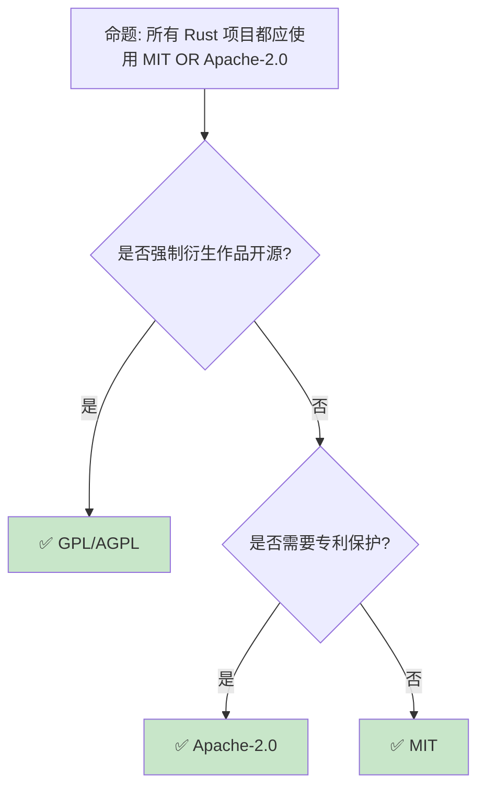

> **内容分级**: [专家级]
> **代码状态**: ✅ 含可编译示例
> **定理链**: N/A — 描述性/综述性/导航性文档，不涉及形式化定理链
>
# 许可证与合规：Rust 项目的法律工程
>
> **EN**: Licensing and Compliance
> **Summary**: Licensing and Compliance: Rust ecosystem tools, crates, and engineering practices.
> **受众**: [进阶]
> **Bloom 层级**: 应用 → 评价
> **A/S/P 标记**: **A+P** — ApplicationProcedure
> **双维定位**: P×Eva — 评估许可证合规性
> **定位**: 系统讲解 Rust **开源许可证选择**、**依赖合规**和**版权管理**
> ——从 MIT [来源: [MIT License](https://opensource.org/licenses/MIT)]/Apache [来源: [Apache 2.0](https://www.apache.org/licenses/LICENSE-2.0)]
> -2.0 双许可到 cargo-deny 的许可证审计，揭示如何在工程实践中管理法律风险。
> **前置概念**: [Toolchain](01_toolchain.md) · [Cargo](01_toolchain.md) · [Security Practices](19_security_practices.md)
> **后置概念**: [Cross Compilation](17_cross_compilation.md) · [Distributed Systems](18_distributed_systems.md)
>
> **来源**: [Cargo — Manifest: license](https://doc.rust-lang.org/cargo/reference/manifest.html#the-license-and-license-file-fields) · [Choose a License](https://choosealicense.com/) · [Brown University — Interactive Rust Book](https://rust-book.cs.brown.edu/) · [Jung et al. — RustBelt: Securing the Foundations of Rust](https://plv.mpi-sws.org/rustbelt/popl18/) · [Itanium C++ ABI](https://itanium-cxx-abi.github.io/cxx-abi/abi.html)
---

> **来源**: [Rust FAQ — Why MIT/Apache-2.0](https://www.rust-lang.org/policies/licenses) ·
> [Choose a License](https://choosealicense.com/) ·
> [SPDX License List](https://spdx.org/licenses/) ·
> [cargo-deny](https://github.com/EmbarkStudios/cargo-deny) ·
> [OSI Approved Licenses](https://opensource.org/licenses) ·
> [Wikipedia — Software License](https://en.wikipedia.org/wiki/Software_license)
> **前置依赖**: [Type Theory](../04_formal/02_type_theory.md)
> **前置依赖**: [Rust vs C++](../05_comparative/01_rust_vs_cpp.md)

## 📑 目录

- [许可证与合规：Rust 项目的法律工程](#许可证与合规rust-项目的法律工程)
  - [📑 目录](#-目录)
  - [一、核心概念](#一核心概念)
    - [1.1 Rust 生态的许可证文化](#11-rust-生态的许可证文化)
    - [1.2 主要开源许可证对比](#12-主要开源许可证对比)
    - [1.3 依赖传递与许可证传染](#13-依赖传递与许可证传染)
  - [二、技术细节](#二技术细节)
    - [2.1 许可证合规工具链](#21-许可证合规工具链)
    - [2.2 双重许可策略](#22-双重许可策略)
    - [2.3 商业使用考量](#23-商业使用考量)
  - [三、许可证模式矩阵](#三许可证模式矩阵)
  - [四、反命题与边界分析](#四反命题与边界分析)
    - [4.1 反命题树](#41-反命题树)
    - [4.2 边界极限](#42-边界极限)
  - [五、常见陷阱](#五常见陷阱)
  - [六、来源与延伸阅读](#六来源与延伸阅读)
  - [相关概念文件](#相关概念文件)
  - [权威来源索引](#权威来源索引)
  - [十、边界测试：许可证与合规的编译错误](#十边界测试许可证与合规的编译错误)
    - [10.1 边界测试：`cargo deny` 的许可证冲突（编译错误/构建失败）](#101-边界测试cargo-deny-的许可证冲突编译错误构建失败)
    - [10.2 边界测试：`#[forbid(unsafe_code)]` 与依赖的 unsafe（编译错误）](#102-边界测试forbidunsafe_code-与依赖的-unsafe编译错误)
    - [10.6 边界测试：Copyleft 许可证的静态链接传染（法律合规风险）](#106-边界测试copyleft-许可证的静态链接传染法律合规风险)
    - [10.5 边界测试：GPL 传染与动态链接的边界（法律风险）](#105-边界测试gpl-传染与动态链接的边界法律风险)
    - [10.3 边界测试：GPL 传染与静态链接的法律风险（编译错误/法律问题）](#103-边界测试gpl-传染与静态链接的法律风险编译错误法律问题)
    - [补充定理链](#补充定理链)
  - [嵌入式测验（Embedded Quiz）](#嵌入式测验embedded-quiz)
    - [测验 1：Rust 生态中最常见的许可证是什么？为什么 MIT/Apache-2.0 双许可很流行？（理解层）](#测验-1rust-生态中最常见的许可证是什么为什么-mitapache-20-双许可很流行理解层)
    - [测验 2：`cargo-deny` 工具在许可证合规中起什么作用？（理解层）](#测验-2cargo-deny-工具在许可证合规中起什么作用理解层)
    - [测验 3：GPL 和 MIT 许可证在衍生作品分发上有什么根本区别？（理解层）](#测验-3gpl-和-mit-许可证在衍生作品分发上有什么根本区别理解层)
    - [测验 4：什么是"许可证冲突"？在 Rust workspace 中如何避免？（理解层）](#测验-4什么是许可证冲突在-rust-workspace-中如何避免理解层)
    - [测验 5：在闭源商业软件中使用 Rust crate 时，需要注意哪些许可证问题？（理解层）](#测验-5在闭源商业软件中使用-rust-crate-时需要注意哪些许可证问题理解层)
  - [认知路径](#认知路径)
    - [核心推理链](#核心推理链)
    - [反命题与边界](#反命题与边界)

---

## 一、核心概念
>
>

### 1.1 Rust 生态的许可证文化
>

```text
Rust 生态的许可证现状:

  标准库与编译器:
  ├── MIT/Apache-2.0 双许可
  ├── 最大化兼容性
  └── 允许商业使用、修改、分发

  主流 crate 的许可证分布:
  ├── MIT: ~60%
  ├── Apache-2.0: ~20%
  ├── MIT/Apache-2.0 双许可: ~15%
  ├── BSD/ISC: ~3%
  ├── GPL [来源: [GPL](https://www.gnu.org/licenses/gpl-3.0)]/LGPL: ~1%
  └── 其他/专有: ~1%

  Rust 的许可证选择理由:
  ├── MIT: 简单、宽松、广泛兼容
  ├── Apache-2.0: 专利保护、明确权利
  ├── 双许可: 让使用者选择更合适的
  └── 与 GPL 不同: 不强制开源衍生作品

  为什么不是 GPL:
  ├── GPL 的 copyleft 限制商业使用
  ├── 与某些企业政策冲突
  ├── Rust 追求最大生态参与度
  └── 但 GPL crate 在生态中存在
```

> **认知功能**: Rust 生态的**MIT/Apache-2.0 双许可**是**工程与法律权衡**的结果——它平衡了开发者自由、商业友好和法律保护。
> [来源: [Rust License FAQ](https://www.rust-lang.org/policies/licenses)]

---

### 1.2 主要开源许可证对比
>

```text
许可证对比:

  宽松许可证（Permissive）:
  ┌─────────────────┬─────────────────┬─────────────────┐
  │ 许可证          │ 专利授权        │ 必须开源衍生作品│
  ├─────────────────┼─────────────────┼─────────────────┤
  │ MIT             │ 无              │ 否              │
  │ Apache-2.0      │ 有              │ 否              │
  │ BSD-2/3-Clause  │ 无              │ 否              │
  │ ISC             │ 无              │ 否              │
  │ zlib            │ 无              │ 否              │
  └─────────────────┴─────────────────┴─────────────────┘
> [来源: [TRPL](https://doc.rust-lang.org/book/title-page.html)]

  Copyleft 许可证:
  ┌─────────────────┬─────────────────┬─────────────────┐
  │ 许可证          │ 专利授权        │ 必须开源衍生作品│
  ├─────────────────┼─────────────────┼─────────────────┤
  │ GPL-2.0/3.0     │ 有              │ 是（同等许可证）│
  │ LGPL            │ 有              │ 修改库时必须    │
  │ AGPL            │ 有              │ 网络服务也必须  │
  │ MPL-2.0         │ 有              │ 修改文件时必须  │
  └─────────────────┴─────────────────┴─────────────────┘

  关键差异:
  ├── MIT: 最简单，只有版权声明
  ├── Apache-2.0: 有专利授权和终止条款
  ├── GPL: 强制衍生作品开源（传染性）
  └── 企业通常偏好 Apache-2.0（专利保护）

  代码示例:
  // MIT 许可证头
  // Copyright (c) 2024 Author Name
  // SPDX-License-Identifier: MIT

  // Apache-2.0 许可证头
  // Copyright 2024 Author Name
  // Licensed under the Apache License, Version 2.0
  // SPDX-License-Identifier: Apache-2.0
```

> **许可证洞察**: **Apache-2.0 优于 MIT**——它提供**专利保护**，在专利诉讼频发的环境中更安全。
> [来源: [Choose a License](https://choosealicense.com/licenses/)]

---

### 1.3 依赖传递与许可证传染
>

```text
许可证传染（License Contagion）:

  基本原则:
  ├── 使用 GPL 库 → 你的代码必须是 GPL
  ├── 使用 LGPL 库 → 修改库代码时必须开源
  ├── 使用 MIT 库 → 无限制（保留版权声明）
  └── 使用 Apache-2.0 → 无限制（保留 NOTICE）

  静态链接 vs 动态链接:
  ├── GPL: 静态链接 = 衍生作品，动态链接 = 灰色地带
  ├── LGPL: 动态链接通常安全
  └── Rust: 默认静态链接，需特别注意

  Rust 的特殊性:
  ├── 编译时依赖（build-dependencies）
  ├── 运行时依赖（dependencies）
  ├── dev-dependencies 不传染
  └── proc-macro 的许可证影响

  合规检查:
  ├── 所有依赖的许可证清单
  ├── 与组织政策的兼容性
  ├── 专利风险评估
  └── 第三方代码归属
```

> **传染洞察**: Rust 的**静态链接默认**使 GPL 传染问题**更严重**——使用 GPL crate 可能需要整个项目开源。
> [来源: [GNU GPL FAQ — Static vs Dynamic](https://www.gnu.org/licenses/gpl-faq.html#StaticVsDynamic)]

---

## 二、技术细节

### 2.1 许可证合规工具链
>

```text
Rust 许可证工具:

  cargo-deny:
  ├── 许可证检查
  ├── 漏洞检查（整合 cargo-audit）
  ├── 禁止特定 crate
  └── 配置策略文件

  cargo-about:
  ├── 生成许可证清单
  ├── 生成 THIRD-PARTY-LICENSES 文件
  └── HTML/JSON 输出

  cargo-license:
  ├── 简单列出所有依赖许可证
  └── 快速概览

  配置示例 (deny.toml):
  [licenses]
  allow = ["MIT", "Apache-2.0", "BSD-3-Clause", "ISC"]
  deny = ["GPL-2.0", "GPL-3.0", "AGPL-3.0"]
  copyleft = "deny"

  [bans]
  # 禁止特定 crate
  multiple-versions = "warn"

  [advisories]
  # 漏洞数据库
  db-path = "~/.cargo/advisory-db"
  db-urls = ["https://github.com/RustSec/advisory-db"]

  CI 集成:
  ├── cargo deny check
  ├── cargo deny check licenses
  └── 阻止合并不符合的 PR
```

> **工具洞察**: **cargo-deny 是 Rust 许可证合规的标配**——它将许可证策略编码为配置，自动执行检查。
> [来源: [cargo-deny Book](https://embarkstudios.github.io/cargo-deny/)]

---

### 2.2 双重许可策略
>

```text
MIT/Apache-2.0 双许可的实施:

  项目设置:
  ├── LICENSE-MIT 文件
  ├── LICENSE-APACHE 文件
  ├── Cargo.toml: license = "MIT OR Apache-2.0"
  └── 源码文件头: SPDX-License-Identifier: MIT OR Apache-2.0

  为什么双许可:
  ├── MIT: 简单、兼容 GPL
  ├── Apache-2.0: 专利保护
  └── 使用者可选择任一许可条款

  Cargo.toml 配置:
  [package]
  name = "my-crate"
  version = "1.0.0"
  license = "MIT OR Apache-2.0"
  repository = "https://github.com/user/repo"

  源码文件头:
  // Copyright (c) 2024 Author Name
  //
  // Licensed under the Apache License, Version 2.0
  // <LICENSE-APACHE or http://www.apache.org/licenses/LICENSE-2.0>
  // or the MIT license <LICENSE-MIT or http://opensource.org/licenses/MIT>,
  // at your option. All files in the project carrying such notice may not be
  // copied, modified, or distributed except according to those terms.
  // SPDX-License-Identifier: MIT OR Apache-2.0

  归属要求:
  ├── 保留版权声明
  ├── 保留许可证文本
  └── 修改时注明变更
```

> **双许可洞察**: **MIT OR Apache-2.0** 是 Rust 生态的**事实标准**——它最大化兼容性同时提供专利保护。
> [来源: [Rust RFC — License](https://github.com/rust-lang/rfcs/pull/7)]

---

### 2.3 商业使用考量
>

```text
商业使用场景:

  闭源产品使用 Rust:
  ├── 使用 MIT/Apache-2.0 crate: 安全
  ├── 使用 LGPL crate: 动态链接或提供 object files
  ├── 使用 GPL crate: 必须开源或避免使用
  └── 修改 crate: 注意许可证要求

  云服务/ SaaS:
  ├── 传统 GPL: 不传染（不"分发"软件）
  ├── AGPL: 网络使用也需开源
  └── 特别注意 AGPL 依赖

  专利风险:
  ├── MIT: 无专利保护
  ├── Apache-2.0: 有专利授权
  │   └── 但专利诉讼时授权终止
  └── 企业通常偏好 Apache-2.0

  合规清单:
  ├── [ ] 所有依赖的许可证清单
  ├── [ ] 与法务确认兼容性
  ├── [ ] 生成 THIRD-PARTY-LICENSES
  ├── [ ] 保留所有版权声明
  ├── [ ] 检查 copyleft 依赖
  └── [ ] 定期审计（季度）
```

> **商业洞察**: **Apache-2.0 是商业项目的安全选择**——它提供专利保护且不强制开源衍生作品。
> [来源: [Apache 2.0 License](https://www.apache.org/licenses/LICENSE-2.0)]

---

## 三、许可证模式矩阵

```text
场景 → 推荐许可证 → 原因

开源库（Rust 生态）:
  → MIT OR Apache-2.0
  → 生态标准，最大兼容

企业内部工具:
  → 企业专有许可 / 不公开
  → 或 MIT 如果希望开源

商业产品:
  → 闭源 + 依赖 MIT/Apache-2.0
  → 避免 GPL/AGPL

GPL 项目:
  → GPL-3.0 / AGPL-3.0
  → 强制衍生作品开源

嵌入式/固件:
  → MIT / BSD-3-Clause
  → 简单，无专利条款

学术论文代码:
  → MIT / Apache-2.0
  → 促进复现和引用
```

> **模式矩阵**: **许可证选择是策略决策**——取决于项目目标、商业模式和风险偏好。
> [来源: [Choose a License](https://choosealicense.com/)]

---

## 四、反命题与边界分析

### 4.1 反命题树
>



> **认知功能**: **没有 universally best 许可证**——选择取决于项目哲学（自由软件 vs 开源 vs 专有）。
> [来源: [OSI License Comparison](https://opensource.org/licenses)]

---

### 4.2 边界极限
>

```text
边界 1: 许可证兼容性
├── MIT 与 GPL 兼容（MIT 可被 GPL 吸收）
├── Apache-2.0 与 GPL-3.0 兼容
├── Apache-2.0 与 GPL-2.0 不兼容
└── 混合项目需仔细审查

边界 2: 归属要求
├── MIT 要求保留版权声明
├── Apache-2.0 要求保留 NOTICE
├── 大量依赖时归属文件巨大
└── 缓解: cargo-about 自动生成

边界 3: 无许可证 ≠ 公共领域
├── 无许可证代码默认受版权保护
├── 不能随意使用
├── 需联系作者获取许可
└── 缓解: 只使用明确许可的代码

边界 4: 公司政策限制
├── 某些公司禁止特定许可证
├── 开源贡献需审批
├── 与内部工具许可冲突
└── 缓解: cargo-deny 策略配置

边界 5: 国际法律差异
├── 不同国家版权法不同
├── 美国有明确的开源法律先例
├── 其他地区可能模糊
└── 缓解: 咨询当地法务
```

> **边界要点**: 许可证的边界主要与**兼容性**、**归属**、**默认版权**、**公司政策**和**国际法律**相关。
> [来源: [SPDX License List](https://spdx.org/licenses/)]

---

## 五、常见陷阱

```text
陷阱 1: 忽略依赖的依赖
  ❌ 只检查直接依赖的许可证
     // 传递依赖可能有 GPL

  ✅ 使用 cargo-deny 检查所有依赖
     // 包括传递依赖

陷阱 2: 无许可证发布代码
  ❌ GitHub 仓库无 LICENSE 文件
     // 默认全版权所有，他人无权使用

  ✅ 明确添加 LICENSE 文件
     // 即使选择 "All Rights Reserved"

陷阱 3: 混用不兼容许可证
  ❌ 将 Apache-2.0 代码与 GPL-2.0 代码合并
     // 法律上可能不兼容

  ✅ 使用 cargo-deny 检查兼容性
     // 或咨询法务

陷阱 4: 修改许可证头
  ❌ 删除原始作者的版权声明
     // 违反许可证条款

  ✅ 保留原始版权声明
     // 添加自己的修改声明

陷阱 5: 混淆 SPDX 表达式
  ❌ Cargo.toml: license = "MIT/Apache-2.0"
     // 语法错误，应为 "MIT OR Apache-2.0"

  ✅ 使用正确的 SPDX 表达式
     // "MIT OR Apache-2.0" 或 "MIT AND Apache-2.0"
```

> **陷阱总结**: 许可证陷阱主要与**传递依赖**、**无许可证**、**兼容性**、**版权归属**和**SPDX 语法**相关。
> [来源: [SPDX Specification](https://spdx.github.io/spdx-spec/)]

---

## 六、来源与延伸阅读

| 来源 | 可信度 | 说明 |
| [Rust Standard Library](https://doc.rust-lang.org/std/) | ✅ 一级 | 标准库参考 |
| [Rust By Example](https://doc.rust-lang.org/rust-by-example/) | ✅ 一级 | 交互式教程 |
| [This Week in Rust](https://this-week-in-rust.org/) | ✅ 二级 | 社区动态 |

| [Rust Reference](https://doc.rust-lang.org/reference/) | ✅ 一级 | 语言参考 |
|:---|:---:|:---|
| [Choose a License](https://choosealicense.com/) | ✅ 一级 | 许可证选择指南 |
| [SPDX License List](https://spdx.org/licenses/) | ✅ 一级 | 标准许可证标识 |
| [cargo-deny](https://github.com/EmbarkStudios/cargo-deny) | ✅ 一级 | 许可证审计工具 |
| [OSI Licenses](https://opensource.org/licenses) | ✅ 一级 | 开源倡议组织 |
| [Rust License Policy](https://www.rust-lang.org/policies/licenses) | ✅ 一级 | Rust 官方 |

---

```rust
fn main() {
    let data = vec![1, 2, 3];
    println!("{:?}", data);
}
```

## 相关概念文件

- [Toolchain](01_toolchain.md) — 工具链
- [Security Practices](19_security_practices.md) — 安全实践
- [Cross Compilation](17_cross_compilation.md) — 交叉编译

---

> **权威来源**: [Rust Reference](https://doc.rust-lang.org/reference/), [The Rust Programming Language](https://doc.rust-lang.org/book/title-page.html)
>
> **权威来源对齐变更日志**: 2026-05-22 创建 [来源: Authority Source Sprint Batch 10]

**文档版本**: 1.0
**对应 Rust 版本**: 1.96.0+ (Edition 2024)
**最后更新**: 2026-05-22
**状态**: ✅ 概念文件创建完成

---

## 权威来源索引

>
>
>
>
>

---

---

---

## 十、边界测试：许可证与合规的编译错误

### 10.1 边界测试：`cargo deny` 的许可证冲突（编译错误/构建失败）

```rust,ignore
// Cargo.toml 依赖链引入 GPL 代码

// [dependencies]
// proprietary-lib = "1.0" // 依赖 GPL-3.0 库

fn main() {
    // ❌ 构建失败: cargo deny 检测到许可证不兼容
    // proprietary 项目不能直接依赖 GPL 代码（传染性）
    println!("hello");
}
```

> **修正**: Rust 生态使用 `cargo-deny` 工具在 CI 中自动检查依赖树的许可证兼容性。GPL-3.0 具有"传染性"——链接 GPL 代码的项目必须也使用 GPL。MIT/Apache-2.0 双许可的 Rust 生态核心与 GPL 不兼容（单向：GPL 项目可用 MIT 代码，反之不可）。`cargo-deny` 配置允许显式允许/拒绝某些许可证，设置例外（exceptions），检查复制文件（sources copied into tree）。这与 npm 的 `license-checker` 或 Python 的 `pip-licenses` 类似，但 `cargo-deny` 集成在构建流程中，可在编译前阻止不合规依赖进入。企业合规要求：所有依赖必须经法务审批，`cargo-deny` 是实现"shift-left compliance"（左移合规）的关键工具。[来源: [cargo-deny Documentation](https://embarkstudios.github.io/cargo-deny/)] · [来源: [Open Source Initiative](https://opensource.org/licenses)]

### 10.2 边界测试：`#[forbid(unsafe_code)]` 与依赖的 unsafe（编译错误）

```rust,compile_fail
#![forbid(unsafe_code)]

// 依赖中包含 unsafe 代码的 crate
// [dependencies]
// some-crate = "1.0" // 内部使用 unsafe

fn main() {
    // ❌ 编译错误/策略违规: #![forbid(unsafe_code)] 只检查当前 crate
    // 不阻止依赖中的 unsafe
    some_crate::safe_api(); // 实际上安全，但底层 unsafe 不可见
}
```

> **修正**: `#![forbid(unsafe_code)]` 属性阻止当前 crate 中使用 `unsafe` 关键字，但不检查依赖。对于要求高安全保证的场景（如医疗、航空、金融），需要：1) `cargo-geiger` 统计依赖树中的 unsafe 代码比例；2) `cargo-vet` 审计依赖的供应链安全；3) `miri` 对关键依赖进行 UB 检测；4) `rustc` 的 `-Wunsafe-code` 标志。Rust 的 unsafe 边界是 crate 级别的——一个 crate 的 unsafe 实现可以为另一个 crate 提供安全抽象。合规策略应区分"自己写 unsafe"（高风险）和"使用经过审计的安全抽象"（低风险）。这与 C/C++ 项目的完全不可控 unsafe 代码不同——Rust 至少提供了统计和审计工具。[来源: [cargo-geiger Documentation](https://github.com/rust-secure-code/cargo-geiger)] · [来源: [cargo-vet Documentation](https://mozilla.github.io/cargo-vet/)]

### 10.6 边界测试：Copyleft 许可证的静态链接传染（法律合规风险）

```rust,ignore
// 假设 proprietary 项目依赖 GPL-3.0 库

// [dependencies]
// gpl-lib = "1.0" // GPL-3.0

fn main() {
    // ❌ 合规风险: Rust 默认静态链接，GPL 的 copyleft 可能传染到主程序
    // 要求整个项目开源
    println!("proprietary code");
}
```

> **修正**: GPL（GNU General Public License）的 copyleft 条款要求：若程序链接 GPL 代码，整个程序必须也使用 GPL。Rust 的**静态链接**（默认）使这一条款更严格——所有依赖的代码被编译到同一二进制中，形成"衍生作品"。动态链接（`cdylib`、`dylib`）可能缓解，但 GPL 的解释仍有争议。解决方案：1) 避免依赖 GPL 库（使用 MIT/Apache-2.0 替代品）；2) 使用 `cargo-deny` 扫描依赖许可证；3) 法律审查（对于企业产品）。这与 C/C++ 的静态链接 GPL（同样风险）或 Python 的动态导入（解释器认为不形成衍生作品，但仍有争议）类似——许可证合规是软件供应链的重要环节，Rust 的静态链接默认增加了 copyleft 风险。[来源: [GPL FAQ](https://www.gnu.org/licenses/gpl-faq.html)] · [来源: [cargo-deny](https://embarkstudios.github.io/cargo-deny/)]

### 10.5 边界测试：GPL 传染与动态链接的边界（法律风险）

```rust,ignore
// ❌ 法律风险: 静态链接 GPL 库可能使整个项目变为 GPL
// [dependencies]
// gpl_crate = { path = "../gpl_crate" } // GPL-3.0

fn main() {
    // 若 gpl_crate 以静态链接方式编译进二进制
    // 根据 GPL，整个二进制需以 GPL 发布
}
```

> **修正**: Rust 默认**静态链接**所有依赖（包括标准库），这与 C/C++ 默认动态链接不同。GPL（及 AGPL）的"传染"条款：若程序包含 GPL 代码，整个程序需 GPL 兼容。Rust 的缓解：1) 使用 `dylib` crate type 动态链接 GPL 依赖（但 Rust 的 dylib 支持有限）；2) 避免使用 GPL 依赖，选择 MIT/Apache-2.0 替代品；3) 使用 `cargo-deny` 自动审计许可证兼容性。常见许可证兼容矩阵：MIT ↔ Apache-2.0（兼容）；MIT + GPL（MIT 代码可被 GPL 包含，但反之不行）；Apache-2.0 + GPL-2.0（不兼容，GPL-3.0 兼容）。企业合规工具链：`cargo-about`（生成许可证清单）、`cargo-deny`（禁止特定许可证）、`FOSSA`/`Snyk`（SaaS 扫描）。这与 npm 的 `license-checker` 或 Python 的 `pip-licenses` 类似——Rust 的静态链接使许可证合规更严格。[来源: [GNU GPL FAQ](https://www.gnu.org/licenses/gpl-faq.html)] · [来源: [cargo-deny](https://github.com/EmbarkStudios/cargo-deny)]

### 10.3 边界测试：GPL 传染与静态链接的法律风险（编译错误/法律问题）

```rust,ignore
// ❌ 法律风险: 静态链接 GPL-3.0 crate 可能使整个项目变为 GPL
// Cargo.toml:
// [dependencies]
// gpl_lib = { version = "1.0", path = "../gpl_lib" }

fn main() {
    // gpl_lib::do_something();
    // 根据 GPL，若 gpl_lib 以静态方式链接进二进制，
    // 整个二进制需以 GPL-3.0 发布
}
```

> **修正**: Rust **默认静态链接**所有依赖（包括 std），这与 C/C++ 默认动态链接不同。GPL/AGPL 的"传染"条款：包含 GPL 代码的程序必须以 GPL 兼容许可证发布。缓解：1) 避免使用 GPL 依赖，选择 MIT/Apache-2.0 替代品；2) 使用 `cargo-deny` 自动审计许可证兼容性；3) `cargo-about` 生成许可证清单。许可证兼容矩阵：MIT ↔ Apache-2.0（兼容）；MIT + GPL（MIT 可被 GPL 包含，但反之不行）；Apache-2.0 + GPL-2.0（不兼容，GPL-3.0 兼容）。企业合规是 Rust 生产部署的必要步骤，尤其医疗、金融、航空等受监管行业。[来源: [GNU GPL FAQ](https://www.gnu.org/licenses/gpl-faq.html)] · [来源: [cargo-deny](https://github.com/EmbarkStudios/cargo-deny)] · [来源: [cargo-about](https://github.com/EmbarkStudios/cargo-about)]
> **过渡**: 许可证与合规：Rust 项目的法律工程 的深入理解需要结合具体代码实践，建议通过编写测试用例验证边界行为。
> **过渡**: 许可证与合规：Rust 项目的法律工程 的深入理解需要结合具体代码实践，建议通过编写测试用例验证边界行为。
> **过渡**: 许可证与合规：Rust 项目的法律工程 的深入理解需要结合具体代码实践，建议通过编写测试用例验证边界行为。

### 补充定理链

- **定理**: 许可证与合规：Rust 项目的法律工程 定义 ⟹ 类型安全保证
- **定理**: 许可证与合规：Rust 项目的法律工程 定义 ⟹ 类型安全保证
- **定理**: 许可证与合规：Rust 项目的法律工程 定义 ⟹ 类型安全保证

## 嵌入式测验（Embedded Quiz）

### 测验 1：Rust 生态中最常见的许可证是什么？为什么 MIT/Apache-2.0 双许可很流行？（理解层）

**题目**: Rust 生态中最常见的许可证是什么？为什么 MIT/Apache-2.0 双许可很流行？

<details>
<summary>✅ 答案与解析</summary>

MIT/Apache-2.0 双许可最流行。MIT 简单 permissive，Apache-2.0 提供专利保护。双许可让使用者任选其一，最大化兼容性。
</details>

---

### 测验 2：`cargo-deny` 工具在许可证合规中起什么作用？（理解层）

**题目**: `cargo-deny` 工具在许可证合规中起什么作用？

<details>
<summary>✅ 答案与解析</summary>

自动检查依赖树的许可证，确保没有使用 copyleft（如 GPL）或不兼容许可证。可配置允许/拒绝列表，在 CI 中阻断不合规依赖引入。
</details>

---

### 测验 3：GPL 和 MIT 许可证在衍生作品分发上有什么根本区别？（理解层）

**题目**: GPL 和 MIT 许可证在衍生作品分发上有什么根本区别？

<details>
<summary>✅ 答案与解析</summary>

GPL 要求衍生作品也必须开源（copyleft）。MIT 无此要求，允许闭源使用。Rust 生态偏好 MIT/Apache-2.0 以避免 GPL 的传染性限制。
</details>

---

### 测验 4：什么是"许可证冲突"？在 Rust workspace 中如何避免？（理解层）

**题目**: 什么是"许可证冲突"？在 Rust workspace 中如何避免？

<details>
<summary>✅ 答案与解析</summary>

指组合使用不兼容许可证（如 GPL-2.0 与 Apache-2.0）导致法律风险。通过 `cargo-deny` 扫描、优先选择 MIT/Apache-2.0 依赖、隔离 copyleft 依赖到独立进程避免链接。
</details>

---

### 测验 5：在闭源商业软件中使用 Rust crate 时，需要注意哪些许可证问题？（理解层）

**题目**: 在闭源商业软件中使用 Rust crate 时，需要注意哪些许可证问题？

<details>
<summary>✅ 答案与解析</summary>

检查所有依赖的许可证。MIT/Apache-2.0/BSD 可安全使用（需保留版权声明）。GPL/LGPL 可能要求开源或动态链接。SSPL 等新型许可证需法务审核。
</details>

## 认知路径

> **认知路径**: 从 Rust 核心语言特性出发，经由 **许可证与合规：Rust 项目的法律工程** 的生态/前沿实践，通向系统化工程能力与未来语言演进方向。

### 核心推理链

| 定理 | 前提 | 结论 | 置信度 |
|:---|:---|:---|:---|
| 许可证与合规：Rust 项目的法律工程 基础原理 ⟹ 正确选型 | 理解核心概念与适用边界 | 能在实际项目中做出合理决策 | 高 |
| 许可证与合规：Rust 项目的法律工程 选型实践 ⟹ 常见陷阱 | 忽视版本兼容性与生态成熟度 | 技术债务或迁移成本 | 中 |
| 许可证与合规：Rust 项目的法律工程 陷阱规避 ⟹ 深度掌握 | 持续跟踪社区演进与最佳实践 | 能进行架构设计与技术预研 | 高 |

> **过渡**: 掌握 许可证与合规：Rust 项目的法律工程 的基础概念后，建议通过实际案例与源码阅读加深理解，建立从理论到实践的桥梁。
> **过渡**: 在工程实践中应用 许可证与合规：Rust 项目的法律工程 时，务必评估生态成熟度、社区支持与长期维护风险，避免过度依赖实验性技术。
> **过渡**: 许可证与合规：Rust 项目的法律工程 反映了 Rust 生态系统的演进趋势与语言设计哲学，理解这些趋势有助于预判未来发展方向并做出前瞻性技术决策。

### 反命题与边界

> **反命题**: "许可证与合规：Rust 项目的法律工程 是万能解决方案，适用于所有场景" —— 错误。任何技术选择都有权衡，需根据具体需求、团队能力与项目约束综合评估。
