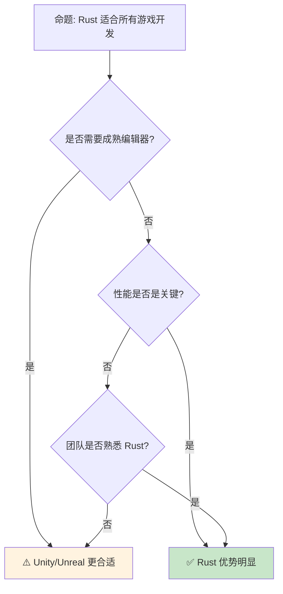

# Rust 游戏开发生态

> **Bloom 层级**: 应用 → 分析
> **定位**: 分析 Rust 在游戏开发领域的生态格局——从 Bevy ECS 到 WGPU 图形渲染，探讨 Rust 的内存安全与性能优势如何重塑游戏引擎设计。
> **前置概念**: [Concurrency](../03_advanced/01_concurrency.md) · [Type System](../01_foundation/04_type_system.md) · [Performance](../06_ecosystem/15_performance_optimization.md)
> **后置概念**: [WebAssembly](../06_ecosystem/11_webassembly.md) · [ECS](../06_ecosystem/04_application_domains.md)

---

> **来源**: [Bevy Engine](https://bevyengine.org/) · [WGPU](https://wgpu.rs/) · [Rust GameDev Working Group](https://gamedev.rs/) · [Are We Game Yet?](https://arewegameyet.rs/) · [Wikipedia — Entity Component System](https://en.wikipedia.org/wiki/Entity_component_system)

## 📑 目录
> [来源: [Rust Reference](https://doc.rust-lang.org/reference/)]
>
> [来源: [TRPL](https://doc.rust-lang.org/book/)]

- [Rust 游戏开发生态](#rust-游戏开发生态)
  - [📑 目录](#-目录)
  - [一、核心架构](#一核心架构)
    - [1.1 ECS 设计模式](#11-ecs-设计模式)
    - [1.2 Bevy 架构](#12-bevy-架构)
  - [二、图形渲染](#二图形渲染)
    - [2.1 WGPU — 跨平台图形](#21-wgpu--跨平台图形)
    - [2.2 渲染管线](#22-渲染管线)
  - [三、物理与音频](#三物理与音频)
    - [3.1 物理引擎](#31-物理引擎)
    - [3.2 音频系统](#32-音频系统)
  - [四、反命题与边界分析](#四反命题与边界分析)
    - [4.1 反命题树](#41-反命题树)
    - [4.2 边界极限](#42-边界极限)
  - [五、常见陷阱](#五常见陷阱)
  - [六、来源与延伸阅读](#六来源与延伸阅读)
  - [相关概念文件](#相关概念文件)

---

## 一、核心架构
> [来源: [Rust Reference](https://doc.rust-lang.org/reference/)]
>
> [来源: [TRPL](https://doc.rust-lang.org/book/)]

### 1.1 ECS 设计模式

```text
ECS (Entity-Component-System):

  核心概念:
  ├── Entity: 唯一标识符（通常 u64），无数据
  ├── Component: 纯数据（位置、速度、生命值）
  └── System: 处理逻辑（移动、碰撞、渲染）

  对比 OOP:
  ┌─────────────────┬─────────────────┬─────────────────┐
  │ 方面            │ OOP             │ ECS             │
  ├─────────────────┼─────────────────┼─────────────────┤
  │ 数据组织        │ 类层次结构      │ 平铺数组        │
  │ 组合            │ 继承            │ 组合            │
  │ 缓存友好        │ 指针追逐        │ SoA 布局        │
  │ 并行化          │ 困难            │ 天然并行        │
  │ 运行时灵活性    │ 低              │ 高              │
  └─────────────────┴─────────────────┴─────────────────┘
> [来源: [TRPL](https://doc.rust-lang.org/book/)]

  Rust 中的 ECS:
  ├── bevy_ecs: 最流行
  ├── hecs: 极简 ECS
  ├── specs: 并行 ECS
  └── legion: 数据驱动 ECS

  代码示例 (Bevy):

  #[derive(Component)]
  struct Position { x: f32, y: f32 }

  #[derive(Component)]
  struct Velocity { x: f32, y: f32 }

  fn move_system(
      mut query: Query<(&mut Position, &Velocity)>
  ) {
      for (mut pos, vel) in query.iter_mut() {
          pos.x += vel.x;
          pos.y += vel.y;
      }
  }
```

> **认知功能**: **ECS 将数据与逻辑解耦，实现缓存友好和天然并行**——Rust 的类型系统完美支持这种数据导向设计。
> [来源: [Bevy ECS](https://bevyengine.org/learn/book/getting-started/ecs/)]

---

### 1.2 Bevy 架构

```text
Bevy 引擎架构:

  App → 插件系统 → 系统调度
  ├── Renderer Plugin: WGPU 渲染
  ├── Audio Plugin: rodio 音频
  ├── Input Plugin: 键盘/鼠标/手柄
  ├── Asset Plugin: 资源加载
  └── 自定义插件

  系统调度:
  ├── Update: 每帧逻辑
  ├── FixedUpdate: 固定时间步长
  ├── Startup: 启动时一次
  └── 自定义阶段

  资源 (Resource):
  ├── 全局唯一数据（游戏状态、配置）
  └── 通过 Res<T> / ResMut<T> 访问

  事件 (Event):
  ├── 解耦通信机制
  └── 发送/接收事件

  代码示例:

  App::new()
      .add_plugins(DefaultPlugins)
      .add_systems(Startup, setup)
      .add_systems(Update, (move_system, collision_system))
      .run();
```

> **Bevy 洞察**: **Bevy 是 Rust 游戏开发的标杆**——利用 Rust 的所有权和类型系统实现编译期系统依赖图验证。
> [来源: [Bevy Architecture](https://bevyengine.org/learn/book/getting-started/ecs/)]

---

## 二、图形渲染
> [来源: [Rust Reference](https://doc.rust-lang.org/reference/)]
>
> [来源: [TRPL](https://doc.rust-lang.org/book/)]

### 2.1 WGPU — 跨平台图形

```text
WGPU:

  定位: Rust 的跨平台 GPU 抽象
  ├── 基于 WebGPU 标准
  ├── Vulkan/Metal/DX12/OpenGL 后端
  ├── 安全（类型安全的 GPU API）
  └── 零开销抽象

  对比:
  ┌─────────────────┬─────────────────┬─────────────────┐
  │ 方面            │ OpenGL          │ WGPU            │
  ├─────────────────┼─────────────────┼─────────────────┤
  │ 安全性          │ 运行时错误      │ 编译期验证      │
  │ 多线程          │ 受限            │ 原生支持        │
  │ 现代 GPU 特性   │ 部分支持        │ 完整支持        │
  │ 跨平台          │ 需适配          │ 统一 API        │
  │ WASM            │ WebGL           │ WebGPU          │
  └─────────────────┴─────────────────┴─────────────────┘
> [来源: [TRPL](https://doc.rust-lang.org/book/)]

  代码示例:

  let adapter = instance
      .request_adapter(&wgpu::RequestAdapterOptions::default())
      .await
      .unwrap();

  let (device, queue) = adapter
      .request_device(&wgpu::DeviceDescriptor::default(), None)
      .await
      .unwrap();
```

> **WGPU 洞察**: **WGPU 代表了 Rust 图形编程的未来**——类型安全、跨平台、现代 GPU 特性全支持。
> [来源: [WGPU](https://wgpu.rs/)] · [来源: [WebGPU Spec](https://www.w3.org/TR/webgpu/)]

---

### 2.2 渲染管线

```text
渲染管线:

  现代 GPU 渲染流程:
  ├── Vertex Shader: 顶点变换
  ├── Tessellation: 细分曲面
  ├── Geometry Shader: 几何处理
  ├── Rasterization: 光栅化
  ├── Fragment Shader: 像素着色
  └── Output Merger: 混合输出

  Rust 中的着色器:
  ├── wgpu: 运行时编译 WGSL
  ├── rust-gpu: 用 Rust 写 SPIR-V
  └── slang: 微软着色器语言

  rust-gpu:
  #[spirv(fragment)]
  pub fn main_fs(
      #[spirv(uniform, descriptor_set = 0, binding = 0)]
      constants: &ShaderConstants,
      output: &mut Vec4,
  ) {
      *output = Vec4::new(1.0, 0.0, 0.0, 1.0);
  }
```

> **渲染洞察**: **rust-gpu 是 Rust 在 GPU 编程领域的革命**——用安全语言编写着色器，编译到 SPIR-V。
> [来源: [rust-gpu](https://github.com/EmbarkStudios/rust-gpu)]

---

## 三、物理与音频
> [来源: [Rust Reference](https://doc.rust-lang.org/reference/)]

### 3.1 物理引擎

```text
Rust 物理引擎:

  rapier:
  ├── 2D/3D 刚体物理
  ├── 碰撞检测
  ├── 关节约束
  └── 与 bevy_rapier 集成

  nphysics:
  ├── ncollide 碰撞检测
  ├── 多种积分器
  └── 已归档（推荐 rapier）

  heron:
  ├── 2D 物理
  └── Bevy 集成

  代码示例 (rapier):

  let rigid_body = RigidBodyBuilder::dynamic()
      .translation(vector![0.0, 10.0, 0.0])
      .build();
  let collider = ColliderBuilder::ball(0.5).build();
```

> **物理洞察**: **Rapier 是 Rust 物理引擎的领导者**——纯 Rust 实现，性能接近 Bullet/PhysX。
> [来源: [Rapier Physics](https://rapier.rs/)]

---

### 3.2 音频系统

```text
Rust 音频生态:

  rodio:
  ├── 纯 Rust 音频播放
  ├── WAV/MP3/FLAC/Vorbis 支持
  ├── 3D 音频空间化
  └── Bevy 默认音频后端

  cpal:
  ├── 跨平台音频 I/O
  ├── 低延迟音频
  └── 音频处理基础

  symphonia:
  ├── 纯 Rust 媒体框架
  ├── 多种音频格式
  └── 元数据提取
```

> **音频洞察**: **Rodio 和 CPAL 覆盖游戏音频全需求**——从播放到底层音频 I/O。
> [来源: [rodio](https://github.com/RustAudio/rodio)] · [来源: [cpal](https://github.com/RustAudio/cpal)]

---

## 四、反命题与边界分析
> [来源: [Rust Reference](https://doc.rust-lang.org/reference/)]
>
> [来源: [Rust Reference](https://doc.rust-lang.org/reference/)]

### 4.1 反命题树



> **认知功能**: **Rust 游戏开发适合技术驱动型团队**——需要编辑器生态的应选 Unity/Unreal。
> [来源: [Are We Game Yet?](https://arewegameyet.rs/)]

---

### 4.2 边界极限

```text
边界 1: 编辑器生态
├── 无 Unity/Unreal 级别的可视化编辑器
├── Bevy 编辑器仍在开发中
└── 缓解: 使用场景编辑器插件

边界 2: 学习曲线
├── ECS 思维模式与传统 OOP 不同
├── 借用检查器限制某些设计模式
└── 缓解: 渐进式学习，从简单项目开始

边界 3: 资产管线
├── 3D 模型/动画导入工具不如成熟引擎
├── 需要手动集成 gltf/FBX 加载
└── 缓解: bevy_gltf、自定义管线

边界 4: 调试工具
├── 无内置帧调试器
├── GPU 调试依赖平台工具
└── 缓解: RenderDoc、Xcode GPU 调试

边界 5: 移动平台
├── iOS/Android 支持仍在完善
├── 构建流程比 Unity 复杂
└── 缓解: bevy_mobile、cargo-mobile
```

> **边界要点**: Rust 游戏开发的边界与**编辑器**、**学习曲线**、**资产管线**、**调试**和**移动平台**相关。
> [来源: [Bevy Roadmap](https://bevyengine.org/)]

---

## 五、常见陷阱
> [来源: [Rust Reference](https://doc.rust-lang.org/reference/)]

```text
陷阱 1: ECS 反模式
  ❌ 将逻辑放入 Component
     #[derive(Component)]
     struct Player { update: fn() } // 错误！

  ✅ 逻辑在 System 中，Component 纯数据
     fn player_system(query: Query<&Player>) { ... }

陷阱 2: 系统顺序依赖
  ❌ 隐式依赖导致非确定性
     // move_system 和 collision_system 顺序不确定

  ✅ 显式配置系统顺序
     .add_systems(Update, move_system.before(collision_system))

陷阱 3: 资源竞争
  ❌ 多个系统同时写入同一 Resource
     fn sys1(mut res: ResMut<GameState>) { ... }
     fn sys2(mut res: ResMut<GameState>) { ... }

  ✅ 使用 Commands 延迟修改
     fn sys1(mut commands: Commands) {
         commands.insert_resource(NewState);
     }

陷阱 4: 过度使用 Arc<Mutex>
  ❌ ECS 数据通过共享状态访问
     // 放弃 ECS 优势

  ✅ 使用 Query 和事件通信
     events.send(MyEvent);

陷阱 5: 忽略 WGPU 后端差异
  ❌ 假设所有后端行为一致
     // Vulkan 和 Metal 的某些限制不同

  ✅ 测试多平台
     // CI 中测试不同后端
```

> **陷阱总结**: Rust 游戏开发的陷阱主要与**ECS 设计**、**系统调度**、**资源竞争**、**共享状态**和**跨平台**相关。
> [来源: [Bevy Learn](https://bevyengine.org/learn/)]

---

## 六、来源与延伸阅读
> [来源: [Rust Reference](https://doc.rust-lang.org/reference/)]

| 来源 | 可信度 | 说明 |
|:---|:---:|:---|
| [Bevy Engine](https://bevyengine.org/) | ✅ 一级 | 官方文档 |
| [WGPU](https://wgpu.rs/) | ✅ 一级 | 图形 API |
| [Rapier](https://rapier.rs/) | ✅ 二级 | 物理引擎 |
| [Are We Game Yet?](https://arewegameyet.rs/) | ✅ 二级 | 生态概览 |
| [Rust GameDev WG](https://gamedev.rs/) | ✅ 二级 | 社区新闻 |
| [rust-gpu](https://github.com/EmbarkStudios/rust-gpu) | ✅ 二级 | GPU 着色器 |

---


```rust
fn main() {
    let data = vec![1, 2, 3];
    println!("{:?}", data);
}
```

### 编译验证示例

```rust
#[derive(Debug, Clone, Copy)]
struct Vec2 {
    x: f32,
    y: f32,
}

impl Vec2 {
    fn add(self, other: Vec2) -> Vec2 {
        Vec2 { x: self.x + other.x, y: self.y + other.y }
    }
}

fn main() {
    let a = Vec2 { x: 1.0, y: 2.0 };
    let b = Vec2 { x: 3.0, y: 4.0 };
    println!("{:?}", a.add(b));
}
```

```rust
#[derive(Debug)]
enum GameState {
    Menu,
    Playing { score: u32 },
    GameOver,
}

fn main() {
    let state = GameState::Playing { score: 100 };
    println!("{:?}", state);
}
```

```rust
fn main() {
    let mut positions = vec![(0.0, 0.0), (1.0, 2.0)];
    for (x, y) in &mut positions {
        *x += 1.0;
        *y += 1.0;
    }
    println!("{:?}", positions);
}
```

## 相关概念文件
> [来源: [Rust Reference](https://doc.rust-lang.org/reference/)]
>
> [来源: [Rust Reference](https://doc.rust-lang.org/reference/)]

- [Concurrency](../03_advanced/01_concurrency.md) — 并发
- [Performance](../06_ecosystem/15_performance_optimization.md) — 性能优化
- [WebAssembly](../06_ecosystem/11_webassembly.md) — WebAssembly
- [Design Patterns](../06_ecosystem/02_patterns.md) — 设计模式

---

> **权威来源**: [Rust Reference](https://doc.rust-lang.org/reference/)
>
> **权威来源对齐变更日志**: 2026-05-22 创建 [来源: Authority Source Sprint Batch 11]

**文档版本**: 1.0
**对应 Rust 版本**: 1.96.0+ (Edition 2024)
**最后更新**: 2026-05-22
**状态**: ✅ 概念文件创建完成
