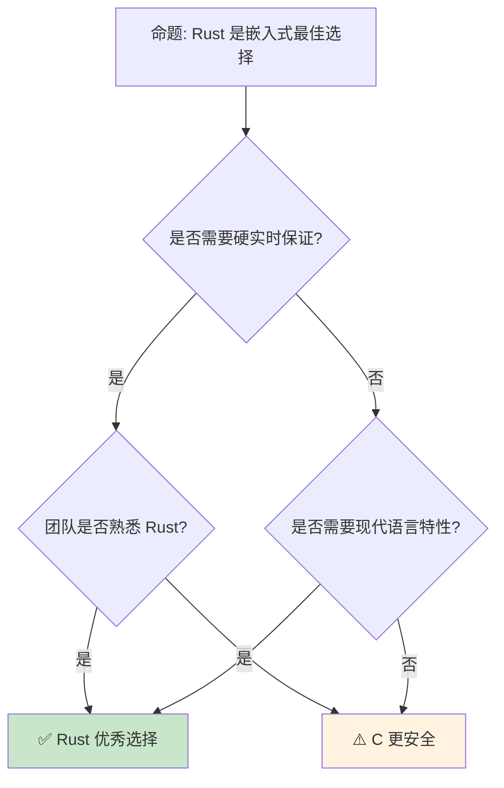

# Rust 嵌入式系统开发
>
> **受众**: [进阶]

> **Bloom 层级**: 应用 → 分析
> **A/S/P 标记**: **A+S+P** — ApplicationStructureProcedure
> **双维定位**: P×Cre — 设计嵌入式系统架构
> **定位**: 探讨 Rust 在嵌入式系统领域的应用——从 `no_std` 到裸机编程，分析内存安全如何保证关键系统的可靠性。
> **前置概念**: [Unsafe](../03_advanced/03_unsafe.md) ·
> [Memory Management](../02_intermediate/03_memory_management.md) ·
> [Type System](../01_foundation/04_type_system.md)
> **后置概念**: [Cross Compilation](./17_cross_compilation.md) ·
> [RTOS](../06_ecosystem/04_application_domains.md)

---

> **来源**: [The Embedded Rust Book](https://docs.rust-embedded.org/book/) ·
> [The Rustonomicon](https://doc.rust-lang.org/nomicon/) ·
> [Rust Embedded Working Group](https://github.com/rust-embedded/wg) ·
> [Wikipedia — Embedded System](https://en.wikipedia.org/wiki/Embedded_system) ·
> [Ferrous Systems](https://ferrous-systems.com/)

## 📑 目录

- [Rust 嵌入式系统开发](#rust-嵌入式系统开发)
  - [📑 目录](#-目录)
  - [一、核心概念](#一核心概念)
    - [1.1 no\_std](#11-no_std)
    - [1.2 裸机编程](#12-裸机编程)
    - [1.3 内存布局](#13-内存布局)
  - [二、硬件抽象层](#二硬件抽象层)
    - [2.1 PAC — 外设访问 crate](#21-pac--外设访问-crate)
    - [2.2 HAL — 硬件抽象层](#22-hal--硬件抽象层)
    - [2.3 BSP — 板级支持包](#23-bsp--板级支持包)
  - [三、实时系统](#三实时系统)
    - [3.1 实时约束](#31-实时约束)
    - [3.2 RTIC 框架](#32-rtic-框架)
  - [四、反命题与边界分析](#四反命题与边界分析)
    - [4.1 反命题树](#41-反命题树)
    - [4.2 边界极限](#42-边界极限)
  - [五、常见陷阱](#五常见陷阱)
  - [六、来源与延伸阅读](#六来源与延伸阅读)
    - [编译验证示例](#编译验证示例)
  - [相关概念文件](#相关概念文件)
  - [权威来源索引](#权威来源索引)
  - [十、边界测试：嵌入式系统的编译错误](#十边界测试嵌入式系统的编译错误)
    - [10.1 边界测试：`no_std` 中的 `println!`（编译错误）](#101-边界测试no_std-中的-println编译错误)
    - [10.2 边界测试：中断处理器的 `static mut`（编译错误）](#102-边界测试中断处理器的-static-mut编译错误)
    - [10.3 边界测试：临界区的中断禁用与 `unsafe` 的误用（运行时数据竞争）](#103-边界测试临界区的中断禁用与-unsafe-的误用运行时数据竞争)
    - [10.4 边界测试：`no_std` 中的 `panic` 处理与固件大小（编译错误/链接错误）](#104-边界测试no_std-中的-panic-处理与固件大小编译错误链接错误)
    - [10.4 边界测试：裸机（`no_std`）中的 `alloc` 与全局分配器缺失（编译错误）](#104-边界测试裸机no_std中的-alloc-与全局分配器缺失编译错误)

---

## 一、核心概念
>
>

### 1.1 no_std
>

```text
no_std:

  定义: 不使用标准库的 Rust 程序
  ├── 无堆分配（默认）
  ├── 无 panic 处理（需自定义）
  ├── 无字符串格式化（需实现）
  └── 核心库（core）可用

  #![no_std] 属性:
  ├── 禁用 std
  ├── 使用 core 和 alloc（可选）
  ├── 自定义 panic_handler
  └── 自定义全局分配器（可选）

  代码示例:

  #![no_std]
  #![no_main]

  use core::panic::PanicInfo;

  #[panic_handler]
  fn panic(_info: &PanicInfo) -> ! {
      loop {}
  }

  #[no_mangle]
  pub extern "C" fn _start() -> ! {
      // 裸机入口
      loop {}
  }

  对比 std:
  ┌─────────────────┬─────────────────┬─────────────────┐
  │ 特性            │ std             │ no_std          │
  ├─────────────────┼─────────────────┼─────────────────┤
  │ 堆分配          │ Vec, Box, String│ 需自定义分配器  │
  │  panic          │ 默认处理        │ 需 panic_handler│
  │ 文件 I/O        │ std::fs         │ 不可用          │
  │ 网络            │ std::net        │ 不可用          │
  │ 线程            │ std::thread     │ 不可用          │
  │ 格式化          │ println!        │ 需实现          │
  └─────────────────┴─────────────────┴─────────────────┘
```

> **认知功能**: **no_std 是 Rust 进入资源受限环境的通行证**——通过剥离标准库，Rust 可以运行在几 KB RAM [来源: [RAM](https://en.wikipedia.org/wiki/Random-access_memory)] 的设备上。
> [来源: [The Embedded Rust Book](https://docs.rust-embedded.org/book/intro/no-std.html)]

---

### 1.2 裸机编程
>

```text
裸机编程（Bare Metal）:

  启动流程:
  ├── 复位向量 → _start()
  ├── 初始化栈指针
  ├── 初始化 .bss（零初始化数据）
  ├── 复制 .data（初始化数据）
  ├── 调用 main()
  └── 永不返回（或进入空闲循环）

  内存区域:
  ├── .text: 代码（Flash [来源: [Embedded Memory](https://en.wikipedia.org/wiki/Flash_memory)]/ROM）
  ├── .rodata: 只读数据
  ├── .data: 已初始化可写数据（RAM）
  ├── .bss: 未初始化数据（RAM）
  └── 栈: 函数调用（RAM）

  链接脚本:
  MEMORY {
      FLASH (rx) : ORIGIN = 0x08000000, LENGTH = 512K
      RAM (rwx)  : ORIGIN = 0x20000000, LENGTH = 128K
  }

  关键约束:
  ├── 无操作系统服务
  ├── 直接操作硬件寄存器
  ├── 中断处理程序（ISR）
  └── 内存布局精确控制
```

> **裸机洞察**: **裸机编程是 Rust unsafe 能力的核心应用场景**——直接内存映射、中断处理、寄存器操作都需要 unsafe。
> [来源: [Rustonomicon](https://doc.rust-lang.org/nomicon/)]

---

### 1.3 内存布局
>

```text
嵌入式内存布局:

  #[repr(C)] 结构体:
  ├── C 兼容布局
  ├── 可预测字段偏移
  └── 硬件寄存器映射

  寄存器映射:
  #[repr(C)]
  struct GPIO [来源: [GPIO](https://en.wikipedia.org/wiki/General-purpose_input/output)]A {
      moder: u32,    // 0x00
      otyper: u32,   // 0x04
      ospeedr: u32,  // 0x08
      pupdr: u32,    // 0x0C
      idr: u32,      // 0x10
      odr: u32,      // 0x14
  }

  内存映射 I/O:
  const GPIOA: *mut GPIOA = 0x4002_0000 as *mut GPIOA;
  unsafe { (*GPIOA).odr = 1 << 5; } // 设置 PA5

  Volatile 访问:
  ├── 编译器不能优化掉内存访问
  ├── core::ptr::read_volatile / write_volatile
  └── 设备寄存器必须 volatile 访问
```

> **内存洞察**: **精确的内存布局控制是嵌入式 Rust 的核心能力**——类型系统保证寄存器映射的正确性。
> [来源: [Rust Embedded Book — Memory](https://docs.rust-embedded.org/book/peripherals/index.html)]

---

## 二、硬件抽象层

### 2.1 PAC — 外设访问 crate
>

```text
PAC (Peripheral Access Crate):

  生成: 从 SVD（System View Description）文件自动生成
  ├── 每个外设一个结构体
  ├── 每个寄存器一个字段
  ├── 位域访问
  └── unsafe 操作

  代码示例:

  use stm32f4::stm32f407;

  let dp = stm32f407::Peripherals::take().unwrap();
  dp.GPIOA.moder.modify(|_, w| {
      w.moder5().output()
  });

  特点:
  ├── 100% 寄存器覆盖
  ├── 零运行时开销
  ├── 类型安全寄存器访问
  └── 由 svd2rust 生成
```

> **PAC 洞察**: **PAC 是嵌入式 Rust 的基石**——自动生成的类型安全寄存器访问消除了手写寄存器映射的错误。
> [来源: [svd2rust](https://docs.rs/svd2rust/latest/svd2rust/)]

---

### 2.2 HAL — 硬件抽象层
>

```text
HAL (Hardware Abstraction Layer):

  设计: 跨平台外设 API
  ├── 统一接口（GPIO、UART [来源: [UART](https://en.wikipedia.org/wiki/Universal_asynchronous_receiver-transmitter)]、SPI [来源: [SPI](https://en.wikipedia.org/wiki/Serial_Peripheral_Interface)]、I2C [来源: [I2C](https://en.wikipedia.org/wiki/I%C2%B2C)]）
  ├── 不同芯片实现相同 trait
  ├── 可移植性
  └── 嵌入式-hal trait

  嵌入式-hal trait:
  ├── InputPin / OutputPin
  ├── Serial (UART)
  ├── Spi
  ├── I2c
  ├── Pwm
  └── Adc

  代码示例:

  use embedded_hal::digital::OutputPin;

  let mut led = gpioa.pa5.into_push_pull_output();
  led.set_high();

  可移植性:
  ├── 同一代码可在 STM32、NRF、ESP32 运行
  ├──  trait 抽象硬件差异
  └── 生态系统共享驱动
```

> **HAL 洞察**: **embedded-hal 是 Rust 嵌入式生态的统一标准**——驱动可跨平台复用，极大提高开发效率。
> [来源: [embedded-hal](https://docs.rs/embedded-hal/latest/embedded_hal/)]

---

### 2.3 BSP — 板级支持包
>

```text
BSP (Board Support Package):

  作用: 特定开发板的配置
  ├── 引脚映射（LED、按钮、传感器）
  ├── 时钟配置
  ├── 外设初始化
  └── 示例代码

  代码示例:

  use microbit::hal::prelude::*;
  use microbit::hal::gpio::Level;

  let board = microbit::Board::take().unwrap();
  let mut led = board.pins.p0_13.into_push_pull_output(Level::Low);
  led.set_high();

  生态:
  ├── 每个流行开发板有 BSP
  ├── 降低入门门槛
  └── 硬件即代码
```

> **BSP 洞察**: **BSP 是嵌入式 Rust 的"即插即用"层**——抽象板级细节，让开发者专注于应用逻辑。
> [来源: [Rust Embedded Book — BSP](https://docs.rust-embedded.org/book/peripherals/a-first-attempt.html)]

---

## 三、实时系统

### 3.1 实时约束
>

```text
实时系统分类:

  硬实时（Hard Real-Time）:
  ├── 截止期限必须满足
  ├── 错过 = 系统故障
  ├── 汽车制动、航空控制
  └── 需要确定性分析

  软实时（Soft Real-Time）:
  ├── 截止期限尽量满足
  ├── 偶尔错过可接受
  ├── 音视频播放
  └── 统计保证足够

  Rust 优势:
  ├── 无 GC 停顿
  ├── 编译期资源管理
  ├── 确定性内存分配
  └── 零成本抽象

  挑战:
  ├── 标准库非实时安全（panic、alloc）
  ├── 需要 RTOS 或裸机调度
  └── 中断延迟分析
```

> **实时洞察**: **Rust 的无 GC 特性使其成为实时系统的理想选择**——确定性行为是实时系统的核心需求。
> [来源: [Ferrous Systems — Real-Time](https://ferrous-systems.com/)]

---

### 3.2 RTIC 框架
>

```text
RTIC (Real-Time Interrupt-driven Concurrency):

  设计: 基于硬件中断的并发框架
  ├── 任务 = 中断服务程序
  ├── 资源 = 共享数据
  ├── 优先级 = 中断优先级
  └── 编译期调度分析

  代码示例:

  #[rtic::app(device = stm32f4::stm32f407, peripherals = true)]
  mod app {
      #[shared]
      struct Shared {
          counter: u32,
      }

      #[local]
      struct Local {}

      #[init]
      fn init(cx: init::Context) -> (Shared, Local, init::Monotonics) {
          (Shared { counter: 0 }, Local {}, init::Monotonics())
      }

      #[task(binds = TIM2, priority = 1, shared = [counter])]
      fn tick(mut cx: tick::Context) {
          cx.shared.counter.lock(|counter| {
              *counter += 1;
          });
      }
  }

  特点:
  ├── 零运行时开销
  ├── 编译期资源冲突检测
  ├── 基于 Cortex-M [来源: [ARM Cortex-M](https://developer.arm.com/Processors/Cortex-M)] NVIC [来源: [ARM NVIC](https://developer.arm.com/documentation/100166/0001/Nested-Vectored-Interrupt-Controller)]
  └── 类型安全任务通信
```

> **RTIC 洞察**: **RTIC 将 Rust 的所有权模型应用于实时调度**——编译期保证资源无冲突，零运行时开销。
> [来源: [RTIC](https://rtic.rs/)]

---

## 四、反命题与边界分析

### 4.1 反命题树



> **认知功能**: **Rust 是 C 的现代替代，但团队技能是决定性因素**——渐进式迁移是最佳策略。
> [来源: [Rust Embedded WG](https://github.com/rust-embedded/wg)]

---

### 4.2 边界极限

```text
边界 1: unsafe 密度
├── 嵌入式代码中 unsafe 比例高
├── 硬件访问本质 unsafe
└── 缓解: 限制 unsafe 范围，充分测试

边界 2: 调试工具
├── GDB 支持不如 C 成熟
├── probe-rs 仍在发展
└── 缓解: probe-rs、J-Link、OpenOCD

边界 3: 生态成熟度
├── 驱动覆盖率不如 C
├── 某些芯片无 Rust 支持
└── 缓解: 社区驱动，逐步覆盖

边界 4: 编译时间
├── 嵌入式目标编译慢
├── 需要交叉编译工具链
└── 缓解: sccache、预编译依赖

边界 5: 二进制大小
├── Rust 二进制可能较大
├── 需要 LTO、opt-level = z
└── 缓解: strip、panic = abort
```

> **边界要点**: Rust 嵌入式的边界与**unsafe**、**调试**、**生态**、**编译时间**和**二进制大小**相关。
> [来源: [Rust Embedded Book](https://docs.rust-embedded.org/book/)]

---

## 五、常见陷阱

```text
陷阱 1: 忽略 volatile
  ❌ 直接读写设备寄存器
     let val = *ptr; // 编译器可能优化掉！

  ✅ 使用 volatile 读写
     let val = core::ptr::read_volatile(ptr);

陷阱 2: 堆分配在 no_std
  ❌ 在 no_std 中使用 Vec/String
     let v = vec![1, 2, 3]; // 编译错误！

  ✅ 使用数组或自定义分配器
     let v = heapless::Vec::<u8, 16>::new();

陷阱 3: 中断中的 panic
  ❌ panic 在中断中
     // panic_handler 未实现或无限循环

  ✅ 自定义 panic_handler
     #[panic_handler]
     fn panic(_: &PanicInfo) -> ! { loop {} }

陷阱 4: 资源竞争
  ❌ 中断和主循环访问同一数据无保护
     static mut COUNTER: u32 = 0;
     // 中断中修改，主循环读取 — 数据竞争

  ✅ 使用临界区或原子操作
     use core::sync::atomic::{AtomicU32, Ordering};
     static COUNTER: AtomicU32 = AtomicU32::new(0);

陷阱 5: 栈溢出
  ❌ 大数组分配在栈上
     let buf = [0u8; 10000]; // 可能溢出！

  ✅ 使用静态分配或堆
     static mut BUF: [u8; 10000] = [0; 10000];
```

> **陷阱总结**: Rust 嵌入式的陷阱主要与**volatile**、**no_std**、**panic**、**并发**和**内存**相关。
> [来源: [Rust Embedded Book — Troubleshooting](https://docs.rust-embedded.org/book/)]

---

## 六、来源与延伸阅读

| 来源 | 可信度 | 说明 |
|:---|:---:|:---|
| [Embedded Rust Book](https://docs.rust-embedded.org/book/) | ✅ 一级 | 官方指南 |
| [Rustonomicon](https://doc.rust-lang.org/nomicon/) | ✅ 一级 | unsafe 指南 |
| [embedded-hal](https://docs.rs/embedded-hal/latest/) | ✅ 二级 | 硬件抽象 |
| [RTIC](https://rtic.rs/) | ✅ 二级 | 实时框架 |
| [probe-rs](https://probe.rs/) | ✅ 二级 | 调试工具 |
| [Ferrous Systems](https://ferrous-systems.com/) | ✅ 二级 | 培训咨询 |

---

```rust
fn main() {
    let data = vec![1, 2, 3];
    println!("{:?}", data);
}
```

### 编译验证示例

```rust
use core::sync::atomic::{AtomicU32, Ordering};

static COUNTER: AtomicU32 = AtomicU32::new(0);

fn main() {
    COUNTER.fetch_add(1, Ordering::Relaxed);
    println!("{}", COUNTER.load(Ordering::Relaxed));
}
```

```rust
#[repr(C)]
struct Register {
    value: u32,
}

fn main() {
    let reg = Register { value: 0xDEADBEEF };
    println!("{:x}", reg.value);
}
```

## 相关概念文件

- [Unsafe](../03_advanced/03_unsafe.md) — unsafe Rust
- [Memory Management](../02_intermediate/03_memory_management.md) — 内存管理
- [Cross Compilation](./17_cross_compilation.md) — 交叉编译
- [Performance](./15_performance_optimization.md) — 性能优化

---

> **权威来源**: [Rust Reference](https://doc.rust-lang.org/reference/)
>
> **权威来源对齐变更日志**: 2026-05-22 创建 [来源: Authority Source Sprint Batch 11]

**文档版本**: 1.0
**对应 Rust 版本**: 1.96.0+ (Edition 2024)
**最后更新**: 2026-05-22
**状态**: ✅ 概念文件创建完成

---

## 权威来源索引

>
>
>
>
>
>
>

---

---

---

## 十、边界测试：嵌入式系统的编译错误

### 10.1 边界测试：`no_std` 中的 `println!`（编译错误）

```rust,compile_fail
#![no_std]

fn main() {
    // ❌ 编译错误: `println!` 需要 std 中的 io 模块
    println!("hello");
}

// 正确: 使用串口 HAL 或 semihosting
#![no_std]
use cortex_m_semihosting::hprintln;

fn fixed() {
    hprintln!("hello").unwrap(); // ✅ 通过调试接口输出
}
```

> **修正**: 嵌入式系统（ARM Cortex-M、RISC-V）通常无操作系统，因此 `#![no_std]` 禁用 `std` 库。`println!`、`Vec`、`String` 等需要 OS 支持的 API 不可用。替代方案：使用 `cortex-m-semihosting`（通过调试器输出）、`rtt-target`（实时传输）、或 UART HAL（硬件串口）。这与 Arduino 的 `Serial.println` 或 ESP-IDF 的 `ESP_LOG` 类似，但 Rust 的嵌入式生态通过 trait 抽象硬件（`embedded-hal`），实现跨平台可移植性。[来源: [The Rust Embedded Book](https://docs.rust-embedded.org/book/)]

### 10.2 边界测试：中断处理器的 `static mut`（编译错误）

```rust,compile_fail
#![no_std]

static mut COUNTER: u32 = 0;

#[no_mangle]
extern "C" fn timer_interrupt() {
    // ❌ 编译错误: use of mutable static is unsafe and requires unsafe function or block
    COUNTER += 1;
}
```

> **修正**: 嵌入式中断处理器共享全局状态时必须处理并发——中断可能随时抢占主循环。`static mut` 需要 `unsafe` 块访问，且存在数据竞争风险。正确做法：使用 `critical_section`（关中断）、原子类型（`AtomicU32`）、或 RTIC（Real-Time Interrupt-driven Concurrency）框架。RTIC 利用 Rust 的所有权系统，在编译期验证中断与主任务之间的资源分配，消除运行时竞争。这与 C 的 `volatile` + 关中断手动管理不同——Rust 的类型系统提供更高级别的并发安全保证。[来源: [RTIC Documentation](https://rtic.rs/)]

### 10.3 边界测试：临界区的中断禁用与 `unsafe` 的误用（运行时数据竞争）

```rust,compile_fail
static mut COUNTER: u32 = 0;

fn increment() {
    // ❌ 运行时数据竞争: 未禁用中断，可能被 ISR 抢占
    unsafe {
        COUNTER += 1;
    }
}

// 假设中断服务程序也修改 COUNTER
#[no_mangle]
unsafe extern "C" fn isr() {
    COUNTER += 1;
}
```

> **修正**: 嵌入式系统中，**中断服务程序**（ISR）可能随时抢占主代码，共享数据需要临界区保护。`unsafe` 块不保证原子性——`COUNTER += 1` 在 ARM Cortex-M 上是"读-改-写"三指令，ISR 可能在中间插入，导致更新丢失。解决方案：1) 使用 `cortex-m::interrupt::free`（禁用中断的临界区）；2) 使用原子类型（`core::sync::atomic::AtomicU32`）；3) 使用 RTIC（Real-Time Interrupt-driven Concurrency）框架（编译期检查资源冲突）。Rust 的嵌入式生态（`cortex-m`、`embedded-hal`、`rtic`）将并发安全引入裸机编程。这与 C 的 `__disable_irq()`/`__enable_irq()`（手动开关中断，易遗漏）或 FreeRTOS 的互斥量（ heavier，需 OS 支持）不同——Rust 的类型系统可帮助管理临界区（如 RTIC 的任务优先级分析）。[来源: [The Embedded Rust Book](https://docs.rust-embedded.org/book/)] · [来源: [RTIC Documentation](https://rtic.rs/)]

### 10.4 边界测试：`no_std` 中的 `panic` 处理与固件大小（编译错误/链接错误）

```rust,ignore
#![no_std]

fn main() {
    // ❌ 链接错误: panic_handler 未定义
    // no_std 环境中必须自定义 panic 行为
    panic!("boot failure");
}

// 正确: 提供 panic_handler
// #[cfg(not(test))]
// #[panic_handler]
// fn panic(_info: &core::panic::PanicInfo) -> ! {
//     loop {}
// }
```

> **修正**: `#![no_std]` 环境中，标准库的 panic 处理（栈展开、错误消息打印）不可用。必须提供自定义的 `#[panic_handler]`：1) `loop {}`（最小化，无限循环，适合硬实时系统）；2) 重启系统（`cortex_m::peripheral::SCB::sys_reset()`）；3) 日志记录后 halt（需 UART 驱动）。panic handler 的选择影响固件大小：`panic = "abort"` 比 `panic = "unwind"` 小（无展开代码），自定义 handler 比默认 `core::panicking` 更小。嵌入式开发中，固件大小常受限（如 64KB Flash），每个字节都重要。这与 C 的 `assert`（调用 `abort()`，依赖 libc）或 Arduino 的 `Serial.println` + `while(1)`（类似 Rust 的自定义 handler）类似——Rust 的 `panic_handler` 是显式、可定制的错误终止机制。[来源: [The Embedded Rust Book](https://docs.rust-embedded.org/book/)] · [来源: [Rust Reference — Panic Handler](https://doc.rust-lang.org/reference/runtime.html#the-panic_handler-attribute)]

### 10.4 边界测试：裸机（`no_std`）中的 `alloc` 与全局分配器缺失（编译错误）

```rust,ignore
#![no_std]
extern crate alloc;

use alloc::vec::Vec;

fn main() {
    // ❌ 编译错误: no_std + alloc 需要全局分配器
    let mut v = Vec::new();
    v.push(1);
}
```

> **修正**: `#![no_std]` 禁用标准库，但可通过 `extern crate alloc` 使用 `Vec`、`String`、`Box` 等堆分配类型。**必须**提供全局分配器：1) 使用 `linked_list_allocator`（简单链表分配器）；2) 使用 `embedded-alloc`（Cortex-M 的 TLSF 分配器）；3) 自定义分配器（实现 `GlobalAlloc` trait）。裸机环境无操作系统提供的堆，需手动管理内存区域（定义 `.bss` 或特定 RAM 区域为堆）。`#[global_allocator]` 标记静态分配器实例。这与 C 的 `malloc`（依赖 libc 或自定义实现）或 FreeRTOS 的 `pvPortMalloc`（RTOS 提供）类似——Rust 的 `alloc` crate 提供标准接口，但底层分配器需嵌入式开发者提供。[来源: [The Embedded Rust Book](https://docs.rust-embedded.org/book/)] · [来源: [alloc crate](https://doc.rust-lang.org/alloc/index.html)]
> **过渡**: Rust 嵌入式系统开发 的深入理解需要结合具体代码实践，建议通过编写测试用例验证边界行为。
> **过渡**: Rust 嵌入式系统开发 的深入理解需要结合具体代码实践，建议通过编写测试用例验证边界行为。
> **过渡**: Rust 嵌入式系统开发 的深入理解需要结合具体代码实践，建议通过编写测试用例验证边界行为。

### 补充定理链

- **定理**: Rust 嵌入式系统开发 定义 ⟹ 类型安全保证
- **定理**: Rust 嵌入式系统开发 定义 ⟹ 类型安全保证
- **定理**: Rust 嵌入式系统开发 定义 ⟹ 类型安全保证

## 认知路径

> **认知路径**: 从 Rust 核心语言特性出发，经由 **Rust 嵌入式系统开发** 的生态/前沿实践，通向系统化工程能力与未来语言演进方向。

### 核心推理链

| 定理 | 前提 | 结论 | 置信度 |
|:---|:---|:---|:---|
| Rust 嵌入式系统开发 基础原理 ⟹ 正确选型 | 理解核心概念与适用边界 | 能在实际项目中做出合理决策 | 高 |
| Rust 嵌入式系统开发 选型实践 ⟹ 常见陷阱 | 忽视版本兼容性与生态成熟度 | 技术债务或迁移成本 | 中 |
| Rust 嵌入式系统开发 陷阱规避 ⟹ 深度掌握 | 持续跟踪社区演进与最佳实践 | 能进行架构设计与技术预研 | 高 |

> **过渡**: 掌握 Rust 嵌入式系统开发 的基础概念后，建议通过实际案例与源码阅读加深理解，建立从理论到实践的桥梁。

> **过渡**: 在工程实践中应用 Rust 嵌入式系统开发 时，务必评估生态成熟度、社区支持与长期维护风险，避免过度依赖实验性技术。

> **过渡**: Rust 嵌入式系统开发 反映了 Rust 生态系统的演进趋势与语言设计哲学，理解这些趋势有助于预判未来发展方向并做出前瞻性技术决策。

### 反命题与边界

> **反命题**: "Rust 嵌入式系统开发 是万能解决方案，适用于所有场景" —— 错误。任何技术选择都有权衡，需根据具体需求、团队能力与项目约束综合评估。
