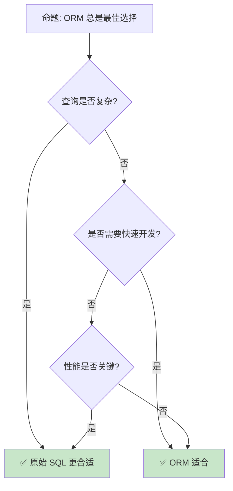

# Rust 数据库访问生态

> **Bloom 层级**: 应用 → 分析
> **定位**: 分析 Rust 的数据库访问生态——从 SQLx 的编译期检查到 Diesel 的 ORM [来源: [Wikipedia — ORM](https://en.wikipedia.org/wiki/Object%E2%80%93relational_mapping)]，探讨类型安全如何消除运行时查询错误。
> **前置概念**: [Async](../03_advanced/02_async.md) · [Type System](../01_foundation/04_type_system.md) · [Error Handling](../02_intermediate/04_error_handling.md)
> **后置概念**: [Performance](../06_ecosystem/15_performance_optimization.md) · [Web Development](../06_ecosystem/04_application_domains.md)

---

> **来源**: [SQLx](https://github.com/launchbadge/sqlx) · [Diesel](https://diesel.rs/) · [SeaORM](https://www.sea-ql.org/SeaORM/) · [Rust Database Guide](https://rust-lang-nursery.github.io/rust-cookbook/database.html) · [Wikipedia — ORM](https://en.wikipedia.org/wiki/Object%E2%80%93relational_mapping)

## 📑 目录

- [Rust 数据库访问生态](#rust-数据库访问生态)
  - [📑 目录](#-目录)
  - [一、核心概念](#一核心概念)
    - [1.1 SQLx — 编译期检查](#11-sqlx--编译期检查)
    - [1.2 Diesel — 类型安全 ORM](#12-diesel--类型安全-orm)
    - [1.3 SeaORM — 异步 ORM](#13-seaorm--异步-orm)
  - [二、查询模式](#二查询模式)
    - [2.1 原始 SQL](#21-原始-sql)
    - [2.2 查询构建器](#22-查询构建器)
    - [2.3 迁移管理](#23-迁移管理)
  - [三、连接管理](#三连接管理)
    - [3.1 连接池](#31-连接池)
    - [3.2 事务](#32-事务)
  - [四、反命题与边界分析](#四反命题与边界分析)
    - [4.1 反命题树](#41-反命题树)
    - [4.2 边界极限](#42-边界极限)
  - [五、常见陷阱](#五常见陷阱)
  - [六、来源与延伸阅读](#六来源与延伸阅读)
  - [相关概念文件](#相关概念文件)

---

## 一、核心概念

### 1.1 SQLx — 编译期检查

```text
SQLx:

  核心特性:
  ├── 编译期 SQL 验证（query! 宏）
  ├── 零运行时开销
  ├── 异步原生
  ├── 多数据库支持（PostgreSQL [来源: [PostgreSQL](https://www.postgresql.org/)], MySQL [来源: [MySQL](https://www.mysql.com/)], SQLite [来源: [SQLite](https://www.sqlite.org/)]）
  └── 无 ORM 的纯 SQL

  编译期检查:
  query!("SELECT id, name FROM users WHERE id = $1", user_id)
      .fetch_one(&pool)
      .await?;
  // 编译时检查:
  // 1. SQL 语法正确
  // 2. 表和列存在
  // 3. 类型匹配
  // 4. 参数数量正确

  对比传统方式:
  ┌─────────────────┬─────────────────┬─────────────────┐
  │ 方面            │ 运行时检查      │ SQLx 编译期     │
  ├─────────────────┼─────────────────┼─────────────────┤
  │ 错误发现        │ 运行时/测试     │ 编译时          │
  │ 类型安全        │ 运行时转换      │ 编译期推导      │
  │ 重构安全        │ 需搜索字符串    │ 编译器报错      │
  │ 运行时开销      │ 解析/验证       │ 零开销          │
  │ 灵活性          │ 高              │ 中              │
  └─────────────────┴─────────────────┴─────────────────┘
```

> **认知功能**: **SQLx 将数据库错误从运行时转移到编译期**——重构时编译器自动捕获失效查询。
> [来源: [SQLx](https://github.com/launchbadge/sqlx)]

---

### 1.2 Diesel — 类型安全 ORM

```text
Diesel:

  设计: 查询构建器的类型安全
  ├── Schema 由 derive 宏生成
  ├── 查询类型化
  ├── 编译期验证
  └── 零成本抽象

  代码示例:

  use diesel::prelude::*;

  #[derive(Queryable)]
  struct User {
      id: i32,
      name: String,
  }

  let users = users::table
      .filter(users::name.eq("Alice"))
      .load::<User>(&mut conn)?;

  类型安全:
  ├── filter 条件类型检查
  ├── select 列匹配结构体
  ├── join 条件验证
  └── 返回类型推导

  迁移:
  ├── diesel migration generate create_users
  ├── diesel migration run
  └── 版本化数据库变更
```

> **Diesel 洞察**: **Diesel 是 Rust ORM 的标杆**——编译期保证查询正确性，无需运行时验证。
> [来源: [Diesel](https://diesel.rs/)]

---

### 1.3 SeaORM — 异步 ORM

```text
SeaORM:

  设计: 异步优先的 ORM
  ├── 类似 ActiveRecord 的 API
  ├── 关系定义（HasOne, HasMany, BelongsTo）
  ├── 迁移支持
  ├── 多数据库
  └── 适合快速开发

  代码示例:

  use sea_orm::{entity::*, query::*};

  let cake: Option<cake::Model> = Cake::find_by_id(1)
      .one(&db)
      .await?;

  let fruits: Vec<fruit::Model> = cake
      .find_related(Fruit)
      .all(&db)
      .await?;

  对比 Diesel:
  ┌─────────────────┬─────────────────┬─────────────────┐
  │ 方面            │ Diesel          │ SeaORM          │
  ├─────────────────┼─────────────────┼─────────────────┤
  │ API 风格        │ Query Builder   │ ActiveRecord    │
  │ 异步            │ 需适配          │ 原生            │
  │ 类型安全        │ 强              │ 中              │
  │ 编译时间        │ 长              │ 中              │
  │ 学习曲线        │ 陡              │ 缓              │
  │ 生态成熟度      │ 高              │ 中              │
  └─────────────────┴─────────────────┴─────────────────┘
```

> **SeaORM 洞察**: **SeaORM 是 Rust 异步 ORM 的首选**——牺牲了部分类型安全换取开发效率。
> [来源: [SeaORM](https://www.sea-ql.org/SeaORM/)] · [来源: [Tokio Docs](https://tokio.rs/)]

---

## 二、查询模式

### 2.1 原始 SQL

```text
原始 SQL 模式:

  SQLx:
  let rows = sqlx::query("SELECT id, name FROM users")
      .fetch_all(&pool)
      .await?;

  // 类型化结果
  let row = sqlx::query_as::<_, User>("SELECT id, name FROM users")
      .fetch_one(&pool)
      .await?;

  适用场景:
  ├── 复杂查询（CTE、窗口函数）
  ├── 数据库特定特性
  ├── 性能优化查询
  └── 已有 SQL 迁移

  注意事项:
  ├── query! 宏需要数据库连接编译
  ├── 离线模式: sqlx-data.json
  └── CI/CD 考虑
```

> **SQL 洞察**: **原始 SQL 提供最大灵活性**——SQLx 的编译期检查保证了安全性。
> [来源: [SQLx Queries](https://docs.rs/sqlx/latest/sqlx/macro.query.html)]

---

### 2.2 查询构建器

```text
查询构建器:

  Diesel:
  users::table
      .inner_join(posts::table)
      .filter(users::name.eq("Alice"))
      .select((users::id, posts::title))
      .order_by(posts::created_at.desc())
      .limit(10)
      .load::<(i32, String)>(&mut conn)?;

  SeaORM:
  Cake::find()
      .find_also_related(Fruit)
      .filter(cake::Column::Name.eq("Cheese Cake"))
      .order_by_asc(cake::Column::Id)
      .all(&db)
      .await?;

  优势:
  ├── 类型安全
  ├── 可组合
  ├── IDE 支持
  └── 重构安全
```

> **构建器洞察**: **查询构建器在类型安全和灵活性之间取得平衡**——适合大多数 CRUD 场景。
> [来源: [Diesel Queries](https://diesel.rs/guides/getting-started.html)]

---

### 2.3 迁移管理

```text
迁移管理:

  Diesel:
  ├── diesel.toml 配置
  ├── migrations/ 目录
  ├── diesel migration run
  └── 版本化控制

  SeaORM:
  ├── CLI 工具
  ├── migration crate
  ├── 程序内嵌迁移
  └── 异步执行

  SQLx:
  ├── migrate! 宏
  ├── 编译期验证
  └── 运行时执行

  最佳实践:
  ├── 迁移幂等性
  ├── 测试迁移回滚
  ├── 版本控制
  └── 环境一致性
```

> **迁移洞察**: **迁移管理是生产数据库的核心**——所有主要 ORM 都提供成熟的迁移工具。
> [来源: [Diesel Migrations](https://diesel.rs/guides/migrations.html)]

---

## 三、连接管理

### 3.1 连接池

```text
连接池:

  设计: 复用数据库连接
  ├── 最小/最大连接数
  ├── 连接超时
  ├── 空闲回收
  └── 健康检查

  SQLx Pool:
  let pool = sqlx::postgres::PgPoolOptions::new()
      .max_connections(5)
      .connect("postgres://...")
      .await?;

  配置:
  ├── max_connections: 最大连接数
  ├── min_connections: 最小保持连接
  ├── connect_timeout: 连接超时
  ├── idle_timeout: 空闲回收
  └── max_lifetime: 连接最大寿命

  注意:
  ├── 连接数过多耗尽数据库资源
  ├── 连接数过少导致等待
  └── 根据负载调优
```

> **连接池洞察**: **连接池是数据库访问的必备组件**——正确配置直接影响系统吞吐量。
> [来源: [SQLx Pool](https://docs.rs/sqlx/latest/sqlx/pool/struct.Pool.html)]

---

### 3.2 事务

```text
事务:

  SQLx:
  let mut tx = pool.begin().await?;
  sqlx::query!("INSERT INTO ...")
      .execute(&mut tx)
      .await?;
  tx.commit().await?;

  Diesel:
  conn.transaction(|conn| {
      diesel::insert_into(users::table)
          .values(&new_user)
          .execute(conn)?;
      Ok(())
  })?;

  SeaORM:
  db.transaction(|txn| {
      Box::pin(async move {
          cake::ActiveModel { ... }
              .save(txn)
              .await?;
          Ok(())
      })
  }).await?;

  隔离级别:
  ├── Read Uncommitted
  ├── Read Committed
  ├── Repeatable Read
  └── Serializable
```

> **事务洞察**: **事务保证数据一致性**——Rust 的类型系统确保事务不会意外提交。
> [来源: [SQLx Transactions](https://docs.rs/sqlx/latest/sqlx/struct.Transaction.html)]

---

## 四、反命题与边界分析

### 4.1 反命题树



> **认知功能**: **ORM 适合 CRUD，原始 SQL 适合复杂查询**——两者互补使用。
> [来源: [SQLx vs ORM](https://github.com/launchbadge/sqlx)]

---

### 4.2 边界极限

```text
边界 1: 编译时间
├── Diesel 编译时间显著
├── 复杂查询类型推导慢
└── 缓解: 增量编译、拆分 crate

边界 2: 动态查询
├── 编译期检查无法处理动态 SQL
├── 运行时构建查询
└── 缓解: query_as 动态执行

边界 3: 数据库特性
├── ORM 抽象可能隐藏数据库特性
├── 窗口函数、CTE 等支持有限
└── 缓解: 使用原始 SQL  fallback

边界 4: 连接管理
├── 异步连接池复杂
├── 生命周期管理
└── 缓解: 使用成熟 crate（deadpool, bb8）

边界 5: 测试
├── 数据库测试需要真实连接
├── 设置和清理开销
└── 缓解: 使用 sqlx::test, testcontainers
```

> **边界要点**: 数据库访问的边界与**编译时间**、**动态查询**、**数据库特性**、**连接管理**和**测试**相关。
> [来源: [Rust Database Guide](https://rust-lang-nursery.github.io/rust-cookbook/database.html)]

---

## 五、常见陷阱

```text
陷阱 1: N+1 查询
  ❌ 循环中逐个查询
     for user in users {
         let posts = load_posts(user.id); // N 次查询！
     }

  ✅ 使用 join 或批量查询
     let users_with_posts = users::table
         .inner_join(posts::table)
         .load(&mut conn)?;

陷阱 2: 连接泄漏
  ❌ 事务未提交或回滚
     let tx = pool.begin().await?;
     // 提前返回，tx 未处理

  ✅ 使用 Drop 自动回滚
     // sqlx::Transaction 的 Drop 会自动回滚

陷阱 3: 类型不匹配
  ❌ 假设数据库类型与 Rust 类型匹配
     let count: i32 = query.fetch_one(&pool).await?;
     // count 可能是 i64

  ✅ 检查数据库类型映射
     let count: i64 = query.fetch_one(&pool).await?;

陷阱 4: 忽略 NULL
  ❌ 列可为 NULL 但 Rust 用非 Option
     #[derive(Queryable)]
     struct User { name: String } // name 可能 NULL

  ✅ 使用 Option
     #[derive(Queryable)]
     struct User { name: Option<String> }

陷阱 5: 连接池耗尽
  ❌ 长时间持有连接
     let mut conn = pool.acquire().await?;
     // 执行慢操作...

  ✅ 尽快释放连接
     let result = {
         let mut conn = pool.acquire().await?;
         query.fetch_one(&mut conn).await?
     }; // conn 在这里释放
```

> **陷阱总结**: 数据库访问的陷阱主要与**N+1**、**连接泄漏**、**类型**、**NULL**和**连接池**相关。
> [来源: [SQLx Best Practices](https://docs.rs/sqlx/latest/sqlx/)]

---

## 六、来源与延伸阅读

| 来源 | 可信度 | 说明 |
|:---|:---:|:---|
| [SQLx](https://github.com/launchbadge/sqlx) | ✅ 一级 | 编译期检查 SQL |
| [Diesel](https://diesel.rs/) | ✅ 一级 | 类型安全 ORM |
| [SeaORM](https://www.sea-ql.org/SeaORM/) | ✅ 二级 | 异步 ORM |
| [Rust Database Cookbook](https://rust-lang-nursery.github.io/rust-cookbook/database.html) | ✅ 二级 | 数据库指南 |
| [deadpool](https://docs.rs/deadpool/latest/deadpool/) | ✅ 二级 | 连接池 |
| [Rust Book](https://doc.rust-lang.org/book/) | ✅ 一级 | 官方教程 |

---

## 相关概念文件

- [Async](../03_advanced/02_async.md) — 异步编程
- [Type System](../01_foundation/04_type_system.md) — 类型系统
- [Error Handling](../02_intermediate/04_error_handling.md) — 错误处理
- [Performance](../06_ecosystem/15_performance_optimization.md) — 性能优化

---

> **权威来源**: [Rust Reference](https://doc.rust-lang.org/reference/)
>
> **权威来源对齐变更日志**: 2026-05-22 创建 [来源: Authority Source Sprint Batch 11]

**文档版本**: 1.0
**对应 Rust 版本**: 1.96.0+ (Edition 2024)
**最后更新**: 2026-05-22
**状态**: ✅ 概念文件创建完成
