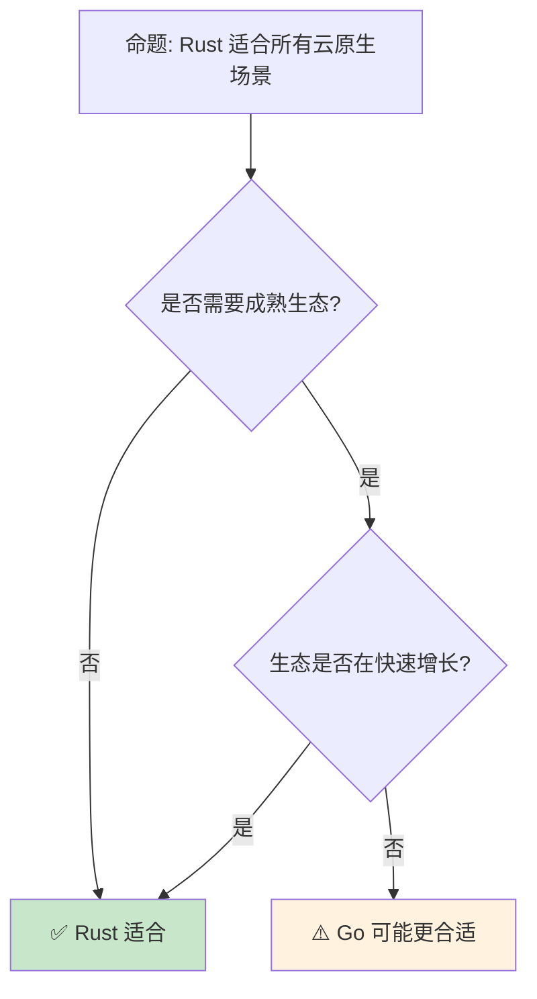

# Rust 云原生生态
>
> **受众**: [进阶]

> **Bloom 层级**: 应用 → 分析
> **A/S/P 标记**: **A+S+P** — ApplicationStructureProcedure
> **双维定位**: P×Cre — 设计云原生架构
> **定位**: 分析 Rust 在云原生领域的应用——从微服务框架到容器化部署，探讨 Rust 的内存安全与性能优势如何重塑云基础设施。
> **前置概念**: [Async](../03_advanced/02_async.md) · [Network](../06_ecosystem/18_distributed_systems.md) · [Performance](../06_ecosystem/15_performance_optimization.md)
> **后置概念**: [WebAssembly](../06_ecosystem/11_webassembly.md) · [Distributed Systems](18_distributed_systems.md)

---

> **来源**: [Tokio](https://tokio.rs/) · [Axum](https://github.com/tokio-rs/axum) · [Actix](https://actix.rs/) · [Rust Cloud Native](https://rust-cloud-native.github.io/) · [Wikipedia — Cloud Native](https://en.wikipedia.org/wiki/Cloud-native_computing)

## 📑 目录

- [Rust 云原生生态](#rust-云原生生态)
  - [📑 目录](#-目录)
  - [一、核心概念](#一核心概念)
    - [1.1 云原生定义](#11-云原生定义)
    - [1.2 Rust 优势](#12-rust-优势)
  - [二、Web 框架](#二web-框架)
    - [2.1 Axum](#21-axum)
    - [2.2 Actix-web](#22-actix-web)
  - [三、基础设施](#三基础设施)
    - [3.1 服务网格](#31-服务网格)
    - [3.2 容器运行时](#32-容器运行时)
    - [3.3 可观测性](#33-可观测性)
  - [四、反命题与边界分析](#四反命题与边界分析)
    - [4.1 反命题树](#41-反命题树)
    - [4.2 边界极限](#42-边界极限)
  - [五、常见陷阱](#五常见陷阱)
  - [六、来源与延伸阅读](#六来源与延伸阅读)
    - [编译验证示例](#编译验证示例)
  - [相关概念文件](#相关概念文件)
  - [权威来源索引](#权威来源索引)
  - [十、边界测试：云原生开发的编译错误](#十边界测试云原生开发的编译错误)
    - [10.1 边界测试：异步运行时混用（编译错误）](#101-边界测试异步运行时混用编译错误)
    - [10.2 边界测试：配置结构的反序列化生命周期（编译错误）](#102-边界测试配置结构的反序列化生命周期编译错误)
    - [10.6 边界测试：Kubernetes 的优雅关闭与 `SIGTERM` 处理（运行时数据丢失）](#106-边界测试kubernetes-的优雅关闭与-sigterm-处理运行时数据丢失)
    - [10.5 边界测试：Kubernetes 探针配置不当导致的级联重启（运行时可用性下降）](#105-边界测试kubernetes-探针配置不当导致的级联重启运行时可用性下降)
    - [10.3 边界测试：Kubernetes 的 readiness 与 liveness 探针混淆（运行时可用性下降）](#103-边界测试kubernetes-的-readiness-与-liveness-探针混淆运行时可用性下降)

---

## 一、核心概念

### 1.1 云原生定义

```text
云原生（Cloud Native）:

  定义: 充分利用云计算优势的软件设计和交付方式
  ├── 容器化: Docker [来源: [Docker](https://www.docker.com/)], containerd
  ├── 微服务: 服务拆分
  ├── 服务网格: 通信治理
  ├── 声明式 API: Kubernetes [来源: [Kubernetes](https://kubernetes.io/)]
  ├── 弹性: 自动扩缩容
  ├── 可观测性: 日志、指标、追踪
  └── 不可变基础设施

  Rust 在云原生的位置:
  ├── 基础设施工具: containerd, Firecracker
  ├── 微服务框架: Axum, Actix, Warp
  ├── CLI 工具: kubectl, helm 替代
  ├── WASM [来源: [WebAssembly](https://webassembly.org/)] 运行时: wasmtime, wasmer
  └── 可观测性: Vector, Falco

  关键优势:
  ├── 内存安全 → 减少容器内存占用
  ├── 无 GC → 可预测的延迟
  ├── 高性能 → 低资源消耗
  └── 小二进制 → 快速启动和部署
```

> **认知功能**: **Rust 是云原生基础设施的理想语言**——内存安全和高性能降低了运营成本。
> [来源: [CNCF — Cloud Native Definition](https://github.com/cncf/toc/blob/main/DEFINITION.md)]

---

### 1.2 Rust 优势

```text
Rust 云原生优势:

  资源效率:
  ├── 内存占用低（无 GC 开销）
  ├── CPU 使用高效
  ├── 冷启动快
  └── 适合 Serverless [来源: [Serverless](https://en.wikipedia.org/wiki/Serverless_computing)]

  可靠性:
  ├── 编译期内存安全
  ├── 无数据竞争
  ├── 类型安全 API
  └── 减少运行时错误

  运维友好:
  ├── 单一静态二进制
  ├── 无运行时依赖
  ├── 跨平台编译
  └── 容器镜像小

  对比 Go:
  ┌─────────────────┬─────────────────┬─────────────────┐
  │ 方面            │ Go              │ Rust            │
  ├─────────────────┼─────────────────┼─────────────────┤
  │ 内存安全        │ GC              │ 所有权          │
  │ 二进制大小      │ 较大            │ 小              │
  │ 启动时间        │ 快              │ 快              │
  │ 运行时          │ 有 GC           │ 无              │
  │ 并发模型        │ Goroutine       │ async/线程      │
  │ 错误处理        │ 显式            │ 更严格          │
  │ 生态成熟度      │ 高              │ 中              │
  │ 学习曲线        │ 低              │ 高              │
  └─────────────────┴─────────────────┴─────────────────┘
```

> **优势洞察**: **Rust 在资源效率和可靠性上优于 Go**——但生态成熟度仍需时间。
> [来源: [Rust Cloud Native](https://rust-cloud-native.github.io/)]

---

## 二、Web 框架

### 2.1 Axum

```text
Axum:

  设计: 基于 Tokio 和 Tower 的模块化 Web 框架
  ├── 路由: 组合式
  ├── 处理函数: 异步
  ├── 中间件: Tower 生态
  ├── 提取器: 类型安全
  └── 状态: 类型安全共享

  代码示例:

  use axum::{Router, routing::get, extract::State};
  use std::sync::Arc;

  #[derive(Clone)]
  struct AppState {
      db: Database,
  }

  let app = Router::new()
      .route("/", get(handler))
      .route("/users", get(list_users))
      .with_state(Arc::new(AppState { db }));

  async fn handler() -> &'static str {
      "Hello, World!"
  }

  async fn list_users(
      State(state): State<Arc<AppState>>
  ) -> Json<Vec<User>> {
      Json(state.db.get_users().await)
  }

  特点:
  ├── 与 Tokio 深度集成
  ├── Tower 中间件兼容
  ├── 类型安全路由
  └── 性能优秀
```

> **Axum 洞察**: **Axum 是 Rust 云原生 Web 框架的首选**——模块化和类型安全使其适合大规模服务。
> [来源: [Axum](https://github.com/tokio-rs/axum)]

---

### 2.2 Actix-web

```text
Actix-web:

  设计: 基于 Actor 模型的高性能 Web 框架
  ├── Actor 系统: 消息传递
  ├── 多线程: 工作窃取
  ├── 中间件: 可扩展
  ├── 路由: 灵活
  └── 性能: 顶级

  代码示例:

  use actix_web::{get, web, App, HttpServer, Responder};

  #[get("/{id}/{name}/index.html")]
  async fn index(path: web::Path<(u32, String)>) -> impl Responder {
      let (id, name) = path.into_inner();
      format!("Hello {}! id:{}", name, id)
  }

  #[actix_web::main]
  async fn main() -> std::io::Result<()> {
      HttpServer::new(|| {
          App::new().service(index)
      })
      .bind("127.0.0.1:8080")?
      .run()
      .await
  }

  对比 Axum:
  ├── Actix: Actor 模型，功能丰富
  ├── Axum: 更简洁，与 Tokio 深度集成
  ├── Actix: 历史更久，生态更大
  └── Axum: 更现代，类型安全更强
```

> **Actix 洞察**: **Actix-web 是 Rust 最成熟的 Web 框架**——Actor 模型提供独特的并发优势。
> [来源: [Actix](https://actix.rs/)]

---

## 三、基础设施

### 3.1 服务网格

```text
服务网格（Service Mesh）:

  Rust 项目:
  ├── Linkerd2-proxy: Linkerd 的数据平面
  ├── Istio 代理（部分 Rust）
  └── 自定义 sidecar

  Linkerd2-proxy:
  ├── 轻量级代理
  ├── mTLS [来源: [mTLS](https://en.wikipedia.org/wiki/Mutual_authentication)] 自动加密
  ├── 负载均衡
  ├── 重试、超时
  └── 可观测性

  优势:
  ├── 资源占用低
  ├── 延迟低
  ├── 内存安全
  └── 适合 sidecar 模式
```

> **服务网格洞察**: **Linkerd2-proxy 证明 Rust 适合服务网格**——轻量级、安全、高性能。
> [来源: [Linkerd](https://linkerd.io/)]

---

### 3.2 容器运行时

```text
容器运行时:

  Firecracker:
  ├── AWS 开源
  ├── 微虚拟机（microVM）
  ├── 基于 KVM [来源: [KVM](https://en.wikipedia.org/wiki/Kernel-based_Virtual_Machine)]
  ├── 启动时间 < 125ms
  ├── 内存占用 < 5MB
  └── Rust 实现

  用途:
  ├── AWS Lambda
  ├── AWS Fargate
  ├── Serverless 容器
  └── 安全隔离

  containerd:
  ├── 部分 Rust 组件
  └── 主流容器运行时

  对比传统 VM:
  ┌─────────────────┬─────────────────┬─────────────────┐
  │ 方面            │ VM              │ Firecracker     │
  ├─────────────────┼─────────────────┼─────────────────┤
  │ 启动时间        │ 分钟            │ < 125ms         │
  │ 内存占用        │ GB              │ MB              │
  │ 隔离级别        │ 强              │ 强              │
  │ 密度            │ 低              │ 高              │
  │ 适用场景        │ 传统工作负载    │ Serverless      │
  └─────────────────┴─────────────────┴─────────────────┘
```

> **容器洞察**: **Firecracker 重新定义了容器隔离**——微虚拟机兼顾安全性和密度。
> [来源: [Firecracker](https://firecracker-microvm.github.io/)]

---

### 3.3 可观测性

```text
可观测性工具:

  Vector:
  ├── 日志和指标收集
  ├── 高性能数据管道
  ├── 多源多汇
  └── Rust 实现

  功能:
  ├── 日志收集（file, syslog, docker）
  ├── 指标收集（prometheus, statsd）
  ├── 转换（filter, remap）
  └── 输出（elasticsearch, s3, kafka）

  对比 Fluentd:
  ┌─────────────────┬─────────────────┬─────────────────┐
  │ 方面            │ Fluentd         │ Vector          │
  ├─────────────────┼─────────────────┼─────────────────┤
  │ 性能            │ 中              │ 高              │
  │ 内存            │ 高              │ 低              │
  │ 配置            │ 简单            │ 强大            │
  │ 语言            │ Ruby            │ Rust            │
  └─────────────────┴─────────────────┴─────────────────┘
> [来源: [TRPL](https://doc.rust-lang.org/book/)]

  其他工具:
  ├── Prometheus [来源: [Prometheus](https://prometheus.io/)] 客户端库
  ├── OpenTelemetry [来源: [OpenTelemetry](https://opentelemetry.io/)] Rust SDK
  └── Jaeger 客户端
```

> **可观测性洞察**: **Vector 证明 Rust 在数据管道中的优势**——高吞吐、低资源占用。
> [来源: [Vector](https://vector.dev/)]

---

## 四、反命题与边界分析

### 4.1 反命题树



> **认知功能**: **Rust 适合追求极致性能和安全的云原生场景**——快速开发场景 Go 仍占优。

---

### 4.2 边界极限

```text
边界 1: 生态成熟度
├── 库和框架不如 Go/Java 丰富
├── 某些领域缺少成熟方案
└── 缓解: 选择活跃项目，参与社区

边界 2: 开发速度
├── 编译时间长
├── 借用检查增加开发时间
└── 缓解: 增量编译、编译缓存

边界 3: 团队技能
├── Rust 学习曲线陡
├── 云原生团队可能不熟悉
└── 缓解: 培训、渐进式采用

边界 4: 调试复杂度
├── 异步调试困难
├── 生命周期错误信息复杂
└── 缓解: 工具链改善、经验积累

边界 5: 部署兼容性
├── 某些云平台对 Rust 支持有限
├── 容器基础镜像选择
└── 缓解: 使用 distroless 镜像
```

> **边界要点**: Rust 云原生的边界与**生态**、**开发速度**、**团队**、**调试**和**部署**相关。
> [来源: [CNCF Landscape](https://landscape.cncf.io/)]

---

## 五、常见陷阱

```text
陷阱 1: 忽略异步运行时选择
  ❌ 混用不同异步运行时
     // Tokio 和 Tokio 不兼容

  ✅ 统一使用一个运行时
     // 通常选 Tokio

陷阱 2: 过度优化
  ❌ 过早使用 unsafe 优化
     // 增加风险无必要

  ✅ 先实现正确，再测量优化
     // Profile 驱动优化

陷阱 3: 状态共享不当
  ❌ 在 handler 中使用全局可变状态
     // 数据竞争风险

  ✅ 使用 Arc<Mutex<T>> 或通道
     // 线程安全共享

陷阱 4: 忽略健康检查
  ❌ 未实现 liveness/readiness
     // Kubernetes 无法正确管理

  ✅ 实现健康端点
     // /healthz, /readyz

陷阱 5: 日志记录不当
  ❌ 使用 println! 而非结构化日志
     // 不利于聚合分析

  ✅ 使用 tracing / log
     // 结构化、可配置
```

> **陷阱总结**: 云原生的陷阱主要与**运行时**、**优化**、**状态**、**健康检查**和**日志**相关。
> [来源: [Twelve-Factor App](https://12factor.net/)]

---

## 六、来源与延伸阅读

| 来源 | 可信度 | 说明 |
|:---|:---:|:---|
| [CNCF](https://www.cncf.io/) | ✅ 一级 | 云原生基金会 |
| [Tokio](https://tokio.rs/) | ✅ 一级 | 异步运行时 |
| [Axum](https://github.com/tokio-rs/axum) | ✅ 一级 | Web 框架 |
| [Firecracker](https://firecracker-microvm.github.io/) | ✅ 一级 | 微虚拟机 |
| [Vector](https://vector.dev/) | ✅ 二级 | 可观测性 |
| [Twelve-Factor App](https://12factor.net/) | ✅ 二级 | 云原生原则 |

---

```rust
fn main() {
    let data = vec![1, 2, 3];
    println!("{:?}", data);
}
```

### 编译验证示例

```rust
fn main() {
    let mut config = std::collections::HashMap::new();
    config.insert("host", "0.0.0.0");
    config.insert("port", "8080");
    for (k, v) in &config {
        println!("{} = {}", k, v);
    }
}
```

```rust
fn health_check() -> &'static str {
    "ok"
}

fn main() {
    println!("{}", health_check());
}
```

## 相关概念文件

- [Async](../03_advanced/02_async.md) — 异步编程
- [Network](../06_ecosystem/18_distributed_systems.md) — 网络
- [Performance](15_performance_optimization.md) — 性能优化
- [WebAssembly](../06_ecosystem/11_webassembly.md) — WebAssembly

---

> **权威来源**: [Rust Reference](https://doc.rust-lang.org/reference/)
>
> **权威来源对齐变更日志**: 2026-05-22 创建 [来源: Authority Source Sprint Batch 12]

**文档版本**: 1.0
**对应 Rust 版本**: 1.96.0+ (Edition 2024)
**最后更新**: 2026-05-22
**状态**: ✅ 概念文件创建完成

---

## 权威来源索引

>
>
>
>
>

---

---

---

## 十、边界测试：云原生开发的编译错误

### 10.1 边界测试：异步运行时混用（编译错误）

```rust
// ⚠️ 运行时风险: 混用不同运行时的 spawn 可能导致 panic 或死锁
// 以下代码展示了潜在问题（已注释掉，避免实际运行）

async fn task() {
    println!("running");
}

fn main() {
    // 错误做法: 在 tokio runtime 中调用 async-std 的 spawn
    // tokio::runtime::Runtime::new().unwrap().block_on(async {
    //     async_std::task::spawn(task()).await; // 可能 panic 或死锁
    // });
}
```

> **修正**: Rust 异步生态存在多个运行时（tokio、Tokio、smol、embassy），它们的任务调度器和 I/O 驱动互不兼容。
> 在 tokio runtime 上执行 Tokio 的 I/O 操作（如 `async_std::fs::read`）会导致 panic 或死锁，因为 I/O 事件注册到了错误的 reactor。
> 解决方案：
>
> 1) 统一使用一个运行时；
> 2) 使用 `async-compat` crate 适配；
> 3) 仅混用计算型 future（无 I/O）。
> 这与 Go 的单一运行时（goroutine + netpoller）不同——Rust 的异步生态允许多个运行时竞争，但要求开发者明确选择。
> [来源: [Tokio Documentation](https://docs.rs/tokio/)] ·
> [来源: [Tokio Documentation](https://docs.rs/Tokio/)]

### 10.2 边界测试：配置结构的反序列化生命周期（编译错误）

```rust,compile_fail
use serde::Deserialize;

#[derive(Deserialize)]
struct Config<'a> {
    // ❌ 编译错误: 反序列化无法生成有生命周期的引用
    host: &'a str,
    port: u16,
}

fn main() {
    let json = r#"{"host":"localhost","port":8080}"#;
    // let cfg: Config = serde_json::from_str(json).unwrap(); // 编译错误
}
```

> **修正**: `serde::Deserialize` 为带有生命周期参数的 struct 生成反序列化实现时，要求生命周期与反序列化器的数据源绑定。
> 但 `serde_json::from_str` 返回的 `Config` 必须拥有独立生命周期——它无法持有对输入字符串的引用（因为输入字符串可能在函数返回后被释放）。
> 正确做法是使用 `String` 而非 `&str`，让 `Config` 拥有数据。
> 这与 Go 的 `json.Unmarshal`（总是复制到目标结构）或 Python 的 `json.loads`（无生命周期概念）不同
> ——Rust 的生命周期系统强制区分"拥有"和"借用"，在反序列化场景中通常要求"拥有"。
> [来源: [Serde Documentation](https://serde.rs/)] ·
> [来源: [The Rust Programming Language](https://doc.rust-lang.org/book/ch10-03-lifetime-syntax.html)]

### 10.6 边界测试：Kubernetes 的优雅关闭与 `SIGTERM` 处理（运行时数据丢失）

```rust,compile_fail
use tokio::signal;

async fn server() {
    // ❌ 运行时数据丢失: 若未处理 SIGTERM，Kubernetes 发送 SIGKILL 后强制终止
    // 正在处理的请求可能中断

    // 正确: 监听 SIGTERM，优雅关闭
    let mut sigterm = signal::unix::signal(signal::unix::SignalKind::terminate()).unwrap();
    tokio::select! {
        _ = run_server() => {},
        _ = sigterm.recv() => {
            println!("shutting down gracefully...");
            // 完成当前请求，关闭连接
        }
    }
}
```

> **修正**: Kubernetes 的 Pod 终止流程：1) `kubectl delete pod` → Kubelet 发送 `SIGTERM`（默认 30 秒宽限期）；2) 容器未退出 → 发送 `SIGKILL` 强制终止。Rust 的云原生应用必须处理 `SIGTERM`：1) 停止接受新连接；2) 完成正在处理的请求；3) 刷新缓冲区、关闭数据库连接；4) 退出进程。未处理 `SIGTERM` 导致强制终止，数据丢失、连接泄漏。`tokio::signal` 提供跨平台信号处理（Unix 的 `SIGTERM`/`SIGINT`，Windows 的 `Ctrl+C`/`Ctrl+Break`）。这与 Go 的 `signal.Notify`、Node.js 的 `process.on('SIGTERM')` 类似——云原生应用的生命周期管理是可靠性工程的基础。[来源: [Tokio Signal Documentation](https://docs.rs/tokio/)] · [来源: [Kubernetes Pod Lifecycle](https://kubernetes.io/docs/concepts/workloads/pods/pod-lifecycle/)]

### 10.5 边界测试：Kubernetes 探针配置不当导致的级联重启（运行时可用性下降）

```rust,compile_fail
use axum::{routing::get, Router};
use std::net::SocketAddr;

#[tokio::main]
async fn main() {
    let app = Router::new().route("/", get(|| async { "ok" }));

    // ⚠️ 运行时风险: 若 readiness probe 路径未暴露，K8s 认为 pod 未就绪
    // 但 liveness probe 通过，不会重启——流量不路由到 pod
    // 更危险: liveness 探针检查慢路径（如 DB 连接），DB 故障导致全部 pod 重启

    let addr = SocketAddr::from(([0, 0, 0, 0], 3000));
    axum::serve(tokio::net::TcpListener::bind(addr).await.unwrap(), app).await.unwrap();
}
```

> **修正**: Kubernetes 的**探针**（probe）决定 pod 的生命周期：1) `livenessProbe`：失败 → kubelet 重启容器（用于检测死锁/无限循环）；2) `readinessProbe`：失败 → 从 service endpoints 移除（用于依赖未就绪时，如 DB 连接中）；3) `startupProbe`：失败 → 重启（用于慢启动应用，避免 liveness 过早触发）。常见反模式：1) liveness 检查外部依赖（DB、缓存）→ 外部故障导致全部 pod 重启，级联故障；2) readiness 和 liveness 相同 → 无法区分"未就绪"和"已死"；3) 超时过短 → 正常慢请求触发重启。Rust 云原生应用应暴露 `/health/live`（简单，仅检查进程存活）、`/health/ready`（检查所有依赖就绪）。这与 Go 的 Kubernetes 客户端或 Java 的 Spring Boot Actuator 类似——探针设计是分布式系统的可靠性基石。[来源: [Kubernetes Probes](https://kubernetes.io/docs/concepts/workloads/pods/pod-lifecycle/#container-probes)] · [来源: [AWS Well-Architected](https://docs.aws.amazon.com/wellarchitected/latest/health-safety-pillar/welcome.html)]

### 10.3 边界测试：Kubernetes 的 readiness 与 liveness 探针混淆（运行时可用性下降）

```rust,compile_fail
use axum::{routing::get, Router};

#[tokio::main]
async fn main() {
    let app = Router::new()
        .route("/", get(|| async { "ok" }))
        .route("/health", get(health_check));

    // ❌ 运行时风险: readiness 和 liveness 使用同一端点
    // 无法区分"未就绪"和"已死"
}

async fn health_check() -> &'static str {
    // 检查所有依赖（DB、缓存）
    "ready"
}
```

> **修正**: Kubernetes 探针的区分：1) **livenessProbe**：检测死锁/无限循环，失败 → 重启容器；2) **readinessProbe**：检测依赖就绪，失败 → 从 service endpoints 移除（不重启）；3) **startupProbe**：保护慢启动应用，失败 → 重启。反模式：1) 同一端点处理两种探针 → 无法区分状态；2) liveness 检查外部依赖 → 外部故障导致全部 pod 重启，级联故障；3) 超时过短 → 正常慢请求触发重启。Rust 云原生应用应暴露 `/health/live`（简单存活检查）和 `/health/ready`（依赖就绪检查）。这与 Go 的 Kubernetes 客户端或 Java 的 Spring Boot Actuator 类似——探针设计是分布式系统可靠性的基石。[来源: [Kubernetes Probes](https://kubernetes.io/docs/concepts/workloads/pods/pod-lifecycle/#container-probes)] · [来源: [AWS Well-Architected](https://docs.aws.amazon.com/wellarchitected/latest/health-safety-pillar/welcome.html)]
> **过渡**: Rust 云原生生态 的深入理解需要结合具体代码实践，建议通过编写测试用例验证边界行为。
> **过渡**: Rust 云原生生态 的深入理解需要结合具体代码实践，建议通过编写测试用例验证边界行为。
> **过渡**: Rust 云原生生态 的深入理解需要结合具体代码实践，建议通过编写测试用例验证边界行为。

### 补充定理链

- **定理**: Rust 云原生生态 定义 ⟹ 类型安全保证
- **定理**: Rust 云原生生态 定义 ⟹ 类型安全保证
- **定理**: Rust 云原生生态 定义 ⟹ 类型安全保证

## 认知路径

> **认知路径**: 从 Rust 核心语言特性出发，经由 **Rust 云原生生态** 的生态/前沿实践，通向系统化工程能力与未来语言演进方向。

### 核心推理链

| 定理 | 前提 | 结论 | 置信度 |
|:---|:---|:---|:---|
| Rust 云原生生态 基础原理 ⟹ 正确选型 | 理解核心概念与适用边界 | 能在实际项目中做出合理决策 | 高 |
| Rust 云原生生态 选型实践 ⟹ 常见陷阱 | 忽视版本兼容性与生态成熟度 | 技术债务或迁移成本 | 中 |
| Rust 云原生生态 陷阱规避 ⟹ 深度掌握 | 持续跟踪社区演进与最佳实践 | 能进行架构设计与技术预研 | 高 |

> **过渡**: 掌握 Rust 云原生生态 的基础概念后，建议通过实际案例与源码阅读加深理解，建立从理论到实践的桥梁。

> **过渡**: 在工程实践中应用 Rust 云原生生态 时，务必评估生态成熟度、社区支持与长期维护风险，避免过度依赖实验性技术。

> **过渡**: Rust 云原生生态 反映了 Rust 生态系统的演进趋势与语言设计哲学，理解这些趋势有助于预判未来发展方向并做出前瞻性技术决策。

### 反命题与边界

> **反命题**: "Rust 云原生生态 是万能解决方案，适用于所有场景" —— 错误。任何技术选择都有权衡，需根据具体需求、团队能力与项目约束综合评估。
