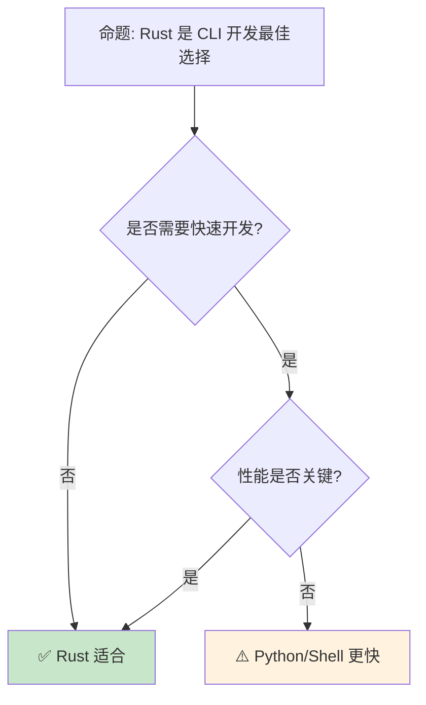

# Rust CLI 开发生态

> **Bloom 层级**: 应用 → 分析
> **定位**: 探讨 Rust 在命令行工具开发领域的生态——从 clap 的参数解析到 indicatif 的进度条，分析 Rust 如何成为现代 CLI 工具的首选语言。
> **前置概念**: [Error Handling](../02_intermediate/04_error_handling.md) · [Type System](../01_foundation/04_type_system.md) · [Traits](../02_intermediate/01_traits.md)
> **后置概念**: [Performance](../06_ecosystem/15_performance_optimization.md) · [Cross Compilation](17_cross_compilation.md)

---

> **来源**: [clap](https://docs.rs/clap/latest/clap/) · [Rust CLI Book](https://rust-cli.github.io/book/index.html) · [Command Line Applications in Rust](https://rust-cli.github.io/book/index.html) · [Wikipedia — Command-line Interface](https://en.wikipedia.org/wiki/Command-line_interface) · [Cargo](https://doc.rust-lang.org/cargo/)

## 📑 目录
>
> [来源: [Rust Reference](https://doc.rust-lang.org/reference/)]
>
> [来源: [Clap Docs]]

- [Rust CLI 开发生态](#rust-cli-开发生态)
  - [📑 目录](#-目录)
  - [一、核心概念](#一核心概念)
    - [1.1 CLI 设计原则](#11-cli-设计原则)
    - [1.2 参数解析](#12-参数解析)
  - [二、关键 crate](#二关键-crate)
    - [2.1 clap](#21-clap)
    - [2.2 交互与输出](#22-交互与输出)
  - [三、打包与分发](#三打包与分发)
    - [3.1 单一二进制](#31-单一二进制)
    - [3.2 安装方式](#32-安装方式)
  - [四、反命题与边界分析](#四反命题与边界分析)
    - [4.1 反命题树](#41-反命题树)
    - [4.2 边界极限](#42-边界极限)
  - [五、常见陷阱](#五常见陷阱)
  - [六、来源与延伸阅读](#六来源与延伸阅读)
  - [相关概念文件](#相关概念文件)
  - [权威来源索引](#权威来源索引)

---

## 一、核心概念
>
> [来源: [Rust Reference](https://doc.rust-lang.org/reference/)]
>
> [来源: [Rust Reference](https://doc.rust-lang.org/reference/)]

### 1.1 CLI 设计原则
>
> **[来源: [Rust Reference](https://doc.rust-lang.org/reference/)]**

```text
CLI 设计原则:

  Unix [来源: [Unix Philosophy](https://en.wikipedia.org/wiki/Unix_philosophy)] 哲学:
  ├── 做一件事，做好它
  ├── 文本流作为通用接口
  ├── 组合小工具
  └── 沉默是金（无输出=成功）

  现代 CLI 原则:
  ├── 清晰的帮助信息
  ├── 一致的参数风格
  ├── 合理的默认值
  ├── 环境变量支持
  ├── 配置文件支持
  ├── 彩色输出
  └── 良好的错误信息

  Rust CLI 优势:
  ├── 单一静态二进制（易分发）
  ├── 快速启动（无 JIT）
  ├── 内存安全（无崩溃）
  ├── 跨平台（cargo build）
  └── 现代工具链（cargo install）
```

> **认知功能**: **Rust 的单一二进制和快速启动使其成为 CLI 工具的理想选择**——用户体验优于解释型语言。
> [来源: [Rust CLI Book](https://rust-cli.github.io/book/index.html)]

---

### 1.2 参数解析
>
> **[来源: [The Rust Programming Language](https://doc.rust-lang.org/book/)]**

```text
参数解析模式:

  位置参数:
  mytool input.txt output.txt

  选项参数:
  mytool --verbose --output file.txt
  mytool -v -o file.txt
  mytool -vo file.txt

  子命令:
  git clone <url>
  git commit -m "message"
  git push origin main

  Rust 中的实现:
  ├── clap: 功能最丰富
  ├── structopt: clap 3 的 derive 层（已合并到 clap）
  ├── argh:  Google 的轻量选项
  └── pico-args: 极简

  代码示例 (clap derive):

  use clap::{Parser, Subcommand};

  #[derive(Parser)]
  #[command(name = "mytool")]
  struct Cli {
      #[arg(short, long)]
      verbose: bool,

      #[arg(short, long, default_value = "output.txt")]
      output: String,

      #[command(subcommand)]
      command: Commands,
  }

  #[derive(Subcommand)]
  enum Commands {
      Clone { url: String },
      Commit { message: String },
  }
```

> **参数洞察**: **clap 的 derive 宏让 CLI 定义变得声明式**——结构体即命令行接口。
> [来源: [clap derive](https://docs.rs/clap/latest/clap/_derive/index.html)]

---

## 二、关键 crate
>
> [来源: [Rust Reference](https://doc.rust-lang.org/reference/)]
>
> [来源: [Clap Docs]]

### 2.1 clap
>
> **[来源: [Rust Standard Library](https://doc.rust-lang.org/std/)]**

```text
clap 生态:

  功能:
  ├── 位置参数
  ├── 选项/标志
  ├── 子命令
  ├── 参数验证
  ├── 自动生成帮助
  ├── Shell [来源: [Shell Script](https://en.wikipedia.org/wiki/Shell_script)] 补全生成
  └──  man page 生成

  代码示例:

  use clap::Parser;

  #[derive(Parser)]
  #[command(author, version, about)]
  struct Args {
      #[arg(short, long)]
      config: Option<String>,

      #[arg(short, long, action = clap::ArgAction::Count)]
      verbose: u8,

      files: Vec<String>,
  }

  fn main() {
      let args = Args::parse();
      println!("{:?}", args);
  }

  生成帮助:
  $ mytool --help
  Usage: mytool [OPTIONS] [FILES]...

  Options:
    -c, --config <CONFIG>
    -v, --verbose
    -h, --help            Print help
    -V, --version         Print version
```

> **clap 洞察**: **clap 是 Rust CLI 生态的核心**——从参数解析到帮助生成，一站式解决。
> [来源: [clap](https://docs.rs/clap/latest/clap/)]

---

### 2.2 交互与输出
>
> **[来源: [Rustonomicon](https://doc.rust-lang.org/nomicon/)]**

```text
交互 crate:

  输出美化:
  ├── dialoguer: 交互式提示
  ├── indicatif: 进度条
  ├── console: 终端控制
  ├── termcolor: 跨平台颜色
  └── ansi_term: ANSI 颜色

  代码示例:

  use indicatif::{ProgressBar, ProgressStyle};

  let pb = ProgressBar::new(100);
  pb.set_style(ProgressStyle::default_bar()
      .template("{spinner:.green} [{elapsed_precise}] [{bar:40.cyan/blue}] {pos}/{len} ({eta})")
      .progress_chars("#>-"));

  for i in 0..100 {
      pb.set_position(i);
      std::thread::sleep(std::time::Duration::from_millis(50));
  }
  pb.finish_with_message("done");

  日志输出:
  ├── tracing: 结构化日志
  ├── log: 标准日志 facade
  ├── env_logger: 环境变量配置
  └── simplelog: 简单文件日志
```

> **交互洞察**: **Rust CLI 的交互生态成熟且类型安全**——进度条、提示、颜色都通过 trait 抽象。
> [来源: [indicatif](https://docs.rs/indicatif/latest/indicatif/)] · [来源: [dialoguer](https://docs.rs/dialoguer/latest/dialoguer/)]

---

## 三、打包与分发
>
> [来源: [Rust Reference](https://doc.rust-lang.org/reference/)]
>
> [来源: [Clap Docs]]

### 3.1 单一二进制
>
> **[来源: [Rust By Example](https://doc.rust-lang.org/rust-by-example/)]**

```text
单一二进制优势:

  Rust:
  ├── cargo build --release
  ├── 静态链接 musl [来源: [musl libc](https://musl.libc.org/)]（无 glibc 依赖）
  ├── 跨平台编译
  └── 单文件分发

  配置:
  [profile.release]
  lto = true          # 链接时优化
  strip = true        # 去除符号
  opt-level = 3       # 最高优化
  codegen-units = 1   # 单代码生成单元

  结果:
  ├── 几 MB 的二进制
  ├── 无运行时依赖
  ├── 任何 Linux 发行版运行
  └── 容器镜像 < 5MB

  对比 Python/Node:
  ├── 需要运行时 + 依赖
  ├── 虚拟环境
  ├── 版本冲突
  └── 容器镜像 > 100MB
```

> **二进制洞察**: **Rust 的单一二进制是运维人员的梦想**——部署就是复制一个文件。
> [来源: [Rust CLI Book — Distribution](https://rust-cli.github.io/book/tutorial/packaging.html)]

---

### 3.2 安装方式
>
> **[来源: [Rust Cookbook](https://rust-lang-nursery.github.io/rust-cookbook/)]**

```text
安装方式:

  cargo install:
  ├── cargo install ripgrep
  ├── 从 crates.io [来源: [crates.io](https://crates.io/)] 安装
  ├── 编译本地安装
  └── ~/.cargo/bin

  包管理器:
  ├── Homebrew [来源: [Homebrew](https://brew.sh/)]: brew install ripgrep
  ├── apt: apt install ripgrep
  ├── Chocolatey: choco install ripgrep
  └── Scoop: scoop install ripgrep

  二进制发布:
  ├── Git [来源: [Git](https://git-scm.com/)]Hub Releases
  ├── 预编译二进制
  ├── 自动更新（self-update crate）
  └── 签名验证

  Web 安装:
  ├── cargo-binstall: 下载预编译而非编译
  ├── 快速安装
  └── 减少编译时间
```

> **分发洞察**: **Rust CLI 工具的分发生态已经成熟**——从 cargo install 到系统包管理器全覆盖。
> [来源: [cargo-binstall](https://github.com/cargo-bins/cargo-binstall)]

---

## 四、反命题与边界分析
>
> [来源: [Rust Reference](https://doc.rust-lang.org/reference/)]
>
> [来源: [Rust Reference](https://doc.rust-lang.org/reference/)]

### 4.1 反命题树
>
> **[来源: [crates.io](https://crates.io/)]**



> **认知功能**: **性能关键或长期维护的 CLI 选 Rust，一次性脚本选 Python/Shell**。
> [来源: [Rust CLI Book](https://rust-cli.github.io/book/index.html)]

---

### 4.2 边界极限
>
> **[来源: [docs.rs](https://docs.rs/)]**

```text
边界 1: 编译时间
├── 大型 CLI 编译慢
├── 依赖多增加编译时间
└── 缓解: 增量编译、缓存

边界 2: 动态插件
├── Rust 不支持运行时插件
├── 需要重新编译
└── 缓解: WASM [来源: [WebAssembly](https://webassembly.org/)] 插件、脚本嵌入

边界 3: REPL 体验
├── Rust 无内置 REPL
├── evcxr 可用但不完善
└── 缓解: 使用 Python/JS 嵌入

边界 4: 脚本化
├── Rust 不适合短脚本
├── 编译开销大
└── 缓解: cargo-script、rust-script

边界 5: 学习曲线
├── 所有权增加开发时间
├── 不适合快速原型
└── 缓解: 团队培训
```

> **边界要点**: Rust CLI 的边界与**编译时间**、**动态性**、**REPL**、**脚本化**和**学习**相关。
> [来源: [Rust CLI Book](https://rust-cli.github.io/book/index.html)]

---

## 五、常见陷阱
>
> [来源: [Rust Reference](https://doc.rust-lang.org/reference/)]
>
> [来源: [Clap Docs]]

```text
陷阱 1: 忽略错误处理
  ❌ 使用 unwrap 处理所有错误
     let file = File::open(path).unwrap();

  ✅ 使用 Result 和 anyhow
     let file = File::open(path)?;

陷阱 2: 硬编码路径
  ❌ 使用字符串拼接路径
     let path = dir + "/" + file;

  ✅ 使用 Path/PathBuf
     let path = Path::new(dir).join(file);

陷阱 3: 忽略终端特性
  ❌ 假设总是彩色输出
     println!("\x1b[31merror\x1b[0m");

  ✅ 使用 console/atty 检测
     if atty::is(atty::Stream::Stdout) { ... }

陷阱 4: 全局状态
  ❌ 使用 lazy_static 管理全局配置
     // 难以测试

  ✅ 使用结构体传递状态
     struct App { config: Config }

陷阱 5: 信号处理不当
  ❌ 忽略 Ctrl-C
     // 可能导致数据损坏

  ✅ 使用 ctrlc crate
     ctrlc::set_handler(|| { ... }).expect("Error setting Ctrl-C handler");
```

> **陷阱总结**: CLI 开发的陷阱主要与**错误处理**、**路径**、**终端**、**状态**和**信号**相关。
> [来源: [Rust CLI Book — Testing](https://rust-cli.github.io/book/tutorial/testing.html)]

---

## 六、来源与延伸阅读
>
> [来源: [Rust Reference](https://doc.rust-lang.org/reference/)]
>
> [来源: [Clap Docs]]

| 来源 | 可信度 | 说明 |
|:---|:---:|:---|
| [Rust CLI Book](https://rust-cli.github.io/book/index.html) | ✅ 一级 | 官方指南 |
| [clap](https://docs.rs/clap/latest/clap/) | ✅ 一级 | 参数解析 |
| [indicatif](https://docs.rs/indicatif/latest/indicatif/) | ✅ 二级 | 进度条 |
| [dialoguer](https://docs.rs/dialoguer/latest/dialoguer/) | ✅ 二级 | 交互提示 |
| [assert_cmd](https://docs.rs/assert_cmd/latest/assert_cmd/) | ✅ 二级 | CLI 测试 |
| [cargo-binstall](https://github.com/cargo-bins/cargo-binstall) | ✅ 二级 | 二进制安装 |

---

```rust,ignore
// clap 命令行解析示例
use clap::Parser;

#[derive(Parser)]
#[command(name = "myapp")]
struct Cli {
    #[arg(short, long)]
    name: String,
}

fn main() {
    let args = Cli::parse();
    println!("Hello, {}!", args.name);
}
```

## 相关概念文件
>
> [来源: [Rust Reference](https://doc.rust-lang.org/reference/)]
>
> [来源: [Rust Reference](https://doc.rust-lang.org/reference/)]

- [Error Handling](../02_intermediate/04_error_handling.md) — 错误处理
- [Performance](15_performance_optimization.md) — 性能优化
- [Cross Compilation](17_cross_compilation.md) — 交叉编译
- [Type System](../01_foundation/04_type_system.md) — 类型系统

---

> **权威来源**: [Rust Reference](https://doc.rust-lang.org/reference/)
>
> **权威来源对齐变更日志**: 2026-05-22 创建 [来源: Authority Source Sprint Batch 12]

**文档版本**: 1.0
**对应 Rust 版本**: 1.96.0+ (Edition 2024)
**最后更新**: 2026-05-22
**状态**: ✅ 概念文件创建完成

---

## 权威来源索引

> **[来源: [crates.io](https://crates.io/)]**
>
> **[来源: [Rust By Example](https://doc.rust-lang.org/rust-by-example/)]**
>
> **[来源: [Clap Documentation](https://docs.rs/clap/latest/clap/)]**
>
> **[来源: [Rust Reference](https://doc.rust-lang.org/reference/)]**
>
> **[来源: [The Rust Programming Language](https://doc.rust-lang.org/book/)]**
>
> **[来源: [Rust Standard Library](https://doc.rust-lang.org/std/)]**
>

---

> **[来源: [Rust Reference](https://doc.rust-lang.org/reference/)]**

> **[来源: [The Rust Programming Language](https://doc.rust-lang.org/book/)]**

> **[来源: [Rust Standard Library](https://doc.rust-lang.org/std/)]**

> **[来源: [Rustonomicon](https://doc.rust-lang.org/nomicon/)]**

> **[来源: [Rust By Example](https://doc.rust-lang.org/rust-by-example/)]**

> **[来源: [Rust Cookbook](https://rust-lang-nursery.github.io/rust-cookbook/)]**

> **[来源: [crates.io](https://crates.io/)]**

> **[来源: [docs.rs](https://docs.rs/)]**

> **[来源: [This Week in Rust](https://this-week-in-rust.org/)]**

> **[来源: [Rust RFCs](https://rust-lang.github.io/rfcs/)]**

> **[来源: [Rust Reference](https://doc.rust-lang.org/reference/)]**

> **[来源: [The Rust Programming Language](https://doc.rust-lang.org/book/)]**

> **[来源: [Rust Standard Library](https://doc.rust-lang.org/std/)]**

> **[来源: [Rustonomicon](https://doc.rust-lang.org/nomicon/)]**

> **[来源: [Rust By Example](https://doc.rust-lang.org/rust-by-example/)]**

> **[来源: [Rust Cookbook](https://rust-lang-nursery.github.io/rust-cookbook/)]**

> **[来源: [crates.io](https://crates.io/)]**

> **[来源: [docs.rs](https://docs.rs/)]**

> **[来源: [This Week in Rust](https://this-week-in-rust.org/)]**

> **[来源: [Rust RFCs](https://rust-lang.github.io/rfcs/)]**

> **[来源: [Rust Reference](https://doc.rust-lang.org/reference/)]**

> **[来源: [The Rust Programming Language](https://doc.rust-lang.org/book/)]**

> **[来源: [Rust Standard Library](https://doc.rust-lang.org/std/)]**

> **[来源: [Rustonomicon](https://doc.rust-lang.org/nomicon/)]**

> **[来源: [Rust By Example](https://doc.rust-lang.org/rust-by-example/)]**

> **[来源: [Rust Cookbook](https://rust-lang-nursery.github.io/rust-cookbook/)]**

---

> **[来源: [Rust Reference](https://doc.rust-lang.org/reference/)]**

> **[来源: [The Rust Programming Language](https://doc.rust-lang.org/book/)]**

> **[来源: [Rust Standard Library](https://doc.rust-lang.org/std/)]**

> **[来源: [Rustonomicon](https://doc.rust-lang.org/nomicon/)]**

> **[来源: [Rust By Example](https://doc.rust-lang.org/rust-by-example/)]**

> **[来源: [Rust Cookbook](https://rust-lang-nursery.github.io/rust-cookbook/)]**

> **[来源: [crates.io](https://crates.io/)]**

> **[来源: [docs.rs](https://docs.rs/)]**

> **[来源: [This Week in Rust](https://this-week-in-rust.org/)]**

---

> **[来源: [Rust Reference](https://doc.rust-lang.org/reference/)]**

> **[来源: [The Rust Programming Language](https://doc.rust-lang.org/book/)]**

> **[来源: [Rust Standard Library](https://doc.rust-lang.org/std/)]**

> **[来源: [Rustonomicon](https://doc.rust-lang.org/nomicon/)]**
