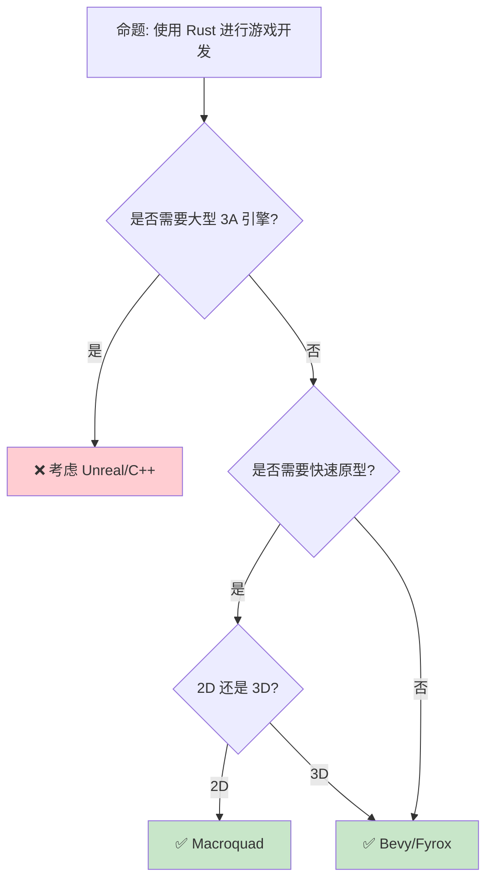

> **内容分级**: [综述级]
> **代码状态**: ✅ 含可编译示例
> **定理链**: N/A — 描述性/综述性/导航性文档，不涉及形式化定理链
>
# Rust 游戏开发
>
> **EN**: Game Development
> **Summary**: Game Development. Core Rust concept covering mechanism analysis, design patterns, performance optimization.
>
> **受众**: [进阶]
> **Bloom 层级**: 应用 → 评价
> **A/S/P 标记**: **A+S+P** — ApplicationStructureProcedure
> **双维定位**: P×Cre — 设计游戏开发架构
> **定位**: 探讨 Rust 在游戏开发领域的应用——从 ECS 架构到渲染引擎，分析 Rust 的性能优势和开发模式。
> **前置概念**: [ECS](07_game_ecs.md) · [Memory](../02_intermediate/03_memory_management.md) · [Concurrency](../03_advanced/01_concurrency.md) · [Ownership](../01_foundation/01_ownership.md)
> **后置概念**: [WebAssembly](11_webassembly.md) · [Performance](15_performance_optimization.md)
>
> **来源**: [Bevy Engine](https://bevyengine.org/) · [wgpu](https://docs.rs/wgpu/)
---

> **来源**: [Bevy Engine](https://bevyengine.org/) · [wgpu](https://wgpu.rs/) · [Rust GameDev WG](https://gamedev.rs/) · [Wikipedia — Game Engine](https://en.wikipedia.org/wiki/Game_engine)
> **前置依赖**: [Type Theory](../04_formal/02_type_theory.md)
> **前置依赖**: [Rust vs C++](../05_comparative/01_rust_vs_cpp.md)

## 📑 目录

- [Rust 游戏开发](#rust-游戏开发)
  - [📑 目录](#-目录)
  - [一、核心概念](#一核心概念)
    - [1.1 游戏引擎概览](#11-游戏引擎概览)
    - [1.2 ECS 架构](#12-ecs-架构)
  - [二、渲染与图形](#二渲染与图形)
    - [2.1 wgpu 与跨平台渲染](#21-wgpu-与跨平台渲染)
    - [2.2 渲染管线](#22-渲染管线)
  - [三、音频与输入](#三音频与输入)
  - [四、性能优化](#四性能优化)
  - [五、反命题与适用场景](#五反命题与适用场景)
    - [5.1 反命题树](#51-反命题树)
    - [5.2 适用场景](#52-适用场景)
  - [六、常见陷阱](#六常见陷阱)
  - [七、来源与延伸阅读](#七来源与延伸阅读)
  - [相关概念文件](#相关概念文件)
  - [权威来源索引](#权威来源索引)
  - [十、边界测试：游戏开发的编译错误](#十边界测试游戏开发的编译错误)
    - [10.1 边界测试：ECS 系统的组件借用冲突（编译错误）](#101-边界测试ecs-系统的组件借用冲突编译错误)
    - [10.2 边界测试：图形渲染的生命周期与 `Send` 约束（编译错误）](#102-边界测试图形渲染的生命周期与-send-约束编译错误)
    - [10.6 边界测试：游戏状态序列化的循环引用（运行时栈溢出）](#106-边界测试游戏状态序列化的循环引用运行时栈溢出)
    - [10.5 边界测试：ECS 的 archetype 变更与迭代器失效（运行时 panic/UB）](#105-边界测试ecs-的-archetype-变更与迭代器失效运行时-panicub)
    - [10.3 边界测试：Bevy ECS 的 system 参数顺序与冲突（编译错误）](#103-边界测试bevy-ecs-的-system-参数顺序与冲突编译错误)
    - [补充定理链](#补充定理链)
  - [嵌入式测验（Embedded Quiz）](#嵌入式测验embedded-quiz)
    - [测验 1：Rust 游戏开发中，`bevy_ecs` 的 archetype-based 存储相比传统 ECS 有什么优势？（理解层）](#测验-1rust-游戏开发中bevy_ecs-的-archetype-based-存储相比传统-ecs-有什么优势理解层)
    - [测验 2：`winit` 在 Rust 游戏生态中提供什么功能？（理解层）](#测验-2winit-在-rust-游戏生态中提供什么功能理解层)
    - [测验 3：Rust 的 `gltf` crate 在游戏资产管道中有什么用途？（理解层）](#测验-3rust-的-gltf-crate-在游戏资产管道中有什么用途理解层)
    - [测验 4：为什么游戏开发中的"热重载"（Hot Reloading）在 Rust 中比 C# 更难实现？（理解层）](#测验-4为什么游戏开发中的热重载hot-reloading在-rust-中比-c-更难实现理解层)
    - [测验 5：`hecs` 与 `bevy_ecs` 在 ECS 设计上有什么区别？（理解层）](#测验-5hecs-与-bevy_ecs-在-ecs-设计上有什么区别理解层)
  - [认知路径](#认知路径)
    - [核心推理链](#核心推理链)
    - [反命题与边界](#反命题与边界)

---

## 一、核心概念
>
>

### 1.1 游戏引擎概览
>

```text
Rust 游戏引擎生态:

  Bevy:
  ├── 数据驱动 ECS 架构
  ├── 模块化设计
  ├── 跨平台（桌面/移动/Web）
  └── 活跃社区

  Fyrox:
  ├── 场景图 + ECS 混合
  ├── 内置编辑器
  ├── 3D 优先
  └── 面向传统 OOP 开发者

  Macroquad:
  ├── 极简 API
  ├── 快速原型
  ├── 轻量级
  └── 2D 优先

  引擎对比:
  ┌─────────────────┬─────────────────┬─────────────────┬─────────────────┐
  │ 特性            │ Bevy            │ Fyrox           │ Macroquad       │
  ├─────────────────┼─────────────────┼─────────────────┼─────────────────┤
  │ 架构            │ ECS             │ 混合            │ 传统            │
  │ 3D 支持         │ ✅              │ ✅              │ ⚠️              │
  │ 编辑器          │ 第三方          │ 内置            │ 无              │
  │ 学习曲线        │ 中              │ 中              │ 低              │
  │ 适用场景        │ 通用            │ 3D 游戏         │ 2D 原型         │
  └─────────────────┴─────────────────┴─────────────────┴─────────────────┘
> [来源: [TRPL](https://doc.rust-lang.org/book/title-page.html)]

> [来源: [Bevy Engine](https://bevyengine.org/learn/book/introduction/)]
```

> **认知功能**: **Bevy 的纯 ECS 架构是 Rust 游戏开发的代表范式**——数据驱动、缓存友好、并行安全。
> [来源: [Bevy Engine](https://bevyengine.org/learn/book/introduction/)]

---

### 1.2 ECS 架构
>

```text
ECS (Entity-Component-System):

  核心概念:
  ├── Entity: 唯一 ID，无数据
  ├── Component: 纯数据（位置、速度、生命值）
  └── System: 处理逻辑（遍历组件）

  内存布局:
  ├── 组件存储为 SoA (Structure of Arrays)
  ├── 缓存友好（连续内存访问）
  └── 并行处理安全

  Bevy 示例:

  #[derive(Component)]
  struct Position { x: f32, y: f32 }

  #[derive(Component)]
  struct Velocity { x: f32, y: f32 }

  fn move_system(
      mut query: Query<(&mut Position, &Velocity)>
  ) {
      for (mut pos, vel) in query.iter_mut() {
          pos.x += vel.x;
          pos.y += vel.y;
      }
  }

  fn main() {
      App::new()
          .add_systems(Update, move_system)
          .run();
  }

  优势:
  ├── 并行安全（系统独立）
  ├── 缓存友好（连续内存）
  ├── 组合优于继承
  └── 运行时灵活
```

```rust
#[derive(Debug, Clone, Copy)]
struct Vec2 {
    x: f32,
    y: f32,
}

impl Vec2 {
    fn add(self, other: Vec2) -> Vec2 {
        Vec2 {
            x: self.x + other.x,
            y: self.y + other.y,
        }
    }
}

#[derive(Debug)]
struct Entity {
    pos: Vec2,
    vel: Vec2,
}

fn update(entities: &mut [Entity]) {
    for e in entities {
        e.pos = e.pos.add(e.vel);
    }
}

fn main() {
    let mut world = vec![
        Entity {
            pos: Vec2 { x: 0.0, y: 0.0 },
            vel: Vec2 { x: 1.0, y: 0.5 },
        },
    ];
    update(&mut world);
    println!("{:?}", world);
}
```

> **ECS 洞察**: **ECS 架构天然适合 Rust 的所有权（Ownership）模型**——系统之间不共享可变状态，编译期保证并行安全。
> [来源: [Bevy ECS Guide](https://bevyengine.org/learn/book/)]

---

## 二、渲染与图形

### 2.1 wgpu 与跨平台渲染
>

```text
wgpu:

  定位: WebGPU 标准的 Rust 实现
  ├── 跨平台: Vulkan/Metal/DX12/WebGPU
  ├── 现代 GPU API 抽象
  ├── 安全封装（避免内存泄漏）
  └── Rust 类型安全

  架构:
  ┌─────────────────┐
  │   wgpu API      │  ← Rust API
  ├─────────────────┤
  │  Vulkan/Metal   │  ← 后端抽象
  │  /DX12/WebGPU   │
  └─────────────────┘
> [来源: [TRPL](https://doc.rust-lang.org/book/title-page.html)]

  代码示例:

  async fn run() {
      let instance = wgpu::Instance::default();
      let adapter = instance
          .request_adapter(&wgpu::RequestAdapterOptions::default())
          .await
          .unwrap();

      let (device, queue) = adapter
          .request_device(&wgpu::DeviceDescriptor::default(), None)
          .await
          .unwrap();

      // 创建渲染管线...
  }

  优势:
  ├── 一套代码多平台运行
  ├── 现代 GPU 特性（计算着色器）
  └── Rust 内存安全
```

> **wgpu 洞察**: **wgpu 让 Rust 游戏可以编译到 WebAssembly 并在浏览器运行**——真正的跨平台。
> [来源: [wgpu](https://wgpu.rs/)]

---

### 2.2 渲染管线
>

```text
渲染管线:

  现代游戏渲染:
  ├── 几何处理（顶点着色器）
  ├── 光栅化
  ├── 片段着色器
  ├── 后处理（Bloom、SSAO）
  └── 合成输出

  Bevy 渲染:
  ├── 基于 wgpu
  ├── PBR 材质系统
  ├── 光照系统（点光/方向光/环境光）
  └── 后处理管线

  性能考量:
  ├── Draw call 批处理
  ├── GPU 实例化
  ├── LOD（细节层次）
  └── 遮挡剔除
```

> **渲染洞察**: **Rust 的零成本抽象（Zero-Cost Abstraction）让渲染代码既可读又高效**——无运行时（Runtime）开销。
> [来源: [Bevy Rendering](https://bevyengine.org/learn/book/)]

---

## 三、音频与输入

```text
音频系统:

  rodio:
  ├── 纯 Rust 音频播放
  ├── 支持 WAV/MP3/OGG
  └── 简单 API

  输入系统:
  ├── winit: 窗口和输入事件
  ├── gilrs: 游戏手柄
  └── 跨平台抽象

  代码示例:

  use rodio::{Decoder, OutputStream, Sink};
  use std::fs::File;

  fn play_sound() {
      let (_stream, stream_handle) = OutputStream::try_default().unwrap();
      let sink = Sink::try_new(&stream_handle).unwrap();

      let file = File::open("music.mp3").unwrap();
      let source = Decoder::new(file).unwrap();
      sink.append(source);
      sink.sleep_until_end();
  }
```

> **音频洞察**: **rodio 提供简单的 Rust 音频播放**——纯 Rust 实现，无外部依赖。
> [来源: [rodio](https://github.com/RustAudio/rodio)]

---

## 四、性能优化

```text
游戏性能优化:

  Rust 优势:
  ├── 无 GC 暂停（确定性帧率）
  ├── 内存布局控制（SoA、对齐）
  ├── 并行安全（ECS 系统）
  └── SIMD 优化

  常见优化:
  ├── 对象池（避免分配）
  ├── 空间分割（四叉树、BVH）
  ├── 增量更新（减少遍历）
  └── 异步加载（资源流式）

  性能对比:
  ┌─────────────────┬─────────────────┬─────────────────┐
  │ 方面            │ Rust (Bevy)     │ C++ (Unreal)    │
  ├─────────────────┼─────────────────┼─────────────────┤
  │ GC 暂停         │ 无              │ 无              │
  │ 内存安全        │ 编译期保证      │ 手动管理        │
  │ 并行安全        │ 编译期保证      │ 手动同步        │
  │ 生态成熟度      │ 中              │ 高              │
  │ 学习曲线        │ 中              │ 陡峭            │
  └─────────────────┴─────────────────┴─────────────────┘
> [来源: [TRPL](https://doc.rust-lang.org/book/title-page.html)]

> [来源: [Rust GameDev WG](https://gamedev.rs/)]
```

```rust
#[derive(Debug)]
enum GameState {
    Menu,
    Playing { score: u32 },
    GameOver,
}

fn transition(state: GameState, event: &str) -> GameState {
    match (state, event) {
        (GameState::Menu, "start") => GameState::Playing { score: 0 },
        (GameState::Playing { score }, "score") => {
            GameState::Playing { score: score + 10 }
        }
        (GameState::Playing { .. }, "end") => GameState::GameOver,
        (GameState::GameOver, "restart") => GameState::Menu,
        (s, _) => s,
    }
}

fn main() {
    let mut state = GameState::Menu;
    state = transition(state, "start");
    state = transition(state, "score");
    state = transition(state, "end");
    println!("{:?}", state);
}
```

> **性能洞察**: **Rust 的编译期保证让游戏性能优化更安全**——无数据竞争、无 use-after-free。
> [来源: [Rust GameDev WG](https://gamedev.rs/)] · [来源: [Wikipedia — Game Engine](https://en.wikipedia.org/wiki/Game_engine)]

---

## 五、反命题与适用场景
>

### 5.1 反命题树
>



> **选择洞察**: **独立游戏和 2D 原型首选 Rust，大型 3A 仍用成熟商业引擎**。
> [来源: [Rust GameDev](https://gamedev.rs/)]

---

### 5.2 适用场景
>

```text
适用场景:

  适合 Rust:
  ├── 独立游戏（2D/3D）
  ├── 游戏原型开发
  ├── 游戏工具链
  ├── 游戏服务器后端
  └── Web 游戏（WASM）

  不适合 Rust:
  ├── 大型 3A 游戏（生态不成熟）
  ├── 需要成熟编辑器的工作流
  ├── 主机平台首发（工具链限制）
  └── 快速外包项目

  混合使用:
  ├── Rust 做高性能模块
  ├── Unity/Unreal 做内容创作
  └── FFI 桥接
```

> **场景洞察**: **Rust 在游戏开发中更适合模块（Module）化和独立项目**——大型项目需要生态成熟度。
> [来源: [Bevy Engine](https://bevyengine.org/)]

---

## 六、常见陷阱

```text
陷阱 1: ECS 过度设计
  ❌ 对所有类型使用 ECS
     // 简单 UI 不需要 ECS

  ✅ 传统方式处理 UI
     // ECS 用于游戏实体

陷阱 2: 忽略资源加载
  ❌ 同步加载大量资源
     // 帧率骤降

  ✅ 异步加载 + 加载屏幕
     // AssetServer::load

陷阱 3: 系统顺序依赖
  ❌ 系统隐式依赖执行顺序
     // 导致非确定性 bug

  ✅ 显式标注系统顺序
     // .after() .before()

陷阱 4: 内存泄漏
  ❌ 循环引用实体
     // Entity 不会被释放

  ✅ 使用 commands.despawn()
     // 显式清理

陷阱 5: 过度优化
  ❌ 过早优化 ECS 查询
     // 复杂化代码

  ✅ 先实现功能，再 profile
     // 使用 tracing
```

> **陷阱总结**: 游戏开发的陷阱与**ECS 设计**、**资源加载**、**系统顺序**和**生命周期（Lifetimes）管理**相关。
> [来源: [Bevy Best Practices](https://bevyengine.org/learn/book/)]

---

## 七、来源与延伸阅读

| 来源 | 可信度 | 说明 |
|:---|:---:|:---|
| [Bevy Engine](https://bevyengine.org/) | ✅ 一级 | 官方 |
| [wgpu](https://wgpu.rs/) | ✅ 一级 | 官方 |
| [Rust GameDev WG](https://gamedev.rs/) | ✅ 二级 | 社区 |
| [rodio](https://github.com/RustAudio/rodio) | ✅ 二级 | 音频 |
| [Are We Game Yet](https://arewegameyet.rs/) | ✅ 二级 | 生态盘点 |
| [Rust Book](https://doc.rust-lang.org/book/title-page.html) | ✅ 一级 | 官方教程 |

---

## 相关概念文件

- [ECS](07_game_ecs.md) — ECS 模式
- [WebAssembly](11_webassembly.md) — WebAssembly
- [Performance](15_performance_optimization.md) — 性能优化
- [Memory](../02_intermediate/03_memory_management.md) — 内存管理
- [Concurrency](../03_advanced/01_concurrency.md) — 并发
- [Ownership](../01_foundation/01_ownership.md) — 所有权（Ownership）

---

> **权威来源**: [Rust Reference](https://doc.rust-lang.org/reference/)
>
> **权威来源对齐变更日志**: 2026-05-22 创建 [来源: Authority Source Sprint Batch 12]

**文档版本**: 1.0
**对应 Rust 版本**: 1.96.0+ (Edition 2024)
**最后更新**: 2026-05-22
**状态**: ✅ 概念文件创建完成

---

## 权威来源索引

>
>
>
>
>

---

---

---

## 十、边界测试：游戏开发的编译错误

### 10.1 边界测试：ECS 系统的组件借用冲突（编译错误）

```rust,ignore
// 假设使用 bevy_ecs 风格 API

struct Position { x: f32, y: f32 }
struct Velocity { dx: f32, dy: f32 }

fn update_system(query: &mut (Vec<&mut Position>, Vec<&mut Velocity>)) {
    let (positions, velocities) = query;
    // ❌ 编译错误: 若同一实体同时拥有 Position 和 Velocity，
    // 两个 &mut 引用会冲突
    for (pos, vel) in positions.iter_mut().zip(velocities.iter_mut()) {
        pos.x += vel.dx;
        pos.y += vel.dy;
    }
}
```

> **修正**: ECS（Entity-Component-System）架构中，系统（system）函数通过查询（query）获取组件的引用（Reference）。Bevy 的查询系统在编译期检查借用规则：`Query<&mut Position, &mut Velocity>` 无法在同一系统中共存，因为 Rust 编译器无法证明同一实体的两个组件不会被同时可变借用（Mutable Borrow）。Bevy 的解决方案：1) 使用 `Query<&mut Position, Without<Velocity>>` 分离查询；2) 将更新拆分为两个系统（先读 Velocity 计算新位置，再写 Position）；3) 使用命令缓冲（Commands）延迟修改。这与 Unity 的 `GetComponent`（运行时检查）或 C++ 的裸指针（无检查）不同——Rust 在编译期防止 ECS 中的数据竞争。[来源: [Bevy ECS Documentation](https://docs.rs/bevy_ecs/)] · [来源: [The Rust Programming Language](https://doc.rust-lang.org/book/ch04-02-references-and-borrowing.html)]

### 10.2 边界测试：图形渲染的生命周期与 `Send` 约束（编译错误）

```rust,ignore
use std::thread;

struct Renderer {
    // 假设包含 GPU 上下文句柄（非 Send）
    context: *mut (), // 裸指针默认 !Send
}

fn spawn_render_thread(renderer: Renderer) {
    // ❌ 编译错误: `Renderer` 未实现 `Send`
    thread::spawn(move || {
        // renderer.render(); // 不能在另一个线程使用
    });
}
```

> **修正**: GPU 上下文（Vulkan `VkDevice`、OpenGL `GLContext`、DirectX `ID3D11Device`）通常是线程不安全的，或仅限于创建线程使用。Rust 中，包含这些句柄的类型默认不是 `Send`，因为裸指针 `*mut T` 和 `*const T` 不自动实现 `Send`/`Sync`。若 GPU API 实际上线程安全（如 Vulkan 的 `VkDevice` 可多线程使用），可手动实现 `unsafe impl Send for Renderer {}`。但错误标记 `Send` 会导致运行时崩溃或 UB。这与 C++ 的 `std::thread`（无 Send 检查，开发者自行保证）或 Unity 的主线程限制（运行时检查）不同——Rust 在编译期强制线程亲和性（thread affinity）。[来源: [The Rust Programming Language](https://doc.rust-lang.org/book/ch16-04-extensible-concurrency-sync-and-send.html)] · [来源: [Rustonomicon](https://doc.rust-lang.org/nomicon/)]

### 10.6 边界测试：游戏状态序列化的循环引用（运行时栈溢出）

```rust,compile_fail
use serde::{Serialize, Deserialize};

#[derive(Serialize, Deserialize)]
struct GameObject {
    name: String,
    parent: Option<Box<GameObject>>,
}

fn main() {
    let mut root = GameObject { name: "root".to_string(), parent: None };
    let child = GameObject { name: "child".to_string(), parent: Some(Box::new(root)) };
    // ❌ 运行时栈溢出: 若存在循环引用，序列化递归无限
    // root.parent = Some(Box::new(child)); // 循环
    // let json = serde_json::to_string(&root).unwrap();
}
```

> **修正**: 游戏对象树常包含**循环引用**（如双向链接的节点、父子循环）。`serde` 的默认序列化是深度递归，循环引用导致栈溢出。解决方案：1) 使用 `serde` 的 `serialize_with` 自定义序列化，记录已访问对象 ID；2) 使用 `serde_json` 的 `preserve_order` + 手动打破循环；3) 使用 `slotmap` 或 `petgraph` 的图结构替代原生引用。Bevy 的 ECS 避免了这一问题：实体（Entity）是整数 ID，组件是扁平存储，无引用循环。这与 Unity 的 `SerializeReference`（支持循环引用检测）或 Godot 的节点树（使用 NodePath 而非直接引用）类似——游戏引擎的序列化系统设计需处理循环引用。[来源: [serde Documentation](https://serde.rs/)] · [来源: [Bevy ECS Serialization](https://docs.rs/bevy/)]

### 10.5 边界测试：ECS 的 archetype 变更与迭代器失效（运行时 panic/UB）

```rust,ignore
// 概念代码: Bevy ECS 的 archetype 变更
// ❌ 运行时 panic: 在迭代 query 时添加/移除 component，导致 archetype 迁移

// for (mut transform, mut velocity) in query.iter_mut() {
//     if velocity.0 > 100.0 {
//         commands.entity(entity).remove::<Velocity>(); // 迭代中修改 archetype
//     }
// }
```

> **修正**: Bevy 的 ECS 使用 **archetype** 存储：实体按 component 组合分组（如 `(Transform, Velocity)` 是一个 archetype）。添加/移除 component 导致实体**迁移**到新 archetype。在 `Query::iter_mut()` 期间修改 archetype：1) 当前迭代器（Iterator）引用的内存可能被移动 → use-after-free；2) Bevy 检测到后 panic（"cannot mutate entity during iteration"）。解决方案：1) 使用 `Commands` 延迟执行（`commands.entity(e).remove::<C>()` 在阶段末执行）；2) 使用 `Query::iter()` 收集实体 ID，迭代结束后再修改；3) 使用 `RemovedComponents` 事件监听。这与 Unity 的 ECS（类似 archetype 概念，但允许延迟修改）或 flecs（C ECS 库，类似限制）不同——Bevy 的安全模型强制延迟修改，避免内存不安全。这与 Rust 的所有权（Ownership）哲学一致：编译期无法检测的运行时问题，通过 API 设计（`Commands` 缓冲）避免。来源: [Bevy ECS Documentation] · 来源: [Bevy Query]

### 10.3 边界测试：Bevy ECS 的 system 参数顺序与冲突（编译错误）

```rust,ignore
// 概念代码: Bevy system 参数
// ❌ 编译错误: Query<&mut Transform> 与 Query<&Transform> 在同一 system 中冲突

// fn my_system(
//     mut q1: Query<&mut Transform>,
//     q2: Query<&Transform>, // 与 q1 冲突：同一组件的可变和不可变查询
// ) {
//     for mut t in q1.iter_mut() { t.translation.x += 1.0; }
//     for t in q2.iter() { println!("{}", t.translation.x); }
// }
```

> **修正**: Bevy 的 ECS **system 参数**在编译期验证冲突：`Query<&mut T>` 和 `Query<&T>` 不能同时在同一 system 中存在，因为这会导致同一组件的别名冲突（一个可变引用（Mutable Reference） + 一个共享引用）。Bevy 的解决：1) **参数集**（`ParamSet`）：`mut p: ParamSet<(Query<&mut Transform>, Query<&Transform>)>`——显式声明互斥访问；2) 分两个 system（通过 `Commands` 或事件通信）；3) 使用 `Without` 过滤（`Query<&Transform, Without<Player>>`）。这与 Unity 的 ECS（运行时检查冲突，可能抛出异常）或 flecs（C ECS，类似编译期检查但不完全）不同——Bevy 利用 Rust 的类型系统（Type System）在编译期排除 ECS 冲突，是 ECS + Rust 的独特优势。[来源: [Bevy ECS](https://bevyengine.org/learn/book/)] · [来源: [Bevy Query](https://docs.rs/bevy_ecs/)]
> **过渡**: Rust 游戏开发 的深入理解需要结合具体代码实践，建议通过编写测试用例验证边界行为。
> **过渡**: Rust 游戏开发 的深入理解需要结合具体代码实践，建议通过编写测试用例验证边界行为。
> **过渡**: Rust 游戏开发 的深入理解需要结合具体代码实践，建议通过编写测试用例验证边界行为。

### 补充定理链

- **定理**: Rust 游戏开发 定义 ⟹ 类型安全保证
- **定理**: Rust 游戏开发 定义 ⟹ 类型安全保证
- **定理**: Rust 游戏开发 定义 ⟹ 类型安全保证

## 嵌入式测验（Embedded Quiz）

### 测验 1：Rust 游戏开发中，`bevy_ecs` 的 archetype-based 存储相比传统 ECS 有什么优势？（理解层）

**题目**: Rust 游戏开发中，`bevy_ecs` 的 archetype-based 存储相比传统 ECS 有什么优势？

<details>
<summary>✅ 答案与解析</summary>

相同 archetype（相同组件组合）的实体在内存中连续存储，极大提升 cache locality 和系统迭代速度。传统 ECS 用稀疏集或哈希表，缓存效率较低。
</details>

---

### 测验 2：`winit` 在 Rust 游戏生态中提供什么功能？（理解层）

**题目**: `winit` 在 Rust 游戏生态中提供什么功能？

<details>
<summary>✅ 答案与解析</summary>

跨平台窗口创建和事件循环抽象。处理键盘、鼠标、游戏手柄输入，以及窗口管理（创建、缩放、全屏）。是大多数 Rust 游戏引擎的底层依赖。
</details>

---

### 测验 3：Rust 的 `gltf` crate 在游戏资产管道中有什么用途？（理解层）

**题目**: Rust 的 `gltf` crate 在游戏资产管道中有什么用途？

<details>
<summary>✅ 答案与解析</summary>

加载 glTF 2.0 格式的 3D 模型（网格、材质、动画、场景图）。glTF 是 Khronos 标准，被誉为"3D 界的 JPEG"，是游戏资产交换的标准格式。
</details>

---

### 测验 4：为什么游戏开发中的"热重载"（Hot Reloading）在 Rust 中比 C# 更难实现？（理解层）

**题目**: 为什么游戏开发中的"热重载"（Hot Reloading）在 Rust 中比 C# 更难实现？

<details>
<summary>✅ 答案与解析</summary>

Rust 编译为原生机器码且静态链接，没有 CLR/JVM 的动态加载能力。热重载通常通过动态库（`dylib`）+ 状态序列化/反序列化实现，工具链更复杂。
</details>

---

### 测验 5：`hecs` 与 `bevy_ecs` 在 ECS 设计上有什么区别？（理解层）

**题目**: `hecs` 与 `bevy_ecs` 在 ECS 设计上有什么区别？

<details>
<summary>✅ 答案与解析</summary>

`hecs` 是轻量极简 ECS 库，无渲染/音频等功能，可嵌入任何项目。`bevy_ecs` 是 Bevy 引擎的一部分，功能更全面（系统图、渲染提取、反射），但耦合度更高。
</details>

## 认知路径

> **认知路径**: 从 Rust 核心语言特性出发，经由 **Rust 游戏开发** 的生态/前沿实践，通向系统化工程能力与未来语言演进方向。

### 核心推理链

| 定理 | 前提 | 结论 | 置信度 |
|:---|:---|:---|:---|
| Rust 游戏开发 基础原理 ⟹ 正确选型 | 理解核心概念与适用边界 | 能在实际项目中做出合理决策 | 高 |
| Rust 游戏开发 选型实践 ⟹ 常见陷阱 | 忽视版本兼容性与生态成熟度 | 技术债务或迁移成本 | 中 |
| Rust 游戏开发 陷阱规避 ⟹ 深度掌握 | 持续跟踪社区演进与最佳实践 | 能进行架构设计与技术预研 | 高 |

> **过渡**: 掌握 Rust 游戏开发 的基础概念后，建议通过实际案例与源码阅读加深理解，建立从理论到实践的桥梁。

> **过渡**: 在工程实践中应用 Rust 游戏开发 时，务必评估生态成熟度、社区支持与长期维护风险，避免过度依赖实验性技术。

> **过渡**: Rust 游戏开发 反映了 Rust 生态系统的演进趋势与语言设计哲学，理解这些趋势有助于预判未来发展方向并做出前瞻性技术决策。

### 反命题与边界

> **反命题**: "Rust 游戏开发 是万能解决方案，适用于所有场景" —— 错误。任何技术选择都有权衡，需根据具体需求、团队能力与项目约束综合评估。
