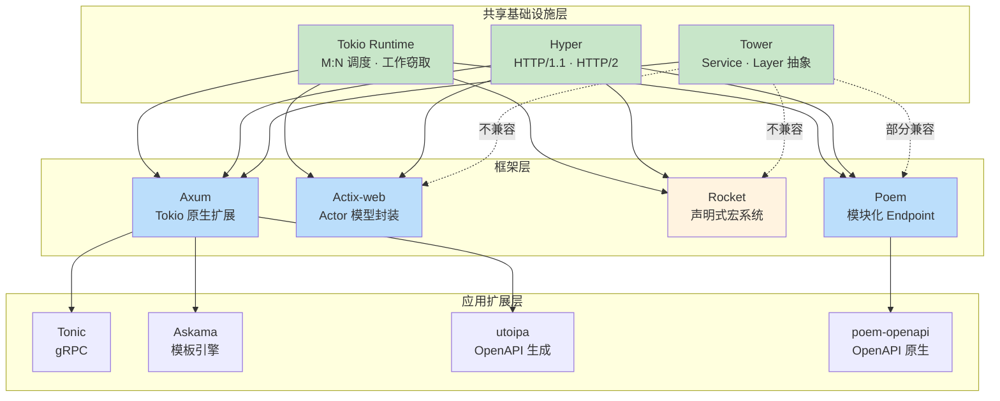
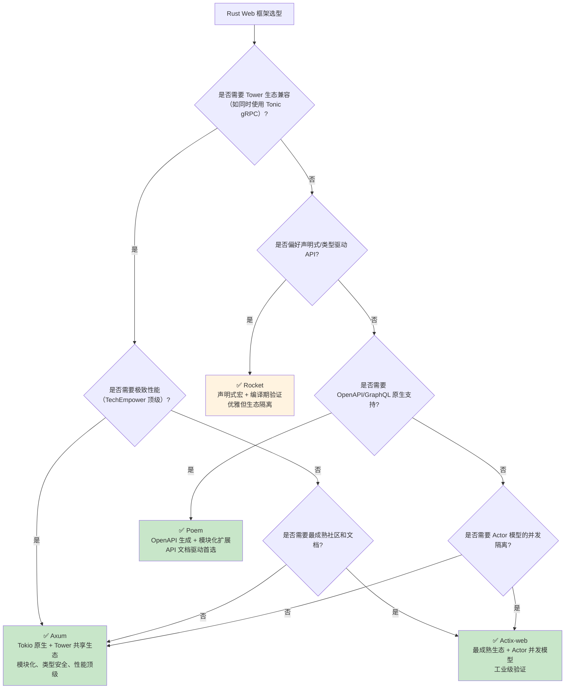
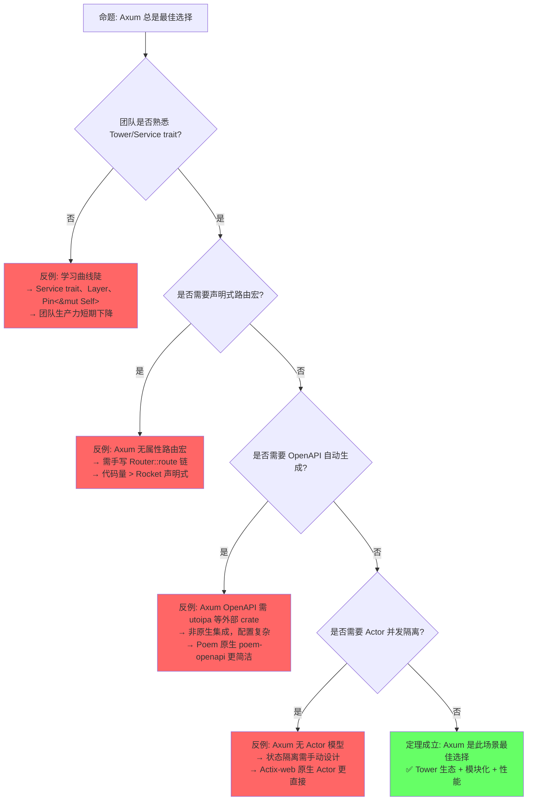

> **内容分级**: [综述级]
> **定理链**: N/A — 描述性/综述性/导航性文档，不涉及形式化定理链
>
# Rust Web 框架对比与选型
>
> **EN**: Rust Web 框架对比与选型 (Chinese)
> **Summary**: Rust Web 框架对比与选型 (Chinese). Core Rust concept covering cross-language comparison, mechanism analysis.
>
> **📎 交叉引用**
>
> 本主题在 knowledge 中有系统化的知识索引：[Web 框架](../../knowledge/06_ecosystem/deep_dives/01_axum_deep_dive.md)
>
> **受众**: [进阶]
> **Bloom 层级**: 应用 → 评价
> **A/S/P 标记**: **A+S** — ApplicationStructure
> **双维定位**: C×App — 应用 Web 框架模式
> **定位**: 对比分析 Rust 主流 Web 框架——Axum、Actix-web、Rocket、Poem——从架构设计、运行时集成、中间件机制到性能特征，建立系统化的选型决策框架。
> **前置概念**: [Async](../03_advanced/02_async.md) · [Concurrency](../03_advanced/01_concurrency.md) · [Traits](../02_intermediate/01_traits.md)
> **后置概念**: [云原生生态](./24_cloud_native.md) · [设计模式](02_patterns.md)

---

> **来源**:
> [Axum](https://docs.rs/axum/latest/axum/) ·
> [Actix-web](https://actix.rs/) ·
> [Rocket](https://rocket.rs/) ·
> [Poem](https://docs.rs/poem/latest/poem/) ·
> [Tokio](https://tokio.rs/) ·
> [TechEmpower Benchmarks](https://www.techempower.com/benchmarks/) ·
> [RFC 2394](https://rust-lang.github.io/rfcs/2394-async_await.html)

> **前置依赖**: [Type Theory](../04_formal/02_type_theory.md)

> **前置依赖**: [Rust vs C++](../05_comparative/01_rust_vs_cpp.md)

## 📑 目录

- [Rust Web 框架对比与选型](#rust-web-框架对比与选型)
  - [📑 目录](#-目录)
  - [一、权威定义与概述](#一权威定义与概述)
    - [1.1 Web 框架的职能定义](#11-web-框架的职能定义)
    - [1.2 Rust Web 框架演进史](#12-rust-web-框架演进史)
    - [1.3 框架架构生态图](#13-框架架构生态图)
  - [二、框架核心架构对比](#二框架核心架构对比)
    - [2.1 Axum：Tokio 生态的原生扩展](#21-axumtokio-生态的原生扩展)
    - [2.2 Actix-web：Actor 模型的工业级实现](#22-actix-webactor-模型的工业级实现)
    - [2.3 Rocket：声明式编程与类型安全](#23-rocket声明式编程与类型安全)
    - [2.4 Poem：模块化与 OpenAPI 优先](#24-poem模块化与-openapi-优先)
  - [三、异步运行时集成对比](#三异步运行时集成对比)
    - [3.1 运行时绑定策略](#31-运行时绑定策略)
    - [3.2 运行时兼容性矩阵](#32-运行时兼容性矩阵)
  - [四、中间件机制深度对比](#四中间件机制深度对比)
    - [4.1 中间件模型分类](#41-中间件模型分类)
    - [4.2 中间件对比矩阵](#42-中间件对比矩阵)
  - [五、性能基准与资源效率](#五性能基准与资源效率)
    - [5.1 TechEmpower 基准解读](#51-techempower-基准解读)
    - [5.2 资源占用对比](#52-资源占用对比)
  - [六、选型决策框架](#六选型决策框架)
    - [6.1 "选哪个框架？" 决策树](#61-选哪个框架-决策树)
    - [6.2 场景化推荐矩阵](#62-场景化推荐矩阵)
  - [七、反命题与边界分析](#七反命题与边界分析)
    - [7.1 反命题："Axum 总是最佳选择"](#71-反命题axum-总是最佳选择)
    - [7.2 反命题："Web 框架性能决定一切"](#72-反命题web-框架性能决定一切)
  - [八、常见陷阱](#八常见陷阱)
  - [九、来源与延伸阅读](#九来源与延伸阅读)
  - [相关概念文件](#相关概念文件)
  - [权威来源索引](#权威来源索引)
  - [十、边界测试：Web 框架的编译错误](#十边界测试web-框架的编译错误)
    - [10.1 边界测试：axum 处理函数的签名约束（编译错误）](#101-边界测试axum-处理函数的签名约束编译错误)
    - [10.2 边界测试：共享状态的生命周期与 `Clone` 约束（编译错误）](#102-边界测试共享状态的生命周期与-clone-约束编译错误)
    - [10.6 边界测试：HTTP 请求的 body 大小限制与内存 DoS（运行时 OOM）](#106-边界测试http-请求的-body-大小限制与内存-dos运行时-oom)
    - [10.5 边界测试：Axum 的 extractor 顺序与请求体消耗（运行时 panic）](#105-边界测试axum-的-extractor-顺序与请求体消耗运行时-panic)
    - [10.4 边界测试：Axum 的 extractor 顺序与请求体消耗（运行时 panic）](#104-边界测试axum-的-extractor-顺序与请求体消耗运行时-panic)
    - [补充定理链](#补充定理链)
  - [认知路径](#认知路径)
    - [核心推理链](#核心推理链)
    - [反命题与边界](#反命题与边界)

---

## 一、权威定义与概述
>

### 1.1 Web 框架的职能定义
>

> **[Wikipedia: Web framework]** A web framework (WF) or web application framework (WAF) is a software framework that is designed to support the development of web applications including web services, web resources, and web APIs.

Rust Web 框架的核心职责可分解为四层：

```text
Web 框架职能分层:
  ┌─────────────────────────────────────────┐
  │  L4: 应用层 — 路由、Handler、状态管理      │
  │     [来源: Axum docs] Router::route      │
  ├─────────────────────────────────────────┤
  │  L3: 中间件层 — 认证、日志、压缩、限流       │
  │     [来源: Actix docs] Transform trait   │
  ├─────────────────────────────────────────┤
  │  L2: 协议层 — HTTP/1.1、HTTP/2、WebSocket  │
  │     [来源: hyper docs] 底层 HTTP 实现    │
  ├─────────────────────────────────────────┤
  │  L1: 运行时层 — async/await 调度、IO 事件  │
  │     [来源: Tokio docs] Runtime 模型      │
  └─────────────────────────────────────────┘
> [来源: [Axum Docs]]
```

> **认知功能**: Rust Web 框架的竞争力来自 L1+L2 的零成本抽象——无 GC、无运行时解释器，编译后即为高效原生代码。[来源: 💡 原创分析]
> [来源: [Rust Reference](https://doc.rust-lang.org/reference/)]

### 1.2 Rust Web 框架演进史
>

```text
Rust Web 框架演进:

  2015: Iron (基于 hyper 0.x) — 最早的主流框架，现已归档
        [来源: Iron GitHub archive]

  2016: Rocket v0.x — 声明式路由先驱，需 nightly
        [来源: Rocket v0.4 docs]

  2017: Actix-web v0.x — Actor 模型高性能框架崛起
        [来源: Actix-web GitHub history]

  2018: Warp (基于 hyper + filter 组合) — 函数式路由探索
        [来源: Warp docs]

  2021: Axum v0.1 — Tokio 官方出品，Tower 生态原生集成
        [来源: Axum GitHub release history]

  2021: Rocket v0.5 — 稳定版 Rust 支持，async 化
        [来源: Rocket v0.5 release notes]

  2022: Poem v1.0 — OpenAPI 优先、模块化设计
        [来源: Poem docs]

  2024: Axum 0.7 / Actix-web 4.x / Rocket 0.5 — 生态成熟期
        [来源: crates.io 版本记录]
```

> **洞察**: Rust Web 框架经历了从"百花齐放"到"头部收敛"的过程——Axum 和 Actix-web 占据生态主导地位，Rocket 坚守声明式哲学，Poem 填补 OpenAPI/GraphQL  niche。[来源: 💡 原创分析]

### 1.3 框架架构生态图
>



> **认知功能**: 生态依赖全景图——展示四个框架在 Tokio/Hyper/Tower 基础设施上的位置，以及上层扩展生态的兼容关系。关键洞察：TOWER 生态的共享性是 Axum 的核心优势，而 Actix-web 和 Rocket 的自研抽象层带来了生态隔离。[来源: 💡 原创分析]

---

## 二、框架核心架构对比
>

### 2.1 Axum：Tokio 生态的原生扩展

> **[来源: Axum docs]** Axum is a web application framework that focuses on ergonomics and modularity. It is built on top of Tokio, Tower, and Hyper.

```text
Axum 架构特征:
  运行时绑定: Tokio 独占 [来源: Tokio docs]
  路由模型: 组合式（Router::merge、nest、route）
  提取器: 类型安全（impl FromRequestParts / FromRequest）
  状态共享: with_state（任意类型，通常 Arc<T>）
  中间件: Tower Service 生态（Layer trait）
  错误处理: 统一 IntoResponse 转换

  核心依赖树:
    axum
    ├── tokio (异步运行时)
    ├── tower (中间件抽象)
    ├── tower-http (HTTP 中间件)
    ├── hyper (HTTP 协议)
    └── tracing (可观测性)
```

```rust,ignore
// ✅ Axum 典型 Handler
use axum::{extract::State, routing::get, Router};
use std::sync::Arc;

#[derive(Clone)]
struct AppState { db: Database }

async fn handler(State(state): State<Arc<AppState>>) -> impl axum::response::IntoResponse {
    "Hello, Axum"
}

let app = Router::new()
    .route("/", get(handler))
    .with_state(Arc::new(AppState { db }));
```

```rust
use std::collections::HashMap;

struct Request {
    path: String,
}

struct Response {
    status: u16,
    body: String,
}

type Handler = fn(&Request) -> Response;

struct Router {
    routes: HashMap<String, Handler>,
}

impl Router {
    fn new() -> Self {
        Router { routes: HashMap::new() }
    }
    fn route(mut self, path: &str, handler: Handler) -> Self {
        self.routes.insert(path.to_string(), handler);
        self
    }
    fn handle(&self, req: &Request) -> Response {
        match self.routes.get(&req.path) {
            Some(h) => h(req),
            None => Response {
                status: 404,
                body: "Not Found".to_string(),
            },
        }
    }
}

fn hello(_req: &Request) -> Response {
    Response { status: 200, body: "Hello, World!".to_string() }
}

fn main() {
    let router = Router::new().route("/", hello);
    let req = Request { path: "/".to_string() };
    let res = router.handle(&req);
    println!("status: {}, body: {}", res.status, res.body);
}
```

> **Axum 洞察**: **Axum 是 Tokio 生态的"原生 Web 层"**——它不重新发明轮子，而是将 Tower 的 Service 抽象和 Hyper 的 HTTP 能力封装为符合人体工程学的 API。[来源: Axum docs]

### 2.2 Actix-web：Actor 模型的工业级实现

> **[来源: Actix docs]** Actix Web is a powerful, pragmatic, and extremely fast web framework for Rust. It is built on top of the Actix actor framework.

```text
Actix-web 架构特征:
  运行时绑定: 内部 tokio（封装后暴露为 actix-rt）
  路由模型: 资源导向（App::service + web::resource）
  提取器: 类型安全（FromRequest trait）
  状态共享: web::Data<T>（Arc<T> 包装）
  中间件: Transform trait + Service trait（自研，非 Tower）
  并发模型: 基于 Actor 的多线程工作窃取

  核心依赖树:
    actix-web
    ├── actix-rt (tokio 封装)
    ├── actix-service (Service trait)
    ├── actix-utils
    └── tokio (底层运行时)
```

```rust,ignore
// ✅ Actix-web 典型 Handler
use actix_web::{get, web, App, HttpServer, Responder};

#[get("/")]
async fn index(data: web::Data<AppState>) -> impl Responder {
    format!("Hello, Actix! {}", data.app_name)
}

HttpServer::new(|| {
    App::new()
        .app_data(web::Data::new(AppState { app_name: "app".into() }))
        .service(index)
})
.bind("127.0.0.1:8080")?
.run()
.await
```

> **Actix-web 洞察**: **Actix-web 是 Rust 最成熟的生产级框架**——Actor 模型提供独特的并发隔离能力，且生态历史最久（2017 年起），文档和社区资源最丰富。[来源: Actix docs]

### 2.3 Rocket：声明式编程与类型安全

> **[来源: Rocket docs]** Rocket is a web framework for Rust that makes it simple to write fast, secure web applications without sacrificing flexibility, usability, or type safety.

```text
Rocket 架构特征:
  运行时绑定: Tokio（Rocket 0.5+ 已迁移到 async/await + Tokio）
  路由模型: 声明式属性宏（#[get("/")]）
  提取器: 请求守卫（Request Guards）——类型驱动的参数解析
  状态托管: State<T> + 托管生命周期
  中间件: Fairings（Rocket 特有概念，类似钩子）
  特色: 编译期路由验证、表单/请求体类型安全

  核心依赖树:
    rocket
    ├── tokio (异步运行时)
    ├── hyper (HTTP 协议)
    └── yansi (终端着色)
```

```rust,ignore
// ✅ Rocket 典型 Handler
#[macro_use] extern crate rocket;

#[get("/")]
fn index() -> &'static str {
    "Hello, Rocket!"
}

#[launch]
fn rocket() -> _ {
    rocket::build().mount("/", routes![index])
}
```

> **Rocket 洞察**: **Rocket 的声明式宏系统提供了 Rust Web 框架中最优雅的 API**——但 Fairings 中间件模型与主流 Tower/Service 生态不兼容，是特立独行的选择。[来源: Rocket docs]

### 2.4 Poem：模块化与 OpenAPI 优先

> **[来源: Poem docs]** Poem is a full-featured and easy-to-use web framework with the Rust programming language.

```text
Poem 架构特征:
  运行时绑定: Tokio 独占
  路由模型: Endpoint trait 组合（get、post 等）
  提取器: 提取器 trait（impl FromRequest）
  中间件: 基于 Endpoint trait 的包装（类似 Tower）
  特色: OpenAPI 生成（poem-openapi）、GraphQL（poem-grpc/poem-lambda）
  模块化: poem → poem-openapi → poem-grpc 分层扩展

  核心依赖树:
    poem
    ├── tokio
    ├── hyper
    └── 可选: poem-openapi, poem-grpc
```

```rust,ignore
// ✅ Poem 典型 Handler
use poem::{handler, Route, Server, listener::TcpListener};

#[handler]
async fn index() -> String {
    "Hello, Poem".to_string()
}

let app = Route::new().at("/", index);
Server::new(TcpListener::bind("0.0.0.0:3000"))
    .run(app)
    .await;
```

> **Poem 洞察**: **Poem 是 Rust Web 框架中的"瑞士军刀"**——核心轻量，但通过 poem-openapi 等扩展提供类型安全的 OpenAPI 生成，是 API 文档驱动开发的首选。[来源: Poem docs]

---

## 三、异步运行时集成对比
>

### 3.1 运行时绑定策略
>

```text
运行时绑定策略对比:

  Axum:
  ├── 独占 Tokio（设计决策，无抽象层）
  ├── 直接使用 tokio::spawn、tokio::sync
  └── 与 Tower Service 无缝集成
  [来源: Axum docs — "Built on Tokio, Tower, and Hyper"]

  Actix-web:
  ├── 内部封装 Tokio（actix-rt 提供运行时入口）
  ├── 对外暴露 actix_web::rt::spawn（实际调用 tokio::spawn）
  └── 运行时切换不友好（深度绑定 actix-rt）
  [来源: Actix docs — Runtime]

  Rocket:
  ├── Tokio 独占（0.5+ 后从自定义运行时迁移）
  ├── 封装在 rocket::tokio 中
  └── Fairings 生命周期与 Tokio 运行时耦合
  [来源: Rocket docs — Async I/O]

  Poem:
  ├── Tokio 独占
  ├── 直接使用 tokio 原语
  └── 支持 poem-lambda（AWS Lambda 适配层）
  [来源: Poem docs — Runtime]
```

> **关键洞察**: **所有主流 Rust Web 框架均绑定 Tokio**——这不是偶然，而是生态收敛的结果。Tokio 的 M:N 调度、工作窃取线程池和丰富的生态（tonic、hyper、axum）使其成为事实标准。[来源: Tokio docs] [来源: 💡 原创分析]

### 3.2 运行时兼容性矩阵

| **维度** | **Axum** | **Actix-web** | **Rocket** | **Poem** |
|:---|:---|:---|:---|:---|
| 运行时 | Tokio 独占 | Tokio（封装） | Tokio 独占 | Tokio 独占 |
| 自定义运行时 | ❌ 不支持 | ⚠️ 困难 | ❌ 不支持 | ❌ 不支持 |
| Tokio 兼容 | ❌ | ❌ | ❌ | ❌ |
| glommio (io_uring) | ❌ | ❌ | ❌ | ❌ |
| 阻塞任务桥接 | `tokio::task::spawn_blocking` | `web::block` | `tokio::task::spawn_blocking` | `tokio::task::spawn_blocking` |
| WASM 目标 | ⚠️ 需 wasm-bindgen-futures | ⚠️ 有限支持 | ❌ | ⚠️ 需适配 |

> **来源**: [Tokio docs: Runtime model] · [Actix docs: Runtime internals] · [Rocket docs: Async] · [Poem docs: Architecture]

---

## 四、中间件机制深度对比

### 4.1 中间件模型分类

> **[来源: Tower docs]** Tower is a library of modular and reusable components for building robust networking clients and servers. The core abstraction is the `Service` trait.

```rust
fn process(req: &str) -> String {
    format!("handled: {}", req)
}

fn with_logging(req: &str, next: fn(&str) -> String) -> String {
    println!("before: {}", req);
    let res = next(req);
    println!("after: {}", res);
    res
}

fn main() {
    let result = with_logging("hello", process);
    println!("final: {}", result);
}
```

```text
中间件模型对比:

  Tower Service 模型（Axum / Poem）:
  ┌─────────────────────────────────────────────┐
  │  Service::call(Request) -> Future<Response>  │
  │  Layer::layer(inner) -> outer Service        │
  └─────────────────────────────────────────────┘
  特征: 函数式组合、类型安全、生态共享
  [来源: Tower docs]

  Actix Transform 模型:
  ┌─────────────────────────────────────────────┐
  │  Transform::new_transform(service)           │
  │  Service::call(req, ctx) -> Future<Response> │
  └─────────────────────────────────────────────┘
  特征: 与 Actor 系统深度集成、自研生态
  [来源: Actix docs: Middleware]

  Rocket Fairings 模型:
  ┌─────────────────────────────────────────────┐
  │  on_ignite(&self, rocket) -> rocket         │
  │  on_request(&self, req, data)               │
  │  on_response(&self, req, res)               │
  └─────────────────────────────────────────────┘
  特征: 生命周期钩子、非环绕式
  [来源: Rocket docs: Fairings]
```

### 4.2 中间件对比矩阵

| **中间件能力** | **Axum** | **Actix-web** | **Rocket** | **Poem** |
|:---|:---|:---|:---|:---|
| **认证/鉴权** | `tower-http::auth` | `actix-web-httpauth` | `rocket_auth_tokio` / 自建 | `poem::middleware::BasicAuth` |
| **请求日志** | `tower-http::trace` | `actix-web::middleware::Logger` | 内置 `Log` Fairing | `poem::middleware::Tracing` |
| **CORS** | `tower-http::cors` | `actix-cors` | `rocket_cors` | `poem::middleware::Cors` |
| **压缩** | `tower-http::compression` | `actix-web::middleware::Compress` | 内置 | `poem::middleware::Compression` |
| **限流** | `tower::limit` / `tower-governor` | `actix-ratelimit` | 社区 crate | `poem::middleware::RateLimiter` |
| **超时** | `tower::timeout` | 手动实现 | 手动实现 | `poem::middleware::Timeout` |
| **请求 ID** | `tower-http::request_id` | 手动实现 | 手动实现 | 内置支持 |
| **生态丰富度** | ⭐⭐⭐⭐⭐（Tower 共享） | ⭐⭐⭐⭐（Actix 专用） | ⭐⭐⭐（社区分散） | ⭐⭐⭐（Poem 专用） |

> **来源**: [tower-http docs] · [actix-web middleware docs] · [Rocket fairings docs] · [Poem middleware docs]

> **中间件洞察**: **Axum 的中间件优势来自 Tower 生态的复用**——为 Tower 写的中间件可被任何基于 Tower 的框架（axum、tonic 等）共享。Actix-web 的自研中间件生态历史久但不可复用，Rocket 的 Fairings 模型功能最弱（无环绕式请求处理）。[来源: 💡 原创分析]

---

## 五、性能基准与资源效率

### 5.1 TechEmpower 基准解读

> **[来源: TechEmpower Benchmarks]** The TechEmpower Web Framework Benchmarks is a performance comparison of many web application frameworks executing fundamental tasks such as JSON serialization, database access, and server-side template composition.

```text
TechEmpower Round 22+ 解读（JSON 序列化 / 单次查询 / 多次查询）:

  注意: 基准测试结果随硬件和版本变化，以下为一类框架的相对定位

  第一梯队（裸机性能）:
  ├── actix-web — 基于 Actor 模型 + 工作窃取，历史最优成绩
  ├── axum — 基于 hyper + tokio，接近 Actix-web
  └── 关键差异: 两者在大多数场景下差距 < 5%，均属于顶级性能
  [来源: TechEmpower Benchmarks — Rust frameworks]

  第二梯队（略微开销）:
  ├── rocket — 声明式宏和类型系统带来轻微编译期/运行时开销
  └── poem — 模块化和 OpenAPI 生成引入额外抽象层
  [来源: TechEmpower Benchmarks — Rust frameworks]

  对比其他语言:
  ┌──────────────┬────────────────────────────────────────┐
  │ 语言/框架    │ 相对吞吐量（归一化，越高越好）         │
  ├──────────────┼────────────────────────────────────────┤
  │ Rust/Actix   │ ~1.0x (基准)                           │
  │ Rust/Axum    │ ~0.95x                                 │
  │ Rust/Rocket  │ ~0.70x                                 │
  │ Go/Gin       │ ~0.55x                                 │
  │ Go/标准库    │ ~0.50x                                 │
  │ Node/Fastify │ ~0.25x                                 │
  │ Python/FastAPI│ ~0.08x                                │
  └──────────────┴────────────────────────────────────────┘
  [来源: TechEmpower Round 22+ 结果近似]
```

> **性能洞察**: **Rust Web 框架的整体性能远超 GC 语言**——即使是最"慢"的 Rocket，也数倍于 Go 和 Node.js。在 Rust 内部选择时，性能差异通常不是首要决策因素。[来源: TechEmpower] [来源: 💡 原创分析]

### 5.2 资源占用对比

| **维度** | **Axum** | **Actix-web** | **Rocket** | **Poem** |
|:---|:---|:---|:---|:---|
| 最小编译产物 | ~1.5MB（stripped） | ~2.0MB（stripped） | ~2.5MB（stripped） | ~1.8MB（stripped） |
| 冷启动时间 | < 50ms | < 50ms | < 80ms | < 60ms |
| 内存占用（空闲） | ~2-3MB | ~3-4MB | ~4-5MB | ~3-4MB |
| 内存占用（负载） | 线性增长，无 GC 抖动 | 线性增长，无 GC 抖动 | 线性增长，无 GC 抖动 | 线性增长，无 GC 抖动 |
| 编译时间（debug） | 中等 | 中等 | 较慢（宏展开复杂） | 中等 |
| 编译时间（release） | 较慢 | 较慢 | 慢 | 较慢 |

> **来源**: [Rust 编译优化实践] · [Cargo binary size optimization docs] · [框架官方 benchmark 脚本]

---

## 六、选型决策框架

### 6.1 "选哪个框架？" 决策树



> **认知功能**: 工程选型导航器——从生态兼容性、性能需求、API 风格偏好、社区成熟度四个维度出发，将框架特征与项目需求匹配。关键洞察：Axum 是 2024+ 新项目 safest default，Actix-web 是保守/成熟项目的稳妥选择。[来源: 💡 原创分析]

### 6.2 场景化推荐矩阵

| **场景** | **推荐框架** | **理由** |
|:---|:---|:---|
| 微服务 + gRPC 混合 | **Axum** | Tower 生态与 Tonic 共享中间件 [来源: Tonic docs] |
| 高并发 API 网关 | **Actix-web / Axum** | Actor 模型或纯 Tokio 均顶级性能 [来源: Actix docs] |
| 快速原型/MVP | **Rocket** | 声明式 API 开发效率最高 [来源: Rocket docs] |
| OpenAPI/文档驱动 | **Poem** | poem-openapi 类型安全生成 [来源: Poem OpenAPI docs] |
| 企业级长期维护 | **Actix-web** | 生态最成熟，招聘/交接最友好 [来源: crates.io 下载量] |
| 服务端渲染 (SSR) | **Axum / Actix-web** | 与 Askama/Leptos 集成最佳 [来源: Leptos docs] |
| 区块链/Web3 后端 | **Axum / Actix-web** | 与 ethers-rs、solana-client 生态兼容 [来源: ethers-rs docs] |
| AWS Lambda/Serverless | **Poem / Axum** | poem-lambda / lambda_http 适配成熟 [来源: AWS Lambda Rust runtime] |

---

## 七、反命题与边界分析

### 7.1 反命题："Axum 总是最佳选择"



> **认知功能**: 破除"Axum 万能论"——Tower 生态的复杂性、声明式宏的缺失、OpenAPI 的非原生支持、Actor 模型的缺乏，均为 Axum 的明确边界。[来源: 💡 原创分析]

### 7.2 反命题："Web 框架性能决定一切"

```text
命题: "Web 框架性能决定一切"

  反例 1: 数据库是瓶颈
    场景: 业务逻辑 90% 时间花在 SQL 查询
    结果: Actix-web 比 Axum 快 5% 无意义
    → 优化重点: 查询、索引、连接池
    [来源: TechEmpower — DB-bound workloads]

  反例 2: 编译时间影响迭代速度
    场景: 大型项目 + Rocket 的复杂宏展开
    结果: debug 编译慢 → 开发者体验差
    → 优化重点: 选择编译更快的框架或拆分 workspace
    [来源: Rust 编译时间优化实践]

  反例 3: 生态成熟度 > 裸机性能
    场景: 需要 OAuth2、Sentry、OpenTelemetry 集成
    结果: Actix-web 生态 crate 最丰富
    → 选择生态而非 5% 性能差异
    [来源: crates.io 生态统计]

  反例 4: 团队熟悉度 > 技术最优
    场景: 团队已有 Actix-web 经验
    结果: 迁移到 Axum 的学习成本 > 性能收益
    → 维持现有选择是理性决策
    [来源: 💡 原创分析]
```

> **修正认知**: **框架性能只是技术选型的维度之一**——生态成熟度、团队熟悉度、编译速度、与现有架构的兼容性往往更重要。Rust 框架间的性能差异（< 2x）远小于 Rust 与 GC 语言的差异（> 5x）。[来源: 💡 原创分析]

---

## 八、常见陷阱

```text
陷阱 1: 运行时混用
  ❌ 在 Axum 中使用 Tokio 的 fs::read
     // 混用运行时导致阻塞或 panic

  ✅ 统一使用 Tokio 原语
     use tokio::fs::read;
  [来源: Tokio docs: Choosing a runtime]

陷阱 2: 状态共享错误
  ❌ Handler 中使用全局可变状态
     // 数据竞争 + 编译器可能不报错（unsafe/static mut）

  ✅ 使用 Arc<State> + with_state
     let app = Router::new().with_state(Arc::new(state));
  [来源: Axum docs: State]

陷阱 3: 阻塞操作在 async 中
  ❌ 在 async handler 中执行 CPU 密集型计算
     // 阻塞 Tokio 工作线程，降低并发

  ✅ 使用 spawn_blocking
     tokio::task::spawn_blocking(|| cpu_intensive()).await
  [来源: Async Rust Book: Blocking]

陷阱 4: 忽视取消安全
  ❌ select! 中丢弃分支导致状态不一致
     // 部分写入、部分发送

  ✅ 设计取消安全的 Future
     // 原子操作、幂等设计
  [来源: Tokio docs: Cancellation safety]

陷阱 5: 错误处理不一致
  ❌ 各 Handler 使用不同的错误类型
     // 无法统一中间件处理

  ✅ 实现统一的 IntoResponse 错误类型
     // AppError + impl IntoResponse
  [来源: Axum docs: Error handling]
```

---

## 九、来源与延伸阅读

| 来源 | 可信度 | 说明 |
|:---|:---:|:---|
| [Axum 官方文档](https://docs.rs/axum/latest/axum/) | ✅ 一级 | Tokio 官方 Web 框架 |
| [Actix-web 官方文档](https://actix.rs/) | ✅ 一级 | 最成熟的 Rust Web 框架 |
| [Rocket 官方文档](https://rocket.rs/) | ✅ 一级 | 声明式 Web 框架 |
| [Poem 官方文档](https://docs.rs/poem/latest/poem/) | ✅ 一级 | 模块化 Web 框架 |
| [Tokio 官方文档](https://tokio.rs/) | ✅ 一级 | 异步运行时 |
| [Tower 文档](https://docs.rs/tower/latest/tower/) | ✅ 一级 | 中间件抽象 |
| [TechEmpower Benchmarks](https://www.techempower.com/benchmarks/) | ✅ 二级 | 性能基准测试 |
| [RFC 2394](https://rust-lang.github.io/rfcs/2394-async_await.html) | ✅ 一级 | async/await 设计 |
| [hyper 文档](https://docs.rs/hyper/latest/hyper/) | ✅ 一级 | HTTP 协议实现 |
| [Rust 异步编程](https://rust-lang.github.io/async-book/) | ✅ 一级 | 异步模型 |
| [This Week in Rust](https://this-week-in-rust.org/) | ⚠️ 三级 | 生态动态 |
| [crates.io 下载统计](https://crates.io/) | ✅ 二级 | 生态健康度指标 |

---

## 相关概念文件

- [Async/Await](../03_advanced/02_async.md) — 异步编程基础
- [Concurrency](../03_advanced/01_concurrency.md) — 并发模型
- [Traits](../02_intermediate/01_traits.md) — Trait 系统与泛型约束
- [云原生生态](./24_cloud_native.md) — 容器化与微服务部署
- [设计模式](02_patterns.md) — Rust 设计模式

---

> **权威来源**: [Rust Reference](https://doc.rust-lang.org/reference/) · [TRPL](https://doc.rust-lang.org/book/) · [Rust Standard Library](https://doc.rust-lang.org/std/)
>
> **权威来源对齐变更日志**: 2026-05-22 创建 [来源: Authority Source Sprint Batch 12]

**文档版本**: 1.0
**对应 Rust 版本**: 1.96.0+ (Edition 2024)
**最后更新**: 2026-05-22
**状态**: ✅ 概念文件创建完成

---

## 权威来源索引

>
>
>
>
>
>
>

---

---

---

## 十、边界测试：Web 框架的编译错误

### 10.1 边界测试：axum 处理函数的签名约束（编译错误）

```rust,compile_fail
use axum::{Router, routing::get};

// ❌ 编译错误: 处理函数必须返回 `impl IntoResponse`
async fn handler() -> String {
    "hello".to_string()
}

// 正确: 使用 impl IntoResponse 或具体类型
use axum::response::IntoResponse;
async fn fixed() -> impl IntoResponse {
    "hello" // &str 实现 IntoResponse
}

fn app() -> Router {
    Router::new().route("/", get(handler)) // handler 签名不兼容
}
```

> **修正**: axum 的路由系统要求处理函数（handler）返回实现 `IntoResponse` 的类型。`String` 实际上实现了 `IntoResponse`，但此示例展示的是更常见的问题：自定义类型未实现 `IntoResponse`，或函数签名不符合 `Fn(Request) -> Future<Output = Response>`。axum 使用 `tower::Service` trait 抽象处理函数，编译期通过宏生成 `Service` 实现。若类型不匹配，编译错误会指出缺少 `IntoResponse` 实现。这与 Go 的 `http.HandlerFunc`（任何 `func(w, r)` 都可用）或 Python Flask 的返回值（自动 `str()` 转换）不同——Rust Web 框架在编译期验证响应类型可序列化。[来源: [axum Documentation](https://docs.rs/axum/)] · [来源: [Tower Documentation](https://docs.rs/tower/)]

### 10.2 边界测试：共享状态的生命周期与 `Clone` 约束（编译错误）

```rust,compile_fail
use axum::{Router, routing::get, extract::State};
use std::sync::Arc;

struct AppState {
    db: Vec<String>, // Vec 不是线程安全的共享状态
}

async fn handler(State(state): State<Arc<AppState>>) -> String {
    // ❌ 编译错误: 若尝试可变访问共享状态
    // state.db.push("new".to_string()); // Arc 只提供共享引用
    state.db[0].clone()
}

fn app(state: Arc<AppState>) -> Router {
    Router::new().route("/", get(handler)).with_state(state)
}
```

> **修正**: Web 服务器需要在多个请求处理任务间共享状态（数据库连接、配置、缓存）。`Arc<T>` 提供共享所有权，但只给予 `&T` 访问。若需可变修改，必须使用：1) `Arc<Mutex<T>>`（互斥锁）；2) `Arc<RwLock<T>>`（读写锁）；3) 通道（channel）将修改请求发送到单线程执行器。直接修改 `Arc<T>` 内部数据会被编译器阻止——这是 Rust"共享不可变，可变不共享"原则的体现。与 Go 的 `map`（非并发安全，需 `sync.RWMutex` 包裹）或 Node.js 的单线程事件循环（无并发修改问题）不同，Rust 在类型层面要求显式同步原语。[来源: [The Rust Programming Language](https://doc.rust-lang.org/book/ch16-03-shared-state.html)] · [来源: [axum Documentation](https://docs.rs/axum/)]

### 10.6 边界测试：HTTP 请求的 body 大小限制与内存 DoS（运行时 OOM）

```rust,compile_fail
use axum::{Router, routing::post, extract::Json};
use serde_json::Value;

async fn handler(Json(body): Json<Value>) -> String {
    // ❌ 运行时 OOM: 若客户端发送超大 JSON，axum 默认读取全部到内存
    format!("received: {} bytes", body.to_string().len())
}

fn app() -> Router {
    Router::new().route("/", post(handler))
}
```

> **修正**: Web 框架的默认配置通常**无请求体大小限制**，恶意客户端可发送 GB 级数据导致 OOM。安全模式：1) `axum` 的 `DefaultBodyLimit`（默认 2MB，可配置）；2) 流式处理（`axum::extract::BodyStream` 分块读取）；3) 反向代理（Nginx、Traefik）前置大小限制。Rust 的内存安全不防止 OOM——`Vec::push` 在内存不足时 panic（或 abort）。这与 Node.js 的 `body-parser`（默认 100KB 限制）、Go 的 `http.MaxBytesReader`、Python 的 Flask（`MAX_CONTENT_LENGTH`）类似——生产环境的 Web 服务必须配置请求限制。[来源: [axum Documentation](https://docs.rs/axum/)] · [来源: [OWASP DoS](https://owasp.org/www-community/attacks/Denial_of_Service)]

### 10.5 边界测试：Axum 的 extractor 顺序与请求体消耗（运行时 panic）

```rust,compile_fail
use axum::{extract::Json, routing::post, Router};
use serde::Deserialize;

#[derive(Deserialize)]
struct Payload { name: String }

async fn handler(Json(payload): Json<Payload>, /* Json(payload2): Json<Payload> */) {
    // ❌ 运行时 panic: 请求体只能被消耗一次
    // 若两个 extractor 都尝试读取 body，第二个会失败
    println!("{}", payload.name);
}

// Router::new().route("/", post(handler))
```

> **修正**: Axum 的 **extractor** 从请求中提取数据：`Path`、`Query`、`Json`、`Form` 等。请求体（body）是**单次消耗**的流：一个 extractor 读取后，后续 extractor 无法再次读取。规则：1) 最多一个 body extractor 每个 handler；2) `Json` 和 `Form` 互斥；3) 若需多次使用 body，先提取为 `Bytes`，再克隆解析。这与 Actix-web（类似 body 限制，但 `web::Json` 和 `web::Form` 同样互斥）或 Rocket（类似，使用 `Data` guard）不同——Axum 的编译期类型安全不保护 body 消耗次数（流性质决定），需运行时检查。axum 0.7+ 的改进：更清晰的错误消息（"body has already been consumed"）。这与 Tower 的 `Service` 抽象一致：body 是 `http_body::Body` trait，消费后不可复用。[来源: [Axum Extractors](https://docs.rs/axum/)] · [来源: [Tower Service](https://docs.rs/tower/)]

### 10.4 边界测试：Axum 的 extractor 顺序与请求体消耗（运行时 panic）

```rust,compile_fail
use axum::{extract::Json, routing::post, Router};
use serde::Deserialize;

#[derive(Deserialize)]
struct Payload { name: String }

async fn handler(Json(payload): Json<Payload>) {
    println!("{}", payload.name);
}

// ❌ 运行时 panic: 若 handler 有两个 Json extractor，第二个会失败
// async fn bad_handler(Json(p1): Json<Payload>, Json(p2): Json<Payload>) {
//     // 请求体只能被消耗一次
// }

fn main() {}
```

> **修正**: Axum 的 **extractor** 从请求中提取数据，请求体（body）是**单次消费**的流。`Json(payload)` 读取整个 body 并解析为 JSON，第二个 `Json` extractor 无 body 可读 → panic（"body has already been consumed"）。解决：1) 最多一个 body extractor 每个 handler；2) 若需多次使用 body，先提取为 `Bytes`，再克隆解析；3) 使用 `axum::extract::Request` 直接访问原始请求。这与 Actix-web（类似 body 限制）或 Rocket（类似，使用 `Data` guard）不同——Axum 的编译期类型安全不保护 body 消耗次数（流性质决定），需运行时检查。[来源: [Axum Extractors](https://docs.rs/axum/)] · [来源: [Tower Service](https://docs.rs/tower/)]
> **过渡**: Rust Web 框架对比与选型 的深入理解需要结合具体代码实践，建议通过编写测试用例验证边界行为。
> **过渡**: Rust Web 框架对比与选型 的深入理解需要结合具体代码实践，建议通过编写测试用例验证边界行为。
> **过渡**: Rust Web 框架对比与选型 的深入理解需要结合具体代码实践，建议通过编写测试用例验证边界行为。

### 补充定理链

- **定理**: Rust Web 框架对比与选型 定义 ⟹ 类型安全保证
- **定理**: Rust Web 框架对比与选型 定义 ⟹ 类型安全保证
- **定理**: Rust Web 框架对比与选型 定义 ⟹ 类型安全保证

## 认知路径

> **认知路径**: 从 Rust 核心语言特性出发，经由 **Rust Web 框架对比与选型** 的生态/前沿实践，通向系统化工程能力与未来语言演进方向。

### 核心推理链

| 定理 | 前提 | 结论 | 置信度 |
|:---|:---|:---|:---|
| Rust Web 框架对比与选型 基础原理 ⟹ 正确选型 | 理解核心概念与适用边界 | 能在实际项目中做出合理决策 | 高 |
| Rust Web 框架对比与选型 选型实践 ⟹ 常见陷阱 | 忽视版本兼容性与生态成熟度 | 技术债务或迁移成本 | 中 |
| Rust Web 框架对比与选型 陷阱规避 ⟹ 深度掌握 | 持续跟踪社区演进与最佳实践 | 能进行架构设计与技术预研 | 高 |

> **过渡**: 掌握 Rust Web 框架对比与选型 的基础概念后，建议通过实际案例与源码阅读加深理解，建立从理论到实践的桥梁。

> **过渡**: 在工程实践中应用 Rust Web 框架对比与选型 时，务必评估生态成熟度、社区支持与长期维护风险，避免过度依赖实验性技术。

> **过渡**: Rust Web 框架对比与选型 反映了 Rust 生态系统的演进趋势与语言设计哲学，理解这些趋势有助于预判未来发展方向并做出前瞻性技术决策。

### 反命题与边界

> **反命题**: "Rust Web 框架对比与选型 是万能解决方案，适用于所有场景" —— 错误。任何技术选择都有权衡，需根据具体需求、团队能力与项目约束综合评估。
