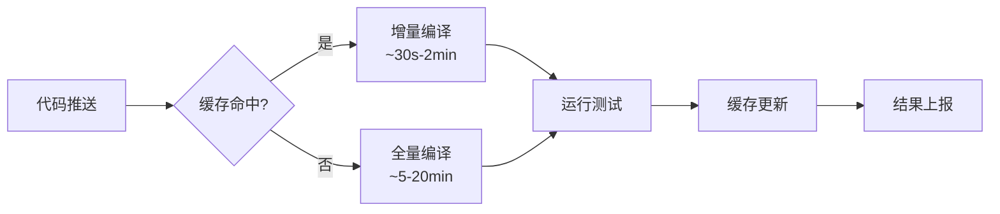
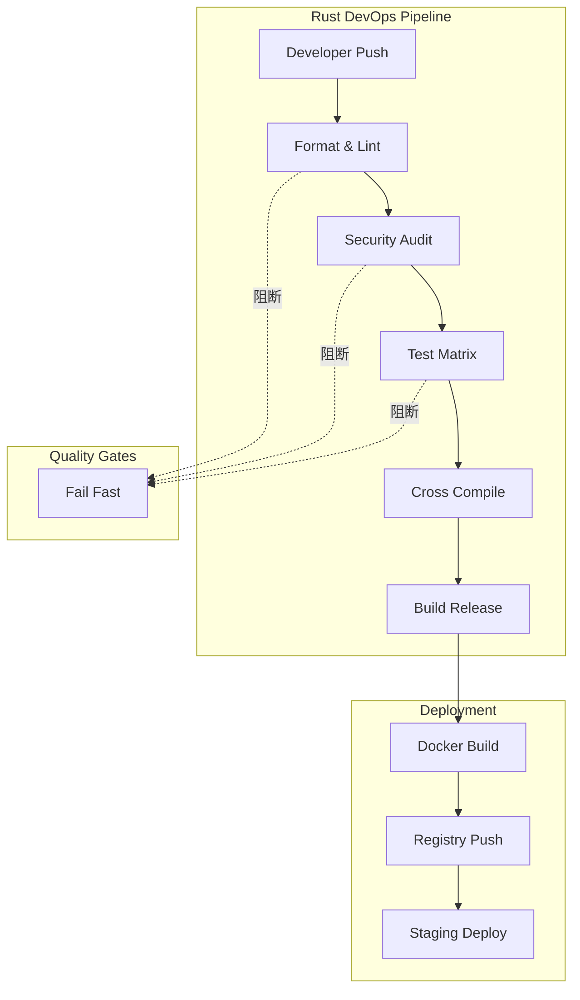

# DevOps 与 CI/CD：Rust 的持续交付工程实践
>
> **受众**: [进阶]

> **Bloom 层级**: 应用 → 评价
> **A/S/P 标记**: **A+P** — ApplicationProcedure
> **双维定位**: P×App — 实施 DevOps 和 CI/CD
> **定位**: 系统分析 Rust **DevOps 工程实践**——从 GitHub Actions 工作流设计、cargo-release 发布自动化、交叉编译 CI 集成，到 Docker 镜像优化、构建缓存策略、CI 测试矩阵与安全审计（cargo-audit、cargo-deny），揭示 Rust 项目如何从代码提交到生产部署实现高可靠持续交付。
> **前置概念**: [Toolchain](./01_toolchain.md) · [Cross Compilation](./17_cross_compilation.md)
> **后置概念**: [Cloud Native](./24_cloud_native.md) · [Security Practices](./19_security_practices.md)

---

> **来源**: [GitHub Actions Docs](https://docs.github.com/en/actions) · [Cargo Book — Workspaces](https://doc.rust-lang.org/cargo/reference/workspaces.html) · [cargo-release](https://github.com/crate-ci/cargo-release) · [Docker — Best Practices](https://docs.docker.com/build/building/multi-stage/) · [cargo-audit](https://github.com/RustSec/rustsec/tree/main/cargo-audit) · [cargo-deny](https://github.com/EmbarkStudios/cargo-deny) · [Cross-rs](https://github.com/cross-rs/cross) · [Rust CI Best Practices](https://pascalhertleif.de/artikel/good-practices-for-writing-rust-libraries/) · [Mozilla Rust CI Guide](https://firefox-source-docs.mozilla.org/build/buildsystem/rust.html)

## 📑 目录

- [DevOps 与 CI/CD：Rust 的持续交付工程实践](#devops-与-cicdrust-的持续交付工程实践)
  - [📑 目录](#-目录)
  - [一、核心概念](#一核心概念)
    - [1.1 CI/CD 管道与 Rust 构建特性](#11-cicd-管道与-rust-构建特性)
    - [1.2 工具链矩阵](#12-工具链矩阵)
    - [1.3 安全审计在 DevOps 中的定位](#13-安全审计在-devops-中的定位)
  - [二、技术细节](#二技术细节)
    - [2.1 GitHub Actions 工作流设计](#21-github-actions-工作流设计)
    - [2.2 Docker 多阶段构建优化](#22-docker-多阶段构建优化)
    - [2.3 交叉编译 CI 集成](#23-交叉编译-ci-集成)
    - [2.4 缓存策略与增量构建](#24-缓存策略与增量构建)
  - [三、DevOps 决策矩阵](#三devops-决策矩阵)
    - [3.1 发布自动化决策](#31-发布自动化决策)
    - [3.2 安全策略矩阵](#32-安全策略矩阵)
  - [四、反命题与边界分析](#四反命题与边界分析)
    - [4.1 反命题树](#41-反命题树)
    - [4.2 边界极限](#42-边界极限)
  - [五、常见陷阱](#五常见陷阱)
  - [六、来源与延伸阅读](#六来源与延伸阅读)
  - [相关概念文件](#相关概念文件)
  - [权威来源索引](#权威来源索引)
  - [十、边界测试：DevOps 与 CI/CD 的编译错误](#十边界测试devops-与-cicd-的编译错误)
    - [10.1 边界测试：Docker 多阶段构建的 musl 目标链接错误（编译错误）](#101-边界测试docker-多阶段构建的-musl-目标链接错误编译错误)
    - [10.2 边界测试：测试隔离的 `static mut` 数据竞争（编译错误）](#102-边界测试测试隔离的-static-mut-数据竞争编译错误)
    - [10.6 边界测试：Docker 多阶段构建的缓存失效（编译时间膨胀）](#106-边界测试docker-多阶段构建的缓存失效编译时间膨胀)
    - [10.7 边界测试：缓存键未包含 Cargo.lock 导致的不一致构建（CI 非确定性）](#107-边界测试缓存键未包含-cargolock-导致的不一致构建ci-非确定性)
    - [10.3 边界测试：CI 缓存键不匹配导致的依赖重建（构建时间回归）](#103-边界测试ci-缓存键不匹配导致的依赖重建构建时间回归)

---

## 一、核心概念
>
>

### 1.1 CI/CD 管道与 Rust 构建特性
>

Rust 的编译模型对 CI/CD 设计有深远影响：

```text
Rust CI/CD 核心约束:

  编译特性:
  ├── 增量编译: cargo 默认启用，但 CI 环境常是"冷启动"
  ├── 依赖下载: crates.io 依赖网络拉取，可锁存
  ├── 编译时间: 中等规模项目 5-20 分钟，需并行化
  ├── 静态链接: 默认静态链接，简化部署
  └── 交叉编译: 通过 target triple 支持多平台

  测试特性:
  ├── 单元测试: cargo test，可过滤
  ├── 集成测试: tests/ 目录，并行运行
  ├── 文档测试: doctest 嵌入文档
  ├── Miri 测试: unsafe 代码 UB 检测
  └── 基准测试: Criterion.rs，统计显著性

  发布特性:
  ├── cargo build --release: 优化构建，编译时间更长
  ├── 符号剥离: strip = true 减小二进制
  ├── LTO: 链接时优化，进一步减小体积
  └── Profile Guided Optimization (PGO): 运行时反馈优化
```

> **认知功能**: Rust 的**静态链接和零运行时依赖**特性使其在 CI/CD 中具备独特优势——构建产物是自包含的可执行文件，部署无需考虑目标环境的运行时版本。[来源: [TRPL — Building](https://doc.rust-lang.org/book/ch14-01-release-profiles.html)]
> **关键洞察**: Rust 的编译时间成本集中在 CI 阶段，但换来了部署阶段的极简性和可预测性。
> [来源: [Cargo Book — Profiles](https://doc.rust-lang.org/cargo/reference/profiles.html)]

---

### 1.2 工具链矩阵
>

```text
Rust DevOps 工具全景:

  构建与发布:
  ├── cargo-release: 版本 bump、tag、changelog、发布一体
  ├── cargo-dist: 多平台发布包生成
  ├── cargo-workspaces: 工作区批量管理
  └── semantic-release:  conventional commits 驱动自动发布

  安全审计:
  ├── cargo-audit: 依赖漏洞扫描（基于 RustSec Advisory DB）
  ├── cargo-deny: 许可证/漏洞/依赖树检查
  ├── cargo-vet: 供应链审计（Mozilla 出品）
  └── cargo-crev: 分布式代码审查系统

  质量门禁:
  ├── clippy: 400+ lint 规则
  ├── rustfmt: 代码格式化
  ├── cargo-deny: 策略执行
  └── miri: unsafe 代码 UB 检测

  交叉编译:
  ├── cross: 基于 Docker 的交叉编译
  ├── cargo-zigbuild: 使用 zig 作为 linker
  └── rustup target add: 原生工具链安装
```

> **认知功能**: Rust DevOps 工具链的**层次化设计**——从代码质量（clippy/rustfmt）到安全审计（cargo-audit/deny）再到发布自动化（cargo-release），形成完整的工程门禁体系。[来源: [Rust CI Best Practices](https://pascalhertleif.de/artikel/good-practices-for-writing-rust-libraries/)]
> [来源: [cargo-deny Book](https://embarkstudios.github.io/cargo-deny/)]

---

### 1.3 安全审计在 DevOps 中的定位
>

```text
安全审计的 DevOps 集成点:

  左移（Shift Left）:
  ├── 开发者本地: cargo audit（预提交钩子）
  ├── PR 阶段: CI 自动运行 cargo deny check
  ├── 合并门禁: 漏洞/许可证不合规阻止合并
  └── 发布前: 完整 SBOM 生成与签名

  持续监控:
  ├── RustSec DB 更新触发重新审计
  ├── Dependabot/Renovate 自动 PR
  └── 运行时: 最小化攻击面（静态链接 + strip）

  合规矩阵:
  ┌─────────────┬─────────────────┬─────────────────┐
  │ 标准        │ 工具            │ 检查点          │
  ├─────────────┼─────────────────┼─────────────────┤
  │ SPDX        │ cargo-deny      │ 许可证兼容      │
  │ CVSS        │ cargo-audit     │ 漏洞严重度      │
  │ SBOM        │ cargo-cyclonedx │ 供应链透明      │
  │ SLSA        │ sigstore/gitsign│ 构建溯源        │
  └─────────────┴─────────────────┴─────────────────┘
```

> **认知功能**: 安全审计不是**发布前的一次性检查**，而是贯穿整个开发周期的持续过程——从开发者本地的预提交到 CI 门禁再到运行时监控。
> [来源: [RustSec](https://rustsec.org/)] · [来源: [SLSA Framework](https://slsa.dev/)]

---

## 二、技术细节
>
>

### 2.1 GitHub Actions 工作流设计
>

```text
典型 Rust CI 工作流（分层设计）:

  阶段 1: 代码质量（快速反馈，< 2 分钟）
  ├── rustfmt --check
  ├── clippy --all-targets --all-features
  └── cargo doc --no-deps（文档链接检查）

  阶段 2: 测试矩阵（并行，5-15 分钟）
  ├── 平台矩阵: ubuntu / macos / windows
  ├── Rust 版本矩阵: stable / beta / nightly
  ├── 特征矩阵: --all-features / --no-default-features
  └── Miri 测试（仅 nightly）

  阶段 3: 安全审计（并行，< 1 分钟）
  ├── cargo audit
  ├── cargo deny check
  └── cargo vet（如启用）

  阶段 4: 构建验证（发布前）
  ├── cargo build --release
  ├── 交叉编译验证（关键 target）
  └── 二进制大小监控
```

```yaml
# .github/workflows/ci.yml 示例框架
# ·name: CI

on: [push, pull_request]

jobs:
  quality:
    runs-on: ubuntu-latest
    steps:
      - uses: actions/checkout@v4
      - uses: dtolnay/rust-toolchain@stable
        with:
          components: rustfmt, clippy
      - run: cargo fmt --check
      - run: cargo clippy --all-targets --all-features -- -D warnings

  test:
    strategy:
      matrix:
        os: [ubuntu-latest, macos-latest, windows-latest]
        rust: [stable, beta]
    runs-on: ${{ matrix.os }}
    steps:
      - uses: actions/checkout@v4
      - uses: dtolnay/rust-toolchain@${{ matrix.rust }}
      - uses: Swatinem/rust-cache@v2  # 智能缓存
      - run: cargo test --all-features

  security:
    runs-on: ubuntu-latest
    steps:
      - uses: actions/checkout@v4
      - uses: dtolnay/rust-toolchain@stable
      - run: cargo install cargo-audit cargo-deny
      - run: cargo audit
      - run: cargo deny check
```

> **认知功能**: CI 工作流的**分层设计**原则——将快速反馈（format/lint）与慢速验证（测试矩阵/交叉编译）分离，确保开发者能在最短时间内获得主要问题的信号。
> [来源: [GitHub Actions — Workflow Syntax](https://docs.github.com/en/actions/using-workflows/workflow-syntax-for-github-actions)]

---

### 2.2 Docker 多阶段构建优化
>

```text
Rust Docker 优化策略:

  阶段 1: 构建环境（完整工具链）
  ├── 基础镜像: rust:1.96-slim-bookworm
  ├── 缓存层: Cargo.toml/Cargo.lock 单独复制
  ├── 依赖预编译: cargo build --release（仅依赖）
  └── 源码复制后增量编译

  阶段 2: 运行环境（最小化）
  ├── 基础镜像: debian:bookworm-slim / distroless
  ├── 仅复制构建产物
  ├── 无编译器、无源码、无依赖缓存
  └── 攻击面最小化

  优化矩阵:
  ┌──────────────┬─────────────┬─────────────┬─────────────┐
  │ 策略         │ 镜像大小    │ 构建时间    │ 安全性      │
  ├──────────────┼─────────────┼─────────────┼─────────────┤
  │ 单阶段       │ 大 (1GB+)   │ 快          │ 低          │
  │ 多阶段 slim  │ 中 (100MB)  │ 中          │ 中          │
  │ 多阶段 distro│ 小 (20MB)   │ 慢          │ 高          │
  │ 静态 musl    │ 极小 (5MB)  │ 中          │ 极高        │
  └──────────────┴─────────────┴─────────────┴─────────────┘
```

```dockerfile
# 多阶段构建示例# 阶段 1: 构建
FROM rust:1.96-slim-bookworm AS builder
WORKDIR /app
COPY Cargo.toml Cargo.lock ./
RUN mkdir src && echo "fn main() {}" > src/main.rs
RUN cargo build --release
COPY src ./src
RUN cargo build --release

# 阶段 2: 运行
FROM gcr.io/distroless/cc-debian12
COPY --from=builder /app/target/release/myapp /usr/local/bin/
ENTRYPOINT ["myapp"]
```

> **认知功能**: Docker 多阶段构建的**核心洞察**——Rust 的静态链接特性使其天然适合 distroless 镜像，最终产物可以小于 20MB 且无需任何运行时依赖。
> [来源: [Google Distroless](https://github.com/GoogleContainerTools/distroless)]

---

### 2.3 交叉编译 CI 集成
>

```text
CI 交叉编译策略:

  方案 A: GitHub Actions 矩阵 + cross
  ├── 使用 cross-rs/cross 工具
  ├── 自动拉取对应 target 的 Docker 镜像
  ├── 优点: 配置简单，覆盖主流平台
  └── 缺点: Docker 依赖，ARM macOS 需特殊处理

  方案 B: 自托管 runner
  ├── 物理 ARM 设备 / Apple Silicon Mac
  ├── 优点: 原生编译，无模拟开销
  └── 缺点: 维护成本，扩展性受限

  方案 C: cargo-zigbuild
  ├── 使用 Zig 作为交叉 linker
  ├── 优点: 无需 Docker，极快
  └── 缺点: 部分复杂 C 依赖可能不兼容

  推荐矩阵:
  ┌─────────────────┬──────────────┬─────────────────┐
  │ Target          │ 工具         │ 适用场景        │
  ├─────────────────┼──────────────┼─────────────────┤
  │ x86_64-linux    │ 原生         │ 服务器主流      │
  │ aarch64-linux   │ cross/zigbuild│ ARM 服务器/云  │
  │ x86_64-windows  │ 原生         │ Windows 桌面    │
  │ aarch64-darwin  │ 自托管 runner│ Apple Silicon   │
  │ wasm32-unknown  │ wasm-pack    │ Web/WASI        │
  │ *-musl          │ cross        │ 静态链接部署    │
  └─────────────────┴──────────────┴─────────────────┘
```

> **认知功能**: 交叉编译的 CI 集成需要**工具与平台的精确匹配**——cross 适合 Linux target 全覆盖，zigbuild 适合快速迭代，自托管 runner 适合无法模拟的特定平台。[来源: [cross-rs](https://github.com/cross-rs/cross)]
> [来源: [cargo-zigbuild](https://github.com/rust-cross/cargo-zigbuild)]

---

### 2.4 缓存策略与增量构建
>

```text
Rust CI 缓存层次:

  层 1: rust-cache (GitHub Actions)
  ├── 缓存 ~/.cargo/registry（依赖源码）
  ├── 缓存 ~/.cargo/git
  ├── 缓存 target/（增量编译产物）
  └── 基于 Cargo.lock 哈希键

  层 2: sccache
  ├── 分布式编译缓存
  ├── 跨 PR/分支共享编译产物
  └── 适合大型工作区

  层 3: 自建缓存服务器
  ├── 内部 S3/Nexus 存储
  ├── 完全控制缓存生命周期
  └── 适合企业合规要求

  缓存失效策略:
  ├── Cargo.lock 变更 → 依赖缓存更新
  ├── Rust 工具链变更 → 全量重建
  └── target/ 过大 → 定期清理
```



> **认知功能**: 缓存策略的**核心权衡**——缓存越大命中率越高，但恢复时间也越长；rust-cache 通过智能键选择和定期清理实现了平衡点。
> [来源: [Swatinem/rust-cache](https://github.com/Swatinem/rust-cache)]

---

## 三、DevOps 决策矩阵

### 3.1 发布自动化决策
>

| **场景** | **工具** | **配置复杂度** | **适用规模** |
|:---|:---|:---:|:---|
| 单 crate 自动版本 bump | cargo-release | 低 | 小型项目 |
| 多平台二进制发布 | cargo-dist | 中 | CLI 工具 |
| 工作区批量发布 | cargo-workspaces + cargo-release | 高 | 大型 mono-repo |
| Conventional Commits 驱动 | semantic-release | 中 | 团队标准化 |
| 企业级供应链合规 | cargo-vet + cargo-deny | 高 | 企业/安全关键 |

### 3.2 安全策略矩阵

| **策略** | **工具** | **CI 阶段** | **阻止发布** |
|:---|:---|:---:|:---:|
| 已知漏洞扫描 | cargo-audit | PR + 定时 | 高危/严重 |
| 许可证合规 | cargo-deny | PR | 不兼容许可证 |
| 依赖树限制 | cargo-deny | PR | 禁止依赖 |
| 供应链审计 | cargo-vet | 发布前 | 未审计 crate |
| SBOM 生成 | cargo-cyclonedx | 发布 | 合规要求 |

> **认知功能**: DevOps 决策矩阵的**本质**是将"应该做什么"转化为"在什么条件下用什么工具做什么检查"——每个决策都是成本、风险和自动化程度的权衡。
> [来源: [cargo-release Book](https://github.com/crate-ci/cargo-release/blob/master/docs/reference.md)]

---

## 四、反命题与边界分析

### 4.1 反命题树

```text
反命题 1: "Rust 的静态链接使部署总是简单的"
  └── ❌ 否
      ├── 静态链接增加二进制体积
      ├── musl 静态链接可能有 DNS/Locale 差异
      ├── glibc 静态链接在某些 Linux 上不推荐
      └── ✅ 正确表述: "静态链接简化了依赖管理，但需权衡体积和兼容性"
> [来源: [TRPL — Building](https://doc.rust-lang.org/book/ch14-01-release-profiles.html)]

反命题 2: "cargo audit 通过 = 项目安全"
  └── ❌ 否
      ├── cargo audit 只检查已知漏洞（RustSec DB）
      ├── 零日漏洞不在数据库中
      ├── 逻辑漏洞、业务逻辑问题无法检测
      └── ✅ 正确表述: "cargo audit 是安全策略的必要非充分条件"
> [来源: [RustSec — Limitations](https://rustsec.org/)]

反命题 3: "CI 绿 = 可以发布"
  └── ❌ 否
      ├── CI 不覆盖所有平台和配置
      ├── 性能回归需要基准测试
      ├── 用户体验问题无法自动检测
      └── ✅ 正确表述: "CI 绿是发布的必要条件，但需配合人工审查和 staging"
> [来源: [Continuous Delivery — Humble & Farley](https://www.oreilly.com/library/view/continuous-delivery-reliable/9780321670250/)]
```

> **认知功能**: 反命题分析揭示了 DevOps 实践中**常见的过度简化**——工具提供的是"检测"而非"保证"，绿构建不代表绝对安全，而是代表"在已定义的检查范围内未发现已知问题"。
> [来源: [Google SRE Book — Monitoring](https://sre.google/sre-book/monitoring-distributed-systems/)]

---

### 4.2 边界极限

```text
边界 1: 缓存上限
  GitHub Actions 缓存: 10 GB/repo
  ├── 大型工作区 target/ 可能超过限制
  ├── 策略: 分层缓存，优先保留 registry 缓存
  └── 极限: 超过后最旧缓存被驱逐

边界 2: 交叉编译的 C 依赖
  ├── 纯 Rust 项目: cross 工作良好
  ├── 依赖 C 库 (OpenSSL, sqlite): 需要 sys crate 的交叉编译支持
  └── 极限: 复杂 C++ 绑定可能需要自定义 Docker 镜像

边界 3: 安全审计的覆盖范围
  ├── cargo-audit: 仅检查 crates.io 发布的依赖
  ├── git/path 依赖需要手动审查
  └── 极限: 构建脚本 (build.rs) 中的网络操作无法静态审计
```

> **认知功能**: 边界极限分析指明了 DevOps 自动化的**能力边界**——知道工具不能做什么，与知道工具能做什么同等重要。
> [来源: [GitHub Actions — Cache Limits](https://docs.github.com/en/actions/using-workflows/caching-dependencies-to-speed-up-workflows)]

---

## 五、常见陷阱
>
>

```text
陷阱 1: 缓存键设计不当
  ❌ 仅使用 ${{ runner.os }} 作为键
     // 不同分支、不同 Rust 版本共享同一缓存，导致污染

  ✅ 使用复合键: ${{ runner.os }}-${{ hashFiles('**/Cargo.lock') }}-${{ rustc --version }}
     // 精确匹配依赖和工具链版本
> [来源: [Swatinem/rust-cache](https://github.com/Swatinem/rust-cache)]

陷阱 2: Docker 构建上下文过大
  ❌ COPY . /app
     // 把 .git、target/、测试数据都复制进构建上下文

  ✅ 使用 .dockerignore
     // 排除 target/、.git/、*.md、测试fixtures
> [来源: [Docker — Build Context](https://docs.docker.com/build/building/context/)]

陷阱 3: 忽略 cargo-deny 的误报
  ❌ 一刀切允许所有警告
     // [[licenses]] allow = ["*"]

  ✅ 精确配置例外
     // [[licenses.exceptions]]
     // name = "ring"
     // allow = ["OpenSSL"]
     // reason = "ring uses OpenSSL license for some files"

陷阱 4: 在 CI 中使用默认 profile
  ❌ cargo build
     // 未优化的调试构建用于发布

  ✅ 明确使用 --release
     // cargo build --release
     // 配合 strip = true 和 lto = "thin"

陷阱 5: 安全审计仅在新版本发布时运行
  ❌ 仅在 release workflow 中运行 cargo audit
     // 漏洞可能在开发期间就被引入

  ✅ 定时触发 + PR 门禁
     // schedule: cron: "0 0 * * *"
     // 每天扫描，新漏洞即时发现
> [来源: [GitHub Actions — Scheduled Events](https://docs.github.com/en/actions/using-workflows/events-that-trigger-workflows#schedule)]
```

> **陷阱总结**: Rust DevOps 的陷阱主要集中在**缓存管理**、**构建优化**和**安全策略**三个维度——每一类都需要从"能工作"进化到"能可靠地工作"。
> [来源: [Rust CI Best Practices](https://pascalhertleif.de/artikel/good-practices-for-writing-rust-libraries/)]

---

## 六、来源与延伸阅读

| 来源 | 可信度 | 说明 |
|:---|:---:|:---|
| [GitHub Actions Docs](https://docs.github.com/en/actions) | ✅ 一级 | CI/CD 平台官方文档 |
| [Cargo Book — Workspaces](https://doc.rust-lang.org/cargo/reference/workspaces.html) | ✅ 一级 | 工作区管理官方指南 |
| [cargo-release](https://github.com/crate-ci/cargo-release) | ✅ 一级 | 发布自动化工具 |
| [cargo-dist](https://github.com/axodotdev/cargo-dist) | ✅ 一级 | 多平台发布 |
| [cargo-audit](https://github.com/RustSec/rustsec/tree/main/cargo-audit) | ✅ 一级 | 漏洞扫描 |
| [cargo-deny](https://github.com/EmbarkStudios/cargo-deny) | ✅ 一级 | 策略检查 |
| [cargo-vet](https://mozilla.github.io/cargo-vet/) | ✅ 一级 | 供应链审计 |
| [Docker Multi-stage](https://docs.docker.com/build/building/multi-stage/) | ✅ 一级 | 容器优化 |
| [cross-rs](https://github.com/cross-rs/cross) | ✅ 一级 | 交叉编译 |
| [Swatinem/rust-cache](https://github.com/Swatinem/rust-cache) | ✅ 二级 | CI 缓存 |
| [dtolnay/rust-toolchain](https://github.com/dtolnay/rust-toolchain) | ✅ 二级 | GitHub Action |
| [Rust CI Best Practices](https://pascalhertleif.de/artikel/good-practices-for-writing-rust-libraries/) | ✅ 二级 | 社区最佳实践 |
| [Continuous Delivery](https://www.oreilly.com/library/view/continuous-delivery-reliable/9780321670250/) | ✅ 二级 | DevOps 经典著作 |
| [Google SRE Book](https://sre.google/sre-book/table-of-contents/) | ✅ 二级 | 站点可靠性工程 |
| [SLSA Framework](https://slsa.dev/) | ✅ 二级 | 供应链安全标准 |

---



```rust,ignore
// 需要 Cargo 环境
fn main() {
    let version = env!("CARGO_PKG_VERSION");
    println!("Version: {}", version);
}
```

## 相关概念文件

- [Toolchain](./01_toolchain.md) — Cargo 与 Rust 工具链
- [Cross Compilation](./17_cross_compilation.md) — 交叉编译技术
- [Cloud Native](./24_cloud_native.md) — 云原生部署
- [Security Practices](./19_security_practices.md) — 安全开发实践
- [Testing Strategies](./12_testing_strategies.md) — 测试策略

---

> **权威来源**: [Rust Reference](https://doc.rust-lang.org/reference/), [The Rust Programming Language](https://doc.rust-lang.org/book/), [Cargo Book](https://doc.rust-lang.org/cargo/)
>
> **权威来源对齐变更日志**: 2026-05-22 创建 [来源: Authority Source Sprint Batch 9]

**文档版本**: 1.0
**对应 Rust 版本**: 1.96.0+ (Edition 2024)
**最后更新**: 2026-05-22
**状态**: ✅ 概念文件创建完成

---

## 权威来源索引

>
>
>
>
>

---

---

---

## 十、边界测试：DevOps 与 CI/CD 的编译错误

### 10.1 边界测试：Docker 多阶段构建的 musl 目标链接错误（编译错误）

```rust,ignore
// Cargo.toml 中无特别配置

fn main() {
    // ❌ 编译错误: 在 alpine/musl 目标上编译 glibc 依赖的 crate
    // reqwest = { version = "0.12", default-features = false, features = ["rustls-tls"] }
    // 若使用默认特性（native-tls），会链接 glibc，在 musl 目标上失败
    println!("hello");
}
```

> **修正**: Rust 的静态链接（musl target：`x86_64-unknown-linux-musl`）与动态链接（glibc target：`x86_64-unknown-linux-gnu`）是不同的编译目标。许多 crate（尤其是涉及 TLS/SSL、DNS 解析的）默认链接系统库（glibc、OpenSSL）。在 Alpine Linux（musl-based）容器中进行多阶段构建时，必须使用：1) `rustls-tls` 替代 `native-tls`；2) `vendored` 特性静态编译 OpenSSL；3) `cross` 或 `cargo zigbuild` 处理交叉编译。这与 Go 的静态编译（默认静态，CGO_ENABLED=0）不同——Rust 的 crate 生态依赖 C 库的比例更高，需要显式配置静态链接。[来源: [Rust Cargo Documentation](https://doc.rust-lang.org/cargo/reference/specifying-dependencies.html)] · [来源: [musl libc](https://musl.libc.org/)]

### 10.2 边界测试：测试隔离的 `static mut` 数据竞争（编译错误）

```rust,ignore
static mut COUNTER: i32 = 0;

#[test]
fn test_a() {
    unsafe {
        COUNTER += 1;
        assert_eq!(COUNTER, 1);
    }
}

#[test]
fn test_b() {
    unsafe {
        COUNTER += 1;
        assert_eq!(COUNTER, 1); // ❌ 运行时数据竞争/测试不稳定
    }
}
```

> **修正**: `static mut` 在 Rust 中是极不安全的机制：任何访问都需要 `unsafe` 块，但编译器不保证线程安全或测试隔离。并行测试（`cargo test -- --test-threads=8`）时，`test_a` 和 `test_b` 可能并发执行，导致 `COUNTER` 的值不确定。正确做法：1) 使用 `std::sync::atomic::AtomicI32`（无锁、线程安全）；2) 使用 `std::sync::Mutex`（互斥）；3) 使用 `thread_local!`（每个线程独立）。Rust 2024 Edition 进一步限制 `static mut` 的使用，鼓励迁移到安全抽象。这与 C 的全局变量（无任何保护）或 Go 的 `sync/atomic`（包级原子操作）不同——Rust 的类型系统逐步淘汰最危险的并发原语。[来源: [The Rust Programming Language](https://doc.rust-lang.org/book/ch16-03-shared-state.html)] · [来源: [Rust RFC 3560](https://rust-lang.github.io/rfcs/3560-static-mut-references.html)]

### 10.6 边界测试：Docker 多阶段构建的缓存失效（编译时间膨胀）

```rust,ignore
# Dockerfile
# FROM rust:1.75 AS builder
# WORKDIR /app
# COPY . .
# RUN cargo build --release
#
# ❌ 编译时间膨胀: 每次 COPY . . 使缓存失效，依赖重新编译

# 正确: 先复制 Cargo.toml/Cargo.lock，构建依赖，再复制源码
# FROM rust:1.75 AS builder
# WORKDIR /app
# COPY Cargo.toml Cargo.lock ./
# RUN mkdir src && echo "fn main() {}" > src/main.rs
# RUN cargo build --release
# COPY src ./src
# RUN cargo build --release
```

> **修正**: Docker 的层缓存机制：每层指令的输入（文件 + 命令）未变时复用缓存。`COPY . .` 复制所有文件（包括 `src/` 中的源码修改），使后续层缓存失效。Rust 的优化构建策略：1) 先复制 `Cargo.toml`/`Cargo.lock`，用空 `main.rs` 构建依赖（生成 `target/release/deps`）；2) 再复制真实源码，只重新编译项目代码（依赖已缓存）。这与 Cargo 的 `vendor`（本地缓存依赖源码）或 `sccache`（分布式编译缓存）配合，显著加速 CI 构建。Node 的 `package.json` 分层、Go 的 `go.mod` 分层同理——Docker 缓存是 CI 优化的核心技术。[来源: [Docker Build Cache](https://docs.docker.com/build/cache/)] · [来源: [Rust Docker Guide](https://doc.rust-lang.org/cargo/guide/cargo-home.html)]

### 10.7 边界测试：缓存键未包含 Cargo.lock 导致的不一致构建（CI 非确定性）

```rust,compile_fail
# .github/workflows/ci.yml
# ❌ 配置错误: 缓存键未包含 Cargo.lock，依赖版本漂移
# - uses: actions/cache@v3
#   with:
#     path: ~/.cargo/registry
#     key: ${{ runner.os }}-cargo-${{ hashFiles('**/Cargo.toml') }}

# 正确: 应使用 Cargo.lock（若提交）或 Cargo.toml + toolchain
# key: ${{ runner.os }}-cargo-${{ hashFiles('**/Cargo.lock') }}
```

> **修正**: Rust CI 缓存的关键是**缓存键**的精确性：1) `Cargo.lock` 存在且提交 → 用 `hashFiles('**/Cargo.lock')`，完全确定；2) `Cargo.lock` 不提交（库 crate）→ 用 `hashFiles('**/Cargo.toml')`，但依赖版本可能漂移；3) 工具链变更 → 键应包含 `rustc --version`。`Swatinem/rust-cache` 是社区最佳实践：自动处理 Cargo registry、target 目录、正确缓存键。常见 CI 陷阱：1) 缓存 `target/` 但不缓存 `~/.cargo/registry` → 每次重新下载依赖；2) 缓存过大 → GitHub Actions 缓存限制 10GB；3) 未区分 debug/release → 缓存冲突。这与 Java 的 Maven/Gradle 缓存或 Node.js 的 `npm ci` 缓存类似——Rust 的 Cargo 缓存策略需理解 workspace 结构和 lockfile 语义。[来源: [Swatinem/rust-cache](https://github.com/Swatinem/rust-cache)] · [来源: [GitHub Actions Caching](https://docs.github.com/en/actions/using-workflows/caching-dependencies-to-speed-up-workflows)]

### 10.3 边界测试：CI 缓存键不匹配导致的依赖重建（构建时间回归）

```rust,compile_fail
# .github/workflows/ci.yml (概念代码)
# ❌ 配置错误: 缓存键未区分 target/ 和 Cargo.lock
# - uses: actions/cache@v3
#   with:
#     path: |
#       ~/.cargo/registry
#       target/
#     key: ${{ runner.os }}-cargo-${{ hashFiles('**/Cargo.toml') }}

# 正确: 区分 registry 缓存和 target 缓存，键包含 Cargo.lock 或 toolchain
# key: ${{ runner.os }}-cargo-registry-${{ hashFiles('**/Cargo.lock') }}
# key: ${{ runner.os }}-cargo-target-${{ hashFiles('**/Cargo.lock') }}-${{ hashFiles('**/Cargo.toml') }}
```

> **修正**: Rust CI 缓存的核心是**键的精确性**和**分层缓存**：1) `~/.cargo/registry`（依赖源码，变化慢）；2) `target/`（编译产物，变化快）；3) `~/.cargo/bin`（工具二进制）。`Swatinem/rust-cache` 是社区最佳实践：自动处理分层、正确键、过期清理。常见陷阱：1) 未区分 debug/release → 缓存冲突；2) 未包含 `rustc --version` → 工具链升级后缓存失效；3) 缓存过大 → GitHub Actions 10GB 限制。Rust 编译产物（`target/`）通常几百 MB 到数 GB，缓存可节省 50-90% 的 CI 时间。这与 Java 的 Maven/Gradle 缓存或 Node.js 的 `node_modules` 缓存类似——但 Rust 的增量编译使 `target/` 缓存特别有效。[来源: [Swatinem/rust-cache](https://github.com/Swatinem/rust-cache)] · [来源: [GitHub Actions Caching](https://docs.github.com/en/actions/using-workflows/caching-dependencies-to-speed-up-workflows)]
> **过渡**: DevOps 与 CI/CD：Rust 的持续交付工程实践 的深入理解需要结合具体代码实践，建议通过编写测试用例验证边界行为。
> **过渡**: DevOps 与 CI/CD：Rust 的持续交付工程实践 的深入理解需要结合具体代码实践，建议通过编写测试用例验证边界行为。
> **过渡**: DevOps 与 CI/CD：Rust 的持续交付工程实践 的深入理解需要结合具体代码实践，建议通过编写测试用例验证边界行为。

### 补充定理链

- **定理**: DevOps 与 CI/CD：Rust 的持续交付工程实践 定义 ⟹ 类型安全保证
- **定理**: DevOps 与 CI/CD：Rust 的持续交付工程实践 定义 ⟹ 类型安全保证
- **定理**: DevOps 与 CI/CD：Rust 的持续交付工程实践 定义 ⟹ 类型安全保证

## 认知路径

> **认知路径**: 从 Rust 核心语言特性出发，经由 **DevOps 与 CI/CD：Rust 的持续交付工程实践** 的生态/前沿实践，通向系统化工程能力与未来语言演进方向。

### 核心推理链

| 定理 | 前提 | 结论 | 置信度 |
|:---|:---|:---|:---|
| DevOps 与 CI/CD：Rust 的持续交付工程实践 基础原理 ⟹ 正确选型 | 理解核心概念与适用边界 | 能在实际项目中做出合理决策 | 高 |
| DevOps 与 CI/CD：Rust 的持续交付工程实践 选型实践 ⟹ 常见陷阱 | 忽视版本兼容性与生态成熟度 | 技术债务或迁移成本 | 中 |
| DevOps 与 CI/CD：Rust 的持续交付工程实践 陷阱规避 ⟹ 深度掌握 | 持续跟踪社区演进与最佳实践 | 能进行架构设计与技术预研 | 高 |

> **过渡**: 掌握 DevOps 与 CI/CD：Rust 的持续交付工程实践 的基础概念后，建议通过实际案例与源码阅读加深理解，建立从理论到实践的桥梁。

> **过渡**: 在工程实践中应用 DevOps 与 CI/CD：Rust 的持续交付工程实践 时，务必评估生态成熟度、社区支持与长期维护风险，避免过度依赖实验性技术。

> **过渡**: DevOps 与 CI/CD：Rust 的持续交付工程实践 反映了 Rust 生态系统的演进趋势与语言设计哲学，理解这些趋势有助于预判未来发展方向并做出前瞻性技术决策。

### 反命题与边界

> **反命题**: "DevOps 与 CI/CD：Rust 的持续交付工程实践 是万能解决方案，适用于所有场景" —— 错误。任何技术选择都有权衡，需根据具体需求、团队能力与项目约束综合评估。
