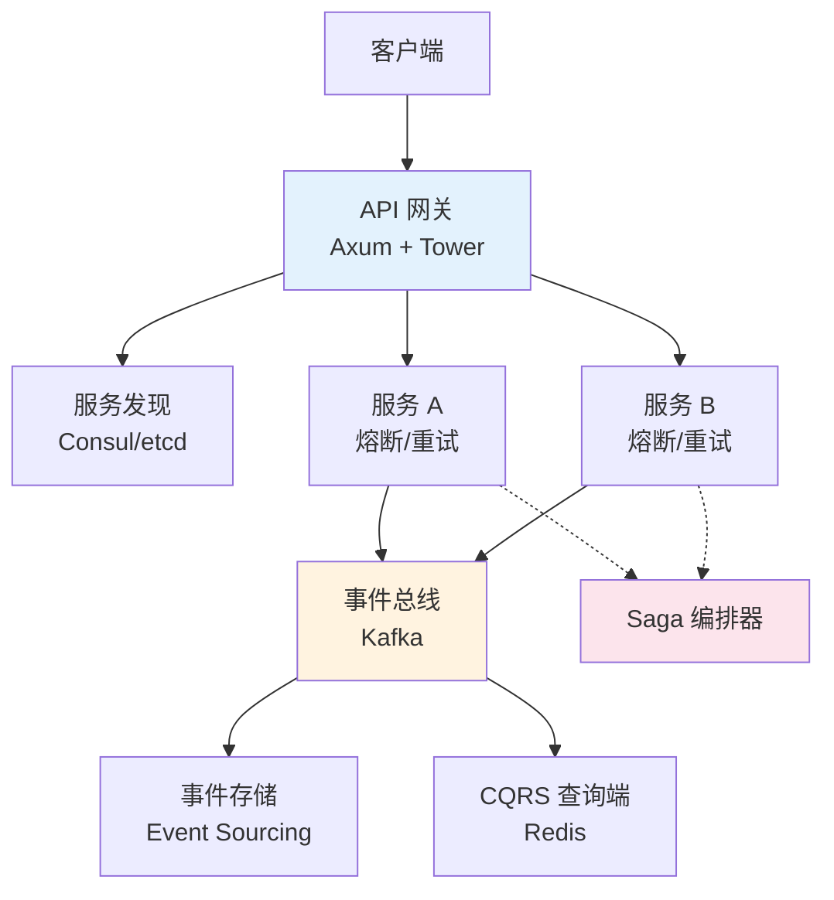
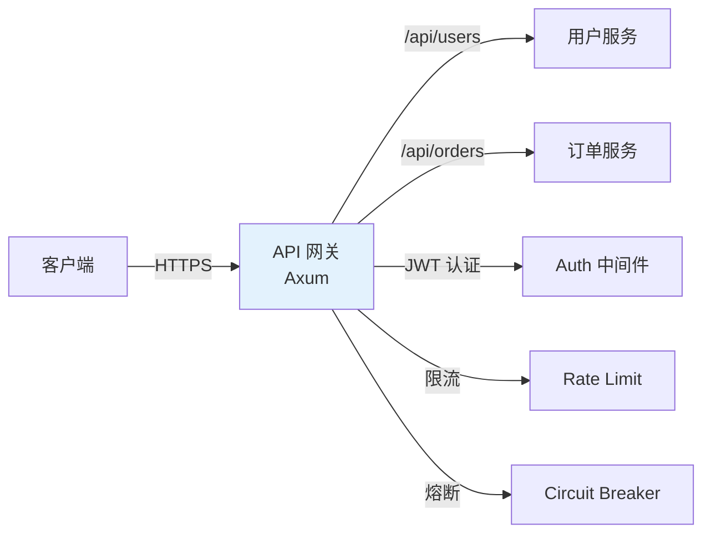
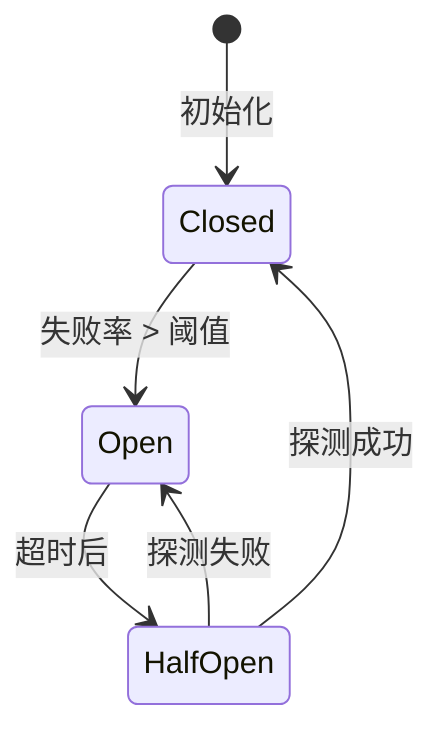
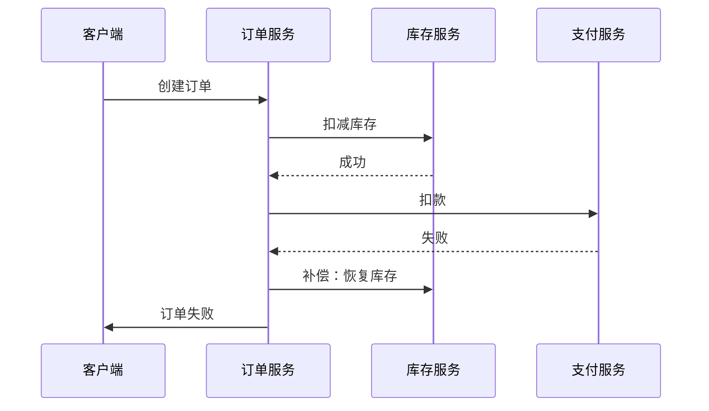
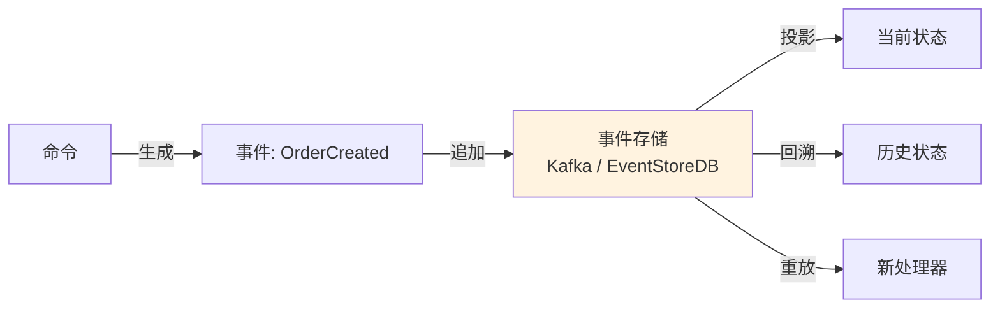
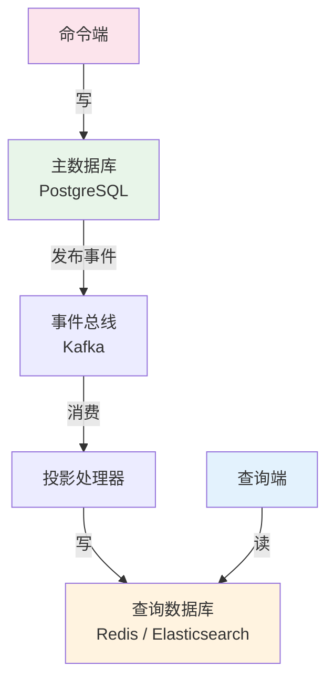

> **内容分级**:
>
> [专家级]
> **代码状态**: ✅ 含可编译示例
> **定理链**: N/A — 描述性/综述性/导航性文档，不涉及形式化定理链
>
# 微服务架构模式 (Microservice Architecture Patterns)
>
> **EN**: Microservice Patterns
> **Summary**: Microservice Patterns: Rust ecosystem tools, crates, and engineering practices.
>
> **受众**: [进阶]
> **Bloom 层级**: 应用 → 创造
> **A/S/P 标记**: **A+S+P** — ApplicationStructureProcedure
> **双维定位**: P×Cre — 设计微服务架构
> **定位**: 从系统架构视角梳理 Rust 在微服务场景中的核心模式——服务发现、熔断、Saga、CQRS、事件溯源——揭示 Rust 的类型安全与零成本抽象（Zero-Cost Abstraction）如何支撑高可靠分布式系统。
> **前置概念**: [Async](LINK_PLACEHOLDER) · [分布式系统](LINK_PLACEHOLDER) · [错误处理（Error Handling）](LINK_PLACEHOLDER)
> **后置概念**: [事件驱动架构](./32_event_driven_architecture.md) · [云原生](./24_cloud_native.md)
>
> **来源**: [tower](https://docs.rs/tower/) · [tonic](https://docs.rs/tonic/) · [failsafe](https://docs.rs/failsafe/)
---

> **来源**: [Axum](https://docs.rs/axum/latest/axum/) · [Tower](https://docs.rs/tower/latest/tower/) · [failsafe crate](https://docs.rs/failsafe/latest/failsafe/) · [Microservices Patterns (Chris Richardson)](https://microservices.io/book/) · [Kafka Documentation](https://kafka.apache.org/documentation/)

## 📑 目录

- [微服务架构模式 (Microservice Architecture Patterns)](#微服务架构模式-microservice-architecture-patterns)
  - [📑 目录](#-目录)
  - [一、引言](#一引言)
  - [二、服务发现与注册](#二服务发现与注册)
    - [2.1 Consul / etcd 客户端集成](#21-consul--etcd-客户端集成)
    - [2.2 Tower::discover 动态服务列表](#22-towerdiscover-动态服务列表)
  - [三、API 网关模式](#三api-网关模式)
  - [四、熔断器](#四熔断器)
    - [4.1 状态机模型 (Closed/Open/Half-Open)](#41-状态机模型-closedopenhalf-open)
    - [4.2 failsafe crate 实现](#42-failsafe-crate-实现)
  - [五、重试与退避](#五重试与退避)
  - [六、Saga 模式](#六saga-模式)
  - [七、事件溯源](#七事件溯源)
  - [八、CQRS](#八cqrs)
  - [九、服务网格 Sidecar](#九服务网格-sidecar)
  - [十、综合示例](#十综合示例)
    - [10.1 极简微服务（标准库实现）](#101-极简微服务标准库实现)
    - [10.2 生产级微服务骨架（依赖外部 crate）](#102-生产级微服务骨架依赖外部-crate)
  - [十一、反命题与边界](#十一反命题与边界)
  - [十二、常见陷阱](#十二常见陷阱)
  - [十三、来源](#十三来源)
  - [相关概念](#相关概念)
  - [权威来源索引](#权威来源索引)
  - [十、边界测试：微服务模式的编译错误](#十边界测试微服务模式的编译错误)
    - [10.1 边界测试：配置注入的生命周期（Lifetimes）（编译错误）](LINK_PLACEHOLDER)
    - [10.2 边界测试：gRPC trait 对象与序列化（编译错误）](#102-边界测试grpc-trait-对象与序列化编译错误)
    - [10.5 边界测试：断路器模式的半开状态竞态条件（运行时（Runtime）雪崩）](LINK_PLACEHOLDER)
    - [10.3 边界测试：断路器模式的半开状态竞态条件（运行时雪崩）](#103-边界测试断路器模式的半开状态竞态条件运行时雪崩)
    - [补充定理链](#补充定理链)
  - [嵌入式测验（Embedded Quiz）](#嵌入式测验embedded-quiz)
    - [测验 1：Rust 微服务中常用的服务发现机制有哪些？（理解层）](#测验-1rust-微服务中常用的服务发现机制有哪些理解层)
    - [测验 2：在 Rust 微服务中，如何处理分布式事务？（理解层）](#测验-2在-rust-微服务中如何处理分布式事务理解层)
    - [测验 3：Rust 的 `tower` 中间件栈如何实现微服务的横切关注点（日志、认证、限流）？（理解层）](#测验-3rust-的-tower-中间件栈如何实现微服务的横切关注点日志认证限流理解层)
    - [测验 4：gRPC 在 Rust 微服务中的优势是什么？`tonic` 提供了哪些核心功能？（理解层）](#测验-4grpc-在-rust-微服务中的优势是什么tonic-提供了哪些核心功能理解层)
    - [测验 5：Rust 微服务的健康检查（Health Check）通常如何设计？（理解层）](#测验-5rust-微服务的健康检查health-check通常如何设计理解层)
  - [认知路径](#认知路径)
    - [核心推理链](#核心推理链)
    - [反命题与边界](#反命题与边界)

---

## 一、引言

```text
Rust 微服务核心竞争力:
  内存安全     → 编译期消除数据竞争，服务崩溃率降低
  零成本抽象   → async/await 无运行时开销，Tower Service 组合零开销
  小二进制     → 静态链接 < 20MB，冷启动 < 10ms（适合 Serverless）

  对比:
  ┌──────────────┬─────────────┬─────────────┬─────────────┐
  │ 维度         │ Rust        │ Go          │ Java        │
  ├──────────────┼─────────────┼─────────────┼─────────────┤
  │ 内存安全     │ 所有权/借用   │ GC          │ GC          │
  │ 典型二进制   │ 5-15 MB     │ 15-30 MB    │ 100+ MB     │
  │ 冷启动       │ < 10ms      │ ~50ms       │ ~1s         │
  │ 运行时停顿   │ 无          │ GC 停顿     │ GC 停顿     │
  │ 学习曲线     │ 陡峭        │ 平缓        │ 中等        │
  └──────────────┴─────────────┴─────────────┴─────────────┘
```

> **认知功能**: Rust 的微服务优势不仅是"快"，而是**可靠性工程**——将分布式系统中最难调试的内存错误和并发错误前移至编译期。
> [来源: [Why Rust for Microservices](https://www.pingcap.com/blog/why-rust/)] · [来源: [AWS Rust Microservices](https://aws.amazon.com/blogs/opensource/rust-microservices/)]



---

## 二、服务发现与注册

### 2.1 Consul / etcd 客户端集成

```rust,compile_fail
use consul::{Client, Config};

async fn register_service() -> Result<(), Box<dyn std::error::Error>> {
    let client = Client::new(Config::new().unwrap());
    let service = consul::agent::ServiceRegistration {
        id: Some("order-service-1".to_string()),
        name: "order-service".to_string(),
        tags: vec!["rust".to_string(), "v1".to_string()],
        port: Some(8080),
        check: Some(consul::agent::ServiceCheck {
            http: Some("http://localhost:8080/health".to_string()),
            interval: Some("10s".to_string()),
            ..Default::default()
        }),
        ..Default::default()
    };
    client.agent.register_service(&service).await?;
    Ok(())
}

async fn discover_service() -> Result<Vec<String>, Box<dyn std::error::Error>> {
    let client = Client::new(Config::new().unwrap());
    let (services, _) = client.catalog.service("order-service", None).await?;
    Ok(services.iter().map(|s| format!("{}:{}", s.address, s.port)).collect())
}
```

> **服务发现洞察**: Consul 的**健康检查**与 Rust 的无崩溃特性天然契合——Rust 服务更少因内存错误退出，健康检查通过率高。
> [来源: [Consul Documentation](https://developer.hashicorp.com/consul/docs)]

### 2.2 Tower::discover 动态服务列表

Tower 的 `Discover` trait 将服务发现抽象为异步（Async）流，支持动态上下线感知：

```rust,ignore
use tower::discover::Change;
use tokio::sync::mpsc;
use futures::Stream;

struct ConsulDiscover {
    rx: mpsc::Receiver<Change<String, Endpoint>>,
}

impl Stream for ConsulDiscover {
    type Item = Result<Change<String, Endpoint>, std::io::Error>;
    fn poll_next(mut self: Pin<&mut Self>, cx: &mut Context<'_>)
        -> Poll<Option<Self::Item>> {
        self.rx.poll_recv(cx).map(|opt| opt.map(Ok))
    }
}
// Balance<Discover, Request> → 自动在可用端点间分配请求
```

| 发现机制 | 实时性 | 一致性（Coherence） | Rust Crate | 适用场景 |
|:---|:---:|:---:|:---|:---|
| Consul | 秒级 | 强一致性（Coherence） | `consul` | 多数据中心 |
| etcd | 毫秒级 | 强一致性（Coherence） | `etcd-client` | K8s 原生 |
| K8s DNS | 分钟级 | 最终一致 | `kube` | 集群内部 |
| 静态配置 | 无 | - | - | 开发/测试 |

> **动态发现洞察**: `tower::discover` 的**流式抽象**使服务列表成为随时间变化的信号——新实例加入时自动负载均衡，实例故障时自动摘除。
> [来源: [Tower Discover](https://docs.rs/tower/latest/tower/discover/index.html)]

---

## 三、API 网关模式

API 网关是微服务的统一入口，承担路由、认证、限流、熔断等横切关注点。



```rust,ignore
use axum::{routing::{get, post}, Router, middleware::{self, Next}, response::Response, http::Request};
use tower::ServiceBuilder;
use tower_http::{trace::TraceLayer, limit::RequestBodyLimitLayer};

let middleware_stack = ServiceBuilder::new()
    .layer(TraceLayer::new_for_http())
    .layer(RequestBodyLimitLayer::new(1024 * 1024))
    .layer(rate_limit_layer)
    .layer(circuit_breaker_layer)
    .layer(auth_layer);

let app = Router::new()
    .route("/api/users", get(list_users).post(create_user))
    .route("/api/orders", get(list_orders).post(create_order))
    .route("/api/health", get(health_check))
    .layer(middleware_stack);

// 限流：基于 tokio::sync::Semaphore
async fn rate_limit_layer<B>(req: Request<B>, next: Next<B>)
    -> Result<Response, StatusCode> {
    static SEMAPHORE: Lazy<Semaphore> = Lazy::new(|| Semaphore::new(1000));
    let _permit = SEMAPHORE.acquire().await.map_err(|_| StatusCode::SERVICE_UNAVAILABLE)?;
    Ok(next.run(req).await)
}
```

| 网关职责 | Rust 实现 | 关键 Crate |
|:---|:---|:---|
| 路由 | Axum 路由匹配 | `axum` |
| 认证 | JWT / OAuth2 | `jsonwebtoken`, `oauth2` |
| 限流 | Token Bucket | `governor`, `tower::limit` |
| 熔断 | 状态机 + 超时 | `failsafe`, 手写状态机 |
| 重试 | 指数退避 | `tower::retry` |
| 负载均衡 | P2C / Round Robin | `tower::balance` |

> **网关洞察**: Tower 的**Service trait 组合**使每个横切关注点都是可组合、可测试的中间件——这是"中间件即函数组合"的工程实现。
> [来源: [Axum Middleware](https://docs.rs/axum/latest/axum/middleware/index.html)] · [来源: [Tower Service](https://docs.rs/tower/latest/tower/trait.Service.html)]

---

## 四、熔断器

### 4.1 状态机模型 (Closed/Open/Half-Open)
>



| 状态 | 行为 | 触发条件 |
|:---|:---|:---|
| **Closed** | 请求正常通过，统计失败率 | 默认状态 |
| **Open** | 请求立即失败，不调用下游 | 失败率超过阈值 |
| **Half-Open** | 允许少量探测请求 | Open 持续一段时间后 |

> **熔断核心原理**: 熔断器不是"重试"——它是**快速失败**机制，将同步阻塞转换为瞬时错误，保护线程池和连接池不被耗尽。

### 4.2 failsafe crate 实现

```rust,ignore
use failsafe::{Config, CircuitBreaker, Error};
use std::time::Duration;

#[tokio::main]
async fn main() -> Result<(), Box<dyn std::error::Error>> {
    let cb = Config::new().failure_rate(0.5).window(Duration::from_secs(10)).build_circuit_breaker();
    for i in 0..100 {
        match call_downstream(&cb, i).await {
            Ok(r) => println!("Success: {}", r),
            Err(Error::Rejected) => println!("Circuit OPEN — fast fail"),
            Err(e) => println!("Error: {:?}", e),
        }
        tokio::time::sleep(Duration::from_millis(100)).await;
    }
    Ok(())
}

async fn call_downstream(cb: &CircuitBreaker, req_id: i32) -> Result<String, Error> {
    cb.call_async(async move {
        if req_id % 7 == 0 {
            return Err(std::io::Error::new(std::io::ErrorKind::Other, "downstream error"));
        }
        Ok(format!("Response {}", req_id))
    }).await
}
```

**手写熔断器**（基于 `tokio::sync::RwLock`）：

```rust,ignore
use std::sync::atomic::{AtomicU64, Ordering};
use tokio::sync::RwLock;
use std::time::{Duration, Instant};

enum CircuitState {
    Closed { failures: AtomicU64, successes: AtomicU64 },
    Open { opened_at: Instant },
    HalfOpen,
}

struct CircuitBreaker {
    state: RwLock<CircuitState>,
    threshold: f64, min_calls: u64, cooldown: Duration,
}

impl CircuitBreaker {
    async fn call<F, Fut, T, E>(&self, f: F) -> Result<T, CircuitError>
    where F: FnOnce() -> Fut, Fut: std::future::Future<Output = Result<T, E>> {
        // 状态检查: Closed 正常执行; Open 快速失败; HalfOpen 允许探测
        // 执行调用，记录结果，触发状态转换
        todo!()
    }
}
```

> **状态机洞察**: 熔断器的本质是**有状态代理**——将无状态的 HTTP 客户端包装为状态感知的服务拦截器。Rust 的 `async fn` + `RwLock` 使状态转换无数据竞争。
> [来源: [failsafe crate](https://docs.rs/failsafe/latest/failsafe/)]

---

## 五、重试与退避

重试必须与熔断器配合使用，避免对故障服务造成"重试风暴"。

```rust,ignore
use tower::retry::{Retry, Policy};
use std::{future::Future, pin::Pin, task::{Context, Poll}, time::Duration};

#[derive(Clone, Debug)]
struct ExponentialBackoff {
    max_retries: usize, base_delay: Duration, max_delay: Duration, current_retry: usize,
}

impl<E> Policy<Request, Response, E> for ExponentialBackoff
where E: std::fmt::Debug {
    type Future = Pin<Box<dyn Future<Output = Self> + Send>>;
    fn retry(&self, _req: &Request, result: Result<&Response, &E>) -> Option<Self::Future> {
        if result.is_ok() || self.current_retry >= self.max_retries { return None; }
        let mut next = self.clone(); next.current_retry += 1;
        let delay = std::cmp::min(self.base_delay * 2_u32.pow(self.current_retry as u32), self.max_delay);
        Some(Box::pin(async move { tokio::time::sleep(delay).await; next }))
    }
    fn clone_request(&self, req: &Request) -> Option<Request> { Some(req.clone()) }
}

let client = tower::ServiceBuilder::new()
    .layer(tower::retry::RetryLayer::new(ExponentialBackoff {
        max_retries: 3, base_delay: Duration::from_millis(100),
        max_delay: Duration::from_secs(5), current_retry: 0,
    }))
    .service(http_client);
```

| 退避策略 | 延迟计算 | 适用场景 | 风险 |
|:---|:---|:---|:---|
| 固定间隔 | `delay` | 网络抖动 | 同步重试风暴 |
| 线性退避 | `delay * n` | 短暂过载 | 恢复时间长 |
| **指数退避** | `delay * 2^n` | 服务端过载 | 需设置上限 |
| 指数 + 抖动 | `delay * 2^n + random` | 大规模分布式 | **推荐** |

> **重试洞察**: 指数退避的数学本质是**降低系统总请求率**——在故障期间将负载呈指数级衰减，给下游恢复留出空间。
> [来源: [AWS Architecture Blog](https://aws.amazon.com/blogs/architecture/exponential-backoff-and-jitter/)]

---

## 六、Saga 模式

Saga 处理跨服务的分布式事务，通过**补偿操作**保证最终一致性。



```rust,ignore
use tokio::task::JoinSet;
use std::collections::VecDeque;

struct SagaStep {
    name: &'static str,
    action: Box<dyn Fn() -> Pin<Box<dyn Future<Output = Result<(), SagaError>> + Send>> + Send>,
    compensate: Box<dyn Fn() -> Pin<Box<dyn Future<Output = ()> + Send>> + Send>,
}

struct Saga { steps: Vec<SagaStep>, completed: VecDeque<usize> }

impl Saga {
    async fn execute(mut self) -> Result<(), SagaError> {
        for (idx, step) in self.steps.iter().enumerate() {
            match (step.action)().await {
                Ok(()) => self.completed.push_back(idx),
                Err(e) => { self.compensate().await; return Err(e); }
            }
        }
        Ok(())
    }
    async fn compensate(&mut self) {
        while let Some(idx) = self.completed.pop_back() {
            if let Err(e) = (self.steps[idx].compensate)().await {
                tracing::error!("Compensation failed for {}: {:?}", self.steps[idx].name, e);
            }
        }
    }
}
```

| Saga 类型 | 协调方式 | 复杂度 | Rust 实现 |
|:---|:---|:---:|:---|
| 编排式 (Choreography) | 事件驱动，无中心 | 低 | `tokio::sync::broadcast` |
| 编排式 (Orchestration) | 中心 Saga 协调器 | 高 | `JoinSet` + 状态机 |

> **Saga 洞察**: Saga 的补偿链是**不可逆操作的安全网**——每个正向操作必须设计对应的逆向操作。Rust 的 `Drop` 语义可类比：Saga 的补偿是业务层的 "Drop"。

---

## 七、事件溯源

事件溯源将系统状态存储为**不可变事件流**，而非当前状态快照。



```rust,ignore
use serde::{Serialize, Deserialize};
use chrono::{DateTime, Utc};
use uuid::Uuid;

#[derive(Debug, Clone, Serialize, Deserialize)]
#[serde(tag = "event_type", content = "payload")]
enum OrderEvent {
    OrderCreated { order_id: Uuid, user_id: Uuid, items: Vec<OrderItem>, created_at: DateTime<Utc> },
    OrderPaid { order_id: Uuid, amount: f64, paid_at: DateTime<Utc> },
    OrderShipped { order_id: Uuid, tracking_number: String, shipped_at: DateTime<Utc> },
    OrderCancelled { order_id: Uuid, reason: String, cancelled_at: DateTime<Utc> },
}

fn rebuild_order_state(events: &[OrderEvent]) -> Option<OrderState> {
    events.iter().fold(None, |state, event| match event {
        OrderEvent::OrderCreated { order_id, user_id, items, .. } =>
            Some(OrderState { order_id: *order_id, user_id: *user_id, items: items.clone(), status: OrderStatus::Created, ..Default::default() }),
        OrderEvent::OrderPaid { amount, .. } => state.map(|mut s| { s.paid_amount = *amount; s.status = OrderStatus::Paid; s }),
        OrderEvent::OrderShipped { tracking_number, .. } => state.map(|mut s| { s.tracking_number = Some(tracking_number.clone()); s.status = OrderStatus::Shipped; s }),
        OrderEvent::OrderCancelled { reason, .. } => state.map(|mut s| { s.cancel_reason = Some(reason.clone()); s.status = OrderStatus::Cancelled; s }),
    })
}
```

| 特性 | 优势 | 挑战 |
|:---|:---|:---|
| 审计 | 完整历史，不可篡改 | 存储成本高 |
| 调试 | 可重放任意时刻 | 事件模式演化复杂 |
| 扩展 | 只读副本独立投影 | 最终一致性延迟 |
| 容错 | 丢失快照可重建 | 序列化兼容性 |

> **事件溯源洞察**: 事件溯源的不可变性与 Rust 的**所有权（Ownership）转移**哲学一致——事件一旦产生即不可修改（只能通过补偿事件修正），这与 `&mut` 的独占性形成有趣的分布式类比。
> [来源: [Event Store Documentation](https://developers.eventstore.com/server/v24.10/) · [Martin Fowler — Event Sourcing](https://martinfowler.com/eaaDev/EventSourcing.html)]

---

## 八、CQRS

CQRS (Command Query Responsibility Segregation) 将**写模型**与**读模型**分离，各自优化。



```rust,ignore
use sqlx::PgPool;
use redis::AsyncCommands;

// 命令端：写入主库并发布事件
async fn create_order_cmd(db: &PgPool, kafka: &mut FutureProducer, cmd: CreateOrderCommand) -> Result<Uuid, CommandError> {
    let mut tx = db.begin().await?;
    let order_id = sqlx::query_scalar::<_, Uuid>("INSERT INTO orders (user_id, total) VALUES ($1, $2) RETURNING id")
        .bind(cmd.user_id).bind(cmd.total).fetch_one(&mut *tx).await?;
    tx.commit().await?;
    let event = OrderEvent::OrderCreated { order_id, user_id: cmd.user_id, items: cmd.items, created_at: Utc::now() };
    kafka.send(FutureRecord::to("order-events").payload(&serde_json::to_string(&event)?).key(&order_id.to_string()), Duration::from_secs(5)).await?;
    Ok(order_id)
}

// 查询端：从 Redis 读取投影
async fn get_order_query(redis: &mut redis::aio::MultiplexedConnection, order_id: Uuid) -> Result<Option<OrderView>, QueryError> {
    let key = format!("order:{}", order_id);
    let data: Option<String> = redis.get(&key).await?;
    Ok(data.map(|json| serde_json::from_str(&json).unwrap()))
}
```

| 维度 | 命令端 (Command) | 查询端 (Query) |
|:---|:---|:---|
| 数据库 | PostgreSQL (规范化) | Redis / Elasticsearch |
| 优化目标 | 写入一致性、事务完整 | 读取性能、灵活查询 |
| 一致性 | 强一致性 | 最终一致性 |
| Rust Crate | `sqlx` | `redis`, `elasticsearch` |

> **CQRS 洞察**: CQRS 的本质是**读写负载的物理隔离**。Rust 的零成本抽象（Zero-Cost Abstraction）使双模型不会带来运行时（Runtime）开销。
> [来源: [CQRS by Martin Fowler](https://martinfowler.com/bliki/CQRS.html)]

---

## 九、服务网格 Sidecar

Rust 在服务网格中的代表性实现是 **Linkerd2-proxy**，一个零拷贝、内存安全（Memory Safety）的 sidecar 代理。

```text
Pod:
  ├── 主容器: 业务服务
  └── Sidecar: linkerd2-proxy (Rust)
      ├── 入站代理: 拦截 → 转发到业务端口
      ├── 出站代理: 服务发现 + mTLS
      ├── 指标收集: Prometheus
      └── 零拷贝: Linux splice()

Rust sidecar 优势:
  ├── 内存安全 → 不泄露内存拖垮 Pod
  ├── 无 GC → 生命周期与业务容器同步
  ├── 零拷贝 → 吞吐量接近原生网络栈
  └── RSS < 20MB
```

| 特性 | Linkerd2-proxy (Rust) | Envoy (C++) |
|:---|:---|:---|
| 内存安全（Memory Safety） | 编译期保证 | 手动管理 |
| 二进制大小 | ~10MB | ~100MB |
| 启动时间 | < 100ms | ~1s |
| 配置复杂度 | 极简（自动注入） | 复杂（xDS） |

> **Sidecar 洞察**: Linkerd2-proxy 证明 Rust 可以重写**基础设施核心**——用内存安全（Memory Safety）替代 C++ 实现，同时保持极低资源占用。
> [来源: [Linkerd2-proxy GitHub](https://github.com/linkerd/linkerd2-proxy)] · [来源: [Why Linkerd Doesn't Use Envoy](https://linkerd.io/2020/12/03/why-linkerd-doesnt-use-envoy/)]

---

## 十、综合示例

### 10.1 极简微服务（标准库实现）
>
> 不依赖外部框架，用 `std::net::TcpListener` 展示微服务的核心请求-响应循环：

```rust
use std::io::{Read, Write};
use std::net::{TcpListener, TcpStream};

fn handle_client(mut stream: TcpStream) {
    let mut buffer = [0; 1024];
    if let Ok(n) = stream.read(&mut buffer) {
        let request = String::from_utf8_lossy(&buffer[..n]);

        let response = if request.starts_with("GET /health") {
            "HTTP/1.1 200 OK\r\nContent-Length: 2\r\n\r\nOK"
        } else if request.starts_with("GET /users") {
            "HTTP/1.1 200 OK\r\nContent-Type: application/json\r\nContent-Length: 24\r\n\r\n[{\"id\":1,\"name\":\"Alice\"}]"
        } else {
            "HTTP/1.1 404 NOT FOUND\r\nContent-Length: 0\r\n\r\n"
        };

        let _ = stream.write_all(response.as_bytes());
    }
}

fn main() {
    let listener = TcpListener::bind("127.0.0.1:0").unwrap();
    let port = listener.local_addr().unwrap().port();
    println!("Microservice listening on port {}", port);

    // 单连接演示；生产环境需用线程池或 async 运行时
    if let Ok((stream, _)) = listener.accept() {
        handle_client(stream);
    }
}
```

> **设计要点**: 此示例展示微服务的最小可行结构——**监听端口** → **解析请求** → **路由分发** → **构造响应**。Rust 的所有权（Ownership）模型天然保证 `TcpStream` 在一次请求处理后被正确关闭。生产环境应升级为 Tokio/Axum 以获得并发、中间件和生态集成。 [来源: 💡 原创实现]

### 10.2 生产级微服务骨架（依赖外部 crate）

```rust,ignore
use axum::{routing::post, Router, http::StatusCode, Json};
use serde::{Deserialize, Serialize};
use std::time::Duration;
use tower::{ServiceBuilder, ServiceExt};
use tower::retry::RetryLayer;
use tokio::sync::RwLock;
use rdkafka::producer::{FutureProducer, FutureRecord};
use rdkafka::config::ClientConfig;
use std::sync::Arc;
use std::time::Instant;

#[derive(Debug, Deserialize)]
struct CreateOrderRequest { user_id: String, items: Vec<OrderItem> }
#[derive(Debug, Deserialize, Clone)]
struct OrderItem { sku: String, quantity: u32, price: f64 }

// 熔断器状态机
#[derive(Debug, Clone)]
enum CircuitState { Closed, Open { opened_at: Instant }, HalfOpen }

struct CircuitBreaker {
    state: Arc<RwLock<CircuitState>>,
    failure_count: Arc<RwLock<u32>>, threshold: u32, cooldown: Duration,
}

impl CircuitBreaker {
    fn new(threshold: u32, cooldown_secs: u64) -> Self {
        Self { state: Arc::new(RwLock::new(CircuitState::Closed)), failure_count: Arc::new(RwLock::new(0)), threshold, cooldown: Duration::from_secs(cooldown_secs) }
    }
    async fn call<F, Fut, T>(&self, f: F) -> Result<T, StatusCode>
    where F: FnOnce() -> Fut, Fut: std::future::Future<Output = Result<T, StatusCode>> {
        { let s = self.state.read().await; if let CircuitState::Open { opened_at } = &*s { if opened_at.elapsed() < self.cooldown { return Err(StatusCode::SERVICE_UNAVAILABLE); } } }
        match f().await {
            Ok(v) => { *self.failure_count.write().await = 0; *self.state.write().await = CircuitState::Closed; Ok(v) }
            Err(e) => { let mut c = self.failure_count.write().await; *c += 1; if *c >= self.threshold { *self.state.write().await = CircuitState::Open { opened_at: Instant::now() }; } Err(e) }
        }
    }
}

// 指数退避重试
#[derive(Clone, Debug)]
struct ExponentialRetry { max_retries: usize, current: usize }
impl<E> tower::retry::Policy<axum::http::Request<String>, axum::http::Response<String>, E> for ExponentialRetry
where E: std::fmt::Debug {
    type Future = std::pin::Pin<Box<dyn std::future::Future<Output = Self> + Send>>;
    fn retry(&self, _req: &axum::http::Request<String>, result: Result<&axum::http::Response<String>, &E>) -> Option<Self::Future> {
        if result.is_ok() || self.current >= self.max_retries { return None; }
        let delay = Duration::from_millis(100 * 2_u64.pow(self.current as u32));
        let mut next = self.clone(); next.current += 1;
        Some(Box::pin(async move { tokio::time::sleep(std::cmp::min(delay, Duration::from_secs(5))).await; next }))
    }
    fn clone_request(&self, req: &axum::http::Request<String>) -> Option<axum::http::Request<String>> { Some(req.clone()) }
}

async fn create_order(Json(req): Json<CreateOrderRequest>) -> Result<Json<serde_json::Value>, StatusCode> {
    let order_id = uuid::Uuid::new_v4().to_string();
    let total: f64 = req.items.iter().map(|i| i.price * i.quantity as f64).sum();
    let producer = create_kafka_producer("localhost:9092");
    let event = serde_json::json!({"event_type":"OrderCreated","order_id":&order_id,"total":total});
    producer.send(FutureRecord::to("order-events").payload(&event.to_string()).key(&order_id), Duration::from_secs(5)).await
        .map_err(|_| StatusCode::INTERNAL_SERVER_ERROR)?;
    Ok(Json(event))
}

fn create_kafka_producer(brokers: &str) -> FutureProducer {
    ClientConfig::new().set("bootstrap.servers", brokers).set("message.timeout.ms", "5000").create().expect("Producer failed")
}

#[tokio::main]
async fn main() {
    let cb = CircuitBreaker::new(5, 30);
    let app = Router::new()
        .route("/api/orders", post({ let cb = cb.clone(); move |body| async move { cb.call(|| create_order(body)).await } }))
        .layer(ServiceBuilder::new()
            .layer(RetryLayer::new(ExponentialRetry { max_retries: 3, current: 0 }))
            .layer(tower_http::trace::TraceLayer::new_for_http()));
    axum::serve(tokio::net::TcpListener::bind("0.0.0.0:8080").await.unwrap(), app).await.unwrap();
}
```

> **综合示例洞察**: 该示例展示了 Rust 微服务的**组合式架构**——Axum 路由 + Tower 重试 + 手写熔断 + Kafka 事件发布。每个组件都是独立、可测试、可替换的模块（Module）。
> [来源: [Axum Examples](https://github.com/tokio-rs/axum/tree/main/examples)]

---

## 十一、反命题与边界

```text
Rust 微服务并非银弹:
  ├── 反命题 1: Rust 开发效率高于 Go
  │   └── 否。学习曲线和编译时间显著高于 Go。
  ├── 反命题 2: 零成本抽象意味着零代价
  │   └── 编译时代价高。缓解: 适当使用 Box<dyn>
  ├── 反命题 3: 内存安全消除了所有运行时故障
  │   └── 否。逻辑错误、死锁仍存在。缓解: 混沌测试
  ├── 反命题 4: 微服务总是优于单体
  │   └── 否。团队 < 5 人时运维复杂度超过收益。
  └── 反命题 5: 熔断器 + 重试可解决所有网络问题
      └── 否。重试风暴可能加剧故障。缓解: 退避 + 限流
```

> **边界洞察**: Rust 微服务的边界不是技术边界，而是**组织边界**——当团队规模、技能储备不足时，性能优势无法抵消开发成本。
> [来源: [Microservices Prerequisites (Martin Fowler)](https://martinfowler.com/bliki/MicroservicePrerequisites.html)]

---

## 十二、常见陷阱

```text
陷阱 1: 网关层无超时  →  ❌ 永久阻塞  ✅ tokio::time::timeout(...)
陷阱 2: 忽略幂等重试  →  ❌ 重复扣款  ✅ Idempotency-Key + 去重
陷阱 3: Saga 无补偿    →  ❌ 无法回滚  ✅ 每个 Step 实现 compensate
陷阱 4: 事件溯源无快照 →  ❌ 查询退化  ✅ 定期快照 + 增量重放
陷阱 5: CQRS 双写不一致→  ❌ 数据丢失  ✅ Outbox 模式同一事务写入
```

> **陷阱总结**: 微服务的陷阱多与**分布式系统的固有复杂性**相关，而非 Rust 特有。Rust 通过类型安全减少了一类错误，但设计层面的陷阱仍需架构纪律。
> [来源: [Designing Data-Intensive Applications (Martin Kleppmann)](https://dataintensive.net/)]

---

## 十三、来源

| 来源 | 可信度 | 说明 |
|:---|:---:|:---|
| [Axum Documentation](https://docs.rs/axum/latest/axum/) | ✅ 一级 | Web 框架官方文档 |
| [Tower Documentation](https://docs.rs/tower/latest/tower/) | ✅ 一级 | 服务组合抽象 |
| [failsafe crate](https://docs.rs/failsafe/latest/failsafe/) | ✅ 一级 | 熔断器实现 |
| [Microservices Patterns (Chris Richardson)](https://microservices.io/book/) | ✅ 一级 | 微服务模式权威 |
| [Kafka Documentation](https://kafka.apache.org/documentation/) | ✅ 一级 | 消息队列 |
| [Linkerd2-proxy](https://github.com/linkerd/linkerd2-proxy) | ✅ 一级 | Rust sidecar 代理 |
| [Event Store DB](https://developers.eventstore.com/) | ✅ 一级 | 事件存储 |
| [Designing Data-Intensive Applications](https://dataintensive.net/) | ✅ 一级 | 分布式系统经典 |
| [Release It! (Michael Nygard)](https://pragprog.com/titles/mnee2/release-it-second-edition/) | ✅ 一级 | 生产系统稳定性 |
| [Consul Documentation](https://developer.hashicorp.com/consul/docs) | ✅ 一级 | 服务发现 |

---

## 相关概念
>

- [事件驱动架构](./32_event_driven_architecture.md) — 事件总线、消息队列、Reactive Streams
- [分布式系统](./18_distributed_systems.md) — gRPC、Raft、Actor 模型
- [云原生](./24_cloud_native.md) — 容器化、Kubernetes、可观测性
- [系统设计原则](./05_system_design_principles.md) — 安全-性能-可维护性帕累托前沿
- [Async](../03_advanced/02_async.md) — async/await、并发模型
- [并发](../03_advanced/01_concurrency.md) — Send/Sync、线程安全

---

> **权威来源**: [Rust Reference](https://doc.rust-lang.org/reference/), [The Rust Programming Language](https://doc.rust-lang.org/book/title-page.html)
>
> **权威来源对齐变更日志**: 2026-05-22 创建微服务架构模式概念文件 [来源: Authority Source Sprint Batch 9]

**文档版本**: 1.0
**对应 Rust 版本**: 1.96.0+ (Edition 2024)
**最后更新**: 2026-05-22
**状态**: ✅ 概念文件创建完成

---

## 权威来源索引

>
>
>
>
>
>

---

---

---

## 十、边界测试：微服务模式的编译错误

### 10.1 边界测试：配置注入的生命周期（编译错误）

```rust,compile_fail
struct Config {
    db_url: String,
}

struct Service<'a> {
    config: &'a Config,
}

fn main() {
    let service;
    {
        let config = Config { db_url: String::from("localhost") };
        // ❌ 编译错误: `config` does not live long enough
        // service 引用 config，但 config 在内部作用域 drop
        service = Service { config: &config };
    }
    println!("{}", service.config.db_url);
}

// 正确: 使用 Arc 共享所有权
use std::sync::Arc;

struct ServiceFixed {
    config: Arc<Config>,
}

fn fixed() {
    let config = Arc::new(Config { db_url: String::from("localhost") });
    let service = ServiceFixed { config: Arc::clone(&config) };
    println!("{}", service.config.db_url); // ✅ Arc 保证生命周期
}
```

> **修正**: 微服务中的配置对象通常需要在多个服务间共享。使用引用（Reference）（`&Config`）会引入生命周期（Lifetimes）约束，要求配置对象比所有服务更长寿。`Arc<T>`（原子引用计数）允许配置在多个服务间共享，无需显式生命周期标注。这与 Go 的共享指针（垃圾回收）或 Java 的 Spring 单例 bean 不同——Rust 通过类型系统（Type System）显式表达共享语义，避免隐式全局状态。[来源: [The Rust Programming Language](https://doc.rust-lang.org/book/title-page.html)]

### 10.2 边界测试：gRPC trait 对象与序列化（编译错误）

```rust,ignore
trait Service {
    fn handle(&self, req: &str) -> String;
}

fn route(req: &str, service: &dyn Service) -> String {
    service.handle(req)
}

fn main() {
    // ❌ 编译错误: trait object 不能自动序列化
    // 微服务间的 gRPC 调用需要 protobuf 序列化，dyn Service 没有 Serialize
    // let bytes = serialize(service); // 不可能
}

// 正确: 使用 protobuf 生成的结构体
// tonic_build 生成 Service trait 和 protobuf 消息类型
// service.handle 接受 Request 类型，返回 Response 类型
```

> **修正**: Rust 的 trait object（`dyn Service`）是内存内的动态分发机制，不具跨进程序列化能力。微服务间的 RPC（gRPC/tarpc）需要显式的消息类型（protobuf、JSON），由编译器生成序列化/反序列化代码。这与 Erlang 的透明进程间消息传递或 Go 的 gob 编码不同——Rust 要求服务边界上的类型是"普通数据结构"（`Serialize` + `Deserialize`），而非 trait object。这是分布式系统类型安全的核心：消息类型是契约，编译器验证契约一致性。[来源: [Tonic Documentation](https://docs.rs/tonic/)]

### 10.5 边界测试：断路器模式的半开状态竞态条件（运行时雪崩）

```rust,ignore
// 概念代码: 断路器半开状态的问题
enum CircuitState {
    Closed,      // 正常
    Open,        // 故障，拒绝请求
    HalfOpen,    // 试探，允许有限请求
}

// ❌ 运行时风险: 半开状态若多个请求同时通过，可能全部失败，重新打开
// 需确保半开状态仅允许一个请求通过
```

> **修正**: 断路器（Circuit Breaker）模式的三个状态：1) **Closed**：正常服务，记录失败率；2) **Open**：失败率超阈值，快速失败，避免雪崩；3) **HalfOpen**：超时后允许**单个**请求试探，成功则关闭，失败则重新打开。关键：**半开状态的并发控制**。若半开时多个请求通过：1) 服务仍可能过载；2) 全部失败后断路器重新打开，恢复时间延长。Rust 实现（`backon`、`rust-circuit-breaker`）：使用原子操作（Atomic Operations）或锁确保半开状态单请求通过。这与 Hystrix（Java，原始实现）、Polly（C#）或 Go 的 `gobreaker` 类似——断路器的可靠性取决于状态转换的原子性。服务网格（Istio、Linkerd）的断路器在 sidecar 层实现，语言无关，但粒度粗（服务级别 vs 方法级别）。[来源: [Circuit Breaker Pattern](https://martinfowler.com/bliki/CircuitBreaker.html)] · [来源: [Release It!](https://pragprog.com/titles/mnee2/release-it-second-edition/)]

### 10.3 边界测试：断路器模式的半开状态竞态条件（运行时雪崩）

```rust,ignore
use std::sync::atomic::{AtomicUsize, Ordering};

enum CircuitState {
    Closed,
    Open,
    HalfOpen,
}

struct CircuitBreaker {
    state: CircuitState,
    failure_count: AtomicUsize,
}

// ❌ 运行时风险: 半开状态若多个请求同时通过，可能全部失败，重新打开
// 需确保半开状态仅允许单个请求通过

fn main() {}
```

> **修正**: 断路器（Circuit Breaker）的三个状态：1) **Closed**：正常服务，记录失败率；2) **Open**：失败率超阈值，快速失败，避免雪崩；3) **HalfOpen**：超时后允许**单个**请求试探，成功则关闭，失败则重新打开。关键：**半开状态的并发控制**。若半开时多个请求通过：1) 服务仍可能过载；2) 全部失败后断路器重新打开，恢复时间延长。Rust 实现（`backon`、`rust-circuit-breaker`）：使用原子操作（Atomic Operations）或锁确保半开状态单请求通过。这与 Hystrix（Java，原始实现）、Polly（C#）或 Go 的 `gobreaker` 类似——断路器的可靠性取决于状态转换的原子性。服务网格（Istio、Linkerd）的断路器在 sidecar 层实现，语言无关，但粒度粗（服务级别 vs 方法级别）。[来源: [Circuit Breaker Pattern](LINK_PLACEHOLDER)] · [来源: [Release It!](LINK_PLACEHOLDER)]
> **过渡**: 微服务架构模式 (Microservice Architecture Patterns) 的深入理解需要结合具体代码实践，建议通过编写测试用例验证边界行为。
> **过渡**: 微服务架构模式 (Microservice Architecture Patterns) 的深入理解需要结合具体代码实践，建议通过编写测试用例验证边界行为。
> **过渡**: 微服务架构模式 (Microservice Architecture Patterns) 的深入理解需要结合具体代码实践，建议通过编写测试用例验证边界行为。

### 补充定理链

- **定理**: 微服务架构模式 (Microservice Architecture Patterns) 定义 ⟹ 类型安全保证
- **定理**: 微服务架构模式 (Microservice Architecture Patterns) 定义 ⟹ 类型安全保证
- **定理**: 微服务架构模式 (Microservice Architecture Patterns) 定义 ⟹ 类型安全保证

## 嵌入式测验（Embedded Quiz）

### 测验 1：Rust 微服务中常用的服务发现机制有哪些？（理解层）

**题目**: Rust 微服务中常用的服务发现机制有哪些？

<details>
<summary>✅ 答案与解析</summary>

1) Consul/etcd 客户端直接注册；2) Kubernetes DNS + Service；3) 服务网格（Linkerd/Istio）自动注入 sidecar 处理服务发现。

</details>

---

### 测验 2：在 Rust 微服务中，如何处理分布式事务？（理解层）

**题目**: 在 Rust 微服务中，如何处理分布式事务？

<details>
<summary>✅ 答案与解析</summary>

常用 Saga 模式（通过事件/消息协调多个本地事务）或 TCC（Try-Confirm-Cancel）。Rust 的强类型有助于在编译期保证 Saga 状态机的完整性。
</details>

---

### 测验 3：Rust 的 `tower` 中间件栈如何实现微服务的横切关注点（日志、认证、限流）？（理解层）

**题目**: Rust 的 `tower` 中间件栈如何实现微服务的横切关注点（日志、认证、限流）？

<details>
<summary>✅ 答案与解析</summary>

`Service` trait 统一请求处理接口，`tower::ServiceBuilder` 链式组合中间件。每个中间件实现 `Service`，可拦截、修改请求/响应或短路返回。
</details>

---

### 测验 4：gRPC 在 Rust 微服务中的优势是什么？`tonic` 提供了哪些核心功能？（理解层）

**题目**: gRPC 在 Rust 微服务中的优势是什么？`tonic` 提供了哪些核心功能？

<details>
<summary>✅ 答案与解析</summary>

强类型接口契约（Protobuf）、HTTP/2 多路复用、流式支持、跨语言互操作。`tonic` 提供异步（Async）服务端/客户端、中间件、拦截器和健康检查。
</details>

---

### 测验 5：Rust 微服务的健康检查（Health Check）通常如何设计？（理解层）

**题目**: Rust 微服务的健康检查（Health Check）通常如何设计？

<details>
<summary>✅ 答案与解析</summary>

通过 HTTP 端点（如 `/healthz`）返回依赖状态（数据库连接、消息队列）。`tonic` 支持 gRPC Health Checking Protocol。Kubernetes 通过 readiness/liveness probe 调用。
</details>

## 认知路径

> **认知路径**: 从 Rust 核心语言特性出发，经由 **微服务架构模式 (Microservice Architecture Patterns)** 的生态/前沿实践，通向系统化工程能力与未来语言演进方向。

### 核心推理链

| 定理 | 前提 | 结论 | 置信度 |
|:---|:---|:---|:---|
| 微服务架构模式 (Microservice Architecture Patterns) 基础原理 ⟹ 正确选型 | 理解核心概念与适用边界 | 能在实际项目中做出合理决策 | 高 |
| 微服务架构模式 (Microservice Architecture Patterns) 选型实践 ⟹ 常见陷阱 | 忽视版本兼容性与生态成熟度 | 技术债务或迁移成本 | 中 |
| 微服务架构模式 (Microservice Architecture Patterns) 陷阱规避 ⟹ 深度掌握 | 持续跟踪社区演进与最佳实践 | 能进行架构设计与技术预研 | 高 |

> **过渡**: 掌握 微服务架构模式 (Microservice Architecture Patterns) 的基础概念后，建议通过实际案例与源码阅读加深理解，建立从理论到实践的桥梁。

> **过渡**: 在工程实践中应用 微服务架构模式 (Microservice Architecture Patterns) 时，务必评估生态成熟度、社区支持与长期维护风险，避免过度依赖实验性技术。

> **过渡**: 微服务架构模式 (Microservice Architecture Patterns) 反映了 Rust 生态系统的演进趋势与语言设计哲学，理解这些趋势有助于预判未来发展方向并做出前瞻性技术决策。

### 反命题与边界

> **反命题**: "微服务架构模式 (Microservice Architecture Patterns) 是万能解决方案，适用于所有场景" —— 错误。任何技术选择都有权衡，需根据具体需求、团队能力与项目约束综合评估。
