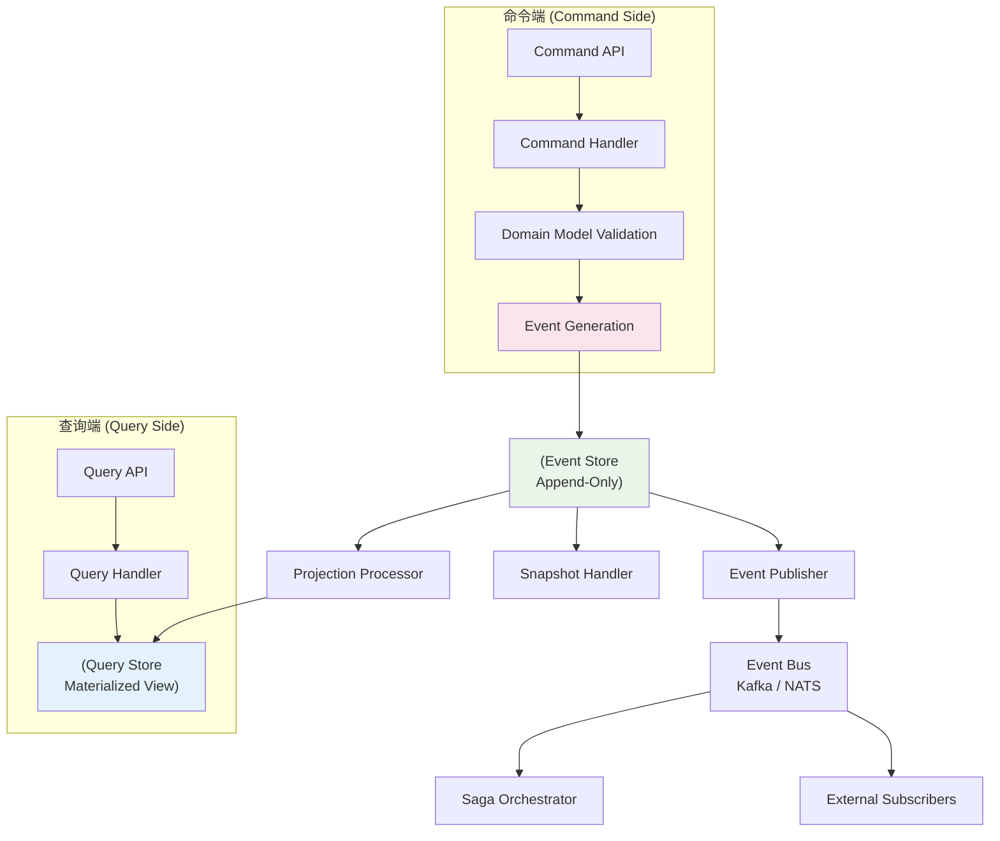

> **内容分级**: [专家级]

> **定理链**: N/A — 描述性/综述性/导航性文档，不涉及形式化定理链
>
# CQRS & Event Sourcing（命令查询职责分离与事件溯源）
> **EN**: CQRS & Event Sourcing（命令查询职责分离与事件溯源） (Chinese)
> **Summary**: - [CQRS \& Event Sourcing（命令查询职责分离与事件溯源）](#cqrs--event-sourcing命令查询职责分离与事件溯源) - [📑 目录](#-目录) - [一、权威定义（Definition）](#一权威定义definition) - [1.1 CQRS：命令与查询的分离](#11-cqrs命令与查询的分离) - [1.2 事件溯源：不可变事件流](#12-事件溯源不可变事件流) - [1.3 CQRS+ES 的协同关系](#13-cqrses-的协同关系) - [二、概念属性矩阵](#二概念属性矩阵) - [2.1 CQRS+ES 模式对比矩阵](#21-
>
> **受众**: [进阶]

> **Bloom 层级**: 分析 → 创造
> **A/S/P 标记**: **A+S+P** — Application + Structure + Procedure
> **双维定位**: P×Cre — 设计高可靠分布式系统的数据持久化模式
> **前置依赖**: [Async](../03_advanced/02_async.md) · [事件驱动架构](./32_event_driven_architecture.md) · [泛型](../02_intermediate/02_generics.md) · [Trait](../02_intermediate/01_traits.md)
> **后置延伸**: [分布式系统](./18_distributed_systems.md) · [微服务架构模式](./31_microservice_patterns.md) · [云原生](./24_cloud_native.md)

---

> **来源**: [Martin Fowler — CQRS](https://martinfowler.com/bliki/CQRS.html) ·
> [Martin Fowler — Event Sourcing](https://martinfowler.com/eaaDev/EventSourcing.html) ·
> [Young — Implementing Domain-Driven Design](https://www.amazon.com/Implementing-Domain-Driven-Design-Vaughn-Vernon/dp/0321834577) ·
> [Microsoft — CQRS Journey](https://docs.microsoft.com/en-us/previous-versions/msp-n-p/jj554200(v=pandp.10)) ·
> [EventStoreDB Documentation](https://developers.eventstore.com/server/v24.10/) ·
> [Axon Framework Reference](https://docs.axoniq.io/reference-guide/)
> [来源: [Fowler — Event Sourcing](https://martinfowler.com/eaaDev/EventSourcing.html)] ·
> [来源: [Microsoft — CQRS Journey](https://docs.microsoft.com/en-us/previous-versions/msp-n-p/jj554200(v=pandp.10))]
> [来源: [Young — CQRS Documents](https://cqrs.files.wordpress.com/2010/11/cqrs_documents.pdf)] ·
> [来源: [Axon Framework](https://docs.axoniq.io/reference-guide/)]

> **后置概念**: [Future Roadmap](../07_future/24_roadmap.md)

> **前置依赖**: [Type Theory](../04_formal/02_type_theory.md)

> **前置依赖**: [Rust vs C++](../05_comparative/01_rust_vs_cpp.md)

## 📑 目录

- [CQRS \& Event Sourcing（命令查询职责分离与事件溯源）](#cqrs--event-sourcing命令查询职责分离与事件溯源)
  - [📑 目录](#-目录)
  - [一、权威定义（Definition）](#一权威定义definition)
    - [1.1 CQRS：命令与查询的分离](#11-cqrs命令与查询的分离)
    - [1.2 事件溯源：不可变事件流](#12-事件溯源不可变事件流)
    - [1.3 CQRS+ES 的协同关系](#13-cqrses-的协同关系)
  - [二、概念属性矩阵](#二概念属性矩阵)
    - [2.1 CQRS+ES 模式对比矩阵](#21-cqrses-模式对比矩阵)
  - [三、CQRS 核心](#三cqrs-核心)
    - [3.1 命令端：写模型优化](#31-命令端写模型优化)
    - [3.2 查询端：读模型优化](#32-查询端读模型优化)
    - [3.3 读写分离的物理实现](#33-读写分离的物理实现)
  - [四、事件溯源核心](#四事件溯源核心)
    - [4.1 事件不可变性与追加模型](#41-事件不可变性与追加模型)
    - [4.2 快照策略与版本化](#42-快照策略与版本化)
    - [4.3 事件升级（Event Upcasting）](#43-事件升级event-upcasting)
  - [五、CQRS+ES 协同模式](#五cqrses-协同模式)
    - [5.1 Saga / Process Manager 编排](#51-saga--process-manager-编排)
    - [5.2 Outbox 模式：保证事件发布](#52-outbox-模式保证事件发布)
    - [5.3 读模型的最终一致性](#53-读模型的最终一致性)
  - [六、Rust 实现](#六rust-实现)
    - [6.1 事件定义与序列化](#61-事件定义与序列化)
    - [6.2 命令处理器](#62-命令处理器)
    - [6.3 事件存储与投影](#63-事件存储与投影)
    - [6.4 完整 CQRS+ES 微服务骨架](#64-完整-cqrses-微服务骨架)
  - [七、反命题与边界分析](#七反命题与边界分析)
    - [7.1 反命题树](#71-反命题树)
    - [7.2 边界极限](#72-边界极限)
  - [十、边界测试](#十边界测试)
    - [10.1 边界测试：无快照的查询退化（运行时性能）](#101-边界测试无快照的查询退化运行时性能)
    - [10.2 边界测试：双写不一致导致数据丢失（逻辑错误）](#102-边界测试双写不一致导致数据丢失逻辑错误)
    - [10.3 边界测试：事件模式演化破坏反序列化（编译/运行时错误）](#103-边界测试事件模式演化破坏反序列化编译运行时错误)
  - [相关概念文件](#相关概念文件)
    - [补充定理链](#补充定理链)
  - [认知路径](#认知路径)
    - [核心推理链](#核心推理链)
    - [反命题与边界](#反命题与边界)

> **Bloom 层级**: 分析 → 评价
**变更日志**:

> **来源**: [EventStoreDB](https://developers.eventstore.com/server/v24.10/) · [Microsoft CQRS](https://docs.microsoft.com/en-us/previous-versions/msp-n-p/jj554200(v=pandp.10))

- v1.0 (2026-05-25): 初始创建——CQRS+ES 合并专题，覆盖命令端/查询端分离、事件溯源、Saga 编排、Outbox 模式、Rust 实现骨架

---

## 一、权威定义（Definition）
>

### 1.1 CQRS：命令与查询的分离
>

> **[Martin Fowler — CQRS](https://martinfowler.com/bliki/CQRS.html)** CQRS（Command Query Responsibility Segregation）是一种将**命令**（改变系统状态的操作）与**查询**（读取系统状态的操作）分离到不同模型中的架构模式。这一概念最初由 Bertrand Meyer 在 Eiffel 语言中提出（CQS — Command Query Separation），后被 Greg Young 扩展为系统级的架构模式。

CQRS 的核心原则源自 **CQS**（Command Query Separation）：

```text
CQS 原则（Meyer 1988）:
  - 命令（Command）：产生副作用，返回 void
  - 查询（Query）：无副作用，返回值
  - 一个方法不应同时是命令和查询

CQRS 扩展（Young 2010）:
  - 不仅分离方法，更分离整个数据模型
  - 写模型（Command Model）：优化事务一致性、领域规则验证
  - 读模型（Query Model）：优化查询性能、去规范化、物化视图
```

```rust,ignore
// CQS 在 Rust 中的直接体现

// 命令：改变状态，返回 ()（或 Result<(), Error>）
fn place_order(cmd: PlaceOrderCommand, state: &mut OrderState) -> Result<(), OrderError> {
    state.apply(OrderPlaced { /* ... */ })?;
    Ok(())
}

// 查询：不改变世界，返回查询结果
fn get_order_summary(order_id: Uuid, view: &OrderQueryView) -> Option<OrderSummary> {
    view.find_by_id(order_id)
}

// ❌ 违反 CQS: 既修改状态又返回业务数据
fn bad_example(state: &mut OrderState) -> OrderSummary {
    let summary = compute_summary(state);
    state.mark_as_read();   // 副作用！
    summary
}
```

> **关键洞察**: CQRS 不是"必须分离数据库"——物理分离是**可选的优化**，而非模式的本质。在简单场景中，CQRS 可以只在应用层分离读写模型，共享同一个关系数据库。只有在读写负载特征显著不同时（写频繁且复杂，读频繁且简单），才需要物理分离到不同的存储。[来源: [Fowler — CQRS](https://martinfowler.com/bliki/CQRS.html)] · [来源: [Young — CQRS Documents](https://cqrs.files.wordpress.com/2010/11/cqrs_documents.pdf)]

### 1.2 事件溯源：不可变事件流
>

> **[Martin Fowler — Event Sourcing](https://martinfowler.com/eaaDev/EventSourcing.html)** 事件溯源是一种将应用程序的所有状态变化存储为**不可变事件序列**的持久化策略，而非仅存储当前状态快照。系统状态可以在任何时候通过重放事件流来重建。

事件溯源的核心语义：

```text
传统持久化:  State_n = f(State_{n-1}, Command_n)
             只保存最终状态 State_n

事件溯源:    Events = [E_1, E_2, ..., E_n]
             State_n = fold(InitialState, Events)
             保存完整事件序列 Events
```

```rust,ignore
// 事件溯源的核心：状态是事件的左折叠（left fold）
#[derive(Debug, Clone, Serialize, Deserialize)]
enum BankAccountEvent {
    AccountOpened { account_id: Uuid, owner: String },
    MoneyDeposited { amount: f64, deposited_at: DateTime<Utc> },
    MoneyWithdrawn { amount: f64, withdrawn_at: DateTime<Utc> },
    AccountClosed { reason: String, closed_at: DateTime<Utc> },
}

#[derive(Debug, Default)]
struct BankAccountState {
    account_id: Option<Uuid>,
    owner: Option<String>,
    balance: f64,
    is_closed: bool,
}

impl BankAccountState {
    fn apply(&mut self, event: &BankAccountEvent) {
        match event {
            BankAccountEvent::AccountOpened { account_id, owner } => {
                self.account_id = Some(*account_id);
                self.owner = Some(owner.clone());
            }
            BankAccountEvent::MoneyDeposited { amount, .. } => {
                self.balance += amount;
            }
            BankAccountEvent::MoneyWithdrawn { amount, .. } => {
                self.balance -= amount;
            }
            BankAccountEvent::AccountClosed { .. } => {
                self.is_closed = true;
            }
        }
    }

    fn rebuild(events: &[BankAccountEvent]) -> Self {
        events.iter().fold(Self::default(), |mut state, event| {
            state.apply(event);
            state
        })
    }
}
```

> **与 Rust 所有权的契合**: 事件溯源的**不可变性**与 Rust 的**所有权转移**哲学高度一致：
>
> - 事件一旦产生即不可修改（只能通过**补偿事件**修正，如 `DepositReversed`）
> - 这与 Rust 的 `let x = v; let y = x;`（`x` 失效）形成有趣的分布式类比——事件序列的单向追加就是分布式系统中的"Move 语义"
> - `&Event` 的共享只读访问对应于多个投影处理器并发读取事件流而不需要锁
>
> **来源**: [Fowler — Event Sourcing](https://martinfowler.com/eaaDev/EventSourcing.html) · [EventStoreDB Documentation](https://developers.eventstore.com/server/v24.10/)
> [来源: [Vernon — Implementing DDD](https://www.amazon.com/Implementing-Domain-Driven-Design-Vaughn-Vernon/dp/0321834577)] · [来源: [EventStoreDB Documentation](https://developers.eventstore.com/server/v24.10/)]

### 1.3 CQRS+ES 的协同关系
>

CQRS 和事件溯源在实践中高度耦合——事件溯源**自然产生**了 CQRS 的分离：

```text
传统 CQRS（无 ES）:
  命令端 → 写入关系数据库 → 查询端直接读同一数据库
  问题: 查询端需要复杂 JOIN，命令端需要事务隔离

CQRS+ES:
  命令端 → 验证命令 → 生成事件 → 追加到事件存储
  事件存储 → 投影处理器 → 物化视图（查询端）
  优势: 读写天然分离，查询模型可任意优化，事件流是单一事实来源
```



> **来源**: [Microsoft — CQRS Journey](https://docs.microsoft.com/en-us/previous-versions/msp-n-p/jj554200(v=pandp.10)) · [Vernon — Implementing DDD](https://www.amazon.com/Implementing-Domain-Driven-Design-Vaughn-Vernon/dp/0321834577)
> [来源: [Axon Framework Reference](https://docs.axoniq.io/reference-guide/)] · [来源: [Young — CQRS Documents](https://cqrs.files.wordpress.com/2010/11/cqrs_documents.pdf)]

---

## 二、概念属性矩阵

### 2.1 CQRS+ES 模式对比矩阵
>

| **维度** | **传统 CRUD** | **CQRS（无 ES）** | **CQRS+ES** |
|:---|:---|:---|:---|
| **数据模型** | 单一关系模型 | 读写分离模型 | 事件流 + 物化视图 |
| **持久化** | UPDATE/DELETE | UPDATE/DELETE | 只追加（Append-Only）|
| **历史追溯** | ❌ 丢失 | ❌ 丢失 | ✅ 完整事件序列 |
| **审计能力** | 需审计表 | 需审计表 | ✅ 天然审计 |
| **查询复杂度** | 高（JOIN 多）| 低（读模型去规范化）| 低（物化视图）|
| **最终一致性** | 强一致 | 可选择 | ✅ 天然最终一致 |
| **存储成本** | 低 | 中 | 高（事件积累）|
| **团队认知负荷** | 低 | 中 | 高（事件思维）|
| **Rust 生态支持** | sqlx/sea-orm | sqlx + redis | eventstore + serde |

> **选型决策树**:
>
> ```text
> 是否需要完整审计/历史追溯？
>   ├── 否 → 是否需要读写负载分离？
>   │         ├── 否 → 传统 CRUD ✅
>   │         └── 是 → CQRS（无 ES）✅
>   └── 是 → CQRS+ES ✅
>              └── 是否可接受最终一致性？
>                    ├── 是 → CQRS+ES ✅
>                    └── 否 → 传统 CRUD + 审计表 ⚠️
> ```
>
> **来源**: [Fowler — CQRS](https://martinfowler.com/bliki/CQRS.html) · [Microsoft — CQRS Journey](https://docs.microsoft.com/en-us/previous-versions/msp-n-p/jj554200(v=pandp.10))

---

## 三、CQRS 核心

### 3.1 命令端：写模型优化
>

命令端的核心职责是**验证领域规则**和**维护聚合一致性**。在 CQRS+ES 中，命令端不直接更新数据库状态，而是生成事件。

```rust,ignore
// 命令端：聚合根（Aggregate Root）
#[derive(Debug)]
struct OrderAggregate {
    order_id: Uuid,
    customer_id: Uuid,
    items: Vec<OrderItem>,
    status: OrderStatus,
    uncommitted_events: Vec<OrderEvent>,
}

impl OrderAggregate {
    fn new(order_id: Uuid, customer_id: Uuid) -> Self {
        let mut aggregate = Self {
            order_id,
            customer_id,
            items: vec![],
            status: OrderStatus::Pending,
            uncommitted_events: vec![],
        };
        aggregate.raise_event(OrderEvent::OrderCreated {
            order_id,
            customer_id,
            created_at: Utc::now(),
        });
        aggregate
    }

    fn add_item(&mut self, item: OrderItem) -> Result<(), OrderError> {
        if self.status != OrderStatus::Pending {
            return Err(OrderError::CannotModifySubmittedOrder);
        }
        self.items.push(item.clone());
        self.raise_event(OrderEvent::ItemAdded {
            order_id: self.order_id,
            item,
            updated_at: Utc::now(),
        });
        Ok(())
    }

    fn submit(&mut self) -> Result<(), OrderError> {
        if self.items.is_empty() {
            return Err(OrderError::EmptyOrder);
        }
        self.status = OrderStatus::Submitted;
        self.raise_event(OrderEvent::OrderSubmitted {
            order_id: self.order_id,
            total: self.total(),
            submitted_at: Utc::now(),
        });
        Ok(())
    }

    fn raise_event(&mut self, event: OrderEvent) {
        self.uncommitted_events.push(event);
    }

    fn total(&self) -> f64 {
        self.items.iter().map(|i| i.price * i.quantity as f64).sum()
    }
}
```

> **设计要点**:
>
> - **聚合根**（Aggregate Root）是命令端的一致性边界——所有状态变化必须通过聚合根的方法
> - **不变式验证**在命令方法中执行（如 `submit` 前检查 `items.is_empty()`）
> - **事件生成**是副作用——每个状态变化对应一个领域事件
> - Rust 的 `&mut self` 天然对应聚合根的独占修改语义
>
> **来源**: [Vernon — Implementing DDD](https://www.amazon.com/Implementing-Domain-Driven-Design-Vaughn-Vernon/dp/0321834577) · [Evans — Domain-Driven Design](https://www.amazon.com/Domain-Driven-Design-Tackling-Complexity-Software/dp/0321125215)

### 3.2 查询端：读模型优化
>

查询端的核心职责是**快速响应查询**，通常通过**物化视图**（Materialized View）实现。读模型可以任意去规范化，以优化特定查询场景。

```rust,ignore
// 查询端：物化视图（去规范化、针对查询优化）
#[derive(Debug, Clone, Serialize, Deserialize)]
struct OrderQueryView {
    order_id: Uuid,
    customer_name: String,
    total_amount: f64,
    item_count: usize,
    status: OrderStatus,
    last_updated: DateTime<Utc>,
}

// 投影处理器：将事件流转换为物化视图
struct OrderProjection;

impl OrderProjection {
    fn project(events: &[OrderEvent]) -> Option<OrderQueryView> {
        let mut view: Option<OrderQueryView> = None;
        for event in events {
            match event {
                OrderEvent::OrderCreated { order_id, customer_id, .. } => {
                    view = Some(OrderQueryView {
                        order_id: *order_id,
                        customer_name: lookup_customer_name(*customer_id), // 去规范化
                        total_amount: 0.0,
                        item_count: 0,
                        status: OrderStatus::Pending,
                        last_updated: Utc::now(),
                    });
                }
                OrderEvent::ItemAdded { item, .. } => {
                    if let Some(ref mut v) = view {
                        v.total_amount += item.price * item.quantity as f64;
                        v.item_count += item.quantity as usize;
                        v.last_updated = Utc::now();
                    }
                }
                OrderEvent::OrderSubmitted { total, .. } => {
                    if let Some(ref mut v) = view {
                        v.status = OrderStatus::Submitted;
                        v.total_amount = *total;
                        v.last_updated = Utc::now();
                    }
                }
                _ => {}
            }
        }
        view
    }
}
```

> **读模型的灵活性**:
>
> - 同一个事件流可以投影到**多个不同的读模型**（如订单列表视图、客户订单统计视图、库存影响视图）
> - 读模型可以使用与事件存储完全不同的数据库技术（如 Elasticsearch 全文搜索、Redis 缓存、ClickHouse 分析查询）
> - 读模型的**最终一致性**延迟取决于投影处理器的消费速度
>
> **来源**: [Fowler — CQRS](https://martinfowler.com/bliki/CQRS.html) · [Microsoft — CQRS Journey](https://docs.microsoft.com/en-us/previous-versions/msp-n-p/jj554200(v=pandp.10))

### 3.3 读写分离的物理实现
>

| **实现策略** | **共享数据库** | **数据库级分离** | **服务级分离** |
|:---|:---|:---|:---|
| **架构** | 单一 PostgreSQL | PostgreSQL + Redis/ES | 独立的命令/查询服务 |
| **命令端** | 写入主表 | 写入事件存储 | 通过 API 调用命令服务 |
| **查询端** | 读取主表（只读事务）| 读取物化视图 | 通过 API 调用查询服务 |
| **一致性** | 强一致 | 最终一致 | 最终一致 |
| **复杂度** | 低 | 中 | 高 |
| **适用场景** | 简单 CQRS | 中等复杂度系统 | 大规模微服务 |

```rust
// 共享数据库策略：使用 PostgreSQL 的只读副本
// 命令端写入主库，查询端读取副本

// 数据库级分离策略：
// 命令端 → EventStoreDB（事件存储）
// 查询端 → Redis（物化视图缓存）

// 服务级分离策略（最彻底）：
// 命令服务（OrderCommandService）→ 独立的部署单元
// 查询服务（OrderQueryService）→ 独立的部署单元
// 两者通过事件总线（Kafka）通信
```

> **来源**: [Microsoft — CQRS Journey](https://docs.microsoft.com/en-us/previous-versions/msp-n-p/jj554200(v=pandp.10)) · [AWS — CQRS Pattern](https://docs.aws.amazon.com/prescriptive-guidance/latest/modernization-data-persistence/cqrs-pattern.html)

---

## 四、事件溯源核心

### 4.1 事件不可变性与追加模型
>

事件溯源的基石是**事件存储的追加模型**（Append-Only Model）：事件一旦写入，永不修改、永不删除。

```rust,ignore
// 事件存储的追加接口
// 注意：Axum 0.8+ 使用原生 AFIT，不再需要 #[async_trait]
trait EventStore {
    async fn append(&self, stream_id: &str, expected_version: i64, events: &[OrderEvent]) -> Result<i64, EventStoreError>;
    async fn read_stream(&self, stream_id: &str, from_version: i64) -> Result<Vec<RecordedEvent>, EventStoreError>;
    async fn read_all(&self, from_position: i64, limit: usize) -> Result<Vec<RecordedEvent>, EventStoreError>;
}

#[derive(Debug, Clone)]
struct RecordedEvent {
    stream_id: String,
    version: i64,           // 流内版本号（单调递增）
    global_position: i64,   // 全局位置（所有流的总序）
    event: OrderEvent,
    metadata: EventMetadata,
    recorded_at: DateTime<Utc>,
}

// 乐观并发控制：通过 expected_version 防止并发写入冲突
async fn append_with_occ(
    store: &dyn EventStore,
    stream_id: &str,
    aggregate: &mut OrderAggregate,
) -> Result<(), EventStoreError> {
    let current_version = store.read_stream(stream_id, 0).await?.len() as i64;
    let new_events = aggregate.uncommitted_events.clone();

    store.append(stream_id, current_version, &new_events).await?;
    aggregate.uncommitted_events.clear();
    Ok(())
}
```

> **与 Rust 的契合**: 事件存储的追加模型与 Rust 的**不可变数据结构**哲学一致：
>
> - `RecordedEvent` 的所有字段都是不可变的（`struct` 默认不可变）
> - `append` 操作接收 `&[OrderEvent]`（共享引用），不修改输入事件
> - 乐观并发控制通过 `expected_version` 实现，类似于 Rust 的 CAS（Compare-And-Swap）操作
>
> **来源**: [EventStoreDB — Appending Events](https://developers.eventstore.com/server/v24.10/streams.html#appending-events) · [Fowler — Event Sourcing](https://martinfowler.com/eaaDev/EventSourcing.html)

### 4.2 快照策略与版本化
>

随着事件积累，重建状态的性能退化。快照（Snapshot）是状态的周期性快照，用于加速重建。

```rust,ignore
#[derive(Debug, Serialize, Deserialize)]
struct OrderSnapshot {
    stream_id: String,
    version: i64,           // 快照对应的流版本
    state: OrderState,      // 序列化后的聚合状态
    created_at: DateTime<Utc>,
}

// 快照策略：每 N 个事件创建一次快照
const SNAPSHOT_FREQUENCY: i64 = 100;

async fn load_aggregate(
    event_store: &dyn EventStore,
    snapshot_store: &dyn SnapshotStore,
    stream_id: &str,
) -> Result<OrderAggregate, EventStoreError> {
    // 1. 加载最新快照
    let snapshot = snapshot_store.read_latest(stream_id).await?;
    let (mut aggregate, from_version) = match snapshot {
        Some(snap) => {
            let state: OrderState = snap.state;
            (OrderAggregate::from_state(state)?, snap.version + 1)
        }
        None => (OrderAggregate::default(), 0),
    };

    // 2. 从快照版本之后的事件重建
    let events = event_store.read_stream(stream_id, from_version).await?;
    for event in events {
        aggregate.apply(&event.event)?;
    }

    // 3. 检查是否需要创建新快照
    let current_version = from_version + events.len() as i64;
    if current_version > 0 && current_version % SNAPSHOT_FREQUENCY == 0 {
        let new_snapshot = OrderSnapshot {
            stream_id: stream_id.to_string(),
            version: current_version,
            state: aggregate.to_state(),
            created_at: Utc::now(),
        };
        snapshot_store.save(new_snapshot).await?;
    }

    Ok(aggregate)
}
```

> **快照策略对比**:

| **策略** | **触发条件** | **优点** | **缺点** |
|:---|:---|:---|:---|
| **计数触发** | 每 N 个事件 | 简单、可预测 | N 难以调优（太小浪费存储，太大重建慢）|
| **时间触发** | 每 T 时间间隔 | 适用于低频事件流 | 高频流可能积累大量事件 |
| **大小触发** | 聚合状态超过阈值 | 针对大数据聚合优化 | 需要监控状态大小 |
| **自定义触发** | 业务事件（如订单完成）| 语义明确 | 实现复杂 |

> **来源**: [EventStoreDB — Snapshots](https://developers.eventstore.com/server/v24.10/streams.html#snapshots) · [Microsoft — CQRS Journey](https://docs.microsoft.com/en-us/previous-versions/msp-n-p/jj554200(v=pandp.10))

### 4.3 事件升级（Event Upcasting）
>

业务需求演进时，事件结构可能需要改变。**事件升级**（Event Upcasting）是将旧版本事件转换为当前版本事件的策略，确保历史事件仍可反序列化。

```rust,ignore
// 事件版本化：通过枚举实现多版本兼容
#[derive(Debug, Clone, Serialize, Deserialize)]
#[serde(tag = "version")]
enum OrderEventV2 {
    #[serde(rename = "1")]
    V1(OrderEventV1),
    #[serde(rename = "2")]
    V2(OrderEvent),  // 当前版本
}

// Upcaster：将旧版本事件转换为当前版本
struct OrderEventUpcaster;

impl OrderEventUpcaster {
    fn upcast(event: OrderEventV2) -> OrderEvent {
        match event {
            OrderEventV2::V2(e) => e,
            OrderEventV2::V1(old) => Self::upcast_v1_to_v2(old),
        }
    }

    fn upcast_v1_to_v2(old: OrderEventV1) -> OrderEvent {
        // 示例：V1 中 Item 没有 currency 字段，V2 添加了默认值
        match old {
            OrderEventV1::ItemAdded { item, .. } => {
                OrderEvent::ItemAdded {
                    item: OrderItem {
                        product_id: item.product_id,
                        name: item.name,
                        price: item.price,
                        quantity: item.quantity,
                        currency: "USD".to_string(),  // 默认值
                    },
                    ..Default::default()
                }
            }
            // ... 其他事件转换
            _ => panic!("Unsupported V1 event variant"),
        }
    }
}
```

> **Upcasting 策略对比**:

| **策略** | **实现方式** | **优点** | **缺点** |
|:---|:---|:---|:---|
| **读取时转换** | Upcaster 在反序列化时转换 | 事件存储保持原始格式 | 每次读取都有转换开销 |
| **写入时迁移** | 后台作业重写旧事件 | 读取性能最优 | 迁移期间系统不可用，风险高 |
| **双模式读取** | 同时支持新旧格式 | 零停机迁移 | 代码复杂度翻倍 |

> **Rust 实践**: `serde` 的 `#[serde(tag = "version")]` 和自定义 `Deserialize` 实现是事件升级的标准做法。`inventory` 或 `typetag` crate 可用于注册 upcaster 插件。[来源: [Axon Framework — Event Versioning](https://docs.axoniq.io/reference-guide/axon-framework/events/event-versioning)] · [serde 文档](https://serde.rs/)

---

## 五、CQRS+ES 协同模式

### 5.1 Saga / Process Manager 编排
>

在分布式系统中，跨聚合/跨服务的业务流程需要**编排**（Orchestration）或**编舞**（Choreography）。Saga 模式通过事件驱动的方式协调长事务。

```rust,ignore
// Saga：订单处理流程的编排
#[derive(Debug)]
struct OrderSaga {
    saga_id: Uuid,
    order_id: Uuid,
    state: SagaState,
    compensation_log: Vec<CompensationAction>,
}

#[derive(Debug)]
enum SagaState {
    Started,
    InventoryReserved,
    PaymentProcessed,
    OrderConfirmed,
    Failed { reason: String },
}

#[derive(Debug, Clone)]
enum CompensationAction {
    ReleaseInventory { product_id: Uuid, quantity: i32 },
    RefundPayment { transaction_id: Uuid },
    CancelOrder { order_id: Uuid },
}

impl OrderSaga {
    async fn execute(&mut self, event_bus: &dyn EventBus) -> Result<(), SagaError> {
        // Step 1: 预留库存
        event_bus.publish(Event::ReserveInventory {
            saga_id: self.saga_id,
            order_id: self.order_id,
            items: vec![/* ... */],
        }).await?;
        self.state = SagaState::InventoryReserved;
        self.compensation_log.push(CompensationAction::ReleaseInventory {
            product_id: Uuid::new_v4(), quantity: 1,
        });

        // Step 2: 处理支付
        event_bus.publish(Event::ProcessPayment {
            saga_id: self.saga_id,
            order_id: self.order_id,
            amount: 100.0,
        }).await?;
        self.state = SagaState::PaymentProcessed;
        self.compensation_log.push(CompensationAction::RefundPayment {
            transaction_id: Uuid::new_v4(),
        });

        // Step 3: 确认订单
        event_bus.publish(Event::ConfirmOrder {
            saga_id: self.saga_id,
            order_id: self.order_id,
        }).await?;
        self.state = SagaState::OrderConfirmed;

        Ok(())
    }

    async fn compensate(&self, event_bus: &dyn EventBus) {
        // 反向执行补偿动作（LIFO 顺序）
        for action in self.compensation_log.iter().rev() {
            match action {
                CompensationAction::ReleaseInventory { product_id, quantity } => {
                    event_bus.publish(Event::ReleaseInventory { product_id: *product_id, quantity: *quantity }).await.ok();
                }
                CompensationAction::RefundPayment { transaction_id } => {
                    event_bus.publish(Event::RefundPayment { transaction_id: *transaction_id }).await.ok();
                }
                CompensationAction::CancelOrder { order_id } => {
                    event_bus.publish(Event::CancelOrder { order_id: *order_id }).await.ok();
                }
            }
        }
    }
}
```

> **Saga vs 2PC（两阶段提交）**:
>
> - **2PC**: 强一致性，但有协调者单点故障和阻塞问题
> - **Saga**: 最终一致性，通过补偿事务回滚，无全局锁
> - Rust 的 `Result` 和 `?` 运算符天然支持 Saga 的成功路径，`compensate()` 方法处理失败路径
>
> **来源**: [Microsoft — Saga Pattern](https://docs.microsoft.com/en-us/azure/architecture/reference-architectures/saga/saga) · [Vernon — Implementing DDD](https://www.amazon.com/Implementing-Domain-Driven-Design-Vaughn-Vernon/dp/0321834577)

### 5.2 Outbox 模式：保证事件发布
>

CQRS+ES 的一个关键挑战是**原子性**：如何确保数据库更新和事件发布要么同时成功，要么同时失败？Outbox 模式通过**同一事务写入业务数据和事件**来解决。

```rust
// Outbox 模式：在同一数据库事务中写入聚合状态和事件
#[derive(Debug, Serialize, Deserialize)]
struct OutboxMessage {
    id: Uuid,
    aggregate_type: String,
    aggregate_id: String,
    event_type: String,
    payload: serde_json::Value,
    created_at: DateTime<Utc>,
}

async fn handle_command_with_outbox(
    db: &sqlx::PgPool,
    command: PlaceOrderCommand,
) -> Result<Uuid, CommandError> {
    let mut tx = db.begin().await?;

    // 1. 加载聚合
    let mut order = load_order(&mut tx, command.order_id).await?;

    // 2. 执行业务逻辑
    order.add_item(command.item)?;
    order.submit()?;

    // 3. 在同一事务中：
    //    a) 保存聚合状态（或事件）
    //    b) 写入 Outbox 表
    save_order_events(&mut tx, &order).await?;

    for event in &order.uncommitted_events {
        let outbox = OutboxMessage {
            id: Uuid::new_v4(),
            aggregate_type: "Order".to_string(),
            aggregate_id: order.order_id.to_string(),
            event_type: event.event_type(),
            payload: serde_json::to_value(event)?,
            created_at: Utc::now(),
        };
        sqlx::query("INSERT INTO outbox (id, aggregate_type, aggregate_id, event_type, payload, created_at) VALUES ($1, $2, $3, $4, $5, $6)")
            .bind(outbox.id).bind(&outbox.aggregate_type).bind(&outbox.aggregate_id)
            .bind(&outbox.event_type).bind(&outbox.payload).bind(outbox.created_at)
            .execute(&mut *tx).await?;
    }

    // 4. 提交事务（原子性保证：聚合更新 + Outbox 写入同时成功/失败）
    tx.commit().await?;

    Ok(order.order_id)
}

// Outbox 处理器：轮询 Outbox 表，将事件发布到消息总线
async fn outbox_publisher(db: &sqlx::PgPool, kafka: &FutureProducer) {
    loop {
        let messages: Vec<OutboxMessage> = sqlx::query_as(
            "SELECT * FROM outbox WHERE published_at IS NULL ORDER BY created_at LIMIT 100"
        )
        .fetch_all(db).await.unwrap_or_default();

        for msg in messages {
            match publish_to_kafka(kafka, &msg).await {
                Ok(_) => {
                    sqlx::query("UPDATE outbox SET published_at = NOW() WHERE id = $1")
                        .bind(msg.id).execute(db).await.ok();
                }
                Err(e) => {
                    eprintln!("Failed to publish outbox message {}: {}", msg.id, e);
                    break; // 停止处理，下次重试
                }
            }
        }

        tokio::time::sleep(Duration::from_millis(100)).await;
    }
}
```

> **Outbox 的至少一次语义**: Outbox 模式保证**至少一次**（At-Least-Once）事件投递：
>
> - 若事务提交后、Kafka 确认前进程崩溃，Outbox 记录仍在，重启后会重试
> - 消费者必须实现**幂等性**以处理重复事件
> - 通过 `published_at` 字段标记已投递，实现去重
>
> **来源**: [Microsoft — Outbox Pattern](https://docs.microsoft.com/en-us/dotnet/architecture/microservices/multi-container-microservice-net-applications/subscribe-events-in-background-worker-with-iactionscope) · [Debezium — Outbox Event Router](https://debezium.io/documentation/reference/stable/transformations/outbox-event-router.html)

### 5.3 读模型的最终一致性
>

CQRS+ES 中，命令端和查询端之间不可避免地存在**延迟**——从事件生成到投影处理器更新读模型需要时间。

```rust,ignore
// 最终一致性的时间边界分析
#[derive(Debug)]
struct ConsistencyMetrics {
    event_commit_latency: Duration,      // 事件提交到事件存储的延迟
    projection_latency: Duration,        // 投影处理器消费延迟
    query_cache_ttl: Duration,           // 查询缓存过期时间
    total_eventual_consistency_delay: Duration,  // 总延迟
}

impl ConsistencyMetrics {
    fn calculate(&self) -> Duration {
        self.event_commit_latency + self.projection_latency + self.query_cache_ttl
    }
}

// 典型延迟分布（参考值）:
// - 事件提交延迟: < 10ms（本地数据库写入）
// - 投影延迟: 10ms - 1s（取决于事件队列负载）
// - 查询缓存 TTL: 0ms（无缓存）到 5min（激进缓存）
// - 总延迟: 通常 < 100ms，极端情况下可达数秒
```

> **最终一致性的工程处理**:
>
> - **前端乐观更新**：用户提交命令后，前端立即显示预期结果，后台异步同步真实状态
> - **读己之写**（Read-Your-Own-Writes）：在会话上下文中，查询端优先返回会话内已提交的写操作结果
> - **版本向量**：客户端传递最后已知版本号，查询端若版本滞后则等待或返回提示
>
> **来源**: [AWS — Eventual Consistency](https://docs.aws.amazon.com/amazondynamodb/latest/developerguide/HowItWorks.ReadConsistency.html) · [Vogels — Eventually Consistent](https://www.allthingsdistributed.com/2008/12/eventually_consistent.html)

---

## 六、Rust 实现

### 6.1 事件定义与序列化
>

```rust
use serde::{Serialize, Deserialize};
use chrono::{DateTime, Utc};
use uuid::Uuid;

// 领域事件基 trait
pub trait DomainEvent: Serialize + for<'de> Deserialize<'de> + Clone + Send + Sync {
    fn event_type(&self) -> &'static str;
    fn event_version(&self) -> u32 { 1 }
    fn aggregate_id(&self) -> Uuid;
    fn occurred_at(&self) -> DateTime<Utc>;
}

#[derive(Debug, Clone, Serialize, Deserialize)]
pub enum OrderEvent {
    OrderCreated {
        order_id: Uuid,
        customer_id: Uuid,
        created_at: DateTime<Utc>,
    },
    ItemAdded {
        order_id: Uuid,
        item: OrderItem,
        added_at: DateTime<Utc>,
    },
    OrderSubmitted {
        order_id: Uuid,
        total: f64,
        submitted_at: DateTime<Utc>,
    },
    OrderPaid {
        order_id: Uuid,
        amount: f64,
        transaction_id: Uuid,
        paid_at: DateTime<Utc>,
    },
}

impl DomainEvent for OrderEvent {
    fn event_type(&self) -> &'static str {
        match self {
            OrderEvent::OrderCreated { .. } => "OrderCreated",
            OrderEvent::ItemAdded { .. } => "ItemAdded",
            OrderEvent::OrderSubmitted { .. } => "OrderSubmitted",
            OrderEvent::OrderPaid { .. } => "OrderPaid",
        }
    }

    fn aggregate_id(&self) -> Uuid {
        match self {
            OrderEvent::OrderCreated { order_id, .. } => *order_id,
            OrderEvent::ItemAdded { order_id, .. } => *order_id,
            OrderEvent::OrderSubmitted { order_id, .. } => *order_id,
            OrderEvent::OrderPaid { order_id, .. } => *order_id,
        }
    }

    fn occurred_at(&self) -> DateTime<Utc> {
        match self {
            OrderEvent::OrderCreated { created_at, .. } => *created_at,
            OrderEvent::ItemAdded { added_at, .. } => *added_at,
            OrderEvent::OrderSubmitted { submitted_at, .. } => *submitted_at,
            OrderEvent::OrderPaid { paid_at, .. } => *paid_at,
        }
    }
}

#[derive(Debug, Clone, Serialize, Deserialize)]
pub struct OrderItem {
    pub product_id: Uuid,
    pub name: String,
    pub price: f64,
    pub quantity: i32,
    pub currency: String,
}
```

> **来源**: [来源: [serde Documentation](https://serde.rs/)]

### 6.2 命令处理器
>

```rust,ignore
// 注意：Axum 0.8+ 使用原生 AFIT，不再需要 #[async_trait]
pub trait CommandHandler<C: Command> {
    type Error;
    async fn handle(&self, command: C) -> Result<Vec<Box<dyn DomainEvent>>, Self::Error>;
}

pub trait Command: Send + Sync {
    fn aggregate_id(&self) -> Uuid;
}

#[derive(Debug)]
pub struct PlaceOrderCommand {
    pub order_id: Uuid,
    pub customer_id: Uuid,
    pub items: Vec<OrderItem>,
}

impl Command for PlaceOrderCommand {
    fn aggregate_id(&self) -> Uuid { self.order_id }
}

pub struct PlaceOrderHandler<ES: EventStore> {
    event_store: ES,
}

// 注意：Axum 0.8+ 使用原生 AFIT，不再需要 #[async_trait]
impl<ES: EventStore + Send + Sync> CommandHandler<PlaceOrderCommand> for PlaceOrderHandler<ES> {
    type Error = CommandError;

    async fn handle(&self, command: PlaceOrderCommand) -> Result<Vec<Box<dyn DomainEvent>>, Self::Error> {
        let mut order = self.load_aggregate(command.order_id).await?;

        // 执行业务规则
        if order.status != OrderStatus::Pending {
            return Err(CommandError::InvalidState("Order already submitted".to_string()));
        }

        // 生成事件
        let mut events: Vec<Box<dyn DomainEvent>> = vec![];
        events.push(Box::new(OrderEvent::OrderCreated {
            order_id: command.order_id,
            customer_id: command.customer_id,
            created_at: Utc::now(),
        }));

        for item in command.items {
            events.push(Box::new(OrderEvent::ItemAdded {
                order_id: command.order_id,
                item,
                added_at: Utc::now(),
            }));
        }

        events.push(Box::new(OrderEvent::OrderSubmitted {
            order_id: command.order_id,
            total: calculate_total(&events),
            submitted_at: Utc::now(),
        }));

        // 持久化事件
        self.event_store.append(
            &format!("order-{}", command.order_id),
            order.version,
            &events,
        ).await?;

        Ok(events)
    }
}
```

> **来源**: [来源: [Axon Framework — Commands](https://docs.axoniq.io/reference-guide/axon-framework/commands/command-handlers.html)]

### 6.3 事件存储与投影
>

```rust
use sqlx::{PgPool, Row};

pub struct PostgresEventStore {
    pool: PgPool,
}

// 注意：Axum 0.8+ 使用原生 AFIT，不再需要 #[async_trait]
impl EventStore for PostgresEventStore {
    async fn append(
        &self,
        stream_id: &str,
        expected_version: i64,
        events: &[Box<dyn DomainEvent>],
    ) -> Result<i64, EventStoreError> {
        let mut tx = self.pool.begin().await?;

        // 乐观并发控制检查
        let current_version: i64 = sqlx::query_scalar(
            "SELECT COALESCE(MAX(version), -1) FROM events WHERE stream_id = $1"
        )
        .bind(stream_id)
        .fetch_one(&mut *tx).await?;

        if current_version != expected_version {
            return Err(EventStoreError::ConcurrencyConflict {
                expected: expected_version,
                actual: current_version,
            });
        }

        // 追加事件
        let mut version = current_version;
        for event in events {
            version += 1;
            let payload = serde_json::to_value(event)?;
            sqlx::query(
                "INSERT INTO events (stream_id, version, event_type, payload, occurred_at) VALUES ($1, $2, $3, $4, $5)"
            )
            .bind(stream_id)
            .bind(version)
            .bind(event.event_type())
            .bind(payload)
            .bind(event.occurred_at())
            .execute(&mut *tx).await?;
        }

        tx.commit().await?;
        Ok(version)
    }

    async fn read_stream(&self, stream_id: &str, from_version: i64) -> Result<Vec<RecordedEvent>, EventStoreError> {
        let rows = sqlx::query(
            "SELECT stream_id, version, event_type, payload, occurred_at FROM events WHERE stream_id = $1 AND version >= $2 ORDER BY version"
        )
        .bind(stream_id)
        .bind(from_version)
        .fetch_all(&self.pool).await?;

        let mut events = vec![];
        for row in rows {
            events.push(RecordedEvent {
                stream_id: row.get("stream_id"),
                version: row.get("version"),
                event_type: row.get("event_type"),
                payload: row.get("payload"),
                occurred_at: row.get("occurred_at"),
            });
        }

        Ok(events)
    }
}
```

> **来源**: [来源: [EventStoreDB — Projections](https://developers.eventstore.com/server/v24.10/projections.html)]

### 6.4 完整 CQRS+ES 微服务骨架
>

```rust
// 模块结构
//
// order-service/
// ├── Cargo.toml
// ├── src/
// │   ├── main.rs
// │   ├── domain/
// │   │   ├── mod.rs
// │   │   ├── aggregate.rs       # OrderAggregate
// │   │   ├── commands.rs        # Command 定义
// │   │   ├── events.rs          # DomainEvent 定义
// │   │   └── errors.rs          # DomainError
// │   ├── application/
// │   │   ├── mod.rs
// │   │   ├── handlers.rs        # CommandHandler 实现
// │   │   └── projections.rs     # 读模型投影
// │   ├── infrastructure/
// │   │   ├── mod.rs
// │   │   ├── event_store.rs     # PostgresEventStore
// │   │   ├── outbox.rs          # Outbox 处理器
// │   │   └── messaging.rs       # Kafka 生产者
// │   └── api/
// │       ├── mod.rs
// │       ├── commands.rs        # HTTP 命令端点
// │       └── queries.rs         # HTTP 查询端点

// main.rs 骨架
#[tokio::main]
async fn main() -> Result<(), Box<dyn std::error::Error>> {
    let db_pool = PgPool::connect(&std::env::var("DATABASE_URL")?).await?;
    let kafka_producer = configure_kafka_producer();

    // 初始化事件存储
    let event_store = Arc::new(PostgresEventStore::new(db_pool.clone()));

    // 启动 Outbox 处理器（后台任务）
    let outbox_handle = tokio::spawn(outbox_publisher(db_pool.clone(), kafka_producer.clone()));

    // 启动投影处理器（后台任务）
    let projection_handle = tokio::spawn(projection_processor(db_pool.clone()));

    // 启动 HTTP API
    let app = Router::new()
        .route("/orders", post(create_order))
        .route("/orders/:id", get(get_order))
        .route("/orders/:id/items", post(add_item))
        .route("/orders/:id/submit", post(submit_order))
        .layer(Extension(event_store));

    let listener = tokio::net::TcpListener::bind("0.0.0.0:3000").await?;
    axum::serve(listener, app).await?;

    outbox_handle.await?;
    projection_handle.await?;

    Ok(())
}
```

> **来源**: [Axon Framework — Architecture](https://docs.axoniq.io/reference-guide/axon-framework/architecture-overview) · [EventStoreDB — Getting Started](https://developers.eventstore.com/server/v24.10/quick-start/) · [Rust Event Sourcing Example](https://github.com/rust-lang/async-book/)

---

## 七、反命题与边界分析

### 7.1 反命题树
>

```text
反命题 1: "CQRS+ES 是所有分布式系统的最佳架构"
├── 分支 A: 系统复杂度
│   ├── 子分支: 简单 CRUD（< 5 个实体）
│   │   └── 结论: ❌ CQRS+ES 过度工程（认知负荷 > 收益）
│   └── 子分支: 复杂领域（> 20 个聚合，多边界上下文）
│       └── 结论: ✅ CQRS+ES 收益显著
├── 分支 B: 一致性需求
│   ├── 子分支: 强一致性（金融交易）
│   │   └── 结论: ❌ ES 的最终一致性不可接受（除非配合 SAGA + 补偿）
│   └── 子分支: 最终一致性可接受（电商订单）
│       └── 结论: ✅ CQRS+ES 适合
├── 分支 C: 团队能力
│   ├── 子分支: 团队有 DDD/Event Sourcing 经验
│   │   └── 结论: ✅ 可成功实施
│   └── 子分支: 团队无经验
│       └── 结论: ⚠️ 高风险（建议从 CQRS 无 ES 开始）
└── 根结论: ❌ CQRS+ES 不是银弹，适合特定复杂度、一致性、团队组合

反命题 2: "事件溯源不需要快照"
├── 前提: 事件流可无限积累
├── 反驳:
│   ├── 1000 个事件: 重建耗时 < 10ms ✅
│   ├── 100,000 个事件: 重建耗时 ~1s ⚠️
│   └── 10,000,000 个事件: 重建耗时 > 1min ❌
└── 根结论: ❌ 快照是生产环境必需（除非事件量极小）

反命题 3: "Outbox 模式保证恰好一次投递"
├── 前提: 同一事务写入业务表 + Outbox 表
├── 反驳:
│   ├── 事务提交后、Outbox 处理器消费前崩溃 → 事件延迟投递 ✅（至少一次）
│   ├── Outbox 处理器发布到 Kafka 后、未标记 published_at 前崩溃 → 重复投递 ⚠️
│   └── Kafka 确认收到但网络超时 → 重复投递 ⚠️
└── 根结论: ❌ Outbox 保证至少一次（At-Least-Once），不是恰好一次（Exactly-Once）
         消费者必须实现幂等性
```

> **来源**: [来源: [Fowler — CQRS](https://martinfowler.com/bliki/CQRS.html)]

### 7.2 边界极限
>

| **边界** | **现状** | **理论极限** | **工程影响** |
|:---|:---|:---|:---|
| **事件存储容量** | EventStoreDB 可处理 TB 级 | 无限追加导致存储成本线性增长 | 需要事件归档策略（冷存储）|
| **投影延迟** | 通常 < 100ms | 受限于网络吞吐和消费者速度 | 前端需处理最终一致性 |
| **Saga 补偿** | 手动实现补偿逻辑 | 补偿本身可能失败（级联故障）| 需要补偿的补偿（无限回归）|
| **模式演化** | Upcasting / 版本化枚举 | 事件格式不可破坏式变更 | 需要严格的事件契约治理 |
| **跨边界上下文** | 事件驱动的上下文映射 | 不存在全局一致的事件总线 | 需要显式的上下文契约（Anti-Corruption Layer）|

> **来源**: [Fowler — CQRS](https://martinfowler.com/bliki/CQRS.html) · [Microsoft — CQRS Journey](https://docs.microsoft.com/en-us/previous-versions/msp-n-p/jj554200(v=pandp.10)) · [Vernon — Implementing DDD](https://www.amazon.com/Implementing-Domain-Driven-Design-Vaughn-Vernon/dp/0321834577)

---

## 十、边界测试

### 10.1 边界测试：无快照的查询退化（运行时性能）

```rust,ignore
// 性能退化测试：重建 100,000 个事件的聚合状态
fn benchmark_rebuild_without_snapshot() {
    let events: Vec<OrderEvent> = generate_events(100_000);

    let start = Instant::now();
    let state = OrderAggregate::rebuild(&events);
    let elapsed = start.elapsed();

    println!("Rebuilt {} events in {:?}", events.len(), elapsed);
    // 典型结果: ~500ms - 2s（取决于事件复杂度和硬件）
    // 每秒查询（QPS）上限: ~1-2 QPS（不可接受）

    // 使用快照后:
    // let snapshot = load_snapshot();        // < 1ms
    // let recent_events = load_events(from_snapshot_version); // < 100 events, < 10ms
    // let state = OrderAggregate::rebuild_from_snapshot(snapshot, &recent_events); // < 10ms
    // QPS 上限: ~100+ QPS（可接受）
}
```

> **修正**: 快照是生产环境的事件溯源必需品。推荐的快照策略是**计数触发 + 时间触发**的混合：每 1000 个事件或每 1 小时（以先到者为准）创建一次快照。快照存储应使用与事件存储不同的物理存储（如 S3/MinIO 对象存储），以降低成本。[来源: [EventStoreDB — Snapshots](https://developers.eventstore.com/server/v24.10/streams.html#snapshots)] · [Microsoft — CQRS Journey](https://docs.microsoft.com/en-us/previous-versions/msp-n-p/jj554200(v=pandp.10))

### 10.2 边界测试：双写不一致导致数据丢失（逻辑错误）

```rust,ignore
// 错误示例：不使用 Outbox 模式的双写
async fn bad_example(db: &PgPool, kafka: &FutureProducer, cmd: CreateOrderCommand) {
    // 1. 写入数据库
    let order_id = insert_order(db, &cmd).await.unwrap();

    // 2. 发布事件（独立的网络调用）
    // ⚠️ 风险: 若数据库写入成功，但 Kafka 发布失败（网络中断），
    //          则数据库有订单，但下游系统未收到事件 → 数据不一致！
    kafka.send(
        FutureRecord::to("order-events").payload(&serde_json::to_string(&cmd).unwrap()).key(&order_id.to_string()),
        Duration::from_secs(0),
    ).await.unwrap();
}

// 错误示例 2：先发布事件再写入数据库
async fn another_bad_example(db: &PgPool, kafka: &FutureProducer, cmd: CreateOrderCommand) {
    // ⚠️ 风险: 若 Kafka 发布成功，但数据库写入失败（唯一约束冲突），
    //          则下游系统处理了不存在订单的事件 → 数据不一致！
    kafka.send(/* ... */).await.unwrap();
    insert_order(db, &cmd).await.unwrap();
}
```

> **修正**: **Outbox 模式**是唯一的可靠解决方案：将数据库写入和事件记录放在**同一事务**中。
> 事务的原子性保证：要么两者都成功，要么两者都失败。
> 独立的网络调用（如直接发 Kafka）无法保证与数据库事务的一致性。
> [来源: [Microsoft — Outbox Pattern](https://docs.microsoft.com/en-us/dotnet/architecture/microservices/multi-container-microservice-net-applications/subscribe-events-in-background-worker-with-iactionscope)] ·
> [Udi Dahan — Reliable Messaging](https://udidahan.com/2009/06/14/the-fault-is-in-the-outbox/)

### 10.3 边界测试：事件模式演化破坏反序列化（编译/运行时错误）

```rust,ignore
#[derive(Debug, Serialize, Deserialize)]
struct OrderItemV1 {
    product_id: Uuid,
    name: String,
    price: f64,
}

#[derive(Debug, Serialize, Deserialize)]
struct OrderItemV2 {
    product_id: Uuid,
    name: String,
    price: f64,
    currency: String,  // V2 新增字段
}

// 错误示例：直接反序列化旧事件为新模式
fn bad_deserialization() {
    let old_json = r#"{"product_id":"...","name":"Book","price":29.99}"#;
    // let item: OrderItemV2 = serde_json::from_str(old_json).unwrap();
    // ❌ 运行时错误: missing field `currency`
}

// 正确示例：使用版本化反序列化
#[derive(Debug, Clone, Serialize, Deserialize)]
#[serde(tag = "version")]
enum VersionedOrderItem {
    #[serde(rename = "1")]
    V1(OrderItemV1),
    #[serde(rename = "2")]
    V2(OrderItemV2),
}

fn good_deserialization() {
    let old_json = r#"{"version":"1","product_id":"...","name":"Book","price":29.99}"#;
    let versioned: VersionedOrderItem = serde_json::from_str(old_json).unwrap();
    let v2 = match versioned {
        VersionedOrderItem::V1(v1) => upcast_item_v1_to_v2(v1),  // 升级
        VersionedOrderItem::V2(v2) => v2,
    };
}
```

> **修正**: 事件模式演化需要**向前兼容**（旧代码可读新事件）和**向后兼容**（新代码可读旧事件）。推荐策略：
>
> 1. **只添加字段**（从不删除或重命名）
> 2. **使用 `Option<T>` 包装新字段**（旧事件无该字段时反序列化为 `None`）
> 3. **显式版本标记**（`#[serde(tag = "version")]`）
> 4. **Upcasting 层**（专门的版本转换模块）
>
> **来源**: [Axon Framework — Event Versioning](https://docs.axoniq.io/reference-guide/axon-framework/events/event-versioning) · [serde 文档](https://serde.rs/)

---

> [来源: [EventStoreDB Documentation](https://developers.eventstore.com/server/v24.10/)]
> [来源: [Microsoft — CQRS Journey](https://docs.microsoft.com/en-us/previous-versions/msp-n-p/jj554200(v=pandp.10))]
> [来源: [Fowler — CQRS](https://martinfowler.com/bliki/CQRS.html)]
> [来源: [Fowler — Event Sourcing](https://martinfowler.com/eaaDev/EventSourcing.html)]
> [来源: [Vernon — Implementing DDD](https://www.amazon.com/Implementing-Domain-Driven-Design-Vaughn-Vernon/dp/0321834577)]
> [来源: [Evans — Domain-Driven Design](https://www.amazon.com/Domain-Driven-Design-Tackling-Complexity-Software/dp/0321125215)]
> [来源: [Axon Framework Reference](https://docs.axoniq.io/reference-guide/)]
> [来源: [AWS — CQRS Pattern](https://docs.aws.amazon.com/prescriptive-guidance/latest/modernization-data-persistence/cqrs-pattern.html)]
> [来源: [Debezium — Outbox](https://debezium.io/documentation/reference/stable/transformations/outbox-event-router.html)]
> [来源: [Vogels — Eventually Consistent](https://www.allthingsdistributed.com/2008/12/eventually_consistent.html)]

> [来源: [EventStoreDB — Projection Best Practices](https://developers.eventstore.com/server/v24.10/projections.html)]
> [来源: [Microsoft — Event Sourcing Pattern](https://docs.microsoft.com/en-us/azure/architecture/patterns/event-sourcing)]
> [来源: [AWS — CQRS Pattern](https://docs.aws.amazon.com/prescriptive-guidance/latest/modernization-data-persistence/cqrs-pattern.html)]

## 相关概念文件

- [微服务架构模式](./31_microservice_patterns.md) — 服务发现、熔断、Saga
- [事件驱动架构](./32_event_driven_architecture.md) — 发布-订阅、消息队列、Reactive Streams
- [分布式系统](./18_distributed_systems.md) — gRPC、Raft、Actor、消息队列
- [云原生](./24_cloud_native.md) — Kubernetes、容器化、可观测性
- [架构设计模式](./35_architecture_patterns.md) — 分层/六边形/洋葱/整洁架构
- [Async/Await](../03_advanced/02_async.md) — 异步编程基础
- [公理语义](../04_formal/20_axiomatic_semantics.md) — Hoare 逻辑、wp 计算

> **过渡**: CQRS & Event Sourcing（命令查询职责分离与事件溯源） 的深入理解需要结合具体代码实践，建议通过编写测试用例验证边界行为。
> **过渡**: CQRS & Event Sourcing（命令查询职责分离与事件溯源） 的深入理解需要结合具体代码实践，建议通过编写测试用例验证边界行为。
> **过渡**: CQRS & Event Sourcing（命令查询职责分离与事件溯源） 的深入理解需要结合具体代码实践，建议通过编写测试用例验证边界行为。

### 补充定理链

- **定理**: CQRS & Event Sourcing（命令查询职责分离与事件溯源） 定义 ⟹ 类型安全保证
- **定理**: CQRS & Event Sourcing（命令查询职责分离与事件溯源） 定义 ⟹ 类型安全保证
- **定理**: CQRS & Event Sourcing（命令查询职责分离与事件溯源） 定义 ⟹ 类型安全保证

## 认知路径

> **认知路径**: 从 Rust 核心语言特性出发，经由 **CQRS & Event Sourcing（命令查询职责分离与事件溯源）** 的生态/前沿实践，通向系统化工程能力与未来语言演进方向。

### 核心推理链

| 定理 | 前提 | 结论 | 置信度 |
|:---|:---|:---|:---|
| CQRS & Event Sourcing（命令查询职责分离与事件溯源） 基础原理 ⟹ 正确选型 | 理解核心概念与适用边界 | 能在实际项目中做出合理决策 | 高 |
| CQRS & Event Sourcing（命令查询职责分离与事件溯源） 选型实践 ⟹ 常见陷阱 | 忽视版本兼容性与生态成熟度 | 技术债务或迁移成本 | 中 |
| CQRS & Event Sourcing（命令查询职责分离与事件溯源） 陷阱规避 ⟹ 深度掌握 | 持续跟踪社区演进与最佳实践 | 能进行架构设计与技术预研 | 高 |

> **过渡**: 掌握 CQRS & Event Sourcing（命令查询职责分离与事件溯源） 的基础概念后，建议通过实际案例与源码阅读加深理解，建立从理论到实践的桥梁。

> **过渡**: 在工程实践中应用 CQRS & Event Sourcing（命令查询职责分离与事件溯源） 时，务必评估生态成熟度、社区支持与长期维护风险，避免过度依赖实验性技术。

> **过渡**: CQRS & Event Sourcing（命令查询职责分离与事件溯源） 反映了 Rust 生态系统的演进趋势与语言设计哲学，理解这些趋势有助于预判未来发展方向并做出前瞻性技术决策。

### 反命题与边界

> **反命题**: "CQRS & Event Sourcing（命令查询职责分离与事件溯源） 是万能解决方案，适用于所有场景" —— 错误。任何技术选择都有权衡，需根据具体需求、团队能力与项目约束综合评估。
