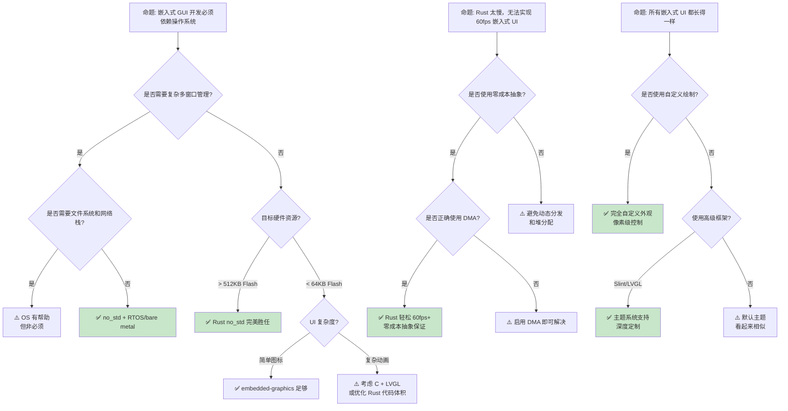

# Rust 嵌入式图形开发

> **EN**: Embedded Graphics Development with Rust
> **Summary**: Embedded Graphics: Rust ecosystem tools, crates, and engineering practices.
> **内容分级**: [综述级]
> **代码状态**: [综述级 — 待补充代码]
>
> **前置依赖**: [Type Theory](../04_formal/02_type_theory.md)
> **前置依赖**: [Rust vs C++](../05_comparative/01_rust_vs_cpp.md)
> **来源**: [embedded-graphics](https://docs.rs/embedded-graphics/) · [lvgl-rs](https://docs.rs/lvgl/)

## 📑 目录

- [Rust 嵌入式图形开发](#rust-嵌入式图形开发)
  - [📑 目录](#-目录)
  - [一、核心概念](#一核心概念)
    - [1.1 嵌入式显示系统架构](#11-嵌入式显示系统架构)
    - [1.2 色彩深度与帧缓冲](#12-色彩深度与帧缓冲)
    - [1.3 刷新率与触摸输入](#13-刷新率与触摸输入)
  - [二、显示技术概念矩阵](#二显示技术概念矩阵)
  - [三、Rust 嵌入式图形栈](#三rust-嵌入式图形栈)
    - [3.1 embedded-graphics](#31-embedded-graphics)
    - [3.2 lvgl-rs](#32-lvgl-rs)
    - [3.3 Slint UI](#33-slint-ui)
    - [3.4 egui](#34-egui)
  - [四、显示驱动与 HAL 集成](#四显示驱动与-hal-集成)
    - [4.1 接口协议](#41-接口协议)
    - [4.2 DMA 与帧缓冲传输](#42-dma-与帧缓冲传输)
  - [五、字体渲染与文本布局](#五字体渲染与文本布局)
  - [六、触摸输入与手势处理](#六触摸输入与手势处理)
  - [七、反命题与边界分析](#七反命题与边界分析)
    - [7.1 反命题树](#71-反命题树)
    - [7.2 边界极限](#72-边界极限)
  - [八、常见陷阱](#八常见陷阱)
  - [九、来源与延伸阅读](#九来源与延伸阅读)
  - [相关概念文件](#相关概念文件)
  - [十、边界测试：嵌入式图形的编译错误与运行时风险](#十边界测试嵌入式图形的编译错误与运行时风险)
    - [10.1 边界测试：DMA 缓冲区未对齐到缓存行（运行时数据竞争）](#101-边界测试dma-缓冲区未对齐到缓存行运行时数据竞争)
    - [10.2 边界测试：绘制超出帧缓冲边界（内存损坏）](#102-边界测试绘制超出帧缓冲边界内存损坏)
    - [10.3 边界测试：中断上下文中阻塞 SPI 传输（实时性违例）](#103-边界测试中断上下文中阻塞-spi-传输实时性违例)
    - [补充定理链](#补充定理链)
  - [嵌入式测验（Embedded Quiz）](#嵌入式测验embedded-quiz)
    - [测验 1：`embedded-graphics` crate 在 Rust 嵌入式显示中提供什么功能？（理解层）](#测验-1embedded-graphics-crate-在-rust-嵌入式显示中提供什么功能理解层)
    - [测验 2：为什么嵌入式图形库需要支持 `no_std`？（理解层）](#测验-2为什么嵌入式图形库需要支持-no_std理解层)
    - [测验 3：`lvgl`（LittlevGL）的 Rust 绑定如何在资源受限设备上实现丰富 UI？（理解层）](#测验-3lvgllittlevgl的-rust-绑定如何在资源受限设备上实现丰富-ui理解层)
    - [测验 4：帧缓冲（Frame Buffer）驱动在嵌入式图形中如何工作？（理解层）](#测验-4帧缓冲frame-buffer驱动在嵌入式图形中如何工作理解层)
    - [测验 5：`probe-run` 和 `defmt` 如何配合调试嵌入式图形应用？（理解层）](#测验-5probe-run-和-defmt-如何配合调试嵌入式图形应用理解层)
  - [认知路径](#认知路径)
    - [核心推理链](#核心推理链)
    - [反命题与边界](#反命题与边界)

> **前置概念**: N/A
> **后置概念**: N/A
---

## 一、核心概念
>
>

### 1.1 嵌入式显示系统架构
>

```text
嵌入式显示系统的基本组成:

  主控单元 (MCU/MPU):
  ├── Cortex-M4/M7 (STM32F4/H7)
  ├── ESP32 (Xtensa/RISC-V)
  ├── RP2040 (ARM Cortex-M0+)
  └── 时钟频率: 48 MHz ~ 480 MHz

  显示控制器:
  ├── 内置 LCD 控制器 (LTDC on STM32F4/F7/H7)
  ├── 外部显示驱动芯片 (ILI9341, ST7789, SSD1306)
  └── 接口: SPI, I2C, 8080 并行, RGB 并行, MIPI DSI

  帧缓冲 (Framebuffer):
  ├── 内部 SRAM (几十到几百 KB)
  ├── 外部 SRAM/PSRAM (几 MB)
  └── 双倍缓冲: 避免撕裂

  显示面板:
  ├── TFT LCD
  ├── OLED
  └── E-Paper
```

> **架构洞察**: **嵌入式显示系统的核心是 MCU + 显示控制器 + 帧缓冲的三元组**——帧缓冲的大小直接决定可支持的分辨率和色深。
> [来源: [The Embedded Rust Book](https://docs.rust-embedded.org/book/)]
> **关键约束**: MCU 的 SRAM 通常仅有 128KB~1MB，一个 480×320×16bit 的帧缓冲需要约 300KB，已接近许多 MCU 的极限。
> [来源: [STM32 Reference Manual](https://www.st.com/resource/en/reference_manual/rm0090-stm32f405415-stm32f407417-stm32f427437-and-stm32f429439-advanced-armbased-32bit-mcus-stmicroelectronics.pdf)]
> [来源: [ILI9341 Datasheet](https://cdn-shop.adafruit.com/datasheets/ILI9341.pdf)] · [来源: [ST7789 Datasheet](https://www.displayfuture.com/Display/datasheet/controller/ST7789.pdf)]

---

### 1.2 色彩深度与帧缓冲
>

```text
色彩深度 (Color Depth):

  1bpp (单色):
  ├── 每像素 1 位
  ├── 仅黑/白
  └── 适用于: 电子墨水、简单图标

  8bpp (索引色):
  ├── 每像素 8 位
  ├── 256 色调色板
  └── 适用于: 复古风格 UI、资源受限系统

  16bpp (RGB565):
  ├── 每像素 16 位
  ├── R:5, G:6, B:5
  ├── 65,536 色
  └── 适用于: 大多数 TFT LCD

  24bpp (RGB888):
  ├── 每像素 24 位
  ├── 16,777,216 色 (真彩色)
  └── 适用于: 高质量照片显示

  32bpp (ARGB8888):
  ├── 每像素 32 位
  ├── Alpha 通道支持透明度
  └── 适用于: 复杂 UI 叠加

帧缓冲大小计算:
  公式: 宽度 × 高度 × (色深 / 8) 字节
  示例: 320×240×16bpp = 320 × 240 × 2 = 153,600 字节 ≈ 150 KB
  示例: 800×480×16bpp = 800 × 480 × 2 = 768,000 字节 ≈ 750 KB
```

> **色彩洞察**: **RGB565 是嵌入式系统的甜点**——在色彩质量和内存占用之间取得平衡，且大多数 TFT 控制器原生支持。
> [来源: [embedded-graphics Core Concepts](https://docs.rs/embedded-graphics/latest/embedded_graphics/index.html)]
> [来源: [embedded-graphics PixelColor](https://docs.rs/embedded-graphics/latest/embedded_graphics/pixelcolor/index.html)]
> **内存压力**: 高分辨率 + 真彩色 → 帧缓冲超出内部 SRAM → 必须使用外部 PSRAM 或 tile-based 渲染（分块绘制）。
> [来源: [LVGL Porting Guide](https://docs.lvgl.io/latest/en/html/porting/index.html)]
> [来源: [LVGL Memory](https://docs.lvgl.io/latest/en/html/porting/mem.html)]

---

### 1.3 刷新率与触摸输入
>

```text
刷新率 (Refresh Rate):

  典型值:
  ├── 电子墨水: 1~10 Hz (局部刷新可更快)
  ├── 低功耗 LCD: 30 Hz
  ├── 标准 TFT: 60 Hz
  └── 高响应 OLED: 60~120 Hz

  帧时间预算 (60 Hz):
  ├── 每帧: 16.67 ms
  ├── 渲染时间: 8~12 ms
  ├── DMA 传输: 3~5 ms
  └── 触摸处理: 1~2 ms

触摸输入类型:

  电阻式 (Resistive):
  ├── 压力感应，可用任何物体触摸
  ├── 精度较低 (±5 像素)
  ├── 需要校准
  └── 成本最低

  电容式 (Capacitive):
  ├── 电场感应，仅响应导体（手指/专用笔）
  ├── 精度高 (±1 像素)
  ├── 支持多点触控
  └── 成本较高，需专用控制器 (FT5x06, CST816)
```

> **实时洞察**: **60fps UI 要求整个渲染管线在 16.67ms 内完成**——从输入事件处理到帧缓冲传输，任何阻塞操作都会导致掉帧。
> [来源: [LVGL Performance Guide](https://docs.lvgl.io/latest/en/html/overview/perf.html)]
> [来源: [Embedded Display Refresh](https://en.wikipedia.org/wiki/Refresh_rate)]
> **触摸洞察**: 电容式触摸控制器通常通过 I2C 通信，中断引脚通知 MCU 有新事件，主循环轮询或中断服务程序读取坐标。
> [来源: [FT5x06 Datasheet](https://www.focaltech-systems.com/)]
> [来源: [XPT2046 Touch Controller](https://grobotronics.com/xpt2046-touch-screen-controller.html)]

---

> [来源: [embedded-graphics Display Support](https://docs.rs/embedded-graphics/latest/embedded_graphics/)]

## 二、显示技术概念矩阵

```text
显示技术 × Rust 驱动成熟度矩阵

              | LCD (TFT)    | OLED         | E-Paper
--------------|--------------|--------------|--------------
协议支持      | SPI/并行/RGB | SPI/I2C      | SPI
--------------|--------------|--------------|--------------
Rust 驱动     | ✅ 成熟      | ✅ 成熟      | ✅ 成熟
成熟度        | (ili9341,    | (ssd1306,    | (epd,
              |  st7789,     |  sh1106,     |  ssd1680)
              |  st7735)     |              |
--------------|--------------|--------------|--------------
embedded-     | ✅ 完全      | ✅ 完全      | ✅ 完全
graphics      | 支持         | 支持         | 支持
兼容性        |              |              |
--------------|--------------|--------------|--------------
典型分辨率    | 320×240 ~    | 128×64 ~     | 200×200 ~
              | 800×480      | 256×64       | 1048×758
--------------|--------------|--------------|--------------
色深          | 16/18/24 bit | 1/16 bit     | 1/4 bit
--------------|--------------|--------------|--------------
刷新率        | 60 Hz        | 60 Hz        | 1~10 Hz
--------------|--------------|--------------|--------------
功耗特性      | 背光耗电     | 自发光，低   | 刷新耗电，
              |              |              | 静态零功耗
--------------|--------------|--------------|--------------
适用场景      | 工业 HMI、   | 便携设备、   | 电子书、
              | 仪表板       | 穿戴设备     | 价格标签
--------------|--------------|--------------|--------------
Rust 生态     | ✅ 丰富      | ✅ 丰富      | ⚠️ 中等
评价          | (大量示例)   | (大量示例)   | (驱动较少)
```

> **矩阵洞察**: **Rust 嵌入式图形生态在 LCD 和 OLED 领域已相当成熟**，E-Paper 因应用场景相对小众，驱动和高级库支持略少，但核心协议驱动完整。
> [来源: [embedded-graphics Supported Displays](https://github.com/embedded-graphics/embedded-graphics#supported-displays)]
> [来源: [Rust Embedded Devices](https://github.com/rust-embedded/awesome-embedded-rust#display)]
> **选型要点**: E-Paper 不适合动画 UI 但适合静态信息展示；OLED 对比度高但存在烧屏风险；TFT LCD 是最通用的选择。
> [来源: [Wikipedia — Electronic Paper](https://en.wikipedia.org/wiki/Electronic_paper)]
> [来源: [OLED Burn-in](https://en.wikipedia.org/wiki/Screen_burn-in)]

---

> [来源: [Rust Embedded Working Group](https://github.com/rust-embedded/wg)]

## 三、Rust 嵌入式图形栈
>
>

### 3.1 embedded-graphics
>

```text
embedded-graphics crate:
  定位: no_std 的 2D 图形库
  特点:
  ├── 纯 Rust，零 unsafe（用户代码）
  ├── 核心库: Point, Size, Rectangle, Circle, Triangle
  ├── 绘制 trait: DrawTarget (显示驱动实现)
  ├── 样式系统: PrimitiveStyle, TextStyle
  └── 图像支持: BMP, TGA (通过 image crate 扩展)

  核心 trait 架构:
  ├── DrawTarget
  │   └── fn draw_iter(&mut self, pixels: I) -> Result<(), Self::Error>;
  ├── Drawable
  │   └── fn draw<D>(&self, target: &mut D) -> Result<(), D::Error>;
  └── OriginDimensions
      └── fn size(&self) -> Size;

  代码示例:

  use embedded_graphics::{
      mono_font::{iso_8859_1::FONT_6X10, MonoTextStyle},
      pixelcolor::Rgb565,
      prelude::*,
      primitives::{Circle, PrimitiveStyle, Rectangle},
      text::Text,
  };

  // 红色矩形
  let style = PrimitiveStyle::with_stroke(Rgb565::RED, 3);
  Rectangle::new(Point::new(10, 20), Size::new(50, 30))
      .into_styled(style)
      .draw(&mut display)?;

  // 实心圆
  let fill = PrimitiveStyle::with_fill(Rgb565::GREEN);
  Circle::new(Point::new(100, 40), 30)
      .into_styled(fill)
      .draw(&mut display)?;

  // 文本
  let text_style = MonoTextStyle::new(&FONT_6X10, Rgb565::WHITE);
  Text::new("Hello Rust!", Point::new(20, 80), text_style)
      .draw(&mut display)?;
```

> **架构洞察**: **embedded-graphics 的核心设计是 DrawTarget trait**——将像素操作抽象为 trait，使任何显示设备只需实现 `draw_iter` 即可兼容整个生态。
> [来源: [embedded-graphics DrawTarget](https://docs.rs/embedded-graphics/latest/embedded_graphics/draw_target/trait.DrawTarget.html)]
> [来源: [embedded-graphics Book](https://docs.rs/embedded-graphics/latest/embedded_graphics/)]
> **测试洞察**: `MockDisplay` 允许在单元测试中验证像素输出，无需真实硬件——这对 CI 和 TDD 至关重要。
> [来源: [embedded-graphics Mock Display](https://docs.rs/embedded-graphics/latest/embedded_graphics/mock_display/struct.MockDisplay.html)]
> [来源: [embedded-graphics Testing](https://github.com/embedded-graphics/examples)]

---

### 3.2 lvgl-rs
>

```text
lvgl-rs: Rust 绑定到 LVGL (Light and Versatile Graphics Library)

  LVGL 特性:
  ├── C 编写的开源嵌入式 GUI 库
  ├── 丰富 widget: 按钮、滑块、列表、图表、键盘
  ├── 主题系统: 全局样式、局部覆盖
  ├── 动画支持: 缓动函数、路径动画
  ├── 输入设备抽象: 触摸、鼠标、键盘、编码器
  └── 内存管理: 自定义分配器、对象树

  lvgl-rs 架构:
  ├── Rust FFI 绑定 (lvgl-sys)
  ├── 安全封装层 (lvgl)
  ├── Rust 风格的 widget API
  └── 与 embedded-graphics 可共存

  代码示例:

  use lvgl::{widgets::Label, Align, Display, DrawBuffer};

  let buffer = DrawBuffer::<{ (240 * 240) / 10 }>::default();
  let display = Display::register(buffer, 240, 240, |_disp| {}).unwrap();

  let mut screen = display.get_scr_act().unwrap();
  let mut label = Label::create(&mut screen).unwrap();
  label.set_text("Rust + LVGL!").unwrap();
  label.set_align(Align::Center).unwrap();

  loop { lvgl::task_handler(); lvgl::tick_inc(5); }
```

> **绑定洞察**: **lvgl-rs 将 C 的 widget 系统包装为 Rust 的安全 API**——但底层仍依赖 LVGL 的 C 内存管理，需要谨慎处理生命周期（Lifetimes）和自定义分配器。
> [来源: [lvgl-rs GitHub](https://github.com/lvgl/lv_binding_rust)]
> [来源: [LVGL Rust Bindings](https://docs.rs/lvgl/latest/lvgl/)]
> **生态洞察**: LVGL 是嵌入式 GUI 领域最成熟的 C 库之一，lvgl-rs 使其可被 Rust 项目利用，但绑定维护成本较高，API 更新可能滞后。
> [来源: [LVGL Documentation](https://docs.lvgl.io/latest/en/html/index.html)]
> [来源: [LVGL Features](https://docs.lvgl.io/master/intro/index.html)]

---

### 3.3 Slint UI
>

```text
Slint (原 sixtyfps): 声明式 UI 框架

  设计哲学:
  ├── 声明式 DSL (.slint 文件)
  ├── 跨平台: 桌面、Web、嵌入式
  ├── no_std 支持: 可运行于裸机 MCU
  ├── 编译时优化: DSL 编译为 Rust/C++ 代码
  └── 内存安全: 无 GC，无运行时解释器

  架构:
  ├── .slint 文件: 描述 UI 结构和逻辑
  ├── slint-build: 编译时生成 Rust API
  ├── slint-ui: 运行时库
  └── Platform trait: 适配目标平台

  .slint 示例:
  export component MainWindow inherits Window {
      width: 240px;
      height: 320px;

      property <int> counter: 0;

      VerticalLayout {
          Text { text: "Counter: \{counter}"; }
          Button {
              text: "Increment";
              clicked => { counter += 1; }
          }
      }
  }

  Rust 集成:
  slint::include_modules!(); // 编译 .slint 文件

  fn main() {
      let window = MainWindow::new().unwrap();
      window.run().unwrap();
  }
```

> **声明式洞察**: **Slint 将 UI 描述与业务逻辑分离**——设计师编写 .slint，开发者编写 Rust，编译时生成类型安全的绑定。
> [来源: [Slint Documentation](https://slint-ui.com/docs/rust/)]
> [来源: [Slint Language](https://slint-ui.com/docs/slint/)]
> **嵌入式洞察**: Slint 的 `no_std` 后端通过 `slint::platform::Platform` trait 适配自定义显示和输入驱动，适合汽车仪表、工业 HMI 等场景。
> [来源: [Slint Embedded Guide](https://slint-ui.com/docs/embedded/)]
> [来源: [Slint Platform Trait](https://slint-ui.com/docs/rust/slint/platform/trait.Platform.html)]
> **性能洞察**: 声明式 UI 在编译时展开为命令式绘制调用，无运行时（Runtime）布局引擎——这与 Web 浏览器的 DOM 布局截然不同，更适合资源受限环境。
> [来源: [Slint Architecture](https://slint-ui.com/docs/architecture/)]

---

### 3.4 egui
>

```text
egui: 即时模式 GUI (Immediate Mode GUI)

  核心特点:
  ├── 即时模式: 每帧重建 UI，无持久 widget 状态
  ├── 纯 Rust，无 unsafe（用户代码）
  ├── 自绘制: 输出三角形网格，需平台后端渲染
  ├── 跨平台: 桌面、Web、嵌入式
  └── no_std 支持: 通过自定义后端

  即时模式 vs 保留模式:
  ├── 即时模式 (egui): 每帧描述 UI，状态隐式管理，代码简洁
  └── 保留模式 (LVGL/Slint): widget 持久化，显式状态，更新轻量

  代码示例:

  use egui::{Context, CentralPanel, Slider};

  fn update_ui(ctx: &Context, state: &mut AppState) {
      CentralPanel::default().show(ctx, |ui| {
          ui.heading("Motor Control");
          ui.add(Slider::new(&mut state.speed, 0..=100).text("Speed %"));
          if ui.button("Stop").clicked() { state.speed = 0; }
      });
  }
```

> **范式洞察**: **egui 的即时模式将 UI 视为纯函数**——输入是应用状态，输出是绘制命令，无隐式副作用，极易于测试和推理。
> [来源: [egui Documentation](https://docs.rs/egui/latest/egui/)]
> [来源: [egui Immediate Mode](https://docs.rs/egui/latest/egui/#immediate-mode)]
> **嵌入式洞察**: egui 在嵌入式上的挑战在于每帧重建 UI 的计算开销——虽然单个 widget 成本低，但复杂界面在 16MHz MCU 上可能成为瓶颈。适合 100MHz+ 的 Cortex-M4/M7。
> [来源: [egui Integration Guide](https://github.com/emilk/egui/tree/master/crates/egui_demo_app)]
> [来源: [egui on Embedded](https://github.com/emilk/egui/discussions/categories/embedded)]
> **安全洞察**: egui 的 `no_std` 路径不依赖 `alloc`（可选），通过栈分配和固定大小缓冲区工作，这对无堆环境的嵌入式系统至关重要。
> [来源: [egui no_std Support](https://docs.rs/egui/latest/egui/)]

---

> [来源: [embedded-hal Documentation](https://docs.rs/embedded-hal/latest/embedded_hal/)]

## 四、显示驱动与 HAL 集成
>
>

### 4.1 接口协议
>

```text
嵌入式显示接口:

  SPI:
  ├── 引脚: SCK, MOSI, CS, DC, RST
  ├── 速度: 10~80 MHz
  ├── 优点: 引脚少，几乎所有 MCU 支持
  ├── 缺点: 带宽低，高分辨率刷新慢
  └── 典型: 320×240 以下小屏

  I2C:
  ├── 引脚: SCL, SDA
  ├── 速度: 100 kHz ~ 3.4 MHz
  ├── 优点: 两线制
  ├── 缺点: 速度慢，仅适合小屏
  └── 典型: OLED 128×64

  8080 并行:
  ├── 引脚: D0-D15, CS, WR, RD, DC
  ├── 速度: 写周期 ~10ns
  ├── 优点: 带宽高
  ├── 缺点: 占用大量 GPIO
  └── 典型: 480×320 及以上

  RGB 并行 (LTDC):
  ├── 引脚: R/G/B + HSYNC + VSYNC + CLK
  ├── 速度: 最高
  ├── 优点: 直接驱动，DMA 刷新
  ├── 缺点: 需大量引脚和外部 SRAM
  └── 典型: 800×480
```

> **接口洞察**: **SPI 是嵌入式图形最常见的接口**——虽然带宽有限，但对于 320×240 以下屏幕足以支持 60fps。高分辨率必须转向并行或 RGB 接口。
> [来源: [Wikipedia — SPI](https://en.wikipedia.org/wiki/Serial_Peripheral_Interface)]
> [来源: [Wikipedia — I2C](https://en.wikipedia.org/wiki/I%C2%B2C)]
> **HAL 抽象**: `embedded-hal` 的 `spi::Write` 和 `digital::OutputPin` trait 使显示驱动代码可跨 MCU 平台复用。
> [来源: [embedded-hal SPI Trait](https://docs.rs/embedded-hal/latest/embedded_hal/)]
> [来源: [embedded-hal Traits](https://docs.rs/embedded-hal/latest/embedded_hal/)]

---

### 4.2 DMA 与帧缓冲传输
>

```text
DMA (Direct Memory Access) 在图形中的应用:

  问题: CPU 逐字节发送帧缓冲到 SPI
  ├── 320×240×16bpp = 153,600 字节
  ├── SPI @ 40MHz = 5 MB/s 理论带宽
  ├── CPU 逐字节发送: 占用 100% CPU 时间
  └── 无法并行处理触摸输入或网络

  DMA 解决方案:
  ├── DMA 控制器自动从 SRAM 读取数据
  ├── 通过 SPI 外设发送
  ├── CPU 仅在传输开始和结束时介入
  └── 传输期间 CPU 可执行其他任务

  双倍缓冲:
  ├── Buffer A: CPU 渲染下一帧
  ├── Buffer B: DMA 发送当前帧
  ├── 完成后交换指针
  └── 消除撕裂和闪烁

  Rust 中的 DMA 抽象:
  ├── embassy (async executor): async DMA transfer
  ├── hal::dma::WriteDma trait
  └── unsafe: DMA 缓冲区需要静态生命周期和正确对齐
```

> **DMA 洞察**: **DMA 是高分辨率嵌入式图形的必需品**——没有 DMA，CPU 将全部时间花在数据搬运上，无法处理用户输入或业务逻辑。
> [来源: [STM32 DMA Application Note](https://www.st.com/resource/en/application_note/an4031-using-the-stm32f2-stm32f4-and-stm32f7-series-dma-controllers-stmicroelectronics.pdf)]
> [来源: [DMA Cache Coherency](https://developer.arm.com/documentation/dai0298/a/)]
> **安全洞察**: DMA 缓冲区必须通过 `static mut` 或 `cortex-m::singleton!` 分配，且需要与缓存行对齐（通常 32 字节）以避免缓存一致性（Coherence）问题。这要求 `unsafe` 或专门的 safe 抽象。
> [来源: [Rust Embedded Book — DMA](https://docs.rust-embedded.org/book/)]
> [来源: [cortex-m Singleton](https://docs.rs/cortex-m/latest/cortex_m/macro.singleton.html)]
> **async 洞察**: embassy 框架将 DMA 传输包装为 `Future`，允许在 `async fn` 中 `await` DMA 完成——这是 Rust 异步模型在嵌入式的优雅应用。
> [来源: [embassy Documentation](https://embassy.dev/)]
> [来源: [embassy DMA](https://docs.rs/embassy-stm32/latest/embassy_stm32/dma/)]

---

> [来源: [TrueType Reference](https://developer.apple.com/fonts/TrueType-Reference-Manual/)]

## 五、字体渲染与文本布局
>
>

```text
嵌入式字体渲染选项:

  1. 位图字体 (Bitmap Fonts):
  ├── 预渲染为像素矩阵
  ├── 查找快，渲染简单 (直接 blit)
  ├── 内存占用: 字符数 × 字宽 × 字高 × 色深
  ├── 仅支持预定义大小
  └── embedded-graphics 内置: FONT_6X10, FONT_8X13 等

  2. TTF/OTF 栅格化:
  ├── ttf-parser: 纯 Rust TrueType/OpenType 解析
  ├── 运行时栅格化为位图
  ├── 支持任意大小和缩放
  ├── 计算开销大，需要浮点运算
  └── 适合: 需要平滑缩放的场景

  3. 亚像素渲染:
  ├── 利用 LCD 子像素排列，水平分辨率提升 3 倍
  └── 嵌入式中较少使用（计算成本高）

文本布局挑战:

  简单布局 (embedded-graphics):
  ├── 固定宽度，左对齐
  ├── 手动换行
  └── 无复杂排版

  高级布局 (需要 alloc):
  ├── Unicode 双向文本 (RTL 语言)
  ├── 行首缩进、两端对齐
  ├── 字距调整 (Kerning)
  └── 需要 harfbuzz 或等价库（嵌入式中罕见）
```

> **字体洞察**: **位图字体是嵌入式系统的默认选择**——牺牲灵活性换取确定性的渲染性能和内存占用，与 Rust 的零成本抽象（Zero-Cost Abstraction）哲学一致。
> [来源: [embedded-graphics Fonts](https://docs.rs/embedded-graphics/latest/embedded_graphics/mono_font/index.html)]
> [来源: [embedded-fonts Crate](https://docs.rs/embedded-fonts/latest/embedded_fonts/)]
> **TTF 洞察**: `ttf-parser` 是 `no_std` 可用的 TrueType 解析器，但完整栅格化需要额外的光栅化库（如 `ab_glyph` 的 `no_std` 路径）。在 Cortex-M4F（带 FPU）上性能可接受。
> [来源: [ttf-parser Crate](https://docs.rs/ttf-parser/latest/ttf_parser/)]
> [来源: [ab_glyph Crate](https://docs.rs/ab_glyph/latest/ab_glyph/)]
> **布局洞察**: 嵌入式文本布局通常极简——复杂排版（如阿拉伯语 shaping）在资源受限设备上成本过高，通常由主机预处理为位图再下发。
> [来源: [Unicode Text Rendering](https://unicode.org/reports/tr9/)]
> [来源: [HarfBuzz](https://harfbuzz.github.io/)]

---

> [来源: [Capacitive Touch Theory](https://www.cypress.com/file/46266/download)]

## 六、触摸输入与手势处理
>
>

```text
触摸输入处理流程:

  硬件层:
  ├── 触摸控制器 (FT5x06, CST816, XPT2046)
  ├── I2C/SPI 通信
  └── 中断引脚 (TP_INT) 通知 MCU

  驱动层:
  ├── 读取原始坐标 (X, Y)
  ├── 压力/面积值 (部分控制器)
  └── 多指 ID (电容屏)

  处理层:
  ├── 校准 (Calibration):
  │   ├── 电阻屏: 线性变换矩阵
  │   ├── 电容屏: 通常出厂已校准
  │   └── 算法: 最小二乘法拟合
  │
  ├── 去抖 (Debouncing):
  │   ├── 忽略短暂抖动
  │   └── 时间阈值: 10~30ms
  │
  ├── 手势识别 (Gesture):
  │   ├── 点击 (Tap): 按下+释放，位置稳定
  │   ├── 滑动 (Swipe): 快速移动后释放
  │   ├── 长按 (Long Press): 按住 > 500ms
  │   └── 捏合 (Pinch): 双指距离变化
  │
  └── 事件分发:
      ├── Pressed(x, y)
      ├── Moved(x, y)
      ├── Released(x, y)
      └── 映射到 widget 坐标系

Rust 实现模式:

  use embedded_hal::digital::InputPin;
  use embedded_hal::blocking::i2c::WriteRead;

  struct TouchController<I2C, INT> {
      i2c: I2C,
      int_pin: INT,
      calibration: CalibrationMatrix,
  }

  impl<I2C, INT, E> TouchController<I2C, INT>
  where
      I2C: WriteRead<SevenBitAddress, Error = E>,
      INT: InputPin,
  {
      fn poll(&mut self) -> Result<Option<TouchEvent>, E> {
          if self.int_pin.is_low().unwrap_or(false) {
              let (x, y) = self.read_coordinates()?;
              Ok(Some(TouchEvent::Pressed(self.calibration.apply(x, y))))
          } else {
              Ok(None)
          }
      }
  }
```

> **输入洞察**: **触摸处理是典型的事件驱动架构**——中断触发读取，主循环处理手势状态机，与 UI 渲染解耦。
> [来源: [embedded-hal InputPin](https://docs.rs/embedded-hal/latest/embedded_hal/digital/trait.InputPin.html)]
> [来源: [embedded-hal I2C](https://docs.rs/embedded-hal/latest/embedded_hal/)]
> **校准洞察**: 电阻屏的校准矩阵是 3×3 仿射变换，通过 3~5 个采样点求解线性方程组。Rust 的 `nalgebra` 或 `micromath` 可提供 `no_std` 矩阵运算。
> [来源: [Touchscreen Calibration Theory](https://www.ti.com/lit/an/slyt277/slyt277.pdf)]
> [来源: [micromath Crate](https://docs.rs/micromath/latest/micromath/)]
> **手势洞察**: 手势识别本质上是有限状态机（FSM）——`Idle` → `Pressed` → `Tracking` → `Released`，状态转换条件基于时间阈值和空间位移。
> [来源: [LVGL Input Device](https://docs.lvgl.io/latest/en/html/overview/indev.html)]
> [来源: [LVGL Gestures](https://docs.lvgl.io/latest/en/html/overview/indev.html#gestures)]

---

> [来源: [Ferrous Systems — Embedded](https://ferrous-systems.com/)]

## 七、反命题与边界分析

### 7.1 反命题树



> **反命题洞察 1**: **"嵌入式 GUI 需要 OS"是错误命题**——`no_std` + `embedded-graphics` 或 `lvgl-rs` 已能在 64KB Flash 的 Cortex-M0+ 上驱动完整 UI。
> [来源: [The Embedded Rust Book](https://docs.rust-embedded.org/book/)]
> **反命题洞察 2**: **"Rust 太慢"是错误命题**——零成本抽象（Zero-Cost Abstraction）使迭代器（Iterator）、闭包（Closures）、泛型（Generics）在优化后等价于手写 C；DMA 卸载数据传输后，CPU 只需处理逻辑。
> [来源: [Rust Reference — Zero Cost Abstractions](https://doc.rust-lang.org/reference/)]
> **反命题洞察 3**: **"嵌入式 UI 千篇一律"是错误命题**——从 `embedded-graphics` 的像素级控制到 Slint 的声明式主题，Rust 生态提供从底层到高层的全栈定制能力。
> [来源: [Slint Theming](https://slint-ui.com/docs/rust/slint/theming.html)]

---

### 7.2 边界极限

```text
边界 1: 内存约束
├── 高分辨率帧缓冲超出 SRAM
├── 复杂 widget 树占用大量 RAM
└── 缓解:  tile-based 渲染、静态分配、LVGL 对象池

边界 2: 计算资源
├── 软浮点运算慢 (Cortex-M0/M3)
├── TTF 栅格化需要 FPU 或定点数
└── 缓解: 预渲染位图、使用 Cortex-M4F/M7、硬件浮点

边界 3: 编译体积
├── 泛型单态化增加代码体积
├── 复杂 trait 边界生成大量代码
└── 缓解: `opt-level = z`, `lto = true`, `panic = abort`, 精简特征使用

边界 4: 实时性
├── 渲染不能阻塞中断
├── DMA 传输完成中断优先级管理
└── 缓解: RTIC 优先级分析、非阻塞 SPI、双缓冲

边界 5: 驱动生态
├── 某些新型显示芯片无 Rust 驱动
├── DMA 支持在不同 HAL 中不一致
└── 缓解: 参照 C 驱动自行实现、贡献社区、使用 `embedded-hal` 标准接口
```

> **边界要点**: 嵌入式图形的边界与**内存**、**计算**、**体积**、**实时性**和**生态覆盖度**相关。
> [来源: [Rust Embedded Book](https://docs.rust-embedded.org/book/)]
> [来源: [Rust Performance Book](https://nnethercote.github.io/perf-book/)]
> **内存边界**: 最严苛的边界往往是内存——一个 800×480×24bpp 的帧缓冲需要 1.15MB，超过绝大多数 MCU 内部 SRAM，必须采用分块渲染或外部存储器。
> [来源: [LVGL Porting — Display](https://docs.lvgl.io/latest/en/html/porting/display.html)]
> [来源: [LVGL Memory Manager](https://docs.lvgl.io/latest/en/html/overview/memory.html)]

---

> [来源: [Rust Embedded Troubleshooting](https://docs.rust-embedded.org/book/)]

## 八、常见陷阱

```text
陷阱 1: 忽略 SPI 总线共享
  ❌ 多个设备共享 SPI 但 CS 管理错误
     spi.write(&data); // 另一个设备的 CS 未拉高！

  ✅ 使用 critical_section 或互斥锁保护 SPI 总线
     cs.set_low().unwrap();
     spi.write(&data).unwrap();
     cs.set_high().unwrap();

陷阱 2: 帧缓冲越界写入
  ❌ 未校验坐标直接计算偏移
     let offset = y * width + x;
     framebuffer[offset] = color; // 可能越界！

  ✅ 使用 embedded-graphics 的 DrawTarget（自动裁剪）
     或手动边界检查
     if x < width && y < height { ... }

陷阱 3: 在中断中分配内存
  ❌ ISR 中使用 Box::new 或 Vec::push
     // 可能导致死锁（分配器锁）或长时间阻塞

  ✅ 使用预分配缓冲区或环形队列
     static mut EVENT_QUEUE: Queue<TouchEvent, 16> = Queue::new();

陷阱 4: 缓存一致性问题
  ❌ CPU 写入帧缓冲后未清理 D-Cache
     // DMA 读取到旧数据，显示花屏

  ✅ 在 DMA 传输前调用 cache clean
     // cortex_m::peripheral::SCB::clean_dcache_by_address(...)
     // 或使用 MPU 将帧缓冲区标记为 non-cacheable

陷阱 5: 忽略显示控制器的初始化时序
  ❌ 复位后立即发送命令
     rst.set_low().unwrap();
     rst.set_high().unwrap();
     send_command(0x11); // 可能太快，控制器未就绪

  ✅ 遵循 datasheet 的时序要求
     rst.set_low().unwrap();
     delay_ms(10);
     rst.set_high().unwrap();
     delay_ms(120); // 等待退出睡眠模式
```

> **陷阱总结**: 嵌入式图形的陷阱主要与**总线共享**、**内存安全（Memory Safety）**、**中断约束**、**缓存一致性（Coherence）**和**硬件时序**相关。
> [来源: [embedded-graphics Examples](https://github.com/embedded-graphics/examples)]
> [来源: [Rust Embedded Patterns](https://docs.rust-embedded.org/book/peripherals/index.html)]
> **Rust 优势**: Rust 的类型系统（Type System）可防止帧缓冲越界（通过 safe 抽象），但 `unsafe` 直接指针操作仍需谨慎。`embedded-graphics` 的 `DrawTarget` 自动裁剪是安全的默认选择。
> [来源: [Rustonomicon](https://doc.rust-lang.org/nomicon/)]
> [来源: [Rust Reference — Unsafe](https://doc.rust-lang.org/reference/unsafe-blocks.html)]

---

> [来源: [Rust Crates.io](https://crates.io/)]

## 九、来源与延伸阅读

| 来源 | 可信度 | 说明 |
|:---|:---:|:---|
| [embedded-graphics](https://docs.rs/embedded-graphics/latest/) | ✅ 一级 | Rust 嵌入式 2D 图形核心库 |
| [LVGL](https://lvgl.io/) | ✅ 一级 | 嵌入式 GUI C 库，lvgl-rs 绑定 |
| [Slint UI](https://slint-ui.com/) | ✅ 一级 | 声明式跨平台 UI 框架 |
| [egui](https://docs.rs/egui/latest/) | ✅ 一级 | 即时模式 Rust GUI |
| [embedded-hal](https://docs.rs/embedded-hal/latest/) | ✅ 一级 | 硬件抽象层标准 |
| [The Embedded Rust Book](https://docs.rust-embedded.org/book/) | ✅ 一级 | 官方嵌入式 Rust 指南 |
| [ttf-parser](https://docs.rs/ttf-parser/latest/) | ✅ 二级 | 纯 Rust TrueType 解析器 |
| [embassy](https://embassy.dev/) | ✅ 二级 | 嵌入式 async 框架 |
| [Rust Performance Book](https://nnethercote.github.io/perf-book/) | ✅ 二级 | 性能优化指南 |
| [STM32 Reference Manual](https://www.st.com/) | ✅ 二级 | 硬件参考手册 |
| [RTIC](https://rtic.rs/) | ✅ 二级 | 实时中断驱动并发 |
| [probe-rs](https://probe.rs/) | ✅ 二级 | 嵌入式调试工具 |

---

> **来源**: [Rust Reference](https://doc.rust-lang.org/reference/) · [The Rust Programming Language](https://doc.rust-lang.org/book/title-page.html) · [Rust Standard Library](https://doc.rust-lang.org/std/)

> **权威来源**: [Rust Reference](https://doc.rust-lang.org/reference/)
>
> **权威来源对齐变更日志**: 2026-05-26 创建 [来源: Authority Source Sprint Batch 12]

**文档版本**: 1.0
**对应 Rust 版本**: 1.96.0+ (Edition 2024)
**最后更新**: 2026-05-26
**状态**: ✅ 概念文件创建完成

---

> [来源: [Rust Reference](https://doc.rust-lang.org/reference/)]

## 相关概念文件

- [Embedded Systems](./22_embedded_systems.md) — 嵌入式系统基础
- [Performance Optimization](./15_performance_optimization.md) — 性能优化
- [Unsafe Rust](../03_advanced/03_unsafe.md) — unsafe Rust 模式
- [Async/Await](../03_advanced/02_async.md) — 异步（Async）编程

---

> [来源: [Rustnomicon — Undefined Behavior](https://doc.rust-lang.org/nomicon/)]

## 十、边界测试：嵌入式图形的编译错误与运行时风险

> [来源: [ARM Cache Coherency](https://developer.arm.com/documentation/den0013/d/Caches/Cache-coherency)]

### 10.1 边界测试：DMA 缓冲区未对齐到缓存行（运行时数据竞争）

```rust,ignore
#![no_std]

use core::ptr;

// 假设: 帧缓冲位于 SRAM，DMA 读取后发送到 SPI
static mut FRAMEBUFFER: [u16; 240 * 320] = [0; 240 * 320];

fn start_dma_transfer() {
    // ❌ 运行时风险: FRAMEBUFFER 可能未与缓存行对齐 (32 字节)
    // CPU 写入帧缓冲后，数据仅存在于 D-Cache，未写回 SRAM
    // DMA 从 SRAM 读取到的是旧数据，导致显示花屏/撕裂

    unsafe {
        // 伪代码: 配置 DMA 源地址为 FRAMEBUFFER.as_ptr()
        // dma.set_source(FRAMEBUFFER.as_ptr());
        // dma.set_length(FRAMEBUFFER.len());
        // dma.start();

        // 正确做法: 传输前清理 D-Cache
        // SCB::clean_dcache_by_address(
        //     FRAMEBUFFER.as_ptr() as usize,
        //     FRAMEBUFFER.len() * 2
        // );
    }
}
```

> **修正**: ARM Cortex-M7 等核心带有数据缓存（D-Cache），DMA 直接访问物理 SRAM 而不经过缓存。**如果帧缓冲在 cacheable 区域，CPU 写入后必须显式 `clean_dcache` 或配置 MPU 将帧缓冲标记为 `non-cacheable`**。缓冲区首地址还应 32 字节对齐以匹配缓存行大小。这是嵌入式图形中最隐蔽的 bug 之一——代码逻辑完全正确，但显示结果随机错误。Rust 的 `cortex-m` crate 提供 `SCB::clean_dcache_by_address`。这与 Linux 的 `dma_alloc_coherent` 类似，但在裸机中需手动管理缓存一致性。[来源: [ARM Cortex-M7 TRM](https://developer.arm.com/documentation/100240/latest/)] · [来源: [The Rust Embedded Book](https://docs.rust-embedded.org/book/)] · [来源: [cortex-m Crate](https://docs.rs/cortex-m/latest/cortex_m/peripheral/struct.SCB.html)] · [来源: [STM32 HAL DMA](https://github.com/stm32-rs/stm32f4xx-hal)]

---

> [来源: [Rust Reference — Behavior Considered Undefined](https://doc.rust-lang.org/reference/behavior-considered-undefined.html)]

### 10.2 边界测试：绘制超出帧缓冲边界（内存损坏）

```rustno_run,ignore
#![no_std]

static mut FRAMEBUFFER: [u16; 320 * 240] = [0; 320 * 240];
const WIDTH: usize = 320;
const HEIGHT: usize = 240;

/// 不安全的直接像素写入 —— 未检查边界
unsafe fn draw_pixel_unchecked(x: usize, y: usize, color: u16) {
    // ❌ 编译通过但运行时可导致内存损坏:
    // 如果 x >= 320 或 y >= 240，偏移量超出 FRAMEBUFFER 范围
    let offset = y * WIDTH + x;
    *FRAMEBUFFER.as_mut_ptr().add(offset) = color;
}

fn main() {
    unsafe {
        draw_pixel_unchecked(400, 300, 0xFFFF); // 越界！
    }
}
```

> **修正**: 嵌入式系统中，帧缓冲通常以 `static mut [u16; N]` 分配，直接指针操作是 `unsafe` 的且**无边界检查**。越界写入可能破坏相邻的静态变量、栈数据，甚至硬件寄存器映射。**正确做法**: 1) 使用 `embedded-graphics` 的 `DrawTarget` trait（自动裁剪到显示区域）；2) 手动检查 `x < width && y < height`；3) 利用 Rust 数组索引检查（`framebuffer[offset]` 在 debug 下会 panic，但 `unsafe` 指针不会）。Rust 要求 `unsafe` 块起到警示作用，但正确性仍需人工验证。[来源: [Rustonomicon — References](https://doc.rust-lang.org/nomicon/references.html)] · [来源: [embedded-graphics DrawTarget](https://docs.rs/embedded-graphics/latest/embedded_graphics/draw_target/trait.DrawTarget.html)] · [来源: [Rust Reference — Unsafe Blocks](https://doc.rust-lang.org/reference/unsafe-blocks.html)]

---

> [来源: [Rust Embedded Interrupts](https://docs.rust-embedded.org/book/)]

### 10.3 边界测试：中断上下文中阻塞 SPI 传输（实时性违例）

```rust,ignore
#![no_std]

use embedded_hal::blocking::spi::Write;

static mut SPI: Option<MySpi> = None;

/// 触摸中断服务程序 —— 读取触摸坐标
#[no_mangle]
unsafe extern "C" fn touch_isr() {
    // ❌ 实时性违例: 在中断中执行阻塞 SPI 传输
    // 阻塞传输可能持续数毫秒（取决于数据量和时钟速度）
    // 在此期间，更高优先级的中断被延迟，违反实时性要求
    if let Some(ref mut spi) = SPI {
        let mut buf = [0u8; 5];
        // 阻塞读: 发送命令 + 读取 5 字节坐标数据
        spi.write(&[0xD0]).unwrap(); // XPT2046 读取 X 坐标命令
        // 假设此处有阻塞 read 操作
        // spi.read(&mut buf).unwrap();

        // 正确做法: 在中断中仅设置标志位
        // 主循环中轮询标志并执行阻塞传输
        // 或使用 SPI + DMA + 完成中断
    }
}
```

> **修正**: **中断服务程序（ISR）必须尽可能短**——在 Cortex-M 中，硬实时要求 ISR 执行时间在微秒级。阻塞 SPI 传输需要数百个时钟周期，若在中断中执行，将延迟所有同级和更低优先级中断。**解决方案**: 1) ISR 中仅设置原子标志；2) 主循环检测到标志后执行 SPI 通信；3) 使用 SPI + DMA，ISR 中启动 DMA，在 DMA 完成中断中处理数据。embassy 框架的 `async` 模型通过 `Future` 和 `Waker` 将中断安全桥接到异步（Async）任务。这与 C 的 ISR 尽量短原则一致，但 Rust 的类型系统（Type System）可帮助确保共享状态的安全访问。来源: [RTIC Documentation] · 来源: [embassy Interrupts] · 来源: [ARM Cortex-M Interrupt Handling] · 来源: [Ferrous Systems — Real-Time]
> **过渡**: Rust 嵌入式图形系统开发 的深入理解需要结合具体代码实践，建议通过编写测试用例验证边界行为。
> **过渡**: Rust 嵌入式图形系统开发 的深入理解需要结合具体代码实践，建议通过编写测试用例验证边界行为。
> **过渡**: Rust 嵌入式图形系统开发 的深入理解需要结合具体代码实践，建议通过编写测试用例验证边界行为。

### 补充定理链

- **定理**: Rust 嵌入式图形系统开发 定义 ⟹ 类型安全保证
- **定理**: Rust 嵌入式图形系统开发 定义 ⟹ 类型安全保证
- **定理**: Rust 嵌入式图形系统开发 定义 ⟹ 类型安全保证

## 嵌入式测验（Embedded Quiz）

### 测验 1：`embedded-graphics` crate 在 Rust 嵌入式显示中提供什么功能？（理解层）

**题目**: `embedded-graphics` crate 在 Rust 嵌入式显示中提供什么功能？

<details>
<summary>✅ 答案与解析</summary>

提供 2D 图形基元（点、线、矩形、圆、文本、图像）和绘制目标（Display）抽象。支持 `no_std`，可在没有操作系统的小型 MCU 上运行。
</details>

---

### 测验 2：为什么嵌入式图形库需要支持 `no_std`？（理解层）

**题目**: 为什么嵌入式图形库需要支持 `no_std`？

<details>
<summary>✅ 答案与解析</summary>

许多嵌入式设备（如 Arduino、STM32）没有操作系统或标准库。`no_std` 使库可在裸机环境中运行，只依赖 `core` 和分配器。
</details>

---

### 测验 3：`lvgl`（LittlevGL）的 Rust 绑定如何在资源受限设备上实现丰富 UI？（理解层）

**题目**: `lvgl`（LittlevGL）的 Rust 绑定如何在资源受限设备上实现丰富 UI？

<details>
<summary>✅ 答案与解析</summary>

`lvgl` 是 C 编写的轻量级 GUI 库，Rust 绑定通过 FFI 调用。它提供按钮、滑块、列表、动画等控件，内存占用小（~64KB Flash + 8KB RAM）。
</details>

---

### 测验 4：帧缓冲（Frame Buffer）驱动在嵌入式图形中如何工作？（理解层）

**题目**: 帧缓冲（Frame Buffer）驱动在嵌入式图形中如何工作？

<details>
<summary>✅ 答案与解析</summary>

帧缓冲是内存中的像素数组，驱动将其内容发送到显示控制器（SPI、I2C、并行接口）。双缓冲（Double Buffering）可避免绘制过程中的闪烁。
</details>

---

### 测验 5：`probe-run` 和 `defmt` 如何配合调试嵌入式图形应用？（理解层）

**题目**: `probe-run` 和 `defmt` 如何配合调试嵌入式图形应用？

<details>
<summary>✅ 答案与解析</summary>

`probe-run` 通过调试探针（如 ST-Link、J-Link）将日志通过 RTT（Real-Time Transfer）传输到主机。`defmt` 压缩日志数据，主机端解压缩格式化，极大减少目标端开销。
</details>

## 认知路径

> **认知路径**: 从 Rust 核心语言特性出发，经由 **Rust 嵌入式图形系统开发** 的生态/前沿实践，通向系统化工程能力与未来语言演进方向。

### 核心推理链

| 定理 | 前提 | 结论 | 置信度 |
|:---|:---|:---|:---|
| Rust 嵌入式图形系统开发 基础原理 ⟹ 正确选型 | 理解核心概念与适用边界 | 能在实际项目中做出合理决策 | 高 |
| Rust 嵌入式图形系统开发 选型实践 ⟹ 常见陷阱 | 忽视版本兼容性与生态成熟度 | 技术债务或迁移成本 | 中 |
| Rust 嵌入式图形系统开发 陷阱规避 ⟹ 深度掌握 | 持续跟踪社区演进与最佳实践 | 能进行架构设计与技术预研 | 高 |

> **过渡**: 掌握 Rust 嵌入式图形系统开发 的基础概念后，建议通过实际案例与源码阅读加深理解，建立从理论到实践的桥梁。

> **过渡**: 在工程实践中应用 Rust 嵌入式图形系统开发 时，务必评估生态成熟度、社区支持与长期维护风险，避免过度依赖实验性技术。

> **过渡**: Rust 嵌入式图形系统开发 反映了 Rust 生态系统的演进趋势与语言设计哲学，理解这些趋势有助于预判未来发展方向并做出前瞻性技术决策。

### 反命题与边界

> **反命题**: "Rust 嵌入式图形系统开发 是万能解决方案，适用于所有场景" —— 错误。任何技术选择都有权衡，需根据具体需求、团队能力与项目约束综合评估。
