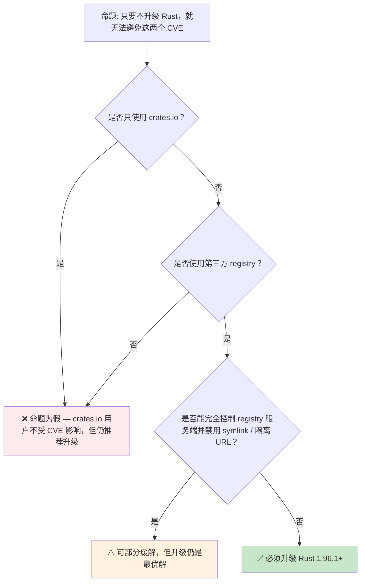

> **内容分级**: [综述级]
>
> **本节关键术语**: Cargo CVE · 第三方 Registry · URL 规范化 · Tarball Symlink · Source Replacement · `cargo audit` — [完整对照表](../00_meta/terminology_glossary.md)
>
# Cargo 安全公告：CVE-2026-5222 与 CVE-2026-5223
>
> **EN**: Cargo Security Advisories: CVE-2026-5222 and CVE-2026-5223
> **Summary**: Cargo Security Advisories: CVE-2026-5222 and CVE-2026-5223: Rust ecosystem tools, crates, and engineering practices.
>
> **受众**: [进阶 / 工程]
> **Bloom 层级**: 理解 → 应用
> **A/S/P 标记**: **S** — Security
> **双维定位**: S×Ops — 供应链安全与运维实践
> **定位**: 帮助开发者理解 Rust 1.96.0 中 Cargo 的两个 CVE，建立“升级 + 审计 + 验证”的供应链安全习惯。
> **前置概念**: [Toolchain](01_toolchain.md) · [Public/Private Dependencies](10_public_private_deps.md) · [Security Practices](19_security_practices.md) · [Rust vs C++](../05_comparative/01_rust_vs_cpp.md)
> **后置概念**: [Cross Compilation](17_cross_compilation.md) · [DevOps and CI/CD](28_devops_and_ci_cd.md)

---

> **来源**: [Rust 1.96 Release Notes](https://blog.rust-lang.org/2026/05/28/Rust-1.96.0/) · · [Rust Reference](https://doc.rust-lang.org/reference/) · [TRPL](https://doc.rust-lang.org/book/title-page.html) · [Brown University — Interactive Rust Book](https://rust-book.cs.brown.edu/) · [Jung et al. — RustBelt: Securing the Foundations of Rust](https://plv.mpi-sws.org/rustbelt/popl18/) · [Itanium C++ ABI](https://itanium-cxx-abi.github.io/cxx-abi/abi.html)
> [CVE-2026-5222 Advisory](https://blog.rust-lang.org/2026/05/25/cve-2026-5222/) ·
> [CVE-2026-5223 Advisory](https://blog.rust-lang.org/2026/05/25/cve-2026-5223/) ·
> [Fedora 43 Rust 1.96.0 Update](https://linuxsecurity.com/advisories/fedora/fedora-43-rust-2026-d7436d12ae) ·
> [Cargo Registries Reference](https://doc.rust-lang.org/cargo/reference/registries.html) ·
> [Cargo Source Replacement](https://doc.rust-lang.org/cargo/reference/source-replacement.html)


---

> **过渡**: 从 Cargo 安全公告 的直观描述转向其形式化定义，需要先把日常经验中的模糊直觉转化为可验证的术语。

> **过渡**: 在建立 Cargo 安全公告 的核心命题之后，下一步是审视这些命题在边界条件下的稳定性——这正是反命题与反例的价值所在。

> **过渡**: 最后，将 Cargo 安全公告 与相邻概念连接，形成从 L1 到 L7 的纵向认知路径，避免孤立记忆。


## 📑 目录

- [Cargo 安全公告：CVE-2026-5222 与 CVE-2026-5223](#cargo-安全公告cve-2026-5222-与-cve-2026-5223)
  - [📑 目录](#-目录)
  - [一、核心概念](#一核心概念)
    - [1.1 影响范围：仅第三方 registry](#11-影响范围仅第三方-registry)
    - [1.2 CVE-2026-5222：URL 规范化导致的凭证泄露](#12-cve-2026-5222url-规范化导致的凭证泄露)
      - [漏洞机理](#漏洞机理)
      - [攻击条件](#攻击条件)
      - [修复行为](#修复行为)
    - [1.3 CVE-2026-5223：tarball 符号链接越界提取](#13-cve-2026-5223tarball-符号链接越界提取)
      - [漏洞机理](#漏洞机理-1)
      - [攻击后果](#攻击后果)
      - [修复行为](#修复行为-1)
    - [1.4 Rust 1.96.0 的修复行为](#14-rust-1960-的修复行为)
  - [二、缓解措施与安全实践](#二缓解措施与安全实践)
    - [2.1 立即升级工具链](#21-立即升级工具链)
    - [2.2 审计 registry 来源](#22-审计-registry-来源)
    - [2.3 验证 crate tarball](#23-验证-crate-tarball)
    - [2.4 安全的 Cargo.toml 与 registry 配置](#24-安全的-cargotoml-与-registry-配置)
      - [示例 1：限制依赖来源，避免意外引入第三方 registry](#示例-1限制依赖来源避免意外引入第三方-registry)
      - [示例 2：配置私有 registry 并使用 source replacement](#示例-2配置私有-registry-并使用-source-replacement)
      - [示例 3：CI 中集成安全扫描](#示例-3ci-中集成安全扫描)
  - [三、反命题与边界分析](#三反命题与边界分析)
    - [3.1 反命题树](#31-反命题树)
    - [3.2 边界极限](#32-边界极限)
  - [四、来源与延伸阅读](#四来源与延伸阅读)
  - [相关概念文件](#相关概念文件)
  - [十、安全边界与常见错误](#十安全边界与常见错误)
    - [10.1 常见错误：误以为 crates.io 用户也受影响](#101-常见错误误以为-cratesio-用户也受影响)
    - [10.2 常见错误：在旧版本 Cargo 上仅做服务端限制](#102-常见错误在旧版本-cargo-上仅做服务端限制)
    - [10.3 常见错误：把 `.git` 后缀当作同一 registry](#103-常见错误把-git-后缀当作同一-registry)
  - [嵌入式测验（Embedded Quiz）](#嵌入式测验embedded-quiz)
    - [测验 1：这两个 CVE 是否影响只使用 crates.io 的开发者？（理解层）](#测验-1这两个-cve-是否影响只使用-cratesio-的开发者理解层)
    - [测验 2：CVE-2026-5222 的核心问题是什么？（理解层）](#测验-2cve-2026-5222-的核心问题是什么理解层)
    - [测验 3：CVE-2026-5223 能造成什么后果？（理解层）](#测验-3cve-2026-5223-能造成什么后果理解层)
    - [测验 4：Rust 1.96.0 对 CVE-2026-5223 的修复行为是什么？（应用层）](#测验-4rust-1960-对-cve-2026-5223-的修复行为是什么应用层)
    - [测验 5：如何设计一个相对安全的第三方 registry 使用流程？（应用层）](#测验-5如何设计一个相对安全的第三方-registry-使用流程应用层)
  - [实践](#实践)
  - [认知路径](#认知路径)
    - [核心推理链](#核心推理链)
    - [反命题与边界](#反命题与边界)

---

## 一、核心概念

### 1.1 影响范围：仅第三方 registry

Rust 1.96.0 的公告明确指出：

> **Users of crates.io are not affected by either vulnerability.**
>
> [来源: [Rust 1.96 Release Notes](https://blog.rust-lang.org/2026/05/28/Rust-1.96.0/)]

两个 CVE 都依赖于**第三方 registry** 的特定能力：

- CVE-2026-5222：攻击者需要能够在与目标 sparse registry **同一域名**下上传/控制另一个 registry（例如 `example.com/index.git`）。
- CVE-2026-5223：registry 必须允许上传包含**符号链接**的 crate tarball。

crates.io 本身：

- 禁止上传包含任何符号链接的 crate，因此 CVE-2026-5223 不适用。
- 其域名与 registry 架构不满足 CVE-2026-5222 的攻击前提，因此不受影响。

> **结论**：只使用 crates.io 的开发者**不会因为这两个 CVE 而暴露**，但升级到 Rust 1.96.1 仍然是推荐做法，以获得最新安全补丁。

---

### 1.2 CVE-2026-5222：URL 规范化导致的凭证泄露

**严重性**: Low（攻击条件非常苛刻）

#### 漏洞机理

Cargo 在支持 sparse registry 之前，registry index 以 git 仓库形式存在。多数 git 托管服务允许用或不用 `.git` 后缀访问仓库，因此 Cargo 对 registry URL 做了“规范化”：把 `https://example.com/index` 与 `https://example.com/index.git` 视为同一地址，从而共享认证凭证。

这个逻辑被**无意沿用到了 sparse registry**。sparse index 基于普通 HTTPS 服务器，而 HTTPS 服务器会把 `https://example.com/index` 与 `https://example.com/index.git` 当作**完全不同的 URL**。

#### 攻击条件

若同时满足：

1. `https://example.com/index` 是一个 sparse registry。
2. 该 registry 允许 crate 依赖来自其他 registry 的 crate。
3. 攻击者能在 `https://example.com/index` 上发布 crate。
4. 攻击者能在同一域名下控制/上传文件到 `https://example.com/index.git`。

攻击者就可以把 `https://example.com/index.git` 配置成一个需要认证下载的恶意 sparse registry，并让受害者通过依赖链把原本发给 `example.com/index` 的 Cargo token 泄露给恶意 registry。

> [来源: [CVE-2026-5222 Advisory](https://blog.rust-lang.org/2026/05/25/cve-2026-5222/)]

#### 修复行为

Rust 1.96.0 中的 Cargo **只对 git 协议的 registry URL 剥离 `.git` 后缀**，对 sparse registry 不再做此规范化。旧版本 Cargo 没有可用的缓解措施，必须升级。

---

### 1.3 CVE-2026-5223：tarball 符号链接越界提取

**严重性**: Medium（影响使用第三方 registry 的用户）

#### 漏洞机理

Cargo 会把下载的 crate tarball 解压到本地缓存目录 `~/.cargo/registry/src/...`，并在解压时防止文件被写到 crate 自己的缓存目录之外。

但研究人员发现，特制的 tarball 可以利用**符号链接**把文件写到“crate 自身缓存目录的**下一级**”。由于 Cargo 的缓存目录结构，这意味着恶意 crate 可以覆盖**同一 registry 下其他 crate** 的缓存源码。

#### 攻击后果

当受害者编译依赖了恶意 crate 的项目时，被覆盖的其他 crate 源码可能包含后门或窃取逻辑，导致**供应链污染**。

> [来源: [CVE-2026-5223 Advisory](https://blog.rust-lang.org/2026/05/25/cve-2026-5223/)]

#### 修复行为

Rust 1.96.0 的 Cargo 会**拒绝解压任何包含符号链接的 crate tarball**，无论 tarball 来自 crates.io 还是第三方 registry。由于 `cargo package` / `cargo publish` 本身不会打包符号链接，正常 crate 不受影响。

---

### 1.4 Rust 1.96.0 的修复行为

```text
Rust 1.96.0 Cargo 安全修复总览:

CVE-2026-5222 (Low)
├── 旧行为: 对 git / sparse registry 都剥离 .git 后缀并共享凭证
├── 新行为: 仅对 git 协议 registry 做 .git 剥离
└── 影响: 仅第三方 sparse registry 用户

CVE-2026-5223 (Medium)
├── 旧行为: 允许解压 tarball 中的符号链接，可写到同级 crate 缓存
├── 新行为: 拒绝任何包含符号链接的 crate tarball
└── 影响: 仅第三方 registry 用户（crates.io 本就不允许 symlink）

共同建议
├── 升级到 Rust 1.96.1+
├── 审计 .cargo/registry/src 中是否存在异常符号链接
├── 对私有 registry 启用上传校验，拒绝符号链接
└── 使用 cargo-audit 监控依赖中的已知 CVE
```

> [来源: [Rust 1.96 Release Notes — Two Cargo advisories](https://blog.rust-lang.org/2026/05/28/Rust-1.96.0/)]

---

## 二、缓解措施与安全实践

### 2.1 立即升级工具链

```bash
# 推荐做法：升级到 Rust 1.96.1 或更高版本
rustup update stable
rustc --version  # >= 1.96.1
cargo --version  # >= 1.96.1
```

> 两个 CVE 的受影响版本都是 **Rust 1.96.0 之前的 Cargo**（CVE-2026-5222 具体为 1.68 到 1.96 之间）。升级是最直接、最有效的缓解措施。

---

### 2.2 审计 registry 来源

```bash
# 查看项目实际使用的 registry 来源
cargo metadata --format-version 1 | jq '.packages[] | {name, source}'

# 检查 Cargo.lock 中是否出现非 crates.io 的 registry URL
grep -E '"registry\+"' Cargo.lock
```

对于私有/第三方 registry，建议：

- 在 CI 中记录并告警所有非 crates.io 依赖。
- 使用 `cargo vendor` 或 source replacement 将依赖源码锁定到已知快照。
- 对 registry 服务器启用上传限制：拒绝 tarball 中的符号链接、强制校验 checksum。

---

### 2.3 验证 crate tarball

如果你运行或维护第三方 registry，可以定期扫描已缓存的 tarball：

```bash
# 在 ~/.cargo/registry/cache 下查找 tarball
cd ~/.cargo/registry/cache

# 检查 tarball 中是否包含符号链接（macOS / Linux）
for f in **/*.crate; do
    if tar -tzf "$f" | grep -q '^.*@'; then
        echo "SUSPICIOUS SYMLINK: $f"
    fi
done
```

> 更可靠的方式是在 registry 服务端拒绝上传包含符号链接的包。 crates.io 即采用此策略，因此 CVE-2026-5223 对其无效。

---

### 2.4 安全的 Cargo.toml 与 registry 配置

#### 示例 1：限制依赖来源，避免意外引入第三方 registry

```toml
# Cargo.toml
[package]
name = "my-app"
version = "0.1.0"
edition = "2024"
rust-version = "1.96"

# 明确指定允许发布到的 registry，避免内部 crate 误发到 crates.io
publish = ["my-company-registry"]

[dependencies]
# 优先使用精确版本，并显式指定 registry
serde = { version = "1.0.215", registry = "crates-io" }
internal-utils = { version = "0.4", registry = "my-company-registry" }

# 1.96.1 新特性：同一依赖可同时指定 git 与 registry
# 本地开发用 git fork，发布时使用 registry 版本
experimental-feature = { git = "https://git.example.com/fork", registry = "my-company-registry", version = "0.2" }
```

> [来源: [Cargo Reference — Registries](https://doc.rust-lang.org/cargo/reference/registries.html)] ·
> [Rust 1.96 Release Notes — Dependency with both git and registry](https://blog.rust-lang.org/2026/05/28/Rust-1.96.0/)]

#### 示例 2：配置私有 registry 并使用 source replacement

```toml
# .cargo/config.toml
[registries]
my-company-registry = { index = "sparse+https://registry.example.com/index" }

[registry]
default = "my-company-registry"

# 可选：把 crates.io 替换为内部镜像，减少对外部网络的依赖
[source.crates-io]
replace-with = "my-company-mirror"

[source.my-company-mirror]
registry = "sparse+https://crates.example.com/mirror"
```

> [来源: [Cargo Source Replacement](https://doc.rust-lang.org/cargo/reference/source-replacement.html)]

#### 示例 3：CI 中集成安全扫描

```yaml
# .github/workflows/security.yml 片段
jobs:
  audit:
    runs-on: ubuntu-latest
    steps:
      - uses: actions/checkout@v4
      - uses: dtolnay/rust-toolchain@stable
      - run: cargo install cargo-audit --locked
      - run: cargo audit
      - run: cargo tree --edges normal --prefix none | sort -u
```

> `cargo audit` 会检查 `Cargo.lock` 中是否存在已知安全公告，是供应链安全的基础工具。

---

## 三、反命题与边界分析

### 3.1 反命题树



> **认知功能**：该决策树说明两个 CVE 的攻击面非常具体，绝大多数 crates.io 用户没有直接风险；但生产环境中若涉及第三方 registry，升级是必要动作。

### 3.2 边界极限

1. **crates.io 用户不受影响**：两个 CVE 都依赖第三方 registry 的特定能力，公共 crates.io 不满足条件。
2. **CVE-2026-5222 条件苛刻**：需要攻击者控制与目标 registry 同一域名下的另一个路径，实际利用面较窄。
3. **CVE-2026-5223 修复彻底**：1.96.0 直接拒绝所有 tarball 中的符号链接，不再依赖 registry 端限制。
4. **无法通过 Cargo.toml 配置回退修复**：旧版本 Cargo 不存在缓解开关，必须升级。
5. **source replacement 不自动免疫**：即使使用 vendor，如果 tarball 本身含恶意 symlink，旧 Cargo 仍会错误解压；升级后才能正确拒绝。

---

## 四、来源与延伸阅读

| 来源 | 可信度 | 说明 |
|:---|:---:|:---|
| [Rust 1.96 Release Notes](https://blog.rust-lang.org/2026/05/28/Rust-1.96.0/) | ✅ 一级 | 官方发布说明，含 CVE 摘要 |
| [CVE-2026-5222 Advisory](https://blog.rust-lang.org/2026/05/25/cve-2026-5222/) | ✅ 一级 | URL 规范化认证漏洞详情 |
| [CVE-2026-5223 Advisory](https://blog.rust-lang.org/2026/05/25/cve-2026-5223/) | ✅ 一级 | tarball symlink 提取漏洞详情 |
| [Fedora 43 Rust 1.96.0 Update](https://linuxsecurity.com/advisories/fedora/fedora-43-rust-2026-d7436d12ae) | ✅ 二级 | 发行版安全通告 |
| [Cargo Registries Reference](https://doc.rust-lang.org/cargo/reference/registries.html) | ✅ 一级 | registry 配置规范 |
| [Cargo Source Replacement](https://doc.rust-lang.org/cargo/reference/source-replacement.html) | ✅ 一级 | source replacement 与镜像 |
| [cargo-audit](https://github.com/RustSec/rustsec/tree/main/cargo-audit) | ✅ 二级 | 依赖 CVE 扫描工具 |

---

## 相关概念文件

- [Toolchain](01_toolchain.md) — Rust 工具链与 rustup
- [Public/Private Dependencies](10_public_private_deps.md) — 依赖可见性与 registry 选择
- [Security Practices](19_security_practices.md) — Rust 安全开发生命周期（Lifetimes）
- [DevOps and CI/CD](28_devops_and_ci_cd.md) — CI 安全扫描实践
- [Cross Compilation](17_cross_compilation.md) — 在隔离环境中构建与审计

---

## 十、安全边界与常见错误

### 10.1 常见错误：误以为 crates.io 用户也受影响

> ❌ 错误认知："CVE-2026-5223 会让 crates.io 上的恶意 crate 覆盖我的源码。"
>
> ✅ 正确事实：crates.io **禁止上传任何符号链接**，因此 CVE-2026-5223 对 crates.io 用户不适用。该 CVE 仅影响允许 tarball 内含符号链接的第三方 registry。

### 10.2 常见错误：在旧版本 Cargo 上仅做服务端限制

> ❌ 错误做法：在私有 registry 服务端拒绝符号链接，但客户端仍使用 Rust < 1.96.1。
>
> ✅ 正确做法：服务端限制 + 客户端升级到 1.96.1+。服务端限制只能防御上传阶段，无法防御已存在的历史恶意 tarball 被旧 Cargo 解压。

### 10.3 常见错误：把 `.git` 后缀当作同一 registry

> ❌ 错误做法：对 sparse registry，手动配置 `https://example.com/index` 与 `https://example.com/index.git` 共享同一 token。
>
> ✅ 正确做法：升级到 Rust 1.96.1+，让 Cargo 只对 git 协议 registry 做 `.git` 规范化；对 sparse registry 应把它们视为不同端点。

---

## 嵌入式测验（Embedded Quiz）

### 测验 1：这两个 CVE 是否影响只使用 crates.io 的开发者？（理解层）

**题目**: 如果你的项目只从 crates.io 拉取依赖，CVE-2026-5222 和 CVE-2026-5223 是否会直接影响你？

<details>
<summary>✅ 答案与解析</summary>

不会。官方公告明确指出 crates.io 用户不受这两个 CVE 影响：crates.io 禁止符号链接（免疫 CVE-2026-5223），其架构也不满足 CVE-2026-5222 的攻击前提。但升级 Rust 1.96.1+ 仍是推荐做法。
</details>

---

### 测验 2：CVE-2026-5222 的核心问题是什么？（理解层）

**题目**: CVE-2026-5222 的漏洞根因是什么？

<details>
<summary>✅ 答案与解析</summary>

Cargo 对 registry URL 做“规范化”时，把原本只适用于 git 协议的 `.git` 后缀剥离逻辑也应用到了 sparse registry。HTTPS 服务器把 `index` 与 `index.git` 视为不同 URL，但 Cargo 却把它们当成同一 registry 并共享认证 token，从而可能把 token 泄露给攻击者控制的恶意 registry。
</details>

---

### 测验 3：CVE-2026-5223 能造成什么后果？（理解层）

**题目**: 一个包含符号链接的恶意 crate tarball 被 Cargo 解压后，最坏情况下会造成什么？

<details>
<summary>✅ 答案与解析</summary>

恶意 crate 可以把文件写到自身缓存目录的上一级，从而覆盖同一 registry 下其他 crate 的缓存源码。这会导致供应链污染：受害者编译时实际编译的是被篡改后的其他 crate 源码。
</details>

---

### 测验 4：Rust 1.96.0 对 CVE-2026-5223 的修复行为是什么？（应用层）

**题目**: Rust 1.96.0 的 Cargo 如何处理包含符号链接的 crate tarball？

<details>
<summary>✅ 答案与解析</summary>

Cargo 会**拒绝解压任何包含符号链接的 crate tarball**，无论 tarball 来自 crates.io 还是第三方 registry。因为 `cargo package` / `cargo publish` 本就不会打包符号链接，正常 crate 不受影响。
</details>

---

### 测验 5：如何设计一个相对安全的第三方 registry 使用流程？（应用层）

**题目**: 假设你的团队依赖一个私有 sparse registry，请列出至少三条降低 CVE-2026-5222 / CVE-2026-5223 风险的做法。

<details>
<summary>✅ 答案与解析</summary>

1. 所有开发者与 CI 升级到 Rust 1.96.1+。
2. 在 registry 服务端拒绝上传包含符号链接的 tarball，并启用 checksum / 签名校验。
3. 使用 `cargo vendor` 或 source replacement 锁定依赖源码，并在 CI 中做 diff 校验。
4. 运行 `cargo audit` 监控已知 CVE。
5. 对同一域名下的不同 registry 使用独立 token，避免 URL 规范化带来的凭证共享风险。

</details>

---

## 实践

> **相关资源**:
>
> - [crates/ 示例代码](../crates) — 与本文概念对应的可编译示例
> - [exercises/ 练习](../exercises) — 动手编程挑战
> - [MVP 学习路径](../00_meta/learning_mvp_path.md)
>
> **建议**: 在一个测试项目中执行 `rustup update stable` 并验证 `cargo --version >= 1.96.1`；使用 `cargo metadata` 检查是否存在非 crates.io registry 来源；尝试 `cargo vendor` 并观察 vendor 目录结构。

---

## 认知路径

> **认知路径**: 从 Cargo 工具链基础出发，理解**供应链安全**的两个真实 CVE，建立“升级 + 审计 + 验证”的工程实践，并延伸到 CI/CD 与私有 registry 治理。

### 核心推理链

| 定理 | 前提 | 结论 | 置信度 |
|:---|:---|:---|:---:|
| 第三方 registry 允许 symlink ⟹ CVE-2026-5223 风险 | 旧 Cargo 会越界解压 | 必须升级并审计 tarball | 高 |
| sparse registry URL 被不规范归一化 ⟹ CVE-2026-5222 风险 | `.git` 后缀被错误剥离 | 升级到 1.96.1+，并隔离不同 registry 凭证 | 高 |
| crates.io 禁止 symlink / 不满足域名前提 ⟹ 免疫 | 官方公告明确 | 仅使用 crates.io 的开发者无直接暴露 | 高 |
| CI 集成 cargo-audit + vendor ⟹ 可持续监控 | 已知 CVE 数据库更新 | 能及时响应未来供应链漏洞 | 高 |

> **过渡**: 理解 CVE 修复后，应结合 [DevOps and CI/CD](28_devops_and_ci_cd.md) 把 `cargo audit`、`cargo vendor`、registry 白名单纳入流水线。

### 反命题与边界

> **反命题**: “因为 crates.io 用户不受影响，所以整个团队都不需要升级 Rust 1.96.1。” —— 错误。升级仍然能防止未来漏洞、获得新特性，并确保一旦项目引入第三方 registry 时立即具备防护能力。安全实践应把“保持最新稳定版”作为基线。
