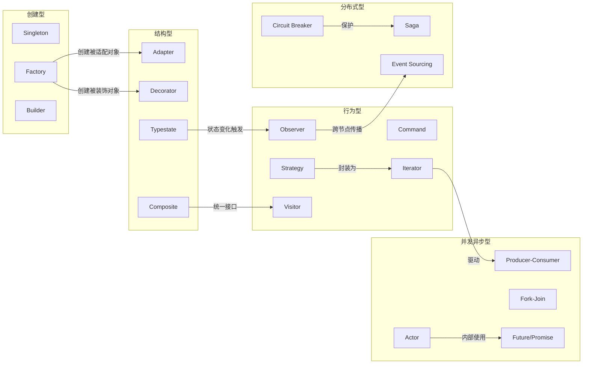
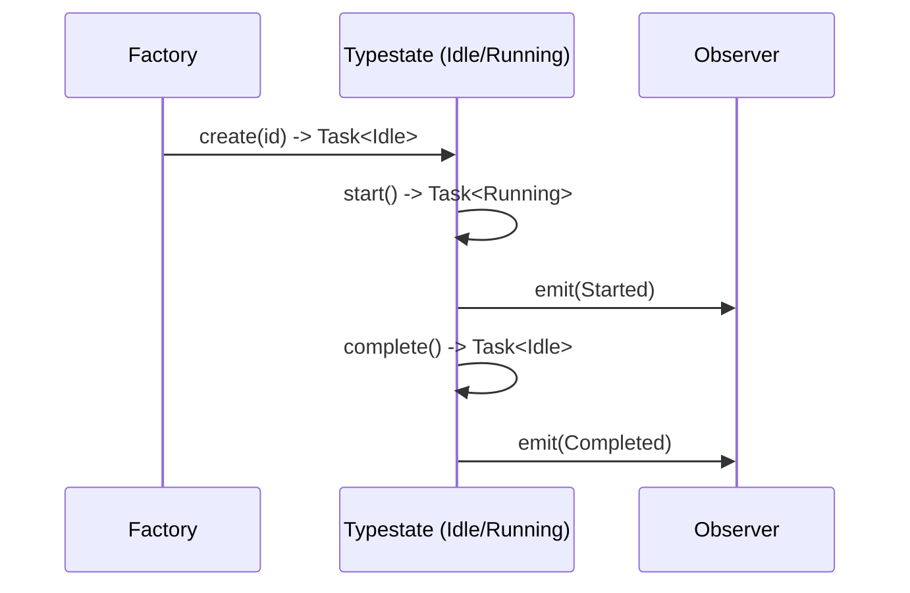
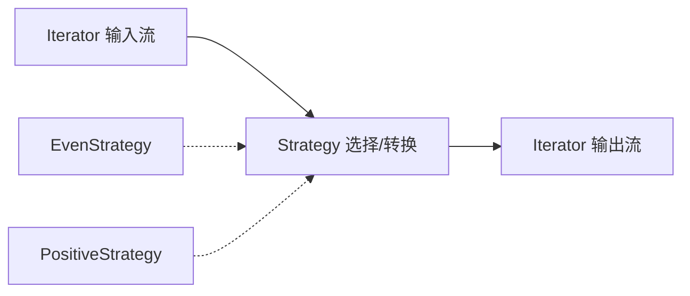
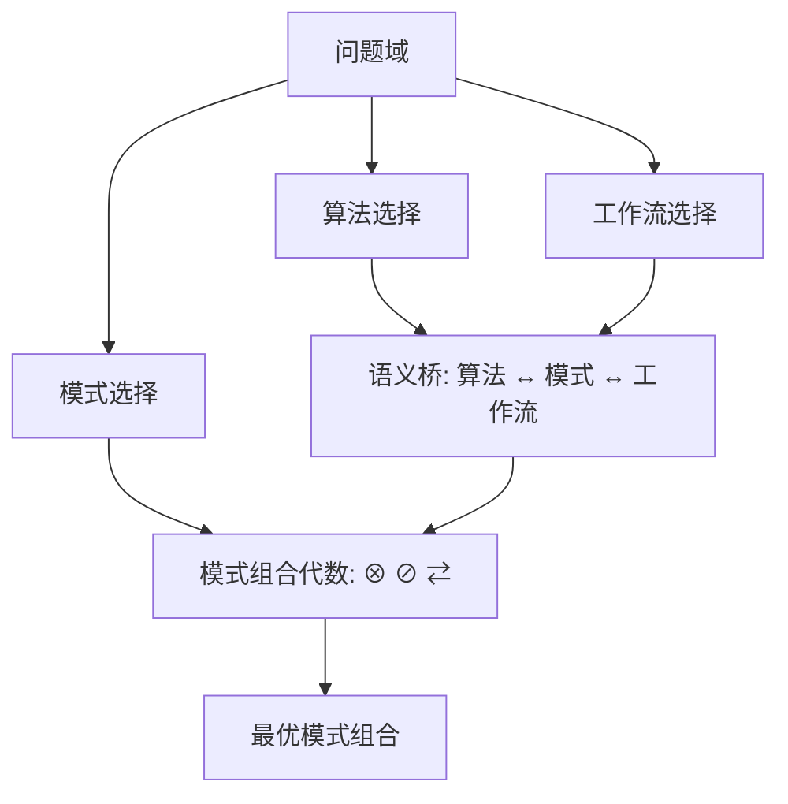

# 模式组合代数
>
> **EN**: Pattern Composition Algebra
> **Summary**: A formal framework for composing, conflicting, and selecting design patterns in Rust.
>
> **受众**: [进阶]
> **层级**: L6 生态系统
> **A/S/P 标记**: S+A
> **双维定位**: P×Ana
> **前置概念**: [Design Patterns](./02_patterns.md) · [Algorithm-Pattern Semantic Bridge](../00_meta/semantic_bridge_algorithms_patterns.md)
> **后置概念**: [Distributed Systems](./18_distributed_systems.md)
> **主要来源**: [GoF Design Patterns] · [POSA] · [Rust Design Patterns]
---

> **Bloom 层级**: 分析 → 评价 → 创造

## 📑 目录

- [模式组合代数](#模式组合代数)
  - [📑 目录](#-目录)
  - [一、核心命题](#一核心命题)
  - [二、模式分类坐标系](#二模式分类坐标系)
    - [2.1 六维分类框架](#21-六维分类框架)
    - [2.2 坐标系中的模式映射](#22-坐标系中的模式映射)
    - [2.3 坐标系关系网络](#23-坐标系关系网络)
  - [三、模式组合规则](#三模式组合规则)
    - [3.1 组合代数原语](#31-组合代数原语)
    - [3.2 Observer + Factory + Typestate 的复合语义](#32-observer--factory--typestate-的复合语义)
      - [语义定位](#语义定位)
      - [Rust 示例](#rust-示例)
      - [组合分析](#组合分析)
    - [3.3 Strategy + Iterator 的复合](#33-strategy--iterator-的复合)
      - [语义定位](#语义定位-1)
      - [Rust 示例](#rust-示例-1)
      - [组合分析](#组合分析-1)
    - [3.4 Adapter + Decorator 的复合](#34-adapter--decorator-的复合)
      - [语义定位](#语义定位-2)
      - [Rust 示例](#rust-示例-2)
      - [组合分析](#组合分析-2)
  - [四、模式冲突矩阵](#四模式冲突矩阵)
    - [4.1 冲突等级定义](#41-冲突等级定义)
    - [4.2 冲突矩阵](#42-冲突矩阵)
    - [4.3 冲突消解原则](#43-冲突消解原则)
  - [五、模式选择决策形式化](#五模式选择决策形式化)
    - [5.1 问题特征向量](#51-问题特征向量)
    - [5.2 决策函数](#52-决策函数)
    - [5.3 推荐模式组合表](#53-推荐模式组合表)
  - [六、与算法-模式语义桥的衔接](#六与算法-模式语义桥的衔接)
  - [七、反命题与边界](#七反命题与边界)
    - [7.1 反命题 1："模式组合越多越好"](#71-反命题-1模式组合越多越好)
    - [7.2 反命题 2："Singleton 在 Rust 中已被消除"](#72-反命题-2singleton-在-rust-中已被消除)
    - [7.3 反命题 3："Adapter + Decorator 可以任意顺序组合"](#73-反命题-3adapter--decorator-可以任意顺序组合)
    - [7.4 边界条件](#74-边界条件)
  - [八、来源与延伸阅读](#八来源与延伸阅读)

---

## 一、核心命题

> **设计模式不是孤立的代码模板，而是可以组合、冲突、替代的代数元素。**
>
> 真实系统中，模式总是以复合形式出现：
>
> - `Observer + Factory + Typestate` 共同构成响应式状态机；
> - `Strategy + Iterator` 将算法族嵌入惰性数据流；
> - `Adapter + Decorator` 在不修改原始接口的前提下扩展行为。
>
> 当前项目文档对单个模式有深入分析，但缺少一张统一的"模式地图"：
>
> - 模式按什么维度分类？
> - 哪些模式可以安全组合？
> - 哪些模式存在结构性冲突？
> - 给定问题特征，如何选择最优组合？
>
> 本文件建立一个**模式组合代数**（Pattern Composition Algebra），用 `⊗`（组合）、`⊘`（冲突）、`⇄`（替代）三种关系，显式刻画模式之间的结构化关联，并提供可执行的 Rust 语义解释。

---

## 二、模式分类坐标系

### 2.1 六维分类框架

按经典 GoF 分类扩展至并发、异步与分布式领域，建立六维坐标系：

| 维度 | 关注点 | 典型 Rust 机制 |
|:---|:---|:---|
| **创建型（Creational）** | 对象/资源的实例化方式 | `new()`、`Default`、`Builder`、`From`/`Into` |
| **结构型（Structural）** | 对象之间的组装与接口适配 | `trait`、`Deref`、`Newtype`、`Wrapper` |
| **行为型（Behavioral）** | 对象之间的职责分配与交互 | `trait` 多态、`enum` + `match`、闭包 |
| **并发型（Concurrency）** | 多线程下的安全协作 | `Mutex`、`Arc`、`Channel`、`RwLock` |
| **异步型（Async）** | 非阻塞任务调度与组合 | `Future`、`async/await`、`Stream`、`Select` |
| **分布式型（Distributed）** | 跨进程/跨节点的可靠协作 | 消息总线、Saga、Circuit Breaker、Event Sourcing |

### 2.2 坐标系中的模式映射

| 模式 | 创建 | 结构 | 行为 | 并发 | 异步 | 分布式 |
|:---|:---:|:---:|:---:|:---:|:---:|:---:|
| **Singleton** | ● | ○ | ○ | ○ | ○ | ○ |
| **Factory / Builder** | ● | ○ | ○ | ○ | ○ | ○ |
| **Adapter** | ○ | ● | ○ | ○ | ○ | ○ |
| **Decorator** | ○ | ● | ○ | ○ | ○ | ○ |
| **Composite** | ○ | ● | ○ | ○ | ○ | ○ |
| **Observer** | ○ | ○ | ● | ○ | ○ | ○ |
| **Strategy** | ○ | ○ | ● | ○ | ○ | ○ |
| **Command** | ○ | ○ | ● | ○ | ○ | ○ |
| **Iterator** | ○ | ○ | ● | ○ | ○ | ○ |
| **Visitor** | ○ | ○ | ● | ○ | ○ | ○ |
| **Typestate** | ○ | ● | ● | ○ | ○ | ○ |
| **Producer-Consumer** | ○ | ○ | ○ | ● | ○ | ○ |
| **Fork-Join** | ○ | ○ | ○ | ● | ○ | ○ |
| **Future / Promise** | ○ | ○ | ○ | ○ | ● | ○ |
| **Actor** | ○ | ○ | ● | ● | ● | ○ |
| **Circuit Breaker** | ○ | ○ | ○ | ○ | ○ | ● |
| **Saga** | ○ | ○ | ● | ○ | ○ | ● |
| **Event Sourcing** | ○ | ○ | ● | ○ | ○ | ● |

> 图例：`●` 为主维度，`○` 为可扩展维度。

### 2.3 坐标系关系网络



---

## 三、模式组合规则

### 3.1 组合代数原语

借鉴范畴论中态射复合的思想，定义三种基本操作：

```text
模式组合代数:
  ⊗ 组合 (Composition):  A ⊗ B = A 与 B 同时存在，职责正交，可安全叠加
  ⊘ 冲突 (Conflict):     A ⊘ B = A 与 B 在同一职责点竞争，通常只能二选一
  ⇄ 替代 (Substitution): A ⇄ B = A 与 B 解决同类问题，在不同约束下互换
```

**组合不变量**：

1. **数据不相交原则**：若 `A` 与 `B` 操作的数据集交集为空或只读共享，则 `A ⊗ B` 安全。
2. **层级分离原则**：结构型模式负责"是什么"，行为型模式负责"做什么"，二者天然可组合。
3. **生命周期兼容原则**：组合中各模式对资源生命周期的假设必须一致。

### 3.2 Observer + Factory + Typestate 的复合语义

#### 语义定位

| 模式 | 维度 | 职责 | 解决的问题 |
|:---|:---|:---|:---|
| **Observer** | 行为型 | 事件订阅与通知 | "状态变化如何被传播" |
| **Factory** | 创建型 | 根据配置创建对象 | "对象如何被实例化" |
| **Typestate** | 结构/行为型 | 编译期状态约束 | "哪些操作在哪些状态下合法" |

三者形成"创建 → 状态约束 → 事件响应"的复合链：

```text
Factory 创建对象 ──→ Typestate 约束合法状态 ──→ Observer 通知状态变化
```

#### Rust 示例

```rust
use std::marker::PhantomData;

// ===== Typestate 标签 =====
struct Idle;
struct Running;

struct Task<State> {
    id: u64,
    _marker: PhantomData<State>,
}

impl Task<Idle> {
    fn new(id: u64) -> Self {
        Self { id, _marker: PhantomData }
    }

    fn start(self) -> Task<Running> {
        println!("task {} started", self.id);
        Task { id: self.id, _marker: PhantomData }
    }
}

impl Task<Running> {
    fn complete(self) -> Task<Idle> {
        println!("task {} completed", self.id);
        Task { id: self.id, _marker: PhantomData }
    }
}

// ===== Observer =====
trait Observer<Event> {
    fn on_event(&self, event: &Event);
}

#[derive(Clone, Debug)]
struct TaskEvent { task_id: u64, kind: EventKind }

#[derive(Clone, Debug)]
enum EventKind { Started, Completed }

struct EventBus<Event> {
    observers: Vec<Box<dyn Observer<Event>>>,
}

impl<Event> EventBus<Event> {
    fn new() -> Self { Self { observers: Vec::new() } }
    fn subscribe(&mut self, observer: Box<dyn Observer<Event>>) {
        self.observers.push(observer);
    }
    fn emit(&self, event: Event) {
        for o in &self.observers { o.on_event(&event); }
    }
}

struct MetricsObserver;
impl Observer<TaskEvent> for MetricsObserver {
    fn on_event(&self, e: &TaskEvent) {
        println!("[metrics] {:?}", e);
    }
}

// ===== Factory =====
trait Factory<Config, Product> {
    fn create(&self, cfg: Config) -> Product;
}

struct TaskFactory;
impl Factory<u64, Task<Idle>> for TaskFactory {
    fn create(&self, id: u64) -> Task<Idle> {
        Task::new(id)
    }
}

fn main() {
    let mut bus = EventBus::new();
    bus.subscribe(Box::new(MetricsObserver));

    let factory = TaskFactory;
    let task = factory.create(1);

    let task = task.start();
    bus.emit(TaskEvent { task_id: 1, kind: EventKind::Started });

    let task = task.complete();
    bus.emit(TaskEvent { task_id: 1, kind: EventKind::Completed });

    // 编译期阻止：未启动的任务不能完成
    // let _ = Task::<Idle>::new(2).complete();
}
```

#### 组合分析

- `Observer ⊗ Factory`：职责正交，数据集不相交。
- `Typestate ⊗ Observer`：Typestate 保证状态转换合法，Observer 传播状态事件；二者通过事件副本（而非引用）避免生命周期冲突。
- 潜在 `⊘`：若 Observer 持有 `Task<Running>` 的引用，则 `complete(self)` 会触发借用冲突。解决方式是让 Observer 只接收不可变事件数据。



### 3.3 Strategy + Iterator 的复合

#### 语义定位

| 模式 | 维度 | 职责 |
|:---|:---|:---|
| **Strategy** | 行为型 | 封装可互换的算法族 |
| **Iterator** | 行为型 | 惰性、逐个访问集合元素 |

复合语义：将 Strategy 作为 Iterator 适配器链中的转换阶段，使算法选择发生在数据流处理过程中。

```text
Iterator 提供元素流 ──→ Strategy 提供处理算法 ──→ 输出结果流
```

#### Rust 示例

```rust
// ===== Strategy =====
trait FilterStrategy<T> {
    fn select(&self, item: &T) -> bool;
}

struct EvenStrategy;
impl FilterStrategy<i32> for EvenStrategy {
    fn select(&self, item: &i32) -> bool { item % 2 == 0 }
}

struct PositiveStrategy;
impl FilterStrategy<i32> for PositiveStrategy {
    fn select(&self, item: &i32) -> bool { *item > 0 }
}

// ===== Strategy + Iterator 复合 =====
struct StrategyIter<'a, T, S> {
    inner: Box<dyn Iterator<Item = T> + 'a>,
    strategy: S,
}

impl<'a, T, S> Iterator for StrategyIter<'a, T, S>
where
    S: FilterStrategy<T>,
{
    type Item = T;
    fn next(&mut self) -> Option<Self::Item> {
        self.inner.find(|item| self.strategy.select(item))
    }
}

fn main() {
    let data = vec![-3, -2, -1, 0, 1, 2, 3, 4];

    let iter: StrategyIter<'_, i32, EvenStrategy> = StrategyIter {
        inner: Box::new(data.into_iter()),
        strategy: EvenStrategy,
    };
    println!("even: {:?}", iter.collect::<Vec<_>>());

    // 更地道的 Rust：将 Strategy 作为闭包传入 Iterator 适配器
    let positive = PositiveStrategy;
    let result: Vec<i32> = (-5..=5)
        .filter(|x| positive.select(x))
        .collect();
    println!("positive: {:?}", result);
}
```

#### 组合分析

- `Strategy ⊗ Iterator` 属于行为型模式之间的**同层组合**：Iterator 负责"遍历"，Strategy 负责"筛选/处理"。
- Rust 中更地道的表达是 `Iterator::filter` 接受一个闭包；Strategy 将闭包提升为具名算法族。
- 当策略需要状态或配置时，Strategy 比纯闭包更具可维护性。



### 3.4 Adapter + Decorator 的复合

#### 语义定位

| 模式 | 维度 | 职责 |
|:---|:---|:---|
| **Adapter** | 结构型 | 将一个接口转换为客户端期望的另一个接口 |
| **Decorator** | 结构型 | 在不改变原接口的前提下，动态添加职责 |

复合语义：先通过 Adapter 统一异构接口，再通过 Decorator 在不破坏统一接口的前提下叠加横切关注点（如日志、缓存、权限检查）。

```text
异构实现 ──→ Adapter 统一接口 ──→ Decorator 增强行为 ──→ 客户端
```

#### Rust 示例

```rust
// ===== 目标接口 =====
trait DataSource {
    fn read(&self) -> String;
    fn write(&mut self, data: &str);
}

// ===== 被适配的遗留实现 =====
struct LegacyFileSystem;
impl LegacyFileSystem {
    fn fs_read(&self, path: &str) -> String {
        format!("content from {}", path)
    }
    fn fs_write(&mut self, path: &str, data: &str) {
        println!("wrote '{}' to {}", data, path);
    }
}

// ===== Adapter =====
struct FileSystemAdapter {
    fs: LegacyFileSystem,
    path: String,
}

impl DataSource for FileSystemAdapter {
    fn read(&self) -> String {
        self.fs.fs_read(&self.path)
    }
    fn write(&mut self, data: &str) {
        self.fs.fs_write(&self.path, data);
    }
}

// ===== Decorator =====
struct LoggingDecorator<D> {
    inner: D,
}

impl<D: DataSource> DataSource for LoggingDecorator<D> {
    fn read(&self) -> String {
        println!("[LOG] read start");
        let result = self.inner.read();
        println!("[LOG] read end");
        result
    }

    fn write(&mut self, data: &str) {
        println!("[LOG] write start");
        self.inner.write(data);
        println!("[LOG] write end");
    }
}

fn main() {
    let adapter = FileSystemAdapter {
        fs: LegacyFileSystem,
        path: "/tmp/data.txt".to_string(),
    };

    let mut decorated = LoggingDecorator { inner: adapter };
    println!("{}", decorated.read());
    decorated.write("hello");
}
```

#### 组合分析

- `Adapter ⊗ Decorator` 是结构型模式之间的**同层组合**：Adapter 解决"接口不匹配"，Decorator 解决"职责扩展"。
- 二者都通过包装（Wrapper）实现，因此复合时包装顺序至关重要：通常先 Adapter 后 Decorator。
- 若顺序颠倒，Decorator 可能增强的是不兼容的接口，导致客户端无法使用。


---

## 四、模式冲突矩阵

### 4.1 冲突等级定义

| 等级 | 符号 | 含义 |
|:---|:---:|:---|
| **强冲突** | `⊘⊘` | 不能同时使用，必须二选一 |
| **弱冲突** | `⊘` | 可以共存，但需要显式协调 |
| **替代** | `⇄` | 解决同类问题，根据约束互换 |
| **兼容** | `⊗` | 可安全组合 |

### 4.2 冲突矩阵

| 模式 A | 模式 B | 关系 | 冲突点 | 裁决建议 |
|:---|:---|:---:|:---|:---|
| **Singleton** | **依赖注入** | ⊘⊘ | 依赖获取方式：全局隐式 vs 显式参数 | 优先依赖注入；Singleton 仅用于进程级唯一且无状态资源 |
| **继承（Inheritance）** | **组合（Composition）** | ⇄ | 代码复用机制：is-a vs has-a | Rust 优先组合；用 trait 实现共享行为 |
| **Mutex** | **Lock-free** | ⇄ | 性能与可预测性权衡 | 低竞争用 Lock-free，高竞争或需可组合性用 Mutex |
| **Observer** | **Singleton 被观察者** | ⊘ | 全局被观察者难以测试与替换 | 被观察者应为普通对象，通过注入传递 |
| **Adapter** | **Decorator 顺序错误** | ⊘ | 包装顺序导致接口不匹配 | 先 Adapter 统一接口，再 Decorator 增强 |
| **强一致性 2PC** | **最终一致性 Saga** | ⇄ | 可用性与一致性的 CAP 权衡 | 跨服务长事务用 Saga；短事务强一致用 2PC |
| **Callback** | **Future/Async** | ⇄ | 异步组合方式 | 需要取消、超时、组合时用 Future/Async |
| **Typestate 爆炸** | **运行时状态机** | ⇄ | 状态数量与维护成本 | 状态 > 10 时退回到 `enum` + `match` |
| **Visitor** | **enum + match 频繁新增变体** | ⇄ | 开放操作 vs 开放变体 | 操作多变用 Visitor；变体多变用 enum |
| **全局可变状态** | **并发安全** | ⊘⊘ | 数据竞争与死锁风险 | 消除全局可变状态，或用 `Mutex` + 严格作用域 |

### 4.3 冲突消解原则

1. **显式化原则**：冲突源于隐藏假设，通过显式接口、参数、类型约束暴露假设。
2. **最小权限原则**：模式使用的范围越小，冲突概率越低。
3. **分层原则**：将冲突模式放在不同抽象层，例如业务层用 Observer，基础设施层用 Singleton 缓存。
4. **测试驱动原则**：冲突往往在测试阶段暴露，优先选择可测试性高的方案。

---

## 五、模式选择决策形式化

### 5.1 问题特征向量

将设计问题抽象为一个特征向量：

```text
P = (p1, p2, p3, p4, p5, p6)

p1: 是否需要对象创建控制？        {0, 1}
p2: 是否需要接口适配或扩展？      {0, 1}
p3: 是否需要运行时行为切换？      {0, 1}
p4: 是否需要状态安全保证？        {0, 1}
p5: 是否需要跨线程/异步协作？      {0, 1}
p6: 是否需要跨进程/节点可靠性？    {0, 1}
```

### 5.2 决策函数

```text
select(P) = argmax_{组合 C} 适配度(C, P) - 复杂度(C)

适配度(C, P) = Σ 维度匹配度(C_i, P_i)
复杂度(C)    = 模式中元素数量 + 交互边数量
```

### 5.3 推荐模式组合表

| 问题特征 `P` | 关键约束 | 推荐组合 | 关系 | 不推荐 |
|:---|:---|:---|:---:|:---|
| `(1,0,0,0,0,0)` 创建复杂对象 | 必填字段多、构造步骤多 | **Builder** | — | 长参数列表 |
| `(0,1,0,0,0,0)` 接口不兼容 | 不修改旧代码 | **Adapter** | — | 复制粘贴修改 |
| `(0,0,1,0,0,0)` 算法可替换 | 运行时切换 | **Strategy** | — | 大量 `if/else` |
| `(0,0,0,1,0,0)` 状态转换安全 | 编译期验证 | **Typestate** | — | 运行时断言 |
| `(1,0,1,1,0,0)` 状态机 + 事件 + 创建 | 状态安全 + 通知 | **Observer + Factory + Typestate** | ⊗ | Singleton + 裸回调 |
| `(0,0,1,0,1,0)` 异步数据流 | 惰性、可组合 | **Strategy + Iterator/Stream** | ⊗ | 回调嵌套 |
| `(0,1,0,0,1,0)` 异步接口适配 | 非阻塞包装 | **Adapter + Future** | ⊗ | 阻塞调用 |
| `(0,1,0,0,0,1)` 分布式协议适配 | 协议转换 + 增强 | **Adapter + Decorator + Circuit Breaker** | ⊗ | 直接暴露原始客户端 |
| `(0,0,0,0,0,1)` 分布式长事务 | 最终一致 | **Saga + Event Sourcing** | ⊗ | 2PC |
| `(0,0,0,0,1,1)` 跨服务调用保护 | 失败隔离 | **Circuit Breaker + Retry + Timeout** | ⊗ | 无限重试 |

---

## 六、与算法-模式语义桥的衔接

本文件与 `concept/00_meta/semantic_bridge_algorithms_patterns.md` 形成上下位关系：

| 文件 | 层级 | 关注点 |
|:---|:---|:---|
| `semantic_bridge_algorithms_patterns.md` | L0 元信息 | 算法、设计模式、工作流模式之间的**语义同构** |
| `99_pattern_composition_algebra.md` | L6 生态系统 | 设计模式之间的**组合、冲突、替代关系** |

**衔接点**：

1. **同构到代数的映射**：语义桥揭示"分治算法 ↔ Composite + Strategy"的同构；本文件进一步说明 Composite 与 Strategy 如何组合（`⊗`），以及何时可用 Iterator/Visitor 替代。
2. **决策形式化**：语义桥提供"问题 → 算法/模式"的映射；本文件提供"问题特征 → 最优模式组合"的决策函数。
3. **冲突检测**：语义桥强调跨域统一；本文件强调同一域内模式的约束协调。



---

## 七、反命题与边界

### 7.1 反命题 1："模式组合越多越好"

**错误**。每增加一个模式都会引入概念复杂度。当组合中模式超过 3 个且没有清晰分层时，认知负荷会指数上升。应遵循**最小模式集原则**：先用 Rust 类型系统解决问题，再用模式补充。

### 7.2 反命题 2："Singleton 在 Rust 中已被消除"

**错误**。Rust 仍可通过 `OnceLock` / `lazy_static` 实现进程级单例。区别是所有权模型使可变单例变得困难，迫使开发者显式处理并发安全。Singleton 从"默认方案"变为"需要显式辩护的方案"。

### 7.3 反命题 3："Adapter + Decorator 可以任意顺序组合"

**错误**。顺序至关重要。通常应先 Adapter 统一接口，再 Decorator 增强行为。若先 Decorator 后 Adapter，可能增强的是不兼容接口，导致客户端无法使用。

### 7.4 边界条件

- **Typestate 状态爆炸**：状态数 > 10 时，转换表难以维护，应退回到运行时状态机。
- **Observer 生命周期**：Observer 持有被观察者引用会导致循环引用；应使用事件副本或 `Weak` 引用。
- **DI 参数膨胀**：依赖链路过长时，可结合 Builder 或 Provider 模式分层。

---

## 八、来源与延伸阅读

- [GoF — Design Patterns: Elements of Reusable Object-Oriented Software](https://en.wikipedia.org/wiki/Design_Patterns)
- [POSA — Pattern-Oriented Software Architecture](https://en.wikipedia.org/wiki/Pattern-Oriented_Software_Architecture)
- [Rust Design Patterns](https://rust-unofficial.github.io/patterns/)
- [Rust API Guidelines](https://rust-lang.github.io/api-guidelines/)
- [Category Theory for Programmers — Bartosz Milewski](https://bartoszmilewski.com/2014/10/28/category-theory-for-programmers-the-preface/)
- [Workflow Patterns — van der Aalst](https://www.workflowpatterns.com/)

---

> **文档版本**: 1.0
> **对应 Rust 版本**: 1.96.0+ (Edition 2024)
> **最后更新**: 2026-06-27
> **状态**: ✅ 模式组合代数框架完成
