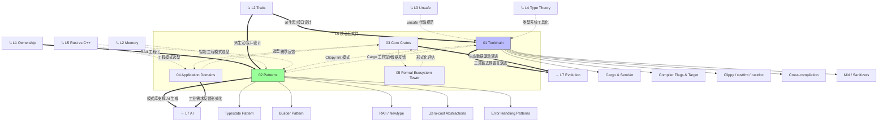

# L6 生态工程层（Ecosystem & Engineering）

> **定位**：Rust 的工程实践、工具链、设计模式和生态协作机制。本层是 L1-L5 知识的**工程化落地**，将理论转化为可维护、可扩展的代码库。
> **Bloom 层级**: 应用 + 评价
> **功能**: 将概念知识转化为**工程能力**

---

## 一、本层概念关系图（完整版）



### 1.1 概念间语义链接

| 关系 | 从 | 到 | 语义类型 | 说明 |
|:---|:---|:---|:---|:---|
| 1 | **L1 Ownership** | **Patterns** | `==>` 工程化 | RAII 是 L1 所有权概念在工程中的**直接模式化**。每个 Rust 设计模式都是对所有权规则的特定应用。 |
| 2 | **L2 Traits** | **Toolchain + Patterns** | `==>` 支撑 | `derive` 宏（工具链）和 Typestate 模式（设计模式）都依赖 Trait 系统。 |
| 3 | **L4 Type Theory** | **Toolchain** | `-.->` 工具化 | 类型约束求解算法是 `rustc` 编译器的核心，类型论直接转化为工程工具。 |
| 4 | **Patterns** | **L7 AI** | `==>` 驱动 | 设计模式库为 AI 代码生成提供**结构化模板**。 |

---

## 二、文件索引与关系

| 文件 | 概念 | 核心内容 | 状态 | 依赖的 L1-L5 | 工程输出 |
|:---|:---|:---|:---|:---|:---|
| [01_toolchain.md](./01_toolchain.md) | 工具链 | Cargo、SemVer、Clippy、交叉编译、Miri | ✅ v1.0 | L4 类型论(编译器)、L3 Unsafe(Miri) | 可复现构建、质量门禁 |
| [02_patterns.md](./02_patterns.md) | 设计模式 | Typestate、Builder、Newtype、RAII、Zero-cost | ✅ v1.0 | L1 Ownership、L2 Trait、L5 对比 | 可维护代码结构 |
| [03_core_crates.md](./03_core_crates.md) | 核心库谱系 | serde、tokio、axum、clap、tracing、sqlx 等 40+ crate | ✅ v1.0 | L1-L5 全部概念 | 工程选型决策 |
| [04_application_domains.md](./04_application_domains.md) | 应用主题 | Web、CLI、嵌入式、游戏、区块链、数据工程、系统、GUI | ✅ v1.0 | L1-L5 全部概念 + 核心 crate | 领域工程落地 |
| [05_formal_ecosystem_tower.md](./05_formal_ecosystem_tower.md) | 形式化生态塔 | 核心 crate 的形式化根基/可组合性/可观测性三维评估；L0-L4 形式化分层 | ✅ v1.0 | L4 类型论、L3 Async/Unsafe | 形式化选型决策 |

---

## 三、L1-L5 → L6 的工程映射

| L1-L5 概念 | L6 工程实践 | 映射说明 |
|:---|:---|:---|
| 所有权 + Drop | RAII 模式 | 资源管理自动化 |
| 借用规则 | Clippy lint (e.g., `needless_borrow`) | 编译期最佳实践检查 |
| Trait | `derive` 宏、接口设计 | 代码生成 + 模块化 |
| 泛型 | 零成本抽象模式 | 库设计中的性能保证 |
| Send/Sync | `crossbeam`、`rayon` 设计 | 并发库的安全封装 |
| async/await | `tokio`、`axum` 异步生态 | Web 后端与网络服务 |
| unsafe | Miri 动态检测、审计规范 | 安全关键代码验证 |
| 形式化方法 | Kani 集成测试、契约注释 | 工业级验证流程 |
| 对比分析 | 技术选型决策矩阵 | 架构设计文档 |
| 生命周期 | `sqlx` 编译期查询检查 | 数据库类型安全 |
| 过程宏 | `serde`、`clap` derive | 声明式代码生成 |
| Pin | `tokio` 自引用任务 | 异步状态机安全 |
| 范畴论/态射 | `Tower` Service Trait 复合 | 架构组合层的代数结构 |
| 同态/结构保持 | `Serde`/`SQLx`/`Prost` | 数据层的类型安全转换 |

---

## 四、认知路径

```text
直觉困惑                    具体场景                  模式抽象               形式规则              代码验证              边界测试
    │                         │                       │                     │                    │                    │
    ▼                         ▼                       ▼                     ▼                    ▼                    ▼
"怎么组织大型                 "多个 crate             "Cargo workspace       "语义版本控制        "CI 构建 +            "跨平台
 Rust 项目？"                怎么协作？"              = 模块化构建"          (SemVer)"            测试矩阵"            兼容性"

"怎么写可维护                 "状态转换容易            "Typestate =           "编译期状态机        "编译错误阻止         "过度设计
 的 Rust 代码？"             出 bug"                  编译期验证"            (PhantomData)"       非法状态转换"        权衡"

"怎么保证 unsafe              "FFI 代码怎么            "Safety Contract       "形式化契约          "Miri +              "审计覆盖
 代码安全？"                 测试？"                  + Miri 检测"           注释"                模糊测试"            完整性"
```

---

## 五、跨层出口

L6 的工程实践输出到：

- **L7 前沿**: AI 代码生成的模板库、形式化方法的 CI 集成
- **实践**: 团队编码规范、代码审查清单、项目脚手架
