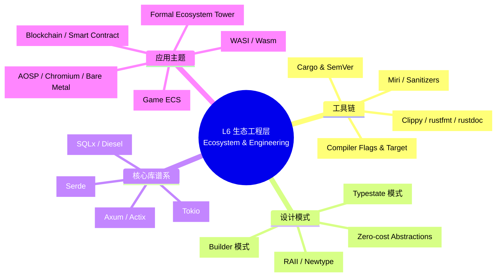

# L6 生态工程层（Ecosystem & Engineering）
>
> **EN**: Readme
> **Summary**: Ecosystem guide: toolchain, crates, patterns, and production practices.
> **来源**: [TRPL](https://doc.rust-lang.org/book/title-page.html) · [Cargo Book](https://doc.rust-lang.org/cargo/) · [Rust RFCs](https://rust-lang.github.io/rfcs/) · [crates.io](https://crates.io/)
> **内容分级**: [综述级]
> **受众**: [进阶]
> **定位**：Rust 的工程实践、工具链、设计模式和生态协作机制。本层是 L1-L5 知识的**工程化落地**，将理论转化为可维护、可扩展的代码库。
> **Bloom 层级**: 应用 + 评价
> **功能**: 将概念知识转化为**工程能力**
> **来源: [The Cargo Book](https://doc.rust-lang.org/cargo/)** · **来源: [crates.io](https://crates.io/)** · **来源: [Rust RFCs](https://github.com/rust-lang/rfcs)** · **来源: [The Rust Programming Language](https://doc.rust-lang.org/book/title-page.html)**
> **定理链**: N/A — 描述性/综述性/导航性文档，不涉及形式化定理链
> **前置概念**: N/A
> **后置概念**: N/A
---

## 📑 目录

- [L6 生态工程层（Ecosystem \& Engineering）](#l6-生态工程层ecosystem--engineering)
  - [📑 目录](#-目录)
    - [〇、L6 认知入口](#〇l6-认知入口)
  - [一、本层概念关系图（完整版）](#一本层概念关系图完整版)
    - [1.1 概念间语义链接](#11-概念间语义链接)
  - [二、文件索引与关系](#二文件索引与关系)
    - [补充文件索引](#补充文件索引)
  - [三、L1-L5 → L6 的工程映射](#三l1-l5--l6-的工程映射)
  - [四、认知路径](#四认知路径)
  - [五、跨层出口](#五跨层出口)
  - [嵌入式测验（Embedded Quiz）](#嵌入式测验embedded-quiz)
    - [测验 1：《L6 生态工程层（Ecosystem \& Engineering）》在本知识体系中扮演什么角色？（理解层）](#测验-1l6-生态工程层ecosystem--engineering在本知识体系中扮演什么角色理解层)
    - [测验 2：使用本索引文件时，最有效的学习策略是什么？（理解层）](#测验-2使用本索引文件时最有效的学习策略是什么理解层)
    - [测验 3：索引文档能否替代具体概念文件的学习？（理解层）](#测验-3索引文档能否替代具体概念文件的学习理解层)

### 〇、L6 认知入口


> **认知功能**: 建立 L6 全景认知框架，按"工具链→设计模式→核心库→应用主题"四层递进组织工程知识。建议作为学习入口，快速定位目标领域后再深入各文件。关键洞察：每个分支都是 L1-L5 理论的可执行映射，而非独立知识集合。[来源: 💡 原创分析]
> **认知路径**: 本 mindmap 展示 L6 层的**工程化落地**。工具链将 L4 类型论转化为编译器实践，设计模式将 L1 所有权（Ownership）规则模式化，核心库谱系是生态的"基础设施"，应用主题展示 Rust 在特定领域的工程形态。L6 是知识体系的"出口"——将理论转化为可维护、可扩展的代码库。

## 一、本层概念关系图（完整版）

```mermaid
graph TB
    subgraph L6_Core["L6 核心八文件"]
        TOOL[01 Toolchain]
        PAT[02 Patterns]
        CRATES[03 Core Crates]
        APP[04 Application Domains]
        FORMAL[05 Formal Ecosystem Tower]
        BC[06 Blockchain]
        GAME[07 Game ECS]
        WASI[08 WASI]
    end

    %% L1-L5 输入
    L1_O[↳ L1 Ownership] ==>|"RAII 工程化"| PAT
    L2_TR[↳ L2 Traits] ==>|"派生宏/接口设计"| TOOL & PAT
    L2_MM[↳ L2 Memory] -.->|"智能指针选择"| PAT
    L3_UN[↳ L3 Unsafe] -.->|"unsafe 代码规范"| TOOL
    L4_TT[↳ L4 Type Theory] -.->|"类型系统工具化"| TOOL
    L5_CP[↳ L5 Rust vs C++] -.->|"工程模式选型"| PAT & APP

    %% 内部
    TOOL -.->|"Clippy lint 模式"| PAT
    PAT -.->|"Cargo 工作空间"| TOOL
    CRATES -.->|"选型支撑"| APP
    APP -.->|"需求反馈"| CRATES
    FORMAL -.->|"形式化评估"| CRATES
    CRATES -.->|"数据反馈"| FORMAL

    %% L7 输出
    TOOL ==>|"工具链支撑语言演进"| L7_EV[→ L7 Evolution]
    PAT ==>|"模式库支撑 AI 生成"| L7_AI[→ L7 AI]
    CRATES ==>|"生态数据驱动演进"| L7_EV
    APP ==>|"工业需求反馈形式化"| L7_AI

    %% 内部结构
    TOOL --> TOOL1[Cargo & SemVer]
    TOOL --> TOOL2[Compiler Flags & Target]
    TOOL --> TOOL3[Clippy / rustfmt / rustdoc]
    TOOL --> TOOL4[Cross-compilation]
    TOOL --> TOOL5[Miri / Sanitizers]

    PAT --> PAT1[Typestate Pattern]
    PAT --> PAT2[Builder Pattern]
    PAT --> PAT3[RAII / Newtype]
    PAT --> PAT4[Zero-cost Abstractions]
    PAT --> PAT5[Error Handling Patterns]

    style TOOL fill:#bbf,stroke:#333
    style PAT fill:#9f9,stroke:#333
```


> **认知功能**: 可视化 L1-L5 → L6 → L7 的完整知识流，实线表示强工程依赖，虚线表示弱反馈关联。用于理解各文件如何承接上层理论并输出工程价值。关键洞察：L6 是双向枢纽——既将理论转化为工程能力，也向 L7 输出结构化模板驱动演进。[来源: 💡 原创分析]

### 1.1 概念间语义链接

| 关系 | 从 | 到 | 语义类型 | 说明 |
|:---|:---|:---|:---|:---|
| 1 | **L1 Ownership** | **Patterns** | `==>` 工程化 | RAII 是 L1 所有权概念在工程中的**直接模式化**。每个 Rust 设计模式都是对所有权规则的特定应用。 |
| 2 | **L2 Traits** | **Toolchain + Patterns** | `==>` 支撑 | `derive` 宏（Macro）（工具链）和 Typestate 模式（设计模式）都依赖 Trait 系统。 |
| 3 | **L4 Type Theory** | **Toolchain** | `-.->` 工具化 | 类型约束求解算法是 `rustc` 编译器的核心，类型论直接转化为工程工具。 |
| 4 | **Patterns** | **L7 AI** | `==>` 驱动 | 设计模式库为 AI 代码生成提供**结构化模板**。 |

---

## 二、文件索引与关系

| 文件 | 概念 | 核心内容 | 状态 | 依赖的 L1-L5 | 工程输出 |
|:---|:---|:---|:---|:---|:---|
| [01_toolchain.md](01_toolchain.md) | 工具链 | Cargo、SemVer、Clippy、交叉编译、Miri | ✅ v1.0 | L4 类型论(编译器)、L3 Unsafe(Miri) | 可复现构建、质量门禁 |
| [02_patterns.md](02_patterns.md) | 设计模式 | Typestate、Builder、Newtype、RAII、Zero-cost | ✅ v1.0 | L1 Ownership、L2 Trait、L5 对比 | 可维护代码结构 |
| [03_core_crates.md](03_core_crates.md) | 核心库谱系 | serde、tokio、axum、clap、tracing、sqlx 等 40+ crate | ✅ v1.0 | L1-L5 全部概念 | 工程选型决策 |
| [04_application_domains.md](04_application_domains.md) | 应用主题 | Web、CLI、嵌入式、游戏、区块链、数据工程、系统、GUI | ✅ v1.0 | L1-L5 全部概念 + 核心 crate | 领域工程落地 |
| [05_formal_ecosystem_tower.md](05_formal_ecosystem_tower.md) | 形式化生态塔 | 核心 crate 的形式化根基/可组合性/可观测性三维评估；L0-L4 形式化分层 | ✅ v1.0 | L4 类型论、L3 Async/Unsafe | 形式化选型决策 |
| [06_blockchain.md](06_blockchain.md) | 区块链合约安全 | Solana/Substrate/Near、合约安全形式化、Kani 验证、无重入/溢出 | ✅ v1.0 | L1 Ownership、L3 Unsafe、L4 RustBelt | 链上安全保证 |
| [07_game_ecs.md](07_game_ecs.md) | 游戏 ECS 架构 | Bevy/Fyrox、ECS 与所有权协同、DOD、并发渲染 | ✅ v1.0 | L1 Ownership、L3 Concurrency | 游戏引擎选型 |
| [08_wasi.md](08_wasi.md) | WASI 与 Wasm | Component Model、wit-bindgen、能力安全、`wasm32-wasip1` 或 `wasm32-wasip2` | ✅ v1.0 | L1 Ownership、L3 FFI | 跨平台沙箱部署 |
| [11_webassembly.md](11_webassembly.md) | WebAssembly | Rust 的 Wasm 编译模型、组件模型、应用场景 | ✅ v1.0 | L1 Type System, L3 FFI | 跨平台部署 |
| [13_logging_observability.md](13_logging_observability.md) | 日志与可观测性 | tracing、log、metrics、OpenTelemetry、分布式追踪 | ✅ v1.0 | L3 Async, L2 Error | 监控与诊断 |
| [14_documentation.md](14_documentation.md) | 文档生态 | rustdoc、文档测试、API 规范、mdBook、docs.rs | ✅ v1.0 | L3 Macros, L2 Module | 知识传播 |
| [15_performance_optimization.md](15_performance_optimization.md) | 性能优化 | Criterion、flamegraph、缓存优化、SIMD、PGO | ✅ v1.0 | L1 Zero Cost, L1 Ownership | Concurrency, Async |
| [16_testing.md](16_testing.md) | 测试生态 | 单元/集成/文档测试、mockall、proptest、cargo-fuzz | ✅ v1.0 | L2 Error, L3 Macros | Formal Methods, Miri |
| [17_cross_compilation.md](17_cross_compilation.md) | 交叉编译 | 多目标平台、条件编译、no_std、嵌入式、Tier 系统 | ✅ v1.0 | L1 Type System, L3 Unsafe | WASI, WebAssembly |
| [18_distributed_systems.md](18_distributed_systems.md) | 分布式系统 | gRPC、Raft、Actor、服务发现、微服务 | ✅ v1.0 | L3 Async, L4 Network | Observability, Wasm |
| [31_microservice_patterns.md](31_microservice_patterns.md) | 微服务架构模式 | 服务发现、熔断、Saga、API Gateway、配置中心 | ✅ v1.0 | L3 Async, L4 Network | CQRS, 事件驱动 |
| [32_event_driven_architecture.md](32_event_driven_architecture.md) | 事件驱动架构 | 发布-订阅、消息队列、Reactive Streams、幂等处理 | ✅ v1.0 | L3 Async, L2 Trait | CQRS, 分布式系统 |
| [33_cqrs_event_sourcing.md](33_cqrs_event_sourcing.md) | CQRS & 事件溯源 | 命令查询分离、事件溯源、Saga 编排、Outbox 模式 | ✅ v1.0 | L3 Async, L2 Trait | 微服务, 事件驱动 |
| [40_reactive_programming.md](40_reactive_programming.md) | 响应式编程与 FRP | Reactive Streams、背压、FRP Signal/Event、数据流编程 | ✅ v1.0 | L3 Async, L2 Trait | 事件驱动, 流处理 |
| [35_architecture_patterns.md](35_architecture_patterns.md) | 架构设计模式 | 分层/六边形/洋葱/整洁架构、Serverless/FaaS | ✅ v1.0 | L2 Trait, L1 Lifetime | 微服务, CQRS |
| [41_workflow_theory.md](41_workflow_theory.md) | 工作流理论与形式化 | WfMC、Petri 网、π 演算、CTL/LTL、Rust async 同构 | ✅ v1.0 | L3 Async, L4 Formal | 分布式系统, 事件溯源 |
| [42_api_design_patterns.md](42_api_design_patterns.md) | API 设计模式 | REST/GraphQL/gRPC、OpenAPI、版本化、API 网关 | ✅ v1.0 | L3 Async, L2 Trait | 微服务, 事件驱动 |
| [43_security_cryptography.md](43_security_cryptography.md) | 安全与密码学 | AES-GCM/ChaCha20、Ed25519、Argon2、ring/rustls、后量子 | ✅ v1.0 | L3 Unsafe, L2 Trait | 区块链, 网络协议 |
| [45_compiler_internals.md](45_compiler_internals.md) | 编译器内部原理 | rustc 管线、HIR/MIR、类型系统（Type System）、NLL/Polonius、LLVM | ✅ v1.0 | L3 Unsafe, L4 Formal | 类型系统, 宏（Macro）系统 |
| 35_pattern_composition_algebra.md | 模式组合代数 | 设计模式的形式化组合、冲突检测、Rust 所有权（Ownership）约束 | ✅ v1.0 | L2 Trait, L3 Concurrency | Software Architecture |
| [36_stream_processing_ecosystem.md](36_stream_processing_ecosystem.md) | 流处理生态 | timely/differential dataflow、Materialize、RisingWave、Fluvio | ✅ v1.0 | L3 Stream Processing | Distributed Systems |
| [37_database_systems.md](37_database_systems.md) | 数据库系统 | TiKV/Percolator、Materialize、Meilisearch、SurrealDB | ✅ v1.0 | L3 Concurrency | Stream Processing |
| [38_network_protocols.md](38_network_protocols.md) | 网络协议 | QUIC/HTTP-3、quinn、h3、eBPF/aya | ✅ v1.0 | L3 Async | OS Kernel |
| [39_os_kernel.md](39_os_kernel.md) | 操作系统 | Rust for Linux、Theseus、Redox、eBPF | ✅ v1.0 | L3 Unsafe | Network Protocols |

---

### 补充文件索引

- [Rust 惯用法谱系全景（Idioms Spectrum）](03_idioms_spectrum.md)
- [Rust 系统设计原则与国际权威对齐](05_system_design_principles.md)
- [Cargo Script：单文件 Rust 程序](09_cargo_script.md)
- [Public/Private Dependencies：可见性控制的工程化](10_public_private_deps.md)
- [Rust 测试策略：从单元测试到属性验证](12_testing_strategies.md)
- [安全 实践：Rust 代码的防御性编程](19_security_practices.md)
- [许可证与合规：Rust 项目的法律工程](20_licensing_and_compliance.md)
- [Rust 游戏开发生态](21_game_development.md)
- [Rust 嵌入式系统开发](22_embedded_systems.md)
- [Rust 数据库访问生态](23_database_access.md)
- [Rust 云原生生态](24_cloud_native.md)
- [Rust CLI 开发生态](25_cli_development.md)
- [Rust 游戏开发](26_game_development.md)
- [Rust Web 框架对比与选型](27_web_frameworks.md)
- [DevOps 与 CI/CD：Rust 的持续交付工程实践](28_devops_and_ci_cd.md)
- [算法与竞赛编程 (Algorithms & Competitive Programming)](29_algorithms_competitive_programming.md)
- [系统可组合性 (System Composability)](30_system_composability.md)
- [测验：Rust 工具链（嵌入式互动试点）](57_quiz_toolchain.md)
- [Machine Learning Ecosystem（机器学习生态）](46_machine_learning_ecosystem.md)
- [Rust 编译器基础设施深度解析](47_compiler_infrastructure.md)
- [Formal Verification Tools（形式化验证工具生态）](47_formal_verification_tools.md)
- [Data Engineering（数据工程）](48_data_engineering.md)
- [Rust 平台集成：AOSP、Chromium 与 Bare Metal](58_platform_rust_integration.md)
- [Rust 工业级案例研究](48_industrial_case_studies.md)
- [Game Engine Internals（游戏引擎内部原理）](49_game_engine_internals.md)
- [Distributed Consensus（分布式共识）](50_distributed_consensus.md)
- [Quantum Computing in Rust（量子计算与 Rust）](51_quantum_computing_rust.md)
- [Robotics & ROS2 in Rust（机器人学与 ROS2 Rust 生态）](52_robotics.md)
- [Rust 嵌入式图形系统开发](53_embedded_graphics.md)
- [Advanced WebAssembly in Rust（高级 WebAssembly 与 Rust）](54_webassembly_advanced.md)
- [Rust for Data Science（Rust 数据科学）](55_rust_for_data_science.md)
- [C-to-Rust Translation Ecosystem（C 到 Rust 翻译生态）](56_c_to_rust_translation.md)

## 三、L1-L5 → L6 的工程映射

| L1-L5 概念 | L6 工程实践 | 映射说明 |
|:---|:---|:---|
| 所有权（Ownership） + Drop | RAII 模式 | 资源管理自动化 |
| 借用（Borrowing）规则 | Clippy lint (e.g., `needless_borrow`) | 编译期最佳实践检查 |
| Trait | `derive` 宏（Macro）、接口设计 | 代码生成 + 模块（Module）化 |
| 泛型（Generics） | 零成本抽象（Zero-Cost Abstraction）模式 | 库设计中的性能保证 |
| Send/Sync | `crossbeam`、`rayon` 设计 | 并发库的安全封装 |
| async/await | `tokio`、`axum` 异步生态 | Web 后端与网络服务 |
| unsafe | Miri 动态检测、审计规范 | 安全关键代码验证 |
| 形式化方法 | Kani 集成测试、契约注释 | 工业级验证流程 |
| 对比分析 | 技术选型决策矩阵 | 架构设计文档 |
| 生命周期（Lifetimes） | `sqlx` 编译期查询检查 | 数据库类型安全 |
| 过程宏（Procedural Macro） | `serde`、`clap` derive | 声明式代码生成 |
| Pin | `tokio` 自引用（Reference）任务 | 异步（Async）状态机安全 |
| 范畴论/态射 | `Tower` Service Trait 复合 | 架构组合层的代数结构 |
| 同态/结构保持 | `Serde`/`SQLx`/`Prost` | 数据层的类型安全转换 |

---

## 四、认知路径

```text
直觉困惑                    具体场景                  模式抽象               形式规则              代码验证              边界测试
    │                         │                       │                     │                    │                    │
    ▼                         ▼                       ▼                     ▼                    ▼                    ▼
"怎么组织大型                 "多个 crate             "Cargo workspace       "语义版本控制        "CI 构建 +            "跨平台
 Rust 项目？"                怎么协作？"              = 模块化构建"          (SemVer)"            测试矩阵"            兼容性"

"怎么写可维护                 "状态转换容易            "Typestate =           "编译期状态机        "编译错误阻止         "过度设计
 的 Rust 代码？"             出 bug"                  编译期验证"            (PhantomData)"       非法状态转换"        权衡"

"怎么保证 unsafe              "FFI 代码怎么            "Safety Contract       "形式化契约          "Miri +              "审计覆盖
 代码安全？"                 测试？"                  + Miri 检测"           注释"                模糊测试"            完整性"
```
---

## 五、跨层出口

L6 的工程实践输出到：

- **L7 前沿**: AI 代码生成的模板库、形式化方法的 CI 集成
- **实践**: 团队编码规范、代码审查清单、项目脚手架

---

> **权威来源**: [Rust Reference](https://doc.rust-lang.org/reference/), [The Rust Programming Language](https://doc.rust-lang.org/book/title-page.html), [Rustonomicon](https://doc.rust-lang.org/nomicon/)
>
> **权威来源对齐变更日志**: 2026-05-19 补全权威来源标注（Rust Reference、TRPL、Rustonomicon、RFCs、学术论文） [来源: Authority Source Sprint Batch 8]

**文档版本**: 1.1
**对应 Rust 版本**: 1.96.0+ (Edition 2024)
**最后更新**: 2026-05-24
**状态**: ✅ 权威来源对齐完成 (Batch 8)

## 嵌入式测验（Embedded Quiz）

### 测验 1：《L6 生态工程层（Ecosystem & Engineering）》在本知识体系中扮演什么角色？（理解层）

**题目**: 《L6 生态工程层（Ecosystem & Engineering）》在本知识体系中扮演什么角色？

<details>
<summary>✅ 答案与解析</summary>

作为导航和索引文档，帮助学习者快速定位内容、理解知识结构关系，是进入各层内容的入口和路线图。
</details>

---

### 测验 2：使用本索引文件时，最有效的学习策略是什么？（理解层）

**题目**: 使用本索引文件时，最有效的学习策略是什么？

<details>
<summary>✅ 答案与解析</summary>

先浏览整体结构建立全局视野，然后根据自身水平选择对应层级，遇到模糊概念时利用交叉引用（Reference）跳转复习。
</details>

---

### 测验 3：索引文档能否替代具体概念文件的学习？（理解层）

**题目**: 索引文档能否替代具体概念文件的学习？

<details>
<summary>✅ 答案与解析</summary>

不能。索引提供的是结构框架和导航，深入理解需要通过阅读具体概念文件、完成测验和实践练习来实现。
</details>
