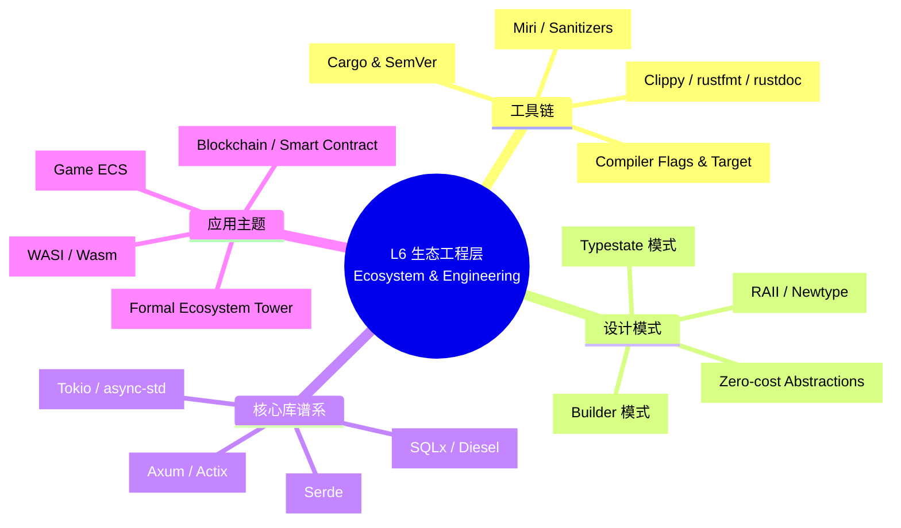

# L6 生态工程层（Ecosystem & Engineering）

> **定位**：Rust 的工程实践、工具链、设计模式和生态协作机制。本层是 L1-L5 知识的**工程化落地**，将理论转化为可维护、可扩展的代码库。
> **Bloom 层级**: 应用 + 评价
> **功能**: 将概念知识转化为**工程能力**
> **[来源: Cargo Book - doc.rust-lang.org/cargo]** · **[来源: crates.io]** · **[来源: Rust RFCs]** · **[来源: The Rust Programming Language (TRPL)]**

---

### 〇、L6 认知入口



> **认知功能**: 建立 L6 全景认知框架，按"工具链→设计模式→核心库→应用主题"四层递进组织工程知识。建议作为学习入口，快速定位目标领域后再深入各文件。关键洞察：每个分支都是 L1-L5 理论的可执行映射，而非独立知识集合。[来源: 💡 原创分析]

> **认知路径**: 本 mindmap 展示 L6 层的**工程化落地**。工具链将 L4 类型论转化为编译器实践，设计模式将 L1 所有权规则模式化，核心库谱系是生态的"基础设施"，应用主题展示 Rust 在特定领域的工程形态。L6 是知识体系的"出口"——将理论转化为可维护、可扩展的代码库。

## 一、本层概念关系图（完整版）

```mermaid
graph TB
    subgraph L6_Core["L6 核心八文件"]
        TOOL[01 Toolchain]
        PAT[02 Patterns]
        CRATES[03 Core Crates]
        APP[04 Application Domains]
        FORMAL[05 Formal Ecosystem Tower]
        BC[06 Blockchain]
        GAME[07 Game ECS]
        WASI[08 WASI]
    end

    %% L1-L5 输入
    L1_O[↳ L1 Ownership] ==>|"RAII 工程化"| PAT
    L2_TR[↳ L2 Traits] ==>|"派生宏/接口设计"| TOOL & PAT
    L2_MM[↳ L2 Memory] -.->|"智能指针选择"| PAT
    L3_UN[↳ L3 Unsafe] -.->|"unsafe 代码规范"| TOOL
    L4_TT[↳ L4 Type Theory] -.->|"类型系统工具化"| TOOL
    L5_CP[↳ L5 Rust vs C++] -.->|"工程模式选型"| PAT & APP

    %% 内部
    TOOL -.->|"Clippy lint 模式"| PAT
    PAT -.->|"Cargo 工作空间"| TOOL
    CRATES -.->|"选型支撑"| APP
    APP -.->|"需求反馈"| CRATES
    FORMAL -.->|"形式化评估"| CRATES
    CRATES -.->|"数据反馈"| FORMAL

    %% L7 输出
    TOOL ==>|"工具链支撑语言演进"| L7_EV[→ L7 Evolution]
    PAT ==>|"模式库支撑 AI 生成"| L7_AI[→ L7 AI]
    CRATES ==>|"生态数据驱动演进"| L7_EV
    APP ==>|"工业需求反馈形式化"| L7_AI

    %% 内部结构
    TOOL --> TOOL1[Cargo & SemVer]
    TOOL --> TOOL2[Compiler Flags & Target]
    TOOL --> TOOL3[Clippy / rustfmt / rustdoc]
    TOOL --> TOOL4[Cross-compilation]
    TOOL --> TOOL5[Miri / Sanitizers]

    PAT --> PAT1[Typestate Pattern]
    PAT --> PAT2[Builder Pattern]
    PAT --> PAT3[RAII / Newtype]
    PAT --> PAT4[Zero-cost Abstractions]
    PAT --> PAT5[Error Handling Patterns]

    style TOOL fill:#bbf,stroke:#333
    style PAT fill:#9f9,stroke:#333
```



> **认知功能**: 可视化 L1-L5 → L6 → L7 的完整知识流，实线表示强工程依赖，虚线表示弱反馈关联。用于理解各文件如何承接上层理论并输出工程价值。关键洞察：L6 是双向枢纽——既将理论转化为工程能力，也向 L7 输出结构化模板驱动演进。[来源: 💡 原创分析]

### 1.1 概念间语义链接

| 关系 | 从 | 到 | 语义类型 | 说明 |
|:---|:---|:---|:---|:---|
| 1 | **L1 Ownership** | **Patterns** | `==>` 工程化 | RAII 是 L1 所有权概念在工程中的**直接模式化**。每个 Rust 设计模式都是对所有权规则的特定应用。 |
| 2 | **L2 Traits** | **Toolchain + Patterns** | `==>` 支撑 | `derive` 宏（工具链）和 Typestate 模式（设计模式）都依赖 Trait 系统。 |
| 3 | **L4 Type Theory** | **Toolchain** | `-.->` 工具化 | 类型约束求解算法是 `rustc` 编译器的核心，类型论直接转化为工程工具。 |
| 4 | **Patterns** | **L7 AI** | `==>` 驱动 | 设计模式库为 AI 代码生成提供**结构化模板**。 |

---

## 二、文件索引与关系

| 文件 | 概念 | 核心内容 | 状态 | 依赖的 L1-L5 | 工程输出 |
|:---|:---|:---|:---|:---|:---|
| [01_toolchain.md](./01_toolchain.md) | 工具链 | Cargo、SemVer、Clippy、交叉编译、Miri | ✅ v1.0 | L4 类型论(编译器)、L3 Unsafe(Miri) | 可复现构建、质量门禁 |
| [02_patterns.md](./02_patterns.md) | 设计模式 | Typestate、Builder、Newtype、RAII、Zero-cost | ✅ v1.0 | L1 Ownership、L2 Trait、L5 对比 | 可维护代码结构 |
| [03_core_crates.md](./03_core_crates.md) | 核心库谱系 | serde、tokio、axum、clap、tracing、sqlx 等 40+ crate | ✅ v1.0 | L1-L5 全部概念 | 工程选型决策 |
| [04_application_domains.md](./04_application_domains.md) | 应用主题 | Web、CLI、嵌入式、游戏、区块链、数据工程、系统、GUI | ✅ v1.0 | L1-L5 全部概念 + 核心 crate | 领域工程落地 |
| [05_formal_ecosystem_tower.md](./05_formal_ecosystem_tower.md) | 形式化生态塔 | 核心 crate 的形式化根基/可组合性/可观测性三维评估；L0-L4 形式化分层 | ✅ v1.0 | L4 类型论、L3 Async/Unsafe | 形式化选型决策 |
| [06_blockchain.md](./06_blockchain.md) | 区块链合约安全 | Solana/Substrate/Near、合约安全形式化、Kani 验证、无重入/溢出 | ✅ v1.0 | L1 Ownership、L3 Unsafe、L4 RustBelt | 链上安全保证 |
| [07_game_ecs.md](./07_game_ecs.md) | 游戏 ECS 架构 | Bevy/Fyrox、ECS 与所有权协同、DOD、并发渲染 | ✅ v1.0 | L1 Ownership、L3 Concurrency | 游戏引擎选型 |
| [08_wasi.md](./08_wasi.md) | WASI 与 Wasm | Component Model、wit-bindgen、能力安全、wasm32-wasi | ✅ v1.0 | L1 Ownership、L3 FFI | 跨平台沙箱部署 |
| [11_webassembly.md](./11_webassembly.md) | WebAssembly | Rust 的 Wasm 编译模型、组件模型、应用场景 | ✅ v1.0 | L1 Type System, L3 FFI | 跨平台部署 |
| [13_logging_observability.md](./13_logging_observability.md) | 日志与可观测性 | tracing、log、metrics、OpenTelemetry、分布式追踪 | ✅ v1.0 | L3 Async, L2 Error | 监控与诊断 |
| [14_documentation.md](./14_documentation.md) | 文档生态 | rustdoc、文档测试、API 规范、mdBook、docs.rs | ✅ v1.0 | L3 Macros, L2 Module | 知识传播 |
| [15_performance_optimization.md](./15_performance_optimization.md) | 性能优化 | Criterion、flamegraph、缓存优化、SIMD、PGO | ✅ v1.0 | L1 Zero Cost, L1 Ownership | Concurrency, Async |
| [16_testing.md](./16_testing.md) | 测试生态 | 单元/集成/文档测试、mockall、proptest、cargo-fuzz | ✅ v1.0 | L2 Error, L3 Macros | Formal Methods, Miri |
| [17_cross_compilation.md](./17_cross_compilation.md) | 交叉编译 | 多目标平台、条件编译、no_std、嵌入式、Tier 系统 | ✅ v1.0 | L1 Type System, L3 Unsafe | WASI, WebAssembly |
| [18_distributed_systems.md](./18_distributed_systems.md) | 分布式系统 | gRPC、Raft、Actor、服务发现、微服务 | ✅ v1.0 | L3 Async, L4 Network | Observability, Wasm |
| [31_microservice_patterns.md](./31_microservice_patterns.md) | 微服务架构模式 | 服务发现、熔断、Saga、API Gateway、配置中心 | ✅ v1.0 | L3 Async, L4 Network | CQRS, 事件驱动 |
| [32_event_driven_architecture.md](./32_event_driven_architecture.md) | 事件驱动架构 | 发布-订阅、消息队列、Reactive Streams、幂等处理 | ✅ v1.0 | L3 Async, L2 Trait | CQRS, 分布式系统 |
| [33_cqrs_event_sourcing.md](./33_cqrs_event_sourcing.md) | CQRS & 事件溯源 | 命令查询分离、事件溯源、Saga 编排、Outbox 模式 | ✅ v1.0 | L3 Async, L2 Trait | 微服务, 事件驱动 |
| [35_architecture_patterns.md](./35_architecture_patterns.md) | 架构设计模式 | 分层/六边形/洋葱/整洁架构、Serverless/FaaS | ✅ v1.0 | L2 Trait, L1 Lifetime | 微服务, CQRS |
| [35_pattern_composition_algebra.md](./35_pattern_composition_algebra.md) | 模式组合代数 | 设计模式的形式化组合、冲突检测、Rust 所有权约束 | ✅ v1.0 | L2 Trait, L3 Concurrency | Software Architecture |
| [36_stream_processing_ecosystem.md](./36_stream_processing_ecosystem.md) | 流处理生态 | timely/differential dataflow、Materialize、RisingWave、Fluvio | ✅ v1.0 | L3 Stream Processing | Distributed Systems |
| [37_database_systems.md](./37_database_systems.md) | 数据库系统 | TiKV/Percolator、Materialize、Meilisearch、SurrealDB | ✅ v1.0 | L3 Concurrency | Stream Processing |
| [38_network_protocols.md](./38_network_protocols.md) | 网络协议 | QUIC/HTTP-3、quinn、h3、eBPF/aya | ✅ v1.0 | L3 Async | OS Kernel |
| [39_os_kernel.md](./39_os_kernel.md) | 操作系统 | Rust for Linux、Theseus、Redox、eBPF | ✅ v1.0 | L3 Unsafe | Network Protocols |

---

## 三、L1-L5 → L6 的工程映射

| L1-L5 概念 | L6 工程实践 | 映射说明 |
|:---|:---|:---|
| 所有权 + Drop | RAII 模式 | 资源管理自动化 |
| 借用规则 | Clippy lint (e.g., `needless_borrow`) | 编译期最佳实践检查 |
| Trait | `derive` 宏、接口设计 | 代码生成 + 模块化 |
| 泛型 | 零成本抽象模式 | 库设计中的性能保证 |
| Send/Sync | `crossbeam`、`rayon` 设计 | 并发库的安全封装 |
| async/await | `tokio`、`axum` 异步生态 | Web 后端与网络服务 |
| unsafe | Miri 动态检测、审计规范 | 安全关键代码验证 |
| 形式化方法 | Kani 集成测试、契约注释 | 工业级验证流程 |
| 对比分析 | 技术选型决策矩阵 | 架构设计文档 |
| 生命周期 | `sqlx` 编译期查询检查 | 数据库类型安全 |
| 过程宏 | `serde`、`clap` derive | 声明式代码生成 |
| Pin | `tokio` 自引用任务 | 异步状态机安全 |
| 范畴论/态射 | `Tower` Service Trait 复合 | 架构组合层的代数结构 |
| 同态/结构保持 | `Serde`/`SQLx`/`Prost` | 数据层的类型安全转换 |

---

## 四、认知路径

```text
直觉困惑                    具体场景                  模式抽象               形式规则              代码验证              边界测试
    │                         │                       │                     │                    │                    │
    ▼                         ▼                       ▼                     ▼                    ▼                    ▼
"怎么组织大型                 "多个 crate             "Cargo workspace       "语义版本控制        "CI 构建 +            "跨平台
 Rust 项目？"                怎么协作？"              = 模块化构建"          (SemVer)"            测试矩阵"            兼容性"

"怎么写可维护                 "状态转换容易            "Typestate =           "编译期状态机        "编译错误阻止         "过度设计
 的 Rust 代码？"             出 bug"                  编译期验证"            (PhantomData)"       非法状态转换"        权衡"

"怎么保证 unsafe              "FFI 代码怎么            "Safety Contract       "形式化契约          "Miri +              "审计覆盖
 代码安全？"                 测试？"                  + Miri 检测"           注释"                模糊测试"            完整性"
```

---

## 五、跨层出口

L6 的工程实践输出到：

- **L7 前沿**: AI 代码生成的模板库、形式化方法的 CI 集成
- **实践**: 团队编码规范、代码审查清单、项目脚手架

---

> **权威来源**: [Rust Reference](https://doc.rust-lang.org/reference/), [The Rust Programming Language](https://doc.rust-lang.org/book/), [Rustonomicon](https://doc.rust-lang.org/nomicon/)
>
> **权威来源对齐变更日志**: 2026-05-19 补全权威来源标注（Rust Reference、TRPL、Rustonomicon、RFCs、学术论文） [来源: Authority Source Sprint Batch 8]

**文档版本**: 1.1
**对应 Rust 版本**: 1.95.0+ (Edition 2024)
**最后更新**: 2026-05-24
**状态**: ✅ 权威来源对齐完成 (Batch 8)
