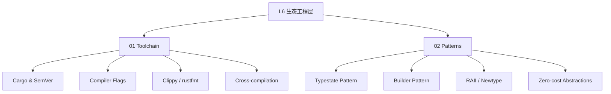

# L6 生态工程层（Ecosystem & Engineering）

> **定位**：Rust 的工程实践、工具链、设计模式和生态协作机制。本层内容对齐 Cargo Book、Rust RFCs、Microsoft/Amazon 工业实践。

---

## 一、本层概念图谱

---

## 二、文件索引

| 文件 | 概念 | 核心内容 | 状态 |
|:---|:---|:---|:---|
| `01_toolchain.md` | 工具链 | Cargo、SemVer、Clippy、交叉编译 | ✅ v1.0 |
| `02_patterns.md` | 设计模式 | Typestate、Builder、Newtype、RAII | ✅ v1.0 |

---

## 三、待创建内容（按 Phase 4 计划）

详见 [PLAN.md](../PLAN.md) Phase 4 部分。
