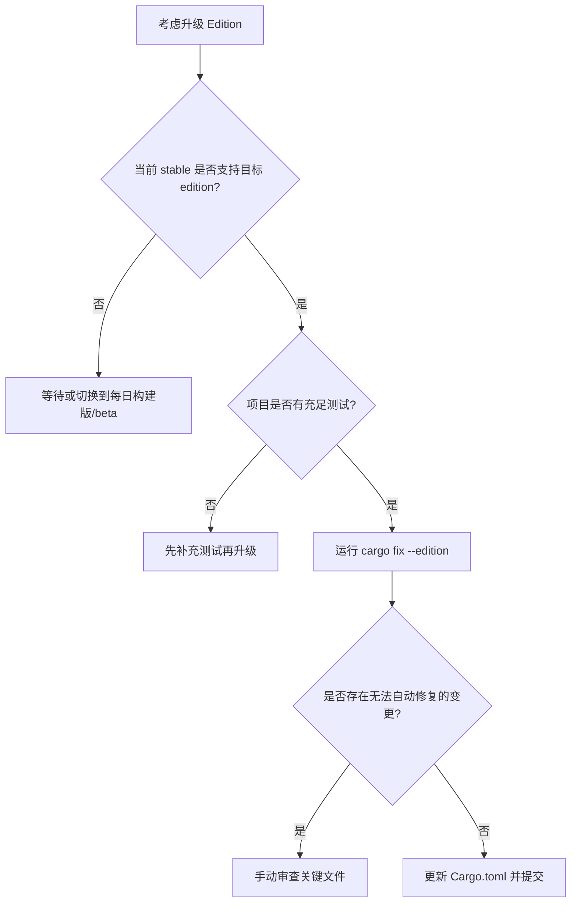

# Rust Editions（语言版本）

> **EN**: Rust Editions
> **Summary**: The Rust Edition mechanism: 2015, 2018, 2021, and 2024 editions, their key differences, how to choose and migrate using `cargo fix --edition`, and the relationship between edition and toolchain version.
> **Rust 版本**: 1.97.0+ (Edition 2024)
>
> **受众**: [进阶]
> **内容分级**: [参考级]
> **Bloom 层级**: L2-L3
> **权威来源**: 本文件为 `concept/` 权威页。
> **A/S/P 标记**: **S** — Specification
> **双维定位**: S×App — 规范应用
> **前置依赖**: [Toolchain](../../06_ecosystem/00_toolchain/01_toolchain.md) · [Cargo Getting Started](../../06_ecosystem/01_cargo/15_cargo_getting_started.md) · [Module System](../../02_intermediate/05_modules_and_visibility/01_module_system.md)
> **后置概念**: [Async Advanced](../../03_advanced/01_async/02_async_advanced.md) · [Cargo 1.96 Features](../../06_ecosystem/01_cargo/04_cargo_196_features.md) · [Rust Release Process](03_rust_release_process.md) · [Edition Guide](../01_edition_roadmap/02_edition_guide.md)
> **L1 基础依赖**: [Ownership](../../01_foundation/01_ownership_borrow_lifetime/01_ownership.md) · [Borrowing](../../01_foundation/01_ownership_borrow_lifetime/02_borrowing.md) · [Module System](../../02_intermediate/05_modules_and_visibility/01_module_system.md)
> **定理链**: Compiler Version → Edition → Syntax/Behavior → Migration
>
> **来源**: [The Rust Programming Language — Appendix E: Editions](https://doc.rust-lang.org/book/appendix-05-editions.html) · [Rust Edition Guide](https://doc.rust-lang.org/edition-guide/index.html) · [Rust Reference — Editions](https://doc.rust-lang.org/reference/items.html?search=edition)

---

## 认知路径

1. **问题识别**: 为什么 Rust 需要 Edition 机制？它与 C/C++ 大版本破坏性更新有何不同？
2. **概念建立**: 掌握 Edition 的定义、版本选择规则、`cargo fix` 迁移工具与 `rust-version` 字段的区别。
3. **机制推理**: 通过 ⟹ 定理链将编译器版本、Edition、语法行为、迁移路径串联起来。
4. **边界辨析**: 借助反命题/反例理解 Edition 与依赖混用、最低工具链要求等边界。
5. **迁移应用**: 将 Edition 知识与 [模块（Module）系统](../../02_intermediate/05_modules_and_visibility/01_module_system.md)、[async](../../03_advanced/01_async/02_async_advanced.md)、[发布流程](03_rust_release_process.md) 链接。

---

## 反命题决策树

> **反命题 1**: "Edition 会强制所有依赖同步升级" ⟹ 不成立。每个 crate 可独立选择 edition，同一编译单元内可混用不同 edition 的依赖。
> **反命题 2**: "设置 `edition = "2024"` 后旧代码一定能编译" ⟹ 不成立。Edition 引入非兼容语法变更，需通过 `cargo fix --edition` 或手动调整。
> **反命题 3**: "`rust-version` 与 `edition` 是同一回事" ⟹ 不成立。`edition` 控制语法/语义版本，`rust-version` 声明最低编译器版本，是不同维度的约束。

---

## 一、什么是 Edition

**Edition** 是 Rust 语言在保持向后兼容的前提下引入非兼容性语法/语义变更的机制。每个 crate 可独立选择 edition，同一编译单元内可混用不同 edition 的依赖。(Source: [Rust Edition Guide](https://doc.rust-lang.org/edition-guide/index.html))

关键原则：

- 同一 `rustc` 版本可编译多个 edition。
- 依赖的 edition 不影响当前 crate 的编译。
- 新 edition 大约每 2–3 年发布一次，随新的 stable 工具链启用。

---

## 二、主要 Edition 对比

| Edition | 稳定版本 | 主要变化 |
|:---|:---:|:---|
| 2015 | 1.0 | 初始版本；模块（Module）路径需要 `extern crate`；trait 对象可省略 `dyn` |
| 2018 | 1.31 | 模块系统简化（`mod` 自动解析）、路径统一为 `crate::`、NLL、`async`/await 语法准备、`dyn Trait` 必须显式 |
| 2021 | 1.56 | prelude 新增 `TryFrom`/`TryInto`/`FromIterator`、数组实现 `IntoIterator`、panic 宏（Macro）一致性（Coherence）、保留语法 |
| 2024 | 1.85+ | `if let` 临时作用域收窄、`gen` 关键字保留、异步（Async）闭包（Closures）、`match` 人体工学改进、never type fallback |

### 代码示例对比

2015 Edition：

```rust
extern crate serde;
mod foo;

fn main() {
    let trait_obj: &Serialize = &1; // 可省略 dyn
}
```

2018+ Edition：

```rust
use serde::Serialize;

fn main() {
    let trait_obj: &dyn Serialize = &1;
}
```

2021 Edition：

```rust
fn main() {
    let arr = [1, 2, 3];
    for x in arr {
        // 2021: 按值迭代数组；2018: 默认按引用
        println!("{x}");
    }
}
```

---

## 三、选择 Edition

在 `Cargo.toml` 中声明：

```toml
[package]
name = "myproj"
version = "0.1.0"
edition = "2024"
rust-version = "1.85"
```

- 新推荐使用最新稳定 edition。
- 依赖 crate 的 edition 不影响当前 crate 的编译。
- `rust-version` 让 Cargo 在低于该版本的编译器上给出清晰错误。(Source: [TRPL — Appendix E: Editions](https://doc.rust-lang.org/book/appendix-05-editions.html))

---

## 四、迁移流程

```bash
# 1. 确保当前代码在最新 stable 上编译通过
rustup update stable

# 2. 预览将要应用的变更
cargo fix --edition --dry-run

# 3. 自动应用 edition 迁移
cargo fix --edition

# 4. 更新 Cargo.toml 中的 edition 字段
# edition = "2024"

# 5. 重新编译并检查测试
cargo test
```

迁移工具会：

1. 扫描需要调整的代码。
2. 应用机械式重写。
3. 对无法自动处理的部分给出警告。

---

## 五、Edition 与工具链版本的关系

| 维度 | `edition` | `rust-version` |
|:---|:---|:---|
| 控制内容 | 语法与语义版本 | 最低 `rustc` 版本 |
| 取值示例 | `"2015"` / `"2018"` / `"2021"` / `"2024"` | `"1.70"` / `"1.85"` |
| 是否影响依赖编译 | 否（仅当前 crate） | 否（仅提示信息） |
| 与编译器关系 | 一个 `rustc` 可编译多个 edition | 必须 >= 指定版本 |

---

## 六、何时升级 Edition



| 情况 | 建议 |
|:---|:---|
| 全新项目 | 直接使用最新稳定 edition |
| 维护期项目 | 在主要 release 或新功能开发期升级 |
| 大量 unsafe/宏（Macro） | 预留更多时间手动审查 |
| 依赖链老旧的 crate | 优先升级依赖，再升级自身 edition |

---

## 七、相关概念

- [对应测验](../05_quizzes/01_quiz_version_and_preview.md) — 版本演进、Edition 机制与前沿特性（发布火车、1.90–1.97 稳定特性、preview 状态）
| 概念 | 关系 |
|:---|:---|
| [Module System](../../02_intermediate/05_modules_and_visibility/01_module_system.md) | 2018 Edition 重大改进了模块路径 |
| [Async Advanced](../../03_advanced/01_async/02_async_advanced.md) | `async`/await 语法随 2018 Edition 引入 |
| [Rust Release Process](03_rust_release_process.md) | 新 edition 随 stable 版本发布 |
| [Edition Guide](../01_edition_roadmap/02_edition_guide.md) | 详细的 edition 差异说明 |
| [Rust Version Tracking](01_rust_version_tracking.md) | 跟踪各版本与 edition 的对应关系 |
| [Cargo Getting Started](../../06_ecosystem/01_cargo/15_cargo_getting_started.md) | `Cargo.toml` 基础 |

---

> **权威来源**: [TRPL — Appendix E](https://doc.rust-lang.org/book/appendix-05-editions.html) · [Rust Edition Guide](https://doc.rust-lang.org/edition-guide/index.html)

---

## 八、Rust 1.97.0 × Edition 2024 交叉语义：lint-level 矩阵与两套 fallback 机制

> **对应版本**：Rust **1.97.0+** / **Edition 2024**。
> **定位**：补齐审计 §2.4 / §4 P2-2 缺口#6 指出的"edition 2024 × 1.97 割裂"。本节只做**交叉定位**，不重复版本页逐项解释；fallback 的推断推导落在承载页 [`27_type_checking_and_inference.md`](../../04_formal/00_type_theory/07_type_checking_and_inference.md) 与 [`31_never_type.md`](../../01_foundation/02_type_system/02_never_type.md)。
> **关键边界**：本页同时出现两类变更，门控维度**不同**——
>
> - **edition 门控**（只对 `edition = "2024"` 的 crate 生效）：`unsafe_op_in_unsafe_fn` 默认级别提升、never type fallback 由 `()` 改为 `!`。
> - **工具链版本门控**（升级到 1.97.0 即对**所有 edition** 生效，与 edition 无关）：`dead_code_pub_in_binary`、`linker_messages`、`varargs_without_pattern` 在依赖中报告、`{float}`→`f32` fallback。
>
> 把两类混为一谈是常见误判：`linker_messages` 在 `edition = "2021"` 的 crate 升级到 1.97 后**同样**会以 warning 出现。

### 8.1 lint-level 矩阵：edition 2024 默认 lint × 1.97 新 lint

> 列口径：**默认级别**=未显式配置时该 lint 的级别；**warnings group**=该 lint 是否被 `#![warn(warnings)]` / `-D warnings` / Cargo `build.warnings` 这组"通用 warnings 开关"覆盖；**迁移开关**=启用/静默/自动迁移的入口。

| Lint | 引入（版本 / Edition） | 默认级别 | 在 `warnings` group？ | 迁移开关 | 来源 |
|:---|:---|:---|:---|:---|:---|
| `unsafe_op_in_unsafe_fn` | Edition 2024（1.85.0 起随 edition） | edition 2024：**warn**；edition ≤2021：**allow** | 否（属 `rust_2024_compatibility` group） | `cargo fix --edition`（自动迁移）；或 crate 根 `#![warn(unsafe_op_in_unsafe_fn)]` 手动定位 / `#![allow(...)]` 静默 | [Edition Guide — unsafe_op_in_unsafe_fn](https://doc.rust-lang.org/edition-guide/rust-2024/unsafe-op-in-unsafe-fn.html) |
| `dead_code_pub_in_binary` | Rust **1.97.0**（工具链，全 edition） | **allow**（allow-by-default） | 否（allow-by-default 不随 `-D warnings` 自动启用） | `#![warn(dead_code_pub_in_binary)]` 或 `[lints.rust] dead_code_pub_in_binary = "warn"` 显式启用（常用于 CI） | [`rust_1_97_stabilized.md`](rust_1_97_stabilized.md) §2.2；[releases.rs 1.97.0](https://releases.rs/docs/1.97.0/) |
| `linker_messages` | Rust **1.97.0**（工具链，全 edition） | **warn**（默认显示链接器输出） | **否（特殊 lint，不受 `warnings` group / `build.warnings` 控制）** | `#![allow(linker_messages)]` 或 `[lints.rust] linker_messages = "allow"` 静默；**不能**靠 `-D warnings` 升级也不能靠 `build.warnings` 关闭 | [`rust_1_97_stabilized.md`](rust_1_97_stabilized.md) §2.8；[releases.rs 1.97.0](https://releases.rs/docs/1.97.0/) |
| `varargs_without_pattern` | Rust **1.97.0** 起**在依赖中也报告**（lint 本身更早存在） | **warn**（默认级别 **⚠需专家复核**；版本页与 releases.rs 仅确认"在依赖中报告"这一变更，未列默认级别） | 是（按常规 warn-by-default lint 处理；**⚠需专家复核**其 group 归属） | `#![allow(varargs_without_pattern)]` 临时静默，或升级依赖修复变参 FFI 模式 | [releases.rs 1.97.0](https://releases.rs/docs/1.97.0/)（"report the `varargs_without_pattern` lint in deps"）；[`feature_domain_matrix_197.md`](feature_domain_matrix_197.md) #27 |

> ⚠**复核标记（2 处，同属 `varargs_without_pattern` 一行：默认级别 + `warnings` group 归属）**：

**迁移开关代码示例（Edition 2024 / Rust 1.97.0+）**：

```rust,ignore
// edition = "2024", rust = "1.97" —— crate 根（lib.rs / main.rs）

// (a) edition 2024：unsafe fn 内的 unsafe 操作必须显式 unsafe 块（默认 warn）
#![warn(unsafe_op_in_unsafe_fn)]   // 显式开启（2024 已默认 warn，写在此处仅作迁移期显式声明）

// (b) 1.97：在 CI 中启用"二进制 crate 未用 pub 条目"检测（默认 allow）
#![warn(dead_code_pub_in_binary)]

// (c) 1.97：链接器输出默认 warn；如需临时静默，显式 allow（不受 warnings group 控制）
#![allow(linker_messages)]
```

```toml
# Cargo.toml —— 与上面 crate 属性等价的项目级配置（Cargo [lints] 表，1.74+ 稳定）
[lints.rust]
unsafe_op_in_unsafe_fn = "warn"   # edition 2024 默认即 warn
dead_code_pub_in_binary = "warn"  # 1.97，默认 allow，需显式启用
linker_messages = "allow"         # 1.97，默认 warn；特殊 lint，只能单独 allow 静默
```

### 8.2 两套 fallback 机制的统一讨论：never type fallback × `{float}`→f32 fallback

> 两者同属**默认类型回退（default type fallback）**家族：当推断变量无法被上下文约束时，编译器给一个"兜底类型"。但**作用的推断变量不同、门控维度不同、破坏性不同**——这正是审计 §2.4 指出"两个 fallback 机制未统一讨论"的割裂点。

| 维度 | never type fallback（Edition 2024） | `{float}`→f32 fallback（Rust 1.97.0） |
|:---|:---|:---|
| 作用的推断变量 | `!`（never）经"never-to-any"强制转换产生的变量 | 未约束的浮点字面量 `{float}` |
| 触发条件 |  coercion 处见到 `!` 值、且目标类型无法由上下文推断 | `{float}` 出现在需要具体类型的上下文、未被其它约束确定为 `f64`（含经 `f32: From<{float}>` 约束的情形） |
| 默认类型（前 → 后） | `()` → **`!`**（edition 2024；计划未来推广到所有 edition） | 历史上多落到 `f64` → 受影响情形更可能落到 **`f32`** |
| 破坏性 | edition 2024 内可能**编译失败或行为变化**；前置 edition 以 future-incompatible 警告检测（`dependency_on_unit_never_type_fallback`，warn-by-default） | 1.97 起 **future-compatibility warning**（"未来会变硬错误"），当前仍可编译 |
| 关联 lint | `never_type_fallback_flowing_into_unsafe` 在 2024 由 warn 升至 **deny**；检测 lint `dependency_on_unit_never_type_fallback` | future-incompatible 组（围绕 `f32: From<{float}>` 的兼容性警告；不另列虚构 lint 名） |
| 迁移动作 | 显式标注类型绕过 fallback：`f::<()>()?;`、`() = f()?;`、闭包 `|| -> () { panic!() }`、`<() as Default>::default()` | 显式后缀或标注：`1.0_f32`/`1.0_f64`、`let x: f64 = …`、`f64::from(x)` / turbofish |
| 承载页 | [`31_never_type.md`](../../01_foundation/02_type_system/02_never_type.md) | [`27_type_checking_and_inference.md`](../../04_formal/00_type_theory/07_type_checking_and_inference.md)（fallback 边界小节） |

**never type fallback（Edition 2024）最小对照**：

```rust,ignore
// edition = "2021" —— 旧行为：! 在无法推断时回退到 ()
// edition = "2024" —— 新行为：! 保持为 !，下面这种依赖回退到 () 的写法会失败
fn f<T: Default>() -> Result<T, ()> { Ok(T::default()) }

fn outer<T>(x: T) -> Result<T, ()> {
    f()?;        // 2021：T 被回退推断为 ()；2024：T 被推断为 !，而 !: Default 不成立 → 报错
    Ok(x)
}

// 迁移（2024）：显式固定目标类型，绕过 fallback
fn outer_fixed<T>(x: T) -> Result<T, ()> {
    f::<()>()?;  // 或：() = f()?;
    Ok(x)
}
```

**`{float}`→f32 fallback（Rust 1.97.0+）最小对照**：

```rust,ignore
// rust = "1.97"（任意 edition）—— 依赖旧推断会触发 future-compatibility warning
fn takes_f32(_: f32) {}

fn demo() {
    takes_f32(1.0);        // 1.0 的推断路径变化：未约束 {float} 更可能回退到 f32
    let v = 2.0.into();    // 经由 From/Into 的目标类型推断可能受影响
    let _: f32 = v;
}

// 迁移：显式固定浮点类型，消除推断歧义
fn demo_fixed() {
    takes_f32(1.0_f32);
    let v: f32 = f32::from(2.0_f32);
    let w = f64::from(2.0_f64);   // 需要 f64 时同样显式
    let _: f64 = w;
}
```

**边界说明**：

1. **fallback 只在没有其它约束时触发**；一旦上下文（函数形参、`let` 标注、turbofish）已确定类型，两套 fallback 都不介入——这就是"显式标注即可迁移"的根因。
2. **never type fallback 是 edition 门控**：同一 crate 在 `edition = "2021"` 下仍走旧的 `()` 回退（仅发出 future-incompatible 警告），切到 `edition = "2024"` 才改为 `!`。
3. **`{float}`→f32 是工具链门控**：升级到 1.97.0 即对所有 edition 生效；当前为警告，属 future-incompatible，未来 release 会变硬错误，应在升级窗口内显式修复。
4. **二者不在同一推断变量上叠加**：`!` 与 `{float}` 是不同的推断变量族，故"统一讨论"是**机制层面的对照**而非"同一个 fallback 同时改两条规则"。

### 8.3 来源与反链

- **来源**：
  - [`rust_1_97_stabilized.md`](rust_1_97_stabilized.md) §2.2（`dead_code_pub_in_binary` allow-by-default）、§2.6（`{float}`→f32）、§2.8（`linker_messages` 特殊 lint）、§7（兼容性表）。
  - [releases.rs 1.97.0](https://releases.rs/docs/1.97.0/)（Language / Compatibility Notes：`dead_code_pub_in_binary`、warn on linker output、`varargs_without_pattern` in deps、`f32: From<{float}>` future-compat）。
  - [Rust Edition Guide — `unsafe_op_in_unsafe_fn`](https://doc.rust-lang.org/edition-guide/rust-2024/unsafe-op-in-unsafe-fn.html)（warn-by-default、`rust_2024_compatibility` group、`cargo fix --edition` 迁移）。
  - [Rust Edition Guide — Never type fallback change](https://doc.rust-lang.org/edition-guide/rust-2024/never-type-fallback.html)（fallback `()`→`!`、`never_type_fallback_flowing_into_unsafe` 升至 deny、`dependency_on_unit_never_type_fallback` 检测）。
- **反链**：
  - [`rust_1_97_stabilized.md`](rust_1_97_stabilized.md)
  - [`feature_domain_matrix_197.md`](feature_domain_matrix_197.md)（Compat-Lint 列、§4.9、§5.4）
  - [`migration_197_decision_tree.md`](migration_197_decision_tree.md)（§4 `f32: From<{float}>` 迁移判定树）

---

## 国际权威参考 / International Authority References（P1 学术 · P2 生态）

> 依据 `AGENTS.md` §2「对齐网络国际化权威内容」补充：仅追加已验证可达的权威链接，不改动正文事实。

- **P1 学术/形式化**: [Oxide: The Essence of Rust (arXiv:1903.00982)](https://arxiv.org/abs/1903.00982) · [Wadler & Blott: How to Make Ad-hoc Polymorphism Less Ad Hoc (POPL 1989)](https://dl.acm.org/doi/10.1145/75277.75283)
- **P2 生态/社区**: [docs.rs/toml — 生态权威 API 文档](https://docs.rs/toml) · [docs.rs/cargo_metadata — 生态权威 API 文档](https://docs.rs/cargo_metadata)
