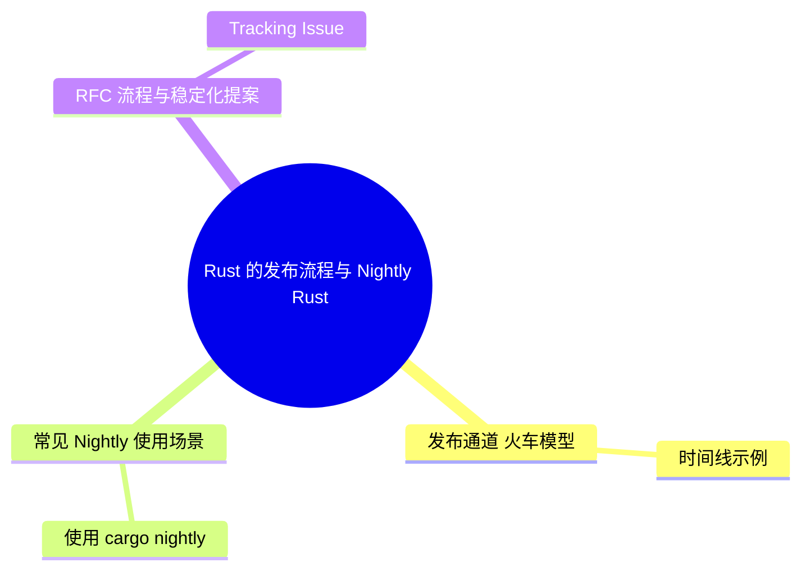

> **内容分级**: [综述级]
>
# Rust 的发布流程与 Nightly Rust

> **EN**: How Rust is Made and “Nightly Rust”
> **Summary**: Rust 的火车发布模型、Stability without Stagnation 原则、Nightly/Beta/Stable 三个发布通道、feature flags、rustup 通道切换以及 RFC 流程。
> **Rust 版本**: 1.97.0+ (Edition 2024)
>
> **受众**: [初学者]
> **Bloom 层级**: L2
> **权威来源**: 本文件为 `concept/` 权威页。
> **A/S/P 标记**: **S** — Structure
> **双维定位**: P×Eco — 语言发布流程与生态演进
> **前置依赖**: [Toolchain](../../06_ecosystem/00_toolchain/01_toolchain.md) · [Editions](../01_edition_roadmap/02_edition_guide.md)
> **后置概念**: [Rust Version Tracking](01_rust_version_tracking.md) · [Rust 1.97 Preview (Beta)](rust_1_97_preview.md)
> **定理链**: N/A — 流程/生态文档
> **主要来源**: [TRPL — Appendix G](https://doc.rust-lang.org/book/appendix-07-nightly-rust.html) · [Rust Forge — Release Process](https://forge.rust-lang.org/release/process.html) · [Rust Reference](https://doc.rust-lang.org/reference/introduction.html) · [Brown University — Interactive Rust Book](https://rust-book.cs.brown.edu/) · [Jung et al. — RustBelt: Securing the Foundations of Rust](https://plv.mpi-sws.org/rustbelt/popl18/) · [Itanium C++ ABI](https://itanium-cxx-abi.github.io/cxx-abi/abi.html)

>
> **来源**: [TRPL — Appendix G: How Rust is Made and “Nightly Rust”](https://doc.rust-lang.org/book/appendix-07-nightly-rust.html) · [Rust Release Channels](https://doc.rust-lang.org/book/appendix-07-nightly-rust.html#choo-choo-release-channels-and-riding-the-trains)

---

## 一、Stability without Stagnation

Rust 的核心原则之一是 **“稳定而不停滞”**（Stability without Stagnation）：

- **稳定**：升级到新版本的 stable Rust 应该是无痛的，代码不会因为语言变化而意外损坏。
- **不停滞**：Rust 仍然可以持续实验和引入新特性，避免在稳定后才暴露重大设计缺陷。

实现这一平衡的关键是**发布通道**（release channels）和 **feature flags**。

---

## 二、发布通道：火车模型

Rust 采用 **火车模型**（train model）进行发布，共有三个通道：

| 通道 | 发布频率 | 用途 |
|:---|:---|:---|
| **Nightly** | 每晚 | 最新代码，包含实验性特性 |
| **Beta** | 每 6 周从 Nightly 分支 | 进入稳定前的测试期 |
| **Stable** | 每 6 周从 Beta 分支 | 正式发布，推荐生产使用 |

### 时间线示例

```text
Nightly: * - - * - - * - - * - - * - - * - * - *
                     |                         |
Beta:                * - - - - - - - - *       *
                                       |
Stable:                                *
```

- 每晚从 `main` 分支生成 Nightly。
- 每 6 周，当前 Nightly 被切出为 Beta。
- 再经过 6 周测试，Beta 成为 Stable。
- 每个 Stable 版本只被支持 6 周（即到下一个 Stable 发布时 EOL）。

> **好处**：如果某个特性错过当前发布窗口，只需等待 6 周即可进入下一个窗口，降低了赶工引入不成熟特性的压力。

---

## 三、不稳定特性与 Feature Flags

新特性在合并到 `main` 分支时，默认被 **feature flag** 保护：

```rust
#![feature(async_await)]
```

- 只有 **Nightly** 通道可以使用 `#![feature(...)]`。
- **Beta 和 Stable** 禁止使用 feature flag。
- 当特性经过充分测试并决定稳定化后，feature flag 被移除，特性随下一个 Stable 发布。

> 本书（TRPL）及本知识库主要覆盖 stable 特性；nightly-only 特性会单独标注。

---

## 四、使用 rustup 切换通道

```bash
# 安装 nightly 工具链
rustup toolchain install nightly

# 列出已安装工具链
rustup toolchain list

# 为当前项目设置 nightly
rustup override set nightly

# 恢复默认工具链
rustup override unset
```

> `rustup override` 只在当前目录生效，适合特定项目需要 nightly 的场景。

---

## 五、RFC 流程与团队

Rust 的重大变更通过 **RFC（Request for Comments）** 流程决策：

1. **提交 RFC**：社区任何人都可以撰写 RFC 提案。
2. **团队评审**：相关子团队（语言设计、编译器、文档、基础设施等）讨论并给出反馈。
3. **达成共识**：团队决定接受或拒绝 RFC。
4. **实现**：被接受的 RFC 会创建 tracking issue，由贡献者实现。
5. **进入 Nightly**：实现合入 `main`，默认由 feature flag 保护。
6. **稳定化决策**：经过 nightly 用户试用和团队评估后，决定是否移除 feature flag 并进入 stable。

---

## 六、常见 Nightly 使用场景

| 场景 | 说明 | 推荐命令 |
|:---|:---|:---|
| 尝试预览特性 | 使用 `#![feature(...)]` 启用不稳定特性 | `cargo +nightly build` |
| 运行 Miri | Miri 目前只能在 Nightly 上运行 | `cargo +nightly miri test` |
| 编译器开发 | 为 rustc 贡献代码需要 nightly 工具链 | `./x.py build` |
| 自定义目标 | 使用 `build-std` 编译标准库 | `cargo +nightly build -Zbuild-std` |
| 基准测试 | 某些性能分析工具依赖 nightly | `cargo +nightly bench` |

### 使用 `cargo +nightly`

`cargo +nightly` 是 rustup 提供的工具链覆盖语法，不需要切换默认工具链：

```bash
# 单次使用 nightly 编译
cargo +nightly build

# 单次使用 nightly 运行测试
cargo +nightly test

# 单次使用 nightly 并启用不稳定 cargo 特性
cargo +nightly build -Zunstable-options
```

---

## 七、Nightly 与 Miri

Miri 是 Rust 的未定义行为检测器，目前只能在 Nightly 工具链上运行：

```bash
# 安装 Miri
rustup component add --toolchain nightly miri

# 运行 Miri 检查
cargo +nightly miri test
```

Miri 特别适合验证以下代码：

- 包含 `unsafe` 块的自定义数据结构
- 使用原始指针（Raw Pointer）和手动内存管理
- 依赖内存顺序的并发原语
- 与 FFI 交互的边界代码

---

## 八、RFC 流程与稳定化提案

Rust 的重大变更通过 **RFC（Request for Comments）** 流程决策：

1. **提交 RFC**：社区任何人都可以撰写 RFC 提案，提交到 `rust-lang/rfcs` 仓库。
2. **团队评审**：相关子团队（语言设计、编译器、文档、基础设施等）讨论并给出反馈。
3. **达成共识**：团队决定接受或拒绝 RFC。
4. **实现**：被接受的 RFC 会创建 tracking issue，由贡献者实现。
5. **进入 Nightly**：实现合入 `main`，默认由 feature flag 保护。
6. **稳定化提案（Stabilization Report）**：实现成熟后，提交稳定化报告。
7. **稳定化决策**：经过 nightly 用户试用和团队评估后，决定是否移除 feature flag 并进入 stable。

### Tracking Issue

每个不稳定特性都有一个 tracking issue，记录：

- 当前实现状态
- 已知问题
- 阻止稳定化的因素
- 使用示例和测试覆盖

可以通过 `rustc --version` 和 `rustc +nightly --version` 查看当前工具链版本：

```bash
$ rustc --version
rustc 1.97.0 (2026-06-30)

$ rustc +nightly --version
rustc 1.99.0-nightly (2026-07-08)
```

---

## 九、实践建议

1. **生产环境使用 Stable**：获得最佳稳定性和长期支持预期。
2. **CI 中测试 Beta**：提前发现可能的回归问题。
3. **只在必要时使用 Nightly**：例如需要尝试前沿特性或为 Rust 贡献代码。
4. **关注 RFC 和 Release Notes**：了解即将到来的语言/工具链变化。
5. **使用 `rust-toolchain.toml` 固定通道**：对于需要 nightly 的项目，可以在项目根目录创建：

```toml
[toolchain]
channel = "nightly"
components = ["rust-src", "miri", "rustfmt", "clippy"]
```

---

## 十、相关概念

| 概念 | 关系 |
|:---|:---|
| [Toolchain](../../06_ecosystem/00_toolchain/01_toolchain.md) | rustup 管理不同通道的工具链 |
| [Editions](../01_edition_roadmap/02_edition_guide.md) | Edition 是 Rust 每 2-3 年发布的重大语法/库更新 |
| [Rust Version Tracking](01_rust_version_tracking.md) | 跟踪各版本稳定特性 |
| [Rust 1.97 Preview (Beta)](rust_1_97_preview.md) | Stable 通道具体特性示例 |

## 过渡段

> **过渡**: 从火车发布模型过渡到 Nightly 通道，可以理解“稳定而不停滞”的发布哲学。
>
> **过渡**: 从 feature flag 机制过渡到 RFC 流程，可以建立新特性从实验到稳定的演进路径。
>
> **过渡**: 从 Nightly 使用过渡到 Beta/Stable，可以评估尝鲜特性对项目维护的影响。
>

## 定理链

| 定理 | 前提 | 结论 |
|:---|:---|:---|
| Nightly 通道 ⟹ 实验空间 | 每日构建包含最新特性 | 支持早期验证 |
| Feature Flag ⟹ 可控启用 | 用户显式选择不稳定特性 | 防止意外依赖 |
| 稳定化流程 ⟹ 生态兼容 | 经过 Beta 测试后进入 Stable | 保证升级安全 |

---

## 国际权威参考 / International Authority References（P1 学术 · P2 生态）

> 依据 `AGENTS.md` §2「对齐网络国际化权威内容」补充：仅追加已验证可达的权威链接，不改动正文事实。

- **P2 生态/社区**: [docs.rs/tokio — 生态权威 API 文档](https://docs.rs/tokio) · [docs.rs/futures — 生态权威 API 文档](https://docs.rs/futures)

---

## 🧭 思维导图（Mindmap）



> **认知功能**: 本 mindmap 从本页「Rust 的发布流程与 Nightly Rust」的章节结构提炼，一级分支对应核心主题，叶子节点为关键子概念，可作为本页的快速导航与复习索引。

## ⚠️ 反例与陷阱：在 stable 通道启用 feature gate

**反例**：读到某个 nightly 特性介绍后，直接在 stable 工具链的项目里开启：

```rust,compile_fail
#![feature(box_patterns)]

fn main() {}
```

实测（rustc 1.97.0 stable, edition 2024）：`error[E0554]:`#![feature]`may not be used on the stable release channel`。

**陷阱本质**：「Stability without Stagnation」的另一面是——不稳定特性只存在于 nightly；stable/beta 编译器直接拒绝 `#![feature]`，没有正规配置可以绕过（`RUSTC_BOOTSTRAP=1` 属内部逃逸舱，生产禁用）。

**修正**：实验用 `rustup override set nightly` 或 `cargo +nightly`；交付代码只依赖已稳定特性，并跟踪对应预览页等待稳定化。
