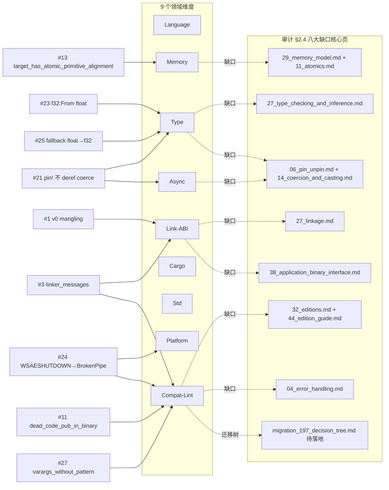

# Rust 1.97.0 特性 × 领域反查矩阵

> **EN**: Rust 1.97.0 Feature × Domain Reverse-Lookup Matrix
> **Summary**: 把 Rust 1.97.0 的 31 项稳定特性从"版本页单点罗列"重构为"31 特性 × 9 领域"反查矩阵，标注每个特性的跨领域影响、对应核心 concept 页锚点，以及审计 §2.4 发现的 8 处核心页缺口（⚠缺口），使任一特性的跨领域语义与落地位置可被机器复核。
>
> **受众**: [进阶] / [专家]
> **内容分级**: [参考级]
> **权威来源**: 本文件为 `concept/` 权威页（P2-1 交付物）。
> **对应 Rust 版本**: **1.97.0+**（Edition 2024）
> **Bloom 层级**: L4（分析）/ L5（评价：跨领域一致性判定）/ L7（版本治理）
> **层次定位**: L7 未来/版本治理（横向反查层，依附于各核心领域权威页）
> **最后更新**: 2026-07-11
> **状态**: ✅ 已对齐 Rust 1.97.0 stable；缺口标注对齐 `reports/GLOBAL_SEMANTIC_CRITICAL_AUDIT_2026_07_11.md` §2.4 / §4 P2
>
> **事实来源（权威，先读后写）**:
>
> - 31 项特性清单与编号：[`reports/RUST_197_CONTENT_GAP_ANALYSIS_2026_07_11.md`](../../../reports/RUST_197_CONTENT_GAP_ANALYSIS_2026_07_11.md) §2
> - 版本页正文（§2.6/§2.7/§2.8 等）：[`rust_1_97_stabilized.md`](rust_1_97_stabilized.md)
> - 缺口与 8 个补缺位置：[`reports/GLOBAL_SEMANTIC_CRITICAL_AUDIT_2026_07_11.md`](../../../reports/GLOBAL_SEMANTIC_CRITICAL_AUDIT_2026_07_11.md) §2.4、§4 P2-2
> - 上游：[`releases.rs 1.97.0`](https://releases.rs/docs/1.97.0/) · [Rust 1.97.0 Release Blog](https://blog.rust-lang.org/2026/07/09/Rust-1.97.0/)
>
> **前置概念**: [Rust 版本跟踪](05_rust_version_tracking.md) · [Rust 1.97.0 稳定特性](rust_1_97_stabilized.md)
> **后置概念**: [Rust 1.97.0 前沿预览](rust_1_97_preview.md) · [Rust 1.98+ 前沿预览](rust_1_98_preview.md) · 迁移判定树（P2-5，待落地）

---

## 0. 阅读说明与图例

本矩阵是**反查层**：它**不**重复各核心概念页的正文，只回答两个问题——

1. 给定一个 1.97 特性，它影响哪些领域？应落到哪个核心 concept 页？
2. 给定一个领域，哪些 1.97 特性触及它？核心页当前是**已交叉 / 仅横幅 / 零命中**？

**图例（每个单元格）**

| 符号 | 含义 |
|---|---|
| `✓` | 该特性在该领域有**直接**影响，并给出核心 concept 页锚点 |
| `○` | **间接**影响（通过另一机制传导，如 `Send` 对 async、`cfg` 对布局） |
| `✗` | 无影响 |
| `⚠缺口→应补于 <path>` | 该领域**本应**有影响但核心页**未覆盖**（审计 §2.4 缺口），`<path>` 为 `concept/` 根相对路径，对应 §4 P2-2 的 8 个补缺位置 |

**路径约定**：表格内补缺口路径用 `concept/` 根相对写法（与审计报告一致，便于脚本 grep）；可点击锚点用从本目录出发的相对链接 `../../<path>`。

**域列顺序（9 列，固定）**：Language · Type · Memory · Link-ABI · Async · Cargo · Std · Platform · Compat-Lint。

---

## 1. 31 × 9 反查矩阵（行=特性，列=领域）

| # | 特性（编号对齐 RUST_197 §2） | Language | Type | Memory | Link-ABI | Async | Cargo | Std | Platform | Compat-Lint |
|---|---|---|---|---|---|---|---|---|---|---|
| 1 | Symbol mangling v0 enabled by default | ○ 符号命名 | ✗ | ✗ | ✓ [38_ABI](../../04_formal/05_rustc_internals/38_application_binary_interface.md)（**仅横幅**）⚠缺口→应补于 03_advanced/04_ffi/27_linkage.md | ✗ | ✗ | ✗ | ○ 调试器/Profiler 因平台而异 | ✓ 旧工具 demangle 失效 |
| 2 | Cargo `build.warnings` config | ✗ | ✗ | ✗ | ✗ | ✗ | ✓ [83_config](../../06_ecosystem/01_cargo/83_cargo_configuration.md) · [65_lints](../../06_ecosystem/01_cargo/65_cargo_profiles_and_lints.md) | ✗ | ✗ | ○ 仅控 local packages，控的是 lint 级别 |
| 3 | Linker output 默认显示（`linker_messages` lint） | ✗ | ✗ | ✗ | ⚠缺口→应补于 03_advanced/04_ffi/27_linkage.md | ✗ | ○ 与 `build.warnings` 组合（#2）但 `linker_messages` 不受 `warnings` group 控制 | ✗ | ✗ | ✓ 特殊 lint（不在 `warnings` group）⚠缺口→应补于 02_intermediate/00_traits/32_editions.md（lint-level 矩阵） |
| 4 | `Default for RepeatN` | ✗ | ○ `Default` trait | ✗ | ✗ | ✗ | ✗ | ✓ std 表面 API（无专属概念页） | ✗ | ✗ |
| 5 | `Copy for ffi::FromBytesUntilNulError` | ✗ | ○ `Copy` trait 语义 | ✗ | ○ FFI 边界类型 | ✗ | ✗ | ✓ std 表面 API | ✗ | ✗ |
| 6 | `Send for std::fs::File` on UEFI | ✗ | ○ `Send` auto trait | ✗ | ✗ | ○ `Send` 约束影响跨 await 移动 | ✗ | ✓ std 表面 API | ✓ UEFI 目标（`x86_64-unknown-uefi`） | ✗ |
| 7 | 整数位查询方法（`isolate_/highest_/lowest_one/bit_width`） | ✗ | ○ 整数类型方法集 | ✗ | ✗ | ✗ | ✗ | ✓ std 表面 API | ✗ | ✗ |
| 8 | `NonZero` 位查询方法（`bit_width` 返回 `NonZero<u32>`） | ✗ | ○ `NonZero` 类型 | ✗ | ✗ | ✗ | ✗ | ✓ std 表面 API（返回类型已修正为 `NonZero<u32>`，示例 `.get()`） | ✗ | ✗ |
| 9 | `char::is_control` const stable | ○ const eval 上下文 | ✗ | ✗ | ✗ | ✗ | ✗ | ✓ std 表面 API | ✗ | ✗ |
| 10 | `must_use` on `Result<T, !>` / `ControlFlow<!, T>` | ✓ uninhabited 等价 | ✓ [31_never_type](../../01_foundation/02_type_system/31_never_type.md) | ✗ | ✗ | ✗ | ✗ | ○ `Result`/`ControlFlow` 表面 | ✗ | ✓ `must_use` 诊断范围扩大（新 warning） |
| 11 | `dead_code_pub_in_binary` lint | ✓ 新 allow-by-default lint | ✗ | ✗ | ✗ | ✗ | ○ 二进制 crate 可见性 | ✗ | ✗ | ✓ lint 新增 ⚠缺口→应补于 02_intermediate/00_traits/32_editions.md（lint-level 矩阵） |
| 12 | 新 target features（`div32`/`lam-bh`/`lamcas`/`ld-seq-sa`/`scq`） | ✓ `#[target_feature]` 稳定集 | ✗ | ○ 部分特性与原子/顺序相关（`scq` 等） | ✗ | ✗ | ✗ | ✗ | ✓ aarch64 / x86_64 特性门 | ✗ |
| 13 | `cfg(target_has_atomic_primitive_alignment)` | ✓ 新增 cfg 标志 | ○ 对齐/布局边界 | ⚠缺口→应补于 03_advanced/02_unsafe/29_memory_model.md + 03_advanced/00_concurrency/11_atomics_and_memory_ordering.md | ✗ | ✗ | ✗ | ✗ | ○ 取值随目标平台 | ✗ |
| 14 | import 中允许尾随 `self` | ✓ `use` 语法放宽 | ✗ | ✗ | ✗ | ✗ | ✗ | ✗ | ✗ | ✗ |
| 15 | `nvptx64-nvidia-cuda` 基线提升（PTX 7.0 / sm_70） | ✗ | ✗ | ✗ | ○ codegen 基线（非 ABI 变更） | ✗ | ✗ | ✗ | ✓ NVIDIA PTX 目标（Maxwell/Pascal 不再默认） | ✓ 旧 GPU 需显式 `-C target-cpu=sm_52` |
| 16 | Cargo `resolver.lockfile-path` | ✗ | ✗ | ✗ | ✗ | ✗ | ✓ [60_resolver](../../06_ecosystem/01_cargo/60_cargo_dependency_resolution.md) | ✗ | ✗ | ✗ |
| 17 | `cargo clean --target-dir` 校验 | ✗ | ✗ | ✗ | ✗ | ✗ | ✓ [84_commands](../../06_ecosystem/01_cargo/84_cargo_commands_reference.md) | ✗ | ✗ | ✗ |
| 18 | `cargo -m` 简写 | ✗ | ✗ | ✗ | ✗ | ✗ | ✓ [84_commands](../../06_ecosystem/01_cargo/84_cargo_commands_reference.md) | ✗ | ✗ | ✗ |
| 19 | `crates-io` 移除 `curl` 依赖 | ✗ | ✗ | ✗ | ✗ | ✗ | ✓ [86_registry](../../06_ecosystem/01_cargo/86_cargo_registry_internals.md) | ✗ | ○ 减少平台差异 | ✗ |
| 20 | Rustdoc `--emit` / `--remap-path-prefix` | ✗ | ✗ | ✗ | ✗ | ✗ | ○ 文档构建工具链（Rustdoc 不在 9 域内，归入 Cargo 间接） | ✗ | ✗ | ✗ |
| 21 | `pin!` 阻止 deref coercions | ○ 宏展开语义 | ⚠缺口→应补于 01_foundation/02_type_system/14_coercion_and_casting.md | ○ pinning 内存不变性 | ✗ | ⚠缺口→应补于 03_advanced/01_async/06_pin_unpin.md | ✗ | ✗ | ✗ | ✓ `pin!(&mut x)` 必得 `Pin<&mut &mut T>` |
| 22 | 空 `#[export_name]` 被拒绝 | ○ 属性校验 | ✗ | ✗ | ⚠缺口→应补于 03_advanced/04_ffi/27_linkage.md | ✗ | ✗ | ✗ | ✗ | ✓ 空导出名报错 |
| 23 | `f32: From<{float}>` future compat warning | ✓ 推断路径变化 | ⚠缺口→应补于 04_formal/00_type_theory/27_type_checking_and_inference.md | ✗ | ✗ | ✗ | ✗ | ✗ | ✗ | ✓ future-compat warning |
| 24 | `WSAESHUTDOWN` → `BrokenPipe`（Windows） | ✗ | ✗ | ✗ | ✗ | ○ 套接字错误对 async I/O 可见 | ✗ | ○ `io::ErrorKind` 表面 | ✓ Windows 套接字行为统一 | ⚠缺口→应补于 02_intermediate/03_error_handling/04_error_handling.md（Windows/Unix `ErrorKind` 迁移） |
| 25 | Fallback `{float}` 到 `f32`（部分情形） | ✓ 浮点字面量推断 | ⚠缺口→应补于 04_formal/00_type_theory/27_type_checking_and_inference.md（与 edition 2024 never type fallback 统一） | ✗ | ✗ | ✗ | ✗ | ✗ | ✗ | ✓ 依赖旧推断的代码触发警告 |
| 26 | `std::char` 常量/函数弃用 | ✗ | ✗ | ✗ | ✗ | ✗ | ✗ | ✓ `char::` 直接调用替代 | ✗ | ✓ deprecation 警告 |
| 27 | `varargs_without_pattern` lint 在依赖中报告 | ○ 变参 FFI 模式 | ✗ | ✗ | ○ 变参函数 FFI 边界 | ✗ | ✗ | ✗ | ✗ | ✓ 依赖代码亦暴露 ⚠缺口→应补于 02_intermediate/00_traits/32_editions.md（lint-level 矩阵） |
| 28 | 拒绝向模块路径段传泛型参数 | ✓ 路径语法校验 | ○ 泛型参数位置 | ✗ | ✗ | ✗ | ✗ | ✗ | ✗ | ✓ 非法泛型路径报错 |
| 29 | 无效 macho `link_section` 报错 | ○ 属性校验 | ✗ | ○ 段/节布局 | ⚠缺口→应补于 03_advanced/04_ffi/27_linkage.md | ✗ | ✗ | ✗ | ✓ mach-O（macOS）目标 | ✓ 非法段/节名报错 |
| 30 | 某些 `enum` 编码改变 | ✗ | ✓ [42_type_layout](../../04_formal/05_rustc_internals/42_type_layout.md)（无布局保证） | ○ 判别式/字段布局 | ✗ | ✗ | ✗ | ✗ | ✗ | ✓ 不得依赖具体二进制布局 |
| 31 | 校验 `#[link_name]` / `#[link(name)]` | ○ 属性校验 | ✗ | ✗ | ⚠缺口→应补于 03_advanced/04_ffi/27_linkage.md | ✗ | ✗ | ✗ | ✗ | ✓ 非法链接名报错 |

**矩阵自检**：31 行 × 9 域列齐全；`⚠缺口→应补于` 标注 16 处，覆盖审计 §4 P2-2 的 8 个补缺位置（见 §3 缺口覆盖核对）。

---

## 2. 领域—特性关联总览（Mermaid）

> 读法：实线 `→` 表示"特性触及该领域"；虚线 `-.缺口.->` 表示"该领域在核心页存在审计 §2.4 缺口"。Std / Language / Platform 多为 `✓/○` 直接落点，缺口集中在 **Link-ABI / Type / Memory / Async / Compat-Lint** 五域。

---

## 3. 缺口覆盖核对（对齐审计 §4 P2-2 八位置）

| # | 补缺位置（`concept/` 根相对） | 触发特性 | 本矩阵 `⚠缺口` 单元 |
|---|---|---|---|
| 1 | `03_advanced/04_ffi/27_linkage.md` | #1 #3 #22 #29 #31 | 5 处（Link-ABI 列） |
| 2 | `04_formal/00_type_theory/27_type_checking_and_inference.md` | #23 #25 | 2 处（Type 列） |
| 3 | `03_advanced/02_unsafe/29_memory_model.md` + `03_advanced/00_concurrency/11_atomics_and_memory_ordering.md` | #13 | 1 处（Memory 列） |
| 4 | `03_advanced/01_async/06_pin_unpin.md` + `01_foundation/02_type_system/14_coercion_and_casting.md` | #21 | 2 处（Async + Type 列） |
| 5 | `04_formal/05_rustc_internals/38_application_binary_interface.md` | #1 #3 | 1 处显性（Link-ABI 列，标"仅横幅"） |
| 6 | `02_intermediate/00_traits/32_editions.md` + `07_future/01_edition_roadmap/44_edition_guide.md` | #3 #11 #27 | 3 处（Compat-Lint 列，lint-level 矩阵） |
| 7 | `02_intermediate/03_error_handling/04_error_handling.md` | #24 | 1 处（Compat-Lint 列） |
| 8 | 迁移判定树页（P2-5，待落地） | #22 #23 #21 | §5 引用，标记"待落地" |

> 8 个补缺位置**全部命中**；`⚠缺口→应补于` 总计 **16 处**单元格标注。第 5 项 `38_application_binary_interface.md` 在审计中为"仅横幅"，本矩阵在 Link-ABI 列对其显式标注"仅横幅"并把实质缺口指向 `27_linkage.md`（最严重，0 命中）。

---

## 4. 按领域聚合（每个领域：涉及特性 + 应反向嵌入核心页 + 覆盖状态）

覆盖状态口径：**已交叉**=核心页有 1.97 实质小节（非横幅）；**仅横幅**=核心页只有版本号/元数据回链；**零命中**=grep 不到 1.97 相关键词。

### 4.1 Language（语言语义）

- **涉及特性**：#10 #11 #12 #13 #14 #23 #25 #28（另 #1/#9/#21/#22/#27/#29/#31 为 ○ 间接）
- **应反向嵌入核心页**：[`27_type_checking_and_inference.md`](../../04_formal/00_type_theory/27_type_checking_and_inference.md)（推断）、[`31_never_type.md`](../../01_foundation/02_type_system/31_never_type.md)（uninhabited）
- **覆盖状态**：**部分已交叉**——版本页 §2.1–§2.6 齐备；但 `27_type_checking_and_inference.md` 仍按"`{float}` 是 HM 变量"叙述，缺 fallback 边界（见 Type 域）。

### 4.2 Type（类型系统）

- **涉及特性**：#10 #21 #23 #25 #30（另 #4/#5/#6/#7/#8/#13/#28 为 ○）
- **应反向嵌入核心页**：[`27_type_checking_and_inference.md`](../../04_formal/00_type_theory/27_type_checking_and_inference.md)、[`31_never_type.md`](../../01_foundation/02_type_system/31_never_type.md)、[`14_coercion_and_casting.md`](../../01_foundation/02_type_system/14_coercion_and_casting.md)、[`42_type_layout.md`](../../04_formal/05_rustc_internals/42_type_layout.md)
- **覆盖状态**：**零命中/缺口**——`27_type_checking_and_inference.md:114-166` 末更 2026-06-21（早于 1.97），无 `{float}`→f32 fallback 边界；`14_coercion_and_casting.md` grep `pin!`/1.97 = 0。**两处 ⚠缺口**。

### 4.3 Memory（内存模型）

- **涉及特性**：#13（直接）；#12 #21 #29 #30（○ 间接）
- **应反向嵌入核心页**：[`29_memory_model.md`](../../03_advanced/02_unsafe/29_memory_model.md)、[`11_atomics_and_memory_ordering.md`](../../03_advanced/00_concurrency/11_atomics_and_memory_ordering.md)、[`42_type_layout.md`](../../04_formal/05_rustc_internals/42_type_layout.md)
- **覆盖状态**：**零命中/缺口**——`29_memory_model.md` grep `target_has_atomic_primitive_alignment` = 0；`11_atomics_and_memory_ordering.md` 仅元数据"1.97.0+"。**一处 ⚠缺口**。

### 4.4 Link-ABI（链接与 ABI）

- **涉及特性**：#1 #3 #22 #29 #31（直接）；#5 #15 #27（○ 间接）
- **应反向嵌入核心页**：[`27_linkage.md`](../../03_advanced/04_ffi/27_linkage.md)、[`38_application_binary_interface.md`](../../04_formal/05_rustc_internals/38_application_binary_interface.md)
- **覆盖状态**：**最严重缺口**——`27_linkage.md` grep `mangling`/`linker`/`export_name`/`v0` = **0 命中**（最该有却空白）；`38_application_binary_interface.md` 仅 v0 横幅。**五处 ⚠缺口指向 `27_linkage.md`**，`38` 需从横幅扩为交互矩阵（§5.3）。

### 4.5 Async（异步）

- **涉及特性**：#21（直接）；#6 #24（○ 间接）
- **应反向嵌入核心页**：[`06_pin_unpin.md`](../../03_advanced/01_async/06_pin_unpin.md)
- **覆盖状态**：**缺口**——`06_pin_unpin.md` 只覆盖到 1.68，未纳入 1.97 `pin!` 不再 deref coerce 对 `Pin<&mut &mut T>` 的影响。**一处 ⚠缺口**。

### 4.6 Cargo

- **涉及特性**：#2 #16 #17 #18 #19（直接）；#3 #11 #20（○ 间接）
- **应反向嵌入核心页**：[`83_cargo_configuration.md`](../../06_ecosystem/01_cargo/83_cargo_configuration.md)、[`65_cargo_profiles_and_lints.md`](../../06_ecosystem/01_cargo/65_cargo_profiles_and_lints.md)、[`60_cargo_dependency_resolution.md`](../../06_ecosystem/01_cargo/60_cargo_dependency_resolution.md)、[`84_cargo_commands_reference.md`](../../06_ecosystem/01_cargo/84_cargo_commands_reference.md)、[`86_cargo_registry_internals.md`](../../06_ecosystem/01_cargo/86_cargo_registry_internals.md)
- **覆盖状态**：**已交叉**——Cargo 各页齐备；版本页 §5.1 已补 `CARGO_BUILD_WARNINGS`、local-only、`--keep-going` 模板。注意交叉边界：`linker_messages`（#3）**不受** `build.warnings`/`warnings` group 控制（见 §2.8 / §5.1 注）。

### 4.7 Std（标准库）

- **涉及特性**：#4 #5 #6 #7 #8 #9 #26（直接）；#10 #24（○ 间接）
- **应反向嵌入核心页**：std 表面 API 多为无专属概念页（按 AGENTS.md §2，库表面不必在 `concept/` 重复）；其中 `NonZero` 位查询（#8）返回类型已修正为 `NonZero<u32>`，示例用 `.get()`。
- **覆盖状态**：**已交叉（版本页级）**——版本页 §4.1–§4.6 齐备；本矩阵不强求 std 表面在 `concept/` 有专属页，故不计缺口。

### 4.8 Platform（目标平台）

- **涉及特性**：#15 #24（直接）；#6 #12 #13 #19 #29（○ 间接/随目标）
- **应反向嵌入核心页**：平台维度在项目内多为版本页承载（`nvptx64` §3.1、Windows §7）；`#29` macho 段校验需与 `27_linkage.md` 联动。
- **覆盖状态**：**部分已交叉**——`nvptx64` 基线（PTX 7.0/sm_70）与 Windows `WSAESHUTDOWN→BrokenPipe` 已在版本页；但 Windows/Unix `ErrorKind` 迁移判定缺核心页（见 Compat-Lint）。

### 4.9 Compat-Lint（兼容性与 Lint）

- **涉及特性**：#21 #22 #23 #24 #25 #26 #27 #28 #29 #30 #31（直接）；#1 #3 #10 #11 #15（已直接/间接）
- **应反向嵌入核心页**：[`32_editions.md`](../../02_intermediate/00_traits/32_editions.md)、[`44_edition_guide.md`](../../07_future/01_edition_roadmap/44_edition_guide.md)、[`04_error_handling.md`](../../02_intermediate/03_error_handling/04_error_handling.md)、迁移判定树（P2-5，待落地）
- **覆盖状态**：**多处缺口**——edition 2024 默认 lint（`unsafe_op_in_unsafe_fn`）与 1.97 新 lint（`dead_code_pub_in_binary`/`linker_messages`/`varargs_without_pattern`）的 **lint-level 矩阵缺失**；`44_edition_guide.md` grep 1.97/fallback/linker = 0（末更 2026-05-22）；`WSAESHUTDOWN→BrokenPipe` 的 `ErrorKind` 迁移判定缺失。**五处 ⚠缺口**（含迁移树待落地）。

---

## 5. 特性 × 特性高价值交互（审计要求 ≥4 组）

> 每组说明：**交互语义**（机制如何耦合）+ **应落地位置**（核心页/小节）。这些是版本页单点罗列无法表达的"二阶语义"。

### 5.1 fallback `{float}`→f32 × trait solver（#23 #25 × #10/never type）

- **交互语义**：1.97 的 `{float}` 在未约束时回退到 `f32`（#25），与 `f32: From<{float}>` future-compat warning（#23）共享同一推断路径变化；而 trait solver 在默认值/default type fallback 上的取舍决定了"`{float}` 何时被约束为 `f64`、何时落到 `f32`"。审计指出 `26_trait_solver_in_rustc.md` 只更新到 solver flag，未把 default fallback 与 1.97 浮点 fallback 串起来。
- **叠加 never type**：edition 2024 的 `never type (!) fallback` 与 1.97 浮点 fallback 是**两套并存的 fallback 机制**，目前割裂（见 §5.4）。
- **应落地位置**：[`27_type_checking_and_inference.md`](../../04_formal/00_type_theory/27_type_checking_and_inference.md) 新增"`{float}`→f32 fallback 边界"小节，并与 [`26_trait_solver_in_rustc.md`](../../04_formal/05_rustc_internals/26_trait_solver_in_rustc.md) 的 default-type fallback 交叉引用；统一小节放在 `27_type_checking_and_inference.md`（承载），solver 页给回链。

### 5.2 `pin!` 不再 deref coerce × `Pin`/`Unpin` × async（#21）

- **交互语义**：`pin!(&mut x)` 现在一定得到 `Pin<&mut &mut T>`，不再 deref coerce 成 `Pin<&mut T>`。这把"coercion 域（`14_coercion_and_casting.md`）"、"Pin/Unpin 域（`06_pin_unpin.md`）"、"async await 跨点移动"三者耦合：async fn 的 generator/捕获若依赖旧 coerce，会在跨 `await` 的 `Unpin`/pinned 不变性上产生不同的类型结论。
- **应落地位置**：[`06_pin_unpin.md`](../../03_advanced/01_async/06_pin_unpin.md)（主承载，补 1.97 小节）+ [`14_coercion_and_casting.md`](../../01_foundation/02_type_system/14_coercion_and_casting.md)（补 `pin!` 反例）+ async 权威页给"跨 await 的 pinned 捕获"回链；三者形成闭环而非单点。

### 5.3 v0 mangling × debuginfo demangle × `linker_messages`（#1 × #3）

- **交互语义**：v0 mangling（#1）改变符号名格式→旧 debugger/profiler demangle 失效（Compat-Lint）；同时 `linker_messages`（#3）让 linker stderr 默认以 warning 显示→链接期诊断现在可见。二者在**链接/调试管线**上叠加：demangle 失败的符号会出现在新暴露的 linker 输出中，使 backtrace/分析脚本同时受到"符号格式变化"+"输出不再隐藏"的双重影响。
- **应落地位置**：[`38_application_binary_interface.md`](../../04_formal/05_rustc_internals/38_application_binary_interface.md) 把 v0 横幅扩为"v0 × debuginfo demangle × linker_messages × backtrace"交互矩阵；[`27_linkage.md`](../../03_advanced/04_ffi/27_linkage.md)（0 命中，最严重）补 `export_name`（#22）/`link_section`（#29）/`link_name`（#31）校验与 v0 的链接侧语义。

### 5.4 edition 2024 never type fallback × 1.97 `{float}`→f32 fallback（#25 × #10）

- **交互语义**：edition 2024 引入/收紧 `never type (!)` 的 fallback 行为，1.97 引入浮点字面量 fallback 到 `f32`。两者同属"默认类型回退（default type fallback）"家族但作用在不同类型变量上（`!` vs `{float}`）；审计 §2.4 明确"两个 fallback 机制未统一讨论"。`must_use` 对 `Result<T, !>` 的处理（#10）又依赖 `!` 的 inhabited 判定，与 fallback 间接相关。
- **应落地位置**：在 [`27_type_checking_and_inference.md`](../../04_formal/00_type_theory/27_type_checking_and_inference.md) 设"统一 fallback"小节，并回链 [`31_never_type.md`](../../01_foundation/02_type_system/31_never_type.md) 与 [`44_edition_guide.md`](../../07_future/01_edition_roadmap/44_edition_guide.md)；同时在 `32_editions.md`/`44_edition_guide.md` 补 edition 2024 默认 lint × 1.97 新 lint 的 **lint-level 矩阵**（§4.9 缺口）。

> 另记一组兼容性交互（供 P2-5 迁移树）：empty `export_name`（#22）/`f32:From<{float}>`（#23）/`pin!` coercion（#21）三类兼容性变化应各形成"受影响→迁移"判定树，叶子给迁移动作而非 `[[见…]]`——落地于待建的迁移判定树页（审计 §4 P2-5）。

---

## 6. 维护规则（新版本发布时如何更新本矩阵）

1. **先建/更新版本页**：在 `rust_1_XX_stabilized.md` 完整罗列新稳定特性（参照本目录既有版本页风格与 canonical 元数据），并经 `reports/RUST_1XX_CONTENT_GAP_ANALYSIS_*.md` 给出权威清单与编号。
2. **追加新矩阵文件**：复制本文件为 `feature_domain_matrix_1XX.md`，**保留 9 列顺序不变**（Language/Type/Memory/Link-ABI/Async/Cargo/Std/Platform/Compat-Lint），只替换行（特性）与单元格。
3. **逐格判定**：对每个特性按 9 域打 `✓/○/✗`；`✓` 必须给核心 concept 页锚点；核心页未覆盖则标 `⚠缺口→应补于 <concept 根相对路径>`。**禁止**只标 ✓ 而无锚点、禁止虚构不存在的核心页路径。
4. **更新聚合与交互**：同步刷新 §4（按领域聚合，含覆盖状态 已交叉/仅横幅/零命中）与 §5（特性×特性交互，至少覆盖新版本引入的跨域耦合）；Mermaid（§2）增删节点保持与表格一致。
5. **缺口闭环**：当某 `⚠缺口` 被对应核心页补上实质小节（非横幅）后，把该单元格从 `⚠缺口→应补于 …` 改为 `✓ [锚点](…)`，并在 §3 缺口覆盖核对中标记"已闭环"。
6. **本矩阵不复制正文**：本文件始终是反查层；任何概念解释必须落在核心 `concept/` 权威页，本页只给影响判定 + 锚点 + 缺口（AGENTS.md §2 Canonical 规则）。
7. **可机器复核**：完成后应满足——行数 = 特性数、列 = 9 域、`⚠缺口→应补于` 路径全部存在于 `concept/`、Mermaid ≥1、canonical 元数据齐全；并与 `python scripts/detect_content_overlap.py`、`scripts/kb_auditor.py --link-check` 无冲突。

---

## 7. 范围与边界声明

- 本矩阵覆盖 Rust **1.97.0 stable** 的 **31** 项特性（编号严格对齐 `reports/RUST_197_CONTENT_GAP_ANALYSIS_2026_07_11.md` §2）；Rustdoc（#20）不在 9 域口径内，归入 Cargo 间接，不单独成域。
- "std 表面 API（无专属概念页）"是**有意留白**：按 AGENTS.md §2，库表面不必在 `concept/` 重复权威解释；这些不计为缺口。
- 所有版本事实、特性语义与缺口位置均来自文首列出的权威来源；本文件**不引入**来源之外的新特性或新版本号。
- 本文件为 P2-1 交付物；P2-2（八缺口实质补齐）、P2-5（迁移判定树）落地后，应回流更新 §3/§4 的闭环状态。

---

## 国际权威参考 / International Authority References（P0 官方 · P1 学术 · P2 生态）

> 依据 `AGENTS.md` §2「对齐网络国际化权威内容」补充：仅追加已验证可达的权威链接，不改动正文事实。

- **P0 官方**: [Rust RFCs 索引（官方特性提案库）](https://rust-lang.github.io/rfcs/)
- **P1 学术/形式化**: [Jung, Jourdan, Krebbers & Dreyer: RustBelt — Securing the Foundations of the Rust Programming Language（POPL 2018，类型系统形式化基线）](https://plv.mpi-sws.org/rustbelt/)（2026-07-12 验证 HTTP 200）
