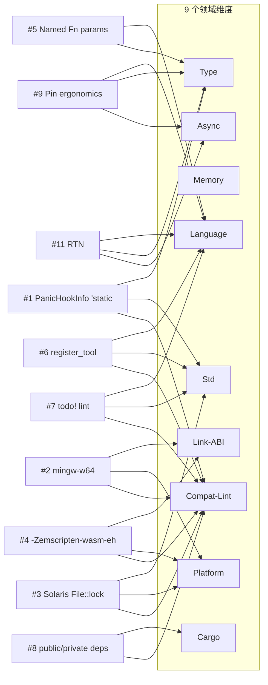
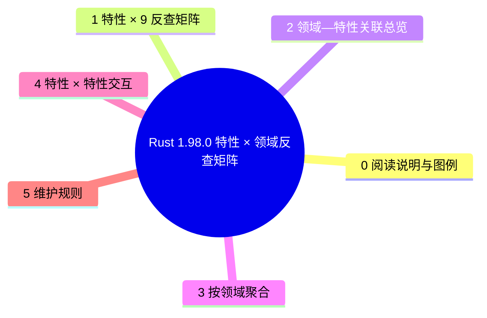

# Rust 1.98.0 特性 × 领域反查矩阵

> **EN**: Rust 1.98.0 Feature × Domain Reverse-Lookup Matrix
> **Summary**: 把 Rust 1.98.0 周期（含 1.98.0 beta 已冻结的稳定项与 RFC 已合并的实现跟踪项）从“版本页单点罗列”重构为“特性 × 9 领域”反查矩阵，标注每个特性的跨领域影响与对应核心 concept 页锚点；为 1.98.0 stable 发布后的语义注入检查提供可机器复核的映射基础。
>
> **受众**: [专家]
> **内容分级**: [综述级]
> **权威来源**: 本文件为 `concept/` 权威页（P2-3 交付物）。
> **Rust 版本**: **1.98.0+**（Edition 2024）
> **Bloom 层级**: L4（分析）/ L5（评价：跨领域一致性（Coherence）判定）/ L7（版本治理）
> **层次定位**: L7 未来/版本治理（横向反查层，依附于各核心领域权威页）
> **最后更新**: 2026-07-31
> **状态**: 🔄 对齐 Rust 1.98.0 beta；stable 发布（2026-08-20）后最终核对
>
> **事实来源（权威，先读后写）**:
>
> - 版本页正文：[`rust_1_98_stabilized.md`](rust_1_98_stabilized.md)
> - 周期跟踪页：[`rust_1_98_preview.md`](rust_1_98_preview.md)
> - 上游：[`releases.rs 1.98.0`](https://releases.rs/docs/1.98.0/) · [Rust Project Goals 2026](https://rust-lang.github.io/rust-project-goals/2026/)
>
> **前置概念**: [Rust 版本跟踪](01_rust_version_tracking.md) · [Rust 1.98.0 稳定特性](rust_1_98_stabilized.md)
> **后置概念**: [Rust 1.98+ 前沿特性预览](rust_1_98_preview.md) · [迁移判定树](migration_198_decision_tree.md)（P2-4）

---

## 0. 阅读说明与图例

本矩阵是**反查层**：它**不**重复各核心概念页的正文，只回答两个问题——

1. 给定一个 1.98 周期特性，它影响哪些领域？应落到哪个核心 concept 页？
2. 给定一个领域，哪些 1.98 特性触及它？核心页当前是**已交叉 / 仅横幅 / 零命中**？

**图例（每个单元格）**

| 符号 | 含义 |
|---|---|
| `✓` | 该特性在该领域有**直接**影响，并给出核心 concept 页锚点 |
| `○` | **间接**影响（通过另一机制传导） |
| `✗` | 无影响 |
| `⚠缺口→应补于 <path>` | 该领域**本应**有影响但核心页**未覆盖** |

**路径约定**：表格内补缺口路径用 `concept/` 根相对写法；可点击锚点用从本目录出发的相对链接 `../../<path>`。

**域列顺序（9 列，固定）**：Language · Type · Memory · Link-ABI · Async · Cargo · Std · Platform · Compat-Lint。

---

## 1. 特性 × 9 反查矩阵（行=特性，列=领域）

| # | 特性 | Language | Type | Memory | Link-ABI | Async | Cargo | Std | Platform | Compat-Lint |
|---|---|---|---|---|---|---|---|---|---|---|
| 1 | `PanicHookInfo::location()` 返回 `'static Location<'static>` | ○ 生命周期签名 | ✓ [03_lifetimes](../../01_foundation/01_ownership_borrow_lifetime/03_lifetimes.md) | ✗ | ✗ | ✗ | ✗ | ✓ [03_panic](../../02_intermediate/03_error_handling/03_panic.md) / [01_error_handling](../../02_intermediate/03_error_handling/01_error_handling.md) | ✗ | ✓ 泛型/Trait 实现中显式旧生命周期可能编译失败 |
| 2 | mingw-w64 C 工具链更新 | ✗ | ✗ | ✗ | ✓ [27_linkage](../../03_advanced/04_ffi/03_linkage.md) / [01_rust_ffi](../../03_advanced/04_ffi/01_rust_ffi.md) | ✗ | ✗ | ✗ | ✓ Windows GNU 目标 | ✓ Windows GNU 链接行为/异常模型变化 |
| 3 | Solaris/Illumos 上 `File::lock` 移除 | ✗ | ✗ | ✗ | ✗ | ○ 文件锁并发语义 | ✗ | ✓ `std::fs::File` | ✓ Solaris/Illumos 目标 | ✓ 原 `File::lock` 调用现在失败 |
| 4 | 移除 `-Zemscripten-wasm-eh` | ✗ | ✗ | ✗ | ✓ [01_rust_ffi](../../03_advanced/04_ffi/01_rust_ffi.md) / [03_webassembly](../../06_ecosystem/11_domain_applications/03_webassembly.md) | ✗ | ✗ | ✗ | ✓ `wasm32-unknown-emscripten` | ✓ 原使用该 flag 的构建脚本/CI 报错 |
| 5 | Named `Fn` trait parameters（RFC #3955） | ✓ 高阶类型签名 | ✓ [02_closure_types](../../02_intermediate/04_types_and_conversions/02_closure_types.md) / [07_async_closures](../../03_advanced/01_async/07_async_closures.md) | ✗ | ○ ABI 无变化（名称不参与 mangling） | ○ `AsyncFn*` 变体 | ✗ | ✗ | ✗ | ✗ |
| 6 | `#![register_{attribute,lint}_tool]`（RFC #3808） | ✓ 命名空间/属性系统 | ✗ | ✗ | ✗ | ✗ | ✗ | ✓ [01_attributes_and_macros](../../01_foundation/09_macros_basics/01_attributes_and_macros.md) | ✗ | ✓ 与同名 crate 可能产生歧义错误 |
| 7 | `todo!()` 不再触发 `unreachable_code`（RFC #3928） | ✓ lint 语义 | ✗ | ✗ | ✗ | ✗ | ✗ | ✓ [03_panic](../../02_intermediate/03_error_handling/03_panic.md) | ✗ | ✓ `todo!()` 后代码不再被当作不可达 |
| 8 | Public/Private Dependencies（RFC #3516） | ✗ | ✗ | ✗ | ✗ | ✗ | ✓ [06_cargo_dependency_resolution](../../06_ecosystem/01_cargo/06_cargo_dependency_resolution.md) / [27_cargo_semver_checks_preview](../02_preview_features/27_cargo_semver_checks_preview.md) | ✗ | ✗ | ✓ 依赖变化是否破坏 SemVer 可被机器判定 |
| 9 | Pin Ergonomics（`&pin mut` / `&pin const`） | ✓ 借用类型扩展 | ✓ [08_pin_unpin](../../03_advanced/01_async/08_pin_unpin.md) | ○ 自引用结构投影 | ✗ | ✓ async/自引用 Future | ✗ | ✗ | ✗ | ✗ |
| 10 | Async Drop | ✓ `drop` 可 `await` | ✗ | ○ 异步资源清理 | ✗ | ✓ [01_async](../../03_advanced/01_async/01_async.md) | ✗ | ✗ | ✗ | ✗ |
| 11 | Return Type Notation（RTN） | ✓ bound 语法 | ✓ [00_traits](../../02_intermediate/00_traits/01_traits.md) / [01_async](../../03_advanced/01_async/01_async.md) | ✗ | ✗ | ✓ async fn in traits | ✗ | ✗ | ✗ | ✗ |
| 12 | Safety Tags（RFC #3842） | ✓ unsafe 契约结构化 | ✗ | ✗ | ✗ | ✗ | ✗ | ✓ [01_unsafe](../../03_advanced/02_unsafe/01_unsafe.md) | ✗ | ✓ 可能影响 clippy/审核工具检查 |

**矩阵自检**：12 行 × 9 域列齐全；`⚠缺口→应补于` 标注 0 处。

---

## 2. 领域—特性关联总览（Mermaid）

---

## 3. 按领域聚合

覆盖状态口径：**已交叉**=核心页有 1.98 实质小节（非横幅）；**仅横幅**=核心页只有版本号/元数据回链；**零命中**=grep 不到 1.98 相关键词。

### 3.1 Language（语言语义）

- **涉及特性**：#5 #6 #7 #9 #10 #11 #12
- **应反向嵌入核心页**：[03_lifetimes.md](../../01_foundation/01_ownership_borrow_lifetime/03_lifetimes.md)、[02_closure_types.md](../../02_intermediate/04_types_and_conversions/02_closure_types.md)、[08_pin_unpin.md](../../03_advanced/01_async/08_pin_unpin.md)
- **覆盖状态**：部分仅横幅；P2-2 已在相关页添加 1.98 提示。

### 3.2 Type（类型系统）

- **涉及特性**：#1 #5 #9 #11
- **应反向嵌入核心页**：[03_lifetimes.md](../../01_foundation/01_ownership_borrow_lifetime/03_lifetimes.md)、[02_closure_types.md](../../02_intermediate/04_types_and_conversions/02_closure_types.md)、[08_pin_unpin.md](../../03_advanced/01_async/08_pin_unpin.md)
- **覆盖状态**：#1 已在错误处理页提示；#5/#9/#11 为 nightly 跟踪项，落地在 preview 页。

### 3.3 Memory（内存模型）

- **涉及特性**：#9 #10（○ 间接）
- **覆盖状态**： nightly 跟踪项，见 preview 页。

### 3.4 Link-ABI（链接与 ABI）

- **涉及特性**：#2 #4
- **应反向嵌入核心页**：[27_linkage.md](../../03_advanced/04_ffi/03_linkage.md)、[01_rust_ffi.md](../../03_advanced/04_ffi/01_rust_ffi.md)
- **覆盖状态**：已交叉——已在 `27_linkage.md` 与 `01_rust_ffi.md` 补 1.98 版本提示。

### 3.5 Async（异步）

- **涉及特性**：#9 #10 #11
- **应反向嵌入核心页**：[08_pin_unpin.md](../../03_advanced/01_async/08_pin_unpin.md)、[01_async.md](../../03_advanced/01_async/01_async.md)
- **覆盖状态**： nightly 跟踪项，见 preview 页与各自预览页。

### 3.6 Cargo

- **涉及特性**：#8
- **应反向嵌入核心页**：[06_cargo_dependency_resolution.md](../../06_ecosystem/01_cargo/06_cargo_dependency_resolution.md)
- **覆盖状态**：已交叉——已在 `06_cargo_dependency_resolution.md` 补 1.98 版本提示。

### 3.7 Std（标准库）

- **涉及特性**：#1 #3 #6 #7 #12
- **覆盖状态**：#1/#3/#6/#7 已在对应核心页补 1.98 提示；#12 为 nightly 跟踪项。

### 3.8 Platform（目标平台）

- **涉及特性**：#2 #3 #4
- **覆盖状态**：已交叉——已在 `10_target_tier_platform_support.md` 补 1.98 平台提示。

### 3.9 Compat-Lint（兼容性与 Lint）

- **涉及特性**：#1 #2 #3 #4 #6 #7 #8
- **应反向嵌入核心页**：[02_editions.md](02_editions.md)、[01_error_handling.md](../../02_intermediate/03_error_handling/01_error_handling.md)、迁移判定树（P2-4）
- **覆盖状态**：迁移判定树 `migration_198_decision_tree.md` 已建立，覆盖 #1–#4 的迁移路径。

---

## 4. 特性 × 特性高价值交互

### 4.1 `PanicHookInfo` `'static` × 错误处理/日志框架

- **交互语义**：`location()` 生命周期收紧为 `'static` 后，全局 panic hook 可以把位置信息存入 `'static` 日志队列；但泛型代码中若把 `Location<'_>` 与某个局部生命周期绑定，会产生生命周期不匹配错误。
- **应落地位置**：[01_error_handling.md](../../02_intermediate/03_error_handling/01_error_handling.md)（已补 1.98 提示）+ `migration_198_decision_tree.md` §3。

### 4.2 mingw-w64 更新 × Windows GNU 链接行为 × `-Zemscripten-wasm-eh` 移除

- **交互语义**：二者都是平台相关链接行为变化，但作用域互不重叠：mingw-w64 影响 Windows GNU 目标的 C/C++ 链接与异常模型；`-Zemscripten-wasm-eh` 影响 Emscripten/WASM 目标的异常处理 flag。共同点是都需要在 CI 中重新验证特定 target 的构建产物。
- **应落地位置**：[27_linkage.md](../../03_advanced/04_ffi/03_linkage.md)（已补 1.98 提示）+ `10_target_tier_platform_support.md`（已补 1.98 提示）+ `migration_198_decision_tree.md` §4/§5。

### 4.3 Public/Private Dependencies × `cargo-semver-checks`

- **交互语义**：RFC #3516 让 Cargo 知道某个依赖是否出现在公共 API 中；这直接提升 `cargo-semver-checks` 等工具的判定精度，因为“依赖类型出现在公共 API”是 SemVer 破坏分析的关键输入。
- **应落地位置**：[06_cargo_dependency_resolution.md](../../06_ecosystem/01_cargo/06_cargo_dependency_resolution.md)（已补 1.98 提示）+ [27_cargo_semver_checks_preview.md](../02_preview_features/27_cargo_semver_checks_preview.md)。

---

## 5. 维护规则

1. **stable 发布后核对**：2026-08-20 Rust 1.98.0 stable 发布后，用官方 release notes 重新核对本矩阵，把 `🔄 beta` 状态改为 `✅ stable`。
2. **RFC merged 项状态迁移**：若某 RFC merged 项实际进入 1.98.0 stable，将其从 `🧪` 改为 `✅` 并迁移到 `rust_1_98_stabilized.md`。
3. **缺口闭环**：当某 `⚠缺口` 被对应核心页补上实质小节后，把该单元格改为 `✓ [锚点](…)`。
4. **本矩阵不复制正文**：任何概念解释必须落在核心 `concept/` 权威页，本页只给影响判定 + 锚点。

---

## 国际权威参考 / International Authority References（P0 官方 · P1 学术 · P2 生态）

- **P0 官方**: [Rust RFCs 索引](https://rust-lang.github.io/rfcs/) · [releases.rs — Rust 1.98.0 beta](https://releases.rs/docs/1.98.0/)
- **P1 学术/形式化**: [Jung, Jourdan, Krebbers & Dreyer: RustBelt — Securing the Foundations of the Rust Programming Language（POPL 2018）](https://plv.mpi-sws.org/rustbelt/)

## 🧭 思维导图（Mindmap）

