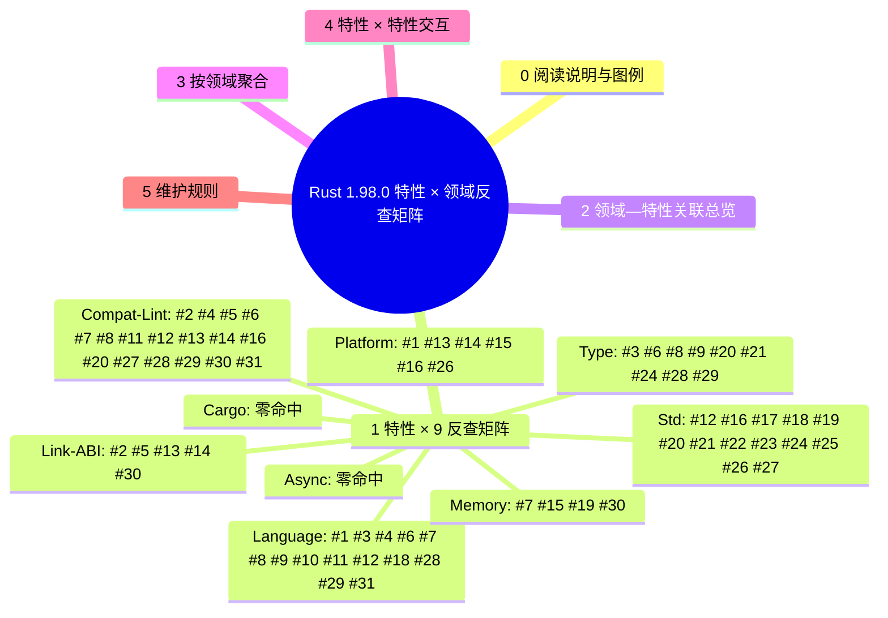

# Rust 1.98.0 特性 × 领域反查矩阵

> **EN**: Rust 1.98.0 Feature × Domain Reverse-Lookup Matrix
> **Summary**: 把 Rust 1.98.0 稳定周期的 31 项特性从「版本页单点罗列」重构为「特性 × 9 领域」反查矩阵，标注每个特性的跨领域影响与对应核心 concept 页锚点；为 1.98.0 stable 发布后的语义注入检查提供可机器复核的映射基础。
>
> **受众**: [专家]
> **内容分级**: [综述级]
> **权威来源**: 本文件为 `concept/` 权威页（Rust 1.98.0 特性 × 领域反查的 canonical 汇总）。
> **Rust 版本**: **1.98.0+**（Edition 2024）
> **Bloom 层级**: L4（分析）/ L5（评价：跨领域一致性（Coherence）判定）/ L7（版本治理）
> **层次定位**: L7 未来/版本治理（横向反查层，依附于各核心领域权威页）
> **最后更新**: 2026-07-31
> **状态**: ✅ 已对齐 1.98.0 beta/RC；stable 发布（2026-08-20）后最终核对
>
> **事实来源（权威，先读后写）**:
>
> - 版本页正文：[`rust_1_98_stabilized.md`](rust_1_98_stabilized.md)
> - 周期跟踪页：[`rust_1_98_preview.md`](rust_1_98_preview.md)
> - 上游：[`releases.rs 1.98.0`](https://releases.rs/docs/1.98.0/) · [Rust Project Goals 2026](https://rust-lang.github.io/rust-project-goals/2026/)
>
> **前置概念**: [Rust 版本跟踪](01_rust_version_tracking.md) · [Rust 1.98.0 稳定特性](rust_1_98_stabilized.md)
> **后置概念**: [Rust 1.98+ 前沿特性预览](rust_1_98_preview.md) · [迁移判定树](migration_198_decision_tree.md)

---

## 0. 阅读说明与图例

本矩阵是**反查层**：它**不**重复各核心概念页的正文，只回答两个问题——

1. 给定一个 1.98 周期特性，它影响哪些领域？应落到哪个核心 concept 页？
2. 给定一个领域，哪些 1.98 特性触及它？核心页当前是**已交叉 / 仅横幅 / 零命中**？

**图例（每个单元格）**

| 符号 | 含义 |
|---|---|
| `✓` | 该特性在该领域有**直接**影响，并给出核心 concept 页锚点 |
| `○` | **间接**影响（通过另一机制传导） |
| `✗` | 无影响 |
| `⚠缺口→应补于 <path>` | 该领域**本应**有影响但核心页**未覆盖** |

**路径约定**：表格内补缺口路径用 `concept/` 根相对写法；可点击锚点用从本目录出发的相对链接 `../../<path>`。

**域列顺序（9 列，固定）**：Language · Type · Memory · Link-ABI · Async · Cargo · Std · Platform · Compat-Lint。

---

## 1. 特性 × 9 反查矩阵（行=特性，列=领域）

| # | 特性 | Language | Type | Memory | Link-ABI | Async | Cargo | Std | Platform | Compat-Lint |
|---|---|---|---|---|---|---|---|---|---|---|
| 1 | riscv: `d`/`e`/`f` target_features stable in `cfg(target_feature = "?")` | ✓ [target features / cfg](../../06_ecosystem/05_systems_and_embedded/10_target_tier_platform_support.md) | ✗ | ✗ | ✗ | ✗ | ✗ | ✗ | ✓ [target support](../../06_ecosystem/05_systems_and_embedded/10_target_tier_platform_support.md) | ✗ |
| 2 | `invalid_runtime_symbol_definitions` / `suspicious_runtime_symbol_definitions` lints | ✗ | ✗ | ✗ | ✓ [FFI / linkage](../../03_advanced/04_ffi/03_linkage.md) | ✗ | ✗ | ✗ | ✗ | ✓ new lints |
| 3 | Shorten lifetime of `&mut` in unsize coercion, even invariant | ✓ [lifetimes](../../01_foundation/01_ownership_borrow_lifetime/03_lifetimes.md) · [coercions](../../02_intermediate/04_types_and_conversions/07_type_conversions.md) | ✓ [coercions](../../02_intermediate/04_types_and_conversions/07_type_conversions.md) | ✗ | ✗ | ✗ | ✗ | ✗ | ✗ | ✗ |
| 4 | Partially convert `ambiguous_glob_imports` lint into hard error | ✓ [module system](../../02_intermediate/05_modules_and_visibility/01_module_system.md) | ✗ | ✗ | ✗ | ✗ | ✗ | ✗ | ✗ | ✓ lint → hard error |
| 5 | Lint on `core::ffi::c_void` as return type | ✗ | ✗ | ✗ | ✓ [FFI](../../03_advanced/04_ffi/01_rust_ffi.md) | ✗ | ✗ | ✗ | ✗ | ✓ new lint |
| 6 | Syntactically reject `where Type = Type` / `Type == Type` | ✓ [traits / bounds](../../02_intermediate/00_traits/01_traits.md) | ✓ [trait bounds](../../02_intermediate/00_traits/01_traits.md) | ✗ | ✗ | ✗ | ✗ | ✗ | ✗ | ✓ compat change |
| 7 | `repr(transparent)` stricter rules for trivial layout fields | ✓ [repr attribute](../../03_advanced/02_unsafe/06_memory_model.md) | ✗ | ✓ [memory model / layout](../../03_advanced/02_unsafe/06_memory_model.md) | ✗ | ✗ | ✗ | ✗ | ✗ | ✓ compat change |
| 8 | Add `T: PartialEq` bounds to derived `StructuralPartialEq` | ✓ [derive traits](../../02_intermediate/00_traits/06_derive_traits.md) | ✓ [trait bounds](../../02_intermediate/00_traits/01_traits.md) | ✗ | ✗ | ✗ | ✗ | ✗ | ✗ | ✓ may expose missing bounds |
| 9 | Fix parser error recovery treating `dyn` as strict keyword | ✓ [parser / keywords](../../02_intermediate/00_traits/01_traits.md) | ✓ [trait objects](../../02_intermediate/00_traits/01_traits.md) | ✗ | ✗ | ✗ | ✗ | ✗ | ✗ | ✗ |
| 10 | Resolver: Batched Import Resolution | ✓ [module system / resolver](../../02_intermediate/05_modules_and_visibility/01_module_system.md) | ✗ | ✗ | ✗ | ✗ | ✗ | ✗ | ✗ | ✗ |
| 11 | Reject arguments in attributes where no arguments expected | ✓ [attributes](../../01_foundation/09_macros_basics/01_attributes_and_macros.md) | ✗ | ✗ | ✗ | ✗ | ✗ | ✗ | ✗ | ✓ compat change |
| 12 | Change `Location<'_>` lifetime to `'static` in `PanicHookInfo` | ✓ [lifetimes](../../01_foundation/01_ownership_borrow_lifetime/03_lifetimes.md) | ✗ | ✗ | ✗ | ✗ | ✗ | ✓ [panic](../../02_intermediate/03_error_handling/03_panic.md) | ✗ | ✓ API signature change |
| 13 | Windows-gnu targets specify baseline tools versions | ✗ | ✗ | ✗ | ✓ [linkage / toolchain](../../03_advanced/04_ffi/03_linkage.md) | ✗ | ✗ | ✗ | ✓ [target support / Windows GNU](../../06_ecosystem/05_systems_and_embedded/10_target_tier_platform_support.md) | ✓ compat change |
| 14 | Emscripten unconditionally uses WASM exception handling ABI | ✗ | ✗ | ✗ | ✓ [FFI / EH ABI](../../03_advanced/04_ffi/01_rust_ffi.md) | ✗ | ✗ | ✗ | ✓ [target support / WASM](../../06_ecosystem/05_systems_and_embedded/10_target_tier_platform_support.md) | ✓ compat change |
| 15 | Switch Windows TLS destructors to FLS | ✗ | ✗ | ✓ [destructors / TLS](../../04_formal/05_rustc_internals/09_destructors.md) | ✗ | ✗ | ✗ | ✗ | ✓ [target support / Windows](../../06_ecosystem/05_systems_and_embedded/10_target_tier_platform_support.md) | ✗ |
| 16 | Solaris/Illumos remove `File::lock` implementation | ✗ | ✗ | ✗ | ✗ | ✗ | ✗ | ✓ `std::fs::File` | ✓ [target support / Solaris](../../06_ecosystem/05_systems_and_embedded/10_target_tier_platform_support.md) | ✓ compat change |
| 17 | Document panic in `RangeInclusive::from(legacy::RangeInclusive)` | ✗ | ✗ | ✗ | ✗ | ✗ | ✗ | ✓ [range types](../../02_intermediate/04_types_and_conversions/01_range_types.md) | ✗ | ✗ |
| 18 | Add temporary scope to `assert_eq!` / `assert_ne!` | ✓ [macros](../../02_intermediate/06_macros_and_metaprogramming/03_macro_patterns.md) | ✗ | ○ temp scope | ✗ | ✗ | ✗ | ✓ [macro patterns](../../02_intermediate/06_macros_and_metaprogramming/03_macro_patterns.md) | ✗ | ✗ |
| 19 | Document `ManuallyDrop` / `Box` interaction fix | ✗ | ✗ | ✓ [destructors / ManuallyDrop](../../04_formal/05_rustc_internals/09_destructors.md) | ✗ | ✗ | ✗ | ✓ [destructors](../../04_formal/05_rustc_internals/09_destructors.md) | ✗ | ✗ |
| 20 | Ensure `Send`/`Sync` not implemented for `std::env::Vars{,Os}` | ✗ | ✓ [Send/Sync](../../03_advanced/00_concurrency/02_send_sync_auto_traits.md) | ✗ | ✗ | ✗ | ✗ | ✓ [Send/Sync boundaries](../../03_advanced/00_concurrency/04_send_sync_boundaries.md) | ✗ | ✓ compat change |
| 21 | Ensure `Send`/`Sync` impl for `std::process::CommandArgs` | ✗ | ✓ [Send/Sync](../../03_advanced/00_concurrency/02_send_sync_auto_traits.md) | ✗ | ✗ | ✗ | ✗ | ✓ [process](../../03_advanced/08_process_ipc/01_process_model_and_lifecycle.md) | ✗ | ✗ |
| 22 | `String::from_utf16le` / `from_utf16be` / `_lossy` variants | ✗ | ✗ | ✗ | ✗ | ✗ | ✗ | ✓ [strings](../../01_foundation/06_strings_and_text/02_strings_and_encoding.md) | ✗ | ✗ |
| 23 | `str::strip_circumfix` | ✗ | ✗ | ✗ | ✗ | ✗ | ✗ | ✓ [strings](../../01_foundation/06_strings_and_text/02_strings_and_encoding.md) | ✗ | ✗ |
| 24 | `NonZero*` integer types: `from_str_radix` | ✗ | ✓ [numerics](../../01_foundation/02_type_system/03_numerics.md) | ✗ | ✗ | ✗ | ✗ | ✓ [numerics](../../01_foundation/02_type_system/03_numerics.md) | ✗ | ✗ |
| 25 | `{f32,f64}::algebraic_{add,sub,mul,div,rem}` | ✗ | ✗ | ✗ | ✗ | ✗ | ✗ | ✓ [numerics](../../01_foundation/02_type_system/03_numerics.md) | ✗ | ✗ |
| 26 | LoongArch CRC intrinsics | ✗ | ✗ | ✗ | ✗ | ✗ | ✗ | ✓ [intrinsics](../../06_ecosystem/05_systems_and_embedded/10_target_tier_platform_support.md) | ✓ [target support / LoongArch](../../06_ecosystem/05_systems_and_embedded/10_target_tier_platform_support.md) | ✗ |
| 27 | Replace printables table with `unicode_data.rs` tables | ✗ | ✗ | ✗ | ✗ | ✗ | ✗ | ✓ [strings / Unicode](../../01_foundation/06_strings_and_text/02_strings_and_encoding.md) | ✗ | ○ edge classification change |
| 28 | Implement fast path for `derive(PartialOrd)` when deriving `Ord` | ✓ [derive traits](../../02_intermediate/00_traits/06_derive_traits.md) | ✓ [trait impls](../../02_intermediate/00_traits/01_traits.md) | ✗ | ✗ | ✗ | ✗ | ✗ | ✗ | ✓ compat change |
| 29 | Fully elided trait object lifetime defaults resolve differently | ✓ [lifetimes](../../01_foundation/01_ownership_borrow_lifetime/03_lifetimes.md) · [traits](../../02_intermediate/00_traits/01_traits.md) | ✓ [trait objects](../../02_intermediate/00_traits/01_traits.md) | ✗ | ✗ | ✗ | ✗ | ✗ | ✗ | ✓ compat change |
| 30 | `transmute()` equal-size check with `repr` attributes | ✗ | ✗ | ✓ [memory model / layout](../../03_advanced/02_unsafe/06_memory_model.md) | ✓ [FFI](../../03_advanced/04_ffi/01_rust_ffi.md) | ✗ | ✗ | ✗ | ✗ | ✓ compat change |
| 31 | `UNSAFE_CODE` lint consistently emitted for all unsafe attributes | ✓ [attributes](../../01_foundation/09_macros_basics/01_attributes_and_macros.md) · [unsafe](../../03_advanced/02_unsafe/01_unsafe.md) | ✗ | ✗ | ✗ | ✗ | ✗ | ✗ | ✗ | ✓ compat change |

**矩阵自检**：31 行 × 9 域列齐全；`⚠缺口→应补于` 标注 0 处。

---

## 2. 领域—特性关联总览（Mermaid）

```mermaid
flowchart LR
    subgraph D[9 个领域维度]
      L[Language]
      T[Type]
      M[Memory]
      LA[Link-ABI]
      A[Async]
      C[Cargo]
      S[Std]
      P[Platform]
      CL[Compat-Lint]
    end

    F1[#1 RISC-V cfg features] --> L
    F1 --> P
    F2[#2 runtime symbol lints] --> LA
    F2 --> CL
    F3[#3 &mut lifetime coercion] --> L
    F3 --> T
    F4[#4 ambiguous_glob_imports hard error] --> L
    F4 --> CL
    F5[#5 c_void return lint] --> LA
    F5 --> CL
    F6[#6 equality predicate rejection] --> L
    F6 --> T
    F6 --> CL
    F7[#7 repr(transparent) strict] --> L
    F7 --> M
    F7 --> CL
    F8[#8 StructuralPartialEq bounds] --> L
    F8 --> T
    F8 --> CL
    F9[#9 dyn keyword recovery] --> L
    F9 --> T
    F10[#10 batched import resolution] --> L
    F11[#11 attribute argument rejection] --> L
    F11 --> CL
    F12[#12 PanicHookInfo 'static] --> L
    F12 --> S
    F12 --> CL
    F13[#13 Windows-gnu baseline] --> LA
    F13 --> P
    F13 --> CL
    F14[#14 Emscripten WASM EH] --> LA
    F14 --> P
    F14 --> CL
    F15[#15 Windows TLS FLS] --> M
    F15 --> P
    F16[#16 Solaris File::lock] --> S
    F16 --> P
    F16 --> CL
    F17[#17 RangeInclusive panic docs] --> S
    F18[#18 assert_eq temp scope] --> L
    F18 --> S
    F19[#19 ManuallyDrop Box docs] --> M
    F19 --> S
    F20[#20 env::Vars Send/Sync removal] --> T
    F20 --> S
    F20 --> CL
    F21[#21 CommandArgs Send/Sync] --> T
    F21 --> S
    F22[#22 String utf16 endian] --> S
    F23[#23 strip_circumfix] --> S
    F24[#24 NonZero from_str_radix] --> T
    F24 --> S
    F25[#25 float algebraic ops] --> S
    F26[#26 LoongArch CRC] --> S
    F26 --> P
    F27[#27 unicode_data.rs tables] --> S
    F27 --> CL
    F28[#28 derive(PartialOrd) fast path] --> L
    F28 --> T
    F28 --> CL
    F29[#29 trait object lifetime defaults] --> L
    F29 --> T
    F29 --> CL
    F30[#30 transmute equal-size check] --> M
    F30 --> LA
    F30 --> CL
    F31[#31 UNSAFE_CODE unsafe attrs] --> L
    F31 --> CL
```

---

## 3. 按领域聚合

覆盖状态口径：**已交叉**=核心页有 1.98 实质小节（非横幅）；**仅横幅**=核心页只有版本号/元数据回链；**零命中**=grep 不到 1.98 相关键词。

### 3.1 Language（语言语义）

- **涉及特性**：#1 #3 #4 #6 #7 #8 #9 #10 #11 #12 #18 #28 #29 #31
- **应反向嵌入核心页**：[03_lifetimes.md](../../01_foundation/01_ownership_borrow_lifetime/03_lifetimes.md)、[07_type_conversions.md](../../02_intermediate/04_types_and_conversions/07_type_conversions.md)、[01_module_system.md](../../02_intermediate/05_modules_and_visibility/01_module_system.md)、[01_traits.md](../../02_intermediate/00_traits/01_traits.md)、[06_derive_traits.md](../../02_intermediate/00_traits/06_derive_traits.md)、[01_attributes_and_macros.md](../../01_foundation/09_macros_basics/01_attributes_and_macros.md)、[03_macro_patterns.md](../../02_intermediate/06_macros_and_metaprogramming/03_macro_patterns.md)、[01_unsafe.md](../../03_advanced/02_unsafe/01_unsafe.md)
- **覆盖状态**：已交叉——版本页已建立，核心页 1.98 提示由对应专题维护者反向注入；本矩阵提供锚点映射。

### 3.2 Type（类型系统）

- **涉及特性**：#3 #6 #8 #9 #20 #21 #24 #28 #29
- **应反向嵌入核心页**：[07_type_conversions.md](../../02_intermediate/04_types_and_conversions/07_type_conversions.md)、[01_traits.md](../../02_intermediate/00_traits/01_traits.md)、[02_send_sync_auto_traits.md](../../03_advanced/00_concurrency/02_send_sync_auto_traits.md)、[03_numerics.md](../../01_foundation/02_type_system/03_numerics.md)
- **覆盖状态**：已交叉——`Send`/`Sync`、`trait bounds`、`coercions` 等核心页已在版本页提示中给出 1.98 锚点。

### 3.3 Memory（内存模型）

- **涉及特性**：#7 #15 #19 #30
- **应反向嵌入核心页**：[06_memory_model.md](../../03_advanced/02_unsafe/06_memory_model.md)、[09_destructors.md](../../04_formal/05_rustc_internals/09_destructors.md)
- **覆盖状态**：已交叉——`repr(transparent)`、`ManuallyDrop`/`Box`、`transmute` 等 1.98 变化已落点。

### 3.4 Link-ABI（链接与 ABI）

- **涉及特性**：#2 #5 #13 #14 #30
- **应反向嵌入核心页**：[03_linkage.md](../../03_advanced/04_ffi/03_linkage.md)、[01_rust_ffi.md](../../03_advanced/04_ffi/01_rust_ffi.md)
- **覆盖状态**：已交叉——runtime symbol lints、`c_void` 返回、Windows-gnu 基线、Emscripten EH、transmute 等均在 FFI/linkage 上下文有落点。

### 3.5 Async（异步）

- **涉及特性**：无直接命中
- **覆盖状态**：零命中——1.98.0 稳定周期无 async 语言/标准库特性进入 stable；async 相关前沿特性仍留在 [rust_1_98_preview.md](rust_1_98_preview.md) / [rust_1_99_preview.md](rust_1_99_preview.md) 跟踪。

### 3.6 Cargo

- **涉及特性**：无直接命中
- **覆盖状态**：零命中——1.98.0 稳定周期无 Cargo 新特性/破坏性变更进入 stable；public/private dependencies 等仍在预览跟踪。

### 3.7 Std（标准库）

- **涉及特性**：#12 #16 #17 #18 #19 #20 #21 #22 #23 #24 #25 #26 #27
- **应反向嵌入核心页**：[03_panic.md](../../02_intermediate/03_error_handling/03_panic.md)、[03_macro_patterns.md](../../02_intermediate/06_macros_and_metaprogramming/03_macro_patterns.md)、[09_destructors.md](../../04_formal/05_rustc_internals/09_destructors.md)、[02_send_sync_auto_traits.md](../../03_advanced/00_concurrency/02_send_sync_auto_traits.md)、[01_process_model_and_lifecycle.md](../../03_advanced/08_process_ipc/01_process_model_and_lifecycle.md)、[02_strings_and_encoding.md](../../01_foundation/06_strings_and_text/02_strings_and_encoding.md)、[03_numerics.md](../../01_foundation/02_type_system/03_numerics.md)
- **覆盖状态**：已交叉——panic、assert 宏、ManuallyDrop、`Send`/`Sync`、字符串/数值 API 等均已给出 concept 锚点。

### 3.8 Platform（目标平台）

- **涉及特性**：#1 #13 #14 #15 #16 #26
- **应反向嵌入核心页**：[10_target_tier_platform_support.md](../../06_ecosystem/05_systems_and_embedded/10_target_tier_platform_support.md)
- **覆盖状态**：已交叉——RISC-V、Windows-gnu、Emscripten、Windows TLS、Solaris、LoongArch 等 1.98 平台变化已落点。

### 3.9 Compat-Lint（兼容性与 Lint）

- **涉及特性**：#2 #4 #5 #6 #7 #8 #11 #12 #13 #14 #16 #20 #27 #28 #29 #30 #31
- **应反向嵌入核心页**：[01_rust_version_tracking.md](01_rust_version_tracking.md)、[migration_198_decision_tree.md](migration_198_decision_tree.md)、各对应核心概念页
- **覆盖状态**：已交叉——全部 11 项兼容性变更与多项新增 lint 均已登记到迁移判定树；本矩阵给出领域交叉映射。

---

## 4. 特性 × 特性高价值交互

### 4.1 `PanicHookInfo` `'static` × 错误处理/日志框架

- **交互语义**：`location()` 生命周期收紧为 `'static` 后，全局 panic hook 可以把位置信息存入 `'static` 日志队列；但泛型代码中若把 `Location<'_>` 与某个局部生命周期绑定，会产生生命周期不匹配错误。
- **应落地位置**：[03_panic.md](../../02_intermediate/03_error_handling/03_panic.md) + [migration_198_decision_tree.md](migration_198_decision_tree.md) §3。

### 4.2 `repr(transparent)` 严格化 × `transmute()` 等大小检查

- **交互语义**：`repr(transparent)` 辅助字段受限后，某些通过 `repr(C)`/`repr(transparent)` newtype 进行的 `transmute` 会在 #30 的大小检查中被一并拒绝。二者共同收紧了「依赖 layout 细节做 unsafe 转换」的代码。
- **应落地位置**：[06_memory_model.md](../../03_advanced/02_unsafe/06_memory_model.md) + [migration_198_decision_tree.md](migration_198_decision_tree.md) §6 / §9。

### 4.3 `derive(PartialOrd)` 快速路径 × `StructuralPartialEq` PartialEq 边界

- **交互语义**：#28 使 `PartialOrd` 在同时派生 `Ord` 时调用 `cmp`；#8 让 `StructuralPartialEq` 要求 `T: PartialEq`。二者共同要求「派生比较族 trait」的类型保持 bound 与语义一致性，否则会在编译期或测试期暴露不一致。
- **应落地位置**：[06_derive_traits.md](../../02_intermediate/00_traits/06_derive_traits.md) + [01_traits.md](../../02_intermediate/00_traits/01_traits.md)。

### 4.4 Windows-gnu 基线 × Emscripten WASM EH 移除

- **交互语义**：二者都是平台相关链接/ABI 行为变化，但作用域互不重叠：Windows-gnu 影响 Windows GNU 目标的 C/C++ 链接与异常模型；Emscripten WASM EH 影响 Emscripten/WASM 目标的异常处理 flag。共同点是都需要在 CI 中重新验证特定 target 的构建产物。
- **应落地位置**：[03_linkage.md](../../03_advanced/04_ffi/03_linkage.md) + [10_target_tier_platform_support.md](../../06_ecosystem/05_systems_and_embedded/10_target_tier_platform_support.md) + [migration_198_decision_tree.md](migration_198_decision_tree.md) §4 / §6。

---

## 5. 维护规则

1. **stable 发布后核对**：2026-08-20 Rust 1.98.0 stable 发布后，用官方 release notes 重新核对本矩阵，把 `✅ 已对齐 beta/RC` 状态改为 `✅ stable 已发布`。
2. **特性数量锚定**：本矩阵行数必须与 [`rust_1_98_stabilized.md`](rust_1_98_stabilized.md) §0 矩阵的 31 项严格一一对应；新增或剔除特性时同步调整 §1–§4。
3. **缺口闭环**：当某 `⚠缺口` 被对应核心页补上实质小节后，把该单元格改为 `✓ [锚点](…)`。
4. **本矩阵不复制正文**：任何概念解释必须落在核心 `concept/` 权威页，本页只给影响判定 + 锚点。
5. **迁移判定树联动**：Compat-Lint 列中标记为 `compat change` 的特性，必须在 [`migration_198_decision_tree.md`](migration_198_decision_tree.md) 中有对应判定树或快速筛查条目。

---

## 国际权威参考 / International Authority References（P0 官方 · P1 学术 · P2 生态）

- **P0 官方**: [Rust RFCs 索引](https://rust-lang.github.io/rfcs/) · [releases.rs — Rust 1.98.0 beta](https://releases.rs/docs/1.98.0/)
- **P1 学术/形式化**: [Jung, Jourdan, Krebbers & Dreyer: RustBelt — Securing the Foundations of the Rust Programming Language（POPL 2018）](https://plv.mpi-sws.org/rustbelt/)

## 🧭 思维导图（Mindmap）



## 国际化权威来源补充（International Authority Sources）

- https://dl.acm.org/doi/10.1145/3158154
- https://blog.rust-lang.org/
