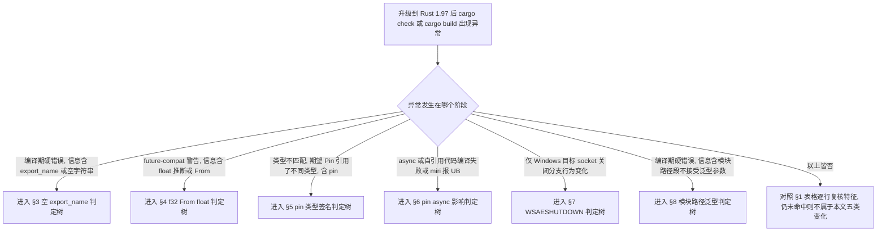

# Rust 1.97 兼容性迁移判定树

**EN**: Rust 1.97 Compatibility Migration Decision Trees
**Summary**: 把 Rust 1.97.0 的兼容性变化从版本页表格提升为可执行的「是否受影响 → 根因 → 具体迁移动作」判定树，覆盖空 `export_name`、`f32: From<{float}>` future-compat、`pin!` 阻止 deref coercion（含 async/自引用影响）、Windows `WSAESHUTDOWN→BrokenPipe`、模块路径段泛型参数拒绝五类场景；每棵树的叶子均为可落地的迁移步骤而非跳出链接。

> **受众**: [进阶] / [专家]
> **内容分级**: [参考级] / [操作级]
> **权威来源**: 本文件为 `concept/` 权威页（Rust 1.97 兼容性**迁移判定**的唯一权威来源）。
> **对应 Rust 版本**: **1.97.0+ (Edition 2024)**
> **Bloom 层级**: L3-L4（应用/分析：将版本变更映射到具体代码修复）
> **A/S/P 标记**: **P** — Process（迁移流程与判定）
> **双维定位**: P×App — 把版本兼容性变更应用到存量代码
> **前置概念**: [Rust 1.97 稳定特性](rust_1_97_stabilized.md) · [Rust 版本跟踪](05_rust_version_tracking.md) · [Pin 与 Unpin](../../03_advanced/01_async/06_pin_unpin.md) · [类型强制与转换](../../01_foundation/02_type_system/14_coercion_and_casting.md) · [ABI](../../04_formal/05_rustc_internals/38_application_binary_interface.md) · [Linkage](../../03_advanced/04_ffi/27_linkage.md)
> **后置概念**: [Rust 1.97 前沿预览](rust_1_97_preview.md) · [Rust 1.98+ 前沿预览](rust_1_98_preview.md)
> **最后更新**: 2026-07-11
> **状态**: ✅ 已对齐 Rust 1.97.0 stable

> **主要来源（事实出处，判定树不引用外部页作为叶子）**:
> · 版本页兼容性表与 §2.6/§2.7/§2.8：[`rust_1_97_stabilized.md`](rust_1_97_stabilized.md)
> · 31 项特性清单（Compatibility 类）：[`reports/RUST_197_CONTENT_GAP_ANALYSIS_2026_07_11.md`](../../../reports/RUST_197_CONTENT_GAP_ANALYSIS_2026_07_11.md)
> · 审计缺口（§2.4、§4 P2-5）：[`reports/GLOBAL_SEMANTIC_CRITICAL_AUDIT_2026_07_11.md`](../../../reports/GLOBAL_SEMANTIC_CRITICAL_AUDIT_2026_07_11.md)
> · `pin!`/coercion 现状：[`06_pin_unpin.md`](../../03_advanced/01_async/06_pin_unpin.md)、[`14_coercion_and_casting.md`](../../01_foundation/02_type_system/14_coercion_and_casting.md)
> · `export_name`/linkage 现状：[`38_application_binary_interface.md`](../../04_formal/05_rustc_internals/38_application_binary_interface.md)、[`27_linkage.md`](../../03_advanced/04_ffi/27_linkage.md)

---

## 0. 本文定位与非目标

**定位**：审计报告（§2.4、§4 P2-5）指出 Rust 1.97 的兼容性变化**只在版本页表格罗列**，缺少「是否受影响 → 如何迁移」的可执行判定树。本文补齐该缺口：每个兼容性变化一节，给出可判定条件、根因节点，以及**具体迁移动作**作为树叶子。

**非目标（避免重复，遵守 AGENTS.md §2 Canonical 规则）**：

- 不重复版本页对已稳定特性的逐项解释（语言/std/Cargo/Rustdoc/平台）。
- 不重复 Pin、coercion、ABI、linkage 的概念推导；本文只给**迁移判定与修复代码**。
- 不在判定树中使用 `[[见某页]]` 作为叶子。交叉引用仅出现在本节元数据、文末来源索引与正文说明中，**不作为任何判定树的终点**。

**阅读顺序**：先看 §1 快速筛查表定位自己命中哪些变化；命中项进入对应 §3–§8，沿判定树走到叶子执行；最后按 §9 维护规则在未来版本追加新树。

---

## 1. 快速筛查表：是否受影响

> 用法：在「受影响代码特征」列匹配你的代码；命中后看「严重度」与「是否需迁移」，再跳到对应小节执行判定树。

| 变化 | 受影响代码特征（命中即需评估） | 严重度 | 是否需迁移 | 小节 |
|:---|:---|:---:|:---:|:---|
| 空 `#[export_name]` 被拒绝 | 存在 `#[export_name = ""]` 或 Edition 2024 的 `#[unsafe(export_name = "")]` | 高（硬错误，无法编译） | 必须 | §3 |
| `f32: From<{float}>` future-compat | 浮点字面量经 `From`/`Into`/泛型约束推断，依赖旧 `{float}`→`f64` 行为 | 中（future-compat 警告，未来变硬错误） | 建议 | §4 |
| `pin!` 不再 deref coerce（类型签名） | `pin!(&mut x)` 后当作 `Pin<&mut T>` 使用 | 高（类型不匹配，无法编译） | 必须 | §5 |
| `pin!` 对 async/自引用代码的影响 | 自引用 Future、手写 `poll`、`Pin<&mut &mut T>` 投影 | 高（编译失败或潜在 UB） | 必须 | §6 |
| Windows `WSAESHUTDOWN→BrokenPipe` | 在 Windows 上按 `io::ErrorKind` 细分匹配 socket 关闭错误，未覆盖 `BrokenPipe` | 中（行为变化，运行期分支错位） | 建议 | §7 |
| 模块路径段泛型参数被拒绝 | 在模块路径段上写 turbofish/泛型参数（非法语法） | 高（硬错误，无法编译） | 必须 | §8 |

**严重度判据**：高 = 升级后直接编译失败；中 = 升级后仍能编译但出现 future-compat 警告或运行期行为差异。

---

## 2. 总路由判定树（先定位变化，再进入对应小节）

> 说明：本节为路由而非迁移终点；真正的可执行叶子在 §3–§8。本节节点为导航动作，不替代各小节判定树。
