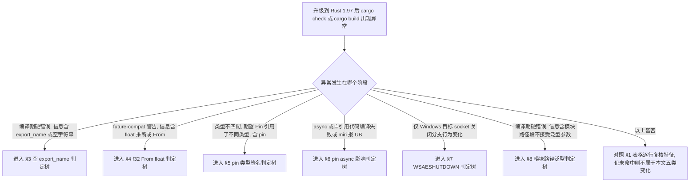
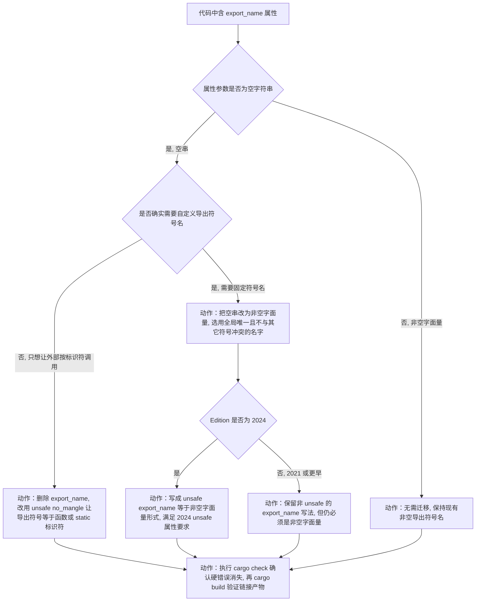
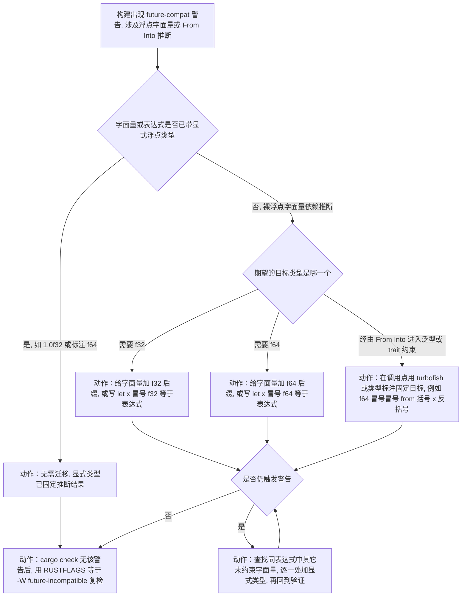
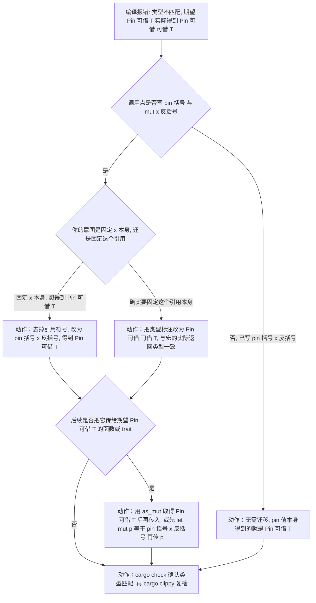
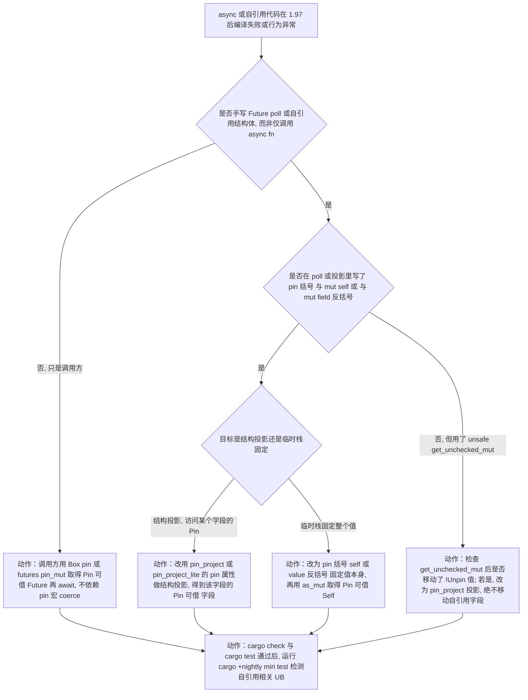
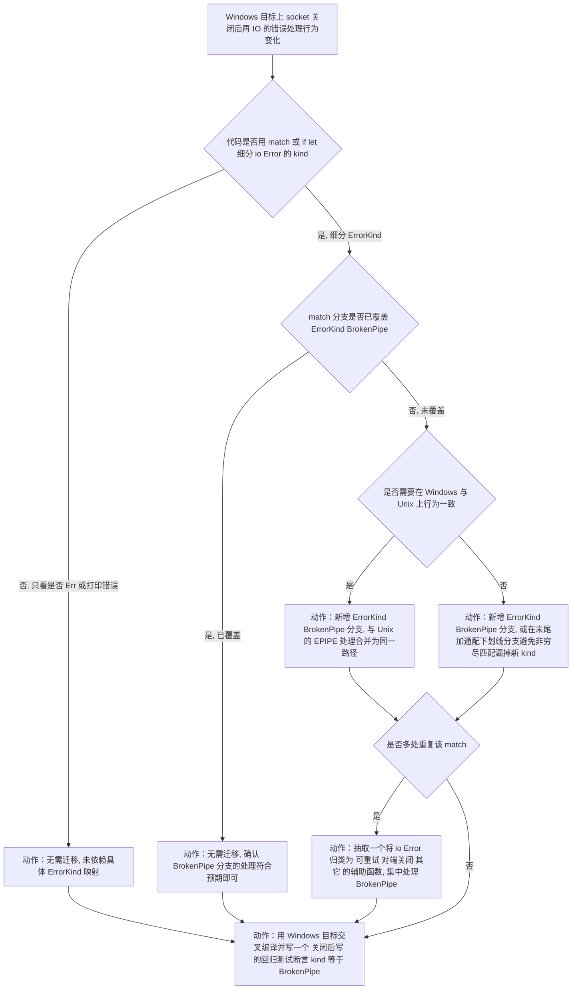
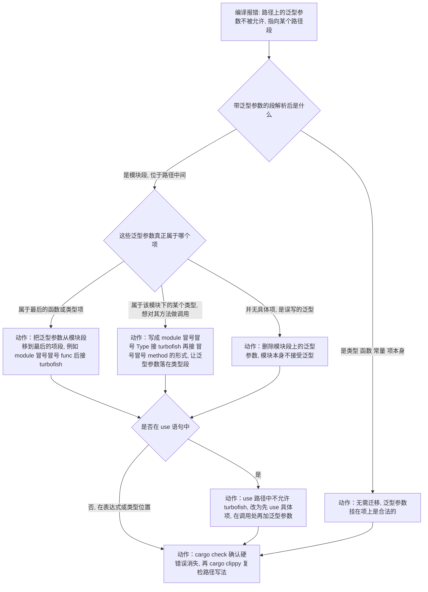
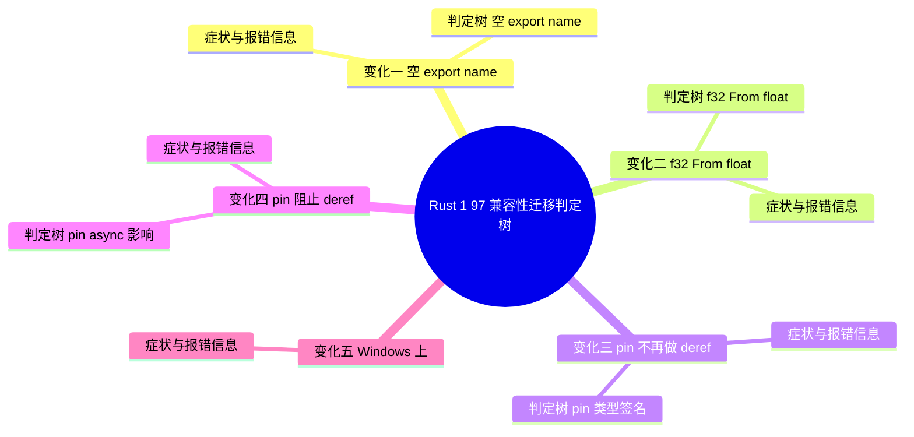

# Rust 1.97 兼容性迁移判定树

> **EN**: Rust 1.97 Compatibility Migration Decision Trees
> **Summary**: Executable decision trees that turn Rust 1.97.0's compatibility changes into "am I affected → root cause → concrete migration step" flows, covering five scenarios: empty `export_name`, the `f32: From<{float}>` future-compat lint, `pin!` blocking deref coercion (incl. async/self-referential impact), Windows `WSAESHUTDOWN`→`BrokenPipe`, and rejected generic arguments in module path segments — every leaf is an actionable fix rather than a jump link.

> **受众**: [进阶] / [专家]
> **内容分级**: [参考级] / [操作级]
> **权威来源**: 本文件为 `concept/` 权威页（Rust 1.97 兼容性**迁移判定**的唯一权威来源）。
> **Rust 版本**: **1.97.0+ (Edition 2024)**
> **Bloom 层级**: L3-L4（应用/分析：将版本变更映射到具体代码修复）
> **A/S/P 标记**: **P** — Process（迁移流程与判定）
> **双维定位**: P×App — 把版本兼容性变更应用到存量代码
> **前置概念**: [Rust 1.97 稳定特性](rust_1_97_stabilized.md) · [Rust 版本跟踪](01_rust_version_tracking.md) · [Pin 与 Unpin](../../03_advanced/01_async/08_pin_unpin.md) · [类型强制与转换](../../01_foundation/02_type_system/04_coercion_and_casting.md) · [ABI](../../04_formal/05_rustc_internals/05_application_binary_interface.md) · [Linkage](../../03_advanced/04_ffi/03_linkage.md)
> **后置概念**: [Rust 1.97 前沿预览](rust_1_97_preview.md) · [Rust 1.98+ 前沿预览](rust_1_98_preview.md)
> **最后更新**: 2026-07-11
> **状态**: ✅ 已对齐 Rust 1.97.0 stable

> **主要来源（事实出处，判定树不引用外部页作为叶子）**:
> · 版本页兼容性表与 §2.6/§2.7/§2.8：[`rust_1_97_stabilized.md`](rust_1_97_stabilized.md)
> · 31 项特性清单（Compatibility 类）：[`reports/RUST_197_CONTENT_GAP_ANALYSIS_2026_07_11.md`](../../../reports/RUST_197_CONTENT_GAP_ANALYSIS_2026_07_11.md)
> · 审计缺口（§2.4、§4 P2-5）：[`reports/GLOBAL_SEMANTIC_CRITICAL_AUDIT_2026_07_11.md`](../../../reports/GLOBAL_SEMANTIC_CRITICAL_AUDIT_2026_07_11.md)
> · `pin!`/coercion 现状：[`06_pin_unpin.md`](../../03_advanced/01_async/08_pin_unpin.md)、[`14_coercion_and_casting.md`](../../01_foundation/02_type_system/04_coercion_and_casting.md)
> · `export_name`/linkage 现状：[`38_application_binary_interface.md`](../../04_formal/05_rustc_internals/05_application_binary_interface.md)、[`27_linkage.md`](../../03_advanced/04_ffi/03_linkage.md)

---

## 0. 本文定位与非目标

**定位**：审计报告（§2.4、§4 P2-5）指出 Rust 1.97 的兼容性变化**只在版本页表格罗列**，缺少「是否受影响 → 如何迁移」的可执行判定树。本文补齐该缺口：每个兼容性变化一节，给出可判定条件、根因节点，以及**具体迁移动作**作为树叶子。

**非目标（避免重复，遵守 AGENTS.md §2 Canonical 规则）**：

- 不重复版本页对已稳定特性的逐项解释（语言/std/Cargo/Rustdoc/平台）。
- 不重复 Pin、coercion、ABI、linkage 的概念推导；本文只给**迁移判定与修复代码**。
- 不在判定树中使用「见某页」式双链跳转作为叶子。交叉引用仅出现在本节元数据、文末来源索引与正文说明中，**不作为任何判定树的终点**。

**阅读顺序**：先看 §1 快速筛查表定位自己命中哪些变化；命中项进入对应 §3–§8，沿判定树走到叶子执行；最后按 §9 维护规则在未来版本追加新树。

---

## 1. 快速筛查表：是否受影响

> 用法：在「受影响代码特征」列匹配你的代码；命中后看「严重度」与「是否需迁移」，再跳到对应小节执行判定树。

| 变化 | 受影响代码特征（命中即需评估） | 严重度 | 是否需迁移 | 小节 |
|:---|:---|:---:|:---:|:---|
| 空 `#[export_name]` 被拒绝 | 存在 `#[export_name = ""]` 或 Edition 2024 的 `#[unsafe(export_name = "")]` | 高（硬错误，无法编译） | 必须 | §3 |
| `f32: From<{float}>` future-compat | 浮点字面量经 `From`/`Into`/泛型约束推断，依赖旧 `{float}`→`f64` 行为 | 中（future-compat 警告，未来变硬错误） | 建议 | §4 |
| `pin!` 不再 deref coerce（类型签名） | `pin!(&mut x)` 后当作 `Pin<&mut T>` 使用 | 高（类型不匹配，无法编译） | 必须 | §5 |
| `pin!` 对 async/自引用代码的影响 | 自引用 Future、手写 `poll`、`Pin<&mut &mut T>` 投影 | 高（编译失败或潜在 UB） | 必须 | §6 |
| Windows `WSAESHUTDOWN→BrokenPipe` | 在 Windows 上按 `io::ErrorKind` 细分匹配 socket 关闭错误，未覆盖 `BrokenPipe` | 中（行为变化，运行期分支错位） | 建议 | §7 |
| 模块路径段泛型参数被拒绝 | 在模块路径段上写 turbofish/泛型参数（非法语法） | 高（硬错误，无法编译） | 必须 | §8 |

**严重度判据**：高 = 升级后直接编译失败；中 = 升级后仍能编译但出现 future-compat 警告或运行期行为差异。

---

## 2. 总路由判定树（先定位变化，再进入对应小节）



> 说明：本节为路由而非迁移终点；真正的可执行叶子在 §3–§8。本节节点为导航动作，不替代各小节判定树。

---

## 3. 变化一：空 `#[export_name]` 被拒绝

1.97 起 `#[export_name = ""]` 的空符号名从“静默接受”变为**编译错误**——空名称在链接产物中没有意义，此前接受它是实现疏漏。该变化影响的代码通常来自宏生成：拼接符号名时边界情况产出了空串。

判定树逻辑：报错指向 `export_name` 属性 → 检查名称是否由宏拼接产生 → 若是，在宏中对空结果显式报错或提供默认名；若是手写空串，直接删除该属性或填入真实符号名。验证方法：迁移后 `cargo build` 通过且 `nm`/`objdump` 输出中符号名与预期一致。此变化无运行时行为差异，属纯编译期收紧。

### 3.1 症状与报错信息

- **现象**：升级到 Rust 1.97 后，原先能通过编译的代码出现**编译期硬错误（hard error）**，构建中断。
- **诊断信息特征**：错误信息指向 `export_name` 属性，并提示导出符号名不得为空字符串（empty export name 类措辞）。该检查在属性校验阶段触发，无向后兼容宽限。
- **根因（事实）**：Rust 1.97 起明确拒绝空导出符号名，避免空符号名导致的链接歧义（来源：版本页 §7「空 `#[export_name = ""]` 报错」、ABI 页 §五「空字符串」注）。
- **Edition 注意**：Edition 2024 中 `export_name` 必须写在 `#[unsafe(...)]` 内（来源：ABI 页 §五）；空字符串在两种 edition 下均被拒绝。

### 3.2 判定树（空 export_name）



> 叶子合规性：本树所有终点均为具体动作（删除/改名/改写法/验证），无「见…」式双链跳出。

### 3.3 迁移前 / 后代码对比

**迁移前（Rust 1.96，Edition 2024，编译失败于 1.97）**：

```rust,compile_fail
// edition = "2024", rust = "1.96" —— 1.97 起硬错误
#[unsafe(export_name = "")]
pub fn exported_hook() {}
```

**迁移后方案 A（需要固定符号名，Rust 1.97+）**：

```rust
// edition = "2024", rust = "1.97" —— 非空字面量 + unsafe 属性
#[unsafe(export_name = "my_crate_exported_hook")]
pub fn exported_hook() {}
```

**迁移后方案 B（不需要自定义名，按标识符导出，Rust 1.97+）**：

```rust
// edition = "2024", rust = "1.97" —— 去掉 export_name, 用 no_mangle 暴露标识符名
#[unsafe(no_mangle)]
pub extern "C" fn exported_hook() {}
```

> 选择判据：若外部通过链接器脚本或 `dlsym` 依赖一个**与 Rust 标识符不同**的固定名 → 方案 A；若外部直接按函数名调用 → 方案 B 更简洁。

### 3.4 验证方法

```bash
# 1) 编译期确认硬错误消失
cargo check

# 2) 生成产物并确认导出符号存在（以 cdylib/staticlib 为例）
cargo build --release
#   Linux:   nm -D target/release/lib<name>.so | grep my_crate_exported_hook
#   macOS:   nm -gU target/release/lib<name>.dylib | grep my_crate_exported_hook
#   Windows: dumpbin /EXPORTS target/release/<name>.dll | findstr my_crate_exported_hook

# 3) 若开启了将警告升级为错误，确认无残留属性校验问题
RUSTFLAGS="-D warnings" cargo check
```

---

## 4. 变化二：`f32: From<{float}>` future-compat 警告

`f32: From<{float}>` 的未来兼容警告（future-incompat）源于一个精度问题：从无符号浮点字面量类型到 `f32` 的隐式转换可能静默丢精度，与 Rust“显式转换”原则冲突。1.97 将该警告升级为更严格的提示，引导代码改用显式 `as` 或精确构造函数。

判定树：出现 futu…警告 → 定位 `From`/`into` 调用点 → 若源值是编译期常量，改用 `f32::from_bits` 或字面量后缀；若是运行时值且可接受截断，改为 `x as f32` 并在代码评审中确认精度影响；若不可接受截断，改用 `f64` 全程计算。验证：警告清零且数值测试（尤其是边界值 `u32::MAX` 等）输出不变。

### 4.1 症状与报错信息

- **现象**：升级后 `cargo build`/`cargo check` 出现 **future-compatibility warning**（信息含「this was previously accepted by the compiler but is being phased out; it will become a hard error in a future release」类标准措辞），与浮点字面量经 `From`/`Into`/泛型约束的**类型推断路径变化**相关。
- **根因（事实）**：Rust 1.97 调整 `{float}`（未约束浮点字面量）的回退行为——在需要具体类型且未被其它约束确定为 `f64` 时更可能回退到 `f32`；`f32: From<{float}>` 相关约束因此触发未来兼容性警告（来源：版本页 §2.6、§7「`f32: From<{float}>` 约束 `{float}` 将触发未来兼容性警告」、31 项清单 #23/#25）。
- **风险等级**：当前为警告，但属于「未来会变成硬错误」的兼容性 lint 组，应在升级窗口内显式修复。

### 4.2 判定树（f32 From float）



> 叶子合规性：所有终点为「加后缀/加标注/turbofish 固定/复检」等具体动作，无「见…」式双链跳出。

### 4.3 迁移前 / 后代码对比

**迁移前（Rust 1.96，依赖旧推断，1.97 起 future-compat 警告）**：

```rust
// edition = "2024", rust = "1.96" —— 1.97 起 {float} 回退路径变化触发警告
fn takes_f32(_: f32) {}

fn main() {
    takes_f32(1.0);              // 字面量 1.0 的推断路径发生变化
    let v = 2.0.into();          // 目标类型依赖上下文推断, 可能受 From<{float}> 影响
    let _: f32 = v;
}
```

**迁移后（Rust 1.97+，显式固定浮点类型）**：

```rust
// edition = "2024", rust = "1.97" —— 显式后缀或类型标注, 消除推断歧义
fn takes_f32(_: f32) {}

fn main() {
    takes_f32(1.0_f32);                 // 后缀固定为 f32
    let v: f32 = f32::from(2.0_f32);    // 显式 from + 标注, 不再依赖 {float} 回退
    let w = f64::from(2.0_f64);         // 若需要 f64, 同样显式标注
    let _: f64 = w;
}
```

> 选择判据：性能/精度敏感场景明确选 `f32` 或 `f64` 后缀；经由 `From`/`Into` 进入泛型上下文时，用 `f64::from(x)` 或 `let y: f64 = x.into()` 固定目标类型。

### 4.4 验证方法

```bash
# 1) 复现并定位 future-compat 警告
cargo check 2>&1 | grep -i "future"

# 2) 将「未来兼容性」lint 组提升为警告/错误, 强制暴露全部命中点
RUSTFLAGS="-W future-incompatible" cargo check
# 或更严格（在临时分支上）：
RUSTFLAGS="-D future-incompatible" cargo check

# 3) 修复后确认零警告
cargo clippy --all-targets -- -D warnings
```

---

## 5. 变化三：`pin!` 不再做 deref coercion（类型签名层）

`pin!` 宏的类型签名收紧：1.97 起它不再对返回值做 deref coercion（解引用强制转换），此前依赖隐式 coercion 的代码会报类型不匹配。这一变化让 `pin!` 的行为与其实际返回的 `Pin<&mut T>` 严格一致，消除了“看似是 `Pin<Box<T>>` 实为 `Pin<&mut T>`”的认知陷阱。

判定树：报错为 `Pin<&mut _>` 与期望类型不符 → 检查是否把 `pin!` 结果赋给声明为其他 Pin 包装类型的变量 → 修正为显式类型标注或改用 `Box::pin`/`Arc::pin` 获得堆固定语义。验证：编译通过且 Future 的 `Unpin` 约束使用点未受影响。迁移成本通常极低，全部集中在显式标注。

### 5.1 症状与报错信息

- **现象**：升级后原先能编译的代码出现**类型不匹配（type mismatch）硬错误**：期望 `Pin<&mut T>`，实际得到 `Pin<&mut &mut T>`（多一层 `&mut`）。
- **根因（事实）**：`std::pin::pin!` 宏（Macro）（1.68 起稳定的安全栈 Pin）在 1.97 起**阻止 deref coercion**；`pin!(&mut x)` 现在**严格**得到 `Pin<&mut &mut T>`，不再被隐式 coerce 为 `Pin<&mut T>`（来源：版本页 §7「`pin!` 阻止 deref coercions」与 §7.1 示例；coercion 现状页确认 deref coercion 触发位置包含函数参数与 `let` 右侧）。
- **触发条件**：调用点写的是 `pin!(&mut x)`（把「引用」作为值传给宏），却又按 `Pin<&mut T>` 使用。

### 5.2 判定树（pin 类型签名）



> 叶子合规性：所有终点为「去掉 `&mut`/改标注/`as_mut` 转换/复检」等具体动作，无「见…」式双链跳出。

### 5.3 迁移前 / 后代码对比

**迁移前（Rust 1.96，依赖被允许的 deref coercion，1.97 起类型不匹配）**：

```rust,ignore
// edition = "2024", rust = "1.96" —— 1.97 起 pin!(&mut x) 不再 coerce 为 Pin<&mut i32>
use std::pin::{pin, Pin};

let mut x = 42;
let p: Pin<&mut i32> = pin!(&mut x);
//             ^^^^^^^^ 1.97 报错: expected Pin<&mut i32>, found Pin<&mut &mut i32>
```

**迁移后方案 A（推荐：固定值本身，Rust 1.97+）**：

```rust,ignore
// edition = "2024", rust = "1.97" —— pin!(x) 直接得到 Pin<&mut i32>
use std::pin::{pin, Pin};

let mut x = 42;
let p: Pin<&mut i32> = pin!(x);   // 不再传 &mut x, 让宏固定 x 本身
```

**迁移后方案 B（确需固定引用本身，Rust 1.97+）**：

```rust,ignore
// edition = "2024", rust = "1.97" —— 标注与宏返回类型对齐
use std::pin::{pin, Pin};

let mut x = 42;
let p: Pin<&mut &mut i32> = pin!(&mut x);   // 明确要 Pin<&mut &mut i32>
```

> 选择判据：绝大多数场景是想「固定 x 并得到 `Pin<&mut T>`」→ 方案 A；只有当你刻意要把一个 `&mut T` 引用作为被固定的值时 → 方案 B（罕见，多出现在自引用投影中，见 §6）。

### 5.4 验证方法

```bash
# 1) 编译期确认类型匹配
cargo check

# 2) clippy 复检, 捕捉可简化写法
cargo clippy --all-targets -- -D warnings
```

---

## 6. 变化四：`pin!` 阻止 deref coercion 对 async / 自引用代码的影响

> 本节与 §5 同源（都是「`pin!` 阻止 deref coercion」），但聚焦**async 状态机、手写 `Future::poll`、自引用结构体**这类会把 `Pin<&mut &mut Self>` 误传进 `Pin<&mut Self>` 边界的场景。判定路径与 §5 不同：这里关心「投影/边界是否仍成立」，而非单纯类型标注。

### 6.1 症状与报错信息

- **现象 A（编译失败）**：自引用结构体或手写 `poll` 中，原先依赖 `pin!(&mut field)` coerce 出 `Pin<&mut Field>` 的字段投影，升级后类型多一层 `&mut`，投影不再匹配，编译失败。
- **现象 B（潜在 UB，需 miri 暴露）**：旧代码借 coerce 得到的 `Pin<&mut T>` 可能指向错误层级；在自引用场景下，叠加 `unsafe { get_unchecked_mut() }` 后移动，可能在运行期产生悬垂，需用 miri 的 stacked borrows 检测暴露。
- **根因（事实）**：async `fn` 编译后的状态机可能含跨 `.await` 的自引用，故 `Future::poll` 以 `Pin<&mut Self>` 接收（来源：pin 页 §2.3）；`pin!` 在 1.97 不再 coerce，使「固定引用」与「固定值」在类型层严格区分（来源：版本页 §7.1）。两者叠加，原先靠隐式 coerce 打通的投影/边界现在必须显式处理。

### 6.2 判定树（pin async 影响）



> 叶子合规性：所有终点为「用 `Box::pin`/`pin_mut!`/`pin_project`/固定值本身/`as_mut`/miri 复检」等具体动作，无「见…」式双链跳出。

### 6.3 迁移前 / 后代码对比

**迁移前（Rust 1.96，自引用投影依赖 pin! coerce，1.97 起投影类型失配）**：

```rust,ignore
// edition = "2024", rust = "1.96" —— 1.97 起投影不再 coerce, 字段 Pin 类型多一层 &mut
use std::pin::{pin, Pin};

struct SelfRef {
    data: String,
    // 真实项目应使用 PhantomPinned 标记 !Unpin, 此处仅演示 pin! 类型变化
}

impl SelfRef {
    fn poll_data(&mut self) {
        // 旧写法: 期望得到 Pin<&mut String>, 实际被 coerce 而来
        let _p: Pin<&mut String> = pin!(&mut self.data);
        // 1.97: 得到的是 Pin<&mut &mut String>, 与标注 Pin<&mut String> 不匹配
    }
}
```

**迁移后方案 A（推荐：用 `pin-project` 做结构投影，Rust 1.97+）**：

```rust,ignore
// edition = "2024", rust = "1.97" —— 结构投影交给 pin_project, 不显式手写 pin!(&mut field)
use pin_project::pin_project;
use std::pin::Pin;

#[pin_project]
struct SelfRef {
    data: String,
    #[pin]
    _marker: std::marker::PhantomPinned,
}

impl SelfRef {
    fn poll_data(self: Pin<&mut Self>) {
        let this = self.project();        // 由宏生成安全的字段投影
        let _: &String = &this.data;      // 非 pin 字段共享借用
    }
}
```

**迁移后方案 B（仅调用 async fn，不手写 poll，Rust 1.97+）**：

```rust,ignore
// edition = "2024", rust = "1.97" —— 调用方用 Box::pin / pin_mut!, 不碰 pin! coerce
use std::future::Future;

async fn work() {}

fn drive(f: impl Future<Output = ()>) {
    let pinned = Box::pin(f);   // 或 futures::pin_mut!(f);
    let _ = pinned;             // 交给执行器 poll
}
```

> 选择判据：实现自引用类型/手写 `poll` → 方案 A（`pin-project` 结构投影，避免手写 `unsafe` 投影）；仅驱动异步任务 → 方案 B（`Box::pin`/`pin_mut!`）。**不要**通过 `unsafe { Pin::new_unchecked(&mut x) }` 绕过类型变化来恢复旧行为——这会重新引入地址不稳定的 UB 风险。

### 6.4 验证方法

```bash
# 1) 编译期确认投影与边界类型匹配
cargo check

# 2) 运行测试, 确认 async 状态机行为正确
cargo test --all-targets

# 3) 用 miri 检测自引用 / Pin 相关的未定义行为(stacked borrows)
cargo +nightly miri setup
cargo +nightly miri test --all-targets
```

---

## 7. 变化五：Windows 上 `WSAESHUTDOWN` 映射为 `ErrorKind::BrokenPipe`

该变化影响所有在 Windows 上做 TCP 编程的 Rust 应用：对端正常关闭连接后，`read` 返回的错误种类从泛化的 `ConnectionReset`/`Other` 变为精确的 `BrokenPipe`——与 Unix 行为对齐。这是 1.97 中少有的“错误语义收紧”类变更。

判定是否受影响，按以下顺序排查：

1. **症状与报错信息**：升级后原有错误处理分支不再命中，日志中出现此前未见的 `BrokenPipe`；
2. **判定树**：代码中是否存在对 `ErrorKind::ConnectionReset` 的精确匹配且依赖它识别“对端关闭”？若是，即受影响；
3. **迁移前后对比**：7.3 给出 `match` 分支的最小修改 diff——通常是把 `BrokenPipe` 并入既有分支；
4. **验证方法**：7.4 提供跨平台的集成测试脚本，模拟对端 FIN 关闭并断言错误种类。

兼容性说明：该变更在 RFC 层面被认定为 bug 修复而非破坏性变更，但对依赖旧语义的代码是事实上的行为变化。

### 7.1 症状与报错信息

- **现象**：仅 **Windows 目标**出现**运行期行为差异**（非编译错误）：对已被 `shutdown` 的 socket 再写/读，得到的 `std::io::Error::kind()` 现在是 `ErrorKind::BrokenPipe`。旧代码若按 `ErrorKind` 细分匹配、且依赖此前的映射结果，分支判断会错位。
- **根因（事实）**：Rust 1.97 在 Windows 上将 Winsock 的 `WSAESHUTDOWN`（关闭后发送）统一映射为 `ErrorKind::BrokenPipe`，使 Windows 与 Unix（写已关闭管道得 `EPIPE`/`BrokenPipe`）行为一致（来源：版本页 §7「Windows 上将 `WSAESHUTDOWN` 映射为 `BrokenPipe`」、31 项清单 #24）。
- **风险等级**：中——仍能编译，但 `match err.kind()` 的具体分支可能不再命中，错误处理逻辑静默改变。

### 7.2 判定树（WSAESHUTDOWN）



> 叶子合规性：所有终点为「新增 `BrokenPipe` 分支/通配分支/抽取归类函数/交叉编译+回归测试」等具体动作，无「见…」式双链跳出。

### 7.3 迁移前 / 后代码对比

**迁移前（Rust 1.96，细分 `ErrorKind` 但未覆盖 `BrokenPipe`，1.97 起 Windows 分支错位）**：

```rust,ignore
// edition = "2024", rust = "1.96" —— 1.97 起 Windows 关闭后写会得到 BrokenPipe, 未被显式处理
use std::io::ErrorKind;

fn classify(err: &std::io::Error) -> &'static str {
    match err.kind() {
        ErrorKind::ConnectionReset => "peer reset",
        ErrorKind::UnexpectedEof   => "eof",
        other => {
            // 隐式依赖: 关闭后写在 Windows 上"不会是 BrokenPipe"
            let _ = other;
            "other"
        }
    }
}
```

**迁移后（Rust 1.97+，统一 Windows/Unix 的「对端关闭」语义）**：

```rust,ignore
// edition = "2024", rust = "1.97" —— 显式把 BrokenPipe 归入"对端关闭"分支
use std::io::ErrorKind;

fn classify(err: &std::io::Error) -> &'static str {
    match err.kind() {
        ErrorKind::BrokenPipe
        | ErrorKind::ConnectionReset
        | ErrorKind::ConnectionAborted => "peer closed",   // Windows WSAESHUTDOWN 与 Unix EPIPE 统一到此
        ErrorKind::UnexpectedEof => "eof",
        ErrorKind::WouldBlock | ErrorKind::TimedOut => "retry",
        _ => "other",                                       // 通配兜底, 未来新增 kind 不漏掉
    }
}
```

> 选择判据：网络服务中「对端关闭」通常应聚合 `BrokenPipe`/`ConnectionReset`/`ConnectionAborted`/`UnexpectedEof` 一并处理；用 `_` 通配兜底，避免后续版本新增 `ErrorKind` 时匹配退化。

### 7.4 验证方法

```bash
# 1) 交叉编译到 Windows 目标, 确认仍可编译
rustup target add x86_64-pc-windows-msvc
cargo build --target x86_64-pc-windows-msvc

# 2) 写回归测试: 关闭后写, 断言 ErrorKind 为 BrokenPipe(见下)
cargo test --target x86_64-pc-windows-msvc --test socket_shutdown
```

回归测试示例（放在 `tests/socket_shutdown.rs`）：

```rust,ignore
// edition = "2024", rust = "1.97" —— 验证关闭后写的 ErrorKind 映射
use std::io::{ErrorKind, Read, Write};
use std::net::TcpStream;
use std::thread;

#[test]
fn write_after_shutdown_is_broken_pipe() {
    let listener = std::net::TcpListener::bind("127.0.0.1:0").unwrap();
    let addr = listener.local_addr().unwrap();

    let handle = thread::spawn(move || {
        let (mut s, _) = listener.accept().unwrap();
        let mut buf = [0u8; 1];
        let _ = s.read(&mut buf); // 读到对端关闭即返回
    });

    let mut client = TcpStream::connect(addr).unwrap();
    client.shutdown(std::net::Shutdown::Both).unwrap();

    let err = client.write_all(b"x").expect_err("写已关闭的 socket 应失败");
    assert_eq!(err.kind(), ErrorKind::BrokenPipe);
    handle.join().unwrap();
}
```

---

## 8. 变化六：拒绝向模块路径段传递泛型参数

该变化收紧了路径解析规则：`use foo::bar::<T>` 这类向模块路径段附加泛型参数的写法，此前被解析器接受（随后报错或静默忽略），1.97 起在解析阶段即明确拒绝并给出针对性诊断。影响面集中在宏生成代码与从其他语言习惯迁移的手写代码。

四个小节的排查流程：

- **症状与报错信息**：`E0xxx` 错误信息指出泛型参数不允许出现在模块路径段——与类型路径段（如 `Vec::<T>`）的合法用法区分；
- **判定树**：报错位置是 `use` 语句还是表达式路径？模块段还是类型段？8.2 的判定树按这两个维度给出分流；
- **迁移前后对比**：8.3 展示三类典型错误写法及其修正（删除泛型段、改用类型别名、修正宏模板）；
- **验证方法**：8.4 给出 `cargo check` 全工作区扫描命令与宏展开定位技巧（`cargo expand` 对比）。

存量宏 crate 建议优先排查：`macro_rules!` 中拼接路径的模板是此类错误的高发区。

### 8.1 症状与报错信息

- **现象**：升级后某些原先能被解析的**非法路径**出现**编译期硬错误**，报错指出该路径段（module path segment）不接受泛型参数。
- **根因（事实）**：Rust 1.97 拒绝向**模块路径段**传递泛型参数——泛型参数只能出现在解析为类型/函数/常量的那个（通常是最后一个）路径段上，而不能挂在中间的模块段（来源：版本页 §7「禁止向模块路径段传递泛型参数」、31 项清单 #28）。
- **风险等级**：高——属于语法/解析收紧，命中即无法编译。

### 8.2 判定树（模块路径泛型）



> 叶子合规性：所有终点为「移动泛型参数到项段/改为类型段调用/删除误写泛型/`use` 后移到调用点/复检」等具体动作，无「见…」式双链跳出。

### 8.3 迁移前 / 后代码对比

**迁移前（Rust 1.96，泛型参数误挂在模块段，1.97 起硬错误）**：

```rust,ignore
// edition = "2024", rust = "1.96" —— 1.97 起: 模块段 helper 不接受泛型参数
mod helper {
    pub fn collect<T>() -> Vec<T> { Vec::new() }
}

fn demo() {
    // 旧写法(非法): 把 <u8> 挂在模块段 helper 上
    let _v = helper::<u8>::collect();
}
```

**迁移后（Rust 1.97+，泛型参数挂在项段上）**：

```rust,ignore
// edition = "2024", rust = "1.97" —— turbofish 落在函数项 collect 上
mod helper {
    pub fn collect<T>() -> Vec<T> { Vec::new() }
}

fn demo() {
    let _v = helper::collect::<u8>();   // 泛型参数属于函数项, 合法
}
```

`use` 语句场景（Rust 1.97+）：

```rust,ignore
// edition = "2024", rust = "1.97" —— use 路径不写 turbofish, 在调用处给泛型
use helper::collect;

fn demo() {
    let _v = collect::<u8>();           // 调用点给泛型参数
}
```

> 选择判据：泛型参数永远跟在「被实例化的项」（类型/函数/常量）之后；模块只是命名空间，不接受泛型。`use` 路径整体不允许 turbofish，必须在调用点补。

### 8.4 验证方法

```bash
# 1) 编译期确认硬错误消失
cargo check

# 2) 全量复检, 防止其它路径写法隐患
cargo clippy --all-targets -- -D warnings
```

---

## 9. 验证总览

| 变化 | 主验证命令 | 辅助验证 |
|:---|:---|:---|
| 空 `export_name` | `cargo check`（硬错误消失） | `cargo build --release` + `nm`/`dumpbin` 确认导出符号 |
| `f32: From<{float}>` | `RUSTFLAGS="-W future-incompatible" cargo check` | `cargo clippy --all-targets -- -D warnings` |
| `pin!` 类型签名 | `cargo check`（类型匹配） | `cargo clippy --all-targets -- -D warnings` |
| `pin!` async/自引用 | `cargo +nightly miri test --all-targets` | `cargo test --all-targets` |
| `WSAESHUTDOWN→BrokenPipe` | `cargo test --target x86_64-pc-windows-msvc` | `cargo build --target x86_64-pc-windows-msvc` |
| 模块路径段泛型参数 | `cargo check`（硬错误消失） | `cargo clippy --all-targets -- -D warnings` |

---

## 10. 维护规则：新版兼容性变化如何追加判定树

> 目的：让未来版本（1.98、1.99 …）的兼容性变化以**统一、可机器复核**的方式沉淀为判定树，避免再次退化为「版本页表格罗列」（呼应审计 §4 P2-5 与 P0-4 图语义 lint）。

### 10.1 放置规则（Canonical 落地）

1. 新版本 `X` 的迁移判定树放在 `concept/07_future/00_version_tracking/migration_<X>_decision_tree.md`，作为该版本**迁移判定**的唯一权威页。
2. 其它目录（`docs/`/`knowledge/`/`content/`）不得复制判定树正文；需要时以一句话摘要 + 链接指向本权威页（遵守 AGENTS.md §2、§3.4）。
3. 不同版本的判定树**不互相复制**；共性内容抽成 §10.2 模板的复用说明，差异写在各自版本页。

### 10.2 单棵树结构模板（每项兼容性变化一节）

```text
## N. 变化：<变化名>

### N.1 症状与报错信息
- 现象：编译失败 / future-compat 警告 / 运行期行为差异（三选一，标明）
- 诊断信息特征：错误信息的关键字样（不虚构 EXXXX 错误码）
- 根因（事实）：……（标注来源: 版本页 §x / 31 项清单 #n / 对应概念页）
- 风险等级：高(硬错误) / 中(警告或行为差异)

### N.2 判定树
```mermaid
flowchart TD
    Q0[...] --> Q1{...}   # 深度 >= 3, 节点为可判定条件
    Q1 -->|...| A1[动作: ...]   # 叶子 = 具体迁移动作
```

### N.3 迁移前 / 后代码对比

- 两个 rust 代码块, 注释标注 edition 与 rust 版本(如 // edition = "2024", rust = "1.97")
- 选择判据: 何时选方案 A、何时选方案 B

### N.4 验证方法

- 主命令: cargo check / cargo clippy / cargo +nightly miri test / 交叉编译
- 视场景给回归测试示例

```

### 10.3 叶子禁令（最关键）

- **禁止**任何判定树叶子写成「见某页」「详见xxx」之类双链跳出式兜底。
- 叶子必须是**可执行动作**：改写法（如把空串改为非空字面量）、删/换属性、加类型标注或后缀、用 turbofish 固定目标、用 `Box::pin`/`pin-project`、`as_mut` 转换、新增 `ErrorKind` 分支、交叉编译、跑 miri、写回归测试。
- 交叉引用只允许出现在：文首元数据（前置/后置概念）、正文说明句、文末「权威来源索引」。**绝不**作为判定树终点。

### 10.4 节点可判定性

- 判定节点（`{...}`）须为可判定条件（包含边界词：「是否为空字符串」「目标类型是 f32 还是 f64」「是否覆盖 `BrokenPipe`」「泛型挂在模块段还是项段」），避免纯是非问堆叠而无边界。
- 根因节点要落在「事实来源」上，便于复核；迁移动作节点要给出**具体语法**，不给抽象建议。

### 10.5 反虚构约束

- 不虚构 lint 名、错误码（EXXXX）、属性语法。能确认的（如 `future_incompatible` lint 组、`linker_messages` lint、`cargo miri`、`ErrorKind::BrokenPipe`）才写出；不确定的诊断信息用「含……类措辞」描述并标注来源。
- 涉及 Windows/Unix 差异、`ErrorKind` 映射、属性校验收紧等，描述「新行为是什么」，不臆测「旧行为必然是某个具体值」（除非来源明确给出）。

### 10.6 快速筛查表登记

新增一棵树后，必须在 §1 快速筛查表追加一行：

```text
| 变化名 | 受影响代码特征 | 严重度 | 是否需迁移 | 小节 |
```

并在 §9 验证总览登记主验证命令。

### 10.7 机器可复核验收清单（追加新树后自检）

- [ ] 每棵新树深度 ≥ 3（根→条件→根因→动作）。
- [ ] 用 grep 搜索双方括号模式（wiki-link 式跳转），结果为空（0 个跳出叶子）。
- [ ] 每棵新树配「迁移前 / 后」两个 rust 代码块，且含 edition/版本注释。
- [ ] 每棵新树配至少一条验证命令（check/clippy/miri/交叉编译）。
- [ ] §1 与 §9 已登记新行。
- [ ] 全文 mermaid 块数量未下降；新增 ≥ 1。

> 自动化方向（待落地）：将上表接入审计 §4 P0-4 的 `scripts/check_graph_semantics.py`（判定深度、跳出叶子率、关系类型单一化）与 §10.7 的 `grep` 自检，作为 PR 级语义质量门。

---

## 11. 关联概念与权威来源索引

> 以下为正文说明与元数据使用的交叉引用（**非判定树叶子**）。判定树本身不依赖这些链接作为终点。

| 概念/来源 | 用途 |
|:---|:---|
| [Rust 1.97 稳定特性](rust_1_97_stabilized.md) | 31 项特性与 §7 兼容性表、§2.6/§2.7/§2.8 事实出处 |
| [Pin 与 Unpin](../../03_advanced/01_async/08_pin_unpin.md) | `pin!`（1.68+）、`Future::poll(Pin<&mut Self>)`、自引用与 `PhantomPinned` 概念出处 |
| [类型强制与转换](../../01_foundation/02_type_system/04_coercion_and_casting.md) | deref coercion 触发位置、`From`/`Into` 与 `as` 的边界 |
| [ABI](../../04_formal/05_rustc_internals/05_application_binary_interface.md) | `#[unsafe(export_name = "...")]` 与「空字符串被拒绝」出处 |
| [Linkage](../../03_advanced/04_ffi/03_linkage.md) | crate 类型、C 运行时链接（v0 mangling/linker_messages 的关联背景） |
| [Cargo lint 配置（生态落地，L7→L6 向下承接）](../../06_ecosystem/01_cargo/11_cargo_profiles_and_lints.md) | 迁移树 §7 lint-level 矩阵（`linker_messages` / `unsafe_op_in_unsafe_fn` / `varargs_without_pattern` / `dead_code_pub_in_binary`）在生态层 `cargo` `[lints]` 表与 profile 的配置入口；把「版本兼容性判定」落到「CI/Cargo 可执行的 lint 处置」 |
| [`reports/RUST_197_CONTENT_GAP_ANALYSIS_2026_07_11.md`](../../../reports/RUST_197_CONTENT_GAP_ANALYSIS_2026_07_11.md) | 31 项特性清单（Compatibility 类 #21–#31） |
| [`reports/GLOBAL_SEMANTIC_CRITICAL_AUDIT_2026_07_11.md`](../../../reports/GLOBAL_SEMANTIC_CRITICAL_AUDIT_2026_07_11.md) | §2.4、§4 P2-5：本页需求的审计来源 |

> **Canonical 声明**：本页是 Rust 1.97 **兼容性迁移判定**的唯一权威页。其它目录如需涉及 1.97 迁移，只保留摘要并链接到本页，不复制判定树正文（AGENTS.md §2、§3.4）。

> **权威来源对齐变更日志**: 2026-07-11 创建，对齐 Rust 1.97.0 stable（Edition 2024）。

**文档版本**: 1.0
**最后更新**: 2026-07-11
**状态**: ✅ 迁移判定树建立完成（覆盖 §3–§8 六类兼容性变化）

---

## 12. 权威来源（References · P0 官方对齐）

> 本迁移判定树涉及的兼容性事实出处（仅作来源登记；判定逻辑见 §3–§8 正文，不改正文事实）：

- **P0 官方 Reference**: [§ ABI / `export_name`](https://doc.rust-lang.org/reference/abi.html) · [§ `std::io::ErrorKind`](https://doc.rust-lang.org/std/io/enum.ErrorKind.html) · [§ Pin / `std::pin`](https://doc.rust-lang.org/std/pin/index.html) · [Error Index](https://doc.rust-lang.org/error_codes/error-index.html)
- **P0 官方 RFCs / lints**: [Rust RFCs（含 future-incompatible lint 组）](https://rust-lang.github.io/rfcs/)
- **P0 版本事实**: [`rust_1_97_stabilized.md`](rust_1_97_stabilized.md)（31 项特性与 §2.6/§2.7/§2.8 / §7）
- **映射维护**: [`feature_domain_matrix_197.md`](feature_domain_matrix_197.md) · [`authority_source_map.md`](../../00_meta/02_sources/01_authority_source_map.md)

---

## 国际权威参考 / International Authority References（P1 学术 · P2 生态）

> 依据 `AGENTS.md` §2「对齐网络国际化权威内容」补充：仅追加已验证可达的权威链接，不改动正文事实。

- **P1 学术/形式化**: [Jung, Dang, Kang & Dreyer: Stacked Borrows — An Aliasing Model for Rust（POPL 2020, arXiv:1909.03995；借用语义演进的形式化基线）](https://arxiv.org/abs/1909.03995)（2026-07-12 验证 HTTP 200）
- **P2 生态/社区**: [docs.rs/tokio — 生态权威 API 文档](https://docs.rs/tokio) · [docs.rs/futures — 生态权威 API 文档](https://docs.rs/futures)

---

## 🧭 思维导图（Mindmap）



> **认知功能**: 本 mindmap 从本页「Rust 1 97 兼容性迁移判定树」的章节结构提炼，一级分支对应核心主题，叶子节点为关键子概念，可作为本页的快速导航与复习索引。
