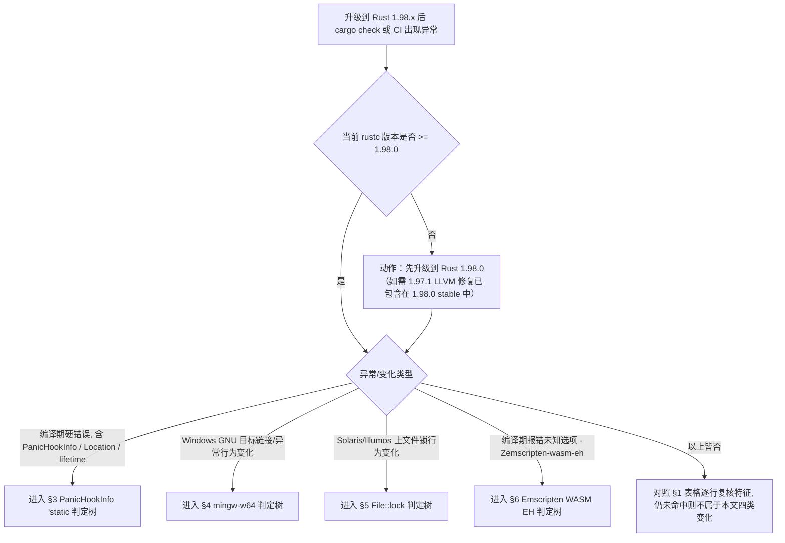
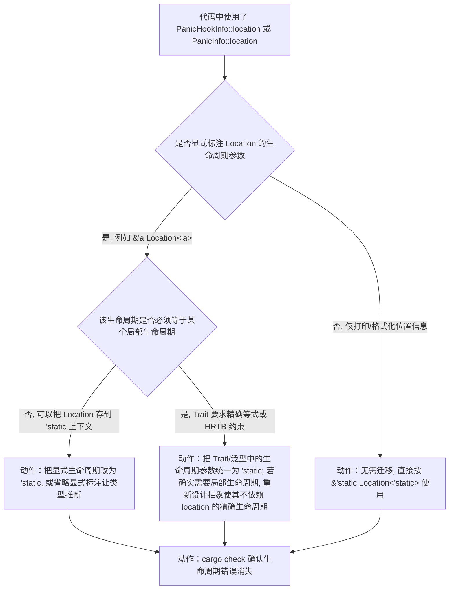
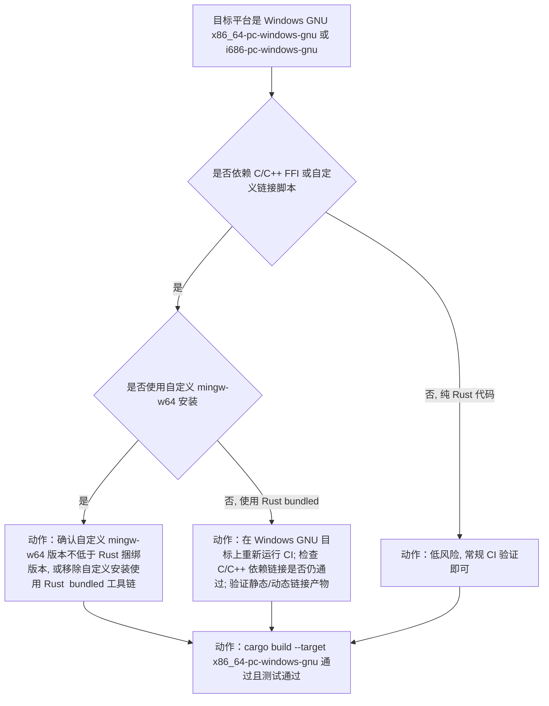
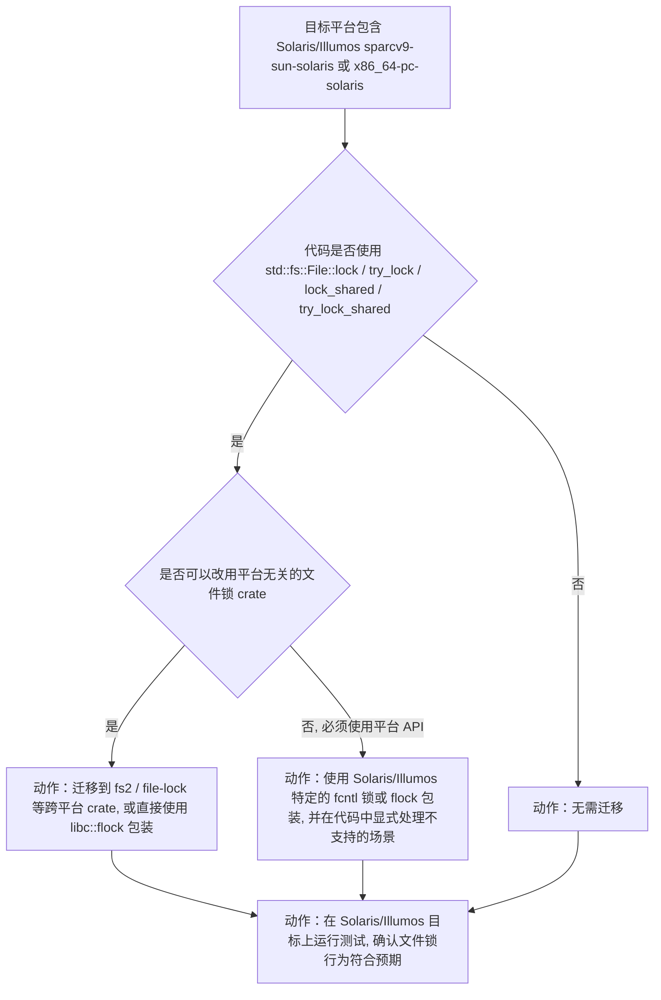
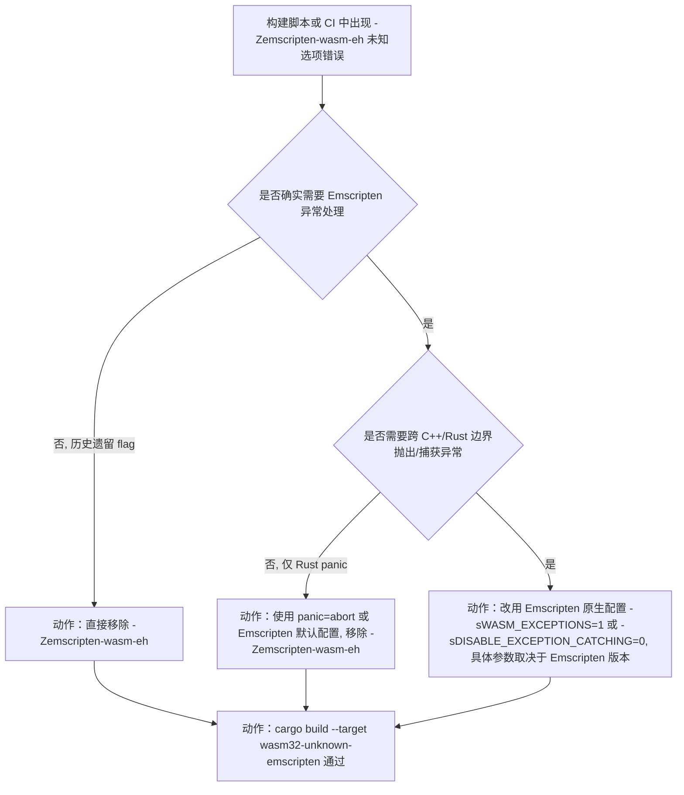
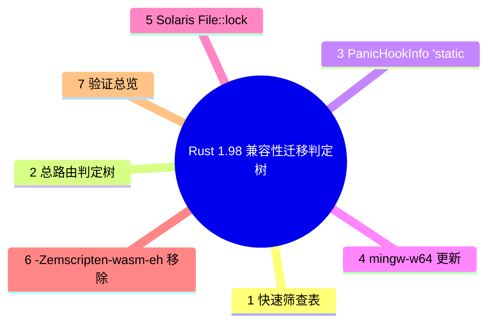

# Rust 1.98 兼容性迁移判定树

> **EN**: Rust 1.98 Compatibility Migration Decision Trees
> **Summary**: Executable decision trees that turn Rust 1.98.0's compatibility changes into "am I affected → root cause → concrete migration step" flows, covering four stabilized-in-beta scenarios: `PanicHookInfo` `'static` lifetime, mingw-w64 toolchain update, Solaris `File::lock` removal, and `-Zemscripten-wasm-eh` removal — every leaf is an actionable fix rather than a jump link.
>
> **受众**: [专家]
> **内容分级**: [综述级]
> **权威来源**: 本文件为 `concept/` 权威页（Rust 1.98 兼容性**迁移判定**的唯一权威来源）。
> **Rust 版本**: **1.98.0+ (Edition 2024)**
> **Bloom 层级**: L3-L4（应用/分析：将版本变更映射到具体代码修复）
> **A/S/P 标记**: **P** — Process（迁移流程与判定）
> **双维定位**: P×App — 把版本兼容性变更应用到存量代码
> **前置概念**:
> [Rust 1.98 稳定特性](rust_1_98_stabilized.md) ·
> [Rust 版本跟踪](01_rust_version_tracking.md) ·
> [生命周期](../../01_foundation/01_ownership_borrow_lifetime/03_lifetimes.md) ·
> [错误处理](../../02_intermediate/03_error_handling/01_error_handling.md) ·
> [Linkage](../../03_advanced/04_ffi/03_linkage.md) ·
> [FFI](../../03_advanced/04_ffi/01_rust_ffi.md)
> **后置概念**:
> [Rust 1.98+ 前沿预览](rust_1_98_preview.md) ·
> [Rust 1.99+ 前沿预览](rust_1_99_preview.md)
> **companion reference**: 纯特性清单速查见 [`rust_1_98_stabilized.md`](rust_1_98_stabilized.md)
> **最后更新**: 2026-07-31
> **状态**: 🔄 基于 1.98.0 beta；stable 发布（2026-08-20）后最终核对
>
> **主要来源**:
> · 版本页兼容性表：[`rust_1_98_stabilized.md`](rust_1_98_stabilized.md)
> · 周期跟踪页：[`rust_1_98_preview.md`](rust_1_98_preview.md)
> · 上游：[`releases.rs 1.98.0`](https://releases.rs/docs/1.98.0/)

---

## 0. 本文定位与非目标

**定位**：Rust 1.98.0 的兼容性变化需要在「是否受影响 → 如何迁移」的可执行判定树中落地。本文补齐该缺口：每个兼容性变化一节，给出可判定条件、根因节点，以及**具体迁移动作**作为树叶子。

**与姊妹页的分工**：[`rust_1_98_stabilized.md`](rust_1_98_stabilized.md) 提供 1.98 全部特性的**一览表**；[`feature_domain_matrix_198.md`](feature_domain_matrix_198.md) 提供特性 × 领域反查矩阵；本文只聚焦**兼容性迁移**，给出“是否受影响 → 根因 → 具体修复动作”的判定树。

**非目标**：

- 不重复版本页对已稳定特性的逐项解释。
- 不重复生命周期、FFI、linkage 的概念推导；本文只给**迁移判定与修复代码**。
- 不在判定树中使用「见某页」式双链跳转作为叶子。

---

## 1. 快速筛查表：是否受影响

| 变化 | 受影响代码特征（命中即需评估） | 严重度 | 是否需迁移 | 小节 |
|:---|:---|:---:|:---:|:---|
| `PanicHookInfo` `'static` 生命周期 | 自定义 panic hook 中显式标注 `Location<'_>` 生命周期，或把 `location()` 结果存入非 `'static` 上下文 | 高（编译失败） | 必须 | §3 |
| mingw-w64 工具链更新 | 在 `x86_64-pc-windows-gnu` / `i686-pc-windows-gnu` 上构建，且依赖 C/C++ FFI 或自定义链接脚本 | 中（构建行为变化） | 建议 | §4 |
| Solaris `File::lock` 移除 | 目标平台为 Solaris/Illumos，且使用 `std::fs::File::lock` 系列方法 | 高（运行时行为变化/功能缺失） | 必须 | §5 |
| `-Zemscripten-wasm-eh` 移除 | 构建脚本/CI 中使用 `-Zemscripten-wasm-eh` flag | 高（编译失败） | 必须 | §6 |

---

## 2. 总路由判定树



---

## 3. 变化一：`PanicHookInfo` / `PanicInfo` `location()` 返回 `'static`

### 3.1 症状与报错信息

- **现象**：升级到 Rust 1.98 后，自定义 panic hook 或封装 `PanicInfo` 的泛型代码出现**编译期硬错误**，提示生命周期不匹配。
- **诊断信息特征**：错误信息含 `PanicHookInfo`、`Location`、`lifetime` 或 `'static`。
- **根因（事实）**：Rust 1.98.0 将 `std::panic::PanicHookInfo::location()`（以及对应的 `PanicInfo::location()`）返回类型从 `Option<&Location<'_>>` 改为 `Option<&'static Location<'static>>`。`'static` 引用可协变为更短生命周期，因此仅在把 `Location` 生命周期与某个局部生命周期显式绑定的代码中会编译失败（来源：版本页 §1.1）。
- **风险等级**：高——命中即无法编译。

### 3.2 判定树（PanicHookInfo 'static）



### 3.3 迁移前 / 后代码对比

**迁移前（Rust 1.97，泛型 Trait 绑定局部生命周期，1.98 起编译失败）**：

```rust,ignore
// edition = "2024", rust = "1.97" —— 1.98 起生命周期不匹配
trait LocProvider<'a> {
    fn location(&self) -> &'a std::panic::Location<'a>;
}

impl<'a> LocProvider<'a> for std::panic::PanicInfo<'a> {
    fn location(&self) -> &'a std::panic::Location<'a> {
        self.location().unwrap() // 1.98: 返回 &'static Location<'static>, 无法强制转换
    }
}
```

**迁移后（Rust 1.98+，统一为 `'static`）**：

```rust,ignore
// edition = "2024", rust = "1.98" —— 与 1.98 返回类型对齐
trait LocProvider {
    fn location(&self) -> &'static std::panic::Location<'static>;
}

impl LocProvider for std::panic::PanicInfo<'_> {
    fn location(&self) -> &'static std::panic::Location<'static> {
        self.location().unwrap()
    }
}
```

### 3.4 验证方法

```bash
# 1) 编译期确认生命周期错误消失
cargo check

# 2) 全量检查 panic hook 相关泛型代码
RUSTFLAGS="-D warnings" cargo check
```

---

## 4. 变化二：mingw-w64 C 工具链更新

### 4.1 症状与报错信息

- **现象**：在 Windows GNU 目标上构建时，链接行为、异常模型或运行时依赖发生变化；可能表现为链接警告、运行时崩溃或产物布局差异。
- **根因（事实）**：Rust 1.98.0 更新了 Windows GNU 目标捆绑的 mingw-w64/GCC 工具链版本，链接行为更贴近上游，异常模型（SEH vs DWARF）与 C++ ABI 兼容性改善（来源：版本页 §1.2）。
- **风险等级**：中——通常仍能编译，但产物行为可能变化。

### 4.2 判定树（mingw-w64）



### 4.3 迁移检查清单

- [ ] 在 `x86_64-pc-windows-gnu` 目标上重新运行 CI；
- [ ] 检查 C/C++ 依赖的链接是否仍通过；
- [ ] 若使用自定义 mingw-w64 安装，确认版本不低于 Rust 捆绑版本；
- [ ] 对 release 构建跑 `cargo test --release`。

---

## 5. 变化三：Solaris/Illumos 上 `File::lock` 实现移除

### 5.1 症状与报错信息

- **现象**：在 Solaris/Illumos 目标上，原先可用的 `std::fs::File::lock` 现在返回错误或不支持。
- **根因（事实）**：Solaris/Illumos 上 `File::lock` 的原实现基于 `fcntl`，但其语义与 Rust `File::lock` 要求的进程级互斥锁不一致；1.98.0 移除了该实现以避免错误的安全保证（来源：版本页 §1.3）。
- **风险等级**：高——依赖文件锁的代码在 Solaris/Illumos 上行为改变。

### 5.2 判定树（Solaris File::lock）



### 5.3 迁移前 / 后代码对比

**迁移前（Rust 1.97，Solaris 上 `File::lock` 可用，1.98 起移除）**：

```rust,ignore
// edition = "2024", rust = "1.97" —— 1.98 起 Solaris 上 File::lock 不再保证
use std::fs::File;

fn lock_file(f: &File) -> std::io::Result<()> {
    f.lock()
}
```

**迁移后（Rust 1.98+，使用跨平台 crate）**：

```rust,ignore
// edition = "2024", rust = "1.98" —— 使用 fs2 的 FileExt
use fs2::FileExt;
use std::fs::File;

fn lock_file(f: &File) -> std::io::Result<()> {
    f.lock_exclusive()
}
```

> 选择判据：若项目已有 `fs2`/`file-lock` 依赖 → 直接迁移；若希望零依赖 → 用 `libc::flock` 自行包装，但需处理平台差异。

---

## 6. 变化四：移除 `-Zemscripten-wasm-eh`

### 6.1 症状与报错信息

- **现象**：升级到 Rust 1.98 后，使用 `-Zemscripten-wasm-eh` 的构建脚本或 CI 出现编译错误「未知选项」。
- **根因（事实）**：`-Zemscripten-wasm-eh` 是 nightly 编译器标志，用于在 `wasm32-unknown-emscripten` 上启用实验性 WebAssembly 异常处理；随着上游 LLVM 和 Emscripten 对异常处理支持路径变化，该标志已过时并被移除（来源：版本页 §1.4）。
- **风险等级**：高——命中即无法编译。

### 6.2 判定树（Emscripten WASM EH）



### 6.3 迁移前 / 后代码对比

**迁移前（Rust 1.97，使用已移除 flag）**：

```toml
# .cargo/config.toml (Rust 1.97, nightly)
[build]
rustflags = ["-Zemscripten-wasm-eh"]
target = "wasm32-unknown-emscripten"
```

**迁移后（Rust 1.98+，改用 Emscripten 原生配置）**：

```toml
# .cargo/config.toml (Rust 1.98+)
[build]
target = "wasm32-unknown-emscripten"

[target.wasm32-unknown-emscripten]
rustflags = ["-C", "link-args=-sWASM_EXCEPTIONS=1"]
```

> 选择判据：若不需要异常处理 → 直接移除 flag；若需要 → 用 `-sWASM_EXCEPTIONS`（Emscripten 3.1.43+）或 `-sDISABLE_EXCEPTION_CATCHING=0`。

### 6.4 验证方法

```bash
# 1) 确认 -Zemscripten-wasm-eh 不再使用
grep -R "emscripten-wasm-eh" .cargo/ build.rs .github/workflows/

# 2) 重新构建 Emscripten 目标
cargo build --target wasm32-unknown-emscripten
```

---

## 7. 验证总览

| 变化 | 主验证命令 | 辅助验证 |
|:---|:---|:---|
| `PanicHookInfo` `'static` | `cargo check` | `RUSTFLAGS="-D warnings" cargo check` |
| mingw-w64 更新 | `cargo build --target x86_64-pc-windows-gnu` | `cargo test --target x86_64-pc-windows-gnu` |
| Solaris `File::lock` | 在 Solaris/Illumos 目标上跑集成测试 | 检查文件锁替代方案行为 |
| `-Zemscripten-wasm-eh` | `cargo build --target wasm32-unknown-emscripten` | `grep -R "emscripten-wasm-eh"` |

---

## 8. 维护规则

1. 新版本 `X` 的迁移判定树放在 `concept/07_future/00_version_tracking/migration_<X>_decision_tree.md`。
2. 判定树叶子必须是**可执行动作**：改生命周期、改工具链配置、换 crate、改 Emscripten flag、跑测试。
3. 禁止任何叶子写成「见某页」式双链跳出。
4. 新增树后必须在 §1 快速筛查表与 §7 验证总览中登记。

---

## 9. 关联概念与权威来源索引

| 概念/来源 | 用途 |
|:---|:---|
| [Rust 1.98 稳定特性](rust_1_98_stabilized.md) | 4 项 stabilized-in-beta 特性事实出处 |
| [生命周期](../../01_foundation/01_ownership_borrow_lifetime/03_lifetimes.md) | `PanicHookInfo` `'static` 迁移的语义基础 |
| [错误处理](../../02_intermediate/03_error_handling/01_error_handling.md) | panic hook 与 `Location` 使用场景 |
| [Linkage](../../03_advanced/04_ffi/03_linkage.md) | mingw-w64 链接行为变化背景 |
| [FFI](../../03_advanced/04_ffi/01_rust_ffi.md) | mingw-w64 / Emscripten 边界 |
| [WebAssembly](../../06_ecosystem/11_domain_applications/03_webassembly.md) | `-Zemscripten-wasm-eh` 迁移背景 |
| [Target Tier 平台支持](../../06_ecosystem/05_systems_and_embedded/10_target_tier_platform_support.md) | Solaris/Illumos 与 Windows GNU 目标定位 |

> **Canonical 声明**：本页是 Rust 1.98 **兼容性迁移判定**的唯一权威页。

---

## 国际权威参考 / International Authority References（P0 官方 · P1 学术）

- **P0 官方 Reference**: [Rust Reference — Lifetimes](https://doc.rust-lang.org/reference/lifetime-elision.html) · [std::panic::PanicHookInfo](https://doc.rust-lang.org/std/panic/struct.PanicHookInfo.html) · [std::panic::Location](https://doc.rust-lang.org/std/panic/struct.Location.html)
- **P0 官方 RFCs / release notes**: [releases.rs — Rust 1.98.0](https://releases.rs/docs/1.98.0/)
- **P1 学术/形式化**: [Jung, Jourdan, Krebbers & Dreyer: RustBelt — Securing the Foundations of the Rust Programming Language（POPL 2018）](https://plv.mpi-sws.org/rustbelt/)

## 🧭 思维导图（Mindmap）


