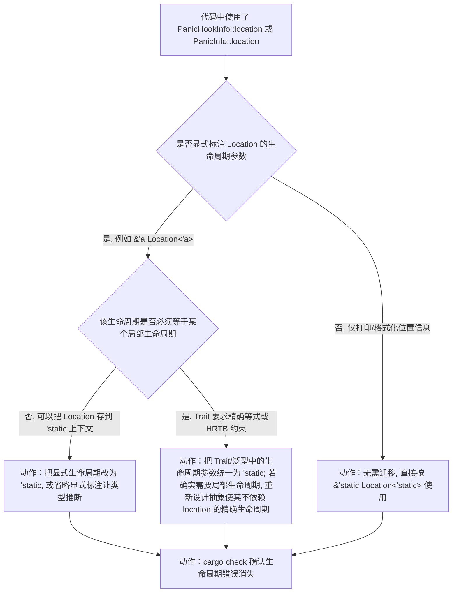
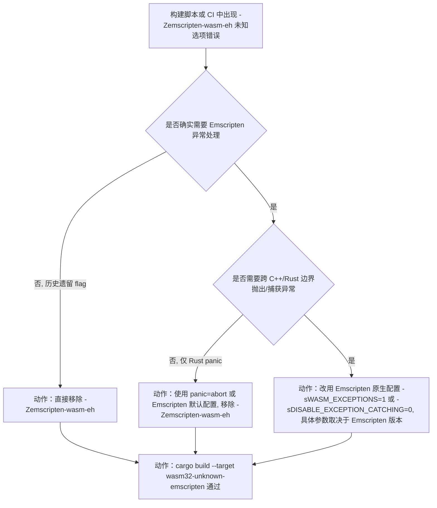
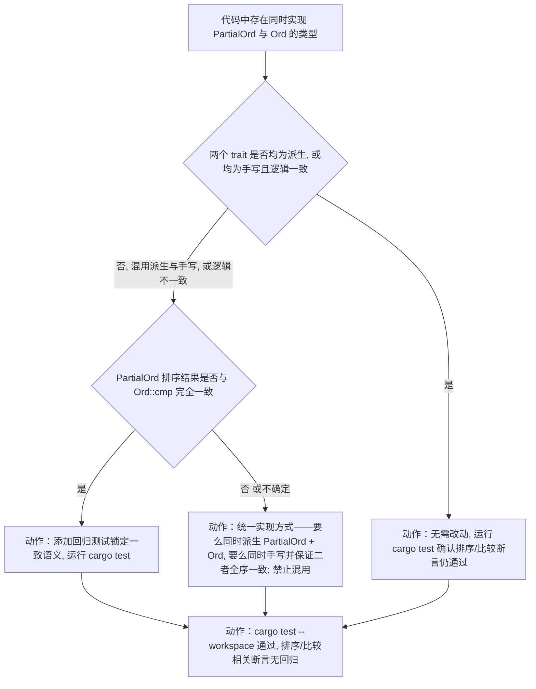
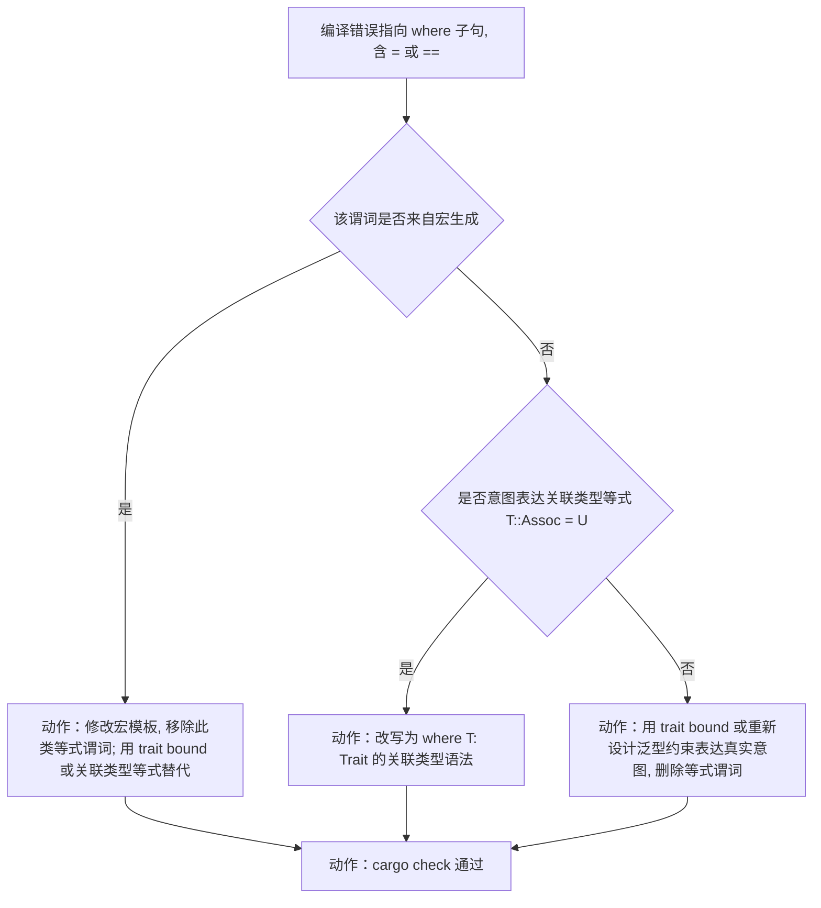
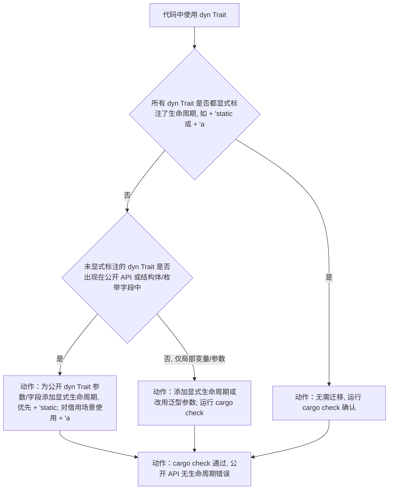
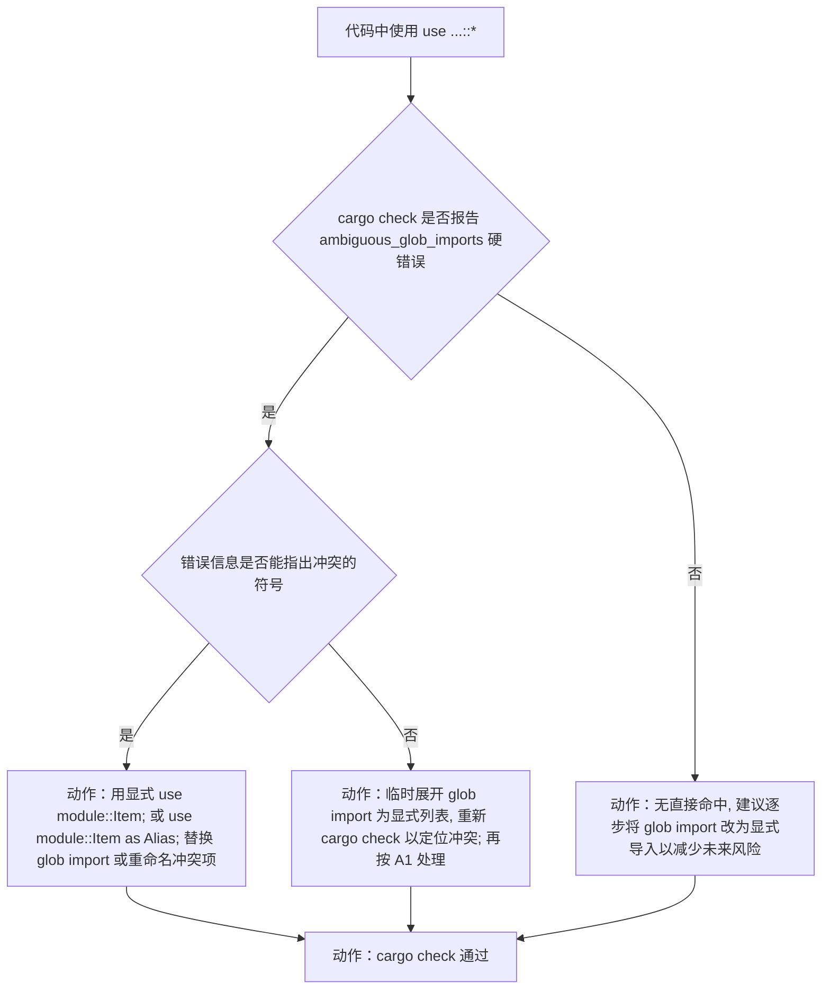
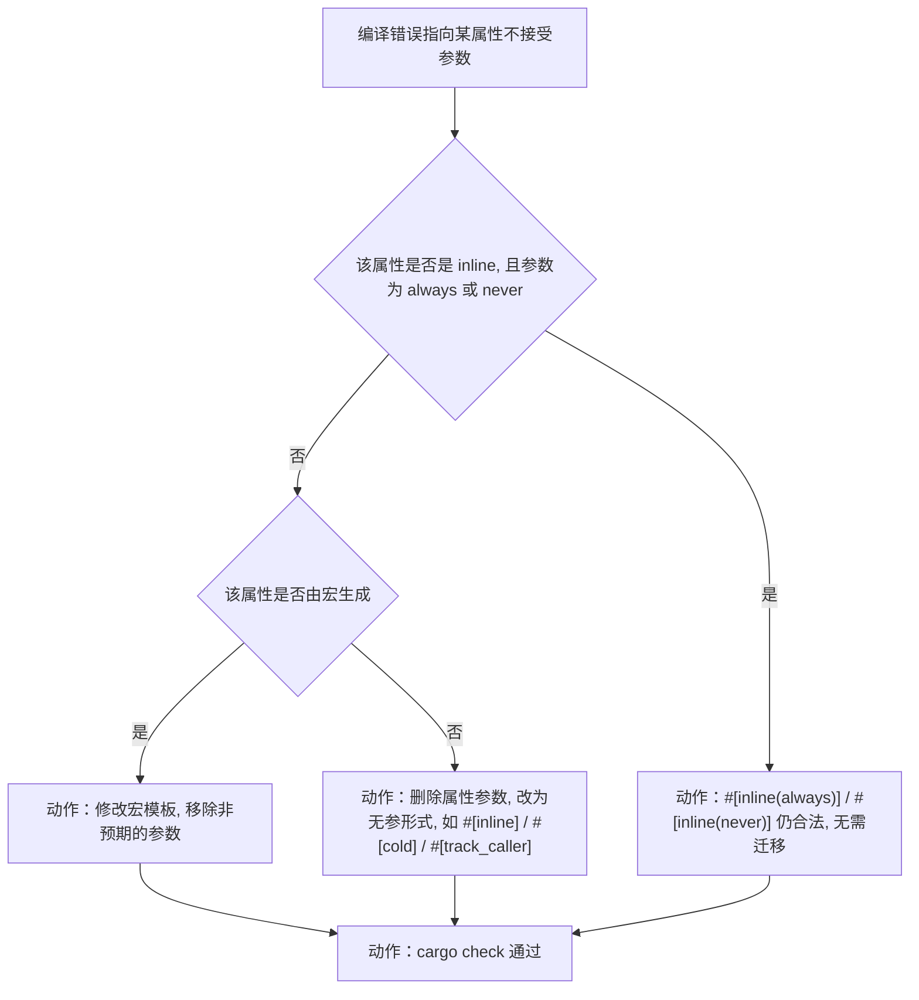
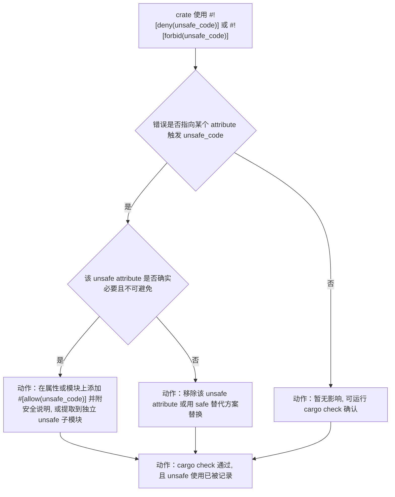
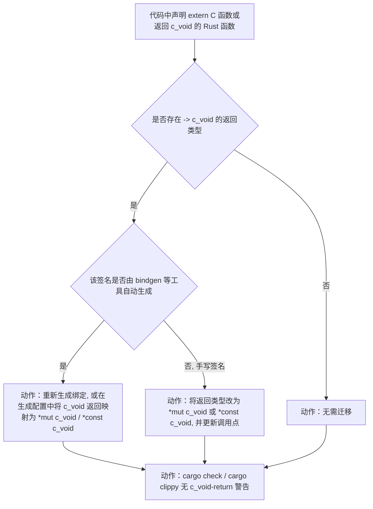
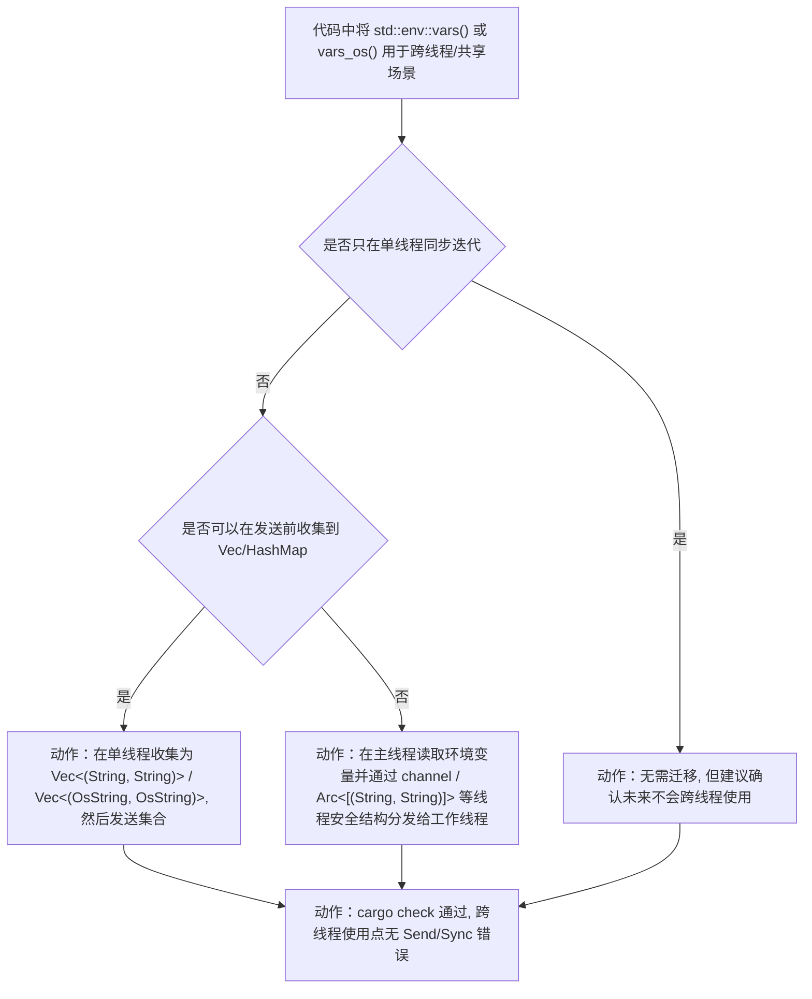

# Rust 1.98 兼容性迁移判定树

> **EN**: Rust 1.98 Compatibility Migration Decision Trees
> **Summary**: Executable decision trees that turn Rust 1.98.0's compatibility changes into "am I affected → root cause → concrete migration step" flows, covering 14 stabilized-in-beta/RC scenarios: `PanicHookInfo` `'static` lifetime, mingw-w64 toolchain baseline, Solaris `File::lock` removal, `-Zemscripten-wasm-eh` removal, `derive(PartialOrd)` fast path, `repr(transparent)` strict trivial fields, equality predicate syntax rejection, `transmute()` equal-size check, trait object lifetime defaults, `ambiguous_glob_imports` hard error, attribute argument rejection, `UNSAFE_CODE` unsafe attributes, `c_void` return lint, and `std::env::Vars{,Os}` `Send`/`Sync` removal — every leaf is an actionable fix rather than a jump link.
>
> **受众**: [专家]
> **内容分级**: [综述级]
> **权威来源**: 本文件为 `concept/` 权威页（Rust 1.98 兼容性**迁移判定**的唯一权威来源）。
> **Rust 版本**: **1.98.0+ (Edition 2024)**
> **Bloom 层级**: L3-L4（应用/分析：将版本变更映射到具体代码修复）
> **A/S/P 标记**: **P** — Process（迁移流程与判定）
> **双维定位**: P×App — 把版本兼容性变更应用到存量代码
> **前置概念**:
> [Rust 1.98 稳定特性](rust_1_98_stabilized.md) ·
> [Rust 版本跟踪](01_rust_version_tracking.md) ·
> [生命周期](../../01_foundation/01_ownership_borrow_lifetime/03_lifetimes.md) ·
> [错误处理](../../02_intermediate/03_error_handling/01_error_handling.md) ·
> [Linkage](../../03_advanced/04_ffi/03_linkage.md) ·
> [FFI](../../03_advanced/04_ffi/01_rust_ffi.md)
> **后置概念**:
> [Rust 1.98+ 前沿预览](rust_1_98_preview.md) ·
> [Rust 1.99+ 前沿预览](rust_1_99_preview.md)
> **companion reference**: 纯特性清单速查见 [`rust_1_98_stabilized.md`](rust_1_98_stabilized.md)
> **最后更新**: 2026-07-31
> **状态**: ✅ 已对齐 1.98.0 beta/RC；stable 发布（2026-08-20）后最终核对
>
> **主要来源**:
> · 版本页兼容性表：[`rust_1_98_stabilized.md`](rust_1_98_stabilized.md)
> · 周期跟踪页：[`rust_1_98_preview.md`](rust_1_98_preview.md)
> · 上游：[`releases.rs 1.98.0`](https://releases.rs/docs/1.98.0/)

---

## 0. 本文定位与非目标

**定位**：Rust 1.98.0 的兼容性变化需要在「是否受影响 → 如何迁移」的可执行判定树中落地。本文补齐该缺口：每个兼容性变化一节，给出可判定条件、根因节点，以及**具体迁移动作**作为树叶子。

**与姊妹页的分工**：[`rust_1_98_stabilized.md`](rust_1_98_stabilized.md) 提供 1.98 全部特性的**一览表**；[`feature_domain_matrix_198.md`](feature_domain_matrix_198.md) 提供特性 × 领域反查矩阵；本文只聚焦**兼容性迁移**，给出“是否受影响 → 根因 → 具体修复动作”的判定树。

**非目标**：

- 不重复版本页对已稳定特性的逐项解释。
- 不重复生命周期、FFI、linkage 的概念推导；本文只给**迁移判定与修复代码**。
- 不在判定树中使用「见某页」式双链跳转作为叶子。

---

## 1. 快速筛查表：是否受影响

| 变化 | 受影响代码特征（命中即需评估） | 严重度 | 是否需迁移 | 小节 |
|:---|:---|:---:|:---:|:---|
| `PanicHookInfo` `'static` 生命周期 | 自定义 panic hook 中显式标注 `Location<'_>` 生命周期，或把 `location()` 结果存入非 `'static` 上下文 | 高（编译失败） | 必须 | §3 |
| Windows-gnu 指定 mingw-w64 基线 | 在 `x86_64-pc-windows-gnu` / `i686-pc-windows-gnu` 上构建，且依赖 C/C++ FFI 或自定义链接脚本 | 中（构建行为变化） | 建议 | §4 |
| Solaris/Illumos 上 `File::lock` 移除 | 目标平台为 Solaris/Illumos，且使用 `std::fs::File::lock` 系列方法 | 高（运行时行为变化/功能缺失） | 必须 | §5 |
| `-Zemscripten-wasm-eh` 移除 | 构建脚本/CI 中使用 `-Zemscripten-wasm-eh` flag | 高（编译失败） | 必须 | §6 |
| `derive(PartialOrd)` 快速路径 | 类型同时具有 `PartialOrd` 与 `Ord`，且二者实现方式不同或逻辑不一致 | 中（行为/排序结果变化） | 建议 | §7 |
| `repr(transparent)` 严格化 | 使用 `#[repr(transparent)]` 且辅助字段为 `repr(C)`、私有字段类型或 `#[non_exhaustive]` 类型 | 高（编译失败） | 必须 | §8 |
| 等式谓词 `Type = Type` / `Type == Type` | 手写或宏生成的 where 子句中出现等式谓词 | 高（编译失败） | 必须 | §9 |
| `transmute()` 等大小检查 | 使用 `transmute` 转换带 `repr(...)` 属性的类型，或依赖过去被错误允许的 size 差异 | 高（编译失败/暴露 unsound） | 必须 | §10 |
| trait object 生命周期默认值 | 在复杂路径或公开 API 中完全省略 `dyn Trait` 生命周期 | 中（编译失败） | 建议 | §11 |
| `ambiguous_glob_imports` 硬错误 | 使用 `use module::*;` 且命中最直接的歧义 | 高（编译失败） | 必须 | §12 |
| 无参属性被传参 | 使用 `#[inline(true)]`、`#[cold(...)]` 等本不接受参数的属性 | 高（编译失败） | 必须 | §13 |
| `UNSAFE_CODE` 覆盖 unsafe attributes | crate 使用 `#![deny(unsafe_code)]` 且包含需要 `unsafe(...)` 包装的属性 | 高（编译失败） | 必须 | §14 |
| `c_void` 作为返回类型 lint | `extern "C"` 或 Rust 函数以裸 `c_void` 作为返回类型 | 低（warn-by-default，`-D warnings` 时变高） | 建议 | §15 |
| `std::env::Vars{,Os}` 不再 `Send`/`Sync` | 将 `std::env::vars()` / `vars_os()` 跨线程传递或共享 | 高（编译失败） | 必须 | §16 |

---

## 2. 总路由判定树

```mermaid
flowchart TD
    START["升级到 Rust 1.98.x 后 cargo check 或 CI 出现异常"] --> Q0{"当前 rustc 版本是否 >= 1.98.0"}
    Q0 -->|否| UP["动作：先升级到 Rust 1.98.0（如需 1.97.1 LLVM 修复已包含在 1.98.0 stable 中）"]
    Q0 -->|是| Q1{"异常/变化类型"}
    Q1 -->|编译期硬错误, 含 PanicHookInfo / Location / lifetime| R1["进入 §3 PanicHookInfo 'static 判定树"]
    Q1 -->|Windows GNU 目标链接/异常行为变化| R2["进入 §4 mingw-w64 判定树"]
    Q1 -->|Solaris/Illumos 上文件锁行为变化| R3["进入 §5 File::lock 判定树"]
    Q1 -->|编译期报错未知选项 -Zemscripten-wasm-eh| R4["进入 §6 Emscripten WASM EH 判定树"]
    Q1 -->|排序/比较结果变化或 derive 相关| R7["进入 §7 derive(PartialOrd) 判定树"]
    Q1 -->|repr(transparent) 编译错误| R8["进入 §8 repr(transparent) 判定树"]
    Q1 -->|where 子句语法错误| R9["进入 §9 等式谓词判定树"]
    Q1 -->|transmute 编译错误| R10["进入 §10 transmute 判定树"]
    Q1 -->|dyn Trait 生命周期错误| R11["进入 §11 trait object 生命周期判定树"]
    Q1 -->|glob import 歧义错误| R12["进入 §12 ambiguous_glob_imports 判定树"]
    Q1 -->|属性参数报错| R13["进入 §13 属性参数判定树"]
    Q1 -->|unsafe_code lint 报错| R14["进入 §14 UNSAFE_CODE 判定树"]
    Q1 -->|c_void 返回警告| R15["进入 §15 c_void return lint 判定树"]
    Q1 -->|env::vars 跨线程编译错误| R16["进入 §16 env::Vars Send/Sync 判定树"]
    Q1 -->|以上皆否| R17["对照 §1 表格逐行复核特征, 仍未命中则不属于本文 14 类变化"]
    UP --> Q1
```

---

## 3. 变化一：`PanicHookInfo` / `PanicInfo` `location()` 返回 `'static`

### 3.1 症状与报错信息

- **现象**：升级到 Rust 1.98 后，自定义 panic hook 或封装 `PanicInfo` 的泛型代码出现**编译期硬错误**，提示生命周期不匹配。
- **诊断信息特征**：错误信息含 `PanicHookInfo`、`Location`、`lifetime` 或 `'static`。
- **根因（事实）**：Rust 1.98.0 将 `std::panic::PanicHookInfo::location()`（以及对应的 `PanicInfo::location()`）返回类型从 `Option<&Location<'_>>` 改为 `Option<&'static Location<'static>>`。`'static` 引用可协变为更短生命周期，因此仅在把 `Location` 生命周期与某个局部生命周期显式绑定的代码中会编译失败（来源：版本页 §1.12）。
- **风险等级**：高——命中即无法编译。

### 3.2 判定树（PanicHookInfo 'static）



### 3.3 迁移前 / 后代码对比

**迁移前（Rust 1.97，泛型 Trait 绑定局部生命周期，1.98 起编译失败）**：

```rust,ignore
// edition = "2024", rust = "1.97" —— 1.98 起生命周期不匹配
trait LocProvider<'a> {
    fn location(&self) -> &'a std::panic::Location<'a>;
}

impl<'a> LocProvider<'a> for std::panic::PanicInfo<'a> {
    fn location(&self) -> &'a std::panic::Location<'a> {
        self.location().unwrap() // 1.98: 返回 &'static Location<'static>, 无法强制转换
    }
}
```

**迁移后（Rust 1.98+，统一为 `'static`）**：

```rust,ignore
// edition = "2024", rust = "1.98" —— 与 1.98 返回类型对齐
trait LocProvider {
    fn location(&self) -> &'static std::panic::Location<'static>;
}

impl LocProvider for std::panic::PanicInfo<'_> {
    fn location(&self) -> &'static std::panic::Location<'static> {
        self.location().unwrap()
    }
}
```

### 3.4 验证方法

```bash
# 1) 编译期确认生命周期错误消失
cargo check

# 2) 全量检查 panic hook 相关泛型代码
RUSTFLAGS="-D warnings" cargo check
```

---

## 4. 变化二：mingw-w64 C 工具链更新

### 4.1 症状与报错信息

- **现象**：在 Windows GNU 目标上构建时，链接行为、异常模型或运行时依赖发生变化；可能表现为链接警告、运行时崩溃或产物布局差异。
- **根因（事实）**：Rust 1.98.0 为 Windows GNU 目标指定了最低 mingw-w64/GCC/binutils 工具链版本基线，低于基线的环境可能无法编译或链接（来源：版本页 §2.1）。
- **风险等级**：中——通常仍能编译，但产物行为可能变化。

### 4.2 判定树（mingw-w64）


### 4.3 迁移检查清单

- [ ] 在 `x86_64-pc-windows-gnu` 目标上重新运行 CI；
- [ ] 检查 C/C++ 依赖的链接是否仍通过；
- [ ] 若使用自定义 mingw-w64 安装，确认版本不低于 Rust 推荐基线；
- [ ] 对 release 构建跑 `cargo test --release`。

---

## 5. 变化三：Solaris/Illumos 上 `File::lock` 实现移除

### 5.1 症状与报错信息

- **现象**：在 Solaris/Illumos 目标上，原先可用的 `std::fs::File::lock` 现在返回 `ErrorKind::Unsupported`。
- **根因（事实）**：Solaris/Illumos 上 `File::lock` 的原实现使用了错误的底层原语，导致文件锁语义与其他平台不一致；1.98.0 移除了该实现以避免错误的安全保证（来源：版本页 §2.4）。
- **风险等级**：高——依赖文件锁的代码在 Solaris/Illumos 上行为改变。

### 5.2 判定树（Solaris File::lock）


### 5.3 迁移前 / 后代码对比

**迁移前（Rust 1.97，Solaris 上 `File::lock` 可用，1.98 起移除）**：

```rust,ignore
// edition = "2024", rust = "1.97" —— 1.98 起 Solaris 上 File::lock 不再保证
use std::fs::File;

fn lock_file(f: &File) -> std::io::Result<()> {
    f.lock()
}
```

**迁移后（Rust 1.98+，使用跨平台 crate）**：

```rust,ignore
// edition = "2024", rust = "1.98" —— 使用 fs2 的 FileExt
use fs2::FileExt;
use std::fs::File;

fn lock_file(f: &File) -> std::io::Result<()> {
    f.lock_exclusive()
}
```

> 选择判据：若项目已有 `fs2`/`file-lock` 依赖 → 直接迁移；若希望零依赖 → 用 `libc::flock` 自行包装，但需处理平台差异。

---

## 6. 变化四：移除 `-Zemscripten-wasm-eh`

### 6.1 症状与报错信息

- **现象**：升级到 Rust 1.98 后，使用 `-Zemscripten-wasm-eh` 的构建脚本或 CI 出现编译错误「未知选项」。
- **根因（事实）**：`-Zemscripten-wasm-eh=false` 被移除，Emscripten 目标现在无条件使用 WASM exception handling ABI（来源：版本页 §2.2）。
- **风险等级**：高——命中即无法编译。

### 6.2 判定树（Emscripten WASM EH）



### 6.3 迁移前 / 后代码对比

**迁移前（Rust 1.97，使用已移除 flag）**：

```toml
# .cargo/config.toml (Rust 1.97, nightly)
[build]
rustflags = ["-Zemscripten-wasm-eh"]
target = "wasm32-unknown-emscripten"
```

**迁移后（Rust 1.98+，改用 Emscripten 原生配置）**：

```toml
# .cargo/config.toml (Rust 1.98+)
[build]
target = "wasm32-unknown-emscripten"

[target.wasm32-unknown-emscripten]
rustflags = ["-C", "link-args=-sWASM_EXCEPTIONS=1"]
```

> 选择判据：若不需要异常处理 → 直接移除 flag；若需要 → 用 `-sWASM_EXCEPTIONS`（Emscripten 3.1.43+）或 `-sDISABLE_EXCEPTION_CATCHING=0`。

### 6.4 验证方法

```bash
# 1) 确认 -Zemscripten-wasm-eh 不再使用
grep -R "emscripten-wasm-eh" .cargo/ build.rs .github/workflows/

# 2) 重新构建 Emscripten 目标
cargo build --target wasm32-unknown-emscripten
```

---

## 7. 变化五：`derive(PartialOrd)` 快速路径暴露不一致

### 7.1 症状与报错信息

- **现象**：升级到 Rust 1.98 后，依赖 `sort`、`partial_cmp`、`cmp` 的测试断言失败，或排序结果改变。
- **诊断信息特征**：错误通常出现在运行期；编译期不会报错，除非 trait bound 同时缺失。
- **根因（事实）**：当同时为类型派生 `PartialOrd` 和 `Ord` 时，`#[derive(PartialOrd)]` 现在会识别出存在 `Ord` 实现并走快速路径：直接调用 `Ord::cmp` 再比较结果。如果 `PartialOrd` 与 `Ord` 实现不一致（例如一个派生、一个手写），排序/比较结果会变化（来源：版本页 §4.1 / §5.1）。
- **风险等级**：中——行为变化，通常通过测试发现。

### 7.2 判定树（derive(PartialOrd) fast path）



### 7.3 迁移检查清单

- [ ] 搜索 `#[derive(PartialOrd, Ord)]` 与 `#[derive(PartialOrd)]` + `impl Ord` 的组合；
- [ ] 运行 `cargo test --workspace`，重点关注 `sort`、`partial_cmp`、`cmp`、`binary_search_by`；
- [ ] 对不一致类型统一为全派生或全手写实现。

---

## 8. 变化六：`repr(transparent)` 对 trivial 布局字段更严格

### 8.1 症状与报错信息

- **现象**：升级到 Rust 1.98 后，`#[repr(transparent)]` 类型出现编译错误，提示辅助字段不满足 trivial 布局要求。
- **根因（事实）**：`#[repr(transparent)]` 要求只有一个非 ZST 字段，其余字段必须是明确 ZST（如 `PhantomData<T>`）。1.98.0 不再允许 `repr(C)` 类型、私有字段类型或 `#[non_exhaustive]` 类型作为忽略字段（来源：版本页 §1.7 / §5.2）。
- **风险等级**：高——命中即无法编译。

### 8.2 判定树（repr(transparent) strict trivial fields）

```mermaid
flowchart TD
    Q0["代码中使用 #[repr(transparent)]"] --> Q1{"类型是否只有一个非 ZST 字段"}
    Q1 -->|否| A1["动作：重构为单非 ZST 字段 + ZST 标记字段, 或改用 #[repr(C)] 并显式管理布局"]
    Q1 -->|是| Q2{"其余字段是否均为已知 ZST, 例如 PhantomData<T> / ()"}
    Q2 -->|是| OK1["动作：无需迁移, 运行 cargo check 确认"]
    Q2 -->|否, 含 repr(C) / 私有字段 / #[non_exhaustive] 类型| A2["动作：将辅助字段替换为 PhantomData<T> 等明确 ZST, 或改用 #[repr(C)] 显式布局"]
    A1 --> V["动作：cargo check 通过"]
    A2 --> V
    OK1 --> V
```

### 8.3 迁移前 / 后代码对比

**迁移前（Rust 1.97，仅 warning，1.98 起硬错误）**：

```rust,ignore
// edition = "2024", rust = "1.97" —— 1.98 起编译失败
#[repr(transparent)]
pub struct Wrapper<T> {
    pub value: u64,
    pub _marker: std::marker::PhantomData<T>, // OK
    // 若此处是 repr(C) 的辅助类型, 1.98 报错
}
```

**迁移后（Rust 1.98+）**：

```rust,ignore
// edition = "2024", rust = "1.98" —— 仅允许一个非 ZST + 明确 ZST
#[repr(transparent)]
pub struct Wrapper<T> {
    pub value: u64,
    pub _marker: std::marker::PhantomData<T>,
}
```

### 8.4 验证方法

```bash
# 搜索所有 repr(transparent)
rg "#\[repr\(transparent\)\]"

# 确认通过
cargo check
```

---

## 9. 变化七：等式谓词 `Type = Type` / `Type == Type` 被语法层拒绝

### 9.1 症状与报错信息

- **现象**：升级到 Rust 1.98 后，where 子句中出现 `where T = U` 或 `where T == U` 的代码编译失败。
- **根因（事实）**：Rust where 子句从未支持普通类型等式约束，但解析器此前延迟到类型检查阶段才报错。1.98.0 在解析层直接拒绝，使错误位置更明确（来源：版本页 §1.6 / §5.3）。
- **风险等级**：高——命中即无法编译。

### 9.2 判定树（equality predicate rejection）



### 9.3 迁移前 / 后代码对比

**迁移前（Rust 1.97）**：

```rust,ignore
// edition = "2024", rust = "1.97" —— 1.98 起解析错误
fn foo<T, U>()
where
    T = U, // 从未合法, 但 1.98 前错误信息更模糊
{
}
```

**迁移后（Rust 1.98+）**：

```rust,ignore
// edition = "2024", rust = "1.98" —— 使用 trait bound
fn foo<T, U>()
where
    T: Into<U>, // 或 T: SameAs<U> 等真实约束
{
}
```

### 9.4 验证方法

```bash
# 搜索宏模板或手写 where 中的等式谓词
rg "where[^;{]*=" concept/ src/ --type rust
rg "where[^;{]*==" concept/ src/ --type rust

cargo check
```

---

## 10. 变化八：`transmute()` 在涉及 `repr` 属性时更严格地检查等大小

### 10.1 症状与报错信息

- **现象**：升级到 Rust 1.98 后，某些 `std::mem::transmute` 调用出现编译错误，提示源类型与目标类型大小不同。
- **根因（事实）**：`std::mem::transmute` 要求源类型和目标类型大小相等。当类型带有 `repr` 属性时，旧实现的大小相等检查存在缺陷，可能错误地允许大小不同的类型之间转换。1.98.0 修复了该检查（来源：版本页 §5.5）。
- **风险等级**：高——命中即无法编译；此前通过的转换可能暴露 unsound。

### 10.2 判定树（transmute equal-size check）

```mermaid
flowchart TD
    Q0["代码中使用 std::mem::transmute"] --> Q1{"源类型与目标类型是否完全相同, 或均为无 repr 属性的同构类型"}
    Q1 -->|是| OK1["动作：低风险, 运行 cargo check 确认"]
    Q1 -->|否, 涉及 repr(C)/repr(transparent)/repr(packed) newtype| Q2{"是否有 static_assert 保证 size_of::<Src>() == size_of::<Dst>()"}
    Q2 -->|是| A1["动作：保留 static_assert, 考虑用 safer_transmute/zerocopy 等类型安全抽象替换裸 transmute"]
    Q2 -->|否| A2["动作：用 std::mem::size_of 校验, 或改用显式字段映射 / pointer cast / transmute_copy; 若大小确实不同则重构类型"]
    A1 --> V["动作：cargo check 与 cargo test 通过"]
    A2 --> V
    OK1 --> V
```

### 10.3 迁移前 / 后代码对比

**迁移前（Rust 1.97，可能被错误允许）**：

```rust,ignore
// edition = "2024", rust = "1.97"
#[repr(C)]
pub struct A(u64);

#[repr(transparent)]
pub struct B(A); // 语义上大小可能不同

pub unsafe fn to_b(a: A) -> B {
    std::mem::transmute(a) // 1.98 起可能被拒绝
}
```

**迁移后（Rust 1.98+）**：

```rust,ignore
// edition = "2024", rust = "1.98"
use static_assertions::assert_eq_size;

assert_eq_size!(A, B);

pub unsafe fn to_b(a: A) -> B {
    std::mem::transmute(a)
}
```

> 替代方案：使用 `zerocopy::transmute!` 或 `bytemuck` 等库，它们在编译期强制 size 与 align 约束。

### 10.4 验证方法

```bash
# 搜索 transmute 调用
rg "mem::transmute" src/ --type rust

cargo check
cargo test --workspace
```

---

## 11. 变化九：trait object 完全省略生命周期时推断更严格

### 11.1 症状与报错信息

- **现象**：升级到 Rust 1.98 后，完全省略生命周期的 `dyn Trait` 类型出现生命周期不匹配或推断错误。
- **根因（事实）**：完全省略生命周期的 trait object 在复杂路径（如关联类型路径）中的默认生命周期推断被修正，此前某些 niche 场景会推断出更宽松的边界（来源：版本页 §5.4）。
- **风险等级**：中——主要影响公开 API 或依赖隐式推断的边缘代码。

### 11.2 判定树（trait object lifetime defaults）



### 11.3 迁移前 / 后代码对比

**迁移前（Rust 1.97）**：

```rust,ignore
// edition = "2024", rust = "1.97"
pub struct Handler {
    callback: Box<dyn Fn()>, // 隐式生命周期
}
```

**迁移后（Rust 1.98+）**：

```rust,ignore
// edition = "2024", rust = "1.98"
pub struct Handler {
    callback: Box<dyn Fn() + 'static>, // 显式生命周期
}
```

### 11.4 验证方法

```bash
# 搜索完全省略生命周期的 dyn Trait（粗略）
rg "dyn [A-Z][A-Za-z0-9_]*\b[^+<]*\)" src/ --type rust

cargo check
```

---

## 12. 变化十：`ambiguous_glob_imports` 部分转为硬错误

### 12.1 症状与报错信息

- **现象**：升级到 Rust 1.98 后，`use module::*;` 产生编译错误，提示歧义 glob import。
- **根因（事实）**：某些最直接的歧义 glob import 此前仅通过 lint 报告，1.98.0 提升为硬错误（来源：版本页 §1.4 / §5.7）。
- **风险等级**：高——命中即无法编译。

### 12.2 判定树（ambiguous_glob_imports hard error）



### 12.3 验证方法

```bash
# 搜索 glob import
rg "use .*::\*;" src/ --type rust

cargo check
```

---

## 13. 变化十一：属性参数意外被接受现在报错

### 13.1 症状与报错信息

- **现象**：升级到 Rust 1.98 后，`#[inline(true)]`、`#[cold(...)]`、`#[track_caller(...)]` 等属性编译错误，提示不接受参数。
- **根因（事实）**：某些 attribute（如 `#[inline]`、`#[cold]`、`#[track_caller]`）不接受参数，但解析器此前在部分错误恢复路径中没有正确拒绝 `#[inline(true)]`。1.98.0 统一检查逻辑（来源：版本页 §1.11 / §5.8）。
- **风险等级**：高——命中即无法编译。

### 13.2 判定树（attribute argument rejection）



### 13.3 迁移前 / 后代码对比

**迁移前（Rust 1.97）**：

```rust,ignore
#[inline(true)] // 错误恢复路径可能未拒绝
fn foo() {}
```

**迁移后（Rust 1.98+）**：

```rust,ignore
#[inline] // 正确无参形式
fn foo() {}
```

### 13.4 验证方法

```bash
# 搜索可疑属性参数
rg "#\[inline\([^\]]+\)\]|#\[cold\([^\]]+\)\]|#\[track_caller\([^\]]+\)\]" src/ --type rust

cargo check
```

---

## 14. 变化十二：unsafe attributes 统一触发 `UNSAFE_CODE` lint

### 14.1 症状与报错信息

- **现象**：升级到 Rust 1.98 后，使用 `#![deny(unsafe_code)]` 的 crate 因某些属性（如 `#[no_mangle]`）编译失败。
- **根因（事实）**：`#![deny(unsafe_code)]` 用于声明 crate 不使用 `unsafe`。此前某些 unsafe attribute 不会被 `UNSAFE_CODE` lint 捕获；1.98.0 将 lint 逻辑前移到 attribute 解析阶段，确保所有需要在 `unsafe(...)` 包装中的 attribute 都被一致计数（来源：版本页 §5.6）。
- **风险等级**：高——对 deny(unsafe_code) crate 命中即编译失败。

### 14.2 判定树（UNSAFE_CODE unsafe attributes）



### 14.3 迁移检查清单

- [ ] 列出 `#![deny(unsafe_code)]` crate 中所有需要 `unsafe(...)` 包装的属性；
- [ ] 对每个属性评估是否必要；
- [ ] 必要的属性添加 `#[allow(unsafe_code)]` 与安全注释；
- [ ] 不必要的属性移除或替换为 safe 替代。

---

## 15. 变化十三：`c_void` 作为返回类型 lint

### 15.1 症状与报错信息

- **现象**：升级到 Rust 1.98 后，`extern "C"` 声明或 Rust 函数把 `core::ffi::c_void` / `std::ffi::c_void` 作为返回类型时产生 warning。
- **根因（事实）**：`c_void` 是不完整类型，直接作为返回类型会丢失类型信息并增加 `transmute` 误用风险。新 lint 默认 warn（来源：版本页 §1.5）。
- **风险等级**：低——warn-by-default；在 `-D warnings` 或 CI 启用 deny warnings 时变高。

### 15.2 判定树（c_void return lint）



### 15.3 迁移前 / 后代码对比

**迁移前（Rust 1.97）**：

```rust,ignore
extern "C" {
    fn opaque() -> std::ffi::c_void; // 1.98 起触发 lint
}
```

**迁移后（Rust 1.98+）**：

```rust,ignore
extern "C" {
    fn opaque() -> *mut std::ffi::c_void;
}
```

### 15.4 验证方法

```bash
# 搜索 c_void 返回
grep -R "-> .*c_void" src/ --include="*.rs"

cargo check
```

---

## 16. 变化十四：`std::env::Vars{,Os}` 不再实现 `Send`/`Sync`

### 16.1 症状与报错信息

- **现象**：升级到 Rust 1.98 后，将 `std::env::Vars` 或 `std::env::VarsOs` 跨线程传递或共享引用时编译失败，提示未实现 `Send`/`Sync`。
- **根因（事实）**：`std::env::Vars` 和 `std::env::VarsOs` 在底层持有进程环境变量的迭代状态，这些状态不是线程安全的。1.98.0 显式移除这些自动 trait 实现（来源：版本页 §3.4 / §5 检查清单）。
- **风险等级**：高——命中即无法编译。

### 16.2 判定树（std::env::Vars Send/Sync removal）



### 16.3 迁移前 / 后代码对比

**迁移前（Rust 1.97）**：

```rust,ignore
// edition = "2024", rust = "1.97"
use std::env;
use std::thread;

fn spawn_env_reader() {
    let vars = env::vars();
    thread::spawn(move || {
        for (k, v) in vars {
            println!("{k}={v}");
        }
    });
}
```

**迁移后（Rust 1.98+）**：

```rust,ignore
// edition = "2024", rust = "1.98"
use std::env;
use std::thread;

fn spawn_env_reader() {
    let vars: Vec<_> = env::vars().collect();
    thread::spawn(move || {
        for (k, v) in vars {
            println!("{k}={v}");
        }
    });
}
```

### 16.4 验证方法

```bash
# 搜索 env::vars / vars_os 的跨线程使用
grep -R "env::vars" src/ --include="*.rs"

cargo check
```

---

## 17. 验证总览

| 变化 | 主验证命令 | 辅助验证 |
|:---|:---|:---|
| `PanicHookInfo` `'static` | `cargo check` | `RUSTFLAGS="-D warnings" cargo check` |
| Windows-gnu 基线 | `cargo build --target x86_64-pc-windows-gnu` | `cargo test --target x86_64-pc-windows-gnu` |
| Solaris `File::lock` | 在 Solaris/Illumos 目标上跑集成测试 | 检查文件锁替代方案行为 |
| `-Zemscripten-wasm-eh` | `cargo build --target wasm32-unknown-emscripten` | `grep -R "emscripten-wasm-eh"` |
| `derive(PartialOrd)` 快速路径 | `cargo test --workspace` | 重点检查 sort / partial_cmp / cmp 断言 |
| `repr(transparent)` 严格化 | `cargo check` | `rg "#\[repr\(transparent\)\]"` |
| 等式谓词拒绝 | `cargo check` | `rg "where[^;{]*=\|=="` |
| `transmute()` 等大小检查 | `cargo check` | `rg "mem::transmute"` |
| trait object 生命周期默认值 | `cargo check` | 公开 API 中显式标注 `dyn Trait + 'static` |
| `ambiguous_glob_imports` | `cargo check` | `rg "use .*::\*;"` |
| 属性参数拒绝 | `cargo check` | `rg "#\[inline\([^\]]+\)\]"` 等 |
| `UNSAFE_CODE` unsafe attrs | `cargo check` | 审查 `#![deny(unsafe_code)]` crate 的属性 |
| `c_void` 返回 lint | `cargo check` / `cargo clippy` | `grep -R "-> .*c_void"` |
| `std::env::Vars` `Send`/`Sync` | `cargo check` | `grep -R "env::vars"` |

---

## 18. 维护规则

1. 新版本 `X` 的迁移判定树放在 `concept/07_future/00_version_tracking/migration_<X>_decision_tree.md`。
2. 判定树叶子必须是**可执行动作**：改生命周期、改工具链配置、换 crate、改 Emscripten flag、改 derive 实现、改 repr 布局、改 where 子句、改 transmute、改 dyn Trait 生命周期、改 glob import、改属性参数、允许/移除 unsafe attribute、改 c_void 签名、收集 env vars。
3. 禁止任何叶子写成「见某页」式双链跳出。
4. 新增树后必须在 §1 快速筛查表与 §17 验证总览中登记。
5. 所有兼容性变化必须能在 [`rust_1_98_stabilized.md`](rust_1_98_stabilized.md) §5 找到事实出处；事实出处变化时同步更新判定树。

---

## 19. 关联概念与权威来源索引

| 概念/来源 | 用途 |
|:---|:---|
| [Rust 1.98 稳定特性](rust_1_98_stabilized.md) | 14 项兼容性变更事实出处 |
| [生命周期](../../01_foundation/01_ownership_borrow_lifetime/03_lifetimes.md) | `PanicHookInfo` `'static`、trait object 生命周期迁移的语义基础 |
| [错误处理](../../02_intermediate/03_error_handling/01_error_handling.md) | panic hook 与 `Location` 使用场景 |
| [Traits](../../02_intermediate/00_traits/01_traits.md) | 等式谓词、trait object 生命周期、derive 一致性的语义基础 |
| [Derive traits](../../02_intermediate/00_traits/06_derive_traits.md) | `derive(PartialOrd)` 快速路径语义基础 |
| [Linkage](../../03_advanced/04_ffi/03_linkage.md) | mingw-w64 链接行为变化背景 |
| [FFI](../../03_advanced/04_ffi/01_rust_ffi.md) | mingw-w64 / Emscripten / `c_void` / `transmute` 边界 |
| [Memory model / layout](../../03_advanced/02_unsafe/06_memory_model.md) | `repr(transparent)`、`transmute` 大小检查语义基础 |
| [Unsafe](../../03_advanced/02_unsafe/01_unsafe.md) | `UNSAFE_CODE` unsafe attributes 语义基础 |
| [Attributes](../../01_foundation/09_macros_basics/01_attributes_and_macros.md) | 属性参数拒绝语义基础 |
| [Module system](../../02_intermediate/05_modules_and_visibility/01_module_system.md) | `ambiguous_glob_imports` 语义基础 |
| [Send/Sync](../../03_advanced/00_concurrency/02_send_sync_auto_traits.md) | `std::env::Vars` 自动 trait 变化语义基础 |
| [WebAssembly](../../06_ecosystem/11_domain_applications/03_webassembly.md) | `-Zemscripten-wasm-eh` 迁移背景 |
| [Target Tier 平台支持](../../06_ecosystem/05_systems_and_embedded/10_target_tier_platform_support.md) | Solaris/Illumos、Windows GNU、Emscripten、LoongArch 目标定位 |

> **Canonical 声明**：本页是 Rust 1.98 **兼容性迁移判定**的唯一权威页。

---

## 国际权威参考 / International Authority References（P0 官方 · P1 学术）

- **P0 官方 Reference**: [Rust Reference — Lifetimes](https://doc.rust-lang.org/reference/lifetime-elision.html) · [std::panic::PanicHookInfo](https://doc.rust-lang.org/std/panic/struct.PanicHookInfo.html) · [std::panic::Location](https://doc.rust-lang.org/std/panic/struct.Location.html) · [Rust Reference — Attributes](https://doc.rust-lang.org/reference/attributes.html) · [Rust Reference — Type layouts](https://doc.rust-lang.org/reference/type-layout.html)
- **P0 官方 RFCs / release notes**: [releases.rs — Rust 1.98.0](https://releases.rs/docs/1.98.0/)
- **P1 学术/形式化**: [Jung, Jourdan, Krebbers & Dreyer: RustBelt — Securing the Foundations of the Rust Programming Language（POPL 2018）](https://plv.mpi-sws.org/rustbelt/)

## 🧭 思维导图（Mindmap）

```mermaid
mindmap
  root((Rust 1.98 兼容性迁移判定树))
    1 快速筛查表
    2 总路由判定树
    3 PanicHookInfo 'static
    4 mingw-w64 基线
    5 Solaris File::lock
    6 -Zemscripten-wasm-eh 移除
    7 derive(PartialOrd) 快速路径
    8 repr(transparent) 严格化
    9 等式谓词语法拒绝
    10 transmute 等大小检查
    11 trait object 生命周期默认值
    12 ambiguous_glob_imports 硬错误
    13 属性参数拒绝
    14 UNSAFE_CODE unsafe attributes
    15 c_void 返回 lint
    16 env::Vars Send/Sync 移除
    17 验证总览
```

## 国际化权威来源补充（International Authority Sources）

- <https://dl.acm.org/doi/10.1145/3158154>
- <https://blog.rust-lang.org/>
- <https://rust-lang.github.io/rfcs/>
