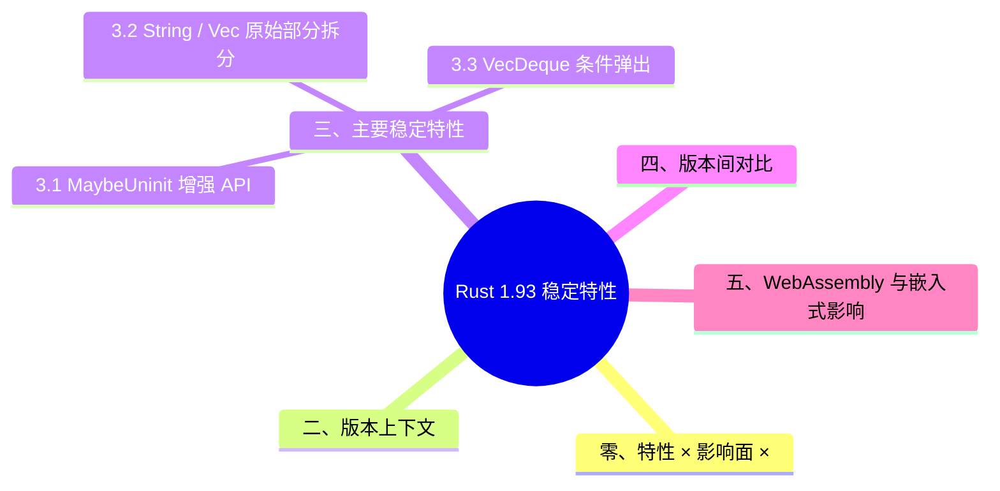

# Rust 1.93 稳定特性
>
> **EN**: Rust 1.93 Stabilized Features
> **Summary**: Rust 1.93 stabilized features across MaybeUninit APIs, String/Vec raw parts, VecDeque conditional pop, slice array conversion, Duration nanoseconds, and formatting helpers.
> **内容分级**: [参考级]
>
> **受众**: [进阶] / [专家]
> **层级**: L2-L3 版本追踪（稳定化特性记录）
> **Bloom 层级**: L2-L3
> **Rust 版本**: 1.93.0+ (历史版本)
> **权威来源**: 本文件为 `concept/` 权威页。
> **状态**: 从 `crates/c12_wasm/docs/16_rust_193_wasm_improvements.md` 迁移整理
>
> **主要来源**: [The Rust Reference](https://doc.rust-lang.org/reference/introduction.html) · [The Rust Programming Language](https://doc.rust-lang.org/book/title-page.html) · [Rust Standard Library](https://doc.rust-lang.org/std/)
>
> **前置概念**: [Ownership](../../01_foundation/01_ownership_borrow_lifetime/01_ownership.md) · [Type System](../../01_foundation/02_type_system/01_type_system.md) · [Unsafe Rust](../../03_advanced/02_unsafe/01_unsafe.md)
> **后置概念**: [Rust 1.92 稳定特性](rust_1_92_stabilized.md) · [Rust 版本跟踪](01_rust_version_tracking.md) · [WebAssembly 生态](../../06_ecosystem/11_domain_applications/03_webassembly.md)

---

## 零、特性 × 影响面 × 受益场景矩阵（2026-07-14 对齐 1.97 范式）

> **说明**：本节对齐 [`rust_1_97_stabilized.md`](rust_1_97_stabilized.md) 的矩阵结构；其中 §三 已深化的 7 条 API 见下文，本节补齐发布说明中的其余核心特性。
>
> **官方发布说明可访问性实测**（2026-07-14，`curl` HTTP 200）：
> [releases.rs 1.93.0](https://releases.rs/docs/1.93.0/) · [Rust 1.93.0 Release Blog](https://blog.rust-lang.org/2026/01/22/Rust-1.93.0/)

| 特性 | 影响面 | 受益场景 | 权威源 |
|:---|:---|:---|:---|
| `asm_cfg` 稳定 | 语言 / 内联汇编 | `#[cfg]` 驱动的汇编分支编译期选择 | [releases.rs](https://releases.rs/docs/1.93.0/) · [Unsafe](../../03_advanced/02_unsafe/01_unsafe.md) · [01 inline assembly](../../03_advanced/05_inline_assembly/01_inline_assembly.md) · [01 inline assembly](../../03_advanced/05_inline_assembly/01_inline_assembly.md) |
| `system` ABI C 风格可变参数函数稳定 | 语言 / FFI | 全主流 ABI 的 variadic 声明能力 | [releases.rs](https://releases.rs/docs/1.93.0/) · [FFI](../../03_advanced/04_ffi/01_rust_ffi.md) · [01 rust ffi](../../03_advanced/04_ffi/01_rust_ffi.md) |
| `MaybeUninit` 切片（Slice） API（`assume_init_ref/mut`、`write_copy/clone_of_slice`、`assume_init_drop`） | unsafe / 内存 | 部分初始化缓冲区的安全读写（见 §3.1） | [releases.rs](https://releases.rs/docs/1.93.0/) · [Unsafe](../../03_advanced/02_unsafe/01_unsafe.md) · [01 unsafe](../../03_advanced/02_unsafe/01_unsafe.md) |
| `String::into_raw_parts` / `Vec::into_raw_parts` | 标准库 / FFI | 堆缓冲区跨边界零拷贝移交（见 §3.2） | [releases.rs](https://releases.rs/docs/1.93.0/) · [FFI](../../03_advanced/04_ffi/01_rust_ffi.md) |
| `<[T]>::as_array` / `as_mut_array` | 标准库 | 切片↔定长数组零成本转换（见 §3.4） | [releases.rs](https://releases.rs/docs/1.93.0/) · [01 collections](../../01_foundation/05_collections/01_collections.md) · [01 collections](../../01_foundation/05_collections/01_collections.md) |
| `fmt::from_fn` / `fmt::FromFn` | 标准库 / 格式化 | 闭包（Closures）直接实现 `Display` 等格式化 trait（见 §3.7） | [releases.rs](https://releases.rs/docs/1.93.0/) · [03 formatting and display](../../01_foundation/06_strings_and_text/03_formatting_and_display.md) · [03 formatting and display](../../01_foundation/06_strings_and_text/03_formatting_and_display.md) |
| `-Cjump-tables` 稳定（原 `-Zno-jump-tables`） | 编译器 | 禁用跳转表（嵌入式/侧信道缓解） | [releases.rs](https://releases.rs/docs/1.93.0/) · [01 toolchain](../../06_ecosystem/00_toolchain/01_toolchain.md) · [01 toolchain](../../06_ecosystem/00_toolchain/01_toolchain.md) |
| `cargo clean --workspace` | Cargo | 工作区级清理 | [releases.rs](https://releases.rs/docs/1.93.0/) · [Cargo 命令参考](../../06_ecosystem/01_cargo/19_cargo_commands_reference.md) · [19 cargo commands reference](../../06_ecosystem/01_cargo/19_cargo_commands_reference.md) |

---

## 一、概述

Rust 1.93.0 在标准库中稳定了一批与内存管理、容器操作和格式化相关的新 API。这些特性对 WebAssembly、嵌入式和系统编程场景尤为实用。

## 二、版本上下文

| 项目 | 说明 |
|:---|:---|
| 版本 | 1.93.0 |
| 频道 | Stable |
| 上一版本 | [Rust 1.92 稳定特性](rust_1_92_stabilized.md) |
| 下一版本 | [Rust 1.94 稳定特性](rust_1_94_stabilized.md) |
| 适用 Edition | 2015 / 2018 / 2021 / 2024 |
| 获取方式 | `rustup update stable` 或 `rustup toolchain install 1.93.0` |

```bash
rustup toolchain install 1.93.0
rustup run 1.93.0 cargo build
```

---

## 三、主要稳定特性

1.93 的稳定面集中在**标准库的底层安全 API**：把一批原先需要手写 `unsafe` 指针操作的场景，升级为类型系统（Type System）可校验的安全封装。按影响面可分三组：

- **未初始化内存**：`MaybeUninit` 系列增强，减少裸 `*mut T` 手写；
- **容器内部表示**：`String`/`Vec`/`VecDeque` 暴露受控的原始部分访问，配合 `unsafe` 块实现零拷贝扩展；
- **切片↔定长数组转换**：编译期已知长度的安全转换，替代 `transmute`。

阅读顺序建议：先看各节给出的"稳定前/稳定后"对照，再核对官方 1.93 Release Notes 中对应条目。本页只收录已进入 stable 的条目；nightly-only 特性见 `03_preview_features/` 各预览页。

### 3.1 `MaybeUninit` 增强 API

新增 `assume_init_ref`、`assume_init_mut`、`assume_init_drop`、`write_copy_of_slice`、`write_clone_of_slice` 等方法，使未初始化内存的批量写入与安全读取更加便利。

```rust
use std::mem::MaybeUninit;

let mut buf: [MaybeUninit<u8>; 16] = [MaybeUninit::uninit(); 16];
buf.write_copy_of_slice(b"hello");
let init = unsafe { buf[..5].assume_init_ref() };
```

### 3.2 `String` / `Vec` 原始部分拆分

`into_raw_parts` 将 `String` 或 `Vec` 拆分为原始指针（Raw Pointer）、长度与容量三元组，便于与 FFI 或 Wasm 线性内存进行零拷贝交互。

```rust
let v = vec![1, 2, 3];
let (ptr, len, cap) = v.into_raw_parts();
// 使用 ptr/len/cap 与外部运行时交互
```

### 3.3 `VecDeque` 条件弹出

`pop_front_if` 与 `pop_back_if` 允许在满足谓词时从双端队列两端条件弹出元素，简化数据流处理。

```rust
use std::collections::VecDeque;

let mut deque: VecDeque<i32> = [1, 2, 3, 4].into_iter().collect();
let maybe_two = deque.pop_front_if(|x| *x == 1);
```

### 3.4 切片安全转固定长度数组

`<[T]>::as_array` 与 `as_mut_array` 将切片（Slice）安全转换为固定长度数组引用（Reference），失败时返回 `None`。

```rust
let bytes = b"abcd";
let arr: Option<&[u8; 4]> = bytes.as_array();
```

### 3.5 `Duration::from_nanos_u128`

高精度纳秒转换为 `Duration`，适用于测量粒度低于 64 位纳秒上限的场景。

```rust
use std::time::Duration;

let d = Duration::from_nanos_u128(3_000_000_000_u128);
```

### 3.6 `char::MAX_LEN_UTF8` / `MAX_LEN_UTF16`

提供字符编码最大长度常量，用于缓冲区预分配。

```rust
let mut buf = [0u8; char::MAX_LEN_UTF8];
let len = '世'.encode_utf8(&mut buf).len();
```

### 3.7 `fmt::from_fn`

通过闭包（Closures）快速构造自定义 `Display`/`Debug` 格式化器，减少样板代码。

```rust
use std::fmt;

let f = fmt::from_fn(|f| write!(f, "custom"));
println!("{}", f);
```

---

## 四、版本间对比

| 特性领域 | Rust 1.92 | Rust 1.93 | Rust 1.94+ |
|:---|:---|:---|:---|
| `MaybeUninit` 批量写入 | 无 | `write_copy_of_slice` / `write_clone_of_slice` | 持续扩展 |
| `String`/`Vec` 原始部分 | 无 | `into_raw_parts` 稳定 | — |
| `VecDeque` 条件弹出 | 无 | `pop_front_if` / `pop_back_if` | — |
| 切片（Slice）转数组 | 手动 `try_into` | `as_array` / `as_mut_array` | — |
| 高精度 Duration | 64 位纳秒 | `from_nanos_u128` | — |

## 五、WebAssembly 与嵌入式影响

Rust 1.93 的新 API 对 `no_std` 和 WebAssembly 目标尤其重要：

- `into_raw_parts` 允许将 `Vec`/`String` 的所有权（Ownership）直接交给 Wasm 宿主，避免额外拷贝。
- `MaybeUninit::write_copy_of_slice` 在裸机缓冲区写入中减少 unsafe 代码。
- `char::MAX_LEN_UTF8` 帮助嵌入式系统预分配固定大小的编码缓冲区。

```rust
// WebAssembly 边界示例：将 String 移交给宿主
#[unsafe(no_mangle)] // Edition 2024：unsafe 属性需显式标注
pub extern "C" fn allocate_string() -> *mut u8 {
    let s = String::from("hello wasm");
    let (ptr, _len, _cap) = s.into_raw_parts();
    ptr
}
```

## 六、迁移提示

- 使用 `MaybeUninit::write_copy_of_slice` 替代手动循环写入，可减少 unsafe 代码量。
- `String`/`Vec::into_raw_parts` 与 `from_raw_parts` 配对使用，注意所有权（Ownership）与容量一致性（Coherence）。
- `as_array` 返回 `Option`，避免手动长度检查与 `try_into` 转换。
- 在 `no_std` 环境中，`write_copy_of_slice` 等 API 可直接在 `core` 中使用。

## 七、兼容性与 MSRV

| 场景 | 建议 |
|:---|:---|
| 当前工具链 ≥ 1.93 | 可直接使用本页 API |
| 当前工具链 < 1.93 | 提升 `rust-version` 到 `1.93.0`，或使用 polyfill |
| 跨平台库 | 优先使用 `core` 可用 API，减少对 `std` 的依赖 |
| WebAssembly | `into_raw_parts` 与 Wasm 宿主互操作时注意容量与析构约定 |

---

> **来源**: [The Rust Reference](https://doc.rust-lang.org/reference/introduction.html) · [The Rust Programming Language](https://doc.rust-lang.org/book/title-page.html) · [Rust Standard Library](https://doc.rust-lang.org/std/)
> **相关版本页**: [Rust 1.92 稳定特性](rust_1_92_stabilized.md) · [Rust 1.94 稳定特性](rust_1_94_stabilized.md) · [Rust 版本跟踪](01_rust_version_tracking.md)

## 过渡段

> **过渡**: 从版本上下文过渡到 MaybeUninit 与 String/Vec raw parts，可以理解 1.93 对 unsafe 与底层 API 的增强。
>
> **过渡**: 从 VecDeque 条件弹出与切片转换过渡到集合使用场景，可以评估新 API 对代码简化的帮助。
>
> **过渡**: 从格式化辅助与 Duration nanoseconds 过渡到日常代码，可以识别可直接替换的调用。
>

## 定理链

| 定理 | 前提 | 结论 |
|:---|:---|:---|
| 版本上下文 ⟹ 特性定位 | 了解 1.93 在 release train 中的位置 | 判断是否需要升级 |
| MaybeUninit API 增强 ⟹ 更安全的底层初始化 | 新增 slice 与 array 辅助方法 | 减少 unsafe 样板 |
| 标准库 API 增量 ⟹ 代码简化 | VecDeque 条件弹出、Duration nanoseconds | 提升常见任务效率 |

---

## 国际权威参考 / International Authority References（P1 学术 · P2 生态）

> 依据 `AGENTS.md` §2「对齐网络国际化权威内容」补充：仅追加已验证可达的权威链接，不改动正文事实。

- **P1 学术/形式化**: [Oxide: The Essence of Rust (arXiv:1903.00982)](https://arxiv.org/abs/1903.00982) · [RustHornBelt: A Semantic Foundation for Functional Verification of Rust Programs (PLDI 2022)](https://dl.acm.org/doi/10.1145/3519939.3523704)
- **P2 生态/社区**: [docs.rs/hyper — 生态权威 API 文档](https://docs.rs/hyper) · [docs.rs/tokio — 生态权威 API 文档](https://docs.rs/tokio)

## 🧭 思维导图（Mindmap）



## ⚠️ 反例与陷阱

控制流分析在各稳定版中保持一致：条件赋值后读取会被拒。

### 反例：可能未初始化的绑定被使用（rustc 1.97.0，--edition 2024 实测）

```rust,compile_fail,E0381
fn main() {
    let x: i32;
    if false {
        x = 1;
    }
    println!("{}", x); // ❌ 条件赋值后可能未初始化
}
```

**实测错误**：`error[E0381]: used binding`x`is possibly-uninitialized`。

### ✅ 修正：用 if 表达式保证所有路径都有值

```rust
fn main() {
    let x: i32 = if false { 1 } else { 0 }; // ✅ 所有路径都有值
    println!("{}", x);
}
```
