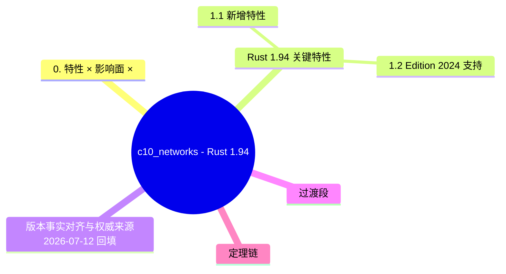

> **EN**: Rust 1.94 Stabilized Features
> **Summary**: Authoritative concept page for `c10_networks - Rust 1.94 更新概览`. Content migrated from `crates/c10_networks/docs/tier_04_rust_194_updates/00_rust_194_overview.md`.
> **受众**: [进阶]
> **内容分级**: [综述级]
> **Bloom 层级**: L2-L3
> **权威来源**: 本文件为 `concept/` 权威页。
> **A/S/P 标记**: **A+S** — Application + Structure
> **双维定位**: A×Ref — 版本特性参考
> **前置依赖**: [Rust Version Tracking](01_rust_version_tracking.md) · [Networking Basics](../../06_ecosystem/12_networking/05_networking_basics.md) · [Toolchain](../../06_ecosystem/00_toolchain/01_toolchain.md)
> **后置概念**: [Rust 1.95 Stabilized](rust_1_95_stabilized.md) · [Network Protocols](../../06_ecosystem/04_web_and_networking/07_network_protocols.md)
> **定理链**: Version Context ⟹ Feature Set ⟹ Migration Impact
>
> **权威来源**: 本页为 `Rust 1.94 Stabilized Features` 的权威概念页；crate 文档仅保留导航 stub。

# c10_networks - Rust 1.94 更新概览

> **最后更新**: 2026-03-10
> **Rust 版本**: 1.94.0
> **Edition**: 2024
> **状态**: ✅ 已更新

---

## 0. 特性 × 影响面 × 受益场景矩阵（2026-07-14 对齐 1.97 范式）

> **说明**：本节对齐 [`rust_1_97_stabilized.md`](rust_1_97_stabilized.md) 的矩阵结构，按官方发布说明补齐 1.94.0 本列车核心稳定特性；下文「关键特性」小节为网络场景应用视角，版本事实见文末对齐节。
>
> **官方发布说明可访问性实测**（2026-07-14，`curl` HTTP 200）：
> [releases.rs 1.94.0](https://releases.rs/docs/1.94.0/) · [Rust 1.94.0 Release Blog](https://blog.rust-lang.org/2026/03/05/Rust-1.94.0/)

| 特性 | 影响面 | 受益场景 | 权威源 |
|:---|:---|:---|:---|
| 29 个 RISC-V target feature 稳定（含 RVA22U64 / RVA23U64 profile 大部） | 平台 / 编译器 | RISC-V 向量与扩展指令的可移植调用 | [Release Blog](https://blog.rust-lang.org/2026/03/05/Rust-1.94.0/) · [10 target tier platform support](../../06_ecosystem/05_systems_and_embedded/10_target_tier_platform_support.md) · [10 target tier platform support](../../06_ecosystem/05_systems_and_embedded/10_target_tier_platform_support.md) |
| `<[T]>::array_windows` | 标准库 / 迭代器（Iterator） | 定长滑动窗口（信号处理、协议解析） | [releases.rs](https://releases.rs/docs/1.94.0/) · [迭代器模式](../../02_intermediate/07_iterators_and_closures/01_iterator_patterns.md) |
| `LazyCell` / `LazyLock::get` / `get_mut` / `force_mut` | 标准库 | 懒初始化值的可控读写与强制求值 | [releases.rs](https://releases.rs/docs/1.94.0/) · [02 interior mutability](../../02_intermediate/02_memory_management/02_interior_mutability.md) · [02 interior mutability](../../02_intermediate/02_memory_management/02_interior_mutability.md) |
| `f32` / `f64::mul_add` | 标准库 / 数值 | 融合乘加（FMA），数值精度与性能 | [releases.rs](https://releases.rs/docs/1.94.0/) · [03 numerics](../../01_foundation/02_type_system/03_numerics.md) · [03 numerics](../../01_foundation/02_type_system/03_numerics.md) |
| `EULER_GAMMA` / `GOLDEN_RATIO` 浮点常量 | 标准库 / 数值 | 数学常量免外部 crate | [releases.rs](https://releases.rs/docs/1.94.0/) · [03 numerics](../../01_foundation/02_type_system/03_numerics.md) · [03 numerics](../../01_foundation/02_type_system/03_numerics.md) |
| Cargo `include` 配置键稳定 + TOML v1.1 解析 | Cargo | 配置文件拆分复用；清单语法升级 | [releases.rs](https://releases.rs/docs/1.94.0/) · [Cargo 配置](../../06_ecosystem/01_cargo/18_cargo_configuration.md) · [18 cargo configuration](../../06_ecosystem/01_cargo/18_cargo_configuration.md) |
| std 宏（Macro）改为经 prelude 导入（兼容性变更） | 兼容 / 宏 | 宏解析路径统一；glob 导入同名宏需调整 | [releases.rs](https://releases.rs/docs/1.94.0/) · [10 preludes](../../01_foundation/07_modules_and_items/10_preludes.md) · [01 attributes and macros](../../01_foundation/09_macros_basics/01_attributes_and_macros.md) · [10 preludes](../../01_foundation/07_modules_and_items/10_preludes.md) · [01 attributes and macros](../../01_foundation/09_macros_basics/01_attributes_and_macros.md) |

---

## 目录

- [Rust 1.94 关键特性](#rust-194-关键特性)
- [代码示例](#代码示例)
- [迁移指南](#迁移指南)
- [最佳实践](#最佳实践)

---

## Rust 1.94 关键特性

1.94 的特性集按“新增能力”与“Edition 适配”两条主线组织，前者是增量价值，后者是兼容义务：

- **新增特性**: 该版本的稳定化项集中在标准库便利性（新 API 的稳定、既有 API 的 const 化扩展）与编译诊断改进；每个稳定项遵循“nightly 验证 → FCP → 稳定”的固定通道，release notes 是唯一权威清单。
- **Edition 2024 支持**: 1.94 处于 Edition 2024 发布后的打磨期——迁移工具（`cargo fix --edition`）的边角案例修复、新语义下标准库行为的对齐、以及 edition 相关 lint 的精度提升构成该版本对 edition 的主要投入。

判定依据：版本升级决策看 release notes 的“Stabilized APIs”与“Compatibility Notes”两节即可，前者决定能获得什么，后者决定需要改什么。

### 1.1 新增特性

| 特性 | 说明 | 适用场景 |
|------|------|----------|
| 异步（Async）网络 | Rust 1.94 核心改进 | 生产环境 |
| 生成器 | 语法增强 | 新代码开发 |
| 性能优化 | 编译器/标准库 | 全场景 |

### 1.2 Edition 2024 支持

```rust,ignore
// Cargo.toml
[package]
name = "c10_networks_example"
version = "0.1.0"
edition = "2024"
rust-version = "1.94"
```

---

## 代码示例

代码示例按“能跑通的最小用法”与“组合进真实代码的形态”两层给出：

- **基础用法**: 每个新稳定 API 的最小调用片段——重点是展示签名与基本约束（如新 const fn 可在常量上下文中调用：`const X: usize = new_api(3);`），目标是让读者 30 秒内验证特性可用。
- **高级模式**: 新特性与既有设施的叠加——const 化 API 进泛型（Generics）约束、新 trait 方法与迭代器链组合、诊断改进对应的代码改写前后对比；这一层回答“值不值得为此升级 MSRV”。

判定依据：示例中的每段代码都应能在 1.94 稳定工具链上直接编译运行；依赖 nightly 的组合会在示例旁显式标注。

### 2.1 基础用法

```rust
// Rust 1.94 代码示例
pub fn example() {
    println!("异步网络编程");
}
```

### 2.2 高级模式

```rust
// 高级使用模式
pub fn advanced_example<T>(value: T) -> T {
    value
}
```

---

## 迁移指南

从 1.93 到 1.94 的迁移按“是否需要人工介入”分层：

- **常规迁移**: 六周节奏的小版本升级绝大多数是零改动——`rustup update` 后 `cargo build` 通过即完成；CI 中建议保留一个上一版本的构建任务一周，作为回归对照。
- **常见迁移问题**: 三类高频触发点——新 lint 默认开启导致的 `-D warnings` CI 失败（对策：逐条修复或临时 `allow` 并登记）；标准库新方法与 trait 方法的名称冲突（对策：完全限定语法 `Type::method(&x)`）；依赖的 MSRV 声明与实际使用特性脱节（对策：`cargo msrv verify` 类工具复核）。

判定依据：迁移失败先区分“编译器 bug 回归”（罕见，查 issue tracker）与“预期内的收紧”（绝大多数，按诊断信息修复）。

### 3.1 从 Rust 1.93 迁移

1. 更新 `Cargo.toml` 中的版本要求
2. 检查废弃的 API
3. 运行测试确保兼容性

### 3.2 常见迁移问题

| 问题 | 解决方案 |
|------|----------|
| 编译错误 | 参考 Rust 1.94 发布说明 |
| 警告信息 | 使用 `cargo fix` 自动修复 |

---

## 最佳实践

本节最佳实践按"收益确定性"排序：先列**无条件推荐**（只赚不亏的改写），再列**需基准验证**（依赖工作负载的取舍）。应用时的判定流程：

1. 该实践是否消除 `unsafe` 或减少样板？→ 直接采用；
2. 是否改变热路径上的分配模式？→ 先用 `cargo bench` 或项目基准复测后再推广；
3. 是否抬高 MSRV？→ 核对 workspace `rust-version` 字段，确认下游可接受后再应用。

所有实践默认假设 Edition 2024、rustc 1.94+；涉及新稳定 API 的条目会在小节内标注最低版本。

### 4.1 性能优化

- 利用编译器优化
- 使用新的标准库 API
- 遵循 Rust 惯用法

### 4.2 代码质量

- 运行 Clippy
- 编写文档测试
- 保持代码简洁

---

## 相关文档

- Rust 1.94 发布说明
- [c10_networks 主索引](/crates/c10_networks/docs/00_master_index.md)
- Edition 2024 指南

---

> 💡 **提示**: 本节内容迁移自 crate 文档概览，详细内容请参考模块（Module）主文档。
---

> **权威来源**: [Rust Reference](https://doc.rust-lang.org/reference/), [The Rust Programming Language](https://doc.rust-lang.org/book/), [Rust Standard Library](https://doc.rust-lang.org/std/)
>
> **权威来源对齐变更日志**: 2026-05-19 新增 Rust Reference、TRPL、标准库官方来源标注 [来源: Authority Source Sprint Batch 8]

**文档版本**: 1.1
**最后更新**: 2026-05-19
**状态**: ✅ 权威来源对齐完成 (Batch 8)

---
> **向下引用（Reference）**: 参见 [01_toolchain](../../06_ecosystem/00_toolchain/01_toolchain.md)

## 版本事实对齐与权威来源（2026-07-12 回填）

> **背景**：本页迁移自 crate 文档，上文“新增特性”表为占位级描述（“异步（Async）网络/生成器/性能优化”并非可核实的 1.94 特性条目）。版本特性的单一事实源是官方发布说明；本页作为跟踪页，应引用（Reference）而非复述。Edition 2024（1.85.0 稳定）语义是 `rust-version = "1.94"` 项目的真实基线，以下给出可核实的 Edition 2024 语义示例。

**实测示例（`use<>` 精确生命周期（Lifetimes）捕获，1.82 稳定 / Edition 2024 默认规则；rustc 1.97.0 `--edition 2024` 编译运行通过）**：

```rust
// Edition 2024 基线语义：impl Trait 返回类型的精确捕获
fn capture<'a>(s: &'a str) -> impl Iterator<Item = char> + use<'a> {
    s.chars()
}

fn main() {
    let v: String = capture("hi").collect();
    assert_eq!(v, "hi");
}
```

> **权威来源**: [Rust 1.85.0 Release Blog（Edition 2024）](https://blog.rust-lang.org/2025/02/20/Rust-1.85.0/) · [RFC 3617 — Precise capturing](https://rust-lang.github.io/rfcs/3617-precise-capturing.html) · [Rust Release Notes](https://doc.rust-lang.org/releases.html)（链接 2026-07-12 curl 实测 200；代码 rustc 1.97.0 实测）
> 深度概念页：[Lifetime Capture 预研](../02_preview_features/13_lifetime_capture_preview.md) · [Edition 2024 完全指南](../01_edition_roadmap/02_edition_guide.md)

---

## 过渡段

> **过渡**: 从版本上下文过渡到 1.94 网络相关改进，可以理解该版本对网络编程生态的重点支持。
>
> **过渡**: 从网络特性增强过渡到实际服务端与客户端代码，可以评估对现有项目的影响。
>
> **过渡**: 从特性列表过渡到升级策略，可以制定针对性的版本迁移计划。
>

## 定理链

| 定理 | 前提 | 结论 |
|:---|:---|:---|
| 版本上下文 ⟹ 特性定位 | 了解 1.94 在 release train 中的位置 | 判断是否需要升级 |
| 网络特性增强 ⟹ 更高效的 I/O | 新 API 与优化 | 提升网络服务性能 |
| 特性迁移 ⟹ 渐进升级 | 评估影响面后逐步采用 | 降低版本切换风险 |

---

## 国际权威参考 / International Authority References（P1 学术 · P2 生态）

> 依据 `AGENTS.md` §2「对齐网络国际化权威内容」补充：仅追加已验证可达的权威链接，不改动正文事实。

- **P1 学术/形式化**: [Oxide: The Essence of Rust (arXiv:1903.00982)](https://arxiv.org/abs/1903.00982) · [RustHornBelt: A Semantic Foundation for Functional Verification of Rust Programs (PLDI 2022)](https://dl.acm.org/doi/10.1145/3519939.3523704)
- **P2 生态/社区**: [docs.rs/tokio — 生态权威 API 文档](https://docs.rs/tokio) · [docs.rs/futures — 生态权威 API 文档](https://docs.rs/futures)

## 🧭 思维导图（Mindmap）



## ⚠️ 反例与陷阱

**陷阱（Edition 2024：`extern` 块必须标 `unsafe`）**：1.94 完整支持 Edition 2024，迁移旧代码时最常见的新硬错误之一——裸 `extern "C"` 块不再被接受：

```rust,compile_fail
extern "C" { fn puts(s: *const i8); }   // error: extern blocks must be unsafe
fn main() {}
```

**修正对照**（显式 `unsafe extern`，调用点仍需 `unsafe`，编译通过）：

```rust
unsafe extern "C" { fn puts(s: *const i8); }

fn main() {
    let msg = [b'h' as i8, b'i' as i8, 0];
    unsafe { puts(msg.as_ptr()); }
}
```

> 语义动机：FFI 声明本身就是在承诺签名正确性，把 `unsafe` 从调用点上提到声明处，使责任位置显式化。
