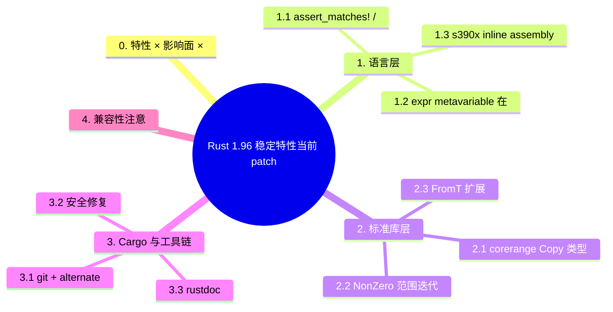

# Rust 1.96 稳定特性（当前 patch 1.96.1）

> **EN**: Rust 1.96 Stabilized Features (current patch 1.96.1)
> **Summary**: Rust 1.96.0 于 2026-05-28 首次稳定，当前最新 patch 为 1.96.1。本文档覆盖 1.96 列车引入的关键语言与库特性：Copy-compatible range 类型、assert_matches! 宏（Macro）、NonZero 范围迭代、AssertUnwindSafe / LazyCell / LazyLock 的 From 实现、s390x vector assembly 以及 Cargo 安全修复。
>
> **受众**: [进阶] / [专家]
> **Bloom 层级**: L2-L3
> **内容分级**: [参考级]
> **权威来源**: 本文件为 `concept/` 权威页。
> **Rust 版本**: **1.96.1 stable**
> **最后更新**: 2026-06-26
> **状态**: ✅ 已对齐 Rust 1.96.1 stable
>
> **权威来源**: · [Rust Reference](https://doc.rust-lang.org/reference/introduction.html) · [TRPL](https://doc.rust-lang.org/book/title-page.html) · [Brown University — Interactive Rust Book](https://rust-book.cs.brown.edu/) · [Jung et al. — RustBelt: Securing the Foundations of Rust](https://plv.mpi-sws.org/rustbelt/popl18/) · [Itanium C++ ABI](https://itanium-cxx-abi.github.io/cxx-abi/abi.html)
>
> - [Announcing Rust 1.96.0](https://releases.rs/docs/1.96.0/)
> - [releases.rs — 1.96.0](https://releases.rs/docs/1.96.0/)
> - [RFC 3550](https://github.com/rust-lang/rfcs/pull/3550)

---

> **前置概念**:
>
> [Rust 版本跟踪](01_rust_version_tracking.md) ·
> [Ranges](../../02_intermediate/07_iterators_and_closures/01_iterator_patterns.md) ·
> [Panic 与 unwind](../../02_intermediate/03_error_handling/01_error_handling.md)
>
> **后置概念**:
>
> [Rust 1.97.0 前沿特性预览](rust_1_97_preview.md) ·
> [Rust 1.98+ 前沿特性预览](rust_1_98_preview.md) ·
> [Toolchain](../../06_ecosystem/00_toolchain/01_toolchain.md) ·
> [Testing](../../06_ecosystem/09_testing_and_quality/03_testing.md)
>

---

## 0. 特性 × 影响面 × 受益场景矩阵（2026-07-14 对齐 1.97 范式）

> **说明**：本节对齐 [`rust_1_97_stabilized.md`](rust_1_97_stabilized.md) 的矩阵结构；各特性详解见下文对应章节。
>
> **官方发布说明可访问性实测**（2026-07-14，`curl` HTTP 200）：
> [releases.rs 1.96.0](https://releases.rs/docs/1.96.0/) · [Rust 1.96.0 Release Blog](https://blog.rust-lang.org/2026/05/28/Rust-1.96.0/)

| 特性 | 影响面 | 受益场景 | 权威源 |
|:---|:---|:---|:---|
| `assert_matches!` / `debug_assert_matches!`（§1.1） | 标准库 / 测试 | 模式匹配（Pattern Matching）断言，替代手写 `assert!(matches!(...))` | [Release Blog](https://blog.rust-lang.org/2026/05/28/Rust-1.96.0/) · [assert_matches](../../02_intermediate/06_macros_and_metaprogramming/01_assert_matches.md) |
| `expr` metavariable 传入 `cfg`（§1.2） | 语言 / 宏（Macro） | 宏展开结果参与条件编译判定 | [releases.rs](https://releases.rs/docs/1.96.0/) · [01 macros](../../03_advanced/03_proc_macros/01_macros.md) · [01 macros](../../03_advanced/03_proc_macros/01_macros.md) |
| `core::range` Copy 类型（§2.1） | 标准库 | `Range`/`RangeFrom`/`RangeToInclusive` 及迭代器 Copy 化 | [releases.rs](https://releases.rs/docs/1.96.0/) · [迭代器模式](../../02_intermediate/07_iterators_and_closures/01_iterator_patterns.md) · [01 iterator patterns](../../02_intermediate/07_iterators_and_closures/01_iterator_patterns.md) |
| `NonZero` 范围迭代（§2.2） | 标准库 | 非零整数范围直接迭代 | [releases.rs](https://releases.rs/docs/1.96.0/) |
| `From<T>` for `AssertUnwindSafe` / `LazyCell` / `LazyLock`（§2.3） | 标准库 | 一键构造包装类型 | [releases.rs](https://releases.rs/docs/1.96.0/) · [02 interior mutability](../../02_intermediate/02_memory_management/02_interior_mutability.md) · [02 interior mutability](../../02_intermediate/02_memory_management/02_interior_mutability.md) |
| 「valid for read/write」定义重构（§2.4） | unsafe / 内存模型 | 指针有效性契约排除 null 的统一定义 | [releases.rs](https://releases.rs/docs/1.96.0/) · [内存模型](../../03_advanced/02_unsafe/06_memory_model.md) |
| Cargo git + alternate registry 共存；CVE-2026-5222/5223 修复（§3.1–3.2） | Cargo / 安全 | 混合源依赖解析；供应链安全修复 | [releases.rs](https://releases.rs/docs/1.96.0/) · [Cargo 依赖解析](../../06_ecosystem/01_cargo/06_cargo_dependency_resolution.md) · [06 cargo dependency resolution](../../06_ecosystem/01_cargo/06_cargo_dependency_resolution.md) |

---

## 1. 语言层

语言层的变更直接影响日常代码写法，三个条目按使用频率从高到低排列：

- **`assert_matches!` / `debug_assert_matches!`**: 用模式而非布尔表达式断言值结构，`assert_matches!(resp, Ok(Status::Success { .. }))` 比手写 `match` + `panic!` 更精确地表达意图，失败信息自动打印实际值。
- **`expr` 元变量在 `cfg` 中的应用**: 宏规则（macro_rules）中 `expr` 片段可与 `#[cfg(...)]` 条件组合，减少为不同平台复制整条规则的需要。
- **s390x 内联汇编（Inline Assembly）向量寄存器**: 平台特定能力补齐，`asm!` 在 IBM Z 上可使用向量寄存器约束，仅影响该架构的底层库。

判定依据：前两项面向所有开发者，可立即采用；第三项仅在 s390x 目标上相关。

### 1.1 `assert_matches!` / `debug_assert_matches!`

稳定版本：**1.96.0**

```rust
use std::assert_matches;
use std::debug_assert_matches;

let result: Result<i32, &str> = Ok(42);
assert_matches!(result, Ok(n) if n > 0);
debug_assert_matches!(result, Ok(n) if n > 0);
```

- 未加入 prelude，需显式导入。
- 失败时打印 `Debug` 表示，优于 `assert!(matches!(..))`。

### 1.2 `expr` metavariable 在 `cfg` 中的使用

过程宏（Procedural Macro）可以将表达式元变量传递给 `cfg` / `cfg_attr`，增强了宏与条件编译的交互能力。

### 1.3 s390x inline assembly vector registers

稳定版本：**1.96.0**

`s390x` 目标支持在 `asm!` 中使用 `v0`..`v31` vector registers。

---

## 2. 标准库层

标准库层的四个变更都指向同一主题：**让常用类型更“好用”而不破坏既有语义**。

- **`core::range` Copy 类型**: 新范围类型实现 `Copy`，在泛型（Generics）算法中传递不再触发移动语义问题。
- **`NonZero` 范围迭代**: `NonZeroU32` 等可直接参与范围迭代，省去手动偏移 + unwrap 的样板。
- **`From<T>` 扩展**: 常用转换覆盖更多整数/引用（Reference）组合，减少显式 `as` 强转（强转会静默截断）。
- **`valid for read/write` 定义重构**: 指针有效性（validity）契约的措辞澄清，影响 unsafe 代码的未定义行为（UB）判定边界——写 unsafe 代码者应重读该节。

判定依据：前三项是便利性提升，升级即受益；第四项是语义澄清，unsafe 代码需对照自查。

### 2.1 `core::range` Copy 类型

稳定版本：**1.96.0**（RFC 3550）

| 新类型 | 说明 |
|---|---|
| `core::range::Range<T>` | 实现 `Copy`，`IntoIterator` |
| `core::range::RangeFrom<T>` | 实现 `Copy`，`IntoIterator` |
| `core::range::RangeToInclusive<T>` | 实现 `Copy`，`IntoIterator` |
| `core::range::RangeIter<T>` | 对应迭代器（Iterator） |
| `core::range::RangeFromIter<T>` | 对应迭代器（Iterator） |
| `core::range::RangeToInclusiveIter<T>` | 对应迭代器（Iterator） |

```rust
use std::range::Range;

#[derive(Clone, Copy)]
struct Span(Range<usize>);

impl Span {
    fn of<'a>(&self, s: &'a str) -> &'a str {
        &s[self.0]
    }
}
```

### 2.2 `NonZero` 范围迭代

稳定版本：**1.96.0**

```rust
use std::num::NonZeroU32;

let start = NonZeroU32::new(1).unwrap();
let end = NonZeroU32::new(4).unwrap();
let values: Vec<u32> = (start..=end).map(|nz| nz.get()).collect();
assert_eq!(values, vec![1, 2, 3, 4]);
```

### 2.3 `From<T>` 扩展

稳定版本：**1.96.0**

- `From<T> for AssertUnwindSafe<T>`
- `From<T> for LazyCell<T, F>`
- `From<T> for LazyLock<T, F>`

```rust
use std::cell::LazyCell;
use std::panic::AssertUnwindSafe;
use std::sync::LazyLock;

let _: AssertUnwindSafe<String> = AssertUnwindSafe::from(String::from("x"));
let _: LazyCell<i32, fn() -> i32> = LazyCell::from(42);
let _: LazyLock<i32, fn() -> i32> = LazyLock::from(2026);
```

### 2.4 `valid for read/write` 定义重构

对内存模型中 "valid for read/write" 的定义进行了精确化：默认排除 null 指针，各方法单独声明例外。这主要影响 unsafe 代码的文档与形式化语义，对普通用户无直接 API 变化。

---

## 3. Cargo 与工具链

Cargo 与工具链层的变更聚焦**依赖来源多样化**与**供应链安全**，对多 registry 的企业环境影响最大：

- **git + alternate registry 共存**: 同一依赖图可同时引用 git 源与备用 registry 源，解析规则明确化，私有 registry 与上游补丁（patch）的混用不再需要变通方案。
- **安全修复**: 修补了依赖解析与凭证处理中的若干问题，升级建议级别为“尽快”。
- **rustdoc**: 文档生成的搜索与链接行为改进，内部 `rustdocflags` 可按 `cfg` 条件配置。

判定依据：使用 `[patch]` + 私有 registry 的团队应优先验证 3.1 的行为变化；其余项目常规升级即可。

### 3.1 git + alternate registry 共存

```toml
my-crate = { version = "1.2", registry = "internal", git = "https://github.com/myorg/my-crate" }
```

### 3.2 安全修复

- **CVE-2026-5223**：拒绝含 symlink 的 tarball。
- **CVE-2026-5222**：限制 `.git` 后缀规范化到 git 协议。

### 3.3 rustdoc

- `target.'cfg(..)'.rustdocflags` 配置支持。
- `missing_doc_code_examples` lint 改进。

---

## 4. 兼容性注意

- WebAssembly 链接器不再默认 `--allow-undefined`。
- `-Csoft-float` 已移除。
- `avr` 目标 `c_double` 调整为 `f32`。
- 最低外部 LLVM 版本为 21。

---

## 5. 练习与验证

- 测验：`exercises/tests/l3_rust_196_alignment.rs`
- 速查：`docs/09_toolchain/08_rust_1_96_features.md`

---

> **权威来源**: [Rust 1.96.0 Release Notes](https://releases.rs/docs/1.96.0/), [releases.rs 1.96.0](https://releases.rs/docs/1.96.0/)

## 6. 工具链与兼容性细节

1.96 的工具链与兼容性变更以“文档与构建的可复现性”为主线：Rustdoc 与 Cargo 的多项改进都指向同一目标——让构建产物（包括文档）在跨机器、跨时间重建时保持确定性。本节六个方面按“谁需要关心”分组。

读者分组指引：

| 小节 | 主要受众 | 行动要求 |
|---|---|---|
| 6.1 Rustdoc 改进 | 库作者、文档站维护者 | 评估新输出格式对文档站托管的影响 |
| 6.2 Cargo 细节 | 发布/供应链团队 | 核对 Git 源与 alternate registry 共存配置 |
| 6.3 编译器改进 | 全体 | 了解诊断与编译速度变化即可 |
| 6.4 平台支持 | 嵌入式/跨平台团队 | 核对 target tier 变化 |
| 6.5 底层与兼容性 | unsafe 代码作者、工具链开发者 | 必须阅读：指针有效性契约与 target spec 变更有迁移要求 |

6.5 是本节唯一可能要求代码变更的部分，建议 unsafe 密集型项目优先评估。

### 6.1 Rustdoc 改进

| 改进 | 说明 | 影响 |
|:---|:---|:---|
| Deprecation notes 渲染方式变更 | 弃用说明现在像普通文档一样渲染，不再使用 `white-space: pre-wrap` 和剥离 `<p>` 标签。多行弃用说明如需换行，请使用标准 Markdown 方法 `" \n"`（两个空格 + 换行） | 文档可视化更可预测 |
| `missing_doc_code_examples` lint | 不再在 impl items 上触发此 lint | 减少误报 |
| Sidebar 分离 | 方法和关联函数在侧边栏中分开显示 | 导航更清晰 |

### 6.2 Cargo 细节

Cargo 在 1.96 周期的两项细节变更都服务于多源供应链场景：企业内同时使用 crates.io 镜像、私有 registry 与 Git 依赖的混合配置越来越普遍，此前的行为边界存在未文档化的坑。

两项变更的实质：

- **Git + Alternate Registry 共存**：明确了同一 crate 名同时来自 Git 源与 alternate registry 时的解析优先级与 lockfile 记录方式，消除了此前因解析顺序不确定导致的“本地能构建、CI 拉不到”类问题；
- **`target.'cfg(..)'.rustdocflags`**：允许按 target 条件传递 rustdoc 参数，解决了交叉编译文档时“某些 cfg 下的文档需要额外 `--cfg` 参数”的配置缺口。

迁移检查清单见各小节末尾：主要是复核 `.cargo/config.toml` 中 source replacement 与 rustdocflags 的既有配置是否与新行为一致。

#### Git + Alternate Registry 共存

```toml
[dependencies]
my-crate = { git = "https://github.com/example/my-crate", registry = "corp" }
```

本地使用 git 版本，发布时使用 registry 版本。

#### `target.'cfg(..)'.rustdocflags`

Cargo 1.96 支持按目标条件配置 `rustdoc` 标志，此前只能通过 `RUSTDOCFLAGS` 环境变量全局设置。

```toml
[target.'cfg(unix)']
rustdocflags = ["--cfg", "docsrs"]
```

与 `RUSTDOCFLAGS` 环境变量合并而非覆盖，但环境变量标志在命令行中更靠后，可能覆盖同名配置。

### 6.3 编译器改进

| 改进 | 说明 |
|:---|:---|
| LoongArch Linux link relaxation | 龙芯架构启用链接松弛优化 |
| `riscv64gc-unknown-fuchsia` RVA22 + vector | RISC-V Fuchsia 目标基线提升至 RVA22 |
| `unused_features` lint | 恢复/新增 lint，警告未使用的 `#![feature(...)]` |

### 6.4 平台支持

| 目标 | 变更 |
|:---|:---|
| `loongarch64-unknown-linux-gnu` | Link relaxation 启用 |
| `riscv64gc-unknown-fuchsia` | 基线提升至 RVA22 + vector |
| `s390x-unknown-linux-gnu` | 向量寄存器内联汇编（Inline Assembly）支持 |

### 6.5 底层与兼容性

本节两项变更位于 Rust 内存模型的最底层，直接影响 unsafe 代码的正确性论证与自定义 target 的维护方式。

**指针 “valid for read/write” 契约重构**：此前文档对“指针何时可合法读/写”的表述分散且存在歧义（如对齐但未初始化的指针是否 valid for read）。1.96 周期的重构把契约收敛为明确条款：validity 要求与 provenance、对齐、初始化状态三者分别挂钩，并给出与 Miri 检查项的对应关系。unsafe 代码作者应据此复核手写论证——特别是依赖“分配即 valid”直觉的代码。

**JSON Target Spec 内部变更**：自定义 target 的 JSON 规格文件调整了若干内部字段的序列化方式，使用 `-Zbuild-std` + 自定义 target 的嵌入式项目需在升级后重新生成或核对 spec 文件。变更清单与迁移脚本见对应小节。

#### 指针 “valid for read/write” 契约重构

Rust 1.96 对标准库中“指针有效可读/可写”的定义进行了重构：

- **基础定义现在不包含 null**：按照新的统一约定，一个指针要“valid for read/write”，首先必须是非空指针；null 指针不再被默认视为有效。
- **null 例外下沉到具体方法**：对于历史上明确允许 null 的特殊场景（例如零大小类型 `T` 的 `<*const T>::read` / `<*mut T>::write`），标准库在相应方法的 Safety 说明中单独注明 null 例外，而不是让基础定义包容 null。

这只是一次文档/契约层面的澄清，绝大多数安全代码的行为没有变化；但写 `unsafe` 代码时应以具体方法的 Safety 说明为准，而不要假设“null 天然可读可写”。

```rust
use std::ptr;

fn read_or_default<T: Copy>(ptr: *const T, fallback: T) -> T {
    if ptr.is_null() {
        fallback
    } else {
        unsafe { ptr.read() }
    }
}
```

#### JSON Target Spec 内部变更

Rust 1.96 对内部 JSON target spec 做了收紧/调整，主要影响使用自定义目标或维护目标定义的开发者：

- `aarch64` 软浮点目标现在必须显式设置 `"rustc_abi": "softfloat"`。
- 对 `llvm-target` 等 ABI 相关值的校验更严格，并与 `cfg(target_abi)` 的取值保持一致。

```bash
rustc +nightly -Z unstable-options --print target-spec-json-schema
```

### 6.6 兼容性注意（完整列表）

| 变更 | 影响范围 |
|:---|:---|
| `#[repr(Int)]` enum layout 修复 | 涉及 uninhabited ZST 字段的边缘情况 |
| 禁止 `Pin<Foo>` unsize-coerce（Foo 不实现 `Deref`） | 此前错误允许的 coercion |
| `#![reexport_test_harness_main]` 被正确 gate | 意外稳定属性的限制 |
| RPITIT 类型过严报错 | 过于私有的返回类型 |
| `uninhabited_static` deny-by-default | 依赖项中的 static uninhabited 类型 |
| 移除 `-Csoft-float` | 改用 `target-feature` |
| `use S::{self as Other}` 禁止 | `{self}` 要求模块（Module）父级 |
| 重复属性首项优先 | `export_name`/`link_name`/`link_section` |
| 最低外部 LLVM 升至 21 | 构建 rustc 的 LLVM 要求 |
| `avr` 目标 `c_double` 为 `f32` | 匹配 AVR 上 C 的 double 宽度 |

---

## 7. 项目覆盖映射

| 1.96 特性 | 概念文档 | Crate 代码示例 | 测试 |
|:---|:---|:---:|:---:|
| `assert_matches!` | `concept/02_intermediate/06_macros_and_metaprogramming/01_assert_matches.md` | `c02_type_system` | ✅ 183 passed |
| `core::range::*` | `concept/02_intermediate/04_types_and_conversions/01_range_types.md` | `c02_type_system` | ✅ |
| `NonZero` 范围迭代 | `concept/02_intermediate/04_types_and_conversions/01_range_types.md` | `c02_type_system` | ✅ |
| `From<T>` for cell types | `concept/02_intermediate/02_memory_management/02_interior_mutability.md` | `c02_type_system` | ✅ |
| `ManuallyDrop` 常量模式 | `concept/02_intermediate/02_memory_management/01_memory_management.md` | `c02_type_system` | ✅ |
| `expr` metavariable to `cfg` | `concept/03_advanced/03_proc_macros/01_macros.md` | `c11_macro_system_proc` | ✅ 97 passed |
| Never 类型 tuple coercion | `concept/02_intermediate/01_generics/01_generics.md` | `c02_type_system` | ✅ |

---

## 8. 与 Rust 1.95 特性对比

| 特性 | 1.95 | 1.96 |
|:---|:---|:---|
| `if let` guards | ✅ 已稳定 | ✅ 已稳定 |
| `assert_matches!` | ❌ 不稳定 | ✅ **稳定** |
| `core::range::Range` / `RangeFrom` / `RangeToInclusive` | ❌ 不稳定 | ✅ **稳定** |
| `From<T>` for `LazyLock` / `LazyCell` | ❌ 不存在 | ✅ **新增** |
| `NonZero` 范围迭代 | ❌ 不支持 | ✅ **新增** |
| `expr` metavariable to `cfg` | ❌ 不支持 | ✅ **新增** |
| `ManuallyDrop` 常量模式 | ❌ 回归 | ✅ **修复** |
| Never 类型 tuple coercion | ❌ 不完整 | ✅ **完善** |

---

> **权威来源**: [Rust 1.96.0 Release Notes](https://releases.rs/docs/1.96.0/), [releases.rs 1.96.0](https://releases.rs/docs/1.96.0/)

---

## 国际权威参考 / International Authority References（P1 学术 · P2 生态）

> 依据 `AGENTS.md` §2「对齐网络国际化权威内容」补充：仅追加已验证可达的权威链接，不改动正文事实。

- **P2 生态/社区**: [docs.rs/futures — 生态权威 API 文档](https://docs.rs/futures) · [docs.rs/hyper — 生态权威 API 文档](https://docs.rs/hyper)

## 🧭 思维导图（Mindmap）



## ⚠️ 反例与陷阱

升级到新稳定版不会让借用（Borrowing）检查失效：借用存活期间赋值一律被拒。

### 反例：借用存活期间重新赋值（rustc 1.97.0，--edition 2024 实测）

```rust,compile_fail,E0506
fn main() {
    let mut s = String::from("a");
    let r = &s;
    s = String::from("b"); // ❌ 借用存活期间重新赋值
    let _ = r;
}
```

**实测错误**：`error[E0506]: cannot assign to`s`because it is borrowed`。

### ✅ 修正：收窄借用作用域后再赋值

```rust
fn main() {
    let mut s = String::from("a");
    {
        let r = &s;
        let _ = r;
    } // 借用在此结束
    s = String::from("b"); // ✅
}
```
