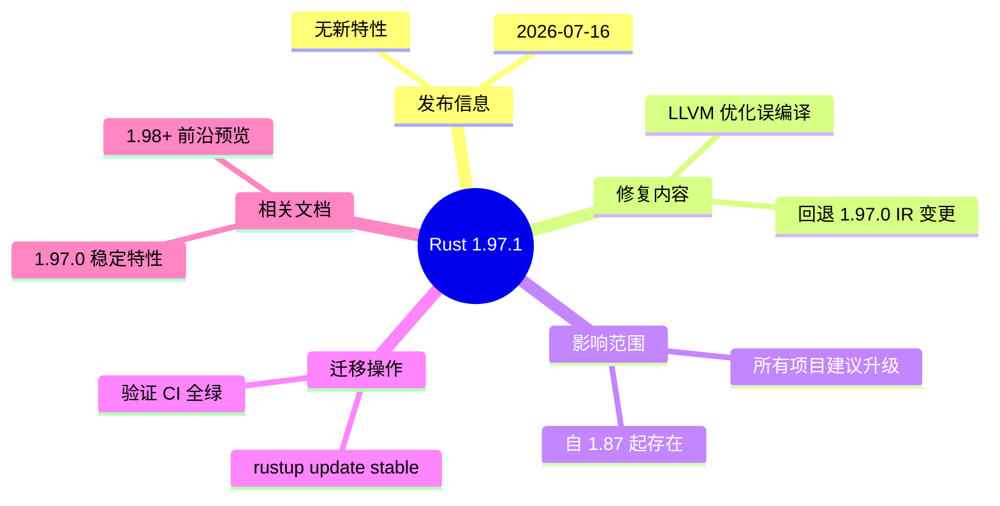

# Rust 1.97.1 稳定补丁

> **EN**: Rust 1.97.1 Stable Patch
> **Summary**:
> Rust 1.97.1 (2026-07-16) fixes a miscompilation in an LLVM optimization that has been present since at least Rust 1.87.
> This patch release contains no new language, library, or Cargo features; it is a correctness and security-relevant compiler fix.
>
> **受众**: [进阶]
> **Bloom 层级**: L2-L3
> **内容分级**: [综述级]
> **权威来源**: 本文件为 `concept/` 权威页（Rust 1.97.1 patch 跟踪页）。
> **Rust 版本**: **1.97.1 stable**（2026-07-16）
> **最后更新**: 2026-07-18
> **状态**: ✅ 已对齐 Rust 1.97.1 stable
>
> **权威来源**:
>
> · [Announcing Rust 1.97.1 — Rust Blog](https://blog.rust-lang.org/2026/07/16/Rust-1.97.1/) ·
> [Rust 1.97.1 Release Notes](https://releases.rs/docs/1.97.1/) ·
> [Rust 1.97.0 Stabilized Features](rust_1_97_stabilized.md) ·
> [Rust Reference](https://doc.rust-lang.org/reference/introduction.html)
>
> **前置概念**: [Rust 版本跟踪](01_rust_version_tracking.md) · [Rust 1.97.0 稳定特性](rust_1_97_stabilized.md)
> **后置概念**: [Rust 1.98+ 前沿特性预览](rust_1_98_preview.md) · [Rust 工具链](../../06_ecosystem/00_toolchain/01_toolchain.md)

---

## 1. 1.97.1 是什么？

Rust 1.97.1 是 **2026-07-16 发布的 patch release**，距离 1.97.0 仅一周。它**不引入任何新语言特性、标准库 API 或 Cargo 功能**， sole purpose 是修复一个 LLVM 优化导致的**误编译（miscompilation）**。

| 维度 | 1.97.1 内容 |
|---|---|
| **发布日期** | 2026-07-16 |
| **修复类型** | 编译器后端（LLVM）优化错误 |
| **影响范围** | 自 Rust 1.87 起即存在的潜在问题；1.97.0 的 IR 变更提高了触发概率 |
| **新增特性** | 无 |
| **是否建议升级** | **是**，所有使用 Rust 1.87+ 的项目都应升级 |

> **关键语义**：这是一个“quiet but critical”的补丁——源代码层面没有任何变化，但编译产物可能不同。对于安全关键、长期运行或分布式部署的系统，升级到 1.97.1 是降低风险的最小成本操作。

---

## 2. 修复的 LLVM 误编译详情

### 2.1 问题本质

Rust 1.97.1 修复了 LLVM 中一个优化 bug。该 bug 在特定条件下会导致编译器生成**语义错误的机器码**，即程序行为与源代码语义不一致。由于 Rust 1.97.0 对生成 IR 做了一处调整，这个问题在 1.97.0 下被更容易触发。

> 来自 [Rust 1.97.1 官方公告](https://blog.rust-lang.org/2026/07/16/Rust-1.97.1/)：
> “We have backported both an LLVM fix and a disable of the underlying change in Rust 1.97.0 of Rust's generated IR that increased the likelihood of this happening. However, note that the underlying miscompilation has been present since at least Rust 1.87.”

### 2.2 为什么这是安全相关？

- 误编译意味着编译后的二进制可能不按照源代码意图执行。
- 在极端情况下，可能引入内存安全、控制流或算术错误，即使源代码本身通过 borrow checker。
- 该问题不局限于 `unsafe` 代码；safe Rust 代码也可能因优化器错误而生成错误指令。

### 2.3 修复内容

Rust 1.97.1 同时做了两件事：

1. **Backport LLVM 修复**：修复 LLVM 优化器本身的 bug。
2. **回退 1.97.0 的 IR 变更**：禁用 1.97.0 中提高触发概率的生成 IR 调整，进一步降低风险。

---

## 3. 影响范围与判定

### 3.1 哪些项目需要升级？

| 项目状态 | 建议 |
|---|---|
| 使用 Rust 1.97.0 | **立即升级** |
| 使用 Rust 1.87–1.96 | **建议升级**（问题自 1.87 起存在，只是触发概率较低） |
| 使用 nightly/beta | 关注对应通道是否已包含该 LLVM backport；通常 nightly 更快获得修复 |
| 已部署到生产 | 在 CI 中用 1.97.1 重新构建并重新发布 |

### 3.2 如何判定自己是否受影响？

由于该误编译是优化器层面的 bug，**没有简单的源代码模式可以自我诊断**。官方建议直接升级，而不是尝试构造触发条件。

判定依据：误编译的触发条件通常涉及特定优化路径、目标平台和代码结构的组合，手工判定既不现实也不可靠。

---

## 4. 迁移与验证

### 4.1 升级命令

```bash
rustup update stable
rustc --version
# rustc 1.97.1 (8bab26f4f 2026-07-14)

cargo --version
# cargo 1.97.1 (c980f4866 2026-06-30)
```

### 4.2 CI 验证清单

升级到 1.97.1 后，建议执行以下最小验证：

- [ ] `cargo check --workspace` 通过
- [ ] `cargo test --workspace` 通过
- [ ] `cargo clippy --workspace -- -D warnings` 通过
- [ ] 关键 release 配置下重新构建并跑集成测试
- [ ] 对二进制进行 smoke test（如可能，包含之前 1.97.0 构建的二进制对比）

### 4.3 是否需要修改 Cargo.toml？

仅当项目显式设置了 `rust-version` 时才需要同步：

```toml
[workspace.package]
rust-version = "1.97.1"
```

如果项目使用 `rust-toolchain.toml` 的 `channel = "stable"`，rustup 会自动解析到 1.97.1，无需手动修改。

---

## 5. 反命题与边界分析

### 5.1 反命题：1.97.1 是否引入了破坏性变更？

**否**。1.97.1 只修复编译器 bug，不修改语言语义、标准库行为或 Cargo 行为。任何因升级到 1.97.1 出现的构建失败，应归因于：

- 项目依赖了 1.97.0 的误编译行为（极不可能，且属于 bug 依赖）；
- 其他未相关的本地或 CI 环境问题。

### 5.2 反命题：是否可以只升级 LLVM 而不升级 rustc？

**不建议**。Rust 的 LLVM 版本与 rustc 版本紧密绑定，官方 backport 只在特定 rustc patch 中提供。自行尝试混用 LLVM 版本会破坏工具链一致性。

### 5.3 边界：1.97.1 修复是否会影响性能？

回退 1.97.0 的 IR 变更理论上可能对极端性能敏感代码有轻微影响，但官方未报告可测量的性能回归。若项目有严格性能基线，升级后应重跑基准测试。

---

## 6. 与 Rust 1.97.0 的关系

`rust_1_97_1.md` 是 `rust_1_97_stabilized.md` 的补丁补充页。1.97.0 的所有特性在 1.97.1 中保持不变；1.97.1 只是在编译器后端层面做了修复。

阅读顺序：

```text
[1.97.0 稳定特性] → [1.97.1 补丁修复] → [1.98+ 前沿预览]
```

---

## 7. 国际权威参考 / International Authority References

- **P0 官方**: [Announcing Rust 1.97.1](https://blog.rust-lang.org/2026/07/16/Rust-1.97.1/)（Rust 发布团队官方公告，2026-07-16）
- **P0 官方**: [Rust 1.97.1 Release Notes](https://releases.rs/docs/1.97.1/)
- **P0 官方**: [Rust 1.97.0 Release Notes](https://blog.rust-lang.org/2026/07/09/Rust-1.97.0/)

---

## 🧭 思维导图（Mindmap）



---

## 相关概念

- [Rust 版本跟踪](01_rust_version_tracking.md)
- [Rust 1.97.0 稳定特性](rust_1_97_stabilized.md)
- [Rust 1.98+ 前沿特性预览](rust_1_98_preview.md)
- [Rust 工具链](../../06_ecosystem/00_toolchain/01_toolchain.md)
- [Cargo 安全公告：CVE-2026-5222 与 CVE-2026-5223](../../06_ecosystem/01_cargo/13_cargo_security_cves.md)
