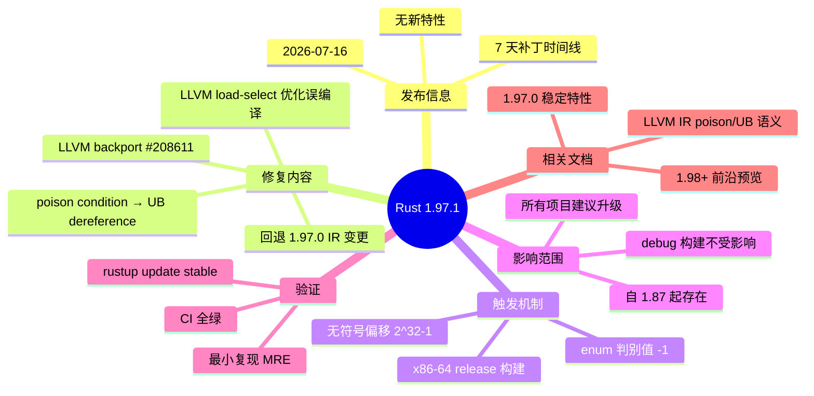

# Rust 1.97.1 稳定补丁

> **EN**: Rust 1.97.1 Stable Patch
> **Summary**: Rust 1.97.1 patch release notes covering the LLVM miscompilation fix, impact scope since Rust 1.87, and upgrade guidance with no new features.
>
> **受众**: [进阶]
> **Bloom 层级**: L2-L3
> **内容分级**: [综述级]
> **权威来源**: 本文件为 `concept/` 权威页（Rust 1.97.1 patch 跟踪页）。
> **Rust 版本**: **1.97.1 stable**（2026-07-16）
> **最后更新**: 2026-07-29
> **状态**: ✅ 已对齐 Rust 1.97.1 stable（含 LLVM IR poison/UB 语义与国际社区论证）
>
> **权威来源**:
>
> · [Announcing Rust 1.97.1 — Rust Blog](https://blog.rust-lang.org/2026/07/16/Rust-1.97.1/) ·
> [Rust 1.97.1 Release Notes](https://releases.rs/docs/1.97.1/) ·
> [Rust 1.97.0 Stabilized Features](rust_1_97_stabilized.md) ·
> [Rust Reference](https://doc.rust-lang.org/reference/introduction.html)
>
> **前置概念**: [Rust 版本跟踪](01_rust_version_tracking.md) · [Rust 1.97.0 稳定特性](rust_1_97_stabilized.md)
> **后置概念**: [Rust 1.98+ 前沿特性预览](rust_1_98_preview.md) · [Rust 工具链](../../06_ecosystem/00_toolchain/01_toolchain.md)

---

## 1. 1.97.1 是什么？

Rust 1.97.1 是 **2026-07-16 发布的 patch release**，距离 1.97.0 仅一周。它**不引入任何新语言特性、标准库 API 或 Cargo 功能**， sole purpose 是修复一个 LLVM 优化导致的**误编译（miscompilation）**。

| 维度 | 1.97.1 内容 |
|---|---|
| **发布日期** | 2026-07-16 |
| **修复类型** | 编译器后端（LLVM）优化错误 |
| **影响范围** | 自 Rust 1.87 起即存在的潜在问题；1.97.0 的 IR 变更提高了触发概率 |
| **新增特性** | 无 |
| **是否建议升级** | **是**，所有使用 Rust 1.87+ 的项目都应升级 |

> **关键语义**：这是一个“quiet but critical”的补丁——源代码层面没有任何变化，但编译产物可能不同。对于安全关键、长期运行或分布式部署的系统，升级到 1.97.1 是降低风险的最小成本操作。

---

## 2. 修复的 LLVM 误编译详情

本节深入说明 1.97.1 所修复的 LLVM 优化 bug 的本质、为何它会威胁 safe Rust 代码的安全假设，以及本次补丁采取的双重修复策略；理解这些细节有助于评估升级紧迫性与验证重点。

### 2.1 问题本质

Rust 1.97.1 修复了 LLVM 中一个 **load-select 合并优化** 的 bug。该优化尝试将条件加载序列

```text
select cond, (load ptr_1), (load ptr_2)
```

重写为单次加载：

```text
load (select cond, ptr_1, ptr_2)
```

在 `cond` 为具体的 `true`/`false` 时，两种形式等价；但当 `cond` 为 LLVM IR 中的 **poison** 值时，语义发生根本变化：

- **原始形式**：poison condition 产生 **poison result**，这是 LLVM IR 中定义良好的行为。
- **变换形式**：poison condition 被用于选择指针并立即解引用，产生 **undefined behavior**。

这正是 1.97.1 修复的核心：LLVM 在特定路径下执行了上述重写，而重写后的 IR 在 poison condition 下会触发 UB，最终生成错误的机器码。该问题自 Rust 1.87 起即存在于 LLVM 中，但 Rust 1.97.0 对生成 IR 的调整显著提高了触发概率。

> 来自 [Rust 1.97.1 官方公告](https://blog.rust-lang.org/2026/07/16/Rust-1.97.1/)：
> “We have backported both an LLVM fix and a disable of the underlying change in Rust 1.97.0 of Rust's generated IR that increased the likelihood of this happening. However, note that the underlying miscompilation has been present since at least Rust 1.87.”
>
> 更精确的技术分析见 [byteiota — Rust 1.97.1: LLVM Miscompilation Fix](https://byteiota.com/rust-1-97-1-llvm-miscompilation-fix/)。

### 2.2 为什么 -1 判别值会触发必然崩溃？

Rust 1.97.0 调整了 enum 判别值（discriminant）的默认表示：对于 `Option<T>` 这类枚举，原先的 `None` 通常被编码为某个小的正整数，而 1.97.0 将其改为 **-1**。这一变更本身是合法的优化，却与上述 LLVM bug 发生了致命交互。

当 LLVM bug 触发时，-1 作为带符号整数被解释为无符号偏移 `2^32 - 1`（约 4 GB）。于是编译后的代码会尝试读取目标分配区数 GB 之外的内存，几乎必然命中未映射页，从而以 **segmentation fault** 崩溃。在 1.97.0 之前，`None` 是小正整数，越界距离较短，通常仍落在已映射内存内，因此 bug 潜伏了约十个版本而没有明显症状。

> **关键限定**：该崩溃在 **x86-64 的 release（优化）构建** 上可稳定复现；**debug 构建** 因未启用相关优化而不受影响。

### 2.3 为什么这是安全相关？

- 误编译意味着编译后的二进制可能不按照源代码意图执行。
- 在极端情况下，可能引入内存安全、控制流或算术错误，即使源代码本身通过 borrow checker。
- 该问题不局限于 `unsafe` 代码；safe Rust 代码也可能因优化器错误而生成错误指令。
- 更重要的是，触发路径不依赖 `unsafe`：上述 LLVM 优化错误地转换了 safe Rust 代码生成的 IR，导致 safe 代码在运行时出现越界读取或 segfault。

### 2.4 修复内容

Rust 1.97.1 同时做了两件事：

1. **Backport LLVM 修复**：修复 LLVM 优化器本身的 bug（上游 LLVM #208611）。
2. **回退 1.97.0 的 IR 变更**：禁用 1.97.0 中提高触发概率的生成 IR 调整（enum 判别值 -1 表示），进一步降低风险。

### 2.5 最小复现（Minimal Reproducer）

以下代码在 Rust 1.97.0 + x86-64 + `-O` 下会触发 segfault，在 1.97.1 上正常运行：

```rust,edition2024
enum Inner { A(u32), B(u32) }
struct Big { _pad: u64, inner: Inner }
struct Small { a: u16, b: u16, _f: fn() }
enum Checksum { X(Big), Y(Small) }

fn main() {
    let val: Option<Checksum> = None;
    println!("{:?}", val.map(|_| 42));
}
```

```bash
rustc +1.97.0 -O minimal.rs -o minimal_1970 && ./minimal_1970
# [1] ... segmentation fault (core dumped)

rustc +1.97.1 -O minimal.rs -o minimal_1971 && ./minimal_1971
# Some(42)
```

> 该复现来自 [rust-lang/rust#159035](https://github.com/rust-lang/rust/issues/159035)，用于验证本地工具链是否受影响。生产代码中任何包含嵌套 enum + `Option` 并在 x86-64 release 构建下运行的场景，都应假设存在触发风险。

---

## 3. 影响范围与判定

由于该误编译存在于优化器层面且触发条件隐蔽，官方建议所有使用 Rust 1.87+ 的项目升级；本节给出分场景升级建议，并说明为什么手工判定是否受影响既不现实也不可靠。

### 3.1 哪些项目需要升级？

| 项目状态 | 建议 |
|---|---|
| 使用 Rust 1.97.0 | **立即升级** |
| 使用 Rust 1.87–1.96 | **建议升级**（问题自 1.87 起存在，只是触发概率较低） |
| 使用 nightly/beta | 关注对应通道是否已包含该 LLVM backport；通常 nightly 更快获得修复 |
| 已部署到生产 | 在 CI 中用 1.97.1 重新构建并重新发布 |

> **触发条件限定**：该 miscompilation 仅在 **release / 优化构建** 下出现，**debug 构建** 因未启用相关优化而不受影响；在 **x86-64** 平台上表现为 segfault，其他架构的行为可能不同。由于手工判定触发条件不可靠，官方仍建议所有 Rust 1.87+ 项目升级。

### 3.2 如何判定自己是否受影响？

由于该误编译是优化器层面的 bug，**没有简单的源代码模式可以自我诊断**。官方建议直接升级，而不是尝试构造触发条件。

判定依据：误编译的触发条件通常涉及特定优化路径、目标平台和代码结构的组合，手工判定既不现实也不可靠。

---

## 4. 迁移与验证

升级到 1.97.1 的操作本身很小，但生产环境建议配合最小验证清单执行；本节给出 rustup 升级命令、CI 验证项以及 `rust-version` 同步注意事项，确保二进制在关键配置下重新构建并通过冒烟测试。

### 4.1 升级命令

```bash
rustup update stable
rustc --version
# rustc 1.97.1 (8bab26f4f 2026-07-14)

cargo --version
# cargo 1.97.1 (c980f4866 2026-06-30)
```

### 4.2 CI 验证清单

升级到 1.97.1 后，建议执行以下最小验证：

- [ ] `cargo check --workspace` 通过
- [ ] `cargo test --workspace` 通过
- [ ] `cargo clippy --workspace -- -D warnings` 通过
- [ ] 关键 release 配置下重新构建并跑集成测试
- [ ] 对二进制进行 smoke test（如可能，包含之前 1.97.0 构建的二进制对比）

### 4.3 是否需要修改 Cargo.toml？

仅当项目显式设置了 `rust-version` 时才需要同步：

```toml
[workspace.package]
rust-version = "1.97.1"
```

如果项目使用 `rust-toolchain.toml` 的 `channel = "stable"`，rustup 会自动解析到 1.97.1，无需手动修改。

---

## 5. 反命题与边界分析

本节针对 1.97.1 补丁的常见误解进行边界澄清：它不包含破坏性变更、不能仅升级 LLVM 而保留 rustc、也不保证修复所有潜在问题；同时说明为什么「源代码未变」反而要求对编译产物重新验证。

### 5.1 反命题：1.97.1 是否引入了破坏性变更？

**否**。1.97.1 只修复编译器 bug，不修改语言语义、标准库行为或 Cargo 行为。任何因升级到 1.97.1 出现的构建失败，应归因于：

- 项目依赖了 1.97.0 的误编译行为（极不可能，且属于 bug 依赖）；
- 其他未相关的本地或 CI 环境问题。

### 5.2 反命题：是否可以只升级 LLVM 而不升级 rustc？

**不建议**。Rust 的 LLVM 版本与 rustc 版本紧密绑定，官方 backport 只在特定 rustc patch 中提供。自行尝试混用 LLVM 版本会破坏工具链一致性。

### 5.3 边界：1.97.1 修复是否会影响性能？

回退 1.97.0 的 IR 变更理论上可能对极端性能敏感代码有轻微影响，但官方未报告可测量的性能回归。若项目有严格性能基线，升级后应重跑基准测试。

### 5.4 边界：误编译是否一定表现为 segfault？

**不一定**。segfault 只是该 LLVM bug 在 x86-64 release 构建下最显眼的表现形式。更一般地，误编译可能表现为：

- 错误的数据值或控制流；
- 在非 x86-64 平台上以静默错误结果运行；
- 仅在特定优化级别、目标平台或代码布局下触发。

因此，不能因为没有观察到崩溃就认为项目未受影响。官方建议直接升级，而非依赖症状判断。

### 5.5 边界：该事件对 safe Rust 语义保证的启示

Rust 的内存安全保证建立在“源代码 → MIR → LLVM IR → 机器码”这一转换链的正确性之上。1.97.1 事件表明，当后端优化器违反 IR 语义时，safe Rust 代码也可能在运行时表现出未定义行为。这并不削弱 Rust 所有权模型的价值，但提醒安全关键系统：

- 必须将编译器正确性纳入供应链风险；
- patch release 的响应应视为安全事件而不仅是版本管理；
- 理解 LLVM IR 层面的 poison/UB 有助于定位类似问题。

> 深入语义见 [LLVM IR 中的 Poison、Undefined Behavior 与 Freeze](../../04_formal/03_operational_semantics/08_llvm_ir_poison_ub.md)。

---

## 6. 与 Rust 1.97.0 的关系

`rust_1_97_1.md` 是 `rust_1_97_stabilized.md` 的补丁补充页。1.97.0 的所有语言特性、标准库 API 与 Cargo 功能在 1.97.1 中保持不变；1.97.1 只是在编译器后端层面修复了一个优化 bug。

理解 1.97.1 需要同时把握两条线：

1. **特性线**：1.97.0 的 v0 symbol mangling、Cargo `build.warnings`、linker output 等特性继续生效。
2. **正确性线**：1.97.0 引入的 enum 判别值 -1 表示提高了 LLVM load-select bug 的触发概率，1.97.1 通过 LLVM backport + IR 回退同时修复。

阅读顺序：

```text
[1.97.0 稳定特性] → [1.97.1 补丁修复] → [LLVM IR poison/UB 语义](../../04_formal/03_operational_semantics/08_llvm_ir_poison_ub.md) → [1.98+ 前沿预览]
```

---

## 7. 国际权威参考 / International Authority References

- **P0 官方**: [Announcing Rust 1.97.1](https://blog.rust-lang.org/2026/07/16/Rust-1.97.1/)（Rust 发布团队官方公告，2026-07-16）
- **P0 官方**: [Rust 1.97.1 Release Notes](https://releases.rs/docs/1.97.1/)
- **P0 官方**: [Rust 1.97.0 Release Notes](https://blog.rust-lang.org/2026/07/09/Rust-1.97.0/)
- **P0 官方 issue**: [rust-lang/rust#159035 — segfault on Rust 1.97.0](https://github.com/rust-lang/rust/issues/159035)（含最小复现与 `rustc --version --verbose`）
- **P0 官方 PR**: [rust-lang/rust#159106 — backport LLVM fix and revert IR change](https://github.com/rust-lang/rust/pull/159106)
- **P1 技术分析**: [byteiota — Rust 1.97.1: LLVM Miscompilation Fix](https://byteiota.com/rust-1-97-1-llvm-miscompilation-fix/)（load-select 变换、poison/UB、-1 判别值机制）
- **P1 社区讨论**: [LWN.net — Version 1.97.0 of Rust released](https://lwn.net/Articles/1082032/)（“Miscompilation of (-1, 0, 1)” 讨论串，涉及 poison / freeze / UB）
- **P2 媒体报道**: [Linux Compatible — Rust 1.97.1 Release](https://www.linuxcompatible.org/story/rust-1971-release-critical-llvm-miscompilation-fix-lands-one-week-after-1970/)

---

## 🧭 思维导图（Mindmap）


```mermaid
mindmap
  root((Rust 1.97.1))
    发布信息
      2026-07-16
      无新特性
      7 天补丁时间线
    修复内容
      LLVM load-select 优化误编译
      poison condition → UB dereference
      LLVM backport #208611
      回退 1.97.0 IR 变更
    触发机制
      enum 判别值 -1
      无符号偏移 2^32-1
      x86-64 release 构建
    影响范围
      自 1.87 起存在
      debug 构建不受影响
      所有项目建议升级
    验证
      最小复现 MRE
      rustup update stable
      CI 全绿
    相关文档
      1.97.0 稳定特性
      LLVM IR poison/UB 语义
      1.98+ 前沿预览
```

---

## 相关概念

- [Rust 版本跟踪](01_rust_version_tracking.md)
- [Rust 1.97.0 稳定特性](rust_1_97_stabilized.md)
- [Rust 1.98+ 前沿特性预览](rust_1_98_preview.md)
- [Rust 工具链](../../06_ecosystem/00_toolchain/01_toolchain.md)
- [LLVM 后端与代码生成](../../06_ecosystem/00_toolchain/09_llvm_backend_and_codegen.md)
- [内存模型](../../03_advanced/02_unsafe/06_memory_model.md)
- [LLVM IR 中的 Poison、Undefined Behavior 与 Freeze](../../04_formal/03_operational_semantics/08_llvm_ir_poison_ub.md)
- [Cargo 安全公告：CVE-2026-5222 与 CVE-2026-5223](../../06_ecosystem/01_cargo/13_cargo_security_cves.md)
