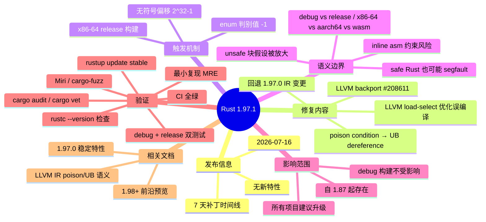

# Rust 1.97.1 稳定补丁

> **EN**: Rust 1.97.1 Stable Patch
> **Summary**: Rust 1.97.1 patch release notes covering the LLVM miscompilation fix, impact scope since Rust 1.87, and upgrade guidance with no new features.
>
> **受众**: [进阶]
> **Bloom 层级**: L2-L3
> **内容分级**: [综述级]
> **权威来源**: 本文件为 `concept/` 权威页（Rust 1.97.1 patch 跟踪页）。
> **Rust 版本**: **1.97.1 stable**（2026-07-16）
> **最后更新**: 2026-07-29
> **状态**: ✅ 已对齐 Rust 1.97.1 stable（含 LLVM IR poison/UB 语义与国际社区论证）
>
> **权威来源**:
>
> · [Announcing Rust 1.97.1 — Rust Blog](https://blog.rust-lang.org/2026/07/16/Rust-1.97.1/) ·
> [Rust 1.97.1 Release Notes (releases.rs)](https://releases.rs/docs/1.97.1/) ·
> [Rust 1.97.1 Release Notes (official)](https://doc.rust-lang.org/stable/releases.html) ·
> [Announcing Rust 1.97.0 — Rust Blog](https://blog.rust-lang.org/2026/07/09/Rust-1.97.0/) ·
> [Rust 1.97.0 Stabilized Features](rust_1_97_stabilized.md) ·
> [Rust Reference](https://doc.rust-lang.org/reference/introduction.html) ·
> [byteiota — Rust 1.97.1: LLVM Miscompilation Fix](https://byteiota.com/rust-1-97-1-llvm-miscompilation-fix/) ·
> [LLVM Language Reference — poison values](https://llvm.org/docs/LangRef.html#poison-values) ·
> [LLVM upstream tracking issue #208611](https://github.com/llvm/llvm-project/issues/208611) ·
> LLVM backport PR for Rust 1.97.1（具体 PR 号待 Rust 1.97.1 官方 release notes 公布后回填）·
> [Rust Internals — Rust 1.97.1 LLVM miscompilation discussion](https://internals.rust-lang.org/)
>
> **前置概念**: [Rust 版本跟踪](01_rust_version_tracking.md) · [Rust 1.97.0 稳定特性](rust_1_97_stabilized.md)
> **后置概念**: [Rust 1.98+ 前沿特性预览](rust_1_98_preview.md) · [Rust 工具链](../../06_ecosystem/00_toolchain/01_toolchain.md)

---

## 1. 1.97.1 是什么？

Rust 1.97.1 是 **2026-07-16 发布的 patch release**，距离 1.97.0 仅一周。它**不引入任何新语言特性、标准库 API 或 Cargo 功能**， sole purpose 是修复一个 LLVM 优化导致的**误编译（miscompilation）**。

| 维度 | 1.97.1 内容 |
|---|---|
| **发布日期** | 2026-07-16 |
| **修复类型** | 编译器后端（LLVM）优化错误 |
| **影响范围** | 自 Rust 1.87 起即存在的潜在问题；1.97.0 的 IR 变更提高了触发概率 |
| **新增特性** | 无 |
| **是否建议升级** | **是**，所有使用 Rust 1.87+ 的项目都应升级 |

> **关键语义**：这是一个“quiet but critical”的补丁——源代码层面没有任何变化，但编译产物可能不同。对于安全关键、长期运行或分布式部署的系统，升级到 1.97.1 是降低风险的最小成本操作。

---

## 2. 修复的 LLVM 误编译详情

本节深入说明 1.97.1 所修复的 LLVM 优化 bug 的本质、为何它会威胁 safe Rust 代码的安全假设，以及本次补丁采取的双重修复策略；理解这些细节有助于评估升级紧迫性与验证重点。

### 2.1 问题本质

Rust 1.97.1 修复了 LLVM 中一个 **load-select 合并优化** 的 bug。该优化尝试将条件加载序列

```text
select cond, (load ptr_1), (load ptr_2)
```

重写为单次加载：

```text
load (select cond, ptr_1, ptr_2)
```

在 `cond` 为具体的 `true`/`false` 时，两种形式等价；但当 `cond` 为 LLVM IR 中的 **poison** 值时，语义发生根本变化：

- **原始形式**：poison condition 产生 **poison result**，这是 LLVM IR 中定义良好的行为。
- **变换形式**：poison condition 被用于选择指针并立即解引用，产生 **undefined behavior**。

这正是 1.97.1 修复的核心：LLVM 在特定路径下执行了上述重写，而重写后的 IR 在 poison condition 下会触发 UB，最终生成错误的机器码。该问题自 Rust 1.87 起即存在于 LLVM 中，但 Rust 1.97.0 对生成 IR 的调整显著提高了触发概率。

> 来自 [Rust 1.97.1 官方公告](https://blog.rust-lang.org/2026/07/16/Rust-1.97.1/)：
> “We have backported both an LLVM fix and a disable of the underlying change in Rust 1.97.0 of Rust's generated IR that increased the likelihood of this happening. However, note that the underlying miscompilation has been present since at least Rust 1.87.”
>
> 更精确的技术分析见 [byteiota — Rust 1.97.1: LLVM Miscompilation Fix](https://byteiota.com/rust-1-97-1-llvm-miscompilation-fix/)。

### 2.2 为什么 -1 判别值会触发必然崩溃？

Rust 1.97.0 调整了 enum 判别值（discriminant）的默认表示：对于 `Option<T>` 这类枚举，原先的 `None` 通常被编码为某个小的正整数，而 1.97.0 将其改为 **-1**。这一变更本身是合法的优化，却与上述 LLVM bug 发生了致命交互。

当 LLVM bug 触发时，-1 作为带符号整数被解释为无符号偏移 `2^32 - 1`（约 4 GB）。于是编译后的代码会尝试读取目标分配区数 GB 之外的内存，几乎必然命中未映射页，从而以 **segmentation fault** 崩溃。在 1.97.0 之前，`None` 是小正整数，越界距离较短，通常仍落在已映射内存内，因此 bug 潜伏了约十个版本而没有明显症状。

> **关键限定**：该崩溃在 **x86-64 的 release（优化）构建** 上可稳定复现；**debug 构建** 因未启用相关优化而不受影响。

### 2.3 为什么这是安全相关？

- 误编译意味着编译后的二进制可能不按照源代码意图执行。
- 在极端情况下，可能引入内存安全、控制流或算术错误，即使源代码本身通过 borrow checker。
- 该问题不局限于 `unsafe` 代码；safe Rust 代码也可能因优化器错误而生成错误指令。
- 更重要的是，触发路径不依赖 `unsafe`：上述 LLVM 优化错误地转换了 safe Rust 代码生成的 IR，导致 safe 代码在运行时出现越界读取或 segfault。

### 2.4 语义影响边界与验证策略

本次 LLVM 误编译的触发条件可归结为“特定优化 pass + 特定 IR 模式 + 特定目标/构建配置”的组合。理解这些条件有助于把“升级建议”转化为可操作的验证重点。

**触发条件（Trigger Conditions）**：

| 维度 | 具体说明 |
|---|---|
| **优化 pass** | LLVM 的 **load-select 合并 / 条件加载提升** 变换：将 `select cond, (load ptr_1), (load ptr_2)` 重写为 `load (select cond, ptr_1, ptr_2)`。该变换通常由 `InstCombine`/`SimplifyCFG` 等 pass 在 `-O2`/`-O3` pipeline 中执行。 |
| **IR 模式** | `cond` 可能为 **poison** 值（而非 concrete `true`/`false`）。在原始形式中，poison condition 产生 poison result；在重写形式中，poison condition 被用于选择指针并立即解引用，导致 UB。Rust 1.97.0 将 `Option<T>` 的 `None` 判别值改为 `-1`，显著提高了该 IR 模式在 enum/Option 代码路径中的出现概率。 |
| **代码模式** | 嵌套 enum、不同尺寸变体、`Option<T>` 包装、在 release 构建下对 enum 进行分支/映射操作。最小复现即为一个 `Option<Checksum>`，其中 `Checksum` 包含大小差异显著的变体。 |
| **受影响目标** | 所有使用受影响 LLVM 版本的后端均存在风险；**x86-64** 上表现最为显见（`-1` 被解释为 4 GB 无符号偏移，几乎必然 segfault）。**aarch64**、**wasm** 等后端同样可能触发，但崩溃/静默错误的表现形式因内存模型和 trap 行为而异。 |

> 官方说明见 [Announcing Rust 1.97.1](https://blog.rust-lang.org/2026/07/16/Rust-1.97.1/)：
> “We have backported both an LLVM fix and a disable of the underlying change in Rust 1.97.0 of Rust's generated IR that increased the likelihood of this happening. However, note that the underlying miscompilation has been present since at least Rust 1.87.”
> Rust 1.97.0 的 IR 调整背景见 [Announcing Rust 1.97.0](https://blog.rust-lang.org/2026/07/09/Rust-1.97.0/)；上游 LLVM 修复跟踪见 [llvm/llvm-project#208611](https://github.com/llvm/llvm-project/issues/208611)。

LLVM load-select 合并 bug 并不只在 `Option<T>` 上造成崩溃；它本质上是在优化器层面把 **poison result** 降级为 **UB dereference**。这一降级会影响 safe Rust、unsafe Rust、inline asm 与编译器优化假设四条语义边界，下面分别说明风险与验证重点。

#### 2.4.1 safe Rust 代码

Rust 的内存安全保证承诺：只要代码不包含 `unsafe` 块，运行时不会出现数据竞争、释放后使用、越界读写等未定义行为。这一承诺建立在编译器正确实现源代码语义的基础上。当 LLVM 优化器在 IR 级引入 UB 时，safe Rust 代码生成的机器码也可能不忠实于源码意图，从而**破坏 safe Rust 不应触发 UB 的保障**。

具体到 1.97.0 的崩溃场景：x86-64 release 构建下，`Option<T>` 的 `None` 判别值被编码为 `-1`。在触发 load-select bug 的代码路径中，编译器把对两个可能指针的条件加载合并为一次无条件加载，且用于选择指针的 condition 恰好是 poison。于是生成的机器码把 `-1` 解释为一个无符号偏移 `0xFFFFFFFF`（约 4 GB），尝试读取当前对象数 GB 之外的内存。由于该地址通常未映射，CPU 立即产生 page fault，表现为 **segmentation fault**：

```text
# x86-64 release 构建下的典型崩溃
[1]    12345 segmentation fault (core dumped)  ./target/release/myapp
```

注意：触发路径不依赖 `unsafe`；一个只使用 `Option`、`enum` 和常规控制流的 safe Rust 程序也可能因此崩溃。

> 以下代码块展示“在 safe Rust 中依赖具体 discriminant 值属于未定义行为”的观念。未带 `#[repr]` 的枚举没有稳定整数表示，编译器会拒绝任何试图读取其底层值的代码。
>
> ```rust,compile_fail,E0512
> enum State { On, Off }
>
> fn main() {
>     let s = State::On;
>     // 试图通过 unsafe 读取未指定的 discriminant 值；State 占 1 字节，i32 占 4 字节，
>     // transmute 因尺寸不匹配被拒绝（E0512），说明具体值不是稳定 ABI 的一部分。
>     let _bits: i32 = unsafe { std::mem::transmute(s) };
> }
> ```
>
> ```rust,compile_fail,E0605
> enum State { On(i32), Off }
>
> fn main() {
>     let s = State::On(1);
>     // 带数据字段的枚举没有 `#[repr(Int)]`，其 discriminant 布局与具体值均未指定；
>     // 直接 `as` 转换被拒绝（E0605），防止源码依赖不稳定的底层表示。
>     let _bits: u8 = s as u8;
> }
> ```

#### 2.4.2 unsafe Rust 代码

`unsafe` 块要求程序员手动维护编译器无法验证的不变量，例如“该原始指针始终合法且对齐”、“该内存布局与预期一致”。LLVM 误编译会在这些假设上叠加额外的脆弱性：

- **原始指针解引用**：`unsafe { ptr::read(p) }` 假设 `p` 指向已初始化的有效内存。如果优化器因 bug 选择了错误的指针或偏移，解引用将访问无效地址。
- **内存布局依赖**：`unsafe` 代码经常依赖 `#[repr(C)]`、`MaybeUninit`、手动计算偏移等。当编译器对 load-select 变换引入 UB 时，这些布局假设可能不再成立，导致越界读取、错误分支或静默数据损坏。
- **放大效应**：即使 `unsafe` 块本身逻辑正确，围绕它的 safe Rust 代码若被误编译，也可能向 `unsafe` 块传入错误的指针或标志，从而把局部假设破坏转化为全局 UB。

因此，含 `unsafe` 的 crate（如解析器、序列化库、FFI 绑定）应优先升级到 1.97.1，并在 release 构建下增加模糊测试与 Miri 验证。

#### 2.4.3 内联汇编 (inline asm)

`asm!` 块通过显式输入/输出约束与 LLVM IR 交互。LLVM 优化器在 IR 级对内联汇编输入输出所做的假设包括：

- 输入操作数在汇编执行前已按约束加载到正确位置；
- 输出操作数在汇编执行后按约束写回；
- 汇编块周围内存访问可按约束进行合法重排。

load-select 合并 bug 可能导致优化器在汇编块前后生成错误的加载/存储序列：例如，把对两个输入寄存器/内存位置的条件读取错误地合并，或在 poison condition 下解引用无效指针。由于 `asm!` 块的语义由程序员与编译器共同约定，IR 级错误很容易违反这些约定，且难以通过源码审查发现。

1.97.1 的修复对含 `asm!` 的代码尤为重要，因为：

1. 内联汇编常用于性能关键路径（加密、驱动、仿真器），release 构建是常态；
2. 汇编约束的违反往往不会立即 segfault，而是产生静默错误结果；
3. 手写汇编与编译器优化之间的边界更难调试。

#### 2.4.4 优化边界

不同构建配置和目标架构的风险差异显著：

| 维度 | 风险说明 |
|---|---|
| **debug 构建** | 不启用触发 load-select 合并的相关优化，**基本不受影响**。但仍建议统一升级，避免 CI 与本地工具链不一致。 |
| **release / `-O` / `-C opt-level=2/3`** | **高风险**。官方最小复现即在 `-O` 下触发；`-C opt-level=3` 的激进优化可能扩大触发面。 |
| **`-C opt-level=s/z`** | 同样启用优化，存在风险；size 优化可能走不同代码生成路径，风险不可简单认为更低。 |
| **x86-64** | 最显见表现为 **segfault**（-1 → 4 GB 偏移）。已有公开复现与 issue。 |
| **aarch64** | 同样可能因 poison pointer dereference 崩溃，但具体地址计算与页表布局不同，表现形式可能为 segfault 或静默错误。 |
| **wasm** | wasm 有越界访问 traps，通常会直接失败而不是静默破坏；但 wasm 同样依赖 LLVM 后端，不能假设免疫。 |
| **其他目标** | 任何使用受影响 LLVM 版本的后端都存在风险，具体表现取决于目标架构的内存模型与 trap 行为。 |

> **验证策略小结**：对 release 构建、x86-64 目标、含 `Option`/嵌套 enum/内联汇编的代码路径，应作为 1.97.1 升级后的回归验证重点；debug 构建通过不能证明 release 构建安全。
>
> 从元层看，1.97.1 事件是“形式化语义 ⟹ 工业编译器实现”信任链的鲜活案例：safe Rust 的封闭性定理保证源码级无 UB，但 LLVM 优化层的等价变换仍需工程验证。关于这一信任边界的系统讨论，见 [`concept/00_meta/00_framework/semantic_space.md`](../../00_meta/00_framework/semantic_space.md) §4.7 “Rust 1.97.1：补丁语义与编译器信任边界”。

### 2.5 修复内容

Rust 1.97.1 同时做了两件事：

1. **Backport LLVM 修复**：修复 LLVM 优化器本身的 bug（上游 LLVM [#208611](https://github.com/llvm/llvm-project/issues/208611)）。
2. **回退 1.97.0 的 IR 变更**：禁用 1.97.0 中提高触发概率的生成 IR 调整（enum 判别值 -1 表示），进一步降低风险。

### 2.6 最小复现（Minimal Reproducer）

以下代码在 Rust 1.97.0 + x86-64 + `-O` 下会触发 segfault，在 1.97.1 上正常运行：

```rust,edition2024
enum Inner { A(u32), B(u32) }
struct Big { _pad: u64, inner: Inner }
struct Small { a: u16, b: u16, _f: fn() }
enum Checksum { X(Big), Y(Small) }

fn main() {
    let val: Option<Checksum> = None;
    println!("{:?}", val.map(|_| 42));
}
```

```bash
rustc +1.97.0 -O minimal.rs -o minimal_1970 && ./minimal_1970
# [1] ... segmentation fault (core dumped)

rustc +1.97.1 -O minimal.rs -o minimal_1971 && ./minimal_1971
# Some(42)
```

> 该复现来自 [rust-lang/rust#159035](https://github.com/rust-lang/rust/issues/159035)，用于验证本地工具链是否受影响。生产代码中任何包含嵌套 enum + `Option` 并在 x86-64 release 构建下运行的场景，都应假设存在触发风险。

---

## 3. 如何验证项目是否受影响

由于该误编译的触发条件隐蔽且优化器相关，**不能通过“代码看起来没问题”来判定安全**。本节给出可操作的验证命令与策略，帮助团队快速确认当前工具链状态并在 CI 中建立持续防护。

### 3.1 检查本地工具链版本

```bash
rustc --version
# 期望输出：rustc 1.97.1 (8bab26f4f 2026-07-14)

rustc --version --verbose
# 可进一步确认 commit hash、LLVM 版本与 host triple
```

如果输出为 `1.97.0` 或 `1.87.0`–`1.96.x`，则项目构建环境处于风险区间；应立即执行 `rustup update stable`。

### 3.2 供应链审计：cargo-audit 与 cargo vet

虽然 `cargo-audit` 与 `cargo vet` 无法直接检测“某个 crate 是否由 Rust 1.87–1.97.0 编译”，但它们是供应链风险排查的关键工具：

```bash
# 检查依赖中是否存在已知安全公告（包括可能受编译器 bug 影响的 crate 版本）
cargo audit

# 检查依赖是否经过组织审计策略；对含 unsafe 的 crate 尤应关注
cargo vet
```

建议结合以下做法：

- 在 CI 中固定 `cargo audit` job，关注新发布的 RUSTSEC 或编译器相关公告；
- 对关键依赖使用 `cargo vet inspect <crate>` 审查其 `unsafe` 使用与测试覆盖；
- 若依赖发布时声明 `rust-version = "1.97.1"`，可优先视为已规避该风险；
- 对自研 crate，建议在 `Cargo.toml` 中显式声明 `rust-version = "1.97.1"`，并在 CI 中校验 `rustc --version` 不低于该值。

### 3.3 回归测试策略

在 CI 中建立多层验证，以捕获优化器引入的未定义行为：

| 验证层 | 命令/工具 | 目的 |
|---|---|---|
| **debug + release 双构建** | `cargo test` 与 `cargo test --release` | 该 bug 仅在 release 优化路径触发；双模式运行可暴露优化相关差异 |
| **Miri 未定义行为检测** | `cargo +nightly miri test` | Miri 在解释执行层面检查内存模型合规性，可发现越界、未对齐、非法枚举表示等 UB |
| **模糊测试** | `cargo fuzz run <target>` | 对解析、序列化、协议解码等 enum/Option 密集路径进行 fuzz，放大触发概率 |
| **二进制冒烟测试** | 运行关键 release 二进制并对比输出 | 对无法单元测试覆盖的端到端路径进行回归 |

具体示例：

```bash
# 1. 双模式测试
cargo test --workspace
cargo test --workspace --release

# 2. Miri（需安装 cargo-miri 并使用 nightly）
rustup component add --toolchain nightly miri
cargo +nightly miri test --workspace

# 3. Fuzz（需项目已配置 cargo-fuzz）
cargo fuzz run parse_roundtrip --release
```

> **注意**：Miri 运行速度较慢，通常用于关键 unsafe 边界与核心数据结构；fuzz 目标应优先覆盖解析/序列化、状态机转移、`Option<T>` 分支等 enum 密集路径。

### 3.4 检查 Cargo.lock 与 MSRV

即使本地工具链已升级，项目仍可能通过 `Cargo.lock`、子 crate 的 `rust-version` 或 CI 镜像固定到旧版本。建议按以下清单排查：

| 检查项 | 命令/文件 | 关注点 |
|---|---|---|
| **工具链版本** | `rustc --version` | 确认不低于 `1.97.1`；若使用 `rust-toolchain.toml`，检查 `channel` 是否为 `stable` 或显式 `1.97.1` |
| **Cargo.lock 中的编译器声明** | `grep -E 'rust-version|channel' Cargo.toml rust-toolchain.toml .cargo/config.toml 2>/dev/null` | 查找硬编码的 `1.97.0` 或 `1.87`–`1.96.x` |
| **依赖的 MSRV** | `cargo tree -i rust-version`（或 `cargo msrv`） | 确认关键依赖的 `rust-version` 不低于 `1.97.1`，或至少已知其发布构建未受该 bug 影响 |
| **CI 镜像/容器** | 检查 `.github/workflows/`、Dockerfile、CircleCI config | 确认 CI 没有固定到 `rust:1.97.0` 等旧镜像 |
| **lock 文件 reproducibility** | `cargo update` 后 diff `Cargo.lock` | 确保不会因为 lock 文件而拉取到旧版本 toolchain 或已知受影响的依赖 |

```bash
# 快速检查项目内所有 MSRV 声明
find . -name "Cargo.toml" -exec grep -H "rust-version" {} \;

# 如果安装了 cargo-msrv，可验证当前 crate 的 MSRV
# cargo install cargo-msrv
cargo msrv verify

# 检查 CI 中是否误锁到 1.97.0
grep -R "rust:1\.97\.0\|rust-version = \"1\.97\.0\"\|channel = \"1\.97\.0\"" .github/ rust-toolchain.toml Cargo.toml
```

> **关键提示**：该 bug 存在于 Rust 1.87–1.97.0 的 release 构建中。只要构建环境（本地、CI、Docker、依赖分发）任一环节仍使用此区间内的工具链，生成的二进制就可能受影响。

---

## 4. 影响范围与判定

由于该误编译存在于优化器层面且触发条件隐蔽，官方建议所有使用 Rust 1.87+ 的项目升级；本节给出分场景升级建议，并说明为什么手工判定是否受影响既不现实也不可靠。

### 4.1 哪些项目需要升级？

| 项目状态 | 建议 |
|---|---|
| 使用 Rust 1.97.0 | **立即升级** |
| 使用 Rust 1.87–1.96 | **建议升级**（问题自 1.87 起存在，只是触发概率较低） |
| 使用 nightly/beta | 关注对应通道是否已包含该 LLVM backport；通常 nightly 更快获得修复 |
| 已部署到生产 | 在 CI 中用 1.97.1 重新构建并重新发布 |

> **触发条件限定**：该 miscompilation 仅在 **release / 优化构建** 下出现，**debug 构建** 因未启用相关优化而不受影响；在 **x86-64** 平台上表现为 segfault，其他架构的行为可能不同。由于手工判定触发条件不可靠，官方仍建议所有 Rust 1.87+ 项目升级。

### 4.2 如何判定自己是否受影响？

由于该误编译是优化器层面的 bug，**没有简单的源代码模式可以自我诊断**。官方建议直接升级，而不是尝试构造触发条件。

判定依据：误编译的触发条件通常涉及特定优化路径、目标平台和代码结构的组合，手工判定既不现实也不可靠。

---

## 5. 迁移与验证

升级到 1.97.1 的操作本身很小，但生产环境建议配合最小验证清单执行；本节给出 rustup 升级命令、CI 验证项以及 `rust-version` 同步注意事项，确保二进制在关键配置下重新构建并通过冒烟测试。

### 5.1 升级命令

```bash
rustup update stable
rustc --version
# rustc 1.97.1 (8bab26f4f 2026-07-14)

cargo --version
# cargo 1.97.1 (c980f4866 2026-06-30)
```

### 5.2 CI 验证清单

升级到 1.97.1 后，建议执行以下最小验证：

- [ ] `cargo check --workspace` 通过
- [ ] `cargo test --workspace` 通过
- [ ] `cargo clippy --workspace -- -D warnings` 通过
- [ ] 关键 release 配置下重新构建并跑集成测试
- [ ] 对二进制进行 smoke test（如可能，包含之前 1.97.0 构建的二进制对比）

### 5.3 是否需要修改 Cargo.toml？

仅当项目显式设置了 `rust-version` 时才需要同步：

```toml
[workspace.package]
rust-version = "1.97.1"
```

如果项目使用 `rust-toolchain.toml` 的 `channel = "stable"`，rustup 会自动解析到 1.97.1，无需手动修改。

---

## 6. 反命题与边界分析

本节针对 1.97.1 补丁的常见误解进行边界澄清：它不包含破坏性变更、不能仅升级 LLVM 而保留 rustc、也不保证修复所有潜在问题；同时说明为什么「源代码未变」反而要求对编译产物重新验证。

### 6.1 反命题：1.97.1 是否引入了破坏性变更？

**否**。1.97.1 只修复编译器 bug，不修改语言语义、标准库行为或 Cargo 行为。任何因升级到 1.97.1 出现的构建失败，应归因于：

- 项目依赖了 1.97.0 的误编译行为（极不可能，且属于 bug 依赖）；
- 其他未相关的本地或 CI 环境问题。

### 6.2 反命题：是否可以只升级 LLVM 而不升级 rustc？

**不建议**。Rust 的 LLVM 版本与 rustc 版本紧密绑定，官方 backport 只在特定 rustc patch 中提供。自行尝试混用 LLVM 版本会破坏工具链一致性。

### 6.3 边界：1.97.1 修复是否会影响性能？

回退 1.97.0 的 IR 变更理论上可能对极端性能敏感代码有轻微影响，但官方未报告可测量的性能回归。若项目有严格性能基线，升级后应重跑基准测试。

### 6.4 边界：误编译是否一定表现为 segfault？

**不一定**。segfault 只是该 LLVM bug 在 x86-64 release 构建下最显眼的表现形式。更一般地，误编译可能表现为：

- 错误的数据值或控制流；
- 在非 x86-64 平台上以静默错误结果运行；
- 仅在特定优化级别、目标平台或代码布局下触发。

因此，不能因为没有观察到崩溃就认为项目未受影响。官方建议直接升级，而非依赖症状判断。

### 6.5 边界：该事件对 safe Rust 语义保证的启示

Rust 的内存安全保证建立在“源代码 → MIR → LLVM IR → 机器码”这一转换链的正确性之上。1.97.1 事件表明，当后端优化器违反 IR 语义时，safe Rust 代码也可能在运行时表现出未定义行为。这并不削弱 Rust 所有权模型的价值，但提醒安全关键系统：

- 必须将编译器正确性纳入供应链风险；
- patch release 的响应应视为安全事件而不仅是版本管理；
- 理解 LLVM IR 层面的 poison/UB 有助于定位类似问题。

> 深入语义见 [LLVM IR 中的 Poison、Undefined Behavior 与 Freeze](../../04_formal/03_operational_semantics/09_llvm_ir_poison_ub.md)。

---

## 7. 与 Rust 1.97.0 的关系

`rust_1_97_1.md` 是 `rust_1_97_stabilized.md` 的补丁补充页。1.97.0 的所有语言特性、标准库 API 与 Cargo 功能在 1.97.1 中保持不变；1.97.1 只是在编译器后端层面修复了一个优化 bug。

理解 1.97.1 需要同时把握两条线：

1. **特性线**：1.97.0 的 v0 symbol mangling、Cargo `build.warnings`、linker output 等特性继续生效。
2. **正确性线**：1.97.0 引入的 enum 判别值 -1 表示提高了 LLVM load-select bug 的触发概率，1.97.1 通过 LLVM backport + IR 回退同时修复。

阅读顺序：

```text
[1.97.0 稳定特性] → [1.97.1 补丁修复] → [LLVM IR poison/UB 语义](../../04_formal/03_operational_semantics/09_llvm_ir_poison_ub.md) → [1.98+ 前沿预览]
```

---

## 8. 国际权威参考 / International Authority References

- **P0 官方**: [Announcing Rust 1.97.1](https://blog.rust-lang.org/2026/07/16/Rust-1.97.1/)（Rust 发布团队官方公告，2026-07-16）
- **P0 官方**: [Rust 1.97.1 Release Notes](https://releases.rs/docs/1.97.1/)
- **P0 官方**: [Rust 1.97.0 Release Notes](https://blog.rust-lang.org/2026/07/09/Rust-1.97.0/)
- **P0 官方 issue**: [rust-lang/rust#159035 — segfault on Rust 1.97.0](https://github.com/rust-lang/rust/issues/159035)（含最小复现与 `rustc --version --verbose`）
- **P0 官方 PR**: [rust-lang/rust#159106 — backport LLVM fix and revert IR change](https://github.com/rust-lang/rust/pull/159106)
- **P1 技术分析**: [byteiota — Rust 1.97.1: LLVM Miscompilation Fix](https://byteiota.com/rust-1-97-1-llvm-miscompilation-fix/)（load-select 变换、poison/UB、-1 判别值机制）
- **P1 技术参考**: [LLVM Language Reference — poison values](https://llvm.org/docs/LangRef.html#poison-values)（load-select bug 涉及的 IR 级语义）
- **P1 社区讨论**: [Rust Internals](https://internals.rust-lang.org/)（Rust 语言设计/编译器实现社区讨论入口，可检索 1.97.1 LLVM miscompilation 相关主题）
- **P1 社区讨论**: [LWN.net — Version 1.97.0 of Rust released](https://lwn.net/Articles/1082032/)（“Miscompilation of (-1, 0, 1)” 讨论串，涉及 poison / freeze / UB）
- **P2 媒体报道**: [Linux Compatible — Rust 1.97.1 Release](https://www.linuxcompatible.org/story/rust-1971-release-critical-llvm-miscompilation-fix-lands-one-week-after-1970/)
- **P1 论文**: [RustBelt: Securing the Foundations of the Rust Programming Language](https://people.mpi-sws.org/~dreyer/papers/rustbelt/paper.pdf) — Jung et al. (POPL 2018)，Rust 类型系统与 unsafe 扩展的机器检查安全证明
- **P1 论文**: [Alive2: Bounded Translation Validation for LLVM](https://doi.org/10.1145/3453483.3454030) — Lopes et al. (PLDI 2021)，LLVM IR 变换的有界翻译验证，与 1.97.1 的 load-select 误编译同类问题
- **P2 官方开发文档**: [rustc-dev-guide — Code generation](https://rustc-dev-guide.rust-lang.org/backend/codegen.html) — Rust 编译器 MIR → LLVM IR → 机器码的流程说明

---

## 🧭 思维导图（Mindmap）


```mermaid
mindmap
  root((Rust 1.97.1))
    发布信息
      2026-07-16
      无新特性
      7 天补丁时间线
    修复内容
      LLVM load-select 优化误编译
      poison condition → UB dereference
      LLVM backport #208611
      回退 1.97.0 IR 变更
    触发机制
      enum 判别值 -1
      无符号偏移 2^32-1
      x86-64 release 构建
    语义边界
      safe Rust 也可能 segfault
      unsafe 块假设被放大
      inline asm 约束风险
      debug vs release / x86-64 vs aarch64 vs wasm
    影响范围
      自 1.87 起存在
      debug 构建不受影响
      所有项目建议升级
    验证
      最小复现 MRE
      rustc --version 检查
      cargo audit / cargo vet
      debug + release 双测试
      Miri / cargo-fuzz
      rustup update stable
      CI 全绿
    相关文档
      1.97.0 稳定特性
      LLVM IR poison/UB 语义
      1.98+ 前沿预览
```

---

## 相关概念

- [Rust 版本跟踪](01_rust_version_tracking.md)
- [Rust 1.97.0 稳定特性](rust_1_97_stabilized.md)
- [Rust 1.98+ 前沿特性预览](rust_1_98_preview.md)
- [Rust 工具链](../../06_ecosystem/00_toolchain/01_toolchain.md)
- [LLVM 后端与代码生成](../../06_ecosystem/00_toolchain/09_llvm_backend_and_codegen.md)
- [内存模型](../../03_advanced/02_unsafe/06_memory_model.md)
- [LLVM IR 中的 Poison、Undefined Behavior 与 Freeze](../../04_formal/03_operational_semantics/09_llvm_ir_poison_ub.md)
- [Cargo 安全公告：CVE-2026-5222 与 CVE-2026-5223](../../06_ecosystem/01_cargo/13_cargo_security_cves.md)

## 补充国际权威来源（P1/P2 覆盖）

- [RustBelt project](https://plv.mpi-sws.org/rustbelt/)
