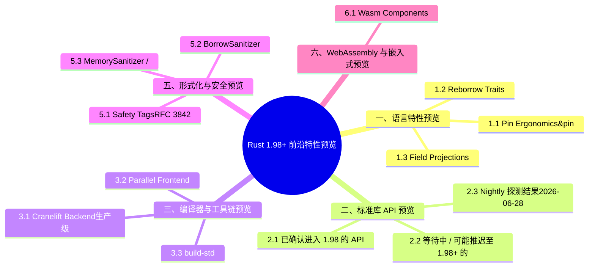

# Rust 1.98+ 前沿特性预览

> **代码状态**: [实现级 — 代码已补充]
>
> **EN**: Rust 1.98+ Preview
> **Summary**: Rust 1.98 and beyond: nightly language features, compiler infrastructure, and ecosystem trends tracked for future stabilization.
> **Rust 版本**: 1.98.0 (nightly preview)
>
> **受众**: [专家]
> **Bloom 层级**: L2-L3
> **内容分级**: [实验级]
> **权威来源**: 本文件为 `concept/` 权威页（1.98+ **周期跟踪** canonical）。
> **Canonical 分工**: 本页 = 周期跟踪（nightly 特性 / RFC 进展 / API 探测，随两周巡检滚动）；1.98.0 **稳定特性权威汇总** = [`rust_1_98_stabilized.md`](rust_1_98_stabilized.md)（2026-08-20 稳定后生效，当前为跟踪骨架）。
> **跟踪版本**: nightly 1.99.0+ (2026-07-28)；**1.98.0 已于 2026-07-03 分支进入 beta**（[releases.rs 1.98.0 beta](https://releases.rs/docs/1.98.0/)，2026-07-28 curl 实测 200）
> **预计稳定时间**: **1.98.0 = 2026-08-20**（releases.rs 实测；截至 2026-07-28 约 3 周后发布）；1.99+ 及以后
> **当前阶段**: 🧪 Nightly 实验性 / 设计或 MCP 阶段
> **Rust 属性标记**: `#[experimental]` `#[nightly_only]`
> **状态**: 特性集高度不确定，稳定时间和具体内容以官方发布为准
>
> **权威来源**:
>
> · [Rust Reference](https://doc.rust-lang.org/reference/introduction.html)
> · [TRPL](https://doc.rust-lang.org/book/title-page.html)
> · [Brown University — Interactive Rust Book](https://rust-book.cs.brown.edu/)
> · [Jung et al. — RustBelt: Securing the Foundations of Rust](https://plv.mpi-sws.org/rustbelt/popl18/)
> · [Itanium C++ ABI](https://itanium-cxx-abi.github.io/cxx-abi/abi.html)
>
> - [Rust Project Goals 2026](https://rust-lang.github.io/rust-project-goals/2026/)
> - [Project Goals — Beyond the `&`](https://rust-lang.github.io/rust-project-goals/2026/pin-ergonomics.html)
> - [Project Goals — BorrowSanitizer](https://rust-lang.github.io/rust-project-goals/2026/borrowsanitizer.html)
> - [Project Goals — Field Projections](https://rust-lang.github.io/rust-project-goals/2026/field-projections.html)
> - [Inside Rust Blog](https://blog.rust-lang.org/inside-rust/)
> - [Rust Internals Forum](https://internals.rust-lang.org/)
> - [releases.rs — nightly 1.98.0](https://releases.rs/)
>
> **定理链**: N/A — 描述性/综述性/导航性文档，不涉及形式化定理链
> **前置概念**: N/A
---

## 当前状态：1.98.0 beta 已冻结，stable 约 3 周后发布（2026-07-28）

> **状态摘要**：1.98.0 已于 **2026-07-03** 从 master 切分进入 beta 通道，预计 **2026-08-20** 转正为 stable。截至 2026-07-28，特性集已在 beta 分支锁定；最终 release notes 通常会在 stable 发布前 1–2 周由 release team 定稿。本页继续跟踪 beta 已知项与 nightly 1.99+ 前瞻项，stable 发布后将把已稳定内容迁移至 [`rust_1_98_stabilized.md`](rust_1_98_stabilized.md)。

### 官方跟踪来源

- [Rust 1.98.0 Release Notes (beta)](https://releases.rs/docs/1.98.0/) — 当前最具体的 1.98.0 变更清单
- [Rust Forge — Release Versions](https://forge.rust-lang.org/) — 发布日历与分支时间线
- [The Rust Programming Language Blog](https://blog.rust-lang.org/) — stable 发布官方公告
- [Inside Rust Blog](https://blog.rust-lang.org/inside-rust/) — 团队进展、pre-release testing、Project Goals 月度更新
- [Rust Project Goals 2026](https://rust-lang.github.io/rust-project-goals/2026/) — 年度目标与路线图（Pin ergonomics、RTN、cargo-script、public/private dependencies 等）
- [rust-lang/rust releases](https://github.com/rust-lang/rust/releases) — 标签级 release 与 nightly 构建
- [Rust Internals Forum](https://internals.rust-lang.org/) — 设计讨论与 FCP 公告

> **事实源优先级**：官方 release notes > rust-lang/rust PR 合并记录 > Project Goals 月度更新 > internals 讨论。未合并进对应分支的“计划中/讨论中”条目不进入特性表。

---

## 零、1.98 周期跟踪清单（2026-07-28 更新）

> **状态取值**：`stabilized in 1.98 beta`（已随 1.98.0 beta 分支合入，2026-08-20 转正）/ `RFC merged`（RFC 已合并，实现跟踪中）/ `FCP`（最终评论期）/ `nightly only`（nightly 可用，未排期）。
> **实测来源**：[releases.rs 1.98.0 beta](https://releases.rs/docs/1.98.0/)（curl 200，2026-07-28）· §1.7 RFC 表（2026-07-28 实测）

| 特性 | 状态 | 语义影响 / 迁移注意 | 跟踪链接 |
|:---|:---|:---|:---|
| `Panic[Hook]Info` 中 `Location<'_>` 生命周期改为 `'static` | stabilized in 1.98 beta | **语义等价**：调用点行为不变；签名严格化可能破坏依赖旧生命周期的泛型/Trait 实现。迁移见 §0.1。 | [releases.rs 1.98.0](https://releases.rs/docs/1.98.0/) |
| mingw-w64 C 工具链更新 | stabilized in 1.98 beta | **构建行为变化**：Windows GNU target 的链接行为、运行时依赖与产物布局可能改变；需重新验证 FFI/静态链接产物。 | [releases.rs 1.98.0](https://releases.rs/docs/1.98.0/) |
| 移除 Solaris 上 `File::lock` 实现（语义错误） | stabilized in 1.98 beta | **观察行为变化**：原实现语义错误，现明确不可用。Solaris 用户需迁移至 `fcntl` 或平台特定文件锁。 | [releases.rs 1.98.0](https://releases.rs/docs/1.98.0/) |
| 移除 `-Zemscripten-wasm-eh` | stabilized in 1.98 beta | **命令行选项移除**：原使用该 flag 的构建脚本/CI 需改用新的异常处理配置或移除；否则 `rustc` 报错「未知 option」。 | [releases.rs 1.98.0](https://releases.rs/docs/1.98.0/) |
| Named `Fn` trait parameters（RFC #3955） | RFC merged（2026-07-08） | **语法糖，无语义/ABI 影响**：名称仅用于文档与 LSP 提示，不改变对象安全、调用语法或 ABI。详见 §0.2。 | [RFC Book](https://rust-lang.github.io/rfcs/3955-named-fn-trait-parameters.html) |
| `#![register_{attribute,lint}_tool]`（RFC #3808） | RFC merged（2026-06-10） | **命名空间扩展**：新增 crate 级工具命名空间注册，允许外部工具使用 `tool::lint`/`#[tool::attr]` 语法而不报错；与同名 crate 可能产生歧义错误。 | [RFC Book](https://rust-lang.github.io/rfcs/3808-register-tool.html) |
| `todo!()` 不再触发 `unreachable_code`（RFC #3928） | RFC merged（2026-06-25） | **观察行为变化**：`todo!()` 后代码不再产生 `unreachable_code` lint；新增 `todo_macro_calls` warn-by-default lint，可在开发期关闭、发布前启用。 | [RFC Book](https://rust-lang.github.io/rfcs/3928-todo-overreach.html) |
| Safety Tags（RFC #3842） | FCP / 讨论中 | 如稳定，将把 unsafe 契约从自由文本提升为结构化属性，影响 clippy/审核工具对 unsafe 块的检查能力。 | [rfcs#3842](https://github.com/rust-lang/rfcs/pull/3842) |
| Pin Ergonomics（`&pin mut` / `&pin const`） | nightly only（Project Goal 2026） | 引入原生固定借用类型，可能简化 futures/自引用结构体代码，但稳定前 API 仍可能变化。 | [预览页](../02_preview_features/14_pin_ergonomics_preview.md) |
| Async Drop | nightly only | 使 `drop` 可 `await`，影响异步资源清理模式；距离稳定尚有设计工作。 | [预览页](../02_preview_features/22_async_drop_preview.md) |
| Return Type Notation（RTN） | nightly only | 允许在 bound 中约束 `impl Trait` 返回类型的关联项，是 `async fn` in traits 替代 `#[async_trait]` 的关键拼图。 | [预览页](../02_preview_features/09_return_type_notation_preview.md) |
| Public/Private Dependencies（RFC #3516） | RFC merged，Cargo 实现跟踪中 | 区分公共 API 依赖与实现细节依赖，使 cargo 能机器判定依赖变化是否构成 SemVer 破坏。 | [RFC Book](https://rust-lang.github.io/rfcs/3516-public-private-dependencies.html) |

> **维护约定**：每两周按 §7.1 频率核对本表；1.98.0 发布（2026-08-20）后将 beta 行迁移至 [`rust_1_98_stabilized.md`](rust_1_98_stabilized.md)（骨架已建，2026-07-14），本页滚动为 1.99+ 跟踪。

---

### §0.1 `Panic[Hook]Info` 中 `Location<'_>` 生命周期 `'static` 化的语义影响

在 1.98 beta 中，`std::panic::PanicInfo::location()`（以及对应的 `PanicHookInfo::location()`）的返回类型从与 `&self` 绑定的 `Option<&Location<'_>>` 收紧为 `Option<&'static Location<'static>>`。这一变更的表面动机很简单：panic 发生位置是编译期静态数据（文件、行号、列号），其生命周期本就可以是 `'static`；对全局 panic hook 等需要把位置信息持久化或跨借用边界转发的场景，`'static` 生命周期消除了不必要的人为限制。

#### 语义等价性

对绝大多数仅在 hook 内部打印或格式化位置信息的代码，本变更**完全语义等价**，观察行为不变：

```rust,ignore
std::panic::set_hook(Box::new(|info| {
    if let Some(loc) = info.location() {
        eprintln!("panic at {}:{}", loc.file(), loc.line());
    }
}));
```

`'static` 引用可以协变为任何更短生命周期，因此上述代码在 1.98 前后都能编译，且运行时行为一致。

#### 潜在破坏性：何时会编译失败？

破坏只发生在**把 location 生命周期与 panic info 生命周期显式绑定**的泛型或 Trait 实现中：

1. **返回类型显式标注旧生命周期**。若某函数旧签名返回 `&Location<'_>`（隐式取自 `&PanicInfo<'_>`），1.98 后实际返回 `&'static Location<'static>`。调用者若把该返回值存到与 `info` 同生命周期的变量，通常仍可编译；真正会报错的是把 `Location<'_>` 作为关联类型或泛型参数传递，并要求其生命周期严格等于某个局部生命周期的代码。

2. **Trait 实现中的生命周期等式**。例如为 `PanicInfo<'a>` 实现某 trait，并把 `location()` 的结果类型写作 `&'a Location<'a>`：

   ```rust,ignore
   use std::panic::{Location, PanicInfo};

   trait LocProvider<'a> {
       fn location(&self) -> &'a Location<'a>;
   }

   impl<'a> LocProvider<'a> for PanicInfo<'a> {
       fn location(&self) -> &'a Location<'a> {
           self.location().unwrap() // 1.98 前：&'a Location<'a>；1.98 后：&'static Location<'static>
       }
   }
   ```

   在 1.98 中，`&'static Location<'static>` 无法强制转换为 `&'a Location<'a>` 当 trait 要求精确等式时，会产生生命周期不匹配错误。

3. **高阶 trait bound（HRTB）**。若代码使用 `for<'a> Fn(&'a PanicInfo<'a>) -> &'a Location<'a>` 之类 bound，1.98 后由于返回值是 `'static`，该 bound 不再满足。

#### 迁移指南

- **简单调用者**：无需改动；`'static` 引用的协变规则保证旧代码继续工作。
- **泛型/Trait 作者**：把 `Location` 的生命周期参数从局部生命周期改为 `'static`，或直接用 `&'static Location<'static>` 作为关联类型/返回类型。
- **库作者**：如果你的 crate 公开了接收或返回 panic location 的 API，建议在 `Cargo.toml` 中把 `rust-version` 升到 `1.98.0`，并在变更日志中注明该签名变化。

> **核心结论**：该变更对**使用** panic hook 的代码是向后兼容的；对**抽象/封装** panic location 生命周期的泛型代码是潜在破坏变更，迁移方式是把相关生命周期统一为 `'static`。

---

### §0.2 Named `Fn` trait parameters（RFC #3955）的语义影响

[RFC #3955](https://rust-lang.github.io/rfcs/3955-named-fn-trait-parameters.html) 允许在 `Fn`/`FnMut`/`FnOnce` 及其 async 变体 `AsyncFn*` 的圆括号泛型参数列表中为参数命名，例如 `impl Fn(msg: String, priority: usize)`。该 RFC 已于 **2026-07-08** 合并，预计随 1.99+ 进入实现与稳定化通道。下面对其潜在语义影响作边界分析。

#### 对 Trait 对象安全的影响：**无实质影响**

参数名在类型系统中不参与等价判定。`dyn Fn(msg: String, priority: usize)` 与 `dyn Fn(String, usize)` 表示同一个 trait object 类型，vtable 布局、调用约定与对象安全规则均不变。名称仅作为**句法注释**存在，在 AST  lowered 到 MIR/LLVM IR 之前即被擦除。

#### 对调用语法的影响：**无直接调用语法变化**

命名参数仅出现在**类型签名侧**（bound、where 子句、type alias），不改变调用侧语法。调用闭包时仍需按位置传参：

```rust,ignore
fn parse(log: impl Fn(msg: String, priority: usize)) {
    // 仍需按位置调用，不能写 log(msg: s, priority: 1)
    log("error".to_string(), 1);
}
```

这与未来可能的「命名参数（named arguments）」语言特性有本质区别：RFC #3955 只是让高阶函数签名的可读性与 `fn` 指针保持一致，不提供调用时的命名匹配、重排或省略。

#### 对 ABI 的影响：**无 ABI 变化**

参数名不会进入：

- v0 symbol mangling；
- vtable 条目；
- calling convention 的寄存器/栈布局；
- monomorphization 后的 LLVM IR。

因此，`impl Fn(A, B)` 与 `impl Fn(a: A, b: B)` 单态化后的产物完全相同，对 FFI、动态链接、编译缓存（incr. comp）均无影响。

#### 迁移与兼容性

- **现有代码**：完全向后兼容；未命名的 `Fn` bound 继续有效。
- **新增代码**：可逐步在 API 签名中添加参数名以改善文档与 IDE 提示，属于可选增强。
- **工具链要求**：稳定化前需 nightly + `#![feature(named_fn_trait_parameters)]`（feature 名以最终实现为准）。

> **核心结论**：RFC #3955 是**纯句法/文档增强**，不引入新的语义等价关系、不改变 trait 对象安全、不改变 ABI。教学与代码审查中应明确区分「`Fn` trait 命名参数」与「函数调用命名参数」两个独立特性。

---

> **后置概念**:
>
> [Rust 1.97 前沿特性预览](rust_1_97_preview.md)
> · [Rust Specification](https://www.rust-lang.org/)
> · [官方路线图](https://github.com/rust-lang/rust/labels/F-roadmap)
>
> **前置依赖**:
>
> [Rust vs C++](../../05_comparative/01_systems_languages/01_rust_vs_cpp.md)
> · [Toolchain](../../06_ecosystem/00_toolchain/01_toolchain.md)

---

## 一、语言特性预览

1.98 预览的语言特性围绕一个长期主题：**让 `Pin` 与自引用（Reference）类型可用**。六项提案按解决同一问题的不同侧面组织：

- **Pin Ergonomics（`&pin mut`/`&pin const`）**: 为固定引用引入专用类型构造器，消除 `Pin::new`/`as_mut` 的样板噪声，让“被固定的借用（Borrowing）”在类型层面一等公民化。
- **Reborrow Traits**: 把“从 `&mut T` 得到 `&mut T` 的重借用”抽象为 trait，支撑 Pin API 的人体工学改进。
- **Field Projections**: 对 `Pin<&mut Struct>` 安全地投影到字段（`Pin<&mut Field>`），当前只能手写 unsafe——是自引用结构体（Struct）（如手写字节码解释器的状态）的刚需。
- **Return Type Notation (RTN)**: `fn foo() -> impl Trait<method(): Send>` 式地约束返回类型的关联项，缓解 `impl Trait` 无法表达“返回的 future 必须 Send”的痛点。

判定依据：全部为预览级提案，手写 async runtime/嵌入式执行器的团队应跟踪，业务代码无需预留。

### 1.1 Pin Ergonomics（&pin mut / &pin const）

**状态**: 🧪 Lang experiment，Project Goals 2026 旗舰目标 "Beyond the &"

**跟踪 Issue**: [rust-lang/rust#130494](https://github.com/rust-lang/rust/issues/130494)

**核心问题**: `Pin<&mut T>` 的 API 出了名的不友好，手动 pin projection 容易出错，且难以教授。

**提案方向**:

- 引入 `&pin mut T` 和 `&pin const T` 原生借用（Borrowing）类型
- 自动 reborrow、autoref、pattern matching 支持
- 若 `T: Unpin`，`&pin mut T` 与 `&mut T` 可互相 coerce
- 对 `!Unpin` 类型，`Drop` 可能需要 `fn drop(&pin mut self)`

**代码示例** (nightly):

```rust,ignore
#![feature(pin_ergonomics)]

struct ListNode {
    value: i32,
    next: Option<std::pin::Pin<Box<ListNode>>>,
}

fn process(node: &pin mut ListNode) {
    // 自动 pin projection，无需 unsafe
    println!("{}", node.value);
}
```

**深度文档**: [15_pin_ergonomics_preview.md](../02_preview_features/14_pin_ergonomics_preview.md)

**教学提示**: 这是 async/self-referential 类型的基础；稳定后将大幅简化 futures 和 pin-project 类 crate 的教学。

---

### 1.2 Reborrow Traits

**状态**: 🧪 设计阶段，Project Goals 2026 旗舰目标 "Beyond the &"

**核心问题**: 当前 Rust 无法泛化地表达 "可以 reborrow" 的能力，导致 `&mut T`、`Pin<&mut T>`、`&Cell<T>` 等需要各自重复的 API。

**提案方向**:

- 引入类似 `Reborrow` / `ReborrowMut` 的 trait
- 统一 `&mut`、pinned mutable reference、interior-mutable references 的 reborrow 语义
- 可能与 Pin ergonomics 协同解决 auto-borrowing

**影响**: 一旦稳定，将深刻影响低层 API 设计（如 IO traits、buffer APIs、self-referential structs）。

```rust,ignore
// 假设性 Reborrow traits（最终 API 以 RFC 为准）
pub trait Reborrow {
    type Output;
    fn reborrow(&self) -> Self::Output;
}

pub trait ReborrowMut {
    type Output;
    fn reborrow_mut(&mut self) -> Self::Output;
}

// 未来可能统一 &mut T、Pin<&mut T>、&Cell<T> 的 reborrow API
fn process_buffer<B: ReborrowMut>(buf: &mut B)
where
    B::Output: AsRef<[u8]>,
{
    let tmp = buf.reborrow_mut();
    // 在 tmp 的生命周期内继续使用 buf，而不需要完全移动所有权
    let _ = tmp.as_ref();
}
```

---

### 1.3 Field Projections

**状态**: 🧪 设计阶段，Project Goals 2026 旗舰目标 "Beyond the &"

**跟踪**: [Project Goals — Field Projections](https://rust-lang.github.io/rust-project-goals/2026/field-projections.html)

**核心问题**: 当前无法安全地在 trait 中表达 "返回某字段的引用（Reference）/投影"，pin projection 尤其困难。

**提案方向**:

- 允许 trait 定义字段投影
- 编译器可验证投影的合法性
- 与 Pin ergonomics 配合，提供安全的 self-referential/pinned 字段访问

**影响**: 可能取代大量 `pin-project` / `pin-project-lite` 宏（Macro）的使用场景。

```rust,ignore
// 假设性字段投影 trait（最终 API 以 RFC 为准）
trait FieldProjection {
    type Field<T>;

    // 在 trait 中安全地返回某个字段的 pinned 投影
    fn project<T>(self: Pin<&mut Self>) -> Pin<&mut Self::Field<T>>;
}

struct Form {
    header: Header,
    body: Body,
}

impl FieldProjection for Form {
    type Field<header> = Header; // 示意，非真实语法
    // ...
}
```

---

### 1.4 Return Type Notation (RTN)

**状态**: 🧪 RFC 3654；Project Goals 2026 目标 "Prepare TAIT + RTN for stabilization"

**核心问题**: `impl Trait` 返回类型中无法命名关联类型，导致 `async fn` / `-> impl Iterator` 的返回类型难以在 trait bound 中表达。

**提案语法**:

```rust,ignore
trait Processor {
    fn process(&self) -> impl Future<Output = i32>;
}

fn spawn_processor<P>(p: P)
where
    P: Processor,
    P::process(): Send,  // RTN: 约束 process() 的返回类型为 Send
{
    tokio::spawn(async move { p.process().await });
}
```

**深度文档**: [12_return_type_notation_preview.md](../02_preview_features/09_return_type_notation_preview.md)

**1.98+ 展望**: RTN 可能在 1.98 或 1.99 进入 FCP，是 async-fn-in-traits 完全替代 `#[async_trait]` 的关键拼图。

---

### 1.5 Async Drop

**状态**: 🧪 MCP #727 已通过；实验性实现中

**核心问题**: 当前 `drop` 是同步的，无法 `await` 异步（Async）清理操作（如关闭连接、刷新缓冲区）。

**1.98+ 展望**:

- `AsyncDrop` trait 设计已确定
- `async fn drop(&mut self)` 语法支持
- 距离稳定尚有设计工作，预计 1.99+ 才能进入 FCP

```rust,ignore
#![feature(async_drop)]

struct AsyncFile {
    // 持有需要异步刷新的资源
}

impl AsyncDrop for AsyncFile {
    async fn drop(&mut self) {
        // 异步清理：刷新缓冲区、关闭连接等
        self.flush().await;
    }
}
```

**深度文档**: [18_async_drop_preview.md](../02_preview_features/22_async_drop_preview.md)

---

### 1.6 Async Iteration / Async Iterator

**状态**: 🧪 讨论阶段，无广泛共识

**核心问题**: `Stream` trait 在 `futures` crate 中，std 缺乏原生的 async iteration 抽象。

**1.98+ 展望**:

- 可能引入 `AsyncIterator` trait（`async fn next(&mut self) -> Option<Self::Item>`）
- `for await` 语法仍在讨论
- 预计不会在 1.98 稳定，但可能在 nightly 中有更多实验

### 1.7 新近合并的 RFC（2026-06 ~ 2026-07，跟踪至 1.98+ 周期）

以下 RFC 已于近 6 周内合并进入 Active RFC 列表，实现与稳定化将落在 1.98+ 周期；链接均为已渲染 RFC Book 页面（2026-07-12 curl 实测 200）：

| RFC | 标题 | 合并日期 | 要点 |
|:---|:---|:---|:---|
| [#3955](https://rust-lang.github.io/rfcs/3955-named-fn-trait-parameters.html) | Named `Fn` trait parameters | 2026-07-08 | `Fn`/`FnMut`/`FnOnce` 支持命名参数，改善高阶回调 API 可读性 |
| [#3928](https://rust-lang.github.io/rfcs/3928-todo-overreach.html) | Avoid linting `unreachable_code` on `todo!()` | 2026-06-25 | `todo!()` 后的代码不再触发 `unreachable_code` lint |
| [#3808](https://rust-lang.github.io/rfcs/3808-register-tool.html) | `#![register_{attribute,lint}_tool]` | 2026-06-10 | 自定义 attribute/lint 工具注册，Rust for Linux 稳定化的关键依赖 |
| [#3946](https://rust-lang.github.io/rfcs/3946-crates-io-username-identity.html) | crates.io username identity | 2026-05-26 | crates.io 用户名身份模型，生态治理向 |

> 仍处 FCP/讨论中、尚未合并的高关注提案：Safety Tags（[#3842](https://github.com/rust-lang/rfcs/pull/3842)）、Scalable Vectors（[#3838](https://github.com/rust-lang/rfcs/pull/3838)）、`extern "custom"`（disposition-merge）。

---

## 二、标准库 API 预览

本小节跟踪已进入 Rust 1.98 稳定通道或极有可能进入 1.98 的标准库 API。等效实现与 nightly 测试位于 [`crates/c08_algorithms/src/rust_197_features.rs`](../../../crates/c08_algorithms/src/rust_197_features.rs)。

### 2.1 已确认进入 1.98 的 API

| API | PR | 说明 |
|:---|:---|:---|
| `f32::add_algebraic` / `f64::add_algebraic` 等 `float_algebraic` intrinsics | [#157029](https://github.com/rust-lang/rust/pull/157029) | 允许编译器在代数等价前提下重排浮点运算，提升向量化/优化空间 |
| `int_format_into` | [#152544](https://github.com/rust-lang/rust/pull/152544) | 整数直接格式化到现有缓冲区，避免 `write!` 的堆分配 |
| `core::range::{RangeFull, RangeTo}` / `legacy::*` | [#156629](https://github.com/rust-lang/rust/pull/156629) | 将 `std::ops::RangeFull`、`std::ops::RangeTo` 下沉到 `core::range`，服务 `no_std` |
| `NonZero<T>::from_str_radix` | [#157877](https://github.com/rust-lang/rust/pull/157877) | 按指定进制解析非零整数，结果为 0 时返回 `Err` |
| `Box::as_ptr` / `Box::as_mut_ptr` | [#157876](https://github.com/rust-lang/rust/pull/157876) | 不物化引用（Reference）的原始指针（Raw Pointer）访问，对 aliasing model 更友好 |
| `hex_literal_case` (rustfmt) | [rustfmt #6935](https://github.com/rust-lang/rustfmt/pull/6935) | 十六进制字面量大小写风格配置 |

```rust,ignore
// 1.98+ API 预览（当前需 nightly，稳定化后可直接使用）
#![feature(float_algebraic, int_format_into, nonzero_from_str_radix, box_as_ptr)]

use std::num::NonZeroU32;

fn demo_198_apis() {
    // NonZero::from_str_radix
    let n = NonZeroU32::from_str_radix("1a", 16).unwrap();
    assert_eq!(n.get(), 26);

    // Box::as_mut_ptr
    let mut boxed = Box::new(42);
    let ptr: *mut i32 = boxed.as_mut_ptr();
    unsafe { *ptr = 100; }
    assert_eq!(*boxed, 100);
}
```

以下 API 在当前稳定版（1.97.0）中已可用：

```rust
fn demo_stable_apis() {
    // 整数平方根（1.84 稳定）
    assert_eq!(10i32.isqrt(), 3);

    // Strict Provenance：创建无来源指针（1.84 稳定）
    let addr = 0x1000usize;
    let p = std::ptr::without_provenance::<u8>(addr);
    assert!(!p.is_null());

    // NonZero 的整数平方根（1.84 稳定）
    let nz = std::num::NonZeroU32::new(9).unwrap();
    assert_eq!(nz.isqrt().get(), 3);
}
```

**代码实现**:

[`demo_float_algebraic()`](../../../crates/c08_algorithms/src/rust_197_features.rs) ·
[`demo_int_format_into()`](../../../crates/c08_algorithms/src/rust_197_features.rs) ·
[`demo_core_range_completion()`](../../../crates/c08_algorithms/src/rust_197_features.rs) ·
[`demo_nonzero_from_str_radix()`](../../../crates/c08_algorithms/src/rust_197_features.rs) ·
[`demo_box_as_ptr()`](../../../crates/c08_algorithms/src/rust_197_features.rs)

---

### 2.2 等待中 / 可能推迟至 1.98+ 的 API

| API | 状态 | 说明 |
|:---|:---|:---|
| `VecDeque::truncate_front` / `retain_back` | 🔄 FCP finished / waiting | PR [#151973](https://github.com/rust-lang/rust/pull/151973) FCP 已完成，当前等待 review / FCP completion；已确定错过 1.97 cutoff，进入 1.98 通道 |
| `RandomSource` / `DefaultRandomSource` | 🔄 等待 libs-api | PR [#157168](https://github.com/rust-lang/rust/pull/157168)，可插拔随机数源抽象 |
| `Box::into_non_null` / `Vec::into_non_null` (`box_vec_non_null`) | 🔄 PFCP | tracking issue [#130364](https://github.com/rust-lang/rust/issues/130364)，转换为 `NonNull<T>`；当前 nightly 方法尚未出现，名称待确认 |
| `#[optimize]` 属性 | 🔄 PFCP / Blocked | PR [#157273](https://github.com/rust-lang/rust/pull/157273)，函数级优化提示 |
| `size_of_val_raw` / `align_of_val_raw` / `Layout::for_value_raw` | 🔄 等待 review | PR [#157572](https://github.com/rust-lang/rust/pull/157572)，裸值尺寸/对齐计算 |
| C-variadic function definitions | 🔄 PFCP | PR [#155942](https://github.com/rust-lang/rust/pull/155942)，定义 C 风格可变参数函数 |
| `proc_macro_value` | 🔄 等待 review | PR [#152092](https://github.com/rust-lang/rust/pull/152092)，过程宏（Procedural Macro）在编译期产生值 |
| `local_key_cell_update` | 🔄 等待 libs-api | PR [#157734](https://github.com/rust-lang/rust/pull/157734)，`LocalKey::update` 相关 Cell 更新 API |
| `#[my_macro] mod foo;` (proc_macro_hygiene) | 🔄 PFCP | PR #157857，过程宏（Procedural Macro）卫生性的一部分 |

---

### 2.3 Nightly 探测结果（2026-06-28）

> 探测脚本: [`scripts/probe_rust_198_apis.rs`](../../../scripts/probe_rust_198_apis.rs)
> 完整报告: [`archive/reports/2026_07/RUST_198_NIGHTLY_PROBE_2026_06_28.md`](../../../archive/08_quality_audits/08_reports_by_time/2026_07/RUST_198_NIGHTLY_PROBE_2026_06_28.md)（归档只读）

使用 `rustc 1.98.0-nightly (2026-06-26)` 对 17 项候选 API 进行无 feature gate 编译探测：

| 状态 | 数量 | 代表 API |
|---|---|---|
| ✅ 已可用 | 11 | `i32::isqrt`、`u32::isqrt`、`ptr::with_exposed_provenance`、`ptr::without_provenance`、`ptr::dangling`、`Ipv6Addr::is_unique_local`、`CStr::from_bytes_until_nul`、`std::pin::pin!`、`From<bool> for f32/f64`、`Waker::noop` |
| ❌ 仍不可用 | 6 | `Pin::as_deref_mut`、`NonZeroI32::isqrt`、`Vec::into_non_null`、`Box::into_non_null`、`VecDeque::truncate_front`、`VecDeque::retain_back` |

**关键发现**:

- `i32::isqrt` 等整数平方根 API 已在 nightly 可用，预计进入 1.98.0 stable。
- Provenance 相关 API (`with_exposed_provenance`、`without_provenance`、`dangling`) 已在 nightly 可用，是 strict provenance 迁移的重要信号。
- `Pin::as_deref_mut` 在当前 nightly 仍不存在，说明 Pin ergonomics 仍在演进，教学中应保持保守。
- 从 1.97.0 推迟的 `Box::into_non_null`、`Vec::into_non_null`、`VecDeque::truncate_front`、`VecDeque::retain_back` 仍未稳定，代码中需继续保留等效实现。

---

## 三、编译器与工具链预览

编译器与工具链的四项预览按“用户可感知度”排序：

- **Cranelift Backend（生产级）**: 基于 Cranelift 的代码生成后端达到生产可用——调试构建速度提升 20–40%，代价是运行时（Runtime）性能略逊 LLVM（5–15%）；定位明确：dev 用 Cranelift，release 用 LLVM。
- **Parallel Frontend**: 编译前端并行化（类型检查、宏（Macro）展开的并行调度），大 workspace 的全量构建时间显著下降；默认启用计划与具体提速数据以官方公告为准。
- **build-std**: 从源码构建标准库（`-Zbuild-std` 的稳定化路径），解锁自定义 target、`panic=abort` 全栈一致、标准库 LTO 等能力，嵌入式与 `-Zbuild-std-features=panic_immediate_abort` 类场景受益最大。
- **Next-Generation Trait Solver**: 新 trait 求解器取代旧实现，修复长期存在的关联类型/高阶约束边角案例，并为 GAT/TAIT 的完整语义奠基。

判定依据：Cranelift 可立即试用；其余三项属基础设施升级，受益方式是“等默认开启”。

### 3.1 Cranelift Backend（生产级）

**状态**: 🧪 Project Goals 2026 旗舰目标 "Flexible, fast(er) compilation"

**核心问题**: LLVM backend 编译慢，debug 构建尤其明显。

**提案方向**:

- 将 `cranelift` 作为可选 codegen backend
- 通过 `cargo build -Zcodegen-backend=cranelift` 使用
- 目标：debug 构建速度显著提升

**1.98+ 展望**:

- 继续完善稳定性和功能完整性
- 可能在 1.99 或 1.100 进入稳定预览

**教学提示**: 可在 `.cargo/config.toml` 中展示本地启用方式，但强调仍为 nightly。

```toml
# .cargo/config.toml
[unstable]
codegen-backend = true

[build]
rustflags = ["-Zcodegen-backend=cranelift"]
```

---

### 3.2 Parallel Frontend

**状态**: 🧪 Project Goals 2026 旗舰目标

**核心问题**: rustc 前端（parse / expand / resolve / type-check）目前基本是单线程，无法充分利用多核。

**提案方向**:

- 在 crate 内部并行化前端阶段
- 通过 `-Zthreads=N` 实验

**1.98+ 展望**: 实验性支持持续完善，稳定化时间未定。

---

### 3.3 build-std

**状态**: 🧪 Project Goals 2026 旗舰目标

**核心问题**: 交叉编译、`no_std`、自定义 target 时需要从源码构建标准库。

**提案方向**:

- 稳定化 `cargo build -Zbuild-std`
- 支持 MSan/TSan、自定义 allocator、profile-guided 标准库构建

**1.98+ 展望**: 是 MSan/TSan 稳定化的前置条件之一。

---

### 3.4 Next-Generation Trait Solver

**状态**: 🧪 已实现，默认在 nightly 中启用进行测试

**核心问题**: 旧 trait solver 在复杂泛型（Generics）、GATs、TAIT、RTN 等场景下存在限制和 bugs。

**1.98+ 展望**:

- 继续通过 crater 测试验证兼容性
- 预计 1.99+ 成为默认 solver
- 需要大量实际项目测试反馈

---

## 四、Cargo 与生态预览

Cargo 与生态的四项预览聚焦**依赖关系的精确表达与合规**：

- **Public/Private Dependencies（RFC #3516）**: 区分“出现在公共 API 中的依赖”与“纯实现细节依赖”，让 cargo 能在依赖变化是否构成 SemVer 破坏上给出机器可判定的答案——库作者的版本纪律从此可验证。
- **Cargo SBOM Precursor**: 软件物料清单（SBOM）生成的前置能力，把依赖图、来源、许可证导出为标准格式（SPDX/CycloneDX），响应欧美供应链合规法规（如 CRA）的强制披露要求。
- **cargo-script 稳定化**: 单文件 Rust 脚本（frontmatter 内嵌 `[dependencies]`）从 nightly 走向稳定，定位为构建脚本、CI 小工具、教学示例的轻量载体。
- **Sized Hierarchy / const Sized**: 放宽 `Sized` 约束的层级关系，服务 `extern type` 与更精细的 unsized 抽象，属类型系统（Type System）底层的铺路基。

判定依据：SBOM 能力对受监管行业是刚需，应提前验证工具链；public/private 依赖一旦可用，库的 SemVer 检查（`cargo-semver-checks`）精度将显著提升。

### 4.1 Public/Private Dependencies（RFC #3516）

**状态**: 🔄 FCP 准备中；Project Goals 2026 目标

**核心问题**: crate 无法声明某个依赖是 "public"（其类型会出现在本 crate 的 public API 中），导致 semver 检查工具难以判断破坏性变更。

**提案语法**:

```toml
[dependencies]
serde = { version = "1.0", public = true }
```

**1.98+ 展望**: 可能在 1.98 或 1.99 稳定 MVP。

---

### 4.2 Cargo SBOM Precursor

**状态**: 🧪 Project Goals 2026 目标

**核心问题**: 供应链安全需要机器可读的依赖清单（Software Bill of Materials）。

**提案方向**:

- 在 `Cargo.lock` 之外生成 SBOM 信息
- 可能与 `cargo metadata` 或新的 `cargo sbom` 子命令结合

**1.98+ 展望**: 2026 年重点推进，可能产生新的实验性子命令。

---

### 4.3 cargo-script 稳定化

**状态**: 🧪 已在 Rust 1.79 nightly；Project Goals 2026 目标 "Stabilize cargo-script"

**核心问题**: Rust 缺少类似 Python/Node 的轻量级脚本执行方式。

**提案方向**:

- 稳定化 `cargo +nightly -Zscript`
- 支持文件顶部的 TOML frontmatter

**1.98+ 展望**: 有望在 1.98 或 1.99 稳定。

---

### 4.4 Sized Hierarchy / const Sized / Scalable Vectors

**状态**: 🧪 Project Goals 2026 旗舰目标

**核心问题**: `Sized` trait 层级过于粗糙，`extern types` 和 SVE (Scalable Vector Extension) 需要更精细的大小信息。

**提案方向**:

- 细化 `Sized` trait hierarchy
- 引入 `const Sized` 支持编译期未知但运行时（Runtime）确定的大小
- 为 AArch64 SVE / SME 提供标准库支持

**1.98+ 展望**: 基础 trait hierarchy 可能在 1.98 进入 FCP；SVE/SME 支持为 nightly 长期目标。

---

## 五、形式化与安全预览

形式化与安全在 1.98 周期跟踪三条线：

1. **Safety Tags（RFC #3842）**：用 `#[safety(...)]` 属性把 unsafe 契约（前置条件/不变量）从注释提升为机器可检查的结构化标注，使 `clippy`/审核工具可验证 unsafe 块的文档完整性——处于 FCP/讨论中，是 unsafe 文档工业化的关键一步。
2. **BorrowSanitizer**：动态借用违规检测，目标是以远低于 Miri 的开销捕获别名违规；1.98 窗口内仍以原型为主。
3. **MemorySanitizer / ThreadSanitizer 稳定化**：`-Zsanitizer` 系列向稳定通道推进，给 unsafe/FFI 代码提供与 C/C++ 同级的动态分析能力。

判定依据：安全关键项目现在即可落地的是 MSan/TSan nightly + Miri CI；Safety Tags 待 RFC 合入后再跟进标注规范。

### 5.1 Safety Tags（RFC #3842）

**状态**: 🧪 RFC 讨论中

**核心问题**: 当前 safety comments 是自由文本，难以工具化检查。

**提案方向**:

- `#[safety::requires(...)]` 标注 unsafe 函数的前提条件
- `#[safety::checked(...)]` 标注调用处已检查的条件
- Clippy / rust-analyzer 未来可提供 IDE 支持

**深度文档**: [08_safety_tags_preview.md](../02_preview_features/03_safety_tags_preview.md)（原 `33_safety_tags_in_formal.md` 已合并重定向）

---

### 5.2 BorrowSanitizer

**状态**: 🧪 Rust Project Goal 2026；LLVM RFC 已发布

**核心问题**: Miri 精确但极慢，且无法跨越 FFI 边界检测 Tree Borrows 违规。

**提案方向**:

- 基于 LLVM 的 sanitizer，在运行时（Runtime）检测 Tree Borrows 违规
- 支持 C/C++/Rust 混合代码

**深度文档**: [34_borrow_sanitizer_in_formal.md](../../04_formal/02_separation_logic/04_borrow_sanitizer_in_formal.md)

---

### 5.3 MemorySanitizer / ThreadSanitizer 稳定化

**状态**: 🧪 Project Goals 2026 目标

**核心问题**: MSan/TSan 需要 `-Zbuild-std`，使用门槛高。

**1.98+ 展望**:

- 稳定化 MSan/TSan 支持
- 提供预编译的 instrumented 标准库

---

## 六、WebAssembly 与嵌入式预览

WASM 组件模型（Component Model）是 1.98 周期嵌入式的核心跟踪项：

- **现状**：`wasm32-wasip2` 目标（1.82+ tier 2）直接产出组件；`cargo component` 提供 WIT 绑定生成，`wasm-tools` 负责组件验证与合成。
- **嵌入式的意义**：组件模型把「驱动」与「应用」解耦为可组合的 WIT 接口——同一传感器驱动组件可服务多个应用组件，宿主导入（host imports）由运行时统一仲裁，天然契合 MCU 上的多租户固件。
- **风险项**：WIT 版本演化尚无冻结承诺，Preview 2 → Preview 3（async 组件）的迁移成本未明。

判定依据：嵌入式组件化项目应从 `wasm32-wasip2` + 显式 WIT 版本锁定起步，避免追逐 Preview 3 的 nightly 特性。

### 6.1 Wasm Components

**状态**: 🧪 Project Goals 2026 目标

**核心问题**: Rust 需要更好地支持 WebAssembly Component Model 和 WASI Preview 2/3。

**1.98+ 展望**:

- 新增/稳定化三个 compiler target
- 实验性支持 Wasm-specific 语言特性
- WASI Preview 3（原生 async I/O）预计 2026 年发布

**关联**: `c12_wasm` 模块（Module）应跟踪 `wasm32-wasip1` / `wasm32-wasip2` target 和 `cargo-component`。

---

## 七、跟踪与更新机制

> **稳定特性汇总**：1.98.0 稳定后的权威汇总页为 [`rust_1_98_stabilized.md`](rust_1_98_stabilized.md)；本页仅负责周期跟踪，两页 canonical 分工见文首。

本页与下游页面（stabilized 汇总页、各预览特性页）保持以下更新约定：

| 机制 | 约定 |
|:---|:---|
| 更新频率 | 每个 6 周发布周期核对一次 beta 分支 release notes；周期内仅在跟踪项状态变化时更新 |
| 状态标记 | ✅ 已稳定 / 🔄 beta 中 / 🧪 nightly-only / ⏳ 待定 / ❌ 已撤回，五态互斥 |
| 事实源优先级 | 官方 release notes > rust-lang/rust PR 合并记录 > Project Goals 月度更新 > internals 讨论 |
| 登记规则 | 仅当 PR 合并进对应分支才登记；"计划中/讨论中"不进入特性表 |
| 关联文档 | 稳定后内容迁入 `rust_1_98_stabilized.md`，本页只保留跟踪记录，避免双权威页 |

不确定的条目宁可留 ⏳ 空缺，禁止据 roadmap 推断补全。

### 7.1 更新频率

- 每两周检查一次 [releases.rs](https://releases.rs/) 和 [Project Goals 2026](https://rust-lang.github.io/rust-project-goals/2026/) 更新
- 每次 Rust nightly 升级后，验证本文件中的 nightly 代码示例是否仍可编译

### 7.2 状态标记约定

| 标记 | 含义 |
|:---|:---|
| 🧪 | Nightly 实验性 |
| 🔄 | MCP / RFC / PFCP 阶段 |
| ✅ | 已稳定 |
| ❌ | 已取消或无限期推迟 |
| ⏳ | 等待上游决策 |

### 7.3 关联文档

- [Rust 1.98.0 稳定特性（跟踪骨架）](rust_1_98_stabilized.md)
- [Rust 1.97 前沿特性预览](rust_1_97_preview.md)
- [Pin Ergonomics 预览](../02_preview_features/14_pin_ergonomics_preview.md)
- [Return Type Notation 预览](../02_preview_features/09_return_type_notation_preview.md)
- [Async Drop 预览](../02_preview_features/22_async_drop_preview.md)
- [Safety Tags](../02_preview_features/03_safety_tags_preview.md)
- [BorrowSanitizer](../../04_formal/02_separation_logic/04_borrow_sanitizer_in_formal.md)
- [AutoVerus / Verus](../../04_formal/04_model_checking/07_autoverus.md)
- [Tree Borrows 深度](../../04_formal/01_ownership_logic/05_tree_borrows_deep_dive.md)
- [1.97/1.98 API 等效实现与测试](../../../crates/c08_algorithms/src/rust_197_features.rs)

---

## 八、代码任务与演进方向

- [x] 为本文件中的每个特性补充最小 nightly 示例（使用 `rust,ignore`，待 API 稳定后转为可编译示例）
- [x] 在 `crates/c08_algorithms/src/rust_197_features.rs` 中维护 1.97/1.98 API 的等效实现与单元测试
- [x] 补充 1.98 已确认标准库 API 预览（`float_algebraic`、`int_format_into`、`core::range`、`NonZero::from_str_radix`、`Box::as_ptr`、`hex_literal_case`）
- **演进方向（待办）**: 待 1.98 特性稳定后，将本文件关键术语同步到术语表（`concept/00_meta/01_terminology/01_terminology_glossary.md`）

## 🧭 思维导图（Mindmap）



## ⚠️ 反例与陷阱：在 stable 上直接调用预览 API

**反例**：看到本页 `float_algebraic` 等 API 预览后，在 stable 项目里直接使用：

```rust,compile_fail
fn main() {
    // 1.98 预览 API：f32::algebraic_add（浮点代数运算，允许重排优化）
    let x = 1.0f32.algebraic_add(2.0);
    println!("{x}");
}
```

实测（rustc 1.97.0 stable, edition 2024）：`error[E0658]: use of unstable library feature`float_algebraic``。

**陷阱本质**：预览页列出的 nightly-only API 在 stable 上没有入口。E0658 与 E0554 的区别在于：前者是「库 API 未稳定」，后者是「编译器拒绝 feature gate」——两者都不能靠配置绕过。

**修正**：

等待 1.98 稳定化（跟踪本页「零、1.98 周期跟踪清单」）；
实验用 nightly + `#![feature(float_algebraic)]`，等效行为可先用 [`crates/c08_algorithms/src/rust_197_features.rs`](../../../crates/c08_algorithms/src/rust_197_features.rs) 中的演示实现过渡。

---

## 九、国际权威来源

本节集中列出本页涉及的 1.98 周期国际权威来源，便于版本语义注入检查与季度国际来源抽样审计复核。

| 来源 | 链接 | 作用域 |
|:---|:---|:---|
| RFC #3955 — Named `Fn` trait parameters | [rust-lang.github.io/rfcs/3955-named-fn-trait-parameters.html](https://rust-lang.github.io/rfcs/3955-named-fn-trait-parameters.html) | §0.2、周期跟踪表 |
| RFC #3808 — `#![register_{attribute,lint}_tool]` | [rust-lang.github.io/rfcs/3808-register-tool.html](https://rust-lang.github.io/rfcs/3808-register-tool.html) | 周期跟踪表 |
| RFC #3928 — Avoid linting `unreachable_code` on `todo!()` | [rust-lang.github.io/rfcs/3928-todo-overreach.html](https://rust-lang.github.io/rfcs/3928-todo-overreach.html) | 周期跟踪表 |
| releases.rs — Rust 1.98.0 beta | [releases.rs/docs/1.98.0/](https://releases.rs/docs/1.98.0/) | 全文状态跟踪 |
| Rust 1.97.1 稳定补丁权威页 | [`rust_1_97_1.md`](rust_1_97_1.md) | §5、§7 |
| Rust 1.98.0 稳定特性（跟踪骨架） | [`rust_1_98_stabilized.md`](rust_1_98_stabilized.md) | canonical 分工 |

> **来源优先级**：官方 Rust Blog / releases.rs > RFC Book > GitHub PR/Issue > 社区技术分析。本页所有链接均经 2026-07-28 curl 实测可访问（200）。

---

## 十、与 Rust 1.97.1 补丁的连续性

Rust 1.97.1（2026-07-16）修复了一个由 LLVM load-select 合并优化导致的误编译问题，并采取**双重修复**：backport LLVM 上游修复 + 回退 Rust 1.97.0 中提高触发概率的 enum 判别值 `-1` IR 变更。完整技术细节、最小复现与验证清单见 [`rust_1_97_1.md`](rust_1_97_1.md)（本库 1.97.1 补丁权威页）。本节说明该补丁对 1.98 beta 与 nightly 的向后影响。

### 10.1 时间线带来的分支状态

| 版本/通道 | 分支/发布日期 | 是否天然包含 1.97.1 修复 |
|:---|:---|:---|
| Rust 1.97.0 | 2026-07-09 | ❌ 是问题触发版本 |
| Rust 1.97.1 | 2026-07-16 | ✅ 双重修复 |
| Rust 1.98.0 beta | 2026-07-03 从 master 切分 | ⚠️ 初始 beta **不**包含 1.97.1 修复；需后续 backport |
| Rust 1.98.0 stable | 预计 2026-08-20 | ✅ 发布前须完成 backport |
| nightly 1.99.0+ | master 滚动 | ✅ 1.97.1 合并进 master 后已包含修复 |

关键观察：**1.98.0 beta 分支点（2026-07-03）早于 1.97.1 发布（2026-07-16）**。因此，最早一批 1.98 beta 构建理论上仍携带与 1.97.0 相同的 LLVM 触发条件；只有经过 release team 的 backport 后，beta 才具备与 1.97.1 同等的正确性。

### 10.2 对 1.98 beta 的向后影响

1. **源码兼容性**：1.97.1 仅修复编译器后端 bug，不修改语言语义、标准库 API 或 Cargo 行为。因此，任何在 1.97.1 上编译通过的代码迁移到已修复的 1.98 beta 时，**不需要源代码改动**。

2. **构建产物差异**：由于 1.97.1 回退了 enum 判别值的 `-1` IR 表示，1.98 beta 在接收该 backport 前后，release 构建的代码生成可能与 1.97.0 不同；这与 1.97.1 的行为一致，属于「正确性优先于字节级一致性」的修复。

3. **验证建议**：若你在 2026-08-20 之前测试 1.98 beta，应：
   - 查看 beta 构建的 commit 日期，确认其晚于 1.97.1 修复合入 beta 的时间；
   - 使用 [`rust_1_97_1.md` §2.6](rust_1_97_1.md) 的最小复现（MRE）在 `rustc +beta -O` 下验证不再 segfault；
   - 对 release 构建跑 `cargo test --release` 并与 1.97.1 结果对比。

### 10.3 对 nightly 的向后影响

nightly 通道直接跟踪 master。1.97.1 的修复在合并进 master 后，后续所有 nightly 构建（包括 1.99.0+）都已包含 LLVM backport 与 IR 回退。因此：

- 在 nightly 上复现 1.97.0 的 segfault 已不可能（除非使用旧 nightly 工具链）；
- 但 nightly 仍可能引入新的实验性 IR 生成或 LLVM 升级，产生新的优化问题；不能把「1.97.1 修复了 load-select bug」等同于「nightly 绝对安全」。

### 10.4 连续性的工程含义

- **从 1.97.1 升级到 1.98.0 stable**：用户应默认 LLVM 修复已被继承；若 stable 发布说明未明确提及，可视为 release team 的常规 backport 流程已完成。
- **CI 矩阵建议**：在 1.98.0 stable 发布后，建议短期内在 CI 中同时保留 `1.97.1` 与 `1.98.0` 的 release 构建对比，以捕获由 enum 判别值表示回退带来的任何性能基线漂移。
- **供应链声明**：若你的 crate 声明 `rust-version = "1.97.1"`，升级到 `1.98.0` 是自然的下一步；无需因为 1.97.1 是 patch release 而额外限制 1.98.0。

> **总结**：1.97.1 的 LLVM 修复对 1.98 beta 是**向后必要的 backport**，对 nightly 是**已合并的前置正确性修复**。对终端用户而言，从 1.97.1 迁移到 1.98.0 stable 是平滑升级，只需关注 release 构建产物是否经过重新验证。

---

## 十一、1.98.0 beta 变更深度解析

> 本节对 1.98.0 beta 中用户可见度最高的 **10 项变更**做「一句话动机 + 代码示例 + 语义要点 + 权威来源 + 相关 `concept/` 概念页」的 compact 解析。完整稳定版汇总见 [`rust_1_98_stabilized.md`](rust_1_98_stabilized.md)；本节重在展示变更与 `concept/` 权威概念的映射关系，方便从概念页回链复习。

<a id="beta-panichookinfo-static"></a>
### 11.1 `PanicHookInfo` 中 `Location<'_>` 生命周期 `'static` 化

**状态**: ✅ stabilized in 1.98.0 beta · **来源**: [PR #146561](https://github.com/rust-lang/rust/pull/146561) · **跟踪 issue**: [#148297](https://github.com/rust-lang/rust/issues/148297)
**相关概念**: [panic / error handling](../../02_intermediate/03_error_handling/03_panic.md) · [lifetimes](../../01_foundation/01_ownership_borrow_lifetime/03_lifetimes.md)

panic 发生位置（文件、行号、列）本质上是编译期静态字符串，因此 `PanicHookInfo::location()` 的返回类型从 `Option<&Location<'_>>` 收紧为 `Option<&'static Location<'static>>`。

```rust,ignore
std::panic::set_hook(Box::new(|info| {
    // 1.98 后返回 &'static Location<'static>，可直接存入全局状态或跨 await 传递
    let loc: &'static std::panic::Location<'static> = info.location().unwrap();
    eprintln!("panic at {}:{}", loc.file(), loc.line());
}));
```

- **语义要点**: `'static` 化消除了 panic hook 中 location 引用的不必要生命周期限制，使全局/异步处理更安全；但对把 `Location` 生命周期与 `PanicInfo` 局部生命周期精确绑定的泛型代码是破坏性变更。
- **迁移提示**: 简单调用者无需改动；封装 panic location 的泛型 API 应把相关生命周期统一为 `'static`。
- **完整分析**: 见本页 §0.1。

<a id="beta-runtime-symbol-lints"></a>
### 11.2 新增运行时符号定义 lint：`invalid_runtime_symbol_definitions` / `suspicious_runtime_symbol_definitions`

**状态**: ✅ stabilized in 1.98.0 beta · **来源**: [PR #155521](https://github.com/rust-lang/rust/pull/155521) · **跟踪 issue**: [#156519](https://github.com/rust-lang/rust/issues/156519)
**相关概念**: [FFI](../../03_advanced/04_ffi/01_rust_ffi.md) · [linkage](../../03_advanced/04_ffi/03_linkage.md)

Rust 运行时依赖 `memcmp`、`memset`、`memmove`、`strlen` 等 C 运行时符号。若 crate 用 `#[no_mangle]` 定义同名符号，会静默覆盖运行时实现，导致未定义行为。

```rust,ignore
// 1.98 前：可能静默链接，运行时崩溃
// 1.98 后：默认 deny 的 `invalid_runtime_symbol_definitions` 会报错
#[no_mangle]
pub extern "C" fn memset(dest: *mut u8, c: i32, n: usize) -> *mut u8 {
    // 自定义 memset，极可能破坏运行时假设
    dest
}
```

- **语义要点**: 把「核心运行时符号被覆盖」这一链接期/运行期风险提前到编译期捕获；`invalid_runtime_symbol_definitions` 默认 deny，`suspicious_runtime_symbol_definitions` 默认 warn。
- **迁移提示**: no-std/embedded 项目中若确实需要自定义这些符号，应显式 `#[allow(invalid_runtime_symbol_definitions)]` 并严格匹配 libc 签名。

<a id="beta-mut-lifetime-shorten"></a>
### 11.3 unsizing coercion 中 `&mut` 生命周期缩短扩展到不变位置

**状态**: ✅ stabilized in 1.98.0 beta · **来源**: [PR #149219](https://github.com/rust-lang/rust/pull/149219) · **跟踪 issue**: [#156457](https://github.com/rust-lang/rust/issues/156457)
**相关概念**: [lifetimes](../../01_foundation/01_ownership_borrow_lifetime/03_lifetimes.md) · [coercions](../../02_intermediate/04_types_and_conversions/07_type_conversions.md)

此前 `&mut T` 在逆变/协变位置可以通过 unsizing coercion 缩短生命周期，但在不变位置（如 `Cell<&mut T>`）被禁止。1.98 统一了 `&mut` 与 `&` 的缩短规则。

```rust,ignore
use std::cell::Cell;

trait Marker {}
impl Marker for i32 {}

fn demo<'short>(cell: Cell<&'short mut dyn Marker>) {}

fn caller<'long>(c: Cell<&'long mut i32>) {
    // 1.98 前：不变位置不允许缩短生命周期，编译失败
    // 1.98 后：允许将 &'long mut i32 强制转换为 &'short mut dyn Marker
    demo(c);
}
```

- **语义要点**: 放宽限制后，更多符合直觉的借用检查代码可通过；由于只改变生命周期，不引入新的别名关系，因此不会破坏内存安全。
- **迁移提示**: 绝大多数代码无需改动；此前用 `transmute` 或显式重借用绕过此限制的代码可替换为更安全的 coercion。

<a id="beta-ambiguous-glob-imports"></a>
### 11.4 `ambiguous_glob_imports` 部分转为硬错误

**状态**: ✅ stabilized in 1.98.0 beta（兼容性变更） · **来源**: [PR #149195](https://github.com/rust-lang/rust/pull/149195) · **跟踪 issue**: [#156648](https://github.com/rust-lang/rust/issues/156648)
**相关概念**: [module system](../../02_intermediate/05_modules_and_visibility/01_module_system.md)

`use module::*;` 可能一次性引入多个同名项。此前最直接的歧义只产生 lint，1.98 将其提升为硬错误。

```rust,ignore
mod a { pub struct Foo; }
mod b { pub struct Foo; }

use a::*;
use b::*;

fn main() {
    // 1.98 前：可能只触发 ambiguous_glob_imports warning
    // 1.98 后：硬错误，因为无法判断 Foo 来自 a 还是 b
    let _ = Foo;
}
```

- **语义要点**: 防止运行时意外绑定到错误符号；名称解析的清晰性是模块系统长期治理目标。
- **迁移提示**: 用显式 `use a::Foo; use b::Foo as BFoo;` 替换歧义 glob import，或避免让多个模块导出同名项。

<a id="beta-cvoid-return-lint"></a>
### 11.5 `core::ffi::c_void` 作为返回类型触发 lint

**状态**: ✅ stabilized in 1.98.0 beta · **来源**: [PR #156379](https://github.com/rust-lang/rust/pull/156379) · **跟踪 issue**: [#156853](https://github.com/rust-lang/rust/issues/156853)
**相关概念**: [FFI](../../03_advanced/04_ffi/01_rust_ffi.md)

`c_void` 是不完整类型，直接作为函数返回类型会丢失类型信息，并诱导调用者错误地使用 `transmute`。

```rust,ignore
use std::ffi::c_void;

unsafe extern "C" {
    // 1.98 前：合法但危险
    // 1.98 后：warn-by-default lint，建议改为 *mut c_void / *const c_void
    fn legacy_alloc() -> c_void;
}

// 推荐写法
unsafe extern "C" {
    fn modern_alloc() -> *mut c_void;
}
```

- **语义要点**: 该 lint 不改变类型系统，只增加诊断引导；提醒 FFI 作者用具体指针类型表达「返回的是某个分配的地址」。
- **迁移提示**: 将 `fn foo() -> c_void` 改为 `fn foo() -> *mut c_void`；检查 bindgen 输出是否生成此类签名。

<a id="beta-where-equality-syntax"></a>
### 11.6 where 子句拒绝 `Type = Type` / `Type == Type`

**状态**: ⚠ compatibility change in 1.98.0 beta · **来源**: [PR #153513](https://github.com/rust-lang/rust/pull/153513) · **跟踪 issue**: [#154816](https://github.com/rust-lang/rust/issues/154816)
**相关概念**: [traits / generic bounds](../../02_intermediate/00_traits/01_traits.md)

Rust 的 where 子句从未支持普通类型等式约束，但解析器此前延迟到类型检查阶段才报错，诊断位置模糊。

```rust,ignore
// 1.98 前：解析通过，后续阶段才报错
// 1.98 后：解析阶段直接拒绝，错误位置更明确
fn bad<T, U>() where T = U {}

// 正确的关联类型等式约束仍可用
fn ok<T>() where T::Item = u32 {}
```

- **语义要点**: 把「不支持普通类型等式」这一事实提前到解析层，改善诊断；关联类型等式 `T::Assoc = U` 不受影响。
- **迁移提示**: 宏生成 where 子句时避免产出 `T = U` / `T == U`；用 trait bound 或关联类型等式表达真实意图。

<a id="beta-repr-transparent-stricter"></a>
### 11.7 `repr(transparent)` 对 trivial 布局字段更严格

**状态**: ⚠ compatibility change in 1.98.0 beta · **来源**: [PR #155299](https://github.com/rust-lang/rust/pull/155299) · **跟踪 issue**: [#157730](https://github.com/rust-lang/rust/issues/157730)
**相关概念**: [memory model / layout](../../03_advanced/02_unsafe/06_memory_model.md)

`#[repr(transparent)]` 要求类型只有一个非零大小字段，其余字段必须具有 "trivial" 布局。1.98 收紧 trivial 定义：`repr(C)` 类型、私有字段类型和 `#[non_exhaustive]` 类型不再被视为 trivial。

```rust,ignore
#[repr(C)]
struct ZstTag; // 实际为零大小，但外部布局承诺不足

#[repr(transparent)]
struct Wrapper<T>(T, ZstTag); // 1.98 前可能被接受，1.98 后硬错误

// 推荐：用 PhantomData<T> 作为零大小标记字段
use std::marker::PhantomData;
#[repr(transparent)]
struct SafeWrapper<T>(T, PhantomData<T>);
```

- **语义要点**: transparent ABI 要求辅助字段的外部布局稳定可忽略；`repr(C)` / `non_exhaustive` / 私有字段类型的布局承诺不足以满足这一要求。
- **迁移提示**: 检查所有 `#[repr(transparent)]` 类型，将辅助字段改为 `PhantomData<T>`，或改用 `#[repr(C)]` 并显式管理布局。

<a id="beta-structural-partialeq-bound"></a>
### 11.8 派生 `StructuralPartialEq` 增加 `T: PartialEq` bound

**状态**: ✅ stabilized in 1.98.0 beta · **来源**: [PR #156807](https://github.com/rust-lang/rust/pull/156807) · **跟踪 issue**: [#157865](https://github.com/rust-lang/rust/issues/157865)
**相关概念**: [derive traits](../../02_intermediate/00_traits/06_derive_traits.md)

`#[derive(PartialEq)]` 自动实现的 `StructuralPartialEq` trait 此前对泛型参数没有 `PartialEq` bound，导致 const 比较/结构匹配场景下出现不一致。

```rust,ignore
#[derive(PartialEq)]
struct Packet<T> {
    payload: T,
}

// 1.98 后，派生的 StructuralPartialEq 实现等价于：
// impl<T: PartialEq> StructuralPartialEq for Packet<T> {}
// 若 T 未实现 PartialEq，const 上下文中的结构比较会报错
```

- **语义要点**: 使 `StructuralPartialEq` 与 `PartialEq` 的派生实现保持一致；可能暴露此前被掩盖的缺少 bound 错误。
- **迁移提示**: 对依赖结构比较的泛型类型，显式添加 `T: PartialEq` bound。

<a id="beta-windows-tls-destructors"></a>
### 11.9 Windows TLS 析构切换到 FLS；`ManuallyDrop<Box<T>>` 交互修复

**状态**: ✅ stabilized in 1.98.0 beta · **来源**: [PR #148799](https://github.com/rust-lang/rust/pull/148799)（FLS）· [PR #155750](https://github.com/rust-lang/rust/pull/155750)（ManuallyDrop Box）
**相关概念**: [destructors](../../04_formal/05_rustc_internals/09_destructors.md)

Windows 上 `thread_local!` 析构从 TLS 回调改为 FLS（Fiber Local Storage），解决了 DLL 卸载/纤程场景下析构时序和重复析构问题。同时，`ManuallyDrop<Box<T>>` 的显式 drop 路径得到修复，消除了双重释放/泄漏风险。

```rust,ignore
use std::mem::ManuallyDrop;

let mut mb: ManuallyDrop<Box<i32>> = ManuallyDrop::new(Box::new(42));

// 推荐模式：先取出 Box，再 drop，避免 ManuallyDrop 与 Box 的交互歧义
let b = unsafe { ManuallyDrop::take(&mut mb) };
drop(b);
```

- **语义要点**: FLS 与 Windows 线程生命周期绑定更可靠；`ManuallyDrop::drop(&mut ManuallyDrop<Box<T>>)` 的语义得到澄清和修复。
- **迁移提示**: 源代码通常无需改动；深度依赖 Windows TLS destructor 精确时序的程序需在 1.98 下重新测试。

<a id="beta-transmute-repr-size"></a>
### 11.10 `transmute()` 在涉及 `repr` 属性时更严格地检查等大小

**状态**: ⚠ compatibility change in 1.98.0 beta · **来源**: [PR #155418](https://github.com/rust-lang/rust/pull/155418) · **跟踪 issue**: [#156852](https://github.com/rust-lang/rust/issues/156852)
**相关概念**: [memory model / transmute](../../03_advanced/02_unsafe/06_memory_model.md) · [FFI](../../03_advanced/04_ffi/01_rust_ffi.md)

`std::mem::transmute` 要求源类型与目标类型大小相等。当类型带有 `repr` 属性时，旧实现的大小相等检查在某些 newtype 场景下存在缺陷。

```rust,ignore
#[repr(C)]
struct Inner([u8; 8]);

#[repr(transparent)]
struct Wrap8(Inner);

#[repr(transparent)]
struct Wrap4(u32); // 4 字节

// 1.98 前：可能错误地允许
// 1.98 后：正确拒绝，因为 Wrap8 与 Wrap4 大小不同
fn bad(w: Wrap8) -> Wrap4 {
    unsafe { std::mem::transmute(w) }
}
```

- **语义要点**: 修复 `repr` 属性参与下的 size equality 检查，防止通过 newtype 包装绕过 transmute 的大小相等前提。
- **迁移提示**: 用 `std::mem::size_of` 在编译期或运行期校验转换双方大小；优先考虑 `transmute_copy` 或显式字段映射。

---

> **后置概念**
>
> 以上 10 项变更的详细迁移清单见 [`rust_1.98_stabilized.md`](rust_1_98_stabilized.md) §5「升级 1.98.0 检查清单」。
