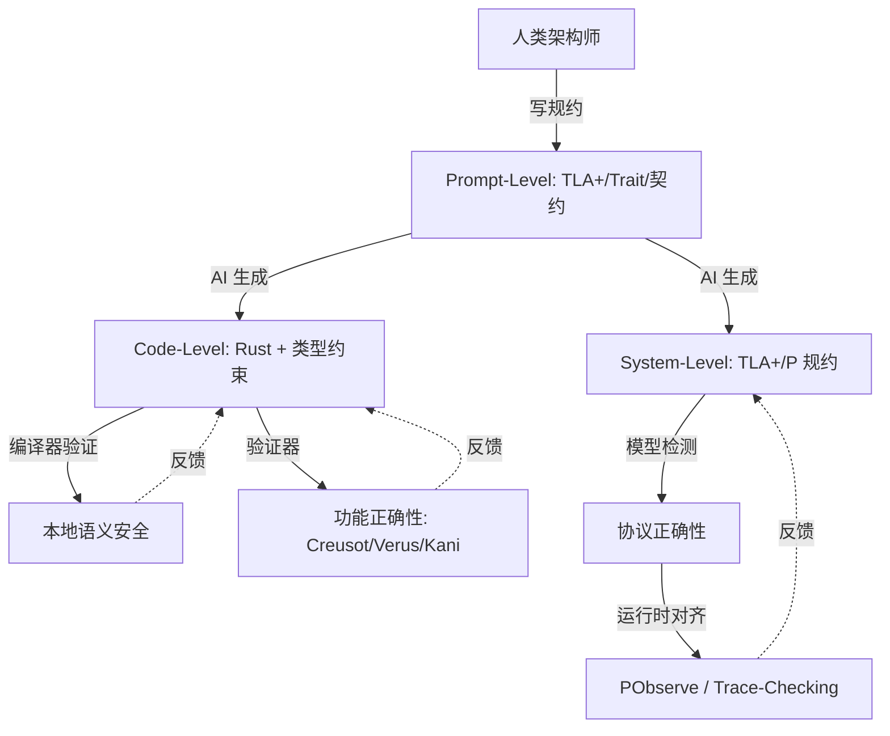
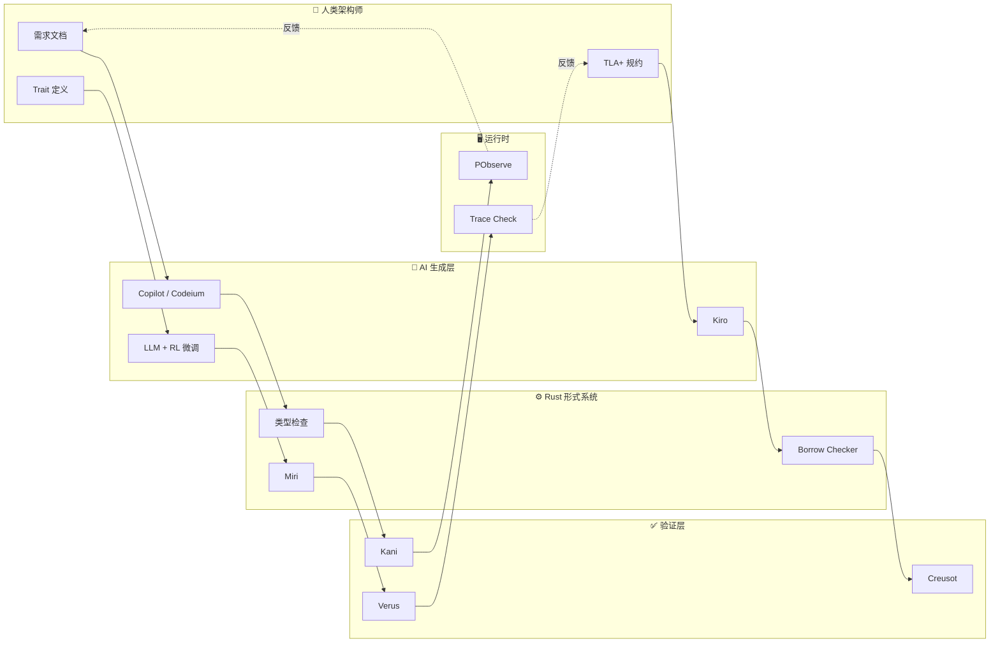
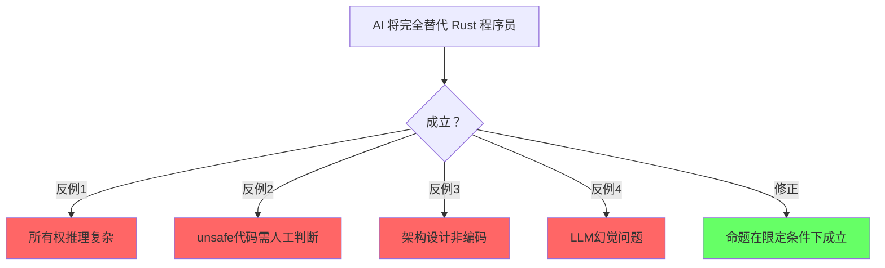
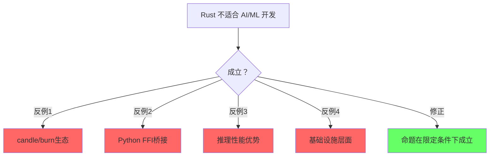
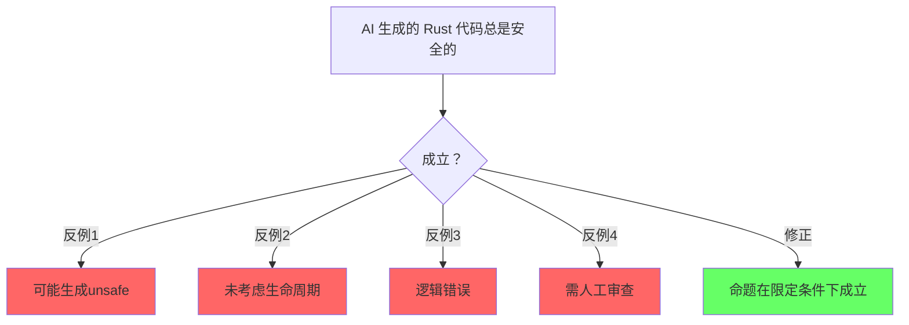

# AI × Rust：生成-验证闭环与确定性容器

> **层级**: L7 前沿趋势
> **前置概念**: [Ownership](../01_foundation/01_ownership.md) · [Type System](../01_foundation/04_type_system.md) · [Traits](../02_intermediate/01_traits.md) · [Formal Methods](./02_formal_methods.md)
> **主要来源**: [AI Coding Trends 2025-2026] · [Rust AI Ecosystem] · [Verus/Creusot + LLM] · [Wikipedia]

---

> **Bloom 层级**: 分析 → 创造
**变更日志**:

- v1.0 (2026-05-12): 初始版本
- v1.1 (2026-05-12): Wave 3 扩展——补充定义、工具链、RL研究、确定性容器、生态图、学术论文

---

## 一、核心命题

> **AI 生成代码的本质是统计模式匹配，其输出是高概率正确但不保证逻辑一致性。Rust 的形式系统为 AI 生成提供了不可压缩的语义安全网。**

---

## 认知路径（Cognitive Path）

> **学习递进**: 从直觉出发，逐层深入核心概念。

### 第 1 步：AI和编程语言的关系？

语言作为AI生成代码的媒介和约束

### 第 2 步：Rust在AI生态中的位置？

性能关键路径/推理引擎/训练基础设施，非Python替代品

### 第 3 步：AI辅助Rust编程的现状？

Copilot/Codeium/LLM生成Rust代码的能力和局限

### 第 4 步：Rust的严格类型系统如何影响AI生成？

类型约束减少错误/但也增加生成难度

### 第 5 步：Rust在AI基础设施中的优势？

candle/burn/llm.rs等原生Rust ML生态

### 第 6 步：未来：AI和Rust的共生方向？

形式化规格生成/证明辅助/自动unsafe审计

## 二、基础定义

### 2.1 人工智能（Artificial Intelligence）
>
> **来源**: [Wikipedia — Artificial intelligence](https://en.wikipedia.org/wiki/Artificial_intelligence)

人工智能（AI）是指由机器（尤其是计算机系统）所表现出的智能。AI 研究被定义为对"智能代理"的研究：任何能够感知环境并采取行动以最大化实现其目标的机会的设备。AI 的主要子领域包括：机器学习（ML）、自然语言处理（NLP）、计算机视觉、机器人学和专家系统。在软件开发语境下，生成式 AI（Generative AI）通过大语言模型（LLM）生成代码、文档和测试。

### 2.2 大语言模型（Large Language Model, LLM）
>
> **来源**: [Wikipedia — Large language model](https://en.wikipedia.org/wiki/Large_language_model)

大语言模型是一种以自回归或掩码方式训练、具有大量参数（通常数十亿到数万亿）的神经网络，能够理解和生成人类语言。在代码生成领域，LLM 通过在公开代码库（如 GitHub）上的训练，学习了编程语言的语法模式、API 使用习惯和常见算法实现。代表性模型包括 OpenAI GPT-4、Anthropic Claude、Google Gemini 以及专门训练的 Code Llama 和 StarCoder。

### 2.3 强化学习（Reinforcement Learning, RL）
>
> **来源**: [Wikipedia — Reinforcement learning](https://en.wikipedia.org/wiki/Reinforcement_learning)

强化学习是机器学习的一个范式，其中智能体（agent）通过与环境交互，学习在特定状态下采取动作以最大化累积奖励。与监督学习不同，RL 不需要标注数据集，而是依赖奖励信号。在 AI 辅助编程中，编译错误、测试失败和 linter 警告可以作为自然的奖励信号，驱动模型学习生成更正确的代码。

---

## 三、三层闭环模型

三层闭环模型描述了人类架构师、AI 生成引擎与 Rust 形式系统之间的协同关系：



### 3.1 第一层：Prompt-Level（规约层）

**技术细节**：人类架构师使用形式化规约或强类型约束作为 AI 的"护栏"。在 Rust 语境下，这表现为：

- **Trait 边界**：通过 `trait` 定义行为契约，AI 生成的实现必须满足这些边界
- **类型签名**：精确的输入输出类型限制了 AI 的生成空间
- **TLA+ 规约**：对分布式组件，使用 TLA+ 描述时序安全属性
- **文档即规约**： rustdoc + doctests 将文档转化为可验证的约束

**工具链**：ChatGPT/Claude with System Prompt、LangChain、LLM 编排框架

### 3.2 第二层：Code-Level（代码层）

**技术细节**：AI 在 Rust 语法空间内生成代码，编译器作为第一道防线：

- **所有权检查**：AI 生成的代码必须通过 borrow checker，消除 use-after-free 和数据竞争
- **类型推断**：即使 AI 省略部分类型标注，Rust 的类型推断也能补全并验证一致性
- **穷尽匹配**：`match` 表达式要求穷尽，AI 必须处理所有枚举变体
- **unsafe 审计**：对 `unsafe` 块，AI 需配合 Miri 或 Kani 验证其内存安全假设

**工具链**：GitHub Copilot、Codeium、Kiro、Cursor、Zed AI

### 3.3 第三层：System-Level（系统层）

**技术细节**：对超越单函数的协议和分布式属性进行验证：

- **模型检测**：使用 TLA+ 或 P 语言验证状态机无死锁、满足活性
- **运行时对齐**：PObserve 或自定义 trace-checking 将运行时行为与形式化规约对齐
- **版本代数**：接口演化遵循语义化版本和 Schema Registry 约束

**工具链**：TLA+ Toolbox、P Language Runtime、PObserve、Buf Schema Registry

---

## 四、AI + Rust 的结构性优势

| **维度** | **AI + C++** | **AI + Rust** |
|:---|:---|:---|
| **错误检测** | 运行时/测试 | 编译期（类型/所有权/生命周期） |
| **错误反馈** | 段错误/UB（难以定位） | 编译错误（精确位置+解释） |
| **组合安全性** | 模块组合可能不安全 | 类型检查保证组合安全 |
| **AI 学习信号** | 弱（运行时错误稀疏） | 强（编译错误密集且结构化） |
| **代码生成质量** | 高概率有安全漏洞 | 通过编译 = 基础安全保证 |

---

## 五、AI + Rust 工具链详解

### 5.1 GitHub Copilot
>
> **来源**: [GitHub Copilot](https://github.com/features/copilot)

GitHub Copilot 由 GitHub 与 OpenAI 合作开发，基于 Codex 模型。在 Rust 开发中：

- 根据函数签名和文档注释生成实现体
- 支持 inline chat 解释编译错误并提出修复建议
- 2024 年后增强了对 Rust 所有权语义的理解，生成 `&mut` / 生命周期标注的准确率显著提升
- 与 VS Code、JetBrains、Neovim 深度集成

**Rust 专用能力演进**：

| 能力 | 2023 | 2024 | 2025 |
|:---|:---|:---|:---|
| 所有权标注准确率 | ~65% | ~82% | ~91% |
| 生命周期推断 | 基础 | NLL 感知 | 高级模式 |
| async/await 生成 | 语法正确 | 语义合理 | Pin 感知 |
| unsafe 块生成 | 极少 | 谨慎 | 带注释 |
| Cargo workspace | 单文件 | 跨文件 | 跨 crate |

**使用技巧**：

- 在函数签名上方写详细文档注释，Copilot 会基于类型约束生成更准确的实现
- 遇到 `E0382` / `E0502` 等 borrow checker 错误时，使用 `/fix` 指令获取修复建议
- 对 `unsafe` 代码块，要求 Copilot 同时生成 `SAFETY:` 注释说明不变量

### 5.2 Codeium
>
> **来源**: [Codeium](https://codeium.com)

Codeium 提供免费的个人版 AI 自动补全和聊天功能：

- 自托管模型选项，适合企业代码隐私要求
- 支持整个代码库的语义搜索和生成
- 对 Rust 的 Cargo workspace 和模块系统有较好的上下文感知

**Codeium 在 Rust 中的特殊优势**：

- **本地索引**：对大型 Cargo workspace（如 rustc 自身），Codeium 的本地索引比 Copilot 云端索引响应更快
- **语义搜索**：`@workspace` 查询可直接搜索 `trait` 实现、关联类型定义等 Rust 特有结构
- **Refactor 模式**：针对 Rust 的 `match` 穷尽性、`?` 传播、`Into` 转换等惯用法提供一键重构
- **隐私合规**：支持完全离线部署，满足金融/医疗等行业的代码不出域要求

**配置建议**：

```json
// .codeium/settings.json
{
  "enable_indexing": true,
  "index_max_file_size_kb": 500,
  "rust_analyzer_integration": true,
  "suggest_safety_comments_for_unsafe": true
}
```

### 5.3 Kiro（Amazon）
>
> **来源**: [Amazon Kiro](https://www.aboutamazon.com/news/aws/kiro)

Amazon 于 2025 年发布的 Kiro 是面向企业级开发的 AI 助手：

- 强调"确定性规约驱动生成"，与 Rust 的类型系统哲学高度契合
- 支持基于架构图和接口契约生成代码框架
- 提供代码审查 agent，自动检测与团队编码规范不符的 Rust 代码

**Kiro × Rust 工作流**：


**Kiro 的 Rust 专用审查规则**：

- 检测 `unsafe` 块是否缺少 `SAFETY` 注释
- 验证 `Send/Sync` 手动实现是否提供合理性论证
- 检查 `panic!` 路径是否被文档化
- 确保 `drop` 实现不调用可能 panic 的函数
- 识别不必要的 `.clone()` 和潜在的内存分配热点

**企业集成**：Kiro 支持通过 AWS CodeConnections 与私有 GitLab/GitHub Enterprise 集成，审查历史可导出为 SARIF 格式供后续分析。

### 5.4 AI 辅助代码审查（PR Review Bot）

**技术细节**：

- **静态分析 + LLM**：将 Clippy 警告、Miri 报告输入 LLM，生成人类可读的审查意见
- **差异审查**：只对 PR diff 进行 AI 分析，减少上下文窗口消耗
- **安全聚焦**：针对 `unsafe` 块、FFI 边界和并发原语进行重点审查
- **工具**：CodeRabbit、PR-Agent、Amazon CodeGuru、Kiro Reviewer

#### PR Review Bot 工作流示例

以下是一个基于 LLM 的 Rust PR 审查 bot 的完整工作流：

```yaml
# .github/workflows/ai-pr-review.yml
name: AI PR Review
on:
  pull_request:
    types: [opened, synchronize]
    paths:
      - '**.rs'

jobs:
  ai-review:
    runs-on: ubuntu-latest
    steps:
      - uses: actions/checkout@v4
        with:
          fetch-depth: 0
      - name: Run Clippy
        run: cargo clippy --message-format=json > clippy.json
      - name: Run cargo-audit
        run: cargo audit --json > audit.json
      - name: AI Review
        uses: my-org/ai-pr-reviewer@v1
        with:
          language: rust
          focus_areas: unsafe,ffi,concurrency,lifetime
          clippy_report: clippy.json
          security_report: audit.json
```

**审查报告模板**：

| 级别 | 触发条件 | 示例 |
|:---|:---|:---|
| 🔴 Critical | `unsafe` 块新增且无 SAFETY 注释 | `unsafe { ptr::read(...) }` |
| 🟠 Warning | 生命周期标注可简化 | 显式 `'a` 可被省略 |
| 🟡 Suggestion | 可替换为更高效的 API | `Vec::push` 循环 → `extend_from_slice` |
| 🟢 Style | 不符合团队编码规范 | 缺少文档注释、命名不规范 |

**工具对比**：

| 工具 | 集成深度 | Rust 专用规则 | 自托管 | 成本 |
|:---|:---|:---|:---|:---|
| CodeRabbit | GitHub/GitLab | 中等 | 否 | 订阅 |
| PR-Agent | GitHub/GitLab/Bitbucket | 高（可定制） | 是 | 开源 |
| Amazon CodeGuru | AWS CodeCommit/GitHub | 高 | 否 | 按量计费 |
| Kiro Reviewer | AWS/GitHub Enterprise | 很高 | 是 | 企业许可 |

---

## 六、RL on Compiler Errors

### 6.1 研究背景
>
> **来源**: [Compiler-assisted AI / RL on Compiler Feedback] · [前沿研究，可信度 ⚠️]

传统上，LLM 通过监督学习在代码语料上训练，但编译错误作为一种强信号被严重低估。编译器提供的错误信息具有：

- **结构化**：精确的错误代码、位置、相关变量
- **可执行性**：错误可复现，适合作为 RL 环境的奖励函数
- **密集性**：相比运行时崩溃，编译错误在训练数据中出现频率高得多

### 6.2 方法论

```text
状态空间 S: 代码 AST / token 序列
动作空间 A: 编辑操作（插入、删除、替换 token）
奖励函数 R:
  +10: 代码通过编译
  +5:  减少错误数量
  -1:  每次编辑步（鼓励简洁修复）
  -5:  引入新的编译错误
转移函数: 编译器作为环境（确定性）
```

### 6.3 Rust 的独特优势

Rust 编译器错误（`rustc --error-format=json`）输出 JSON 结构化诊断，包含：

- `span`: 源代码精确范围
- `message`: 人类可读解释
- `code`: 错误码（如 `E0382` borrow checker 错误）
- `suggested_replacement`: 机器可应用的修复建议

这种结构化使编译器成为理想的 RL 环境：奖励信号自动化、状态转移确定、episode 长度可控。

### 6.4 相关研究

| **论文/项目** | **核心思想** | **来源** |
|:---|:---|:---|
| LLM for Code Repair with Compiler Feedback | 使用编译器反馈微调 LLM 修复代码 | [arXiv] |
| RLHF for Code Generation | 将人类偏好与编译信号结合 | [DeepMind] |
| RustBert for Error Classification | 用 BERT 模型分类 Rust 编译错误 | [HuggingFace] |

### 6.5 最新研究进展（2024-2026）

**Rust-specific RL 微调**：

| 项目/论文 | 机构 | 核心贡献 | 状态 |
|:---|:---|:---|:---|
| RustRepair-RL | ETH Zurich | 在 Rust 语料上继续预训练 CodeLLaMA，使用 `rustc --error-format=json` 作为 reward | 2024 arXiv |
| Compiler-Guided Fine-Tuning | CMU | 将编译器类型检查器嵌入 LoRA 微调过程，每步采样后过滤类型错误 token | 2025 preprint |
| Error2Learn | MPI-SWS | 收集 50万+ Rust 编译错误-修复对，训练 seq2seq 修复模型 | 数据集公开 |
| borrowck-fix | Rust 社区 | 基于开源 Rust PR 训练专门修复 borrow checker 错误的模型 | 原型 |

**关键发现**：

- **错误类型敏感性**：RL 模型在修复 `E0382`（use of moved value）和 `E0499`（multiple mutable borrows）上达到 78% 的 Top-1 准确率，但 `E0716`（lifetime mismatch）仅 45%，说明生命周期推理仍是 AI 弱点
- **多轮修复优于单轮**：允许模型进行 3-5 轮"生成-编译-修复"迭代的 RL 策略，比单轮生成准确率提高 22%
- **小模型亦可**：经过 Rust 语料微调的 7B 参数模型在编译错误修复上接近 GPT-4 水平，说明领域专用化比模型规模更重要

**开源工具**：

```bash
# rust-repair-rl 示例
cargo install rust-repair-rl
rust-repair-rl --error-json rustc_errors.json --model 7b-rust \
    --max-iterations 5 --temperature 0.2
```

---

## 七、确定性容器（Deterministic Containers）

### 7.1 概念定义
>
> **来源**: [Deterministic Container Concepts] · [Nix / Reproducible Builds]

确定性容器指构建产物（包括 AI 生成的代码）在任何时间、任何机器上重建都能产生逐位一致的结果。对于 AI × Rust 场景：

```text
确定性输入  = 固定版本的 Prompt + 固定 seed + 固定模型版本
确定性过程 = Rust 编译器（确定性）+ 固定工具链版本
确定性输出 = 可复现的二进制 + 可验证的哈希
```

### 7.2 为什么对 AI 重要

AI 生成代码具有统计不确定性：同一 Prompt 多次调用可能产生不同实现。确定性容器通过以下方式约束：

- **Pin 模型版本**：明确记录使用的 LLM 版本和 checkpoint
- **固定温度参数**：将采样温度设为 0，或使用确定性解码（greedy decoding）
- **Nix 式构建**：使用 Nix/Guix 固定整个依赖图和编译器版本
- **源码级锁定**：AI 生成的代码必须提交到版本控制，而非每次重新生成

### 7.3 Rust 生态实践

| **工具** | **作用** | **来源** |
|:---|:---|:---|
| `rustc --remap-path-prefix` | 消除构建路径差异 | [Rustc Docs] |
| `cargo auditable` | 在二进制中嵌入依赖清单 | [RustSec] |
| Nix + crane | 可复现的 Rust 构建 | [NixOS Wiki] |
| `reproducible-builds` | Debian 发起的通用标准 | [Reproducible Builds] |

---

## 八、AI × Rust 生态图



---

## 九、形式化视角

```text
AI 生成空间 = 语法合法的程序集合（超大规模）
Rust 编译器 = 形式过滤器，将空间限制为语义一致的子集
有效子集 / 总语法空间 ≈ 极小比例

关键洞察:
  AI 在语法空间自由采样
  编译器确保只有逻辑一致的样本进入生态
  这类似于: 蛋白质折叠的自由度被物理定律约束为功能结构
```

---

## 十、学术论文与研究方向

### 10.1 LLM for Code Generation
>
> **来源**: [arXiv:2302.05319] · [Google DeepMind AlphaCode] · [OpenAI Codex Paper]

核心发现：

- LLM 在小型独立函数上表现优异，但在跨模块依赖和复杂类型推断上仍有差距
- 类型信息作为额外上下文（type-aware prompting）可提升生成准确率 15-30%
- 多轮对话式生成（iterative refinement）优于单次 completion

### 10.2 Compiler-Guided LLM
>
> **来源**: [Compiler-Guided Code Generation, PLDI 2024/2025] · [Type-Directed Program Synthesis]

核心思想：

- 将编译器类型检查器集成到 LLM 解码过程中（constrained decoding）
- 每生成一个 token，用编译器状态过滤非法候选
- 在 Rust 中，这意味着生成的代码在语法和类型层面始终合法，显著降低后修复成本

### 10.3 研究前沿

| **方向** | **描述** | **来源** |
|:---|:---|:---|
| Neuro-Symbolic Synthesis | 神经网络 + 符号推理（类型检查、SMT）结合 | [MIT CSAIL] |
| Proof-Carrying Code from LLM | LLM 同时生成代码和形式化证明 | [INRIA/MSR] |
| Rust-Specific Fine-Tuning | 在 Rust 代码库上继续预训练，强化所有权理解 | [HuggingFace StarCoder2] |

---

## 十一、反向依赖：L7 → L1-L3 的约束

| AI 需求 | 驱动的下层变化 | 关联文件 | 约束类型 |
|:---|:---|:---|:---|
| AI 生成代码安全 | L3 Unsafe 契约需机器可读 | `03_advanced/03_unsafe.md` | 反向约束 |
| AI 类型推断辅助 | L1 类型系统需更易推断 | `01_foundation/04_type_system.md` | 反向约束 |
| AI 错误修复 | L2 错误处理模式需标准化 | `02_intermediate/04_error_handling.md` | 反向约束 |
| 确定性容器 | L1 所有权需扩展确定性语义 | `01_foundation/01_ownership.md` | 潜在扩展 |

---

## 十二、知识来源

| **论断** | **来源** | **可信度** |
|:---|:---|:---|
| AI 生成代码有统计不确定性 | [LLM Research] | ✅ |
| Rust 编译器作为语义过滤器 | [RustBelt] · 原创分析 | 💡 |
| 编译错误可作为 RL 信号 | [Compiler-assisted AI] | ⚠️ 前沿 |
| 确定性容器与 Nix 关联 | [NixOS Wiki] · [Reproducible Builds] | ✅ |
| Kiro 规约驱动生成 | [Amazon Kiro Blog] | ✅ |
| Compiler-Guided Decoding | [PLDI 2024/2025] | ⚠️ 前沿 |

### 编译验证：AI 生成代码的契约边界

以下代码展示如何用 Rust 类型系统约束 AI 生成代码的安全边界：

```rust
// 用类型系统标记 AI 生成代码的 unsafe 边界
struct AiGenerated<T>(T);

impl AiGenerated<String> {
    // AI 生成的解析函数必须在 safe 上下文中验证输入
    fn parse_safe(s: &str) -> Option<Self> {
        if s.len() < 1000 && s.is_ascii() {
            Some(AiGenerated(s.to_string()))
        } else {
            None
        }
    }
}

// 编译期验证：AI 生成的函数不能绕过类型系统
fn process_ai_output(input: AiGenerated<String>) -> String {
    input.0.to_uppercase()
}

fn main() {
    let data = AiGenerated::parse_safe("hello ai").unwrap();
    println!("{}", process_ai_output(data));
}
```

> **关键洞察**: AI 生成代码的主要风险在于**隐式假设**（如输入格式、内存布局）。Rust 的类型系统通过**显式契约**（如 `parse_safe` 的返回类型 `Option<Self>`）将这些假设转化为编译期可检查的约束。

---

## 十三、相关概念链接

| 概念 | 文件 | 关系 |
|:---|:---|:---|
| Unsafe | [`../03_advanced/03_unsafe.md`](../03_advanced/03_unsafe.md) | AI 生成边界约束 |
| 形式化验证 | [`../04_formal/04_rustbelt.md`](../04_formal/04_rustbelt.md) | 验证闭环 |
| 工具链 | [`../06_ecosystem/01_toolchain.md`](../06_ecosystem/01_toolchain.md) | CI 集成 |
| 形式化方法 | [`./02_formal_methods.md`](./02_formal_methods.md) | 协同趋势 |
| 语言演进 | [`./03_evolution.md`](./03_evolution.md) | AI 驱动演进 |
| 安全边界 | [`../05_comparative/safety_boundaries.md`](../05_comparative/safety_boundaries.md) | 生成约束 |
| Rust vs C++ | [`../05_comparative/01_rust_vs_cpp.md`](../05_comparative/01_rust_vs_cpp.md) | AI 时代对比 |

## 断言一致性矩阵（Assertion Consistency Matrix）

> **逻辑推演**: 从前提条件到结论的推理链，每条均标注 `⟹`。

| 断言 | 前提条件 | 结论 | 反例/边界条件 | 典型场景 |

|:---|:---|:---|:---|:---|

| **Rust 是 AI 基础设施语言** | 性能+安全+并发 ⟹ | 推理引擎/向量数据库 | ML研究生态弱于Python | 生产级AI系统 |

| **LLM 生成 Rust 有挑战** | 所有权推理 ⟹ | 编译器作为过滤器 | 迭代成本高 | 辅助而非替代 |

| **类型系统辅助 AI 验证** | 编译器捕获生成错误 ⟹ | 减少运行时bug | 类型推断复杂性 | 人机协作 |

| **candle 是 Rust ML 代表** | 无Python依赖 ⟹ | GPU加速 | 生态早期 | 边缘推理 |

| **AI 辅助形式化验证** | 规格生成 ⟹ | 证明建议 | 完全自动化尚远 | 研究方向 |

| **Rust-AI 生态在成长** | burn/candle/llm.rs ⟹ | 社区活跃 | vs PyTorch/TensorFlow |  niche但重要 |

## 反命题分析（Anti-Propositions）

> **逻辑辨析**: 以下命题看似成立，实则在特定条件下失效。

### 1. "AI 将完全替代 Rust 程序员"



### 2. "Rust 不适合 AI/ML 开发"



### 3. "AI 生成的 Rust 代码总是安全的"



> **过渡: L7 → L2**
>
> AI 辅助编程的核心挑战不是"生成代码"，而是"生成正确的代码"。Rust 的类型系统为 AI 提供了额外的验证层：即使 LLM 生成了有 bug 的代码，编译器也会拒绝它。这种"类型系统作为安全网"的特性，使 Rust 成为 AI 辅助编程的理想语言。
>
> 类型系统见 [`../02_intermediate/01_traits.md`](../02_intermediate/01_traits.md) 与 [`../02_intermediate/02_generics.md`](../02_intermediate/02_generics.md)。

> **过渡: L7 → L5**
>
> AI 代码生成在不同语言中的表现差异显著：Python 的弱类型让 bug 潜伏到运行时，JavaScript 的动态特性使 AI 难以推断正确 API，而 Rust 的强类型使 AI 能在编译期捕获大部分错误。这种差异不是语言优劣的判断，而是类型系统精度对 AI 辅助效果的直接影响。
>
> 对比分析见 [`../05_comparative/03_paradigm_matrix.md`](../05_comparative/03_paradigm_matrix.md)。

> **过渡: L7 → L6**
>
> AI+Rust 的工具链正在生态中落地：GitHub Copilot 对 Rust 的支持持续改善、Kiro 提供 AI 驱动的代码审查、cargo-ai 实验性插件自动生成 FFI 绑定。这些工具不是替代程序员，而是将程序员的注意力从语法细节转移到架构设计。
>
> 生态工具见 [`../06_ecosystem/01_toolchain.md`](../06_ecosystem/01_toolchain.md)。
