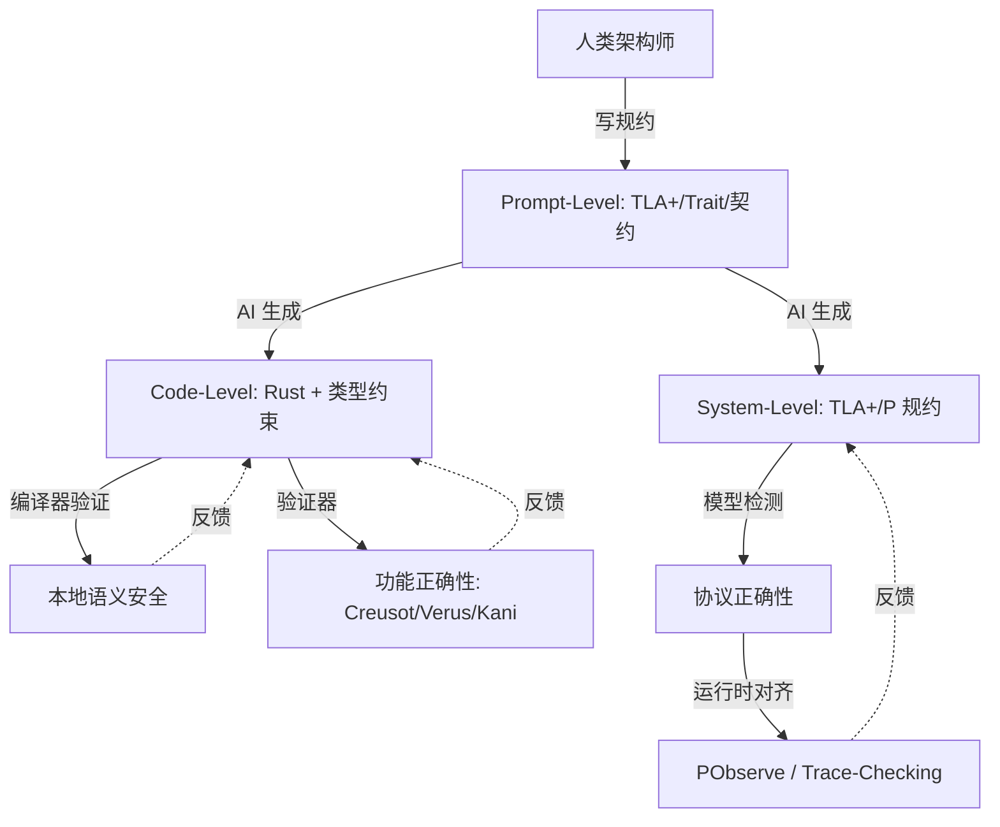

# AI × Rust：生成-验证闭环与确定性容器

> **层级**: L7 前沿趋势
> **前置概念**: [Ownership](../01_foundation/01_ownership.md) · [Type System](../01_foundation/04_type_system.md) · [Traits](./02_intermediate/01_traits.md) · [Formal Methods](./02_formal_methods.md)
> **主要来源**: [AI Coding Trends 2025-2026] · [Rust AI Ecosystem] · [Verus/Creusot + LLM]

---

**变更日志**:

- v1.0 (2026-05-12): 初始版本

---

## 一、核心命题

> **AI 生成代码的本质是统计模式匹配，其输出是高概率正确但不保证逻辑一致性。Rust 的形式系统为 AI 生成提供了不可压缩的语义安全网。**

---

## 二、三层闭环模型



---

## 三、AI + Rust 的结构性优势

| **维度** | **AI + C++** | **AI + Rust** |
|:---|:---|:---|
| **错误检测** | 运行时/测试 | 编译期（类型/所有权/生命周期） |
| **错误反馈** | 段错误/UB（难以定位） | 编译错误（精确位置+解释） |
| **组合安全性** | 模块组合可能不安全 | 类型检查保证组合安全 |
| **AI 学习信号** | 弱（运行时错误稀疏） | 强（编译错误密集且结构化） |
| **代码生成质量** | 高概率有安全漏洞 | 通过编译 = 基础安全保证 |

---

## 四、形式化视角

```text
AI 生成空间 = 语法合法的程序集合（超大规模）
Rust 编译器 = 形式过滤器，将空间限制为语义一致的子集
有效子集 / 总语法空间 ≈ 极小比例

关键洞察:
  AI 在语法空间自由采样
  编译器确保只有逻辑一致的样本进入生态
  这类似于: 蛋白质折叠的自由度被物理定律约束为功能结构
```

---

## 五、知识来源

| **论断** | **来源** | **可信度** |
|:---|:---|:---|
| AI 生成代码有统计不确定性 | [LLM Research] | ✅ |
| Rust 编译器作为语义过滤器 | [RustBelt] · 原创分析 | 💡 |
| 编译错误可作为 RL 信号 | [Compiler-assisted AI] | ⚠️ 前沿 |

---

## 六、待补充

- [ ] **TODO**: 补充具体 AI+Rust 工具（Kiro, Copilot, Codeium）
- [ ] **TODO**: 补充 "RL on compiler errors" 研究
