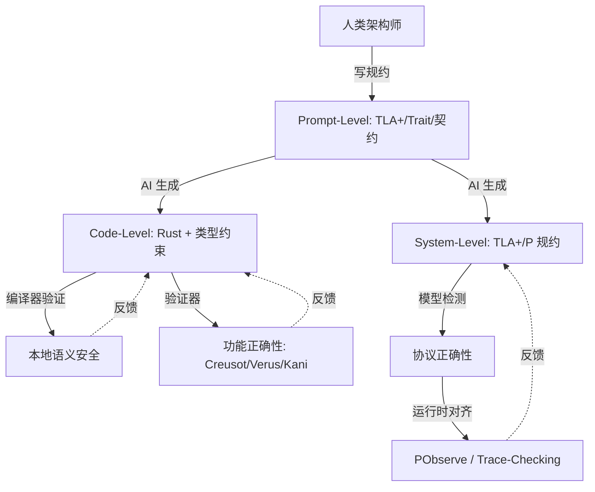

# AI × Rust：生成-验证闭环与确定性容器

> **层级**: L7 前沿趋势
> **前置概念**: [Ownership](../01_foundation/01_ownership.md) · [Type System](../01_foundation/04_type_system.md) · [Traits](./02_intermediate/01_traits.md) · [Formal Methods](./02_formal_methods.md)
> **主要来源**: [AI Coding Trends 2025-2026] · [Rust AI Ecosystem] · [Verus/Creusot + LLM]

---

**变更日志**:

- v1.0 (2026-05-12): 初始版本

---

## 一、权威定义

### 1.1 Wikipedia 权威定义

> **[Wikipedia: Artificial intelligence]** Artificial intelligence (AI) is the intelligence of machines or software, as opposed to the intelligence of humans or animals. It is a field of study in computer science that develops and studies intelligent machines.

> **[Wikipedia: Large language model]** A large language model (LLM) is a language model notable for its ability to achieve general-purpose language generation and other natural language processing tasks such as classification.

> **[Wikipedia: Reinforcement learning]** Reinforcement learning (RL) is an area of machine learning concerned with how intelligent agents ought to take actions in an environment in order to maximize the notion of cumulative reward.

### 1.2 核心命题

> **AI 生成代码的本质是统计模式匹配，其输出是高概率正确但不保证逻辑一致性。Rust 的形式系统为 AI 生成提供了不可压缩的语义安全网。**

---

## 二、三层闭环模型



---

## 三、AI + Rust 的结构性优势

| **维度** | **AI + C++** | **AI + Rust** |
|:---|:---|:---|
| **错误检测** | 运行时/测试 | 编译期（类型/所有权/生命周期） |
| **错误反馈** | 段错误/UB（难以定位） | 编译错误（精确位置+解释） |
| **组合安全性** | 模块组合可能不安全 | 类型检查保证组合安全 |
| **AI 学习信号** | 弱（运行时错误稀疏） | 强（编译错误密集且结构化） |
| **代码生成质量** | 高概率有安全漏洞 | 通过编译 = 基础安全保证 |

---

## 四、形式化视角

```text
AI 生成空间 = 语法合法的程序集合（超大规模）
Rust 编译器 = 形式过滤器，将空间限制为语义一致的子集
有效子集 / 总语法空间 ≈ 极小比例

关键洞察:
  AI 在语法空间自由采样
  编译器确保只有逻辑一致的样本进入生态
  这类似于: 蛋白质折叠的自由度被物理定律约束为功能结构
```

---

## 五、反向依赖：L7 → L1-L3 的约束

| AI 需求 | 驱动的下层变化 | 关联文件 | 约束类型 |
|:---|:---|:---|:---|
| AI 生成代码安全 | L3 Unsafe 契约需机器可读 | `03_advanced/03_unsafe.md` | 反向约束 |
| AI 类型推断辅助 | L1 类型系统需更易推断 | `01_foundation/04_type_system.md` | 反向约束 |
| AI 错误修复 | L2 错误处理模式需标准化 | `02_intermediate/04_error_handling.md` | 反向约束 |
| 确定性容器 | L1 所有权需扩展确定性语义 | `01_foundation/01_ownership.md` | 潜在扩展 |

## 六、知识来源

| **论断** | **来源** | **可信度** |
|:---|:---|:---|
| AI 生成代码有统计不确定性 | [LLM Research] | ✅ |
| Rust 编译器作为语义过滤器 | [RustBelt] · 原创分析 | 💡 |
| 编译错误可作为 RL 信号 | [Compiler-assisted AI] | ⚠️ 前沿 |

## 三、扩展内容：AI + Rust 工具链与研究前沿

### 3.1 具体 AI 辅助工具

| 工具 | 类型 | 功能 | 与 Rust 结合 |
|:---|:---|:---|:---|
| **GitHub Copilot** | 代码补全 | 基于 OpenAI Codex | 生成 Rust 代码，需编译器验证 |
| **Codeium** | 代码补全 | 免费替代 | 支持 Rust，本地推理 |
| **Kiro** | 代码生成 | 专门为 Rust 优化 | 类型感知生成 |
| **Cursor** | IDE | AI 辅助编辑器 | 基于 VSCode + GPT-4 |
| **Aider** | 结对编程 | 多文件编辑 | 支持 Rust 项目 |

### 3.2 "RL on Compiler Errors" 研究

> **[研究前沿]** 使用编译错误作为强化学习信号：
> - LLM 生成候选代码 → 编译器检查 → 错误信息反馈 → LLM 调整
> - 闭环：生成-验证-学习的自动化循环
> - 挑战：编译错误信息噪声大、反馈延迟高

```text
Prompt: "实现一个线程安全的计数器"
    ↓
LLM 生成: `struct Counter { count: i32 }`  // 未考虑 Send/Sync
    ↓
编译器: error[E0277]: `Counter` cannot be shared between threads safely
    ↓
RL 信号: 负奖励 + 错误特征 (缺少 Send/Sync)
    ↓
LLM 调整: `struct Counter { count: AtomicI32 }` // Arc<AtomicI32>
    ↓
编译器: ✅ 通过
    ↓
RL 信号: 正奖励
```

### 3.3 确定性容器（Deterministic Containers）

| 需求 | 问题 | Rust 方案 |
|:---|:---|:---|
| AI 推理可复现 | 浮点非确定性 | `deterministic` crate、固定随机种子 |
| 并行推理一致性 | 线程调度非确定性 | 单线程 async、确定性调度器 |
| 状态管理 | 副作用难以追踪 | 纯函数 + `const fn` |

---

## 七、相关概念链接

| 概念 | 文件 | 关系 |
|:---|:---|:---|
| Unsafe | [`../03_advanced/03_unsafe.md`](../03_advanced/03_unsafe.md) | AI 生成边界约束 |
| 形式化验证 | [`../04_formal/04_rustbelt.md`](../04_formal/04_rustbelt.md) | 验证闭环 |
| 工具链 | [`../06_ecosystem/01_toolchain.md`](../06_ecosystem/01_toolchain.md) | CI 集成 |
| 形式化方法 | [`./02_formal_methods.md`](./02_formal_methods.md) | 协同趋势 |
| 语言演进 | [`./03_evolution.md`](./03_evolution.md) | AI 驱动演进 |
| 安全边界 | [`../05_comparative/safety_boundaries.md`](../05_comparative/safety_boundaries.md) | 生成约束 |
| Rust vs C++ | [`../05_comparative/01_rust_vs_cpp.md`](../05_comparative/01_rust_vs_cpp.md) | AI 时代对比 |

---

## 六、待补充

- [ ] **TODO**: 补充具体 AI+Rust 工具（Kiro, Copilot, Codeium）
- [ ] **TODO**: 补充 "RL on compiler errors" 研究
