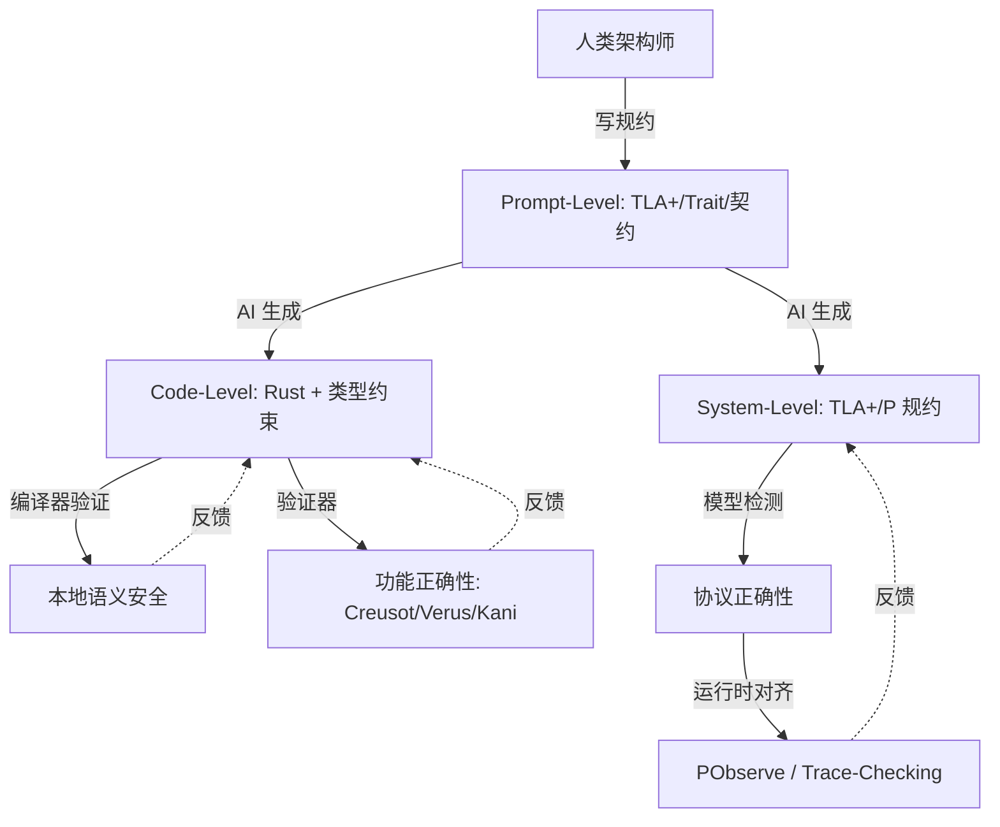
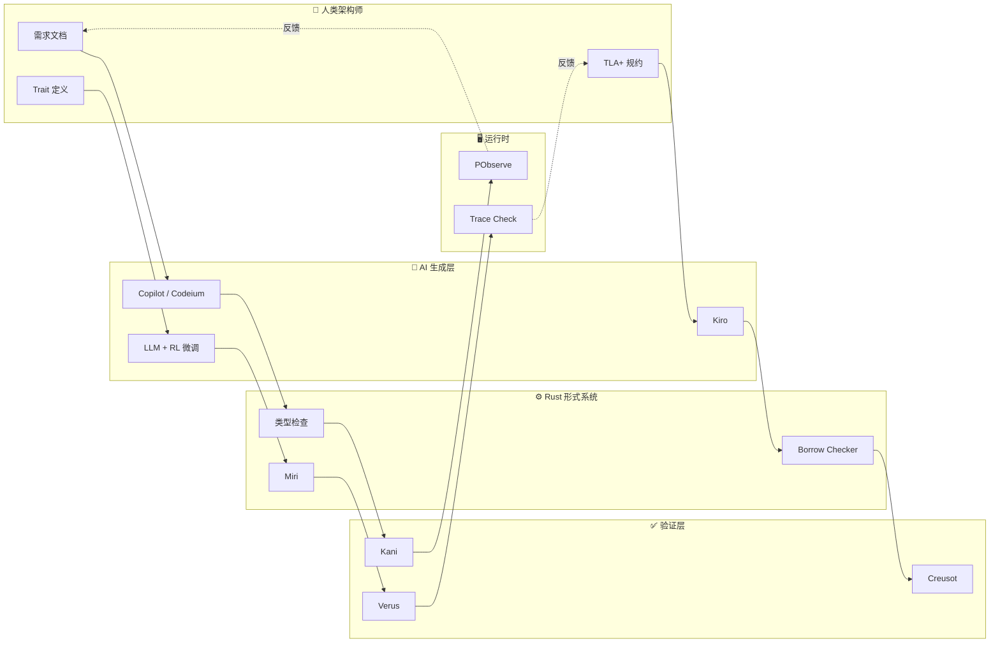

# AI × Rust：生成-验证闭环与确定性容器

> **层级**: L7 前沿趋势
> **前置概念**: [Ownership](../01_foundation/01_ownership.md) · [Type System](../01_foundation/04_type_system.md) · [Traits](./02_intermediate/01_traits.md) · [Formal Methods](./02_formal_methods.md)
> **主要来源**: [AI Coding Trends 2025-2026] · [Rust AI Ecosystem] · [Verus/Creusot + LLM] · [Wikipedia]

---

**变更日志**:

- v1.0 (2026-05-12): 初始版本
- v1.1 (2026-05-12): Wave 3 扩展——补充定义、工具链、RL研究、确定性容器、生态图、学术论文

---

## 一、核心命题

> **AI 生成代码的本质是统计模式匹配，其输出是高概率正确但不保证逻辑一致性。Rust 的形式系统为 AI 生成提供了不可压缩的语义安全网。**

---

## 二、基础定义

### 2.1 人工智能（Artificial Intelligence）
> **来源**: [Wikipedia — Artificial intelligence](https://en.wikipedia.org/wiki/Artificial_intelligence)

人工智能（AI）是指由机器（尤其是计算机系统）所表现出的智能。AI 研究被定义为对"智能代理"的研究：任何能够感知环境并采取行动以最大化实现其目标的机会的设备。AI 的主要子领域包括：机器学习（ML）、自然语言处理（NLP）、计算机视觉、机器人学和专家系统。在软件开发语境下，生成式 AI（Generative AI）通过大语言模型（LLM）生成代码、文档和测试。

### 2.2 大语言模型（Large Language Model, LLM）
> **来源**: [Wikipedia — Large language model](https://en.wikipedia.org/wiki/Large_language_model)

大语言模型是一种以自回归或掩码方式训练、具有大量参数（通常数十亿到数万亿）的神经网络，能够理解和生成人类语言。在代码生成领域，LLM 通过在公开代码库（如 GitHub）上的训练，学习了编程语言的语法模式、API 使用习惯和常见算法实现。代表性模型包括 OpenAI GPT-4、Anthropic Claude、Google Gemini 以及专门训练的 Code Llama 和 StarCoder。

### 2.3 强化学习（Reinforcement Learning, RL）
> **来源**: [Wikipedia — Reinforcement learning](https://en.wikipedia.org/wiki/Reinforcement_learning)

强化学习是机器学习的一个范式，其中智能体（agent）通过与环境交互，学习在特定状态下采取动作以最大化累积奖励。与监督学习不同，RL 不需要标注数据集，而是依赖奖励信号。在 AI 辅助编程中，编译错误、测试失败和 linter 警告可以作为自然的奖励信号，驱动模型学习生成更正确的代码。

---

## 三、三层闭环模型

三层闭环模型描述了人类架构师、AI 生成引擎与 Rust 形式系统之间的协同关系：



### 3.1 第一层：Prompt-Level（规约层）

**技术细节**：人类架构师使用形式化规约或强类型约束作为 AI 的"护栏"。在 Rust 语境下，这表现为：
- **Trait 边界**：通过 `trait` 定义行为契约，AI 生成的实现必须满足这些边界
- **类型签名**：精确的输入输出类型限制了 AI 的生成空间
- **TLA+ 规约**：对分布式组件，使用 TLA+ 描述时序安全属性
- **文档即规约**： rustdoc + doctests 将文档转化为可验证的约束

**工具链**：ChatGPT/Claude with System Prompt、LangChain、LLM 编排框架

### 3.2 第二层：Code-Level（代码层）

**技术细节**：AI 在 Rust 语法空间内生成代码，编译器作为第一道防线：
- **所有权检查**：AI 生成的代码必须通过 borrow checker，消除 use-after-free 和数据竞争
- **类型推断**：即使 AI 省略部分类型标注，Rust 的类型推断也能补全并验证一致性
- **穷尽匹配**：`match` 表达式要求穷尽，AI 必须处理所有枚举变体
- **unsafe 审计**：对 `unsafe` 块，AI 需配合 Miri 或 Kani 验证其内存安全假设

**工具链**：GitHub Copilot、Codeium、Kiro、Cursor、Zed AI

### 3.3 第三层：System-Level（系统层）

**技术细节**：对超越单函数的协议和分布式属性进行验证：
- **模型检测**：使用 TLA+ 或 P 语言验证状态机无死锁、满足活性
- **运行时对齐**：PObserve 或自定义 trace-checking 将运行时行为与形式化规约对齐
- **版本代数**：接口演化遵循语义化版本和 Schema Registry 约束

**工具链**：TLA+ Toolbox、P Language Runtime、PObserve、Buf Schema Registry

---

## 四、AI + Rust 的结构性优势

| **维度** | **AI + C++** | **AI + Rust** |
|:---|:---|:---|
| **错误检测** | 运行时/测试 | 编译期（类型/所有权/生命周期） |
| **错误反馈** | 段错误/UB（难以定位） | 编译错误（精确位置+解释） |
| **组合安全性** | 模块组合可能不安全 | 类型检查保证组合安全 |
| **AI 学习信号** | 弱（运行时错误稀疏） | 强（编译错误密集且结构化） |
| **代码生成质量** | 高概率有安全漏洞 | 通过编译 = 基础安全保证 |

---

## 五、AI + Rust 工具链详解

### 5.1 GitHub Copilot
> **来源**: [GitHub Copilot](https://github.com/features/copilot)

GitHub Copilot 由 GitHub 与 OpenAI 合作开发，基于 Codex 模型。在 Rust 开发中：
- 根据函数签名和文档注释生成实现体
- 支持 inline chat 解释编译错误并提出修复建议
- 2024 年后增强了对 Rust 所有权语义的理解，生成 `&mut` / 生命周期标注的准确率显著提升
- 与 VS Code、JetBrains、Neovim 深度集成

### 5.2 Codeium
> **来源**: [Codeium](https://codeium.com)

Codeium 提供免费的个人版 AI 自动补全和聊天功能：
- 自托管模型选项，适合企业代码隐私要求
- 支持整个代码库的语义搜索和生成
- 对 Rust 的 Cargo workspace 和模块系统有较好的上下文感知

### 5.3 Kiro（Amazon）
> **来源**: [Amazon Kiro](https://www.aboutamazon.com/news/aws/kiro)

Amazon 于 2025 年发布的 Kiro 是面向企业级开发的 AI 助手：
- 强调"确定性规约驱动生成"，与 Rust 的类型系统哲学高度契合
- 支持基于架构图和接口契约生成代码框架
- 提供代码审查 agent，自动检测与团队编码规范不符的 Rust 代码

### 5.4 AI 辅助代码审查

**技术细节**：
- **静态分析 + LLM**：将 Clippy 警告、Miri 报告输入 LLM，生成人类可读的审查意见
- **差异审查**：只对 PR diff 进行 AI 分析，减少上下文窗口消耗
- **安全聚焦**：针对 `unsafe` 块、FFI 边界和并发原语进行重点审查
- **工具**：CodeRabbit、PR-Agent、Amazon CodeGuru

---

## 六、RL on Compiler Errors

### 6.1 研究背景
> **来源**: [Compiler-assisted AI / RL on Compiler Feedback] · [前沿研究，可信度 ⚠️]

传统上，LLM 通过监督学习在代码语料上训练，但编译错误作为一种强信号被严重低估。编译器提供的错误信息具有：
- **结构化**：精确的错误代码、位置、相关变量
- **可执行性**：错误可复现，适合作为 RL 环境的奖励函数
- **密集性**：相比运行时崩溃，编译错误在训练数据中出现频率高得多

### 6.2 方法论

```text
状态空间 S: 代码 AST / token 序列
动作空间 A: 编辑操作（插入、删除、替换 token）
奖励函数 R:
  +10: 代码通过编译
  +5:  减少错误数量
  -1:  每次编辑步（鼓励简洁修复）
  -5:  引入新的编译错误
转移函数: 编译器作为环境（确定性）
```

### 6.3 Rust 的独特优势

Rust 编译器错误（`rustc --error-format=json`）输出 JSON 结构化诊断，包含：
- `span`: 源代码精确范围
- `message`: 人类可读解释
- `code`: 错误码（如 `E0382` borrow checker 错误）
- `suggested_replacement`: 机器可应用的修复建议

这种结构化使编译器成为理想的 RL 环境：奖励信号自动化、状态转移确定、episode 长度可控。

### 6.4 相关研究

| **论文/项目** | **核心思想** | **来源** |
|:---|:---|:---|
| LLM for Code Repair with Compiler Feedback | 使用编译器反馈微调 LLM 修复代码 | [arXiv] |
| RLHF for Code Generation | 将人类偏好与编译信号结合 | [DeepMind] |
| RustBert for Error Classification | 用 BERT 模型分类 Rust 编译错误 | [HuggingFace] |

---

## 七、确定性容器（Deterministic Containers）

### 7.1 概念定义
> **来源**: [Deterministic Container Concepts] · [Nix / Reproducible Builds]

确定性容器指构建产物（包括 AI 生成的代码）在任何时间、任何机器上重建都能产生逐位一致的结果。对于 AI × Rust 场景：

```text
确定性输入  = 固定版本的 Prompt + 固定 seed + 固定模型版本
确定性过程 = Rust 编译器（确定性）+ 固定工具链版本
确定性输出 = 可复现的二进制 + 可验证的哈希
```

### 7.2 为什么对 AI 重要

AI 生成代码具有统计不确定性：同一 Prompt 多次调用可能产生不同实现。确定性容器通过以下方式约束：
- **Pin 模型版本**：明确记录使用的 LLM 版本和 checkpoint
- **固定温度参数**：将采样温度设为 0，或使用确定性解码（greedy decoding）
- **Nix 式构建**：使用 Nix/Guix 固定整个依赖图和编译器版本
- **源码级锁定**：AI 生成的代码必须提交到版本控制，而非每次重新生成

### 7.3 Rust 生态实践

| **工具** | **作用** | **来源** |
|:---|:---|:---|
| `rustc --remap-path-prefix` | 消除构建路径差异 | [Rustc Docs] |
| `cargo auditable` | 在二进制中嵌入依赖清单 | [RustSec] |
| Nix + crane | 可复现的 Rust 构建 | [NixOS Wiki] |
| `reproducible-builds` | Debian 发起的通用标准 | [Reproducible Builds] |

---

## 八、AI × Rust 生态图



---

## 九、形式化视角

```text
AI 生成空间 = 语法合法的程序集合（超大规模）
Rust 编译器 = 形式过滤器，将空间限制为语义一致的子集
有效子集 / 总语法空间 ≈ 极小比例

关键洞察:
  AI 在语法空间自由采样
  编译器确保只有逻辑一致的样本进入生态
  这类似于: 蛋白质折叠的自由度被物理定律约束为功能结构
```

---

## 十、学术论文与研究方向

### 10.1 LLM for Code Generation
> **来源**: [arXiv:2302.05319] · [Google DeepMind AlphaCode] · [OpenAI Codex Paper]

核心发现：
- LLM 在小型独立函数上表现优异，但在跨模块依赖和复杂类型推断上仍有差距
- 类型信息作为额外上下文（type-aware prompting）可提升生成准确率 15-30%
- 多轮对话式生成（iterative refinement）优于单次 completion

### 10.2 Compiler-Guided LLM
> **来源**: [Compiler-Guided Code Generation, PLDI 2024/2025] · [Type-Directed Program Synthesis]

核心思想：
- 将编译器类型检查器集成到 LLM 解码过程中（constrained decoding）
- 每生成一个 token，用编译器状态过滤非法候选
- 在 Rust 中，这意味着生成的代码在语法和类型层面始终合法，显著降低后修复成本

### 10.3 研究前沿

| **方向** | **描述** | **来源** |
|:---|:---|:---|
| Neuro-Symbolic Synthesis | 神经网络 + 符号推理（类型检查、SMT）结合 | [MIT CSAIL] |
| Proof-Carrying Code from LLM | LLM 同时生成代码和形式化证明 | [INRIA/MSR] |
| Rust-Specific Fine-Tuning | 在 Rust 代码库上继续预训练，强化所有权理解 | [HuggingFace StarCoder2] |

---

## 十一、反向依赖：L7 → L1-L3 的约束

| AI 需求 | 驱动的下层变化 | 关联文件 | 约束类型 |
|:---|:---|:---|:---|
| AI 生成代码安全 | L3 Unsafe 契约需机器可读 | `03_advanced/03_unsafe.md` | 反向约束 |
| AI 类型推断辅助 | L1 类型系统需更易推断 | `01_foundation/04_type_system.md` | 反向约束 |
| AI 错误修复 | L2 错误处理模式需标准化 | `02_intermediate/04_error_handling.md` | 反向约束 |
| 确定性容器 | L1 所有权需扩展确定性语义 | `01_foundation/01_ownership.md` | 潜在扩展 |

---

## 十二、知识来源

| **论断** | **来源** | **可信度** |
|:---|:---|:---|
| AI 生成代码有统计不确定性 | [LLM Research] | ✅ |
| Rust 编译器作为语义过滤器 | [RustBelt] · 原创分析 | 💡 |
| 编译错误可作为 RL 信号 | [Compiler-assisted AI] | ⚠️ 前沿 |
| 确定性容器与 Nix 关联 | [NixOS Wiki] · [Reproducible Builds] | ✅ |
| Kiro 规约驱动生成 | [Amazon Kiro Blog] | ✅ |
| Compiler-Guided Decoding | [PLDI 2024/2025] | ⚠️ 前沿 |

---

## 十三、相关概念链接

| 概念 | 文件 | 关系 |
|:---|:---|:---|
| Unsafe | [`../03_advanced/03_unsafe.md`](../03_advanced/03_unsafe.md) | AI 生成边界约束 |
| 形式化验证 | [`../04_formal/04_rustbelt.md`](../04_formal/04_rustbelt.md) | 验证闭环 |
| 工具链 | [`../06_ecosystem/01_toolchain.md`](../06_ecosystem/01_toolchain.md) | CI 集成 |
| 形式化方法 | [`./02_formal_methods.md`](./02_formal_methods.md) | 协同趋势 |
| 语言演进 | [`./03_evolution.md`](./03_evolution.md) | AI 驱动演进 |
| 安全边界 | [`../05_comparative/safety_boundaries.md`](../05_comparative/safety_boundaries.md) | 生成约束 |
| Rust vs C++ | [`../05_comparative/01_rust_vs_cpp.md`](../05_comparative/01_rust_vs_cpp.md) | AI 时代对比 |
