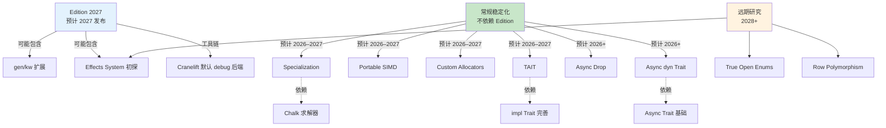
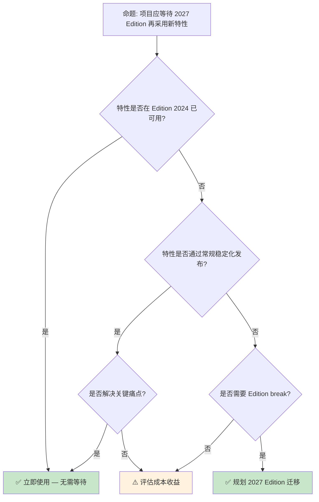

# Rust 2027 Edition 及未来路线图

> **代码状态**: ✅ 含可编译示例
>
> **EN**: Roadmap
> **Summary**: Roadmap: emerging Rust language feature or ecosystem trend.
> **Rust 版本**: 1.97.0+ (Edition 2024)
>
> **受众**: [专家]
> **内容分级**: [综述级]
> **Bloom 层级**: L4-L5
> **权威来源**: 本文件为 `concept/` 权威页。
> **A/S/P 标记**: **S+P** — StructureProcedure
> **双维定位**: C×Eva — 评价 Rust 技术路线图
> **定位**: 分析 Rust **2027 Edition 及更远期**的潜在特性集合——从 gen/kw、特化稳定化、可移植 SIMD、自定义分配器到异步（Async） Trait、TAIT 等前沿议题，评价其技术成熟度与生态影响。
> **前置概念**: [Edition Guide](03_rust_edition_guide.md) · [Version Tracking](../00_version_tracking/01_rust_version_tracking.md) · [Evolution](../04_research_and_experimental/03_evolution.md)
> **后置概念**: [Formal Methods](../04_research_and_experimental/02_formal_methods.md) · [Rust in AI](../04_research_and_experimental/05_rust_in_ai.md)
> **定理链**: N/A — 描述性/综述性/导航性文档，不涉及形式化定理链
---

> ⚠️ **不稳定特性警告**: 本文件包含 `#![feature(...)]` 标注的代码示例，需要 **nightly 工具链** 编译。
>
> **使用方式**: `rustup run nightly rustc ...` 或 `cargo +nightly ...`
> **状态查询**: <https://doc.rust-lang.org/nightly/unstable-book/index.html>
> **注意**: 不稳定特性可能在后续版本中变更或移除，生产代码应避免依赖。

---

> **来源**: [Rust Project Goals](https://rust-lang.github.io/rust-project-goals/) · [Rust Blog](https://blog.rust-lang.org/) · [Rust Roadmap](https://www.rust-lang.org/) · [Brown University — Interactive Rust Book](https://rust-book.cs.brown.edu/) · [Jung et al. — RustBelt: Securing the Foundations of Rust](https://plv.mpi-sws.org/rustbelt/popl18/) · [Itanium C++ ABI](https://itanium-cxx-abi.github.io/cxx-abi/abi.html)
> [Rust Project Goals](https://rust-lang.github.io/rust-project-goals/) ·
> [RFC 3086 — Portable SIMD](https://github.com/rust-lang/rfcs/pull/3086) ·
> [RFC 1398 — Global Allocators](https://github.com/rust-lang/rfcs/pull/1398) ·
> [RFC 3185 — Static Async Traits](https://github.com/rust-lang/rfcs/pull/3185) ·
> [RFC 2515 — Type Alias Impl Trait](https://doc.rust-lang.org/reference/types/impl-trait.html) ·
> [Rust Internals — 2027 Edition Wishlist](https://internals.rust-lang.org/) ·
> [Rust Foundation Roadmap](https://foundation.rust-lang.org/) ·
> [The Rust Programming Language](https://doc.rust-lang.org/book/title-page.html) ·
> [RFC 3516 — gen blocks](https://github.com/rust-lang/rfcs/pull/3516)
> **前置依赖**: [Rust vs C++](../../05_comparative/01_systems_languages/01_rust_vs_cpp.md)
> **前置依赖**: [Toolchain](../../06_ecosystem/00_toolchain/01_toolchain.md)

## 📑 目录
>
>

- [Rust 2027 Edition 及未来路线图](#rust-2027-edition-及未来路线图)
  - [📑 目录](#-目录)
  - [一、核心概念：Edition 2027 的设计空间](#一核心概念edition-2027-的设计空间)
    - [1.1 Edition 演进节奏与政策](#11-edition-演进节奏与政策)
    - [1.2 候选特性概览](#12-候选特性概览)
    - [1.3 特性依赖与 Edition 2027 关联图](#13-特性依赖与-edition-2027-关联图)
  - [二、类型系统前沿](#二类型系统前沿)
    - [2.1 Specialization 稳定化](#21-specialization-稳定化)
    - [2.2 Type Alias Impl Trait (TAIT)](#22-type-alias-impl-trait-tait)
    - [2.3 可移植 SIMD (std::simd)](#23-可移植-simd-stdsimd)
  - [三、异步与执行模型](#三异步与执行模型)
    - [3.1 Async Traits 与静态分发](#31-async-traits-与静态分发)
    - [3.2 Async Drop 与生命周期](#32-async-drop-与生命周期)
    - [3.3 Custom Allocators 稳定化](#33-custom-allocators-稳定化)
  - [四、语言级语法演进](#四语言级语法演进)
    - [4.1 gen/kw：生成器关键字扩展](#41-genkw生成器关键字扩展)
    - [4.2 Open Enums 与可扩展枚举](#42-open-enums-与可扩展枚举)
    - [4.3 Effects System 与关键字泛型](#43-effects-system-与关键字泛型)
  - [五、工具链与生态基础设施](#五工具链与生态基础设施)
    - [5.1 BorrowSanitizer 工业化](#51-borrowsanitizer-工业化)
    - [5.2 Cranelift 后端与编译速度](#52-cranelift-后端与编译速度)
    - [5.3 Rust 规范文档化](#53-rust-规范文档化)
  - [六、反命题与边界分析](#六反命题与边界分析)
    - [6.1 反命题树](#61-反命题树)
    - [6.2 边界极限](#62-边界极限)
  - [七、常见陷阱](#七常见陷阱)
  - [八、来源与延伸阅读](#八来源与延伸阅读)
    - [编译验证示例](#编译验证示例)
  - [相关概念](#相关概念)
  - [权威来源索引](#权威来源索引)
  - [十、边界测试：Rust 路线图的编译错误](#十边界测试rust-路线图的编译错误)
    - [10.1 边界测试：`never_type` (`!`) 的降级与类型推断（编译错误）](#101-边界测试never_type--的降级与类型推断编译错误)
    - [10.2 边界测试：GAT（泛型关联类型）的递归约束（编译错误）](#102-边界测试gat泛型关联类型的递归约束编译错误)
    - [10.6 边界测试：`impl Trait` 在 `let` 绑定中的类型推断限制（编译错误）](#106-边界测试impl-trait-在-let-绑定中的类型推断限制编译错误)
    - [10.5 边界测试：语言特性稳定化的时间预估偏差（工程规划风险）](#105-边界测试语言特性稳定化的时间预估偏差工程规划风险)
    - [10.3 边界测试：nightly 特性在 production 中的不可预测性（编译中断）](#103-边界测试nightly-特性在-production-中的不可预测性编译中断)
  - [嵌入式测验（Embedded Quiz）](#嵌入式测验embedded-quiz)
    - [测验 1：Rust 2026-2028 年的核心发展主题是什么？（理解层）](#测验-1rust-2026-2028-年的核心发展主题是什么理解层)
    - [测验 2：为什么 Rust 将重点从"新特性"转向"成熟度和体验"？（理解层）](#测验-2为什么-rust-将重点从新特性转向成熟度和体验理解层)
    - [测验 3：Rust Project Goals 的制定流程是什么？（理解层）](#测验-3rust-project-goals-的制定流程是什么理解层)
    - [测验 4：`rust-lang/rfcs` 仓库在语言演进中扮演什么角色？（理解层）](#测验-4rust-langrfcs-仓库在语言演进中扮演什么角色理解层)
    - [测验 5：普通 Rust 开发者如何参与语言演进？（理解层）](#测验-5普通-rust-开发者如何参与语言演进理解层)
  - [认知路径](#认知路径)
    - [核心推理链](#核心推理链)

---

## 一、核心概念：Edition 2027 的设计空间

Edition 演进机制的政策框架（截至 2026 的公开信息）：

1. **三年节奏**：2015/2018/2021/2024 四个 Edition 已形成约三年一版的规律；Edition 2027 为自然延续，但 Rust 项目官方政策强调「Edition 仅在积累足够多不兼容改进时才发布」，不承诺固定年份。
2. **不兼容的边界**：Edition 只改变**语法与语义默认值**（如 2024 的 `gen` 保留字、临时值作用域调整），绝不改变已有代码在旧 Edition 下的行为——这是 `edition` Cargo.toml 键实现逐 crate 迁移的根据。
3. **候选特性池**：进入 Edition 的特性需先经 nightly 长期验证；tracking issue 标签 `C-tracking-issue` + edition 里程碑是唯一权威进度来源。

判定依据：评估某特性「何时可用」时，区分稳定化版本（`rustc --version` 可查）与 Edition 绑定（需 Cargo.toml `edition = "2027"`），两者独立。

### 1.1 Edition 演进节奏与政策

```text
Rust Edition 时间线:

  已发布:
  ├── 2015 Edition: 初始稳定版本
  ├── 2018 Edition: NLL, async/await, module 系统简化
  ├── 2021 Edition: 预导入 panic, disjoint capture, IntoIterator for arrays
  └── 2024 Edition: gen blocks, never type (!), RPIT lifetime capture

  计划中:
  └── 2027 Edition: 预计 2027 年发布（每 3 年周期）

  Edition 选择政策:
  ├── 不改变已有代码语义（除非显式切换 Edition）
  ├── 同一编译器支持多 Edition 混编
  ├── 新特性不一定需要新 Edition（大部分通过稳定化流程）
  └── Edition 仅用于需要语法/语义 break 的特性
```

> **认知功能**: **Edition 是 Rust 语言演进的"节奏器"**——每 3 年一次的窗口允许必要的向后不兼容变更，同时保证生态整体连续性。
> [来源: [Rust Edition Guide](https://doc.rust-lang.org/edition-guide/index.html)]

**Rust Foundation 2026–2027 战略重点**：

```text
Foundation 战略支柱:
├── 开发者体验: 编译时间、IDE 响应、错误消息质量
├── 安全与可靠: 形式化验证工具链、安全审计支持
├── 生态可持续性: Crates.io 基础设施、供应链安全
├── 教育与入职: 学习曲线平缓化、文档质量
└── 行业采用: 嵌入式、操作系统、AI/ML 绑定
```

> **Foundation 视角**: 2027 Edition 不仅是语言特性集合，更是**生态成熟度的里程碑**——Foundation 的资源分配直接影响哪些特性获得优先工程支持。
> [来源: [Rust Foundation Roadmap 2026](https://foundation.rust-lang.org/news/)]

---

### 1.2 候选特性概览
>

```text
2027 Edition 及远期候选特性矩阵:

  类型系统:
  ├── Specialization (RFC 1210) — 允许重叠 impl，更特化优先
  ├── TAIT (RFC 2515) — type alias impl trait，命名隐藏类型
  ├── GATs 完善 — 关联类型泛型参数的稳定化后续
  └── Effects / Keyword Generics — 泛化 async/const/unsafe

  异步:
  ├── Async Traits (RFC 3185) — 原生 async fn in trait
  ├── Async Drop — 异步析构语义
  ├── Async Closures — 已稳定 1.85，后续扩展
  └── Gen blocks — 已纳入 2024 Edition，后续 kw 扩展

  系统编程:
  ├── Custom Allocators (RFC 1398) — 全局/每类型自定义分配器
  ├── Portable SIMD (RFC 3086) — std::simd 跨平台向量指令
  ├── Naked Functions — 已稳定 1.88
  └── Unsafe 语义精细化 — unsafe_op_in_unsafe_fn 等

  工具链:
  ├── BorrowSanitizer — 运行时借用检查工业化
  ├── Cranelift 后端 — debug 构建编译加速
  ├── Parallel Frontend — 编译器前端并行化
  └── Rust Specification — 语言规范文档化
```

> **关键洞察**: **并非所有候选特性都需要 Edition 2027**——许多特性通过常规稳定化流程即可发布。Edition 窗口仅用于需要语法 break 或大规模迁移的特性。
> [来源: [Rust Internals — Edition Planning](https://internals.rust-lang.org/)]

### 1.3 特性依赖与 Edition 2027 关联图
>



> **认知功能**: 此图区分三类特性演进路径——**常规稳定化**（不依赖 Edition）、**Edition 2027 候选**（需要语法 break 或生态协调）、**远期研究**（无明确时间表）。虚线表示技术依赖关系。
> [来源: [Rust Reference](https://doc.rust-lang.org/reference/introduction.html)]
> **使用建议**: 技术规划时优先关注"常规稳定化"路径的特性；仅在需要语法 break 时考虑 Edition 2027 窗口。
> [💡 原创分析](../../00_meta/00_framework/methodology.md)

---

## 二、类型系统前沿

类型系统前沿的三个方向共同指向一个主题：**把“编译期已知”的信息边界推得更远**：

- **Specialization 稳定化**: 允许泛型 impl 为特定类型提供更优实现（如 `Vec<T>` 对 `T: Copy` 的批量拷贝优化）；卡在 `min_specialization` 的健全性（soundness）论证上多年，是“理论上清楚、工程上艰难”的典型——稳定化时间表不应写入项目计划。
- **TAIT（Type Alias Impl Trait）**: `type Iter = impl Iterator<Item = u8>;` 让不透明返回类型可命名、可存储，是 `impl Trait` 拼图的最后一块；语义难点（定义用途界定）已基本收敛，是三者中最可期待的近期稳定项。
- **可移植 SIMD（`std::simd`）**: `Simd<T, N>` 抽象跨平台的向量运算，让 SIMD 代码摆脱 `core::arch` 的平台分支；API 形态在 nightly 已可用多年，稳定化阻塞在掩码（mask）类型与 swizzle 接口的定稿。

判定依据：TAIT 可按 1–2 个版本窗口纳入预期；specialization 与 portable SIMD 维持“nightly 可用即用，稳定不计入承诺”的策略。

### 2.1 Specialization 稳定化
>

特化（Specialization）允许为特定类型提供比泛型（Generics）实现更精确的 Trait 实现：

```rust,ignore
// 假设特化已稳定（当前 nightly only）
impl<T: Debug> ToDebug for T {
    default fn to_debug(&self) -> String {
        format!("{:?}", self)
    }
}

impl ToDebug for String {
    fn to_debug(&self) -> String {
        self.clone()  // 更高效的特化实现
    }
}
```

```rust
struct Buffer<T, const N: usize> {
    data: [T; N],
    len: usize,
}

impl<T: Default + Copy, const N: usize> Buffer<T, N> {
    fn new() -> Self {
        Buffer { data: [T::default(); N], len: 0 }
    }
    fn push(&mut self, value: T) {
        if self.len < N {
            self.data[self.len] = value;
            self.len += 1;
        }
    }
    fn get(&self, index: usize) -> Option<&T> {
        self.data.get(index)
    }
}

fn main() {
    let mut buf: Buffer<i32, 4> = Buffer::new();
    buf.push(10);
    buf.push(20);
    println!("{:?}", buf.get(0));
    println!("{:?}", buf.get(1));
}
```

**稳定化障碍**（截至 2026）：

```text
阻塞问题:
├── Lifetime 特化排序 — impl<T> Foo for T vs impl<T> Foo for &T
├── 关联类型投影 soundness — 特化改变关联类型的类型安全
├── Chalk 求解器集成 — 新 Trait 求解器需完全支持特化语义
└── min_specialization 经验 — 标准库内部使用的简化版已积累实践经验
```

> **技术评价**: 特化的稳定化挑战**不在语法，而在类型系统（Type System） soundness**。关联类型与生命周期（Lifetimes）交互的 corner case 是主要阻塞因素。预计 **2027–2028** 完成稳定化。
> [来源: [RFC 1210](https://github.com/rust-lang/rfcs/pull/1210)] · [来源: [Tracking Issue #31844](https://github.com/rust-lang/rust/issues/31844)]

---

### 2.2 Type Alias Impl Trait (TAIT)
>

TAIT 允许在类型别名中命名 `impl Trait` 隐藏的具体类型：

```rust,ignore
// 当前: 返回位置 impl Trait (RPIT)
fn make_iter() -> impl Iterator<Item = i32> {
    vec![1, 2, 3].into_iter()
}

// TAIT 目标: 在类型别名中命名隐藏类型
type MyIter = impl Iterator<Item = i32>;

fn make_iter() -> MyIter {
    vec![1, 2, 3].into_iter()
}

// 用途 1: 递归类型
 type BoxedFuture<T> = impl Future<Output = T>;
 fn recursive() -> BoxedFuture<i32> {
     async { recursive().await }
 }

// 用途 2: 跨模块暴露有限类型信息
```

> **认知功能**: TAIT 填补了 Rust **存在类型（existential types）**的表达能力缺口——允许在模块（Module）/私有边界内命名隐藏类型，同时对外保持抽象。
> [来源: [RFC 2515](https://github.com/rust-lang/rfcs/pull/2515)] · [来源: [Rust Internals — TAIT Status](https://internals.rust-lang.org/)]

**TAIT 与 `type_alias_impl_trait` feature**：

| 维度 | RPIT (稳定) | TAIT (开发中) |
|:---|:---|:---|
| 语法位置 | 函数返回类型 | 类型别名定义 |
| 递归支持 | ❌ 有限 | ✅ 核心用例 |
| 可见性控制 | 函数边界 | 模块（Module）边界 |
| 稳定化预测 | ✅ 已稳定 | 🟡 2026–2027 |

> **来源**: [Rust Reference — Types](https://doc.rust-lang.org/reference/types/impl-trait.html)

---

### 2.3 可移植 SIMD (std::simd)
>

Portable SIMD 提供跨平台向量指令抽象：

```rust
#![feature(portable_simd)]
use std::simd::{Simd, f32x4};

fn vector_add(a: &[f32], b: &[f32], c: &mut [f32]) {
    // 4 元素宽度的 SIMD 向量
    let va = f32x4::from_slice(&a[0..4]);
    let vb = f32x4::from_slice(&b[0..4]);
    let vc = va + vb;  // 单条 SIMD 加法指令
    c[0..4].copy_from_slice(&vc.to_array());
}
```

**工程状态**（2026）：

```text
std::simd 状态:
├── core::simd 已存在于 nightly 多年
├── 主要阻塞: API 设计稳定性（元素宽度、掩码类型、水平操作）
├── 架构覆盖: x86/SSE/AVX, ARM/NEON, WASM SIMD, RISC-V
├── 与 auto-vectorization 的关系: SIMD 显式控制补充而非替代编译器自动向量化
└── 预计稳定: 2026–2027（不依赖 Edition）
```

> **评价**: Portable SIMD 是 Rust **系统编程野心**的关键指标——向 C++ 的 `std::simd` (TS) 和 ISPC 看齐，同时保持零成本抽象（Zero-Cost Abstraction）和类型安全。
> [来源: [RFC 3086](https://github.com/rust-lang/rfcs/pull/3086)] · [来源: [std::simd tracking](https://github.com/rust-lang/rust/issues/86656)]

---

## 三、异步与执行模型

异步执行模型的三个前沿问题：

1. **Async Traits 与静态分派**：`async fn in trait` 稳定后返回 `impl Future`，动态分派需 `trait_variant` 或手装箱；`-> impl Trait` 风格返回类型使 Send 边界依赖调用点上下文，这是「async trait 对象安全」残缺的根源。
2. **Async Drop**：当前 `Drop::drop` 是同步的，异步清理（如 flush 网络缓冲）只能 `block_on` 或显式 `close().await`——Async Drop 的难点是 drop 顺序与取消语义的组合，尚无稳定设计。
3. **Custom Allocators**：`Allocator` API（nightly `allocator_api`）允许集合类型指定分配器，嵌入式/无全局分配器场景的基石；稳定化的阻塞点是 `Box`/`Vec` 的 API 兼容性。

判定依据：这三项同属「运行期资源管理」主题，任一稳定化都会改变 async 库的设计空间，关注 tracking issue 而非二手预测。

### 3.1 Async Traits 与静态分发
>

Rust 1.75 已稳定 `async fn` in trait，但仍有重要限制：

```rust
// Rust 1.75+ 已支持（静态分发）
trait AsyncProcessor {
    async fn process(&self, input: Vec<u8>) -> Result<String, Box<dyn std::error::Error>>;
}

// 剩余限制 1: 不允许 dyn Trait
// fn use_dyn(p: &dyn AsyncProcessor) { ... }  // ❌ 编译错误

// 剩余限制 2: 关联类型中的 impl Future
// trait Stream { async fn next(&mut self) -> Option<Self::Item>; }
// 隐式返回类型无法完全控制 Send 边界
```

**2027 目标**: 完整 `dyn AsyncProcessor` 支持 + Send-bound 控制。

> **技术要点**: `async fn in trait` 的稳定化通过 **RPITIT（Return Position Impl Trait In Traits）** 实现。`dyn` 支持需要解决**对象安全（object safety）**与**异步（Async）状态机大小**问题。
> [来源: [RFC 3185](https://github.com/rust-lang/rfcs/pull/3185)] · [来源: [Rust Blog — Async Fn in Traits](https://blog.rust-lang.org/)]

---

### 3.2 Async Drop 与生命周期
>

Async Drop 解决异步资源清理的核心需求：

```rust,ignore
// 假设的 async drop 语法（研究中）
struct DbConnection { ... }

impl AsyncDrop for DbConnection {
    async fn drop(&mut self) {
        self.flush().await;
        self.close().await;
    }
}

// 当前 workaround: 显式 async cleanup 方法
impl DbConnection {
    async fn close(self) -> Result<()> { ... }
}
// 风险: 用户可能忘记调用 close，导致资源泄漏
```

**设计挑战**:

```text
Async Drop 难题:
├── 调用位置: 变量离开作用域时隐式 await？
├── 死区（drop glue）: 编译器生成的隐式 drop 代码如何处理 async？
├── 恐慌安全: async drop 中 panic 的语义
├── 与 Pin 的交互: 已 Pin 的值 async drop 是否安全
└── 性能: 隐式 await 可能引入意外的执行点
```

> **来源**: [Async Drop Tracking Issue](https://github.com/rust-lang/rust/issues/126534) · [来源: [Rust Internals — Async Drop Design](https://internals.rust-lang.org/)]

---

### 3.3 Custom Allocators 稳定化

自定义分配器允许替换全局或特定类型的内存分配策略：

```rust,ignore
#![feature(allocator_api)]

use std::alloc::{Allocator, GlobalAlloc, Layout, System};

// 全局替换（已稳定 via #[global_allocator]）
#[global_allocator]
static GLOBAL: MyAllocator = MyAllocator;

// 每类型分配器（开发中）
struct ArenaVec<T, A: Allocator = Global> {
    buf: RawVec<T, A>,
}

// 使用特定分配器
let arena = bumpalo::Bump::new();
let vec: Vec<u8, &bumpalo::Bump> = Vec::new_in(&arena);
```

**稳定化路径**:

| 特性 | 状态 | 预计 |
|:---|:---|:---:|
| `#[global_allocator]` | ✅ 稳定 | — |
| `Allocator` trait in std | 🟡 接近稳定 | 2026–2027 |
| `Vec<T, A>` / `Box<T, A>` | 🟡 nightly | 2027+ |
| 默认泛型（Generics）参数 `A = Global` | ✅ 已稳定支持 | — |

> **生态影响**: Custom Allocators 稳定化将**解锁游戏引擎、嵌入式系统、高频交易**等领域的零成本 arena/bump 分配——当前这些场景依赖不稳定的 `allocator_api` 或第三方 hack。
> [来源: [RFC 1398](https://github.com/rust-lang/rfcs/pull/1398)] · [来源: [allocator_api tracking](https://github.com/rust-lang/rust/issues/32838)]

---

## 四、语言级语法演进

语言级语法的三个演进方向都服务于同一目标：**消除“效应维度”导致的 API 重复**：

- **gen/kw：生成器关键字扩展**: `gen fn` 产生产生式迭代器（`Iterator` 的零样板实现），是 `async` 之外的第二个“栈式协程”入口；关键字在 Edition 2024 已预留（`gen` 成为保留字），为后续稳定铺路。
- **Open Enums 与可扩展枚举**: 库作者需要“可添加变体而不破坏下游 `match`”的枚举——`#[non_exhaustive]` 是部分答案，open enums 提案试图给出更系统的语义（含穷尽性检查的版本化规则）。
- **Effects System 与关键字泛型**: `maybe async`、`maybe const` 式的效应泛型，让一个函数体服务多个效应维度（`read`/`read_async`/`read_const` 三合一）；是最具野心也最远期的方向，当前以实验性设计文档形态存在。

判定依据：gen 关键字预留意味着迁移 Edition 2024 时应避免 `gen` 标识符；其余两项仅作趋势跟踪。

### 4.1 gen/kw：生成器关键字扩展

2024 Edition 引入 `gen {}` 块简化生成器语法。远期讨论扩展 `gen` 作为更通用的效果关键字：

```rust,ignore
// Rust 1.95+ (2024 Edition)
let gen = gen {
    yield 1;
    yield 2;
    yield 3;
};

// 远期讨论: gen fn / gen closure
// gen fn count_to(n: i32) -> impl Iterator<Item = i32> {
//     for i in 0..n { yield i; }
// }

// 与 async 的对称性:
// async {}  → 异步块  → Future
// gen {}    → 生成器块 → Iterator
// async gen {} → 异步生成器 → AsyncIterator (Stream)
```

```rust
#![feature(gen_blocks, yield_expr)]

fn main() {
    let numbers = gen {
        yield 1;
        yield 2;
        yield 3;
    };
    let mut sum = 0;
    for n in numbers {
        sum += n;
    }
    println!("sum = {}", sum);
}
```

> **设计哲学**: `gen` 关键字的引入遵循 Rust **语法对称性**原则——`async` 对应 `Future`，`gen` 对应 `Iterator`。远期可能探索 `async gen` 统一异步（Async）流。
> [来源: [RFC 3516](https://github.com/rust-lang/rfcs/pull/3516)] · [来源: [Rust Edition Guide — gen blocks](https://rust-lang.github.io/rfcs//3513-gen-blocks.html)]

---

### 4.2 Open Enums 与可扩展枚举

Rust 当前通过 `#[non_exhaustive]` 实现枚举（Enum）的向后兼容扩展，但**非真正的开放枚举**：

```rust
// 当前: #[non_exhaustive]（编译期契约，运行时封闭）
#[non_exhaustive]
pub enum Event { Click, KeyPress }

// 远期研究: 开放枚举允许跨 crate 扩展变体
// 尚处于早期设计讨论阶段，无 RFC
```

**2027 预期**: `#[non_exhaustive]` 仍然是官方推荐路径。真正的开放枚举（Enum）需要解决**穷尽性检查**与**零成本抽象（Zero-Cost Abstraction）**的根本张力。

> **来源**: [RFC 2008](https://github.com/rust-lang/rfcs/pull/2008) · [来源: [Open Enums Discussion](https://internals.rust-lang.org/)]

---

### 4.3 Effects System 与关键字泛型

Effects System（效果系统）是 Rust 远期最具雄心的类型系统（Type System）扩展：

```text
效果系统愿景:

  当前痛点:
  ├── async fn / const fn / unsafe fn 语法不统一
  ├── 无法泛化"效果"——如 async + const 组合
  ├── 每个效果关键字都是硬编码的语言特性
  └── 代码重复: async_trait crate, async_closure, const_trait_impl 各自为政

  理想设计（研究中）:
  fn<T, E: Effect> process() -> E::Wrap<i32> { ... }
  // E 可以是 Async, Const, Identity（普通）
  // 单一实现适配多种效果上下文

  现实路径:
  ├── 短期: 逐个稳定化 async/const/unsafe 特性
  ├── 中期: 提取通用模式，减少重复实现
  └── 长期: 可能引入效果系统，但 2027 前无明确 RFC
```

> **评价**: Effects System 是 Rust 的 **"圣杯"级特性**——统一 async/const/unsafe 的泛型抽象。但设计复杂度极高，涉及类型论中的 **algebraic effects** 和 **row polymorphism**。2027 Edition **极不可能**包含完整效果系统。
> [来源: [Rust Effects System Pre-RFC](https://github.com/rust-lang/rfcs/pull/)] · [来源: [Rust Internals — Keyword Generics](https://internals.rust-lang.org/)]

---

## 五、工具链与生态基础设施

工具链与生态基础设施的三条主线：

- **BorrowSanitizer**：类比 AddressSanitizer 的借用违规动态检测，目标是给 `unsafe` 代码提供 Miri 级检查但接近原生速度——Miri 的 50–100 倍减速使其无法跑全量测试，BSan 旨在弥合这一鸿沟。
- **Cranelift 后端**：`rustc_codegen_cranelift` 以编译速度换优化质量，debug 构建可提速 30–50%；`rustup component add rustc-codegen-cranelift-preview` 已可试用，缺 SIMD 内联等特性使其仅限开发期。
- **Rust 规范文档化**：Ferrocene 团队推动的 FLS（Ferrocene Language Specification）与官方 Reference 的融合，是 Rust 进入安全关键认证（ISO 26262）的文档前提。

判定依据：开发期编译速度痛点 → Cranelift；unsafe 审计 → Miri 全量 + BSan 趋势跟踪。

### 5.1 BorrowSanitizer 工业化

BorrowSanitizer 将 Miri 的 UB 检测能力扩展到编译后二进制：

```text
BorrowSanitizer 里程碑（2026 状态）:
├── Pre-RFC / MCP #958: ✅ 发布
├── Shadow Stack 实现: ✅ 完成
├── Miri 测试套件通过率: 🟡 ~80%
├── LLVM 组件 RFC: 🟡 起草中
├── 垃圾回收 / 原子内存: 🔴 未完成
└── Nightly 可用: 🔴 预计 2026 Q4+
```

> **2027 展望**: BorrowSanitizer 可能在 **2027 年进入 nightly 试验阶段**，但稳定化预计需要更长时间。参考 AddressSanitizer 的历史：从原型到稳定用了约 3–4 年。
> [来源: [Rust Project Goals 2026 — BorrowSanitizer](https://rust-lang.github.io/rust-project-goals/2026/borrowsanitizer.html)] · [来源: [borrowsanitizer.com](https://borrowsanitizer.com/)]

---

### 5.2 Cranelift 后端与编译速度

Cranelift 作为 debug 构建的替代后端，显著缩短编译时间：

```text
Cranelift 状态 (rustc_codegen_cranelift):
├── 功能完整性: 🟡 ~95% Rust 特性支持
├── debug 构建加速: ✅ 2–5x 更快（实测）
├── 默认集成: 🔴 未默认，需 -Zcodegen-backend=cranelift
├── 发布构建: ❌ 优化级别不及 LLVM
└── 预计默认启用: 2027+（可能作为 Edition 2027 的默认 debug 后端）
```

> **生态意义**: Cranelift 默认化将**根本性改善 Rust "编译慢"的公众印象**——debug 循环的 2–5x 加速对新开发者体验影响巨大。
> [来源: [Rust Project Goals — Cranelift](https://rust-lang.github.io/rust-project-goals/2026/improve-cg_clif-performance.html)]

---

### 5.3 Rust 规范文档化

Rust 语言规范（The Rust Specification）是 2026–2027 的旗舰目标之一：

```text
规范文档化目标:
├── 当前: Rust Reference 是"非规范性的"事实参考
├── 目标: 发布经 Ferrocene 工业验证的语言规范
├── Ferrocene: 已提供 ISO 26262 / IEC 61508 合规的 Rust 子集规范
├──  gaps: unsafe 语义、并发模型、FFI 边界仍在细化
└── 预计初版: 2026–2027
```

> **来源**: [Rust Project Goals 2026 — Experimental Language Specification](https://rust-lang.github.io/rust-project-goals/2026/experimental-language-specification.html) · [来源: [Ferrocene](https://ferrocene.dev/)]

---

## 六、反命题与边界分析

路线图解读的两个高频误判会误导技术规划：

- **“列入 Project Goals 等于承诺交付”** —— 不成立。Project Goals 是资源投入声明（“有人全职推进”），不是交付承诺；历史上多个 goal 跨季度滚动或调整范围，只有进入 FCP/稳定化 PR 的特性才可视为高置信度。
- **“Edition 边界意味着破坏性变化即将到来”** —— 不成立。Edition 机制的全部意义在于变化不破坏旧代码：新 edition 提供新语义，旧 edition 代码经 `cargo fix` 自动迁移且两个 edition 的 crate 可互操作；推迟升级的真实成本是生态分裂（新库只支持新 edition），而非升级本身的风险。
- **边界极限**: 长期 nightly 依赖（> 2 年的特性）应按“永不稳定”做应急预案——或锁定 nightly 工具链版本，或逐步替换为稳定等价实现。

### 6.1 反命题树



> **认知功能**: 此决策树帮助技术决策者判断**何时采用新特性**——大多数特性不需要等待 Edition，Edition 仅用于需要 break 的变更。
> **使用建议**: 对 async traits、TAIT、portable SIMD 等特性，关注其常规稳定化进度；对语法 break 类特性（如保留关键字变更），规划 Edition 迁移。
> [来源: [Rust Edition Guide — When to Migrate](https://doc.rust-lang.org/edition-guide/index.html)]

---

### 6.2 边界极限

```text
边界 1: 稳定化预测的不确定性
├── 特性时间表基于当前信息，可能变化
├── 依赖 nightly feature 的项目需承担不稳定性风险
└── 缓解: 使用 cfg 保护，保持 fallback 实现

边界 2: 生态碎片化风险
├── 不同项目采用不同 Edition 和特性集合
├── 库作者需维护多 Edition 兼容性
└── 缓解: 库 crate 延迟采用最新 Edition，优先保持兼容性

边界 3: 学习曲线加速
├── 新特性增加语言表面积
├── 新开发者面临更多概念
└── 缓解: Foundation 投资教育材料，社区维护学习路径

边界 4: 编译器复杂度
├── 每增加一个特性，编译器维护负担增加
├── 某些特性（effects system）可能重构类型系统核心
└── 缓解: 严格的 RFC 流程、Crater 测试、渐进式稳定化

边界 5: 行业认证与规范
├── 安全关键行业（汽车、航空）需要稳定规范
├── 新特性进入规范需要额外验证周期
└── 缓解: Ferrocene 等商业供应商提供认证子集
```

> **边界要点**: 2027 Edition 的边界与**预测不确定性**、**生态兼容性**、**学习成本**、**编译器复杂度**和**行业认证**相关。这些边界限制了 Rust 的演进速度，也是语言质量的根本保障。
> [来源: [Rust RFC Process](https://rust-lang.github.io/rfcs/index.html)] · [来源: [Crater](https://github.com/rust-lang/crater)]

---

## 七、常见陷阱
>

```text
陷阱 1: 假设所有候选特性都会进入 2027 Edition
  ❌ "等 2027 Edition 出了再用 async traits"
     // 实际上 async traits 已通过常规流程稳定（1.75+）

  ✅ 区分"Edition 特性"和"常规稳定化特性"
     // 大部分特性不依赖 Edition

陷阱 2: 在稳定代码中依赖 nightly feature
  ❌ #![feature(specialization)] 用于生产库
     // 阻塞 rustc 升级，用户被迫使用 nightly

  ✅ 仅在实验性分支使用 nightly，稳定路径提供 fallback
     // 或用 cfg 保护: #[cfg(feature = "unstable")]

陷阱 3: 忽略 Edition 迁移成本
  ❌ 大型 monorepo 一次性切换 Edition
     // 数千个编译错误同时出现

  ✅ 渐进式迁移: crate-by-crate，利用 cargo fix
     // 先在叶子 crate 试验，再向上游推进

陷阱 4: 过度预测"下个大特性"
  ❌ 架构设计围绕 effects system 展开
     // effects system 2027 前无 RFC，可能大幅变化

  ✅ 基于当前稳定特性设计，为未来扩展预留接口
     // 好的抽象不依赖特定语言特性

陷阱 5: 低估规范/认证需求
  ❌ 安全关键项目采用最新 nightly 特性
     // 无法通过 ISO 26262 认证

  ✅ 使用 Ferrocene 认证子集，或等待规范确认
     // 安全关键项目滞后" bleeding edge" 2–3 年
```

> **陷阱总结**: 2027 Edition 规划的陷阱主要与**特性分类误解**、**nightly 依赖**、**迁移策略**、**过度预测**和**认证需求**相关。
> [来源: [Rust Edition Guide — Migration](https://doc.rust-lang.org/edition-guide/editions/transitioning-an-existing-project-to-a-new-edition.html)]

---

## 八、来源与延伸阅读

| 来源 | 可信度 | 说明 |
|:---|:---:|:---|
| [Rust Edition Guide](https://doc.rust-lang.org/edition-guide/index.html) | ✅ 一级 | 官方 Edition 机制说明 |
| [Rust Project Goals](https://rust-lang.github.io/rust-project-goals/) | ✅ 一级 | 官方年度项目目标 |
| [RFC 1210 — Specialization](https://github.com/rust-lang/rfcs/pull/1210) | ✅ 一级 | 特化机制 RFC |
| [RFC 2515 — TAIT](https://github.com/rust-lang/rfcs/pull/2515) | ✅ 一级 | 类型别名 impl trait |
| [RFC 3086 — Portable SIMD](https://github.com/rust-lang/rfcs/pull/3086) | ✅ 一级 | 可移植 SIMD |
| [RFC 1398 — Global Allocators](https://github.com/rust-lang/rfcs/pull/1398) | ✅ 一级 | 全局分配器 |
| [RFC 3185 — Async Traits](https://github.com/rust-lang/rfcs/pull/3185) | ✅ 一级 | 异步（Async） Trait |
| [RFC 3516 — gen blocks](https://github.com/rust-lang/rfcs/pull/3516) | ✅ 一级 | 生成器语法 |
| [Rust Foundation Roadmap](https://foundation.rust-lang.org/news/) | ✅ 一级 | 基金会战略 |
| [The Rust Programming Language](https://doc.rust-lang.org/book/title-page.html) | ✅ 一级 | 官方教程 |
| [Rust Internals Forum](https://internals.rust-lang.org/) | ⚠️ 二级 | 设计讨论 |
| [Ferrocene Specification](https://ferrocene.dev/) | ✅ 一级 | 工业级 Rust 规范 |

---

### 编译验证示例

```rust
fn make_iter() -> impl Iterator<Item = i32> {
    vec![1, 2, 3].into_iter()
}

fn main() {
    let sum: i32 = make_iter().sum();
    println!("{}", sum);
}
```

```rust
#[non_exhaustive]
pub enum Event { Click, KeyPress }

fn handle(e: Event) -> &'static str {
    match e {
        Event::Click => "click",
        Event::KeyPress => "key",
    }
}

fn main() {
    println!("{}", handle(Event::Click));
}
```

## 相关概念

- [Edition Guide](03_rust_edition_guide.md) — Edition 机制与迁移策略
- [BorrowSanitizer：动态别名规则验证工具](../03_preview_features/24_borrow_sanitizer.md) — 运行时（Runtime）借用（Borrowing）检查工业化路径
- [Specialization Preview](../03_preview_features/31_specialization_preview.md) — Trait 特化机制深度分析
- [Open Enums Preview](../03_preview_features/34_open_enums_preview.md) — 可扩展枚举（Enum）的设计空间
- [Version Tracking](../00_version_tracking/01_rust_version_tracking.md) — 版本特性演进跟踪
- [Evolution](../04_research_and_experimental/03_evolution.md) — 语言演进机制
- [Formal Methods](../04_research_and_experimental/02_formal_methods.md) — 形式化验证工具链

---

> **权威来源**: [Rust Reference](https://doc.rust-lang.org/reference/introduction.html), [The Rust Programming Language](https://doc.rust-lang.org/book/title-page.html), [Rust Edition Guide](https://doc.rust-lang.org/edition-guide/index.html)
> **权威来源对齐变更日志**: 2026-05-22 创建 [Authority Source Sprint Batch 11](../../00_meta/02_sources/05_international_authority_index.md)

**文档版本**: 1.0
**最后更新**: 2026-05-22
**状态**: ✅ 概念文件创建完成

---

## 权威来源索引

>
>
>
>
>

---

> **补充来源**

## 十、边界测试：Rust 路线图的编译错误

路线图页的边界测试不是验证语法，而是验证**规划假设的脆弱点**：某特性被社区预期"即将稳定"时，实际代码会遇到哪些编译期拦截。用例分四类：

| 用例类型 | 测试的问题 | 工程意义 |
|:---|:---|:---|
| `never_type` 降级 | `!` 与 `()` 的推断边界 | 影响泛型 API 的前向兼容 |
| GAT 递归约束 | 关联类型约束的求解极限 | 决定 async trait 建模方式 |
| `impl Trait` 推断 | `let` 绑定处的具体化规则 | 影响 TAIT 稳定化进度判断 |
| 稳定化时间偏差 | 路线图预估 vs 实际发布 | 决定 MSRV 提升计划的风险预留 |

判定原则：凡结论依赖"某特性将在 N 个版本内稳定"的规划，必须同时给出该特性撤回或延期时的备选方案。

### 10.1 边界测试：`never_type` (`!`) 的降级与类型推断（编译错误）

```rust,ignore
fn always_panic() -> ! {
    panic!("never returns")
}

fn main() {
    let x = if true {
        42
    } else {
        always_panic()
    };
    // ❌ 编译错误（旧版编译器）: `!` 的类型推断问题
    // `x` 的类型推导: 42 是 i32，always_panic() 是 !
    // ! 应能 coerce 为任意类型，但某些上下文推断失败
    println!("{}", x);
}
```

> **修正**:
> `!`（never type）是 Rust 的类型系统（Type System）核心：表示"永不返回"的计算。
> `!` 可强制转换（coerce）为任意类型，因此 `if cond { 42 } else { panic!() }` 的类型为 `i32`。
> 但 `!` 的稳定化过程漫长：从实验性到部分稳定（`Infallible` 别名）到完全稳定，跨越多个 Rust 版本。
> 编译器在类型推断（Type Inference） `!` 时的边缘情况：
>
> 1) `match` 分支类型统一；
> 2) 闭包（Closures）返回类型推断（Type Inference）；
> 3) `Result<T, !>` 的 `?` 运算符行为。
>
> `!` 的稳定化是 Rust 类型系统（Type System）成熟度的重要里程碑——它使"不可恢复错误"在类型层面得到精确表达，而非使用占位类型（`std::convert::Infallible`）。
> 这与 Haskell 的 `Void`（需显式 `absurd` 转换）或 TypeScript 的 `never`（类似语义，但无运行时（Runtime）对应）类似。
> [来源: [Rust RFC 1216](https://rust-lang.github.io/rfcs//1216-bang-type.html)] · [来源: [The Rust Programming Language](https://doc.rust-lang.org/book/title-page.html)]

### 10.2 边界测试：GAT（泛型关联类型）的递归约束（编译错误）

```rust,compile_fail
trait Iterable {
    type Item<'a>;
    type Iter<'a>: Iterator<Item = Self::Item<'a>>;

    fn iter<'a>(&'a self) -> Self::Iter<'a>;
}

// ❌ 编译错误: GAT 的生命周期约束递归
impl Iterable for Vec<i32> {
    type Item<'a> = &'a i32;
    type Iter<'a> = std::slice::Iter<'a, i32>;

    fn iter<'a>(&'a self) -> Self::Iter<'a> {
        self.iter() // 递归调用自身!
    }
}
```

> **修正**:
>
> GAT（Generic Associated Types，Rust 1.65 稳定）允许关联类型带有自己的泛型参数（通常是生命周期（Lifetimes）），解决了返回"借用（Borrowing）迭代器（Iterator）"等长期问题。
> 但 GAT 的使用引入了新的复杂度：**递归约束**和**高阶 trait bound（HRTB）**。
> 上述代码中，`fn iter` 的实现递归调用自身（无限循环），但编译错误可能首先由生命周期（Lifetimes）约束引起——`Self::Iter<'a>` 的定义要求 `'a` 与 `self` 的借用（Borrowing）生命周期匹配。
> GAT 的正确使用模式：标准库中的 `LendingIterator`（实验性）、自定义集合的借用（Borrowing）视图、类型状态机（type-state machines）。
> Rust 的 GAT 设计与 Haskell 的 type families、C++ 的模板模板参数类似，但集成在 trait system 中，保持零成本抽象（Zero-Cost Abstraction）。
> [来源: [Rust RFC 1598](https://rust-lang.github.io/rfcs//1598-generic_associated_types.html)] ·
> [来源: [The Rust Programming Language](https://doc.rust-lang.org/book/title-page.html)]

### 10.6 边界测试：`impl Trait` 在 `let` 绑定中的类型推断限制（编译错误）

```rust,ignore
fn make_iter() -> impl Iterator<Item = i32> {
    vec![1, 2, 3].into_iter()
}

fn main() {
    // ❌ 编译错误: impl Trait 不能用于 let 绑定的类型注解
    // let x: impl Iterator<Item = i32> = make_iter();

    // 正确: 使用具体类型（若可知）或 trait object
    let x = make_iter();
    // 或: let x: Box<dyn Iterator<Item = i32>> = Box::new(make_iter());
}
```

> **修正**:
> `impl Trait`（存在类型）可在**函数返回类型**和**函数参数**中使用（RPIT、APIT），但不能在**let 绑定的类型注解**中使用。
> 原因是 `impl Trait` 隐藏具体类型，编译器需要知道变量的确切大小和对齐，而 `impl Trait` 不提供这些信息（它只保证实现了某 trait）。
> 这与类型别名 `type MyIter = impl Iterator<Item = i32>`（不稳定，`type_alias_impl_trait`）不同——类型别名在定义点固定具体类型，可在 let 中使用。
> `impl Trait` 的设计权衡：
>
> 1) 函数返回：隐藏实现细节，允许变更；
> 2) 函数参数：接受任何实现者；
> 3) let 绑定：不提供额外价值，增加复杂性。
>
> 这与 Swift 的 `some Collection`（类似 `impl Trait`，同样限制）或 Haskell 的 `exists a. Show a => a`（存在类型，用法更灵活）类似——Rust 的 `impl Trait` 是受限但实用的存在类型。
> [来源: [Rust RFC 2289](https://rust-lang.github.io/rfcs//2289-associated-type-bounds.html)] ·
> [来源: [The Rust Programming Language](https://doc.rust-lang.org/book/ch10-02-traits.html)]

### 10.5 边界测试：语言特性稳定化的时间预估偏差（工程规划风险）

```rust,ignore
// ❌ 规划风险: 依赖 nightly 特性的项目面临稳定化时间表不确定
#![feature(generic_const_exprs)]
#![feature(adt_const_params)]

fn process<const N: usize>(arr: [i32; N]) -> [i32; N + 1]
where
    [i32; N + 1]: Sized,
{
    // generic_const_exprs 已延迟数年
    // 项目若依赖此特性，可能长期困于 nightly
    unimplemented!()
}
```

> **修正**:
>
> Rust 的**特性稳定化**遵循严格流程：nightly → 实现完善 → FCP（Final Comment Period）→ 稳定。
> 但某些复杂特性长期停滞：
>
> 1) `generic_const_exprs`：依赖类型级计算，设计困难；
> 2) `specialization`：类型系统（Type System） soundness 问题；
> 3) `unsized_locals`：实现复杂。
>
> 工程风险：
>
> 1) 项目启动时依赖 nightly 特性，预期 6 个月稳定化，实际 3 年未完成；
> 2) nightly 编译器版本漂移，特性语义变更，代码不兼容；
> 3) 无法发布到 crates.io（限制 nightly 依赖）。
>
> 缓解策略：
>
> 1) 生产代码只用稳定特性；
> 2) nightly 特性用 feature flag 隔离，提供稳定回退；
> 3) 跟踪 [Rust Lang Team 的优先级](https://github.com/rust-lang/lang-team/) 和 [RFC 合并状态](https://rust-lang.github.io/rfcs/index.html)。
> 这与 Go 的"无 nightly，所有特性直接进入稳定版"或 Java 的 JEP 流程（长期但可预测）不同——Rust 的 nightly/stable 双轨制提供早期实验能力，但稳定化时间表不确定性是工程风险。
> [来源: [Rust Lang Team Roadmap](https://github.com/rust-lang/lang-team/)] · [来源: [Rust RFCs](https://rust-lang.github.io/rfcs/index.html)]

### 10.3 边界测试：nightly 特性在 production 中的不可预测性（编译中断）

```rust,ignore
#![feature(generic_const_exprs)]
#![feature(adt_const_params)]

fn process<const N: usize>(arr: [i32; N]) -> [i32; N + 1]
where
    [i32; N + 1]: Sized,
{
    // generic_const_exprs 已延迟数年
    // 项目若依赖此特性，可能长期困于 nightly
    unimplemented!()
}

fn main() {
    let _ = process([1, 2, 3]);
}
```

> **修正**:
>
> Rust 的**特性稳定化**遵循严格流程：nightly → 实现完善 → FCP → 稳定。
> 但某些复杂特性长期停滞：
>
> 1) `generic_const_exprs`：依赖类型级计算，设计困难；
> 2) `specialization`：类型系统 soundness 问题；
> 3) `unsized_locals`：实现复杂。
>
> 工程风险：
>
> 1) 项目启动时依赖 nightly 特性，预期 6 个月稳定化，实际 3 年未完成；
> 2) nightly 编译器版本漂移，特性语义变更，代码不兼容；
> 3) 无法发布到 crates.io（限制 nightly 依赖）。
>
> 缓解策略：
>
> 1) 生产代码只用稳定特性；
> 2) nightly 特性用 feature flag 隔离，提供稳定回退；
> 3) 跟踪 Rust Lang Team 的优先级和 RFC 合并状态。
> [来源: [Rust Lang Team Roadmap](https://github.com/rust-lang/lang-team/)] · [来源: [Rust RFCs](https://rust-lang.github.io/rfcs/index.html)]

## 嵌入式测验（Embedded Quiz）

本节将「嵌入式测验（Embedded Quiz）」分解为若干主题：测验 1：Rust 2026-2028 年的核心发展主题是什么？（理解…、测验 2：为什么 Rust 将重点从"新特性"转向"成熟度和体验"？（…、测验 3：Rust Project Goals 的制定流程是什么？（理…、测验 4：`rust-lang/rfcs` 仓库在语言演进中扮演什么角…等5个方面。

### 测验 1：Rust 2026-2028 年的核心发展主题是什么？（理解层）

**题目**: Rust 2026-2028 年的核心发展主题是什么？

<details>
<summary>✅ 答案与解析</summary>

1) 开发者体验（更快的编译、更好的 IDE、Pin 人机工程学）；2) 安全关键领域（Ferrocene、形式化验证）；3) 生态扩展（AI/ML、嵌入式、WebAssembly）；4) 语言成熟（规范、Edition 演进）。

</details>

---

### 测验 2：为什么 Rust 将重点从"新特性"转向"成熟度和体验"？（理解层）

**题目**: 为什么 Rust 将重点从"新特性"转向"成熟度和体验"？

<details>
<summary>✅ 答案与解析</summary>

Rust 核心语言已足够强大，当前瓶颈是：编译时间、学习曲线、unsafe 审计成本、进入保守行业（汽车、航空）的认证需求。
</details>

---

### 测验 3：Rust Project Goals 的制定流程是什么？（理解层）

**题目**: Rust Project Goals 的制定流程是什么？

<details>
<summary>✅ 答案与解析</summary>

社区提出目标提案 -> 核心团队评估可行性和影响 -> 公开讨论和修正 -> 每年选定 10-15 个官方目标 -> 分配资源和跟踪进度。
</details>

---

### 测验 4：`rust-lang/rfcs` 仓库在语言演进中扮演什么角色？（理解层）

**题目**: `rust-lang/rfcs` 仓库在语言演进中扮演什么角色？

<details>
<summary>✅ 答案与解析</summary>

RFC（Request for Comments）是 Rust 重大变更的标准化提案流程。所有用户可见的变更（语法、标准库、工具链）通常需要 RFC 讨论和批准。
</details>

---

### 测验 5：普通 Rust 开发者如何参与语言演进？（理解层）

**题目**: 普通 Rust 开发者如何参与语言演进？

<details>
<summary>✅ 答案与解析</summary>

1) 使用 nightly 并报告问题；2) 参与 RFC 讨论；3) 贡献编译器/工具链代码；4) 在博客/会议分享使用经验，影响 Project Goals 的优先级设定。

</details>

## 认知路径

> **认知路径**: 从 Rust 核心语言特性出发，经由 **Rust 2027 Edition 及未来路线图** 的生态/前沿实践，通向系统化工程能力与未来语言演进方向。

### 核心推理链

| 定理 | 前提 | 结论 | 置信度 |
| :--- | :--- | :--- | :--- |
| Rust 2027 Edition 及未来路线图 基础原理 ⟹ 正确选型 | 理解核心概念与适用边界 | 能在实际项目中做出合理决策 | 高 |
| Rust 2027 Edition 及未来路线图 选型实践 ⟹ 常见陷阱 | 忽视版本兼容性与生态成熟度 | 技术债务或迁移成本 | 中 |
| Rust 2027 Edition 及未来路线图 陷阱规避 ⟹ 深度掌握 | 持续跟踪社区演进与最佳实践 | 能进行架构设计与技术预研 | 高 |
