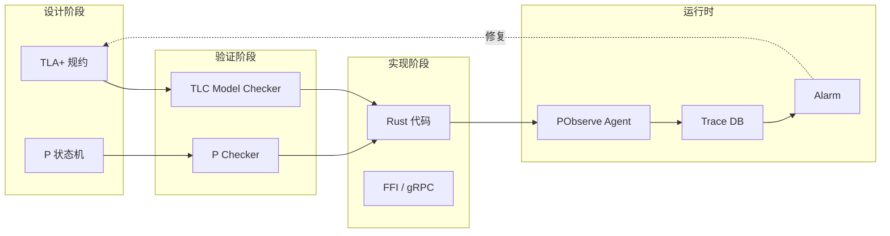

# Formal Methods Industrialization（形式化方法工业化）

> **层级**: L7 前沿趋势
> **前置概念**: [RustBelt](../04_formal/04_rustbelt.md) · [Ownership Formalization](../04_formal/03_ownership_formal.md) · [Concurrency](../03_advanced/01_concurrency.md)
> **主要来源**: [AWS Kani] · [Microsoft Verus] · [TLA+] · [P Language] · [POPL/PLDI 2024-2026] · [Wikipedia]

---

**变更日志**:

- v1.0 (2026-05-12): 初始版本
- v1.1 (2026-05-12): Wave 3 扩展——补充定义、五层模型、工具对比、CI/CD、工业案例、分布式验证

---

## 一、基础定义

### 1.1 形式化验证（Formal Verification）
> **来源**: [Wikipedia — Formal verification](https://en.wikipedia.org/wiki/Formal_verification)

形式化验证是使用形式化数学方法证明或反驳系统（硬件或软件）相对于特定规范或属性的正确性的过程。与测试（只能证明错误存在）不同，形式化验证可以提供系统无错误的数学保证。主要技术包括：模型检测（Model Checking）、定理证明（Theorem Proving）、抽象解释（Abstract Interpretation）和符号执行（Symbolic Execution）。

### 1.2 模型检测（Model Checking）
> **来源**: [Wikipedia — Model checking](https://en.wikipedia.org/wiki/Model_checking)

模型检测是一种全自动的形式化验证技术，通过穷举系统所有可能的状态空间来验证时序逻辑属性。其核心优势是全自动：用户只需提供系统模型和待验证属性，工具自动完成验证或生成反例。限制在于状态空间爆炸问题——系统状态数随变量数指数增长。现代模型检测器通过符号模型检测（BDD）、有界模型检测（BMC）和抽象精炼（CEGAR）来缓解。

### 1.3 定理证明（Theorem Proving）
> **来源**: [Wikipedia — Automated theorem proving](https://en.wikipedia.org/wiki/Automated_theorem_proving)

定理证明是使用计算机程序辅助构造数学证明的过程。交互式定理证明器（如 Coq、Isabelle/HOL、Lean）需要人类指导证明策略，而全自动定理证明器（如 Z3、CVC5）通过 SMT 决策过程自动求解约束。在程序验证中，定理证明器用于验证带循环和递归的程序满足前置条件、后置条件和不变式。

---

## 二、五层扩展模型

五层扩展模型将 Rust 的形式化保证从编译器原生层级向上延伸至系统级运行时验证：

```text
L0: Rust 编译器     → 所有权/生命周期/并发  ✅ 原生完成
L1: Code-Level      → 功能正确性            🚧 Creusot/Verus/Kani
L2: Interface-Level → 契约/版本代数          🚧 Filament/Schema Lattice
L3: Protocol-Level  → 状态机/一致性          🚧 TLA+/P
L4: System-Level    → 故障模型/容错          🚧 CALM/FizzBee
L5: Runtime-Level   → 轨迹比对/持续验证       🚧 PObserve/MongoDB Trace
```

### 2.1 L0：Rust 编译器（原生层）
Rust 编译器已通过 borrow checker 和类型系统提供内存安全、线程安全和无数据竞争的保证。这是所有上层验证的基础平台。

### 2.2 L1：Code-Level（代码级验证）
验证单个函数或模块的功能正确性：
- **前置/后置条件**：函数输入满足某条件时，输出必满足某条件
- **循环不变式**：循环每次迭代保持的断言
- **终止性**：递归和循环最终结束
- **工具**：Kani（模型检测）、Creusot（Why3）、Verus（SMT）、Prusti（Viper）

### 2.3 L2：Interface-Level（接口级验证）
验证组件间交互的契约：
- **类型状态**：将协议状态编码到类型中（如 `OpenFile` vs `ClosedFile`）
- **版本代数**：API 演化的数学模型，保证向后兼容
- **工具**：Filament（时序接口）、Schema Registry（Protobuf/Avro 契约）

### 2.4 L3：Protocol-Level（协议级验证）
验证分布式协议和并发算法的正确性：
- **安全属性（Safety）**："坏事永不发生"——无死锁、无数据竞争、一致性
- **活性属性（Liveness）**："好事终将发生"——请求最终得到响应
- **工具**：TLA+（时序逻辑）、P Language（状态机）、Spin/Promela

### 2.5 L4：System-Level（系统级验证）
验证在故障模型下的系统行为：
- **拜占庭容错**：部分节点恶意或故障时的系统安全性
- **CALM 定理**：哪些一致性属性可以在无协调的情况下实现
- **工具**：FizzBee、Ivy、DistAlgo

### 2.6 L5：Runtime-Level（运行时验证）
生产环境中持续验证实际行为与规约一致：
- **轨迹收集**：记录系统运行时的关键事件序列
- **在线监控**：实时检查轨迹是否违反时序逻辑属性
- **工具**：PObserve、MongoDB Trace、Dtrace/BPF

---

## 三、Rust 验证工具深度对比

### 3.1 能力矩阵

| **工具** | **验证方法** | **所有权支持** | **并发验证** | **自动化程度** | **成熟度** | **维护方** |
|:---|:---|:---|:---|:---|:---|:---|
| **Kani** | 模型检测 + 符号执行 | ✅ 原生 | ✅ 支持 | 全自动 | 生产级 | AWS |
| **Creusot** | 演绎验证 → Why3/Alt-Ergo | ✅ 深度 | ⚠️ 有限 | 半自动（需规约） | 研究→工业 | INRIA |
| **Verus** | SMT (Z3) + 所有权逻辑 | ✅ 深度 | ✅ 支持 | 半自动（需规约） | 研究→工业 | Microsoft |
| **Aeneas** | 基于借用的函数式翻译 → Lean | ✅ 精确 | ❌ 单线程 | 半自动 | 研究 | INRIA |
| **Prusti** | Viper 分离逻辑 | ✅ 深度 | ⚠️ 实验性 | 半自动 | 研究 | ETH Zurich |

### 3.2 适用场景

| **工具** | **最佳场景** | **不适场景** | **学习曲线** |
|:---|:---|:---|:---|
| **Kani** | 快速验证 unsafe 代码、并发原语、标准库属性 | 需要复杂数学规约的算法 | 低（只需 `#[kani::proof]`） |
| **Creusot** | 需要精确功能正确性的安全关键代码 | 快速原型验证、大型遗留代码 | 高（需掌握 Why3/MLCFG） |
| **Verus** | 系统代码（OS、网络栈）、并发数据结构 | 不期望写规约的敏捷开发 | 中高（Rust-like 规约语法） |
| **Aeneas** | 算法正确性证明、教学用途 | 需要并发验证的工业代码 | 高（需 Lean 知识） |
| **Prusti** | 分离逻辑研究、内存精确建模 | 大规模代码库、快速迭代 | 高（Viper 中间语言） |

### 3.3 技术细节

**Kani**：
- 基于 CBMC（C Bounded Model Checker）的 Rust 前端
- 将 Rust MIR 翻译为 GOTO 程序，用 SAT/SMT 求解
- 支持 `kani::any()` 生成非确定值进行符号执行
- AWS 用于验证 s2n-quic、Firecracker 等生产组件

**Creusot**：
- 将 Rust 程序翻译为 Why3 的 MLCFG（中间语言）
- 使用 Dijkstra 最弱前置条件计算验证条件
- 支持 Rust 的泛型、Trait、生命周期，通过 "prophecies" 处理可变借用

**Verus**：
- 专为系统软件设计的验证工具
- 规约直接写在 Rust 代码中（`#[verifier::spec]`、`#[verifier::proof]`）
- 使用 Z3 SMT 求解器，支持量词、位向量、序列理论
- Microsoft 用于验证 IronRDP、vRDMA 等组件

**Aeneas**：
- 核心创新：将 Rust 的借用语义翻译为纯函数式程序
- 生成的 Lean 代码保留了 Rust 的所有权语义但消除了生命周期
- 适合需要机器检查证明的学术场景

**Prusti**：
- 基于 Viper 验证基础设施
- 使用分离逻辑（Separation Logic）精确建模堆内存
- 支持 fractional permissions 和 read-only borrows

---

## 四、CI/CD 集成方案

### 4.1 GitHub Actions 集成

```yaml
# .github/workflows/formal-verification.yml
name: Formal Verification

on: [push, pull_request]

jobs:
  kani:
    runs-on: ubuntu-latest
    steps:
      - uses: actions/checkout@v4
      - name: Setup Kani
        uses: model-checking/kani-github-action@v1
        with:
          args: "--workspace"
      - name: Run Kani proofs
        run: cargo kani

  creusot:
    runs-on: ubuntu-latest
    steps:
      - uses: actions/checkout@v4
      - name: Setup Creusot
        run: cargo install creusot
      - name: Verify with Creusot
        run: cargo creusot --span-mode=absolute

  verus:
    runs-on: ubuntu-latest
    steps:
      - uses: actions/checkout@v4
      - name: Setup Verus
        run: git clone https://github.com/verus-lang/verus && cd verus && ./build.sh
      - name: Verify with Verus
        run: ./verus/source/target-verus/release/verus src/lib.rs
```

### 4.2 Pre-commit Hooks

使用 [pre-commit](https://pre-commit.com) 在提交前运行轻量级验证：

```yaml
# .pre-commit-config.yaml
repos:
  - repo: local
    hooks:
      - id: kani-smoke
        name: Kani Smoke Test
        entry: cargo kani --harness smoke_test
        language: system
        pass_filenames: false
        files: \.rs$
      
      - id: mirifast
        name: Miri Fast Check
        entry: cargo +nightly miri test --lib
        language: system
        pass_filenames: false
        files: \.rs$
```

### 4.3 分层验证策略

```text
快速反馈环（< 1分钟）: cargo check + cargo clippy + rustfmt
编译期保证（< 5分钟）: cargo test + cargo miri test
功能验证（< 30分钟）: Kani proofs（关键 unsafe 函数）
深度验证（nightly）: Creusot/Verus（核心算法）
协议验证（设计期）: TLA+ / P（分布式组件）
```

---

## 五、工业案例研究

### 5.1 AWS Kani
> **来源**: [AWS Kani Blog](https://aws.amazon.com/blogs/opensource/verify-rust-programs-using-kani/) · [s2n-quic verification]

AWS 将 Kani 集成到多个核心项目的开发流程中：
- **s2n-quic**：验证 TLS 状态机、数据包解析、拥塞控制算法的安全属性
- **Firecracker microVM**：验证内存安全边界和虚拟设备模拟的正确性
- **AWS Libcrypto**：验证加密原语的常量时间属性和内存安全
- **规模**：数百个 `#[kani::proof]` 函数，nightly CI 运行

### 5.2 Microsoft Verus
> **来源**: [Microsoft Verus Blog](https://www.microsoft.com/en-us/research/project/verus/) · [IronRDP]

Microsoft Research 的 Verus 项目致力于让系统软件验证更加实用：
- **IronRDP**：经验证的 RDP（远程桌面协议）实现，关键解析函数附带功能正确性证明
- **vRDMA**：虚拟 RDMA 设备的验证，确保网络协议状态机正确
- **GhostCell**：经验证的单线程无锁数据结构，使用 Verus 证明其安全性和功能正确性
- **方法**：规约与实现同文件，开发者逐步添加 `proof fn` 而不重构代码

### 5.3 Linux Kernel Verification
> **来源**: [Linux Kernel Rust] · [Rust for Linux]

随着 Rust 进入 Linux 内核（自 6.1 起），形式化验证开始关注内核场景：
- **Kani for Drivers**：验证 Rust 驱动的 `probe`/`remove` 回调不触发内存错误
- **Miri for Kernel**：在模拟的内核内存模型下检测 UB
- **长期目标**：对关键内核抽象（如 `Mutex`、`SpinLock`）提供形式化保证
- **挑战**：内核的异步中断、内存布局约束、FFI 边界增加了验证复杂度

---

## 六、TLA+ / P 语言 / PObserve 的分布式验证

### 6.1 TLA+（时序逻辑动作）
> **来源**: [TLA+ Home Page](https://lamport.azurewebsites.net/tla/tla.html) · [AWS TLA+ Case Studies]

TLA+ 由 Leslie Lamport 开发，是工业界验证分布式算法的事实标准：
- **PlusCal**：类伪代码的算法描述语言，自动翻译为 TLA+
- **TLC Model Checker**：穷举状态空间，验证 Safety 和 Liveness
- **工业应用**：AWS S3 强一致性、DynamoDB 事务、Kafka 协议、Azure Cosmos DB 都使用 TLA+ 验证核心算法
- **与 Rust 结合**：用 TLA+ 验证分布式协议设计，Rust 实现协议；运行时通过 trace-checking 对齐

### 6.2 P 语言（状态机编程语言）
> **来源**: [P Language](https://p-org.github.io/P/) · [AWS PObseve]

P 是微软和 AWS 合作开发的事件驱动状态机语言：
- **编程模型**：将系统建模为状态机，通过事件触发状态转移
- **模块组合**：支持状态机的层次化组合，适合微服务架构
- **P Checker**：系统地探索状态空间，检测死锁、状态不可达和断言失败
- **Rust 后端**：P 编译器可生成 Rust 实现骨架，保持规约与实现的一致性

### 6.3 PObserve（运行时对齐）
> **来源**: [PObserve: Bridging the Gap]

PObserve 解决"验证的规约 vs 运行的实现"之间的鸿沟：
- **轨迹收集**：在 Rust 程序中插入探针，记录关键事件
- **规约匹配**：将运行时轨迹与 P/TLA+ 规约进行在线比对
- **偏差告警**：当实际行为偏离已验证的规约时立即告警
- **意义**：形式化验证只在设计时保证正确性；PObserve 将保证延伸到生产环境

### 6.4 分布式验证工作流



---

## 七、验证工具对比矩阵图

```mermaid
quadrantChart
    title Rust 形式化验证工具：自动化程度 vs 表达能力
    x-axis 低自动化 --> 高自动化
    y-axis 低表达能力 --> 高表达能力
    
    quadrantNames ["专家定理证明", "工业验证甜点区", "教学/原型", "快速 smoke test"]
    
    Kani: [0.9, 0.6]
    Creusot: [0.4, 0.85]
    Verus: [0.5, 0.8]
    Aeneas: [0.3, 0.75]
    Prusti: [0.4, 0.7]
    Miri: [0.95, 0.3]
    RustBMC: [0.7, 0.5]
    RefinedRust: [0.35, 0.8]
```

---

## 八、持续验证趋势

```text
设计时验证 ──→ 测试时验证 ──→ 生产时监控
   (TLA+)        (Trace-Check)      (PObserve)
```

这种"左移 + 右延"的趋势意味着形式化验证不再是开发后期的奢侈品，而是贯穿软件生命周期的持续实践。Rust 的类型系统提供了 L0 的持续保证，而 L1-L5 的工具链正在逐步实现更高级属性的持续验证。

---

## 九、与 L4 形式化层的衔接

| 工业工具 | 理论基础 | 对应 L4 文件 | 成熟度 |
|:---|:---|:---|:---|
| Kani | 模型检测 + 符号执行 | `04_formal/04_rustbelt.md` (扩展) | 生产可用 |
| Creusot | Why3 / MLCFG | `04_formal/04_rustbelt.md` | 研究→工业 |
| Verus | SMT + 所有权逻辑 | `04_formal/03_ownership_formal.md` | 研究→工业 |
| Miri | Stacked/Tree Borrows | `04_formal/03_ownership_formal.md` | 生产可用 |
| TLA+ | 时序逻辑 | —（系统级） | 成熟 |

---

## 十、知识来源

| **论断** | **来源** | **可信度** |
|:---|:---|:---|
| AWS 使用 Kani 验证 Rust | [AWS Blog] | ✅ |
| TLA+ 用于 S3/DynamoDB | [AWS CACM 2015] | ✅ |
| PObserve 运行时对齐 | [AWS P Language] | ✅ |
| Verus 验证 IronRDP | [Microsoft Research] | ✅ |
| Linux Kernel Rust 验证 | [Rust for Linux] | 🚧 进行中 |
| 模型检测全自动特性 | [Wikipedia — Model Checking] | ✅ |
| 定理证明 SMT 基础 | [Wikipedia — ATP] | ✅ |

---

## 十一、相关概念链接

| 概念 | 文件 | 关系 |
|:---|:---|:---|
| RustBelt | [`../04_formal/04_rustbelt.md`](../04_formal/04_rustbelt.md) | 理论基础 |
| 所有权形式化 | [`../04_formal/03_ownership_formal.md`](../04_formal/03_ownership_formal.md) | 验证对象 |
| Unsafe | [`../03_advanced/03_unsafe.md`](../03_advanced/03_unsafe.md) | 验证边界 |
| 工具链 | [`../06_ecosystem/01_toolchain.md`](../06_ecosystem/01_toolchain.md) | CI 集成 |
| AI × Rust | [`./01_ai_integration.md`](./01_ai_integration.md) | 协同趋势 |
| 语言演进 | [`./03_evolution.md`](./03_evolution.md) | 验证需求驱动 |
| 安全边界 | [`../05_comparative/safety_boundaries.md`](../05_comparative/safety_boundaries.md) | 验证目标 |
