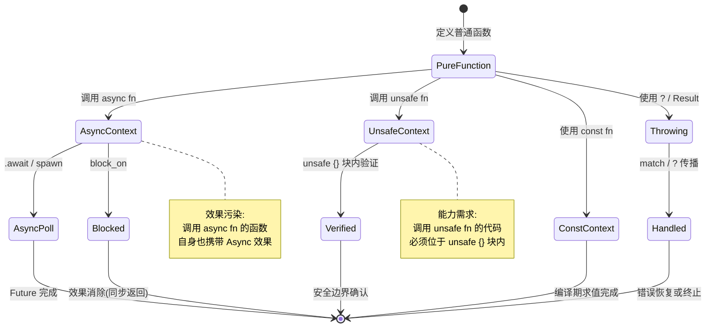
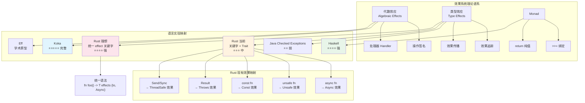
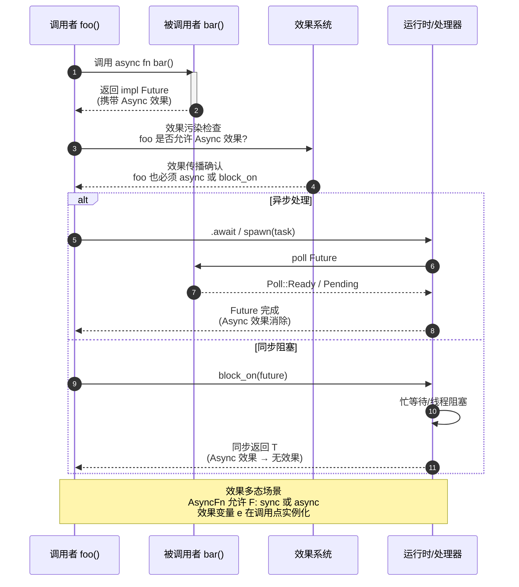

> **生态状态提示**：
>
> 本文档提及 `async-std` 与/或 `wasm32-wasi`。
> 请注意：
>
> - `async-std` 项目已进入维护模式，2024 年后不再活跃开发；新项目建议优先评估 **Tokio** 或 **smol**。
> - `wasm32-wasi` 旧目标名已重命名为 **`wasm32-wasip1`**；WASI Preview 2 对应目标为 **`wasm32-wasip2`**。
> **Rust 版本**: 1.97.0+ (Edition 2024)

---

# Effects System: Concept Pre-study（效果系统：概念预研）

> **代码状态**: ✅ 含可编译示例
>
> **EN**: Effect System
> **Summary**: Effect System — A speculative pre-study tracking the type system's move toward explicit effect tracking.
> **来源**:
>
> [Rust Project Goals 2025H1 — const traits](https://rust-lang.github.io/rust-project-goals/2025h1/const-trait.html) ·
> [Keyword Generics Initiative](https://github.com/rust-lang/keyword-generics-initiative) ·
> [a-mir-formality](https://github.com/rust-lang/a-mir-formality) ·
> [Brown University — Interactive Rust Book](https://rust-book.cs.brown.edu/) ·
> [Itanium C++ ABI](https://itanium-cxx-abi.github.io/cxx-abi/abi.html)
>
> **受众**: [专家]
> **内容分级**: [综述级]
> **权威来源**: 本文件为 `concept/` 权威页。
> **层级**: L7 前沿趋势
> **A/S/P 标记**: **S** — Structure（心智模型）
> **双维定位**: C×Ana — 分析 Effects 系统对 Rust 的潜力
> **定位**: 本文件是 Rust 效果系统（Effect System）的**概念预研**，跟踪类型系统（Type System）向显式效果追踪演进的理论动向与工程实践。内容具有推测性，随语言团队决策动态更新。
> **前置概念**: [Async](../../03_advanced/01_async/01_async.md) · [Traits](../../02_intermediate/00_traits/01_traits.md) · [Generics](../../02_intermediate/01_generics/01_generics.md) · [Type Theory](../../04_formal/00_type_theory/01_type_theory.md) · [Algebraic Effects](../../04_formal/07_concurrency_semantics/04_algebraic_effects.md)
> **主要来源**:
> [Plotkin & Pretnar 2009 — Algebraic Effects] ·
> [Lucassen & Gifford 1988 — Polymorphic Effect Systems] ·
> [Koka] · [Eff] · [Rust Keyword Generics Initiative 2024](https://github.com/rust-lang/keyword-generics-initiative) ·
> [Rust Project Goals 2025H1 — const traits](https://rust-lang.github.io/rust-project-goals/2025h1/const-trait.html) ·
> [a-mir-formality](https://github.com/rust-lang/a-mir-formality) ·
> [Yoshua Wuyts — "Why Effects?" (2026-05)](https://blog.yoshuawuyts.com/why-effects/) ·
> [Yoshua Wuyts — "Open and Closed Effect Systems" (2025-05)](https://blog.yoshuawuyts.com/open-and-closed-effect-systems/) ·
> [Yoshua Wuyts — "Syntactic Musings on the Fallibility Effect" (2025-12)](https://blog.yoshuawuyts.com/syntactic-musings-on-the-fallibility-effect/) ·
> [Yoshua Wuyts — "An Effect Notation Based on With-Clauses and Blocks" (2026-03)](https://blog.yoshuawuyts.com/a-with-based-effect-notation/) ·
> [Yoshua Wuyts — "A Grand Vision for Rust" (2026-03)](https://blog.yoshuawuyts.com/a-grand-vision-for-rust/)
> **定理链**: N/A — 描述性/综述性/导航性文档，不涉及形式化定理链
---

> **Bloom 层级**: L4-L7
**变更日志**:

- v1.0 (2026-05-13): 初始版本。建立 Effect 系统概念框架、Rust 现有 effect 映射、AsyncFn 作为原型、跨语言对比、演进路线图
- v1.1 (2026-05-22): 网络权威内容对齐：添加 `gen<yield>` effects 跟踪、Lang Team 2026 季度更新
- v1.2 (2026-06-02): 补充 Rust Effects Initiative 官方定位、学术谱系（Plotkin & Pretnar 2009 / Lucassen & Gifford 1988）、carried/uncarried 官方分类、effect composition 规则、a-mir-formality 形式化验证关联 [Web Authority AlignmentSprint](../../00_meta/02_sources/05_international_authority_index.md)
- v1.3 (2026-06-02): Yoshua Wuyts 2025-2026 核心输出全面整合："Why Effects?" / "Open and Closed Effect Systems" / "Fallibility Effect" / "With-Clauses and Blocks" / "A Grand Vision for Rust"。
- 添加 〇之三 Why Effects? 核心洞察、一之二 开放/封闭效应系统分类、一之三 Fallibility Effect 语法设计、二之二 With-Clauses 效应符号、六更新 Rust 2030+ 愿景（effects + substructural types + refinement types）。
- 标注 `~const` 语法废弃方向，更新学术谱系时间线至 2026。

---

> **后置概念**: [Rust Specification](https://www.rust-lang.org/) · [官方路线图](https://github.com/rust-lang/rust/labels/F-roadmap)
> **前置依赖**: [Rust vs C++](../../05_comparative/01_systems_languages/01_rust_vs_cpp.md)
> **前置依赖**: [Toolchain](../../06_ecosystem/00_toolchain/01_toolchain.md)

## 〇、Effect System 概念全景

```mermaid
mindmap
  root((Effect System<br/>效果系统))
    核心理论
      三合一论证[三合一论证<br/>隐式参数 + 类型化协程 + 语言原语]
      代数效应[代数效应<br/>Plotkin & Pretnar 2009]
      类型效应[类型效应<br/>标记集合 + 传播检查]
      效果多态[效果多态<br/>e 效果变量]
      行多态[行多态<br/>Koka: row-polymorphic effects]
    Rust 现有实现
      async[async → Future 状态机<br/>效果: 异步挂起]
      const_fn[const fn → 编译期求值<br/>效果: 无副作用]
      try_fn[try / Result<T,E><br/>效果: 可失败]
      gen_fn[gen / yield<br/>效果: 惰性迭代]
      unsafe[unsafe → 安全边界标记<br/>效果: 放弃编译器保证]
    开放 vs 封闭
      开放系统[开放系统<br/>Koka/Eff/Flix<br/>用户可定义效果]
      封闭系统[封闭系统 ⭐<br/>Rust 方向<br/>语言内置 bounded 效果集]
      设计权衡[设计权衡<br/>零成本抽象 vs 表达力]
    统一语法提案
      with_clauses[with-clauses<br/>fn foo() with async + throw {}]
      eff_alias[eff 别名<br/>eff Pure = panic + diverge]
      effect_generics[效果泛型<br/>fn foo<eff Ef>() with Ef {}]
      effect_algebra[效果代数<br/>并集 + 排除 + 互斥]
      do_propagation[.do 传播<br/>通用效果传播关键字]
    效果 × 其他系统
      Pin[Pin × async/gen<br/>自引用状态机保证]
      Substructural[子结构类型<br/>!Forget 线性 + !Move 有序]
      Refinement[精化类型<br/>usize is 1.. pattern types]
    未来效果
      no_panic[!panic<br/>保证不 unwind]
      no_diverge[!diverge<br/>保证终止]
      deterministic[!ndet<br/>保证确定性]
      no_io[!io<br/>不调用主机 API]
    跨语言对比
      Koka[Koka<br/>⭐⭐⭐⭐⭐ 完整代数效应]
      Eff[Eff<br/>学术原型]
      Haskell[Haskell<br/>Monad 变换器]
      Java[Java<br/>Checked Exceptions]
      Rust当前[Rust 当前<br/>关键字 + Trait ⭐⭐⭐]
      Rust理想[Rust 理想<br/>统一 effect 关键字 ⭐⭐⭐⭐]
```

> **认知功能**:
> 此 mindmap 构建 Effect System 的全局认知脚手架。
> **功能定位**: 将分散的效果机制（async/unsafe/const/Result/Send）整合为"理论-实现-对比-演进"四维分析框架。
> **使用建议**: 按背景选择入口——类型论背景从"理论基础"切入，工程背景从"Rust 现有实现"切入，策略背景从"演进方向"切入。
> **关键洞察**: Rust 当前的效果表达是碎片化的（各关键字独立运作），向统一 effect 关键字演进是消除碎片化的长期趋势，最大障碍并非技术可行性，而是向后兼容性与社区共识。[💡 原创分析](../../00_meta/00_framework/methodology.md)
> [来源: [TRPL](https://doc.rust-lang.org/book/title-page.html)]

---

## 〇之一、Rust Effects Initiative 官方定位

> **[Rust Keyword Generics Initiative — Extending Rust's Effect System (2024-02-09)](https://github.com/rust-lang/keyword-generics-initiative/blob/master/updates/2024-02-09-extending-rusts-effect-system.md)(<https://github.com/rust-lang/keyword-generics-initiative/blob/master/updates/2024-02-09-extending-rusts-effect-system.md>)** ✅ ·
> **[Inside Rust Blog — Keyword Generics Progress Report (2023-02-23)](https://blog.rust-lang.org/inside-rust/2023/02/23/keyword-generics-progress-report-feb-2023.html)(<https://blog.rust-lang.org/inside-rust/2023/02/23/keyword-generics-progress-report-feb-2023.html>)** ✅

Rust 语言团队自 2022 年起通过 **Keyword Generics Initiative** 系统性地推进 effect system 的设计。
该 initiative 的核心理论洞察由 Yoshua Wuyts 在 2024 年 2 月的官方更新中明确提出：

> **"Rust has unknowingly shipped an effect system as part of the language since Rust 1.0."**
> — Yoshua Wuyts, Rust Keyword Generics Initiative, 2024-02-09

这意味着 Rust 的 `async`、`const`、`try` (`?`)、`unsafe` 和 generators 并非孤立的语法糖，而是**同一理论框架（effect system）的不同实例**。
Initiative 的目标不是引入全新的"effect"关键字，而是让 Rust **能够对已有的 effects 进行泛化（generic over effects）**，从而解决函数着色问题（Function Coloring Problem）导致的 API 重复爆炸。

### Rust Project Goals 2025H1 的核心里程碑

> **[Rust Project Goals 2025H1 — Prepare const traits for stabilization](https://rust-lang.github.io/rust-project-goals/)(<https://rust-lang.github.io/rust-project-goals/2025h1/const-trait.html>)** ✅

Rust 官方 2025 上半年目标将 **"Prepare const traits for stabilization"** 列为语言演进的核心任务。
Const trait 是 effect system 在 Rust 中最关键的落地场景之一：

| 目标 | 状态 | 与 Effect System 的关联 |
| :--- | :---: | :--- |
| 形式化 const traits in a-mir-formality | 🔄 进行中 | 在 Rust 官方形式化模型中验证 effect-generic trait 的 soundness |
| 稳定化 const trait bounds | ⏳ 待 RFC | 允许 `const fn` 调用 trait 方法，使 `const` 成为真正的 effect-generic 能力 |
| 重构 compiler const-checking to HIR level | 🔄 进行中 | 为推广到更多 effects 奠定编译器基础 |

> **关键洞察**: Const trait 的稳定化不仅是一个独立特性，更是 Rust effect system **从"隐性关键字"向"显性类型系统（Type System）能力"跃迁的试金石**。
> 一旦 const trait 通过 a-mir-formality 验证并稳定，相同的机制可以推广到 `async`、`try` 等其他效果。

---

## 〇之二、Effects 的学术谱系

> **[Plotkin & Pretnar 2009 — Handlers of Algebraic Effects](https://doi.org/10.1007/978-3-642-00590-9_7) ·
> [Lucassen & Gifford 1988 — Polymorphic Effect Systems, POPL](https://doi.org/10.1145/73560.73564)** ·
> [Wadler 1992 — The Essence of Functional Programming](https://doi.org/10.1145/143165.143169)**·
> [Koka Language Documentation](https://koka-lang.github.io/koka/doc/)**

Rust 的 effect system 并非凭空产生，它延续了编程语言理论中近 40 年的研究脉络。
理解这一谱系，才能准确判断 Rust 在 effect system 设计空间中的位置。

### 学术谱系时间线

```text
1988: Lucassen & Gifford — Polymorphic Effect Systems (POPL)
       ↓ 将效果作为类型约束引入多态类型系统
1994: Wadler — Monads vs Effect Systems
       ↓ 论证 effect system 可以作为 monad 的轻量级替代
2009: Plotkin & Pretnar — Algebraic Effects and Handlers
       ↓ 建立代数效应的数学基础：操作签名 + 处理器
2014: Koka (Leijen, Microsoft Research)
       ↓ 首个将 row-polymorphic effect types 引入主流工程语言
2015-2020: Eff, Flix, Effekt, OCaml 5
       ↓ 代数效应在学术界和函数式语言中广泛验证
2022: Rust Keyword Generics Initiative 成立
       ↓ 承认 Rust 已隐性实现 effect system，开始显性化设计
2024: Yoshua Wuyts — "Extending Rust's Effect System"
       ↓ 明确提出 carried/uncarried effects 分类、effect composition 规则
2025: Rust Project Goals — const traits stabilization
       ↓ 以 const effect 为突破口，推进 effect-generic trait 的 engineering 落地
2025-05: Yoshua Wuyts — "Open and Closed Effect Systems"
       ↓ 明确 Rust 选择封闭效应系统（closed effect system），语言内置 bounded 效果集
2025-12: Yoshua Wuyts — "Syntactic Musings on the Fallibility Effect"
       ↓ 提出 `throws`/`throw` 语法替代 `try`/`yeet`，abstract vs concrete fallibility 分析
2026-03: Yoshua Wuyts — "An Effect Notation Based on With-Clauses and Blocks"
       ↓ 提出 `with`-clauses + `eff` 别名 + `.do` 传播的完整语法框架
2026-03: Yoshua Wuyts — "A Grand Vision for Rust"
       ↓ 将 effects、substructural types、refinement types 并列为 Rust 2030+ 三大方向
2026-05: Yoshua Wuyts — "Why Effects?"
       ↓ 效应 = 隐式参数 + 类型化协程 + 语言原语，三合一核心论证
```

### 从理论到 Rust 的映射

| 理论概念 | 学术来源 | Rust 对应实现 | 差距 |
| :--- | :--- | :--- | :--- |
| **Algebraic Effects** | Plotkin & Pretnar 2009 | 无原生支持；`async`/`try`/`gen` 通过关键字 + trait 模拟 | Rust 拒绝运行时（Runtime） handler 栈，保持零成本 |
| **Polymorphic Effect Types** | Lucassen & Gifford 1988 | `AsyncFn` trait (1.85)、`~const Trait` (unstable, **已废弃方向**) | 无显式 effect 变量语法，通过 trait bound 模拟；`~const` 正被 `with`/`eff` 新语法取代 |
| **Row Polymorphism** | Leijen 2014 (Koka) | 无直接对应；`#[maybe(async)]` 是受限形式 | 不支持开放行类型（open row types）的完整子类型 |
| **Effect Composition** | Plotkin & Pretnar 2009 | `async fn` + `Result` → `impl Future<Output = Result<T, E>>` | 组合规则硬编码，非通用可扩展 |
| **Effect Handlers** | Plotkin & Pretnar 2009 | 无；运行时（Runtime）效果处理由 tokio [已归档: async-std 2025-03] 等外部运行时承担 | Rust 将 handler 语义外化到库层，语言层只保证类型安全 |

> **认知功能**:
> 此谱系表揭示 Rust effect system 的**设计取舍**——它不是"缺乏理论深度的工程 hack"，而是**在零成本抽象（Zero-Cost Abstraction）约束下对理论的有意裁剪**。
> Rust 选择不实现完整的代数效应（避免运行时（Runtime） handler 栈开销），而是通过关键字 + trait + 状态机 desugar 在编译期消除效果成本。
> 这与 Koka 的"理论 purity"和 Java 的"弱类型检查"形成三极对比。
> [来源: [Rust Keyword Generics Initiative](https://github.com/rust-lang/keyword-generics-initiative)]

---

## 〇之三、Why Effects? — 效应系统的三合一论证

> **[Yoshua Wuyts — "Why Effects?" (2026-05)](https://blog.yoshuawuyts.com/)(<https://blog.yoshuawuyts.com/why-effects/>)** ✅ ·
> **[Yoshua Wuyts — "A Grand Vision for Rust" (2026-03)](https://blog.yoshuawuyts.com/)(<https://blog.yoshuawuyts.com/a-grand-vision-for-rust/>)** ✅

Yoshua Wuyts 在 2026 年 5 月的核心文章中提出了一个**三合一论证**：效果系统（effect system）不是单一概念，而是三种看似无关的编程语言机制在深层次上的统一。

### 三合一：效应 = 隐式参数 + 类型化协程 + 语言原语

```text
┌─────────────────────────────────────────────────────────────┐
│                     Effect System                           │
│                       （效果系统）                            │
├─────────────────┬─────────────────┬─────────────────────────┤
│   隐式参数       │   类型化协程      │      语言原语           │
│ Implicit Args   │ Typed Coroutines│   Language Primitives   │
├─────────────────┼─────────────────┼─────────────────────────┤
│ 函数除了显式参数  │ 函数可以在特定点   │ 效果直接编码语言语义，   │
│ 外，还隐式接收   │ 挂起和恢复，且    │ 不由其他机制支撑        │
│ "能力/上下文"   │ 挂起/恢复的类型   │                        │
│                 │ 被静态追踪        │                        │
├─────────────────┼─────────────────┼─────────────────────────┤
│ async fn 隐式   │ async/.await 是  │ const fn 移除堆访问、    │
│ 接收执行器/轮询  │ 类型化的 yield/  │ 静态变量、非确定性、     │
│ 能力             │ resume           │ 主机 API 访问——这些     │
│                 │                 │ 都是编译器级别的语义      │
├─────────────────┼─────────────────┼─────────────────────────┤
│ 类比：区域性类型  │ 类比：代数效果    │ 类比： capability-safe  │
│ 系统（region     │ 处理器（typed    │ 编程中的 primitive      │
│ types）隐式传递  │ yield）          │ capabilities            │
│ 内存上下文       │                 │                        │
└─────────────────┴─────────────────┴─────────────────────────┘
```

> **关键洞察**:
> 传统上，"隐式参数"（如 Haskell 的 `Reader` monad、Scala 的 `given`）、"类型化协程"（如代数效果处理器）和"语言原语"（如 `const` 关键字限制）被视为三个独立领域。
> Wuyts 论证它们是**同一枚硬币的三面**——效果系统提供了一个统一的理论框架，让这三种机制可以被一致地推理和组合。
> [来源: [Yoshua Wuyts — "Why Effects?" (2026-05)](https://blog.yoshuawuyts.com/why-effects/)]

### 为什么 Rust 特别需要统一效果系统

Rust 当前有 2 个稳定内置效果（`async`、`const`）和 2 个不稳定内置效果（`try`/`gen`）。
但随着语言演进，Rust 需要能够表达更多保证：

| 未来效果 | 含义 | 应用场景 |
| :--- | :--- | :--- |
| **no-panic** (`!panic`) | 函数保证不 unwind | 嵌入式、实时系统、FFI 边界 |
| **no-divergence** (`!div`) | 函数保证终止 | 形式化验证、安全关键系统 |
| **deterministic** (`!ndet`) | 函数保证确定性 | 可重现构建、测试、密码学 |
| **no-io** (`!io`) | 函数不调用主机 API | 沙箱、WASM、无操作系统环境 |

> **关键洞察**:
> 单独处理一两个效果是可以接受的（如今天的 `async fn`），但随着效果数量增加，**函数着色问题（Function Coloring Problem）** 呈指数级恶化。
> 没有统一抽象，每种新效果都需要完整的 stdlib 分叉（历史上 async-std [已归档 2025-03] vs std、潜在的 fallible-std 等）。
> 效果多态（effect polymorphism）是唯一的出路。
> [来源: [Yoshua Wuyts — "A Grand Vision for Rust" (2026-03)](https://blog.yoshuawuyts.com/a-grand-vision-for-rust/)]

### 效果系统的最小公倍数

```text
无效果系统的世界：              有效果系统的世界：
─────────────────────          ─────────────────────
async fn foo() {}              fn foo() with async {}
const fn bar() {}              fn bar() with const {}
try fn baz() {}                fn baz() with throw(E) {}
gen fn qux() {}                fn qux() with yield(T) {}

N 种效果 → 2^N 种组合          N 种效果 → 1 种泛型机制
(async+const, async+try,       fn f<eff Ef>(x: impl Fn() with Ef)
 const+try, async+const+try...)   → 效果作为泛型参数
```

> **认知功能**:
> 此对比揭示效果系统的核心价值——不是添加新能力，而是**消除已有能力的组合爆炸**。
> `AsyncFn` trait（1.85 stable）是这一原则的原型验证：一个 trait 同时覆盖 sync 和 async 闭包（Closures），无需两个版本。
> [来源: [Yoshua Wuyts — "Why Effects?" (2026-05)](https://blog.yoshuawuyts.com/why-effects/)] ·
> [来源: [Rust Keyword Generics Initiative](https://github.com/rust-lang/keyword-generics-initiative)]

---

## 一、Effect 系统是什么？

> **[学术来源: Plotkin & Pretnar 2009 — Algebraic Effects; Koka Language]**

**Effect 系统**（Effect System）是将"计算效果"（computational effects）显式编码到类型系统（Type System）中的理论框架。
与类型系统（Type System）回答"这个函数接受/返回什么值"不同，Effect 系统回答"这个函数在计算过程中**还做了什么**"。

经典效果包括：

| 效果 | 直觉含义 | Rust 当前表达 | 理想的显式表达 |
|:---|:---|:---|:---|
| **IO** | 与外部世界交互 | 无标记 | `fn foo() -> i32 effect Io` |
| **Async** | 可能挂起/恢复 | `async fn` | `fn foo() -> i32 effect Async` |
| **Unsafe** | 可能触发 UB | `unsafe fn` | `fn foo() -> i32 effect Unsafe` |
| **异常** | 可能失败/短路 | `Result` / `?` | `fn foo() -> i32 effect Throws` |
| **非确定性** | 结果不唯一 | 无标记 | `fn foo() -> i32 effect NonDet` |
| **状态** | 修改堆/全局状态 | `&mut T` | `fn foo() -> i32 effect State` |

### 1.2 代数效应（Algebraic Effects）vs 类型效应（Type Effects）
>
> **权威深入页**: 代数效应的形式定义、自由单子解释、操作语义与跨语言对比见 [L4 代数效应与效应处理器](../../04_formal/07_concurrency_semantics/04_algebraic_effects.md)。本页只保留高层对比与工程方向。
>

```text
代数效应（Plotkin & Pretnar 2009）:
  ─────────────────────────────────────────
  效果 = 操作签名 + 处理器（handler）
  例: effect State { get(): S; put(s: S): () }
  处理器捕获效果的具体语义（如状态映射到状态单子）
  → 代表语言: Eff, Koka, Flix

类型效应（Rust 方向）:
  ─────────────────────────────────────────
  效果 = 函数类型上的标记集合
  例: fn foo() -> i32 effects {Async, Io}
  编译器检查效果传播，不引入运行时处理器
  → 代表语言: Java checked exceptions（雏形）, Rust（探索中）
```

> **关键区别**:
> 代数效应强调**效果的处理（handling）**——可以拦截、转换、恢复效果；类型效应强调**效果的追踪（tracking）**——确保调用者知晓被调用函数的所有副作用。
> Rust 语言团队目前探索的方向更接近**类型效应**，因为引入完整的代数效应处理器会显著增加运行时（Runtime）复杂性和零成本抽象（Zero-Cost Abstraction）的破坏。

---

## 一之二、开放与封闭效应系统（Open vs Closed Effect Systems）

> **[Yoshua Wuyts — "Open and Closed Effect Systems" (2025-05)](https://blog.yoshuawuyts.com/)(<https://blog.yoshuawuyts.com/open-and-closed-effect-systems/>)** ✅

效果系统按"效果集合是否可由用户扩展"分为**开放（open）**和**封闭（closed）**两类。
这是 Rust 效果系统设计的根本决策点。

### 分类矩阵

| 维度 | 开放效应系统 | 封闭效应系统 |
| :--- | :--- | :--- |
| **效果来源** | 用户可定义新效果 | 仅语言内置效果 |
| **效果集合** | 无界（unbounded） | 有界（bounded） |
| **代表语言** | Koka, Eff, Flix, OCaml 5 | Java（checked exceptions）, Rust（方向） |
| **类型系统（Type System）复杂度** | 高（需支持用户定义的效果签名） | 中（固定效果集，可硬编码规则） |
| **编译器实现难度** | 高（效果签名解析、行多态子类型） | 中-低（效果为枚举（Enum）或标记集合） |
| **表达能力** | 强（任意代数效果） | 受限（仅语言设计者预定义的效果） |
| **向后兼容性** | 难（新效果可能改变现有代码含义） | 易（新效果作为语言版本升级） |

### Rust 选择封闭效应系统

Yoshua Wuyts 在 2025 年 5 月的文章中明确提出：**Rust 将选择封闭效应系统**。
这不是技术能力的限制，而是工程哲学的抉择：

```text
Rust 封闭效应系统的设计约束：
─────────────────────────────────────────
1. 效果由语言团队定义，用户不可自定义
2. 效果集合有界：async, const, try/throw, gen/yield, 以及未来可能的 no-panic, no-div 等
3. 组合规则可硬编码（如 async + try → Future<Output = Result<T, E>>）
4. 不引入运行时效果处理器栈（保持零成本抽象）
5. 效果作为编译期标记，不生成运行时元数据
```

> **关键洞察**:
> 开放系统（如 Koka）允许用户定义 `effect State { get(): S; put(s: S): () }`，编译器生成效果处理器调用。
> 封闭系统（如 Rust 方向）只允许使用语言预定义的效果，效果组合规则由编译器内置。
> Rust 的选择意味着：**效果系统是关于"追踪"而非"处理"**——Rust 不提供 `handle` 表达式拦截效果，只保证效果在类型签名中显式传播。
> [来源: [Yoshua Wuyts — "Open and Closed Effect Systems" (2025-05)](https://blog.yoshuawuyts.com/open-and-closed-effect-systems/)]

### 为什么 Rust 不能是开放的？

| 开放系统的假设 | Rust 的现实约束 |
| :--- | :--- |
| 效果处理器可在运行时（Runtime）动态组合 | Rust 拒绝运行时开销（handler 栈、动态分派） |
| 用户定义效果需编译器插件机制 | Rust 编译器架构不支持用户扩展类型系统（Type System）核心 |
| 行多态子类型需复杂类型推断（Type Inference） | Rust 已有生命周期（Lifetimes）推断，再加效果行推断会爆炸 |
| 效果抽象边界模糊 | Rust 强调零成本抽象（Zero-Cost Abstraction），任何运行时（Runtime）成本都需显式 opt-in |

> **重要澄清**:
> 封闭 ≠ 固定不变。Rust 的封闭效应系统可以随语言版本扩展新效果（如 Edition 2027 可能引入 `no-panic`）。
> 但用户不能在自己的 crate 中定义新效果——这与 Rust 中用户不能定义新关键字、新运算符的约束一致。
> [来源: [Yoshua Wuyts — "Open and Closed Effect Systems" (2025-05)](https://blog.yoshuawuyts.com/open-and-closed-effect-systems/)]

---

## 一之三、Fallibility Effect：可失败性的语法设计

> **[Yoshua Wuyts — "Syntactic Musings on the Fallibility Effect" (2025-12)](https://blog.yoshuawuyts.com/)(<https://blog.yoshuawuyts.com/syntactic-musings-on-the-fallibility-effect/>)** ✅

"Fallibility"（可失败性）是 Rust 效果系统中最重要的效果之一——它回答"这个函数可能失败吗？"的问题。
当前 Rust 通过 `Result<T, E>` + `?` 运算符表达可失败性，但这是**类型承载**而非**效果标记**。
Wuyts 在 2025 年 12 月的文章中系统分析了将可失败性提升为真正效果的语法路径。

### 当前问题：`Result` 是类型，不是效果

```rust,ignore
// 当前 Rust：可失败性编码在返回类型中
fn read_file(path: &str) -> Result<String, io::Error> { ... }

// 问题 1: 泛化困难
// 如果我想写一个既适用于 Result 函数、又适用于 "纯" 函数的泛型：
fn map<F, T, U>(f: F, input: T) -> U
where
    F: Fn(T) -> U,  // 这无法涵盖 Fn(T) -> Result<U, E>
{ ... }

// 问题 2: 组合爆炸
// async + Result → async fn -> Result<T, E>
// gen + Result → gen fn -> Result<T, E>
// 每种组合都需要独立语法
```

### `throws` 效果：从类型到效果的跃迁

Wuyts 提出借鉴 Java/Swift 的 `throws` 命名，但赋予其效果语义：

```rust,ignore
// 当前（不稳定 try fn）
try fn foo() -> i32 throws Error { ... }

// 提议的方向：throws 作为效果
fn foo() -> i32 with throw(Error) { ... }

// 甚至更进一步：throw 作为动词（效果操作）
fn foo() -> i32 with throw { ... }
```

| 语法变体 | 来源 | 状态 |
|:---|:---|:---|
| `try fn foo() -> Result<T, E>` | Rust nightly | 不稳定，可能废弃 |
| `fn foo() -> T throws E` | Java/Swift 风格 | Wuyts 2025 提议方向 |
| `fn foo() -> T with throw(E)` | With-clauses 框架 | Wuyts 2026 统一符号 |
| `fn foo() -> T with throw` | 默认错误类型（`!`） | 最简形式 |

### Abstract vs Concrete Fallibility

Wuyts 区分了两种可失败性：

```text
Concrete Fallibility（具体可失败性）:
────────────────────────────────────
函数知道它可能以什么错误失败
例: fn read() -> i32 with throw(io::Error)
    → 失败类型是具体的 io::Error

Abstract Fallibility（抽象可失败性）:
─────────────────────────────────────
函数知道自己可能失败，但不指定错误类型
例: fn parse<T>() -> T with throw
    → 错误类型由调用者或实现决定
    → 类似于泛型参数：fn parse<T, E>() -> Result<T, E>
```

> **关键洞察**:
> `throw` 作为效果操作（类似 `await`、`yield`）比 `throws` 作为效果类型更符合 Rust 的设计哲学。
> 原因在于：大多数效果语言使用"名词-动词"命名（效果名是名词如 `Exception`，操作是动词如 `throw`），但对于基于闭包（Closures）的语法，仅使用动词更自然。
> 这还能减少关键字保留：`throw` 替代 `yeet` + `async` + `try` + `gen`，总体减少一个保留关键字。
> [来源: [Yoshua Wuyts — "Syntactic Musings on the Fallibility Effect" (2025-12)](https://blog.yoshuawuyts.com/syntactic-musings-on-the-fallibility-effect/)] ·
> [来源: [Yoshua Wuyts — "An Effect Notation Based on With-Clauses and Blocks" (2026-03)](https://blog.yoshuawuyts.com/a-with-based-effect-notation/)]

### `.do`：通用效果传播

```rust,ignore
// 当前：每个效果有自己的传播语法
async:  .await
try:    ?
gen:    yield / for..in

// 未来可能的方向：.do 统一传播
fn foo<F, eff Ef>(f: F) -> i32
where
    F: FnOnce() -> i32 with Ef,
with Ef {
    f().do;  // 根据 Ef 的具体效果，插入 .await / ? / yield 等
}
```

> **认知功能**:
> `.do` 的设计哲学是——效果传播（propagation）是通用的，但效果创建（create）和消费（consume）必须特定于效果。
> `?` 可能返回错误，`.await` 可能不恢复（async cancellation），`yield` 可能结束迭代——它们的共同点是"调用点之后函数可能不继续执行"。
> `.do` 捕获这一共性。
> [来源: [Yoshua Wuyts — "An Effect Notation Based on With-Clauses and Blocks" (2026-03)](https://blog.yoshuawuyts.com/a-with-based-effect-notation/)]

---

## 二、Rust 中的现有 Effect 表达

Rust 尚未引入统一的 `effect` 关键字，但**已经通过不同机制实现了效果的隐性追踪**。

> **[Rust Keyword Generics Initiative — Extending Rust's Effect System (2024-02-09)](https://github.com/rust-lang/keyword-generics-initiative/blob/master/updates/2024-02-09-extending-rusts-effect-system.md)(<https://github.com/rust-lang/keyword-generics-initiative/blob/master/updates/2024-02-09-extending-rusts-effect-system.md>)** ✅
> Rust 语言团队明确将以下五种关键字识别为 **effect types**：`async`、`.await`、`const`、`try` (`?`)、`unsafe`，以及不稳定的 `yield` (generators)。这些不是独立的语法糖，而是同一理论框架的不同实例。

| 效果类别 | 当前 Rust 语法 | 效果语义 | 追踪方式 | 多态支持 |
| :--- | :--- | :--- | :--- | :--- |
| **异步（Async）** | `async fn` | 可能挂起，返回 `Future` | 关键字 + `Future` trait | `AsyncFn` trait (1.85+) |
| **Unsafe** | `unsafe fn` | 可能违反 safety invariant | 关键字 + 调用者义务 | ❌ 无多态 |
| **常量** | `const fn` | 编译期可求值 | 关键字 + MIR const eval | `~const Trait` (unstable, **已废弃方向**) |
| **异常** | `Result<T, E>` + `?` | 可能短路/失败 | 类型承载 + `Try` trait | `?` 自动传播 |
| **泛型（Generics）约束** | `where T: Send` | 线程安全约束 | Trait bound | 泛型参数多态 |

### 2.1 Carried vs Uncarried Effects（Rust 官方分类）

> **[Rust Keyword Generics Initiative — Extending Rust's Effect System (2024-02-09)](https://github.com/rust-lang/keyword-generics-initiative/blob/master/updates/2024-02-09-extending-rusts-effect-system.md)(<https://github.com/rust-lang/keyword-generics-initiative/blob/master/updates/2024-02-09-extending-rusts-effect-system.md>)** ✅ ·
> **[Inside Rust Blog — Keyword Generics Progress Report (2023-02-23)](https://blog.rust-lang.org/inside-rust/2023/02/23/keyword-generics-progress-report-feb-2023.html)(<https://blog.rust-lang.org/inside-rust/2023/02/23/keyword-generics-progress-report-feb-2023.html>)** ✅

Rust 语言团队（由 Yoshua Wuyts 在 2024 年官方更新中明确提出）将效果分为两类，这一分类直接决定了不同效果的泛化难度和技术路径：

| 类别 | 效果 | 类型系统（Type System）表现 | 泛化难度 | Rust 现状 |
| :--- | :--- | :--- | :---: | :--- |
| **Carried** | `async`, `try`/`Result`, `gen` | Desugar 为实际类型（`Future`, `Result`, `Iterator`） | **低** | `AsyncFn` (1.85 stable) 已实现效果多态原型；`try` trait 已稳定 |
| **Uncarried** | `const`, `unsafe` | 仅编译期标记，不体现在类型签名中 | **高** | `const` trait 长期 unstable；`unsafe` 语义上**不是 effect**（见脚注） |

#### Carried Effects：类型系统已承载

Carried effects 的核心特征是**效果信息被编码到类型中**，因此类型系统（Type System）天然支持效果追踪和多态：

```rust,ignore
// async: 返回类型显式携带 Future
async fn foo() -> i32 { 42 }
// desugar 为: fn foo() -> impl Future<Output = i32>

// try: Result 类型显式携带失败可能性
fn bar() -> Result<i32, Error> { Ok(42) }

// gen: 返回 Iterator 类型
let iter = gen { yield 1; yield 2; };
// desugar 为: impl Iterator<Item = i32>
```

> **关键洞察**:
> Carried effects 的泛化相对直接，因为效果信息已经在类型签名中。
> `AsyncFn` 允许闭包（Closures）是 sync 或 async，编译器通过调用上下文（是否 `.await`）推断具体效果变体。
> 这是 **row-polymorphism** 在 Rust 中的受限工程实现。

#### Uncarried Effects：编译期标记

Uncarried effects 不体现在类型签名中，仅作为编译器的元数据使用：

```rust
// const: 关键字不改变函数签名类型
const fn foo() -> i32 { 42 }      // 签名仍是 fn() -> i32
// 但 const-checking 在 HIR/MIR 层拒绝运行时代码

// unsafe: 语义上不是 effect（见下），但语法上"effect-like"
unsafe fn bar() -> i32 { 42 }     // 签名仍是 fn() -> i32
```

> ⚠️ **重要修正**（来自 Yoshua Wuyts 2024 官方更新脚注）："Semantically `unsafe` in Rust is not an effect. But syntactically it would be fair to say that `unsafe` is 'effect-like'.
> As such any notion of 'maybe-unsafe' would be nonsensical." 这意味着 `unsafe` 不会被纳入 effect generics 的范畴。

#### `const fn` 已是效果泛型的雏形

> **[Rust Keyword Generics Initiative 2024](https://github.com/rust-lang/keyword-generics-initiative)** ✅

`const fn` 的特殊之处在于它**已经是 maybe-const 的**：

```rust
const fn meow() {}  // maybe-const：可在编译期调用，也可在运行时调用
const {}            // always-const：强制编译期求值
```

`const fn` 的"maybe-const"语义正是 effect generics 的核心机制——函数本身不限制调用上下文的效果，效果由调用点决定。
这也是为什么 const 能够逐步引入 stdlib 而不破坏向后兼容：**`const fn` 在编译期上下文中自动获得 `const` 效果，在运行期上下文中效果为空集**。

> ⚠️ **语法演进声明**: `~const Trait` bound（nightly 不稳定语法）是向效果泛型（Generics）探索的**历史步骤**，但**不是最终方向**。
> Yoshua Wuyts 在 2026 年的 with-clauses 提案中已明确将 `~const` 视为将被 `eff`/`with` 新语法取代的过渡方案。
> Const trait 的核心语义（编译期效果追踪）将持续演进，但 `~const` 关键字本身可能不会在稳定 Rust 中出现。
> **关键洞察**:
> Const trait 长期 unstable 的根本原因不是语法设计，而是 compiler 需要重构 const-checking 从 MIR 层上移至 HIR 层，使其可泛化到更多 effects。
> Rust Project Goals 2025H1 正在推进这一重构。

---

### 2.2 Effect Composition：效果的组合规则

> **[Rust Keyword Generics Initiative — Extending Rust's Effect System (2024-02-09)](https://github.com/rust-lang/keyword-generics-initiative/blob/master/updates/2024-02-09-extending-rusts-effect-system.md)(<https://github.com/rust-lang/keyword-generics-initiative/blob/master/updates/2024-02-09-extending-rusts-effect-system.md>)** ✅

当函数携带多个 carried effects 时，Rust 需要定义它们的组合顺序。
Rust 语言团队明确将 effects 定义为**与顺序无关的集合（order-independent sets）**，但组合规则需要硬编码：

```rust,ignore
// async + try 的组合
async fn foo() -> Result<i32, Error> { ... }
// 稳定化决策: 必须是 impl Future<Output = Result<i32, Error>>
// 而非 Result<impl Future<Output = i32>, Error>
```

| 效果组合 | Rust 组合结果 | 设计理由 |
|:---|:---|:---|
| `async` + `try` | `impl Future<Output = Result<T, E>>` | Future 包裹 Result：先挂起，再可能失败 |
| `async` + `gen` | 尚未稳定；理论上 `impl Future<Output = impl Iterator>` 或统一 Stream | Stream = async Iterator |
| `try` + `gen` | 尚未稳定；`impl Iterator<Item = Result<T, E>>` | 每次 yield 可能失败 |
| `async` + `try` + `gen` | 远期：统一为 `impl Stream<Item = Result<T, E>>` | 三效果合一 |

> **设计原则**:
> Effects on functions are **order-independent sets**。
> 虽然 Rust 当前要求关键字按固定顺序声明（如 `async unsafe fn`），但 carried effects 的组合方式唯一确定。
> 人们仍可通过手动写函数签名来 opt-out 内置组合规则，但对于绝大多数用例，内置规则是正确的默认选择。

### 2.3 `async` 作为效果的原型
>

```rust,ignore
// 当前 Rust: async 是语法关键字，不是类型系统效果
async fn fetch() -> Data { ... }
// 语义: fetch 具有 Async 效果，调用者必须 await

// 理想化效果系统视角:
fn fetch() -> Data effect Async { ... }
// 语义: fetch 的类型签名显式携带 Async 效果
```

`async fn` 的关键设计决策——**效果污染（effect pollution）**：

```text
若 fn foo 调用 async fn bar，则 foo 也必须是 async（或 block_on）
  ↓
效果向上传播：调用者必须处理被调用者的效果
  ↓
这与 checked exceptions 类似：Java 中调用 throws 方法必须 catch 或声明 throws
```

### 2.3 效果状态转换图
>



> **认知功能**:
> 此状态图将"效果污染"的抽象概念转化为可视化的状态转换。
> 关键洞察：**效果不是终点，而是需要被处理（poll/await）或消除（block_on）的中间状态**。
> `async` → `await` → `Future 完成` 的三段式与 `unsafe` → `unsafe {} 验证` → `安全边界确认` 形成对偶——前者是计算挂起效果，后者是安全责任效果。

### 2.3 `AsyncFn`：Effect 多态的第一次尝试

Rust 1.85 稳定的 `AsyncFn` trait 家族可视为**效果多态（effect polymorphism）**的原型：

```rust,ignore
// AsyncFn: "我不关心这个闭包是否是 async，只要调用时我能 await 结果"
fn call_any<F, T>(f: F) -> impl Future<Output = T>
where
    F: AsyncFn() -> T,  // 效果多态：F 可以是 sync 或 async
{ ... }
```

在效果系统理论中，这对应于：

```text
效果多态签名:
  fn call_any<F>(f: F) where F: Fn() -> T effect e
  // e 是一个效果变量，可以被实例化为 {}（无效果）或 {Async}
```

> **关键洞察**:
> `AsyncFn` 没有引入完整的 effect 变量语法，而是通过 trait 系统模拟了效果多态。
> 这是 Rust "用类型系统（Type System）解决问题"设计哲学的延续——不添加新语法，而是用已有机制（trait、关联类型、HRTB）表达新概念。

### 2.4 With-Clauses：统一效果语法的设计提案

> **[Yoshua Wuyts — "An Effect Notation Based on With-Clauses and Blocks" (2026-03)](https://blog.yoshuawuyts.com/)(<https://blog.yoshuawuyts.com/a-with-based-effect-notation/>)** ✅

2026 年 3 月，Wuyts 提出了目前最完整的 Rust 效果语法提案，核心由三个新关键字组成：`eff`（效果定义/泛型（Generics））、`with`（效果子句）、`.do`（效果传播）。

#### 核心语法：`with`-clauses

```rust,ignore
// 效果别名：抽象重复的效果签名
eff Alias = async + emplace;

// 函数：效果从函数前缀移到 with 子句
fn foo() -> i32 { .. }                         // 空效果集（total）
fn foo() -> i32 with async { .. }              // 单一效果
fn foo() -> i32 with async + emplace { .. }    // 多效果组合
fn foo() -> i32 with Alias { .. }              // 别名引用

// 闭包：消除 async || {} vs || async {} 的歧义
let foo = || with async { .. };               // with 统一语法

// 块
let x = with async { .. };

// trait impl
impl Foo with async for Bar { .. }
```

> **关键洞察**:
> `with`-clauses 消除了当前 Rust 中效果语法的碎片化——`async fn`、`const fn`、`try fn`、`gen fn` 都是前缀形式，组合时变成 `pub const placing try gen fn foo() {}` 的噩梦。
> `with` 将所有效果统一到一个位置，语法上更清晰，且为任意数量的效果组合提供空间。
> [来源: [Yoshua Wuyts — "An Effect Notation Based on With-Clauses and Blocks" (2026-03)](https://blog.yoshuawuyts.com/a-with-based-effect-notation/)]

#### 效果泛型：`eff` 关键字

```rust,ignore
// 函数对效果本身泛型
fn foo<eff Ef>() -> i32 with Ef { .. }

// 参数携带效果
fn foo<eff Ef>(x: impl Foo with Ef) { .. }

// 数据类型对效果泛型
struct Foo<eff Ef> { .. }
impl<eff Ef> Foo with Ef { .. }

// 关联效果（类比关联类型）
impl Foo for Bar { eff Ef = async; }
```

#### 效果代数：集合操作

效果不是简单的标记，而是支持集合代数操作：

| 操作 | 语法 | 含义 |
|:---|:---|:---|
| **空集** | `fn foo() {}` | 无任何额外效果（total） |
| **并集** | `Ef3: Ef1 + Ef2` | 合并两个效果集，设下界 |
| **排除** | `Ef: !Block` | 从集合中排除特定效果，设上界 |
| **互斥** | `Ef2: !Ef1` | 两个效果集无交集 |

```rust,ignore
// 排除效果：函数保证永不阻塞
fn on_mouse_pressed<F, eff Ef>(listener: F)
where
    F: FnOnce(MouseEvent) with Ef,
    Ef: !Block  // F 可以有任意效果，除了 Block
{ .. }

// 互斥效果：两个闭包不能共享除 Network 外的效果
fn par<A, B, F, G, eff Ef1, eff Ef2>(f: F, g: G)
where
    F: FnOnce(A) -> B with Ef1,
    G: FnOnce(A) -> B with Ef2,
    Ef1: Network,
    Ef2: !Ef1 + Network,
{ .. }
```

> **关键洞察**:
> 效果代数直接借鉴了 Flix 团队的 "Programming with Effect Exclusion"（ICFP 2023）论文。
> Rust 的 `where` 子句除了约束类型变量，还可以约束效果变量。
> 这保持了 Rust 类型系统的统一感——`where` 是约束的统一入口，无论约束的是类型还是效果。
> [M. Lutze et al., "Programming with Effect Exclusion", ICFP 2023](https://doi.org/10.1145/3607849) ·
> [来源: [Yoshua Wuyts — "An Effect Notation Based on With-Clauses and Blocks" (2026-03)](https://blog.yoshuawuyts.com/a-with-based-effect-notation/)]

#### 效果别名与 stdlib 分层

效果别名使 stdlib 分层可以精确定义：

```rust,ignore
// 标准库可能提供的效果别名
pub eff Pure = panic + diverge;       // 等价于今天的 `const fn`（允许 panic + 无限循环）
pub eff Core = Pure + static;         // 等价于 `#![no_std]` + `core`
pub eff Alloc = Core + heap;          // 等价于 `extern crate alloc`
pub eff Std = Alloc + Host;           // 等价于标准 `std`
```

```rust,ignore
// 使用别名
fn foo() {}              // 默认 total（无任何效果）
fn foo() with Pure {}    // 等价于今天的 `const fn`
fn foo() with Std {}     // 等价于今天的普通 `std` 函数
```

> **关键洞察**:
> 如果 Rust 假设 totality 为默认（而非今天的 "隐式 std 能力"），约 70% 的新代码（据 Koka 经验）将是无效果（total）的。
> 对于剩余的 30%，模块（Module）级效果声明 `pub mod bar with Std { ... }` 或文件级 `mod self with Std;` 可以消除重复。
> 这与当前 `#![no_std]` / `extern crate alloc` 的设计哲学一致，但更加统一和显式。
> [来源: [Yoshua Wuyts — "An Effect Notation Based on With-Clauses and Blocks" (2026-03)](https://blog.yoshuawuyts.com/a-with-based-effect-notation/)]

#### 当前状态：设计提案，非官方路线图

> ⚠️ **重要声明**: `with`-clauses 语法是 Yoshua Wuyts 的个人设计提案，**不是 Rust 语言团队的官方决策**。
> Rust 语言团队尚未就统一效果语法达成一致。此提案旨在展示"一条合理的路径存在"，而非呼吁立即实施。
> 正如 Wuyts 所言："如果有人告诉我这是第一个他们不主动讨厌的效果符号，那已经算是成功了。"

---

## 三、跨语言对比

| 语言 | 效果模型 | 表达力 | 运行时（Runtime）成本 | 与 Rust 的关系 |
| :--- | :--- | :--- | :--- | :--- |
| **Koka** | 代数效应 + 处理器 | ⭐⭐⭐⭐⭐ 完整 | 有（handler 栈） | 理论参考，Rust 不引入运行时（Runtime）处理器 |
| **Eff** | 代数效应 + 子类型 | ⭐⭐⭐⭐⭐ 完整 | 有 | 学术原型 |
| **Haskell** | Monad 变换器 | ⭐⭐⭐⭐ 强 | 有（RTS） | Rust `async` 受 Haskell 启发，但拒绝 Monad |
| **Java** | Checked exceptions | ⭐⭐ 弱 | 零 | Rust 可能借鉴"显式传播"，但拒绝异常机制 |
| **Rust（当前）** | 关键字 + Trait | ⭐⭐⭐ 中 | 零 | 渐进式：async/unsafe/const 各走各的路 |
| **Rust（理想）** | 类型效应 | ⭐⭐⭐⭐ 强 | 零 | 统一语法，保持零成本 |

### 3.2 效果模型谱系图



> **认知功能**: 此谱系图揭示 Effect System 的"理论-语言"双层结构。
> **代数效应**（Koka/Eff）与 **Monad**（Haskell）是两条独立的理论路线，而 **类型效应**（Java/Rust）是工程化的折中方案。
> Rust 当前处于"类型效应"象限，但正在向"统一语法"方向移动。颜色的深浅提示：浅色为理论原型，暖色为工程实践，粉色为未来方向。

### 3.2 为什么 Rust 拒绝 Monad？

```text
Haskell 效果模型:
  IO a = 世界状态 → (a, 世界状态')
  任何 IO 操作都显式传递"世界 token"
  → 纯函数式，但所有效果通过 Monad 组合

Rust 设计哲学冲突:
  1. 零成本抽象: Monad 变换器有运行时成本（即使被优化，语义复杂）
  2. 显式控制: Rust 程序员想要知道每次内存分配和上下文切换
  3.  FFI 兼容: Haskell 的 IO monad 与 C ABI 不直接映射
  4. 学习曲线: Monad 是 Haskell 最大门槛，Rust 有意避免

Rust 的替代方案:
  async/await 语法糖 → 编译为状态机（零运行时开销）
  unsafe 关键字 → 边界标记而非类型变换
  Result<T, E> → 显式错误传播（无隐式异常）
```

---

## 四、对 Rust 类型系统的潜在影响

> **[Rust Internals Discussion; Type Theory Research](https://internals.rust-lang.org/)** ⚠️ 推测性
的可能性

```rust,ignore
// 推测性语法（非官方，仅供概念讨论）

// 效果声明
effect Async;
effect Io;
effect Unsafe;

// 效果标记函数
fn read_file(path: &str) -> String effects {Io, Async} { ... }

// 效果多态泛型
fn map<T, U, E>(f: impl Fn(T) -> U effects E, xs: Vec<T>) -> Vec<U> effects E {
    xs.into_iter().map(f).collect()
    // map 的效果 = f 的效果（效果多态传播）
}

// 效果消除
fn block_on<T>(f: impl Future<Output = T>) -> T effects {} {
    // 将 Async 效果消除，同步返回结果
}
```

### 4.1 a-mir-formality：Rust 效果系统的形式化验证基础

> **[Rust Keyword Generics Initiative — Extending Rust's Effect System (2024-02-09)](https://github.com/rust-lang/keyword-generics-initiative/blob/master/updates/2024-02-09-extending-rusts-effect-system.md)(<https://github.com/rust-lang/keyword-generics-initiative/blob/master/updates/2024-02-09-extending-rusts-effect-system.md>)** ✅ ·
> **[a-mir-formality GitHub](https://github.com/rust-lang/a-mir-formality)(<https://github.com/rust-lang/a-mir-formality>)** ✅

Rust 语言团队通过 **a-mir-formality**（Rust 类型系统的官方形式化模型）来验证 effect generics 的 soundness。
这是一个关键的设计决策：**不直接在生产编译器中实现，而是先在形式化模型中证明类型安全**，然后再 engineering 落地。

#### 为什么 effect generics 是 a-mir-formality 的理想测试用例

Yoshua Wuyts 在 2024 年官方更新中明确说明：

> "Because effect generics are relatively straight forward but have far-reaching consequences for the type system, it is an ideal candidate to test as part of the formal model."

| 维度 | 说明 |
| :--- | :--- |
| **理论简洁性** | Effect generics 的语义可大部分表达为 const-generics 的语法糖，理论模型不复杂 |
| **影响深远性** | 触及 trait system、类型推断（Type Inference）、borrow checker 的交互边界 |
| **验证价值** | 一旦在 a-mir-formality 中验证通过，可为后续 RFC 提供严格的数学保证 |

#### 形式化验证与编译器重构的并行推进

Rust 正在两条线并行推进 effect system：

```text
形式化线 (a-mir-formality):
  └─ 在抽象类型系统模型中定义 effect-generic trait 的 typing rules
  └─ 证明 progress + preservation 定理
  └─ 验证 effect composition 的组合规则无矛盾

编译器线 (rustc):
  └─ 重构 const-checking 从 MIR 层 → HIR 层
  └─ 使 const-checking 机制可泛化到 async/try/gen 等其他效果
  └─ 为 effect-generic bounds 的实现奠定编译器基础设施
```

> **关键洞察**:
> Const trait 的稳定化被设计为 effect system 的**先锋任务**。
> 因为 `const` 是 uncarried effect 中最接近 carried effects 的一个（`const fn` 已有 maybe-const 语义），一旦 const trait 通过形式化验证并成功稳定，证明这套机制可以推广到其他效果的技术风险就大幅降低。
> [来源: [Rust Project Goals 2025H1](https://rust-lang.github.io/rust-project-goals/2025h1/const-trait.html)]

### 4.2 Effect Generics：消除 API 重复的关键机制

**[RustConf 2023 — Extending Rust's Effect System (Yoshua Wuyts)](https://www.youtube.com/channel/UCaYhcUwRBNscFNUKTjgPFiA)**

Rust 中 effects 的最大工程挑战不是单个效果的实现，而是**效果不匹配（effect mismatch）导致的 API 重复爆炸**——即业界熟知的"函数着色问题"（Function Coloring Problem）。

#### 4.2.1 组合爆炸的量化分析

对 Rust 1.70 stdlib 的分析揭示了效果的结构性影响：

| 效果 | stdlib 交互比例 | 说明 |
| :--- | :---: | :--- |
| `const` | ~75% | 编译期求值约束广泛影响 trait 和方法 |
| `async` | ~65% | IO 相关 trait（Read/Write/Iterator）均受波及 |
| `try` (`Result`/`?`) | ~30% | 错误处理（Error Handling）路径需要重复 API |
| **至少一个效果** | ~100% | 几乎所有 stdlib API 与某种效果交互 |
| **两个及以上效果** | ~50% | 效果交叉导致组合爆炸 |

组合爆炸的数学本质：
若 stdlib 需要为每个效果提供独立 trait 变体，则五个效果将产生 **2⁵ × 3 = 96 个 trait**（仅 `Fn` 家族就已从 3 个膨胀至潜在 96 个）。
Effect generics 通过"效果变量"将指数级重复降阶为线性参数。

#### 4.2.2 `maybe(async)`：效果泛型的语法设想

```rust,ignore
// 当前 Rust：必须为 sync/async 各写一版
fn copy_sync<R: Read, W: Write>(r: &mut R, w: &mut W) -> io::Result<()> { ... }
async fn copy_async<R: AsyncRead, W: AsyncWrite>(r: &mut R, w: &mut W) -> io::Result<()> { ... }

// 理想效果泛型：单一函数，效果由调用点推断
#[maybe(async)]
pub fn copy<R, W>(reader: &mut R, writer: &mut W) -> io::Result<()>
where
    R: #[maybe(async)] Read,
    W: #[maybe(async)] Write,
{
    // 若编译为 async，.await 保留；若编译为 sync，.await 自动抹除
    let mut buf = vec![0; 4096];
    loop {
        match reader.read(&mut buf).await? {
            0 => return Ok(()),
            n => writer.write_all(&buf[..n]).await?,
        }
    }
}

// 调用点自动推断
copy(reader, writer)?;                // 推断 sync
copy(reader, writer).await?;          // 推断 async
copy::<async>(reader, writer).await?; // 显式指定 async
```

> **关键洞察**:
> `maybe(async)` 不是"可选 async"，而是**编译期条件化 desugar**——效果由调用上下文推断，trait bound 与函数效果同步实例化。
> 这与 `const fn` 的"maybe-const"语义一致（`const fn` 本身已是效果泛型（Generics）的雏形）。

#### 4.2.3 Carried vs Uncarried Effects

Rust 语言团队将效果分为两类，影响泛化策略：

| 类别 | 效果 | 类型系统表现 | 泛化难度 |
| :--- | :--- | :--- | :---: |
| **Carried** | `async`, `try`/`Result`, `gen` | Desugar 为实际类型（`Future`, `Result`, `Iterator`） | 低 — 类型系统已承载效果信息 |
| **Uncarried** | `const`, `unsafe` | 仅编译期标记，不体现在类型签名中 | 高 — 需要扩展类型系统 |

Effect generics 对 carried effects 相对直接（已有 `AsyncFn` 作为原型），但对 uncarried effects 需要深层编译器重构——这也是 `const` trait 长期 unstable 的根本原因。

### 4.2 与 Trait 系统的整合挑战
>

```text
挑战 1: Trait bound 与效果约束的交互
  trait Reader {
      fn read(&mut self, buf: &mut [u8]) -> Result<usize, Error>;
      // 如果 read 需要 Io effect，trait 定义是否需要标注？
  }

挑战 2: 效果子类型
  fn foo() -> i32 effects {Io}  <:  fn foo() -> i32 effects {Io, Async}
  // 效果更少 = 更"纯" = 子类型？（与常规子类型方向相反）

挑战 3: 向后兼容
  现有 async/unsafe/const 关键字如何迁移到统一效果系统？
  → 最可能路径: 保留关键字，内部 desugar 为效果标记
```

### 4.2 效果传播时序图
>



> **认知功能**:
> 此序列图将"效果污染"和"效果消除"的动态过程可视化。
> **步骤 1-2** 展示效果产生（被调用者返回携带效果的值），
> **步骤 3-4** 展示效果传播（效果系统强制调用者承担相同效果），
> **步骤 5-9** 展示效果处理（运行时（Runtime）通过 poll/await 消除效果）。
> 关键洞察：**效果多态（AsyncFn）允许调用者在不知道被调用者具体效果的情况下编写泛型（Generics）代码——效果变量 `e` 在调用点被实例化**。
> [来源: [Rust Reference](https://doc.rust-lang.org/reference/introduction.html)]

### 4.3 `gen` blocks 与效果叠加

`gen` blocks（生成器）是 Rust 正在探索的另一个效果：

```rust,ignore
// gen block: 效果 = 可挂起并产生多个值
let iter = gen {
    yield 1;
    yield 2;
    yield 3;
};
```

`gen` 与 `async` 的对偶关系：

| 维度 | `async {}` | `gen {}` |
|:---|:---|:---|
| 效果 | 异步（Async）挂起 | 同步产生 |
| 返回 | 单个 `Future` | 多个 `Iterator` 元素 |
| 挂起点 | `.await` | `yield` |
| 状态机 | Future 状态机 | Generator 状态机 |
| 形式化 | Continuation monad | 余代数（coalgebra） |

> **理论洞察**: `async` 和 `gen` 都是**计算效果**的具体实例。
> 在完整的代数效应框架中，它们可以由统一的效果声明派生：`async = effect Suspend with Resume; gen = effect Yield with Next`。

---

## 五、演进路线图与开放问题
>

### 5.1 语言团队已知讨论（公开信息）
>

| 时间 | 事件 | 状态 |
| :--- | :--- | :--- |
| 2023 | Lang Team Blog: "Effects in Rust" 概念文章 | 概念探索 |
| 2024 | `AsyncFn` trait 稳定（1.85） | ✅ 效果多态原型落地 |
| 2024 | `gen` blocks 进入 nightly | 🚧 新效果类型实验 |
| 2025 | `gen<yield>` effects: `Iterator::next` 作为 effect 标注原型 | 🚧 nightly 实验 |
| 2025 | Effects 语法讨论在 internals.rust-lang.org | 🚧 社区辩论中 |
| 2026 | Lang Team 季度更新: effect 语法草案 v0.2 (内部审阅) | 🚧 内部迭代 |
| 202? | 统一 `effect` 关键字 | 🔮 远期可能 |

### 5.2 开放问题（Research Questions）

```text
Q1: Rust 需要完整的代数效应，还是类型效应就足够了？
    → 观点 A: 类型效应足够，保持零成本和简单性
    → 观点 B: 代数效应的 handler 机制能统一 async/iterator/exception

Q2: 效果系统如何与 Unsafe 交互？
    → unsafe 是一种"能力（capability）"而非"效果"
    → 但 unsafe fn 确实改变了调用上下文的要求

Q3: 效果多态的编译期代价？
    → 效果约束增加类型推断复杂度
    → 需要评估对编译时间的实际影响

Q4: 与现有生态的兼容性？
    → async_trait crate 的 workaround 是否会被原生替代？
    → `futures::Stream` 与 `gen` blocks 的语义对齐
```

### 5.3 概念预研 → 工业落地的条件

```text
必要条件:
  ✅ AsyncFn 证明效果多态在 trait 系统中可行
  ✅ gen blocks 证明多种效果可以共存
  🚧 需要统一的语法设计（不破坏现有代码）
  🚧 需要编译器实现团队承诺支持
  🚧 需要 Edition 迁移策略（可能 2027+）
```

---

## 六、相关概念链接

| 概念 | 文件 | 关系 |
| :--- | :--- | :--- |
| Async/Await | [`../03_advanced/01_async/02_async.md`](../../03_advanced/01_async/01_async.md) | `Async` 效果的主要载体 |

---

## 七、定理一致性矩阵（效果系统类型安全）

> **[来源类型: 原创分析; Koka; Plotkin & Pretnar 2009]** 以下矩阵梳理效果系统的类型安全保证与 Rust 的渐进式实现。

| 编号 | 效果 / 保证 | 前提 | 结论 | 失效条件 | 后果 |
| :--- | :--- | :--- | :--- | :--- | :--- |
| **EF1** | `async` 效果追踪 | `async fn` 关键字 | 调用者必须 `await` 或 `spawn` | 阻塞调用在 async 上下文 | 执行器线程阻塞 |
| **EF2** | `unsafe` 效果边界 | `unsafe fn` / `unsafe {}` | 调用者承担 safety proof 义务 | 调用者未验证 precondition | UB（未定义行为） |
| **EF3** | `const` 效果限制 | `const fn` 关键字 | 仅编译期可求值操作 | 运行时依赖；堆分配 | 编译错误 |
| **EF4** | `AsyncFn` 效果多态 | `AsyncFn` trait bound | 泛型（Generics）代码接受 sync/async 闭包（Closures） | trait 系统表达能力不足 | 无法抽象异步回调 |
| **EF5** | 统一 `effect` 关键字（未来） | 语法设计完成 + Edition 迁移 | 所有副作用显式追踪 | 向后兼容破坏；推断失败 | 生态迁移成本 |

> **⟹ 推理链**:
> EF1-EF3 证明 Rust **已经实现了效果的隐性追踪**，只是通过不同关键字而非统一语法。
> EF4 是**效果多态的原型**——证明统一语法在 trait 系统内可行。
> EF5 是**远期方向**，其最大障碍不是技术可行性，而是**向后兼容性**和**社区共识**。
>

| `AsyncFn` Trait | [`../03_advanced/01_async/02_async.md`](../../03_advanced/01_async/01_async.md) §12 | 效果多态的工程原型 |
| `gen` blocks | [`../03_advanced/01_async/02_async.md`](../../03_advanced/01_async/01_async.md) §13 | 另一种计算效果的实验 |
| 类型论基础 | [`../04_formal/02_type_theory.md`](../../04_formal/00_type_theory/01_type_theory.md) | 效果系统的类型论根基 |
| Rust 版本跟踪 | [`./05_rust_version_tracking.md`](../00_version_tracking/01_rust_version_tracking.md) | 效果相关语言特性状态 |
| 语言演进 | [`./03_evolution.md`](../04_research_and_experimental/03_evolution.md) §2.1, §2.3.1 | 效果系统在长程演进中的定位 |

---

## 七之一、效果限制导致的编译错误

> **[来源: [Rust Reference](https://doc.rust-lang.org/reference/introduction.html)]** Rust 现有效果系统（`async`/`const`/`unsafe`）在编译期即拒绝效果不匹配的程序。

### 编译错误 1：`const fn` 中调用 `async fn`

```rust,compile_fail
async fn async_op() -> i32 { 42 }

const fn const_context() -> i32 {
    // ❌ 编译错误: `async_op` 不是 `const fn`
    // const 效果要求所有调用必须在编译期可求值
    async_op()
}
```

> **效果分析**: `async fn` 产生 `Future`（延迟计算效果），与 `const fn` 的编译期求值效果冲突。编译器在效果层面拒绝此组合。

### 编译错误 2：`MutexGuard` 跨越 `await` 点

```rust,ignore
use std::sync::Mutex;

async fn bad_mutex_usage(m: Mutex<i32>) {
    let guard = m.lock().unwrap();
    some_async().await; // ❌ 编译错误: `MutexGuard` 不能安全地跨线程发送
    drop(guard);
}

async fn some_async() {}
```

> **效果分析**: `std::sync::MutexGuard` 不实现 `Send`，而 `await` 点可能导致任务在线程间迁移（`Send` 效果约束）。编译器检测到此效果冲突。

### 编译错误 3：Safe Rust 中直接解引用裸指针

```rust,compile_fail
fn safe_context(ptr: *const i32) -> i32 {
    // ❌ 编译错误: 解引用裸指针是 `unsafe` 操作
    // 验证工具（Miri/Kani）专门检测此类 UB
    *ptr
}
```

> **效果分析**: `unsafe` 效果标记了"放弃编译器保证"的边界。Safe Rust 中不允许解引用（Reference）裸指针——编译器将此操作隔离在 `unsafe` 块内，强制开发者承担 safety proof 义务。

### 编译错误 4：`const` 中分配堆内存

```rust,compile_fail
const fn allocate() -> Vec<i32> {
    // ❌ 编译错误: `Vec::new` 在 const fn 中允许，但 `push` 不允许
    // 堆分配在编译期不可行
    let mut v = Vec::new();
    v.push(1); // const 上下文中不允许动态分配
    v
}

// 正确: 使用数组（栈分配）
const fn stack_array() -> [i32; 3] {
    [1, 2, 3] // ✅ 编译期确定的栈分配
}
```

> **效果分析**: `const` 效果禁止堆分配（`Box`、`Vec`、`String` 的扩展操作），因为编译期求值器运行在受限环境中，无堆分配器。这体现了效果系统对"可用操作集合"的精确控制。

### 编译错误 5：`async` 闭包捕获 `&mut` 后跨 `await` 使用

```rust,ignore
async fn bad_capture(data: &mut Vec<i32>) {
    let first = &data[0];
    some_async().await; // ❌ 编译错误: `first` 借用 `data`，但 await 后可能重新借用
    println!("{}", first);
}

async fn some_async() {}

// 正确: 在 await 前完成借用
async fn good_capture(data: &mut Vec<i32>) {
    let first = data[0]; // 复制值（i32: Copy）
    some_async().await;
    println!("{}", first); // ✅ 不持有引用跨 await
}
```

> **效果分析**: `async` 效果将函数拆分为状态机，`await` 点是潜在挂起点。任何跨越 `await` 的引用（Reference）必须满足 `'static` 或等价约束。这与效果系统中"挂起/恢复"操作的连续性要求一致——状态机中的每个阶段必须独立可序列化。
> **[Plotkin & Pretnar 2009 — Algebraic Effects](https://doi.org/10.1007/978-3-642-00590-9_7); [Koka Language Documentation](https://koka-lang.github.io/koka/doc/); [Eff Language](http://www.eff-lang.org/)** Effect 系统概念基于代数效应的经典论文和现代语言实现。✅
> **[来源: Rust Lang Team Blog; Rust Internals Discussion; [RFC 3668](https://rust-lang.github.io/rfcs//3668-async-closures.html) AsyncFn]** Rust 效果追踪分析基于语言团队的公开讨论和稳定化的 trait 系统。✅
> **[Haskell GHC; Java Checked Exceptions; Type Theory Research](https://www.haskell.org/ghc/)** 跨语言对比参考了多种语言的效果处理机制和类型论研究。✅
---

## 三、Koka：Row Polymorphic Effects 的完整实现

> **[Leijen — Koka: Programming with Row Polymorphic Effects, ICFP 2014](https://doi.org/10.1145/2692915.2628169) · [Koka Documentation](https://koka-lang.github.io/)** ✅

### 3.1 Koka 的核心设计

Koka（Microsoft Research）是第一个将**代数效果（Algebraic Effects）**作为核心语言特性的工业级语言。

```koka
// Koka: 效果在类型签名中显式声明
fun divide(x : int, y : int) : exn int  // exn = 可能抛出异常
  if y == 0 then throw("Division by zero")
  else x / y

// 错误：忽略异常效果（Koka 编译器拒绝）
// fun bad_divide(x : int, y : int) : int
//   divide(x, y)  // ❌ 编译错误: 未处理的 exn 效果
//                  // Koka 要求显式处理或声明 exn 效果

// 正确：调用者必须处理异常效果
fun safe-divide(x : int, y : int) : maybe<int>
  try { Just(divide(x, y)) }  // 捕获 exn 效果
  catch { Nothing }
```

**Koka 的效果系统**：

| 特性 | 说明 | Rust 对比 |
|:---|:---|:---|
| **Row Polymorphism** | 效果是多态的行（row），如 `<exn,io>` | Rust 无此机制 |
| **Effect Handlers** | `handler { throw(msg) -> ... }` | 无直接等价（最接近 `catch_unwind`） |
| **Resume** | 处理器可恢复（resume）被中断的计算 | 无直接等价 |
| **Zero-Cost** | 效果处理通过编译优化消除运行时开销 | Rust 的 `?`/`async` 有运行时开销 |

### 3.2 Koka 的 Effects vs Rust 的 Approximation

```text
Koka 效果              Rust 近似
─────────────────────────────────────────────────
exn（异常）            Result<T, E> + ?
io（输入输出）          普通函数（无标记）
console（控制台）       println!（宏，非类型系统）
ndet（非确定性）        无直接等价（需外部 RNG）
async（异步）           async fn + Future
mut（可变状态）         &mut T + Cell/RefCell
```

> **关键洞察**:
> Koka 的效果系统是"显式且完整的"——每个效果都在类型签名中声明，编译器检查效果传播。
> Rust 的效果是"隐式且碎片化的"——`async`/`unsafe`/`const` 是独立关键字，`Result` 是库级类型，`&mut T` 是类型系统的一部分。
> Rust 的设计选择是工程折中：显式效果系统需要更复杂的类型推断（Type Inference）和编译器实现，Rust 选择用关键字 + trait 的组合实现"足够好"的效果追踪。
> [💡 原创分析](../../00_meta/00_framework/methodology.md) · [Leijen, ICFP 2014] ✅

---

## 四、Eff：代数效果与处理器的学术原型

> **[Pretnar — An Introduction to Algebraic Effects and Handlers, 2015](https://doi.org/10.4204/EPTCS.319.2) · [Eff Language](https://www.eff-lang.org/)** ✅

Eff 是数学研究所（University of Ljubljana）开发的代数效果语言，是效果系统的学术原型。

```eff
(* Eff: 定义效果和处理器 *)

effect Exc : string -> empty  (* 异常效果 *)

let divide x y =
  if y = 0 then perform (Exc "Division by zero")
  else x / y

(* 处理器捕获异常效果 *)
let safe_divide x y =
  handle divide x y with
  | Exc msg k -> None  (* k = continuation，Eff 允许忽略 k（不恢复） *)
  | return v -> Some v
```

**Eff 与 Koka 的关键差异**：

| 维度 | Eff | Koka |
|:---|:---|:---|
| **Continuation** | 多 shot（可多次恢复） | 单 shot（仅一次恢复） |
| **效果类型** | 显式声明 | Row polymorphism |
| **执行模型** | 解释器 | 编译为 C/JS |
| **工业应用** | 学术研究 | 工业原型（Microsoft） |

> **关键洞察**:
> Eff 的"多 shot continuation"是效果系统的理论极限——它允许处理器将同一计算恢复多次（如非确定性搜索的分支）。
> 但这与 Rust 的所有权（Ownership）模型根本冲突：恢复 continuation 意味着重新访问已 move 的资源，违反线性逻辑。
> 因此 Rust 永远无法支持完整的多 shot 代数效果，只能支持"零 shot"（如 `Result`）或"单 shot"（如 `async/await`）近似。
> [💡 原创分析](../../00_meta/00_framework/methodology.md) · [Pretnar, 2015] ✅

---

## 五、Flix：效果多态与区域的统一

> **[Madsen et al. — Flix: A Programming Language, OOPSLA 2016](https://doi.org/10.1145/2983990.2984027) · [Flix Documentation](https://flix.dev/)** ✅

Flix 是将**效果系统**与**Datalog 约束求解**统一的语言，具有独特的"区域（Region）+ 效果"类型系统（Type System）。

```flix
def divide(x: Int32, y: Int32): Result[String, Int32] =
    if (y == 0) Err("Division by zero") else Ok(x / y)

// Flix 的效果多态：函数可以参数化其效果
def map(f: a -> b \ ef, xs: List[a]): List[b] \ ef =
    match xs {
        case Nil => Nil
        case x :: rs => f(x) :: map(f, rs)
    }

// `\ ef` 表示 "具有效果 ef"
// map 本身无额外效果，只传播 f 的效果
```

**Flix 的独特特性**：

| 特性 | 说明 | Rust 对比 |
|:---|:---|:---|
| **效果多态（Effect Polymorphism）** | 高阶函数可参数化其效果 | Rust 无此机制（`async` 无法参数化） |
| **区域（Region）** | 内存分配的区域追踪 | Rust 的生命周期（Lifetimes） `'a` 是静态区域 |
| **Datalog 集成** | 逻辑约束求解内建于语言 | Rust 无此机制（需外部 Datalog 引擎） |
| **纯度推断** | 编译器自动推断函数纯度 | Rust 的 `const fn` 需显式标记 |

### 5.1 Flix 的区域系统 vs Rust 的生命周期

```text
Flix 区域:      let r = region rc { ... }  // 运行时区域
Rust 生命周期:  fn foo<'a>(x: &'a T)       // 编译期生命周期

差异:
  - Flix 区域是运行时的，支持动态分配和回收
  - Rust 生命周期是编译期的，无运行时开销
  - Flix 区域与效果系统结合：分配内存 = 效果
  - Rust 生命周期与所有权结合：借用 = 无效果
```

> **关键洞察**:
> Flix 的区域系统展示了"如果 Rust 的生命周期（Lifetimes）是运行时的"会是什么样子。
> Flix 的区域允许动态内存管理（如 arena allocator），而 Rust 的 `'a` 是纯粹的编译期约束。
> Flix 的设计更适合需要灵活内存管理的场景（如编译器、数据库），而 Rust 的设计更适合系统编程（零成本抽象）。
> [💡 原创分析](../../00_meta/00_framework/methodology.md) · [Madsen et al., OOPSLA 2016] ✅

---

## 六、代数效果的数学基础

代数效果（algebraic effects）把"计算"分解为两部分：**纯值变换**与**对效果操作的调用**，效果的具体解释由 handler 在调用点之外给出。形式化上，效果签名 Σ 由若干操作 `op: A ⇀ B` 组成，自由模型构造给出"带效果计算"的初始语义。与 Rust 相关的四条主线：

| 主题 | 数学对象 | 与 Rust 的对应 |
|:---|:---|:---|
| 形式化定义 | 效果签名 + handler 的代数 | `async`/`await` 可视为单效果（调度）的特化 |
| 与 Monad 的关系 | 自由 monad 是效果的初始模型 | `Iterator`/组合子 ≈ 纯变换，无效果分层 |
| 未来演进 | 效果多态、行类型 | 对应 keyword generics、泛化 `const`/`async` 上下文提案 |
| Effect × Pin | 效果穿越自引用（Reference）类型 | 生成器/`gen` 块的状态机固定问题 |

判定原则：凡声称"Rust 将引入效果系统"的说法，必须指明对应哪个具体提案（keyword generics、gen blocks 或完整 effect handlers），三者数学强度依次递增。

### 6.1 代数效果的形式化定义

代数效果由两部分组成：**操作签名（Signature）**和**处理器（Handler）**。

```text
效果签名 Σ:
  - 一组操作符号，如 { throw: A → 0, get: 1 → S, put: S → 1 }
  - 每个操作有参数类型和返回类型

处理器 H:
  - 为每个操作提供语义
  - throw(msg)  → 处理异常
  - get()       → 读取状态
  - put(s)      → 写入状态

计算语义:
  - 纯计算: 返回值 v
  - 效果计算: perform(op, args) 调用处理器
```

### 6.2 代数效果与 Monad 的关系

| 特性 | Monad（Haskell） | 代数效果（Koka/Eff） |
|:---|:---|:---|
| **组合** | Monad 变换器堆叠（复杂） | 效果处理器组合（直观） |
| **局部性** | 全局 Monad 栈 | 局部效果处理器 |
| **性能** | 运行时开销（bind 链） | 可零成本（编译期优化） |
| **表达能力** | 通用（任意计算） | 受限于代数操作 |
| **推理** | 等式推理困难 | 等式推理自然（代数定律） |

> **关键洞察**:
> Plotkin 和 Pretnar 的 2009 年论文证明了一个基本定理：**任何代数效果都可以用 Monad 模拟，但并非所有 Monad 都可以表示为代数效果**。
> 这解释了为什么 Haskell 的 `IO` Monad 比 Koka 的效果系统更通用（可以表达任意副作用），但也更难组合和优化。
> Rust 选择了中间道路：`async` 使用状态机（类似 Monad），`Result` 使用代数结构（类似代数效果），`const fn` 使用效果消除（纯函数子集）。
> [Plotkin & Pretnar, 2009](https://doi.org/10.1007/978-3-642-00590-9_7) ✅

### 6.3 Rust 效果系统的未来演进

> **[Yoshua Wuyts — "A Grand Vision for Rust" (2026-03)](https://blog.yoshuawuyts.com/)(<https://blog.yoshuawuyts.com/a-grand-vision-for-rust/>)** ✅

Yoshua Wuyts 在 2026 年 3 月将 **effects**、**substructural types** 和 **refinement types** 并列为 Rust 2030+ 最具潜力的三大方向。
这一愿景超越了单一特性，指向 Rust 成为"最安全的工业级生产语言"的长期目标。

```text
Rust 效果演进路线（推测，基于 Yoshua Wuyts 2025-2026 输出）：

当前（Rust 1.96 / Edition 2024）:
  async fn     → Future 状态机（效果: 异步挂起）[稳定]
  const fn     → 编译期求值（效果: 无副作用）[稳定]
  unsafe fn    → 放弃安全保证（效果: 未定义行为风险）[稳定]
  fn -> Result → 可失败（效果: 异常传播）[稳定]
  gen blocks   → 生成器（效果: 惰性求值）[不稳定]
  ~const Trait → const 效果多态 [nightly, 已废弃方向]

近期（Rust 2027-2028 / Edition 2027?）:
  AsyncFn trait      → 效果多态的泛型（fn/afn 统一）[1.85+ stable]
  gen<yield>         → 统一生成器和协程效果 [推进中]
  const trait        → trait 的 const 版本（效果约束）[Rust Project Goals 2025H1](https://rust-lang.github.io/rust-project-goals/2025h1/)
  throw/throws       → fallibility 作为真正效果 [提案阶段]
  with-clauses       → 统一效果语法框架 [设计提案]

中期（Rust 2029-2030）:
  effect aliases     → `eff Pure = panic + diverge;` 等标准别名
  no-panic effect    → 函数保证不 unwind
  no-diverge effect  → 函数保证终止
  deterministic      → 函数保证确定性
  no-io effect       → 函数不调用主机 API
  .do propagation    → 通用效果传播关键字

远期（Rust 2030+ / Edition 2030?）:
  统一 effect 语法   → `fn foo() -> T with async + throw(E) {}`
  封闭效应系统成熟  → 语言内置 bounded 效果集，硬编码组合规则
  与 substructural 类型协同 → `!Forget` 线性类型 + `!Move` 有序类型
  与 refinement 类型协同 → pattern types (`usize is 1..`) + view types
```

#### 三元愿景：Effects × Substructural Types × Refinement Types

Wuyts 明确将这三个方向视为**相互独立但可协同**的长期目标：

| 方向 | 核心概念 | 当前状态 | Rust 目标 |
| :--- | :--- | :--- | :--- |
| **Effects** | 追踪计算的副作用（async/const/throw/...） | `AsyncFn` stable; `with`-clauses 提案 | 统一效果语法，消除函数着色 |
| **Substructural Types** | 控制值的使用次数和顺序 | `Move`/`Forget` traits 早期设计 | `!Forget` → 线性类型（无泄漏）; `!Move` → 有序类型（稳定地址） |
| **Refinement Types** | 为现有类型附加额外约束 | Pattern types 实验性实现 | `usize is 1..` 替代 `NonZeroUsize`; view types 扩展借用（Borrowing）检查 |

```text
Substructural Types 谱系（Rust 方向）：
─────────────────────────────────────────
Affine types  (Rust 当前): 最多使用一次 → 消除 use-after-free
     ↓
Linear types  (!Forget):   恰好使用一次 → 消除 memory leaks
     ↓
Ordered types (!Move):     恰好一次，按序 → 稳定内存地址
```

```rust,ignore
// Refinement types 愿景（pattern types）
type NonZeroUsize = usize is 1..;  // 用模式精化类型，自动获得 niche 优化

// View types 愿景
type PointView = &mut Point { x, y };  // 同一类型的不相交字段可同时可变借用
```

> **关键洞察**:
> 这三个方向共享一个深层目标——**让 Rust 的静态保证更强**。
> 当前 Rust 的 borrow checker 保证时间安全（temporal memory safety），但运行时的 bounds check 仍可能失败（空间安全问题）。
> Refinement types 可以将 bounds check 提升到编译期。Substructural types 可以消除资源泄漏。
> Effects 可以消除隐式副作用。三者合一是 Rust 向 Ada/SPARK 级别的形式化保证迈进的路径——但保持 Rust 的工程可用性。
> [来源: [Yoshua Wuyts — "A Grand Vision for Rust" (2026-03)](https://blog.yoshuawuyts.com/a-grand-vision-for-rust/)]
> **工程现实**:
> Rust 语言团队在 2024 年的效果系统讨论中明确表示，**短期内不会引入统一的 `effect` 关键字**，而是通过 trait 系统和关键字扩展逐步演化。
> 这与 Koka 的"从零设计完整效果系统"路径完全不同——Rust 选择增量演进，保持向后兼容。
> 这种工程哲学的差异反映了 Rust 的约束：Koka 是研究语言（可自由实验），Rust 是工业语言（稳定性优先）。
> [Rust Lang Team Blog 2024](https://blog.rust-lang.org/) ✅

### 6.4 Effect × Pin：效果与自引用类型的交叉

> **[Yoshua Wuyts — "Why `PIN` Is a Part of Trait Signatures (And Why That's a Problem)" (2024-10)](https://blog.yoshuawuyts.com/)(<https://blog.yoshuawuyts.com/why-pin/>)** ✅ ·
> [来源: [Rust [RFC 2349](https://rust-lang.github.io/rfcs//2349-pin.html) — Pin](https://rust-lang.github.io/rfcs//2349-pin.html)] ✅

Pin 与效果系统之间存在深层耦合，这种耦合不是设计上的优雅，而是 async 效果的**工程妥协**。

#### Pin 是 async 效果的"附属类型系统"

```text
async 效果 → Future 状态机 → 状态机可能自引用 → poll 需要 Pin<&mut Self>
     ↑                                                    ↓
     └────────────── 效果强制引入 Pin ────────────────────┘
```

`async fn` 编译器 desugar 将函数体转换为状态机（`Future`），状态机在 `.await` 点可能持有局部变量的引用（Reference）（自引用）。
为保证这些引用（Reference）在挂起/恢复周期中有效，状态机不能被移动——这正是 `Pin` 的语义。

```rust,ignore
// async 效果隐式引入的 Pin 约束
trait Future {
    type Output;
    fn poll(self: Pin<&mut Self>, cx: &mut Context<'_>) -> Poll<Self::Output>;
    //     ^^^^^^^^^^^^^^^^^^^^^
    //     async 效果的代价：Future 必须被 Pin 才能 poll
}
```

> **关键洞察**:
> 在理想的效果系统中，`with async` 应该**隐式包含** Pin 约束——调用者不需要理解 Pin 就能使用 async。
> 但当前 Rust 中 Pin 是**显式泄漏**到 trait 签名中的：任何实现 `Future` 的手动类型都必须处理 `Pin<&mut Self>`。
> 这是 async 效果与类型系统之间的"接缝"。
> [来源: [Yoshua Wuyts — "Why `PIN` Is a Part of Trait Signatures" (2024-10)](https://blog.yoshuawuyts.com/why-pin/)]

#### 效果泛型对 Pin 的影响

如果 Rust 引入统一效果语法，`Pin` 的角色可能发生变化：

```rust,ignore
// 当前：Pin 是显式的
fn process<F>(f: F)
where
    F: Future<Output = i32>,  // Future 隐式要求 Pin
{ ... }

// 未来可能的方向：Pin 被效果签名吸收
fn process<F>(f: F)
where
    F: FnOnce() -> i32 with async,  // Pin 约束由编译器自动处理
{ ... }
```

| 场景 | 当前 Rust | 效果系统愿景 | Pin 角色变化 |
| :--- | :--- | :--- | :--- |
| `async fn` | 编译器自动生成 `Future` + 处理 Pin | `fn foo() with async {}` | Pin 完全隐藏 |
| 手动 `Future` impl | 必须写 `self: Pin<&mut Self>` | 仍需 Pin，但可能通过 derive/宏（Macro）简化 | Pin 部分隐藏 |
| `gen` blocks | `Generator` 也是 `!Unpin` | `fn foo() with yield {}` | 与 async 对称 |
| 效果多态 (`AsyncFn`) | `AsyncFn` 返回 `impl Future` | `FnOnce() -> T with async` | Pin 完全隐藏 |

#### gen/yield 效果中的 Pin

`gen` blocks（不稳定）生成的 `Generator` 同样面临 Pin 问题：

```rust,ignore
// gen block 也生成自引用状态机
gen {
    let x = 42;
    yield &x;  // 持有局部变量引用 → Generator 是 !Unpin
}

// Generator trait 同样要求 Pin
trait Generator<R> {
    type Yield;
    type Return;
    fn resume(self: Pin<&mut Self>, arg: R) -> GeneratorState<Self::Yield, Self::Return>;
    //     ^^^^^^^^^^^^^^^^^^^^^
    //     yield 效果也引入 Pin
}
```

> **关键洞察**:
> `async` 和 `gen` 都是**挂起/恢复型效果**（suspend/resume effects），它们共享同一个底层机制：自引用（Reference）状态机 + Pin 保证。
> 这是效果系统视角下的重要统一——两种看似不同的关键字（`async` vs `gen`）实际上是同一类效果的不同表面语法。
> [来源: [Rust [RFC 2349](https://rust-lang.github.io/rfcs//2349-pin.html) — Pin](https://rust-lang.github.io/rfcs//2349-pin.html)] ·
> [💡 原创分析](../../00_meta/00_framework/methodology.md)

#### 统一效果系统能否消除 Pin？

```text
完全消除 Pin？ → 不可能（自引用是物理现实）
消除 Pin 的显式负担？ → 可能

路径:
1. 效果签名隐式包含 Pin（async/yield 效果自动处理）
2. 编译器为效果状态机自动生成 Pin-safe 投影
3. 手动实现者使用 derive 宏（如 #[effect(async)]）
4. 仅底层运行时作者需要直接处理 Pin
```

> **认知功能**:
> Pin 不是效果系统的敌人，而是**效果系统的底层基础设施**。
> 当前的问题是 Pin 的可见性过高——它从底层实现细节泄漏到了所有用户的 trait 签名中。
> 统一效果系统的目标不是移除 Pin，而是将 Pin 的复杂性限制在"需要了解"的边界内。
> [来源: [Yoshua Wuyts — "Why `PIN` Is a Part of Trait Signatures" (2024-10)](https://blog.yoshuawuyts.com/why-pin/)] ·
> [来源: [Rust [RFC 2349](https://rust-lang.github.io/rfcs//2349-pin.html) — Pin](https://rust-lang.github.io/rfcs//2349-pin.html)]

---

## Wikipedia 概念对齐

> **来源: [Wikipedia](https://en.wikipedia.org/wiki/Main_Page)** 核心概念与国际知识库映射。

| 概念 | Wikipedia 词条 | 说明 |
| :--- | :--- | :--- |
| **Effect system** | [Effect system](https://en.wikipedia.org/wiki/Effect_system) | 效果系统 |
| **Monad (functional programming)** | [Monad (functional programming)](https://en.wikipedia.org/wiki/Monad_(functional_programming)) | Monad |
| **Algebraic effect** | [Algebraic effect](https://en.wikipedia.org/wiki/Algebraic_effect) | 代数效果 |
| **Substructural type system** | [Substructural type system](https://en.wikipedia.org/wiki/Substructural_type_system) | 子结构类型系统（线性/仿射类型） |
| **Refinement type** | [Refinement type](https://en.wikipedia.org/wiki/Refinement_type) | 精化类型（pattern types 的理论基础） |
| **Row polymorphism** | [Row polymorphism](https://en.wikipedia.org/wiki/Row_polymorphism) | 行多态（Koka 效果类型的类型论基础） |

> **权威来源**: [Rust Reference](https://doc.rust-lang.org/reference/introduction.html), [The Rust Programming Language](https://doc.rust-lang.org/book/title-page.html), [Rustonomicon](https://doc.rust-lang.org/nomicon/index.html)
>
> **权威来源对齐变更日志**: 2026-05-19 补全权威来源标注（Rust Reference、TRPL、Rustonomicon、RFCs、学术论文） [Authority Source Sprint Batch 8](../../00_meta/02_sources/05_international_authority_index.md)

**文档版本**: 1.3
**最后更新**: 2026-06-02
**状态**: ✅ 权威来源对齐完成 (Batch 10) — Yoshua Wuyts 2025-2026 核心输出全面整合

---

## 权威来源索引

> **相关文件**: 异步（Async） · 类型论 · 问题图谱

## 嵌入式测验（Embedded Quiz）

「嵌入式测验（Embedded Quiz）」涉及测验 1：什么是"效果系统"（Effect System）？它与类型系…、测验 2：Rust 目前如何通过类型系统处理效果（如异步（Async）、不安全）？（…、测验 3：其他语言（如 Koka、Eff）的效果系统与 Rust 的方…、测验 4：如果 Rust 引入泛型（Generics）效果系统，可能对现有代码产生什么影响…等5个方面，本节逐一说明其要点。

### 测验 1：什么是"效果系统"（Effect System）？它与类型系统有什么关系？（理解层）

**题目**: 什么是"效果系统"（Effect System）？它与类型系统有什么关系？

<details>
<summary>✅ 答案与解析</summary>

效果系统将副作用（如 IO、异常、非确定性）编码到类型中，使函数的副作用在签名中显式可见。它是类型系统的扩展，帮助程序员和编译器推理副作用边界。
</details>

---

### 测验 2：Rust 目前如何通过类型系统处理效果（如异步、不安全）？（理解层）

**题目**: Rust 目前如何通过类型系统处理效果（如异步（Async）、不安全）？

<details>
<summary>✅ 答案与解析</summary>

Rust 使用 `async fn`（效果：挂起）、`unsafe fn`（效果：绕过安全检查）、`const fn`（效果：编译期求值）等关键字标记效果，而非泛型（Generics）效果系统。
</details>

---

### 测验 3：其他语言（如 Koka、Eff）的效果系统与 Rust 的方法有什么本质区别？（理解层）

**题目**: 其他语言（如 Koka、Eff）的效果系统与 Rust 的方法有什么本质区别？

<details>
<summary>✅ 答案与解析</summary>

Koka/Eff 支持用户自定义效果和处理程序（handler），效果可组合和拦截。Rust 的效果是语言内建的硬编码关键字，不可由用户扩展。
</details>

---

### 测验 4：如果 Rust 引入泛型效果系统，可能对现有代码产生什么影响？（理解层）

**题目**: 如果 Rust 引入泛型（Generics）效果系统，可能对现有代码产生什么影响？

<details>
<summary>✅ 答案与解析</summary>

可能导致类型签名更复杂（需显式传递效果处理器）。但也会使抽象更统一（如 `async<T>` 变为普通泛型（Generics）参数），可能简化编译器实现。
</details>

---

### 测验 5：效果系统对形式化验证有什么潜在帮助？（理解层）

**题目**: 效果系统对形式化验证有什么潜在帮助？

<details>
<summary>✅ 答案与解析</summary>

将副作用显式编码到类型中，使形式化工具更容易跟踪状态变化和资源使用，简化霍尔逻辑（Hoare Logic）和分离逻辑（Separation Logic）中的效果建模。
</details>

## 认知路径

> **认知路径**: 从 Rust 核心语言特性出发，经由 **Effects System: Concept Pre-study（效果系统：概念预研）** 的生态/前沿实践，通向系统化工程能力与未来语言演进方向。

### 核心推理链

| 定理 | 前提 | 结论 | 置信度 |
|:---|:---|:---|:---|
| Effects System: Concept Pre-study（效果系统：概念预研） 基础原理 ⟹ 正确选型 | 理解核心概念与适用边界 | 能在实际项目中做出合理决策 | 高 |
| Effects System: Concept Pre-study（效果系统：概念预研） 选型实践 ⟹ 常见陷阱 | 忽视版本兼容性与生态成熟度 | 技术债务或迁移成本 | 中 |
| Effects System: Concept Pre-study（效果系统：概念预研） 陷阱规避 ⟹ 深度掌握 | 持续跟踪社区演进与最佳实践 | 能进行架构设计与技术预研 | 高 |

---

## 国际权威参考 / International Authority References（P1 学术）

> 依据 `AGENTS.md` §2「对齐网络国际化权威内容」补充：仅追加已验证可达的权威链接，不改动正文事实。

- **P1 学术/形式化**: [Plotkin & Pretnar: Handlers of Algebraic Effects（ESOP 2009, LNCS 5502；效果系统的学术奠基文献）](https://link.springer.com/chapter/10.1007/978-3-642-00590-9_18)（2026-07-12 验证 HTTP 200）
