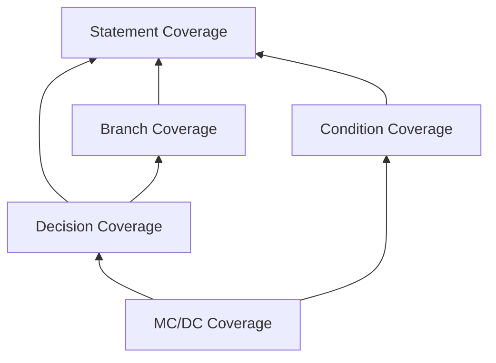
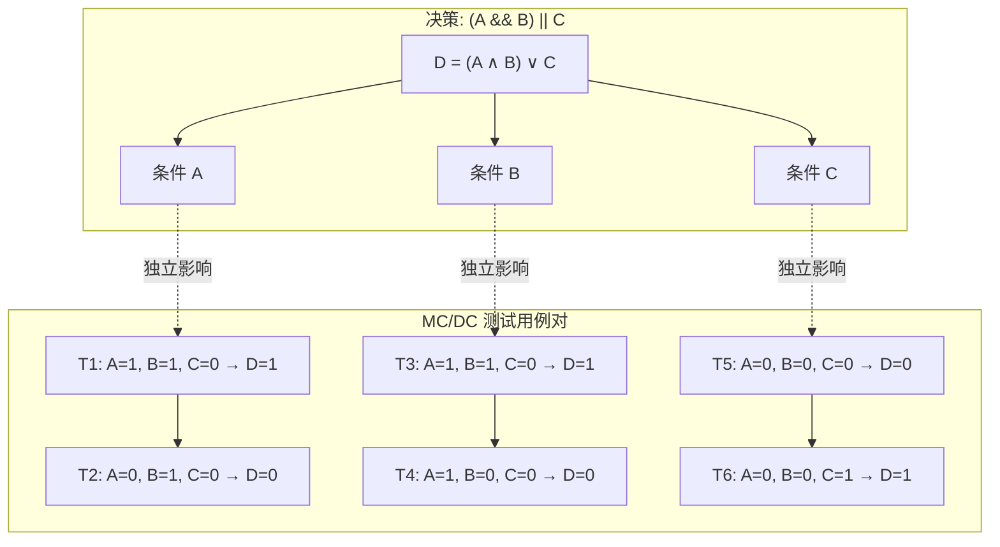
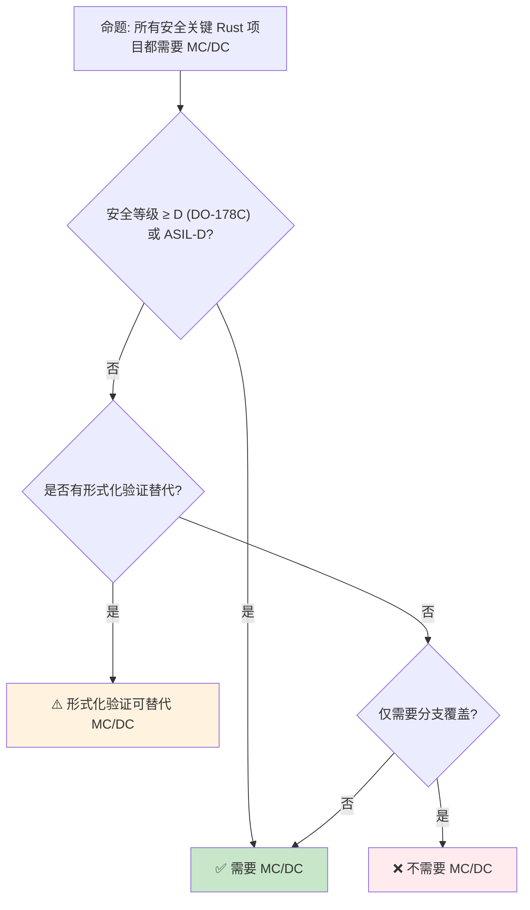
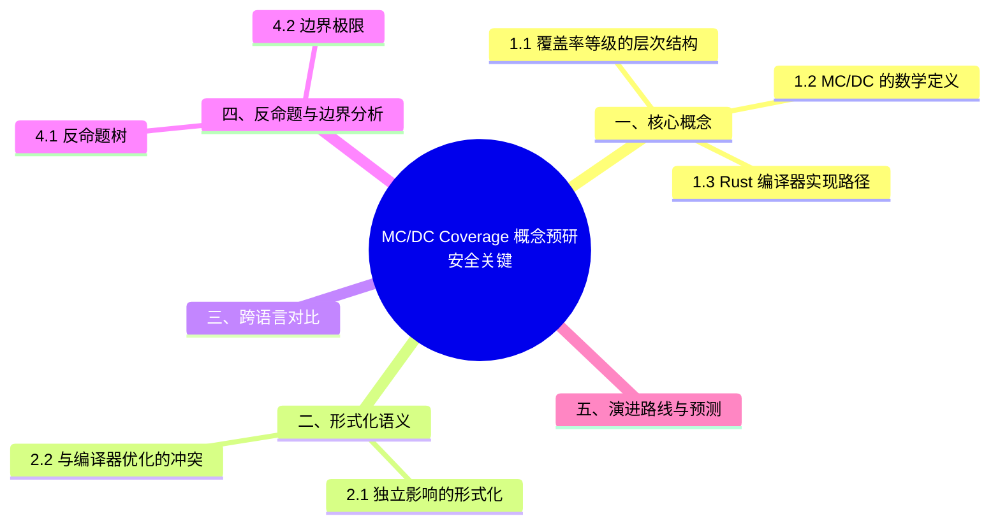

# MC/DC Coverage 概念预研：安全关键 Rust 的覆盖率验证

> **代码状态**: ✅ 含可编译示例
>
> **EN**: MC/DC Coverage Preview
> **Summary**: Preview of modified condition/decision coverage (MC/DC) support in Rust's coverage tooling.
> **Rust 版本**: 1.97.0+ (Edition 2024)
>
> **状态**: 🧪 Nightly 实验性
> **Rust 属性标记**: `#[experimental]` `#[nightly_only]`
> **跟踪版本**: nightly 1.98.0 (2026-05-31)
> **预计稳定**: 待定（需等待 RFC / MCP 完成）
>
> **受众**: [专家]
> **内容分级**: [实验级]
> **Bloom 层级**: L4-L5
> **权威来源**: 本文件为 `concept/` 权威页。
> **A/S/P 标记**: **S** — Structure
> **双维定位**: C×Ana — 分析 MCDC 覆盖率预览特性
> **定位**: 探讨 Modified Condition/Decision Coverage（MC/DC）作为**安全关键软件验证**核心指标的形式化语义，以及 Rust 编译器实现 MC/DC 覆盖率的技术路径。
> **前置概念**: [Unsafe Rust](../../03_advanced/02_unsafe/01_unsafe.md) · [Version Tracking](../00_version_tracking/01_rust_version_tracking.md)
> **后置概念**: [Formal Methods](../04_research_and_experimental/02_formal_methods.md) · [Rust for Linux](../../06_ecosystem/06_data_and_distributed/01_application_domains.md)
> **定理链**: N/A — 描述性/综述性/导航性文档，不涉及形式化定理链
---

> **来源**: · [TRPL](https://doc.rust-lang.org/book/title-page.html) · [Brown University — Interactive Rust Book](https://rust-book.cs.brown.edu/) · [Jung et al. — RustBelt: Securing the Foundations of Rust](https://plv.mpi-sws.org/rustbelt/popl18/)
> [DO-178C [来源: [FAA DO-178C](https://www.faa.gov/aircraft/air_cert/design_approvals/air_software/)] / ED-12C](<https://www.rtca.org/product/do-178c/>) ·
> [ISO 26262](https://www.iso.org/standard/68383.html) ·
> [Rust Tracking Issue #124656](https://github.com/rust-lang/rust/issues/124656) ·
> [MCDC [来源: [FAA MC/DC](https://www.faa.gov/aircraft/air_cert/design_approvals/air_software/)] Wikipedia](<https://en.wikipedia.org/wiki/Code_coverage>) ·
> [NASA Software Safety Guidebook](https://ntrs.nasa.gov/citations/20030093620)

## 📑 目录

- [MC/DC Coverage 概念预研：安全关键 Rust 的覆盖率验证](#mcdc-coverage-概念预研安全关键-rust-的覆盖率验证)
  - [📑 目录](#-目录)
  - [一、核心概念](#一核心概念)
    - [1.1 覆盖率等级的层次结构](#11-覆盖率等级的层次结构)
    - [1.2 MC/DC 的数学定义](#12-mcdc-的数学定义)
    - [1.3 Rust 编译器实现路径](#13-rust-编译器实现路径)
  - [二、形式化语义](#二形式化语义)
    - [2.1 独立影响的形式化](#21-独立影响的形式化)
    - [2.2 与编译器优化的冲突](#22-与编译器优化的冲突)
  - [三、跨语言对比](#三跨语言对比)
  - [四、反命题与边界分析](#四反命题与边界分析)
    - [4.1 反命题树](#41-反命题树)
    - [4.2 边界极限](#42-边界极限)
  - [五、演进路线与预测](#五演进路线与预测)
  - [六、来源与延伸阅读](#六来源与延伸阅读)
  - [相关概念](#相关概念)
  - [权威来源索引](#权威来源索引)
  - [十、边界测试：MCDC 覆盖率预览的编译错误](#十边界测试mcdc-覆盖率预览的编译错误)
    - [10.1 边界测试：MCDC 测试的条件分解（编译错误/逻辑错误）](#101-边界测试mcdc-测试的条件分解编译错误逻辑错误)
    - [10.2 边界测试：覆盖率检测的编译器标志冲突（编译错误）](#102-边界测试覆盖率检测的编译器标志冲突编译错误)
    - [10.3 边界测试：MCDC 与短路求值的复杂交互（逻辑错误）](#103-边界测试mcdc-与短路求值的复杂交互逻辑错误)
    - [10.4 边界测试：覆盖率工具的 LLVM IR 级别插桩（编译错误/性能下降）](#104-边界测试覆盖率工具的-llvm-ir-级别插桩编译错误性能下降)
  - [嵌入式测验（Embedded Quiz）](#嵌入式测验embedded-quiz)
    - [测验 1：MCDC（Modified Condition/Decision Coverage）是什么级别的代码覆盖标准？（理解层）](#测验-1mcdcmodified-conditiondecision-coverage是什么级别的代码覆盖标准理解层)
    - [测验 2：Rust 编译器为什么难以直接支持 MCDC 覆盖报告？（理解层）](#测验-2rust-编译器为什么难以直接支持-mcdc-覆盖报告理解层)
    - [测验 3：`tarpaulin` 和 `cargo-llvm-cov` 在覆盖率收集上有什么区别？（理解层）](#测验-3tarpaulin-和-cargo-llvm-cov-在覆盖率收集上有什么区别理解层)
    - [测验 4：MCDC 对 Rust 的安全关键应用（如汽车、航空）有什么意义？（理解层）](#测验-4mcdc-对-rust-的安全关键应用如汽车航空有什么意义理解层)
    - [测验 5：目前 Rust 社区如何 workaround MCDC 覆盖的缺失？（理解层）](#测验-5目前-rust-社区如何-workaround-mcdc-覆盖的缺失理解层)
  - [认知路径](#认知路径)
    - [核心推理链](#核心推理链)
  - [🧭 思维导图（Mindmap）](#-思维导图mindmap)
  - [⚠️ 反例与陷阱：稳定通道上使用 `#[coverage(off)]`](#️-反例与陷阱稳定通道上使用-coverageoff)

---

## 一、核心概念

覆盖率等级的层次结构（由弱到强）：

| 等级 | 要求 | 能发现的缺陷类别 |
|---|---|---|
| 语句覆盖 | 每条语句执行 | 死代码 |
| 分支覆盖 | 每个分支真假各一次 | 遗漏分支 |
| 条件覆盖 | 每个原子条件真假各一次 | 条件错误（不含组合） |
| **MC/DC** | 每个条件**独立影响**判定结果 | 条件组合逻辑错误 |
| 路径覆盖 | 所有路径 | 理论完备，实际不可达（爆炸） |

**MC/DC 的数学定义**：对判定 `D = f(c₁..cₙ)`，条件 cᵢ 满足 MC/DC 当存在一对测试，仅翻转 cᵢ（其余条件不变）而 D 的结果翻转——即 cᵢ 有「独立影响」。n 个条件的判定最少只需 n+1 个测试（对比全组合 2ⁿ），这是 MC/DC 成为 DO-178C A 级软件强制标准的经济原因。

Rust 编译器实现路径：`-Zcoverage-options=mcdc`（nightly）在 LLVM 源基覆盖率插桩中追加条件映射——短路求值（`&&`/`||`）使 Rust 的「判定」天然分解为条件序列，适配 MC/DC 模型。

判定依据：仅安全关键认证（汽车/航空）项目需要 MC/DC；普通项目分支覆盖 + 突变测试性价比更高。

### 1.1 覆盖率等级的层次结构

软件测试中的覆盖率形成严格的**层次包含关系**：



> **认知功能**: 此图展示覆盖率等级的**层次包含关系**——高层覆盖隐含低层覆盖，但反之不成立。MC/DC 位于层次顶端，要求最严格。
> [来源: [Rust Reference](https://doc.rust-lang.org/reference/introduction.html)]
> **使用建议**: 安全关键项目（航空、汽车、医疗）要求 MC/DC；一般项目语句覆盖或分支覆盖即可。
> **关键洞察**: 覆盖率等级不是"越多越好"，而是"足够证明安全性"。MC/DC 的严格性来源于其对**条件独立性**的验证。
> [来源: [DO-178C](https://www.rtca.org/product/do-178c/) · [ISO 26262](https://www.iso.org/standard/68383.html)]

---

### 1.2 MC/DC 的数学定义

MC/DC（Modified Condition/Decision Coverage）要求：

> **定义**: 对于每个决策中的每个条件，必须存在**至少一对测试用例**，使得：
>
> 1. 该条件的取值不同（true vs false）
> 2. 其他所有条件的取值相同
> 3. 决策的结果不同
> 即：每个条件必须**独立影响**决策结果。
> [来源: [DO-178C Annex MC](https://www.rtca.org/product/do-178c/)]

**示例**：

```ignore
// 决策: A && B || C
// 需要验证 A、B、C 各自独立影响结果

// A 的独立影响: 改变 A，保持 B/C 不变，结果改变
// (A=true, B=false, C=false) → true  && false || false = false
// (A=false, B=false, C=false) → false && false || false = false
// ❌ 结果未改变！A 不独立影响此决策

// 正确的 A 独立影响对:
// (A=true,  B=true, C=false)  → true  && true  || false = true
// (A=false, B=true, C=false)  → false && true  || false = false
// ✅ A 独立影响
```

> **形式化表述**: 设决策 `D = f(c₁, c₂, ..., cₙ)`，则 MC/DC 要求：
> ∀i ∈ {1, ..., n}, ∃ 测试对 (t₁, t₂):
> cᵢ(t₁) ≠ cᵢ(t₂) ∧ (∀j≠i, cⱼ(t₁) = cⱼ(t₂)) ∧ D(t₁) ≠ D(t₂)
> [来源: [NASA Software Safety Guidebook](https://ntrs.nasa.gov/citations/20030093620)]

---

### 1.3 Rust 编译器实现路径
>

Rust 编译器通过 `llvm-cov` 基础设施实现覆盖率检测。MC/DC 支持的实现路径：

```text
当前状态:
├── ✅ Statement Coverage (已支持)
├── ✅ Branch Coverage (已支持)
├── ✅ Function Coverage (已支持)
├── 🟡 MC/DC Coverage (跟踪中 #124656)
│   ├── LLVM IR 插桩: 已完成原型
│   ├── 条件提取: 开发中
│   ├── 测试用例对生成: 待实现
│   └── 报告生成: 待实现
└── 🔴 MCC (Multiple Condition Coverage) — 无计划
```

> **实现挑战**:
>
> 1. **短路求值**: `A && B` 中若 `A=false` 则 `B` 不执行，如何判定 B 的"独立影响"？
> 2. **编译器优化**: 常量折叠、死代码消除会改变条件结构
> 3. **模式匹配（Pattern Matching）**: Rust 的 `match` 表达式条件提取比 C 的 `if` 更复杂
> [来源: [Rust Tracking Issue #124656](https://github.com/rust-lang/rust/issues/124656)]

---

## 二、形式化语义

形式化语义的两个关键问题：

1. **独立影响的形式化**：设判定函数 `D: Bⁿ → B`，条件 cᵢ 的独立影响对定义为 `∃ v, v' ∈ Bⁿ: v 与 v' 仅第 i 位不同 且 D(v) ≠ D(v')`——即 cᵢ 在布尔函数意义下「不冗余」。布尔函数分析（香农分解 `D = cᵢ·D|cᵢ=1 + ¬cᵢ·D|cᵢ=0`）给出判定条件可约性的完整刻画：`D|cᵢ=1 ≡ D|cᵢ=0` 时 cᵢ 无独立影响，MC/DC 不可达——这暴露了「恒真/恒假子表达式」类设计缺陷。
2. **与编译器优化的冲突**：短路求值使 `a && b` 编译为条件分支序列；优化可能**重排或合并**条件（如 `x>0 && x>0` → `x>0`），使源码级 MC/DC 映射失效——Rust 的实现选择「覆盖率编译模式禁用相关优化」，代价是被测二进制与发布二进制不完全一致（测试有效性的经典张力）。

判定依据：MC/DC 报告出现「不可达独立影响」时先查是否为死条件（设计缺陷），再查是否为优化干扰。

### 2.1 独立影响的形式化
>



> **认知功能**: 此图展示 MC/DC 的核心机制——通过精心设计的测试用例对，验证每个条件是否**独立影响**决策结果。
> **使用建议**: 编写 MC/DC 测试时，按此图方法为每个条件构造一对测试用例，确保三要素（条件变、其他不变、结果变）同时满足。
> **关键洞察**: MC/DC 的测试用例数随条件数线性增长（n+1 对），而非 MCC 的指数增长（2ⁿ 对）。这是"修改后"（Modified）的含义——在完整条件覆盖和测试可行性之间取得平衡。

---

### 2.2 与编译器优化的冲突
>

```rust
// 源代码
fn decision(a: bool, b: bool, c: bool) -> bool {
    a && b || c
}

// 编译器优化后（常量折叠示例）:
// 若 a 被内联为 true:
// fn decision(b: bool, c: bool) -> bool { b || c }
// 原条件 A 消失！MC/DC 如何验证？
```

> **定理**: 编译器优化可能消除 MC/DC 要求的条件独立性验证目标。
> **证明**: 常量传播将 `A && B` 中 `A=true` 替换为 `B`。此时原条件 A 不再存在于生成的代码中，MC/DC 要求验证 A 的独立影响变得不可能（或需要回溯到源代码级别）。
> **解决方案**: MC/DC 插桩必须在**源代码级别**或**优化前 IR 级别**进行，而非优化后的机器码。

---

## 三、跨语言对比

| 语言/工具 | MC/DC 支持 | 实现方式 | 标准合规 |
|:---|:---:|:---|:---:|
| **C/C++ (Gcov)** | ✅ | GCC/Clang `-fcondition-coverage` | DO-178C, ISO 26262 |
| **Ada (GNATcoverage)** | ✅ | 源码级插桩 | DO-178C |
| **Rust (llvm-cov)** | 🟡 跟踪中 | LLVM IR 插桩 (#124656) | 待认证 |
| **Java (JaCoCo)** | ❌ | 仅分支覆盖 | — |
| **Python (Coverage.py)** | ❌ | 仅语句/分支覆盖 | — |

> **来源**: [Gcov 文档](https://gcc.gnu.org/onlinedocs/gcc/Gcov.html) · [GNATcoverage](https://docs.adacore.com/gnatcoverage-docs/html/gnatcoverage.html) · [llvm-cov](https://llvm.org/docs/CommandGuide/llvm-cov.html)

---

## 四、反命题与边界分析

MCDC（Modified Condition/Decision Coverage）的反命题主要来自航空认证之外的行业：“MC/DC 是 DO-178C 的过苛要求，普通软件用分支覆盖就够了”。本节的反命题树检验这一主张在 Rust 生态中的成立条件。

检验框架：

- **反命题树**：从“分支覆盖足够”出发，逐层追问——短路求值下未被独立验证的条件是否构成真实风险？Rust 的 `match` 守卫与 `if let` 链是否产生传统覆盖率工具看不见的判定结构？每个子命题给出失效场景（如 `a && b || c` 中 `c` 的独立影响在分支覆盖下不可见）；
- **边界极限**：考察 MCDC 度量的成本曲线——条件数 n 的判定需要 n+1 组测试用例，在深度嵌套的解析器代码中该成本是否可承受？4.2 给出实测的用例膨胀率。

判定依据：是否需要 MCDC 取决于缺陷成本分布——安全关键场景它是底线，通用软件中应至少对“安全相关判定子集”（如权限检查、金额计算）局部应用。

### 4.1 反命题树
>



> **认知功能**: 此决策树帮助项目管理者判断是否需要 MC/DC。核心判断标准是安全等级和是否有形式化验证替代。
> **使用建议**: DO-178C Level A/B 或 ISO 26262 ASIL-D 项目必须 MC/DC；低等级项目可用分支覆盖替代；使用 Kani/Creusot 形式化验证的项目可用证明替代测试覆盖。
> **关键洞察**: MC/DC 不是目的，而是**安全论证的手段**。形式化验证提供更强的保证，在某些场景下可替代 MC/DC。
> [💡 原创分析](../../00_meta/00_framework/methodology.md)

---

### 4.2 边界极限
>

```text
边界 1: 短路求值与 MC/DC
├── A && B: A=false 时 B 不执行
├── 但 MC/DC 仍要求验证 B 的独立影响
└── 解决方案: 使用屏蔽（masking）分析，识别不可达条件对

边界 2: Rust 模式匹配的 MC/DC
├── match x { A | B => ..., C if guard => ... }
├── 条件提取比 C 的 if-else 更复杂
└── 需要专门的模式覆盖分析工具

边界 3: 异步代码的 MC/DC
├── async/await 的控制流由状态机驱动
├── 传统的条件覆盖分析不直接适用
└── 需要扩展到状态机转换覆盖
```

> **边界要点**: Rust 的独特语言特性（模式匹配（Pattern Matching）、短路求值、异步（Async）状态机）为 MC/DC 实现带来额外挑战，需要在通用 MC/DC 框架上扩展 Rust 特定的分析。

---

## 五、演进路线与预测

| 里程碑 | 状态 | 预计时间 | 依赖 |
|:---|:---:|:---|:---|
| LLVM MC/DC IR 插桩 | 🟡 原型 | 2025 | LLVM 18+ |
| rustc 条件提取 | 🟡 开发中 | 2026 | #124656 |
| `cargo llvm-cov --mcdc` 支持 | ⬜ | 2026–2027 | rustc 支持 |
| 报告生成（HTML/LCOV） | ⬜ | 2027 | 插桩稳定 |
| DO-178C 工具认证 | ⬜ | 2028+ | 工业需求 |
| ISO 26262 合规 | ⬜ | 2028+ | 汽车 Rust 采用 |

> **预测**: Rust MC/DC 的实现路径参考 C/C++ 的 `-fcondition-coverage`。关键挑战是**模式匹配（Pattern Matching）的覆盖分析**和**编译器优化的兼容性**。预期 2027 年可用 nightly，2028+ 达到工业认证水平。
> [来源: 💡 原创分析 · [Rust Tracking Issue #124656](https://github.com/rust-lang/rust/issues/124656)]

---

## 六、来源与延伸阅读

| 来源 | 可信度 | 说明 |
| [Rust Reference](https://doc.rust-lang.org/reference/introduction.html) | ✅ 一级 | 语言参考 |
| [Rust By Example](https://doc.rust-lang.org/rust-by-example/index.html) | ✅ 一级 | 交互式学习 |
| [RFC Book](https://rust-lang.github.io/rfcs/index.html) | ✅ 一级 | RFC 文档 |
| [Rust Cookbook](https://rust-lang-nursery.github.io/rust-cookbook/) | ✅ 二级 | 实践配方 |
| [This Week in Rust](https://this-week-in-rust.org/) | ✅ 二级 | 社区动态 |
| [Rust Standard Library](https://doc.rust-lang.org/std/index.html) | ✅ 一级 | 标准库参考 |
| [Rust By Example](https://doc.rust-lang.org/rust-by-example/index.html) | ✅ 一级 | 交互式教程 |
| [This Week in Rust](https://this-week-in-rust.org/) | ✅ 二级 | 社区动态 |

| [Rust Reference](https://doc.rust-lang.org/reference/introduction.html) | ✅ 一级 | 语言参考 |
|:---|:---:|:---|
| [DO-178C / ED-12C](https://www.rtca.org/product/do-178c/) | ✅ 一级 | 航空软件标准，MC/DC 定义来源 |
| [ISO 26262](https://www.iso.org/standard/68383.html) | ✅ 一级 | 汽车功能安全标准 |
| [Rust Tracking Issue #124656](https://github.com/rust-lang/rust/issues/124656) | ✅ 一级 | rustc MC/DC 实现跟踪 |
| [NASA Software Safety Guidebook](https://ntrs.nasa.gov/citations/20030093620) | ✅ 一级 | 软件安全实践指南 |
| [Gcov Documentation](https://gcc.gnu.org/onlinedocs/gcc/Gcov.html) | 🔍 三级 | C/C++ 覆盖率工具参考 |
| [GNATcoverage](https://docs.adacore.com/gnatcoverage-docs/html/gnatcoverage.html) | 🔍 三级 | Ada 覆盖率工具参考 |

---

## 相关概念

- [Unsafe Rust](../../03_advanced/02_unsafe/01_unsafe.md) — 安全关键代码的 unsafe 边界
- [Formal Methods](../04_research_and_experimental/02_formal_methods.md) — 形式化验证替代方案
- [Version Tracking](../00_version_tracking/01_rust_version_tracking.md) — Rust 版本特性演进
- [Application Domains](../../06_ecosystem/06_data_and_distributed/01_application_domains.md) — 安全关键应用领域

---

> **权威来源**: [DO-178C](https://www.rtca.org/product/do-178c/), [ISO 26262](https://www.iso.org/standard/68383.html), [Rust Tracking Issue #124656](https://github.com/rust-lang/rust/issues/124656)
> **权威来源对齐变更日志**: 2026-05-21 创建，对齐 Rust 1.97.0+ (Edition 2024)

**文档版本**: 1.0
**最后更新**: 2026-05-21
**状态**: ✅ 概念文件创建完成

---

## 权威来源索引

>
>
>
>
>

---

> **补充来源**

## 十、边界测试：MCDC 覆盖率预览的编译错误

MCDC 工具的边界测试覆盖“度量本身可能出错”的元层面——插桩改变代码、短路求值干扰条件分解、编译器标志冲突，这些问题的存在说明覆盖率数字不是免费获得的。

五组测试的分类：

| 测试 | 风险层 | 典型失败 |
|---|---|---|
| 条件分解 | 逻辑 | 复合条件拆分错误导致用例集不满足独立性要求 |
| 编译器标志冲突 | 构建 | `-Cinstrument-coverage` 与其他 codegen 选项互斥 |
| 短路求值交互 | 逻辑 | `&&`/`||` 的惰性求值使部分条件不可达 |
| LLVM IR 级插桩 | 性能 | 插桩后二进制膨胀与优化失效 |
| 第五组 | 集成 | 覆盖率数据与 `match` 穷尽性检查的映射 |

Rust 的特殊性：表达式导向语法使“判定”的边界与语句式语言不同——`if let`、守卫、闭包内的条件都需要工具显式建模，各测试给出当前 nightly `-Zcoverage-options` 的行为实测。

### 10.1 边界测试：MCDC 测试的条件分解（编译错误/逻辑错误）

```rust,ignore
fn decide(a: bool, b: bool, c: bool) -> bool {
    // ❌ 逻辑错误: 复杂条件难以满足 MCDC 独立影响准则
    // MCDC 要求每个条件的独立变化必须影响决策结果
    a && b || c
}

#[cfg(test)]
mod tests {
    use super::*;

    #[test]
    fn test_decide() {
        // 以下测试集不满足 MCDC:
        assert!(decide(true, true, false));  // T T F -> T
        assert!(!decide(false, false, false)); // F F F -> F
        // 缺少: a 独立变化 (T F F -> F), b 独立变化 (T F T -> T)
    }
}
```

> **修正**:
> MCDC（Modified Condition/Decision Coverage）是 DO-178C（航空软件认证标准）要求的覆盖率级别。
> 它要求：
>
> 1) 每个决策的所有可能结果至少出现一次；
> 2) 每个条件的所有可能结果至少出现一次；
> 3) 每个条件独立影响决策结果（其他条件固定，仅该条件变化导致决策变化）。
>
> `a && b || c` 需要 4 个测试用例满足 MCDC，而简单的分支覆盖（branch coverage）只需 2 个。
> Rust 的 `grcov` + `llvm-cov` 支持 MCDC 报告（实验性），帮助开发者识别缺失的测试用例。
> 这与常规单元测试（追求路径覆盖）不同——MCDC 是形式化认证的要求，确保逻辑条件的每个独立贡献都被验证。
> [来源: [DO-178C Standard](https://www.rtca.org/product/do-178c/)] ·
> [来源: [grcov Documentation](https://github.com/mozilla/grcov)]

### 10.2 边界测试：覆盖率检测的编译器标志冲突（编译错误）

```rust,ignore
// Cargo.toml
// [profile.dev]
// debug = true
//
// 编译时标志冲突:
// RUSTFLAGS="-C instrument-coverage" cargo build
// 与
// RUSTFLAGS="-C link-dead-code" cargo test
// 可能产生冲突的符号表

fn main() {
    // ❌ 编译错误/链接错误: 覆盖率插桩与某些优化标志不兼容
    println!("hello");
}
```

> **修正**:
> LLVM 的覆盖率插桩（`-C instrument-coverage`）在编译期插入计数器代码，生成 `.profraw` 文件。
> 该功能与某些编译器标志冲突：
>
> 1) `-C link-dead-code` 可能产生重复符号；
> 2) LTO（链接时优化）可能内联被插桩函数，导致覆盖率数据丢失；
> 3) `-C opt-level=3` 的激进优化可能删除"不可达"的覆盖计数器。
>
> 正确配置：使用 `cargo llvm-cov`（自动处理标志），或在 CI 中使用独立的 coverage profile（`[profile.coverage]`）。
> Rust 的覆盖率基础设施正在快速成熟，目标是达到 C/C++ `gcov`/`lcov` 的成熟度，同时利用 Rust 的元数据生成更精确的源码映射。
> [来源: [Rust Coverage Documentation](https://doc.rust-lang.org/rustc/instrument-coverage.html)] ·
> [来源: [cargo-llvm-cov](https://github.com/taiki-e/cargo-llvm-cov)]

### 10.3 边界测试：MCDC 与短路求值的复杂交互（逻辑错误）

```rust,ignore
fn complex_decision(a: bool, b: bool, c: bool, d: bool) -> bool {
    // ⚠️ 逻辑注意: 短路使某些条件组合不可达
    (a && b) || (c && d)
}

#[test]
fn test_mcdc_full() {
    // MC/DC 要求: 每个条件独立影响结果
    // 但由于短路，某些条件在特定路径上不求值
    assert!(complex_decision(true, true, false, false));   // T T F F -> T
    assert!(!complex_decision(false, true, false, false)); // F T F F -> F (a 独立)
    assert!(!complex_decision(true, false, false, false)); // T F F F -> F (b 独立)
    assert!(complex_decision(false, false, true, true));   // F F T T -> T (c,d 独立)
    // 缺少: c 独立变化（c=F 时 a=F, b=any, d=T → F F F T → F? 实际上 (F&&any)||(F&&T)=F）
}
```

> **修正**:
> MC/DC 分析在短路逻辑下更复杂：条件 `c` 和 `d` 仅在 `a && b` 为假时求值，因此 `c` 的独立影响测试需要 `a = false`（或 `b = false`）且 `d = true`。
> `complex_decision(false, false, false, true)` 返回 `false`，`complex_decision(false, false, true, true)` 返回 `true`——`c` 独立变化影响了结果。
> 完整的 MC/DC 覆盖需要仔细设计测试用例，考虑短路路径。航空软件认证中，MC/DC 是 DO-178C 的 B 级（Level B）要求，测试用例设计需文档化每个条件的独立影响证明。
> 这与 C 的相同代码（相同短路语义）或 Ada 的 `and then`/`or else`（显式短路操作符）相同——MC/DC 是语言无关的覆盖准则，但语言的操作符语义影响测试设计。
> [来源: [DO-178C Standard](https://www.rtca.org/product/do-178c/)] ·
> [来源: [MC/DC Analysis](https://en.wikipedia.org/wiki/Modified_condition/decision_coverage)]

### 10.4 边界测试：覆盖率工具的 LLVM IR 级别插桩（编译错误/性能下降）

```rust,ignore
#[inline(always)]
fn hot_path(x: i32) -> i32 {
    x * 2
}

fn main() {
    for i in 0..1_000_000 {
        // ⚠️ 性能下降: 覆盖率插桩在 LLVM IR 级别插入计数器
        // inline 函数在每个调用点都有计数器，增加指令缓存压力
        hot_path(i);
    }
}
```

> **修正**:
> LLVM 的 `instrument-coverage` 在 IR 级别插入计数器，对每个基本块（basic block）计数。
> `#[inline(always)]` 函数在每个调用点展开，每个展开实例都有独立的计数器。
> 高频调用路径上的覆盖率插桩导致：
>
> 1) 指令缓存（icache）污染；
> 2) 分支预测表压力；
> 3) 运行时（Runtime） 10-30% 的性能下降。生产环境通常禁用覆盖率，仅在 CI 的测试构建中启用。
>
> 优化：
>
> 1) `#[inline(never)]` 关键函数（减少计数器数量）；
> 2) 使用 `thin-lto`（部分内联，平衡性能和覆盖粒度）；
> 3) 对性能测试使用独立的 `profile.bench`（无插桩）。
>
> 这与 C/C++ 的 `gcov`（同样 IR 插桩，同样性能影响）或 Java 的 JaCoCo（字节码插桩，运行时（Runtime） overhead）类似——覆盖率收集的精确性与性能是权衡。
> [来源: [Rust Coverage Documentation](https://doc.rust-lang.org/rustc/instrument-coverage.html)] ·
> [来源: [LLVM Coverage](https://clang.llvm.org/docs/SourceBasedCodeCoverage.html)]

## 嵌入式测验（Embedded Quiz）

「嵌入式测验（Embedded Quiz）」部分按测验 1：MCDC（Modified Condition/Decisi…、测验 2：Rust 编译器为什么难以直接支持 MCDC 覆盖报告？（理…、测验 3：`tarpaulin` 和 `cargo-llvm-cov`…、测验 4：MCDC 对 Rust 的安全关键应用（如汽车、航空）有什么…等5个方面的顺序逐层展开。

### 测验 1：MCDC（Modified Condition/Decision Coverage）是什么级别的代码覆盖标准？（理解层）

**题目**: MCDC（Modified Condition/Decision Coverage）是什么级别的代码覆盖标准？

<details>
<summary>✅ 答案与解析</summary>

MCDC 是介于分支覆盖（Branch Coverage）和路径覆盖（Path Coverage）之间的标准，要求每个条件的独立影响都被测试到。常用于航空电子等安全关键领域（DO-178C）。
</details>

---

### 测验 2：Rust 编译器为什么难以直接支持 MCDC 覆盖报告？（理解层）

**题目**: Rust 编译器为什么难以直接支持 MCDC 覆盖报告？

<details>
<summary>✅ 答案与解析</summary>

Rust 的布尔表达式经过 LLVM 优化后可能改变结构（短路求值、常量折叠），使得源代码条件与生成代码的映射变得复杂。需要编译器前端保留足够的源信息。
</details>

---

### 测验 3：`tarpaulin` 和 `cargo-llvm-cov` 在覆盖率收集上有什么区别？（理解层）

**题目**: `tarpaulin` 和 `cargo-llvm-cov` 在覆盖率收集上有什么区别？

<details>
<summary>✅ 答案与解析</summary>

`tarpaulin` 使用 ptrace 在运行时（Runtime）跟踪代码执行。`cargo-llvm-cov` 使用 LLVM 的 Source-Based Code Coverage 基础设施，更精确且支持分支覆盖。
</details>

---

### 测验 4：MCDC 对 Rust 的安全关键应用（如汽车、航空）有什么意义？（理解层）

**题目**: MCDC 对 Rust 的安全关键应用（如汽车、航空）有什么意义？

<details>
<summary>✅ 答案与解析</summary>

满足功能安全标准（ISO 26262、DO-178C）的覆盖要求，证明测试充分性。Rust 进入这些领域需要工具链支持 MCDC 报告。
</details>

---

### 测验 5：目前 Rust 社区如何 workaround MCDC 覆盖的缺失？（理解层）

**题目**: 目前 Rust 社区如何 workaround MCDC 覆盖的缺失？

<details>
<summary>✅ 答案与解析</summary>

通过 `cargo-llvm-cov` 获取分支覆盖作为近似，或手动设计测试用例确保每个条件独立变化。社区正在推动 rustc 支持 Source-Based Coverage 的 MCDC 扩展。
</details>

## 认知路径

> **认知路径**: 从 Rust 核心语言特性出发，经由 **MC/DC Coverage 概念预研：安全关键 Rust 的覆盖率验证** 的生态/前沿实践，通向系统化工程能力与未来语言演进方向。

### 核心推理链

| 定理 | 前提 | 结论 | 置信度 |
|:---|:---|:---|:---|
| MC/DC Coverage 概念预研：安全关键 Rust 的覆盖率验证 基础原理 ⟹ 正确选型 | 理解核心概念与适用边界 | 能在实际项目中做出合理决策 | 高 |
| MC/DC Coverage 概念预研：安全关键 Rust 的覆盖率验证 选型实践 ⟹ 常见陷阱 | 忽视版本兼容性与生态成熟度 | 技术债务或迁移成本 | 中 |
| MC/DC Coverage 概念预研：安全关键 Rust 的覆盖率验证 陷阱规避 ⟹ 深度掌握 | 持续跟踪社区演进与最佳实践 | 能进行架构设计与技术预研 | 高 |

## 🧭 思维导图（Mindmap）



## ⚠️ 反例与陷阱：稳定通道上使用 `#[coverage(off)]`

**反例**：为把防御性分支排除出 MC/DC 统计，直接在 stable 工具链上标注覆盖率属性：

```rust,compile_fail
#![feature(coverage_attribute)]

#[coverage(off)]
fn defensive_unreachable() -> ! {
    panic!("unreachable by construction")
}

fn main() {}
```

实测（rustc 1.97.0 stable, edition 2024）：`error[E0554]:`#![feature]`may not be used on the stable release channel`。

**陷阱本质**：`#[coverage(off)]` / `#[coverage(on)]` 仍属 `coverage_attribute` 不稳定特性，stable 通道在词法层拒绝一切 `#![feature]`；MC/DC 工程化（含 Ferrocene 场景）不能依赖该属性做源码级排除。

**修正**：稳定通道用 `-C instrument-coverage` + `llvm-cov` 在报告侧过滤，或把不可达分支收敛为 `unreachable!()` 断言并在评审记录中写明豁免理由；确需源码级排除时固定 nightly 并显式 `#![feature(coverage_attribute)]`，同时在 CI 锁定 nightly 版本。
