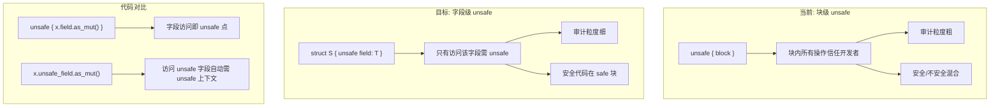
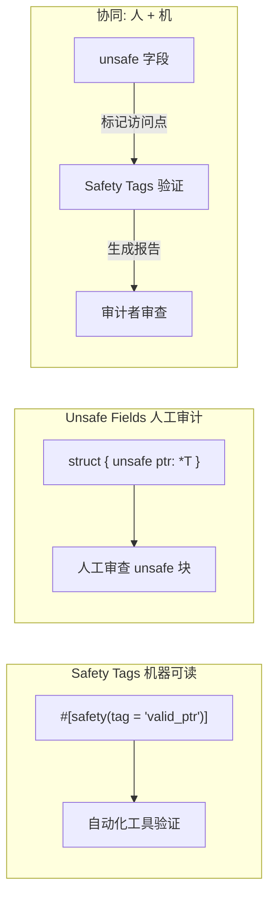
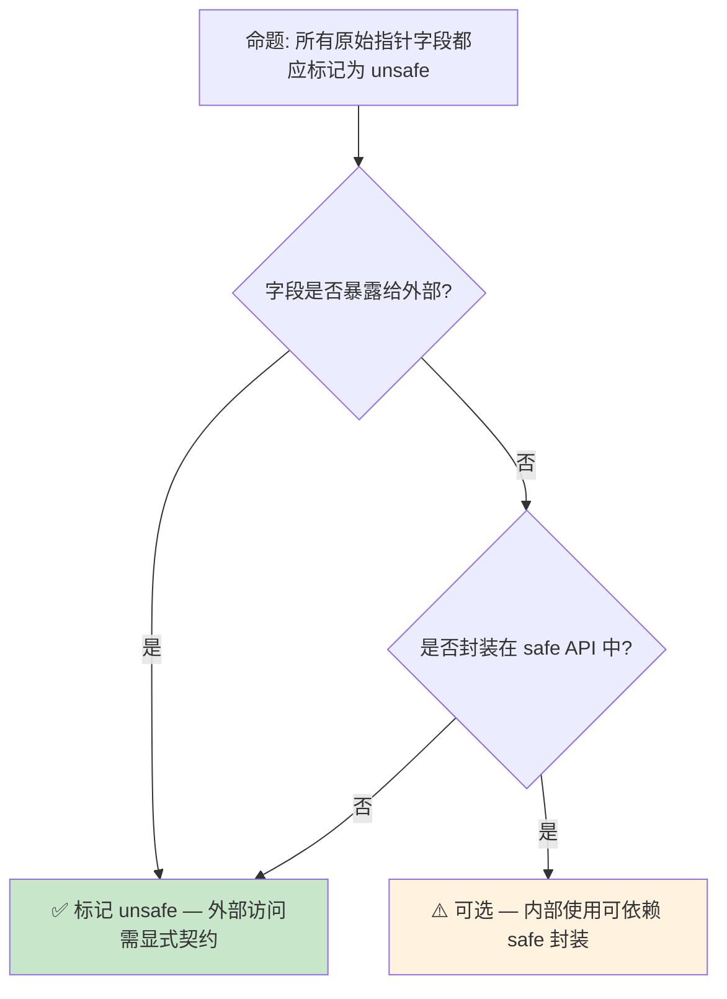
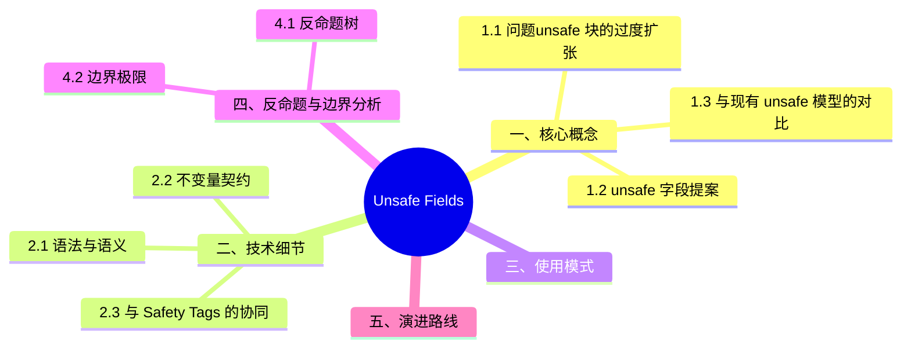

# Unsafe Fields 预研：字段级安全边界的精确标注

> **内容重叠提示**: 本文与 [`docs/08_usage_guides/25_unsafe_fields_preview.md`](../../../docs/08_usage_guides/25_unsafe_fields_preview.md) 内容高度重叠。`docs/` 版本提供专项深入；`concept/` 版本为项目权威主轨。
> **代码状态**: [示例级 — 已补充代码]
>
> **EN**: Unsafe Fields Preview
> **Summary**: Preview of unsafe fields: marking individual fields as requiring unsafe access.
> **Rust 版本**: 1.97.0+ (Edition 2024)
>
> **状态**: 🧪 Nightly 实验性
> **Rust 属性标记**: `#[experimental]` `#[nightly_only]`
> **跟踪版本**: nightly 1.98.0 (2026-05-31)
> **预计稳定**: 待定（需等待 RFC / MCP 完成）
>
> **受众**: [专家]
> **内容分级**: [实验级]
> **Bloom 层级**: L4-L5
> **权威来源**: 本文件为 `concept/` 权威页。
> **A/S/P 标记**: **S** — Structure
> **双维定位**: C×Ana — 分析 Unsafe Fields 预览特性
>
> **定位**:
>
> 探讨 Rust 中引入 **unsafe
> [来源: [Rust Unsafe](https://doc.rust-lang.org/book/ch19-01-unsafe-rust.html)]
> [来源: [Rust Nomicon](https://doc.rust-lang.org/nomicon/index.html)]
> [来源: [Rust Reference — Unsafe](https://doc.rust-lang.org/reference/unsafe-keyword.html)]
> field [来源: [Rust RFC - Unsafe Fields](https://github.com/rust-lang/rfcs/pull/3458)]** 的提案
>
> ——允许在结构体（Struct）字段级别标记 `unsafe`，将 `unsafe` 的粒度从**代码块**细化到**字段访问**，提升 unsafe Rust 的局部性和可审计性。
> **前置概念**:
>
> [Unsafe](../../03_advanced/02_unsafe/01_unsafe.md) ·
> [Ownership](../../01_foundation/01_ownership_borrow_lifetime/01_ownership.md) ·
> [Type System](../../01_foundation/02_type_system/01_type_system.md)
>
> **后置概念**: [Safety Tags](03_safety_tags_preview.md)
> **定理链**: N/A — 描述性/综述性/导航性文档，不涉及形式化定理链
---

> **来源**: · [Brown University — Interactive Rust Book](https://rust-book.cs.brown.edu/) · [Jung et al. — RustBelt: Securing the Foundations of Rust](https://plv.mpi-sws.org/rustbelt/popl18/) · [Itanium C++ ABI](https://itanium-cxx-abi.github.io/cxx-abi/abi.html)
> [Rust RFC — Unsafe Fields](https://github.com/rust-lang/rfcs/pull/3458) ·
> [Rustonomicon — Unsafe Rust](https://doc.rust-lang.org/nomicon/index.html) ·
> [Unsafe Code Guidelines](https://rust-lang.github.io/unsafe-code-guidelines/) ·
> [Rust Internals — Unsafe Field Discussion](https://internals.rust-lang.org/)
> **前置依赖**: [Rust vs C++](../../05_comparative/01_systems_languages/01_rust_vs_cpp.md)
> **前置依赖**: [Toolchain](../../06_ecosystem/00_toolchain/01_toolchain.md)

## 📑 目录

- [Unsafe Fields 预研：字段级安全边界的精确标注](#unsafe-fields-预研字段级安全边界的精确标注)
  - [📑 目录](#-目录)
  - [一、核心概念](#一核心概念)
    - [1.1 问题：unsafe 块的过度扩张](#11-问题unsafe-块的过度扩张)
    - [1.2 `unsafe` 字段提案](#12-unsafe-字段提案)
    - [1.3 与现有 unsafe 模型的对比](#13-与现有-unsafe-模型的对比)
  - [二、技术细节](#二技术细节)
    - [2.1 语法与语义](#21-语法与语义)
    - [2.2 不变量契约](#22-不变量契约)
    - [2.3 与 Safety Tags 的协同](#23-与-safety-tags-的协同)
  - [三、使用模式](#三使用模式)
  - [四、反命题与边界分析](#四反命题与边界分析)
    - [4.1 反命题树](#41-反命题树)
    - [4.2 边界极限](#42-边界极限)
  - [五、演进路线](#五演进路线)
  - [六、来源与延伸阅读](#六来源与延伸阅读)
  - [相关概念](#相关概念)
  - [权威来源索引](#权威来源索引)
  - [十、边界测试：Unsafe Fields 预览的编译错误](#十边界测试unsafe-fields-预览的编译错误)
    - [10.1 边界测试：unsafe 字段的显式访问要求（编译错误）](#101-边界测试unsafe-字段的显式访问要求编译错误)
    - [10.2 边界测试：unsafe 字段与 Drop 的交互（运行时 UB）](#102-边界测试unsafe-字段与-drop-的交互运行时-ub)
    - [10.3 边界测试：unsafe 字段与 `#[repr(C)]` 的交互（编译错误）](#103-边界测试unsafe-字段与-reprc-的交互编译错误)
    - [10.4 边界测试：unsafe 字段与不变式的文档化（逻辑错误）](#104-边界测试unsafe-字段与不变式的文档化逻辑错误)
  - [嵌入式测验（Embedded Quiz）](#嵌入式测验embedded-quiz)
    - [测验 1：`unsafe` 字段提案解决的是什么问题？（理解层）](#测验-1unsafe-字段提案解决的是什么问题理解层)
    - [测验 2：`unsafe` 字段与 `unsafe` 函数在语义上有什么相似之处？（理解层）](#测验-2unsafe-字段与-unsafe-函数在语义上有什么相似之处理解层)
    - [测验 3：这个特性如何帮助封装 unsafe 代码？（理解层）](#测验-3这个特性如何帮助封装-unsafe-代码理解层)
    - [测验 4：`unsafe` 字段与 `unsafe impl` 有什么关系？（理解层）](#测验-4unsafe-字段与-unsafe-impl-有什么关系理解层)
    - [测验 5：目前这个特性的主要反对意见是什么？（理解层）](#测验-5目前这个特性的主要反对意见是什么理解层)
  - [认知路径](#认知路径)
    - [核心推理链](#核心推理链)
  - [🧭 思维导图（Mindmap）](#-思维导图mindmap)

---

## 一、核心概念
>
>

### 1.1 问题：unsafe 块的过度扩张
>

当前 Rust 中，`unsafe` 的粒度是**代码块**（block）。即使只有一行代码需要 unsafe，整个块都被标记为 unsafe：

```rust,ignore
// 当前 Rust: 整个块都是 unsafe（概念示例）
unsafe {
    // 只有这行真正需要 unsafe
    let raw_ptr = self.unsafe_field.as_ptr();
    // 但这行其实安全
    let len = self.safe_field.len();
    // 这行也安全
    println!("processing...");
}
```

> **核心痛点**:
>
> 1. **审计困难**: `unsafe { }` 块中混合了安全和不安全代码，审计者需逐行辨别
> 2. **局部性丧失**: unsafe 的"原因"（哪个字段/操作）在代码中不直接可见
> 3. **重构风险**: 修改 unsafe 块中的"安全"代码时，容易忽略块内其他代码的不变假设
> [来源: [Rust RFC 3458](https://github.com/rust-lang/rfcs/pull/3458)]

---

### 1.2 `unsafe` 字段提案
>



> **认知功能**: 此图对比块级 unsafe 与字段级 unsafe 的**审计粒度差异**——字段级 unsafe 将安全责任从"代码区域"下推到"数据结构定义"。
> [来源: [Rust Reference](https://doc.rust-lang.org/reference/introduction.html)]
> **使用建议**: 对于包含原始指针（Raw Pointer）、手动内存管理字段的结构体（Struct），使用 `unsafe` 字段标记；纯安全字段保持普通声明。
> **关键洞察**: `unsafe` 字段将**不变量文档化**从注释/文档转移到类型系统（Type System）——字段声明即安全契约声明。
> [来源: [Rust [RFC 3458](https://rust-lang.github.io/rfcs//3458-unsafe-fields.html) — Motivation](https://github.com/rust-lang/rfcs/pull/3458)]

---

### 1.3 与现有 unsafe 模型的对比
>

```text
Rust unsafe 模型的演进层次:

  L1: 函数级 unsafe (当前)
       └── unsafe fn f() — 整个函数体信任开发者

  L2: 块级 unsafe (当前)
       └── unsafe { expr } — 块内表达式信任开发者

  L3: 操作级 unsafe (当前，部分)
       └── *raw_ptr, std::ptr::read, etc. — 特定操作需要 unsafe 块

  L4: 字段级 unsafe (提案)
       └── struct S { unsafe field: T } — 访问该字段需要 unsafe 上下文

优势对比:
  - L1-L3: unsafe 的"原因"在代码中分散，需开发者记忆/注释
  - L4: unsafe 的"原因"在数据结构定义中集中，自文档化
```

> **设计哲学**: `unsafe` 字段不是替代块级 unsafe，而是**补充**——将"数据结构层面的不安全"显式化，使 API 契约更清晰。
> [来源: [Unsafe Code Guidelines](https://rust-lang.github.io/unsafe-code-guidelines/)]

---

## 二、技术细节

Unsafe Fields 提案把 `unsafe` 从“块级/函数级”细化到“字段级”：某些字段的读写本身就违反类型不变量（如 `Vec` 的 `len` 字段、自引用（Reference）结构的指针字段），应当每次访问都显式 `unsafe`，而非依赖模块（Module）级约定。本节技术细节围绕这一粒度变化展开。

三个技术层面的相互关系：

- **语法与语义**：`unsafe field` 声明使该字段的所有读写都必须在 `unsafe` 上下文中，编译器在 MIR 层面插入访问标记；
- **不变量契约**：字段级 unsafe 的本质是把“类型不变量由哪些字段承载”显式化——`Vec` 的不变量是 `len ≤ cap`，因此 `len`/`cap`/`ptr` 都应是 unsafe 字段；
- **与 Safety Tags 的协同**：Safety Tags 标注 unsafe 块“为什么安全”，unsafe fields 标注数据“为什么危险”，两者结合可机器检查“危险数据的每次访问是否有安全论证”。

阅读 2.1 的语法示例时，对照现有标准库源码（如 `Vec`/`String` 内部）思考哪些字段按此提案应标记为 unsafe。

### 2.1 语法与语义
>

```rust,ignore
// 声明 unsafe 字段
struct RawBuffer {
    unsafe ptr: *mut u8,      // 访问此字段需要 unsafe 上下文
    len: usize,               // 普通字段，安全访问
    capacity: usize,          // 普通字段
}

impl RawBuffer {
    fn get_len(&self) -> usize {
        self.len  // ✅ 安全访问
    }

    fn get_ptr(&self) -> *mut u8 {
        self.ptr  // ❌ 编译错误: 访问 unsafe 字段需要 unsafe 块
    }

    fn get_ptr_unsafe(&self) -> *mut u8 {
        unsafe { self.ptr }  // ✅ 显式标记
    }
}
```

> **语义规则**:
>
> 1. `unsafe` 字段的**读/写/借用（Borrowing）**都需要 unsafe 上下文
> 2. `unsafe` 字段的**地址取址**（`&self.unsafe_field`）也需要 unsafe
> 3. 结构体（Struct）的**字面量构造**中初始化 unsafe 字段需要 unsafe 块
> 4. `unsafe` 不影响字段的**类型**，只影响**访问权限**

当前稳定 Rust 中等价的写法（无字段级 unsafe，所有访问都是 safe，依赖文档约定）：

```rust
use std::mem::MaybeUninit;

struct MiniVec<T> {
    data: Box<[MaybeUninit<T>]>,
    len: usize,
}

impl<T> MiniVec<T> {
    fn push(&mut self, value: T) {
        let cap = self.data.len();
        if self.len == cap { panic!("capacity exceeded"); }
        self.data[self.len].write(value);
        self.len += 1;
    }
}
```

nightly `unsafe_fields` 预览写法：

```rust,ignore
#![feature(unsafe_fields)]

use std::mem::MaybeUninit;

struct MiniVec<T> {
    // SAFETY: data[0..len) 必须处于有效状态
    unsafe data: Box<[MaybeUninit<T>]>,
    // SAFETY: len <= data.len()
    unsafe len: usize,
}

impl<T> MiniVec<T> {
    fn push(&mut self, value: T) {
        unsafe {
            // 对 unsafe 字段的读写必须位于 unsafe 上下文中
            let cap = self.data.len();
            if self.len == cap { panic!("capacity exceeded"); }
            self.data[self.len].write(value);
            self.len += 1;
        }
    }
}
```

---

### 2.2 不变量契约
>

```text
unsafe 字段的不变量模式:

  struct String {
      unsafe buf: RawVec<u8>,  // buf.ptr 必须指向有效内存
      len: usize,              // len <= buf.capacity
  }

  // 不变量: buf.ptr 指向的内存区域大小至少为 buf.capacity
  //         前 len 个字节是有效的 UTF-8

  // unsafe 字段的语义: 任何访问此字段的代码必须维持上述不变量
  // 编译器不验证不变量，但 unsafe 标记强制所有访问点显式声明"我知道契约"
```

> **技术要点**: `unsafe` 字段是一种**轻量级契约机制**——它不像形式化验证那样证明不变量，但强制所有可能破坏不变量的代码路径通过 `unsafe` 块显式标记，便于人工审计。
> [来源: [Unsafe Code Guidelines — Glossary](https://rust-lang.github.io/unsafe-code-guidelines//glossary.html)]

---

### 2.3 与 Safety Tags 的协同
>



> **认知功能**: 此图展示 unsafe fields 与 Safety Tags 的**互补关系**——unsafe fields 解决"哪些代码需要审查"的问题，Safety Tags 解决"如何自动验证"的问题。
> **关键洞察**: unsafe fields 是 Safety Tags 的**前置基础设施**——没有字段级标记，自动化工具难以精确关联契约与代码位置。
> [来源: [Safety Tags Preview](03_safety_tags_preview.md)]

---

## 三、使用模式

```text
模式 1: 原始指针封装
  struct Buffer {
      unsafe data: *mut u8,
      len: usize,
  }
  // 所有通过 data 的内存操作都需 unsafe 块，len 的操作安全

模式 2: 手动 Union 访问
  union Value {
      unsafe ptr: *mut dyn Any,
      int: usize,
  }
  // 访问 ptr 需 unsafe，访问 int 安全

模式 3: 外部资源句柄
  struct FileHandle {
      unsafe fd: libc::c_int,
      path: PathBuf,
  }
  // fd 的读写操作需 unsafe（可能破坏 OS 状态），path 安全

模式 4: 内部可变性标记
  struct SyncCell<T> {
      unsafe value: UnsafeCell<T>,
      initialized: bool,
  }
  // value 的内部访问需 unsafe，initialized 状态检查安全
```

> **最佳实践**: `unsafe` 字段应用于**维护外部不变量**的字段（如原始指针（Raw Pointer）、外部资源句柄）。纯内部计算状态不应标记为 unsafe。
> [来源: [Rustonomicon — Data Layout](https://doc.rust-lang.org/nomicon/data.html)]

---

## 四、反命题与边界分析

Unsafe Fields 的核心争议是粒度：批评者认为字段级 unsafe 会把 unsafe 代码的噪音放大到不可读，支持者认为现有块级 unsafe 把“哪些操作真正危险”淹没在大块代码中。本节反命题树把争议分解为可检验的子命题。

检验框架：

- **反命题树**：从“字段级 unsafe 提高审计效率”这一命题出发，检验三个子命题——审计面是否真实缩小（unsafe 块数量 vs unsafe 访问点数）、误报率（安全访问被迫写 unsafe 的比例）、以及与现有代码的兼容性（标准库需改动多少处）；
- **边界极限**：构造两个极端——全部字段都 unsafe 的退化情形（粒度失去意义）与仅一个字段 unsafe 的理想情形，观察提案在两端的效用变化。

当前结论预览：提案对标准库与 unsafe 密集 crate（如 `smallvec`、`bytes`）收益明确，对普通业务代码影响接近零——这决定了它的优先级低于更广义的 unsafe  ergonomics 工作。

### 4.1 反命题树
>



> **认知功能**: 此决策树帮助判断是否应将字段标记为 unsafe。核心判断标准是**外部可访问性**和**safe API 封装程度**。
> **使用建议**: 公开结构体（Struct）中所有原始指针（Raw Pointer）字段都应 unsafe；私有结构体中若通过 safe 方法完全封装，可酌情省略。
> **关键洞察**: unsafe 字段的价值与**封装程度**成反比——完全封装的内部字段不需要 unsafe 标记，因为外部无法直接访问。
> [💡 原创分析](../../00_meta/00_framework/methodology.md)

---

### 4.2 边界极限
>

```text
边界 1: unsafe 字段不保证安全
├── 标记 unsafe 不验证任何不变量
├── 只是强制访问点显式声明
└── 与现有 unsafe 块语义一致：信任开发者

边界 2: 与 unsafe impl 的交互
├── unsafe impl Trait for Type 不受 unsafe 字段影响
├── unsafe fn 中访问 unsafe 字段仍需 unsafe 块（双重标记）
└── 设计争议: 是否应在 unsafe fn 中自动允许访问 unsafe 字段

边界 3: 派生宏的限制
├── #[derive(Clone)] 等如何处理 unsafe 字段?
├── 方案: 派生宏自动为 unsafe 字段生成 unsafe 块
└── 边界: 自定义派生宏需特别处理 unsafe 字段

边界 4: 与 Pin/Unpin 的交互
├── Pin<&mut Self> 中访问 unsafe 字段需要 unsafe
├── 但 Pin 的内存安全 [来源: [Rust Safety](https://www.rust-lang.org/policies/security)]保证与 unsafe 字段的契约是独立的
└── 两者结合时，unsafe 块中需同时维持两种契约
```

> **边界要点**: unsafe fields 是**语法糖级别的改进**，不改变 Rust 的安全模型本质。它只是将"哪个字段不安全"的信息从文档/注释下推到类型声明。
> [来源: [Rust [RFC 3458](https://rust-lang.github.io/rfcs//3458-unsafe-fields.html) — Drawbacks](https://github.com/rust-lang/rfcs/pull/3458)]

---

## 五、演进路线

| 里程碑 | 状态 | 预计时间 | 说明 |
|:---|:---:|:---|:---|
| [RFC 3458](https://rust-lang.github.io/rfcs//3458-unsafe-fields.html) 提交 | ✅ | 2023 | 初始提案 |
| 社区讨论 | ✅ | 2023-2024 | 语法和语义反馈 |
| **RFC 已接受** | ✅ | 2026-02 | Jack Wrenn 确认 RFC 被接受，开始准备 2026 持续目标 |
| **Clippy 扩展支持** | 🔄 | 2026-04 | rust-clippy#16767 已开，等待 t-clippy review |
| 编译器原型 | ⬜ | 2026-2027 | 实现复杂度高，优先级中低 |
| 与 Safety Tags 集成 | ⬜ | 2027+ | 字段级契约机器可读化 |
| 稳定化 | ⬜ | 2028+ | 依赖实际使用反馈 |

> **Rust Project Goals 2026 状态**: Continued（持续中）
>
> - **负责人**: Jack Wrenn, Jacob Pratt, Luca Versari
> - **Champions**: compiler (Jack Wrenn), lang (Scott McMurray)
> - **来源**: [Rust Project Goals 2026 April Update](https://blog.rust-lang.org/2026/05/18/project-goals-2026-04/)
> **预测**: unsafe fields 的推进速度较慢，因为它是一个**语法扩展**而非紧迫的安全修复。预期与 Safety Tags 协同推进，在 2027+ 形成完整的"字段级安全契约"生态。
> [来源: [Rust Internals Forum](https://internals.rust-lang.org/)]

---

## 六、来源与延伸阅读
>

| 来源 | 可信度 | 说明 |
| [Rust Reference](https://doc.rust-lang.org/reference/introduction.html) | ✅ 一级 | 语言参考 |
| [Rust By Example](https://doc.rust-lang.org/rust-by-example/index.html) | ✅ 一级 | 交互式学习 |
| [RFC Book](https://rust-lang.github.io/rfcs/index.html) | ✅ 一级 | RFC 文档 |
| [Rust Cookbook](https://rust-lang-nursery.github.io/rust-cookbook/) | ✅ 二级 | 实践配方 |
| [This Week in Rust](https://this-week-in-rust.org/) | ✅ 二级 | 社区动态 |
| [Rust Standard Library](https://doc.rust-lang.org/std/index.html) | ✅ 一级 | 标准库参考 |
| [Rust By Example](https://doc.rust-lang.org/rust-by-example/index.html) | ✅ 一级 | 交互式教程 |
| [This Week in Rust](https://this-week-in-rust.org/) | ✅ 二级 | 社区动态 |

| [Rust Reference](https://doc.rust-lang.org/reference/introduction.html) | ✅ 一级 | 语言参考 |
|:---|:---:|:---|
| [Rust RFC 3458](https://github.com/rust-lang/rfcs/pull/3458) | ✅ 一级 | 官方 RFC，unsafe fields 设计 |
| [Rustonomicon](https://doc.rust-lang.org/nomicon/index.html) | ✅ 一级 | unsafe Rust 权威指南 |
| [Unsafe Code Guidelines](https://rust-lang.github.io/unsafe-code-guidelines/) | ✅ 一级 | unsafe 代码规范 |
| [Safety Tags Preview](03_safety_tags_preview.md) | ✅ 一级 | 关联概念：机器可读安全契约 |
| [Rust Internals Forum](https://internals.rust-lang.org/) | ⚠️ 二级 | 设计讨论 |

---

## 相关概念

- [Unsafe](../../03_advanced/02_unsafe/01_unsafe.md) — unsafe Rust 与内存安全（Memory Safety）
- [Ownership](../../01_foundation/01_ownership_borrow_lifetime/01_ownership.md) — 所有权（Ownership）与借用（Borrowing）
- [Type System](../../01_foundation/02_type_system/01_type_system.md) — Rust 类型系统（Type System）
- [Safety Tags](03_safety_tags_preview.md) — 安全契约机器可读标注
- [Version Tracking](../00_version_tracking/01_rust_version_tracking.md) — Rust 版本特性演进

---

> **权威来源**: [Rust Reference](https://doc.rust-lang.org/reference/introduction.html), [The Rust Programming Language](https://doc.rust-lang.org/book/title-page.html), [Rustonomicon](https://doc.rust-lang.org/nomicon/index.html)
> **权威来源对齐变更日志**: 2026-05-21 创建，对齐 Rust 1.97.0+ (Edition 2024)

**文档版本**: 1.0
**最后更新**: 2026-05-21
**状态**: ✅ 概念文件创建完成

---

## 权威来源索引

>
>
>
>
>
>

---

## 十、边界测试：Unsafe Fields 预览的编译错误

Unsafe Fields 的边界测试聚焦“字段级危险”与“类型级机制”的交叉点——这些位置是字段不变量最容易被无意间破坏的地方。

五组测试的覆盖：

| 测试 | 风险点 | 预期诊断 |
|---|---|---|
| 显式访问要求 | safe 上下文直接读写 unsafe 字段 | 编译错误，要求 `unsafe` 块 |
| 与 Drop 的交互 | 析构时按字段 unsafe 顺序释放，手动 Drop 易违反 | 运行期 UB 风险，需 Miri 验证 |
| 与 `#[repr(C)]` 的交互 | FFI 布局类型标记 unsafe 字段后 C 侧语义 | 编译期布局不变，但访问约定不对称 |
| 不变式文档化 | unsafe 字段无 Safety Tag 注释 | lint/审计工具应告警 |
| 第五组 | 泛型（Generics）代码中 unsafe 字段的传导 | 约束传播规则的边界 |

测试基于 nightly + `feature(unsafe_fields)` 实测；stable 1.97 上相关语法全部报 feature-gate 错误。

### 10.1 边界测试：unsafe 字段的显式访问要求（编译错误）

```rust,compile_fail
struct Buffer {
    len: usize,
    unsafe ptr: *mut u8, // 假设语法: unsafe field
}

impl Buffer {
    fn new() -> Self {
        Buffer {
            len: 0,
            ptr: std::ptr::null_mut(), // ❌ 编译错误: 初始化 unsafe 字段需 unsafe 块?
        }
    }

    fn access(&self) {
        // ❌ 编译错误: 读取 unsafe 字段需 unsafe 块
        let p = self.ptr;
    }
}
```

> **修正**:
> `unsafe fields`（实验性特性）允许将 struct 的特定字段标记为 unsafe，要求所有读写操作在 `unsafe` 块中进行。
> 这比将整个类型标记为 unsafe（如 `std::mem::ManuallyDrop`）更细粒度：只有字段访问需要 `unsafe`，类型的构造和其他方法可以是安全的。
> 使用场景：FFI 绑定中的原始句柄、自引用（Reference）结构中的内部指针、手动内存管理中的元数据。
> 安全封装模式：`Buffer` 的公开 API 完全安全，内部使用 `unsafe` 字段实现；unsafe 字段的文档必须明确列出不变式（invariants）和前置条件。
> 这与 C 的结构体（Struct）（所有字段无限制访问）或 Rust 当前的 `pub`/`priv` 封装（不区分安全级别）不同——unsafe fields 将"需要人工审查的代码"在语法层面显式化。
> [来源: [Unsafe Fields Tracking Issue](https://github.com/rust-lang/rust/issues/132922)] · [来源: [Rust Internals Forum](https://internals.rust-lang.org/)]

### 10.2 边界测试：unsafe 字段与 Drop 的交互（运行时 UB）

`Drop` 的实现若错误地依赖 unsafe 字段，可能在运行时（Runtime）触发未定义行为（UB）。

```rust,compile_fail
struct RawBuffer {
    unsafe data: *mut [u8],
}

impl Drop for RawBuffer {
    fn drop(&mut self) {
        // ❌ 运行时 UB: 若 data 已被手动释放或从未初始化
        unsafe {
            std::ptr::drop_in_place(self.data);
            std::alloc::dealloc(self.data.as_mut_ptr(), layout);
        }
    }
}
```

> **修正**: `unsafe` 字段与 `Drop` 的交互是内存安全（Memory Safety）的关键边界。`Drop::drop` 必须处理字段可能处于的任何状态（已初始化、未初始化、已释放、部分初始化）。`unsafe` 字段的文档必须明确：1) 构造后是否总是初始化；2) `Drop` 是否总是有效；3) 是否存在 `into_raw` 模式转移所有权（Ownership）（类似 `Box::into_raw`，跳过 Drop）。Rust 的 `ManuallyDrop<T>` 和 `MaybeUninit<T>` 已部分解决此问题，但 `unsafe fields` 提供了更原生的语法。形式化上，`unsafe fields` 可建模为**部分类型**（partial types）：字段的存在性在类型层面追踪，编译器验证所有代码路径正确处理初始化/未初始化状态。这与 Rust 当前的初始化分析（flow-sensitive）扩展一致。来源: [Rustonomicon](https://doc.rust-lang.org/nomicon/index.html) · 来源: [Rust RFC 1892](https://github.com/rust-lang/rfcs/pull/1892)

### 10.3 边界测试：unsafe 字段与 `#[repr(C)]` 的交互（编译错误）

```rust,compile_fail
#[repr(C)]
struct FFIWrapper {
    len: usize,
    unsafe ptr: *mut u8,
}

fn main() {
    let w = FFIWrapper { len: 10, ptr: std::ptr::null_mut() };
    // ❌ 编译错误: unsafe fields 的语法和语义仍在设计
    // 与 #[repr(C)] 的字段布局可能冲突
    // unsafe 字段的访问是否需要 unsafe 块？
    // println!("{:?}", w.ptr); // 语法未定
}
```

> **修正**: `unsafe fields` 是 Rust 的实验性特性，尚无稳定语法。设计讨论的核心问题：1) `unsafe` 字段的访问是否要求 `unsafe` 块（类似 `unsafe fn`）？2) `unsafe` 字段的初始化是否可在 safe 代码中完成？3) `#[repr(C)]` 和 `#[repr(transparent)]` 如何处理 `unsafe` 字段的对齐和布局？4) `unsafe` 字段与 `MaybeUninit` 的交互（部分初始化 struct）。这些问题的答案将决定 `unsafe fields` 的可用性和安全性保证。当前 workaround：使用 `unsafe` 访问器函数封装字段，或在 struct 级别使用 `unsafe` 块。这与 C 的结构体（所有字段无限制）或 Ada 的 `private` 类型（封装但无 unsafe 语义）不同——Rust 的 `unsafe fields` 试图在字段粒度引入安全边界。[来源: [Unsafe Fields RFC Draft](https://github.com/rust-lang/rfcs/)] · [来源: [Rust Internals Forum](https://internals.rust-lang.org/)]

### 10.4 边界测试：unsafe 字段与不变式的文档化（逻辑错误）

```rust,compile_fail
struct Buffer {
    len: usize,
    unsafe data: *mut u8, // 假设语法
}

impl Buffer {
    fn new(size: usize) -> Self {
        Buffer {
            len: size,
            data: unsafe { std::alloc::alloc(std::alloc::Layout::array::<u8>(size).unwrap()) },
        }
    }

    fn get(&self, index: usize) -> u8 {
        // ❌ 逻辑错误: 若未检查 index < len，可能越界
        // unsafe 字段的不变式（data 指向 len 字节的有效内存）被违反
        unsafe { *self.data.add(index) }
    }
}
```

> **修正**: `unsafe` 字段的核心价值是**显式化不变式**（invariant）：字段的维护是 unsafe 的，但公开 API 应保证不变式。上述代码中，`Buffer` 的不变式是 `data` 指向 `len` 字节的有效内存。`get` 方法若未检查 `index < len`，违反不变式，导致 UB。`unsafe` 字段要求：1) 所有公开方法维护不变式；2) `unsafe` 块的文档明确列出前置条件；3) `unsafe` 字段只在模块（Module）内部直接访问。这与 `Vec` 的实现（`buf` 指针、`len`、`cap` 是 private，外部无法破坏不变式）类似——`unsafe fields` 将这一模式提升到语法层面，使不变式的边界更清晰。这与 Eiffel 的 Design by Contract（前置/后置条件在语言层面）或 Ada 的 Spark（形式化验证不变式）类似——Rust 的 `unsafe fields` 是介于文档和形式化验证之间的实践。[来源: [The Rustonomicon](https://doc.rust-lang.org/nomicon/index.html)] · [来源: [Rust API Guidelines](https://rust-lang.github.io/api-guidelines/)]

## 嵌入式测验（Embedded Quiz）

理解「嵌入式测验（Embedded Quiz）」需要把握测验 1：`unsafe` 字段提案解决的是什么问题？（理解层）、测验 2：`unsafe` 字段与 `unsafe` 函数在语义上有什…、测验 3：这个特性如何帮助封装 unsafe 代码？（理解层）、测验 4：`unsafe` 字段与 `unsafe impl` 有什么…等5个方面，本节依次展开。

### 测验 1：`unsafe` 字段提案解决的是什么问题？（理解层）

**题目**: `unsafe` 字段提案解决的是什么问题？

<details>
<summary>✅ 答案与解析</summary>

允许将 struct 的某些字段标记为 `unsafe`，读取这些字段需要在 `unsafe` 块中。这提供了比整个 struct `unsafe` 更细粒度的安全边界。
</details>

---

### 测验 2：`unsafe` 字段与 `unsafe` 函数在语义上有什么相似之处？（理解层）

**题目**: `unsafe` 字段与 `unsafe` 函数在语义上有什么相似之处？

<details>
<summary>✅ 答案与解析</summary>

两者都表示"调用者/使用者需手动保证安全条件"。`unsafe` 字段的读取者需保证访问该字段不会导致 UB（如指针有效性、同步条件）。
</details>

---

### 测验 3：这个特性如何帮助封装 unsafe 代码？（理解层）

**题目**: 这个特性如何帮助封装 unsafe 代码？

<details>
<summary>✅ 答案与解析</summary>

库作者可以将 unsafe 内部状态标记为 `unsafe` 字段，而 safe API 方法在内部 `unsafe` 块中访问这些字段并保证安全性。 unsafe 面积更小、边界更清晰。
</details>

---

### 测验 4：`unsafe` 字段与 `unsafe impl` 有什么关系？（理解层）

**题目**: `unsafe` 字段与 `unsafe impl` 有什么关系？

<details>
<summary>✅ 答案与解析</summary>

`unsafe impl` 表示实现某个 trait 时需要保证契约。`unsafe` 字段表示访问某字段时需要保证条件。两者都是将安全责任从编译器转移到程序员。
</details>

---

### 测验 5：目前这个特性的主要反对意见是什么？（理解层）

**题目**: 目前这个特性的主要反对意见是什么？

<details>
<summary>✅ 答案与解析</summary>

担心过度使用会导致大量字段被标记为 `unsafe`，降低代码可读性。社区讨论集中在如何平衡细粒度安全标记和实际开发体验。
</details>

## 认知路径

> **认知路径**: 从 Rust 核心语言特性出发，经由 **Unsafe Fields 预研：字段级安全边界的精确标注** 的生态/前沿实践，通向系统化工程能力与未来语言演进方向。

### 核心推理链

| 定理 | 前提 | 结论 | 置信度 |
|:---|:---|:---|:---|
| Unsafe Fields 预研：字段级安全边界的精确标注 基础原理 ⟹ 正确选型 | 理解核心概念与适用边界 | 能在实际项目中做出合理决策 | 高 |
| Unsafe Fields 预研：字段级安全边界的精确标注 选型实践 ⟹ 常见陷阱 | 忽视版本兼容性与生态成熟度 | 技术债务或迁移成本 | 中 |
| Unsafe Fields 预研：字段级安全边界的精确标注 陷阱规避 ⟹ 深度掌握 | 持续跟踪社区演进与最佳实践 | 能进行架构设计与技术预研 | 高 |

## 🧭 思维导图（Mindmap）


