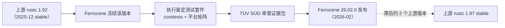
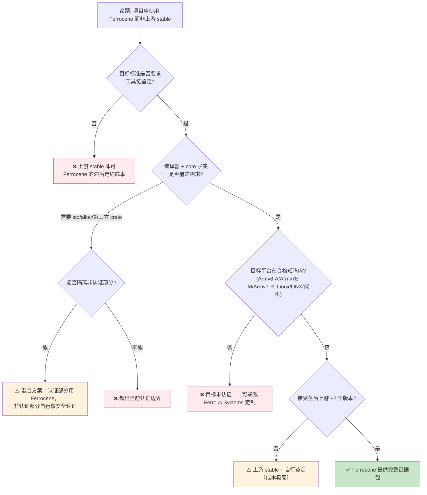
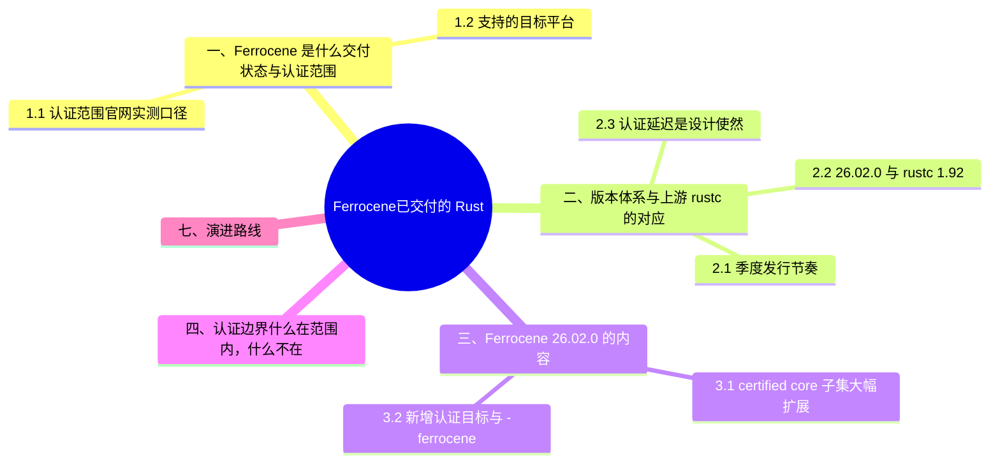

# Ferrocene：已交付的 Rust 安全关键认证工具链

> **EN**: Ferrocene: The Delivered Qualified Rust Toolchain for Safety-Critical Systems
> **Summary**: Ferrocene is the open-source, commercially delivered Rust toolchain qualified by TÜV SÜD for safety-critical development (ISO 26262 ASIL D, IEC 61508 SIL 3, IEC 62304 Class C), with a certified core library subset (ISO 26262 ASIL B / IEC 61508 SIL 2). Current release Ferrocene 26.02.0 tracks upstream rustc 1.92.
> **Rust 版本**: 1.97.0+ (Edition 2024)
>
> **状态**: ✅ 已交付商业产品（非 nightly 实验特性）
> **定位声明**: Ferrocene 不是 Rust 的待稳定语言特性，而是由 Ferrous Systems 交付、TÜV SÜD 鉴定的**下游认证工具链发行版**。本页保留在 `03_preview_features/` 目录仅为路径稳定（避免链接 churn），页面定位已于 2026-07-12 更正为「已交付认证工具链」。
> **当前版本**: Ferrocene 26.02.0（2026-02 发布，含上游 Rust 1.91–1.92 变更）
>
> **受众**: [专家]
> **内容分级**: [专家级]
>
> **Bloom 层级**: L4-L5
> **权威来源**: 本文件为 `concept/` 中 **Ferrocene 产品本身**的权威页；认证工具链生态清单（Ferrocene/HighTec/AdaCore 对比、认证 crate 现状）见 [认证工具链与认证包清单](../../04_formal/04_model_checking/10_certified_toolchains_and_packages.md)。
> **A/S/P 标记**: **S+P** — StructureProcedure
> **双维定位**: P×Eva — 评估认证工具链选型
> **前置概念**: [Toolchain](../../06_ecosystem/00_toolchain/01_toolchain.md) · [Formal Methods](../../04_formal/04_model_checking/02_formal_methods.md) · [MC/DC Coverage](02_mcdc_coverage_preview.md)
> **后置概念**: [认证工具链与认证包清单](../../04_formal/04_model_checking/10_certified_toolchains_and_packages.md) · [Version Tracking](../00_version_tracking/01_rust_version_tracking.md)
>
> **来源**: [Ferrocene 官网](https://ferrocene.dev/)（2026-07-12 curl 实测） · [Ferrocene 26.02.0 Release Notes](https://public-docs.ferrocene.dev/main/release-notes/26.02.0.html) · [Ferrocene Qualification Report](https://public-docs.ferrocene.dev/main/qualification/report/index.html) · [Ferrocene Core Library Certification](https://public-docs.ferrocene.dev/main/certification/core/index.html) · [ISO 26262](https://www.iso.org/standard/68383.html)
> **国际权威来源（2026-07-13 补录）**: **P1** [Jung et al. — RustBelt（POPL 2018）](https://plv.mpi-sws.org/rustbelt/popl18/)（Ferrocene 规范所形式化的 Rust 语义学术基础；curl 200 实测 2026-07-13）

---

## 📑 目录

- [Ferrocene：已交付的 Rust 安全关键认证工具链](#ferrocene已交付的-rust-安全关键认证工具链)
  - [📑 目录](#-目录)
  - [一、Ferrocene 是什么：交付状态与认证范围](#一ferrocene-是什么交付状态与认证范围)
    - [1.1 认证范围（官网实测口径）](#11-认证范围官网实测口径)
    - [1.2 支持的目标平台](#12-支持的目标平台)
  - [二、版本体系与上游 rustc 的对应](#二版本体系与上游-rustc-的对应)
    - [2.1 季度发行节奏](#21-季度发行节奏)
    - [2.2 26.02.0 与 rustc 1.92 的对应关系](#22-26020-与-rustc-192-的对应关系)
    - [2.3 认证延迟是设计使然](#23-认证延迟是设计使然)
  - [三、Ferrocene 26.02.0 的内容](#三ferrocene-26020-的内容)
    - [3.1 certified core 子集大幅扩展](#31-certified-core-子集大幅扩展)
    - [3.2 新增认证目标与 `*-ferrocene-*` target](#32-新增认证目标与--ferrocene--target)
  - [四、认证边界：什么在范围内，什么不在](#四认证边界什么在范围内什么不在)
  - [五、行业应用与生态治理](#五行业应用与生态治理)
    - [5.1 2026 Vision Doc：安全关键 Rust 的真实落地洞察](#51-2026-vision-doc安全关键-rust-的真实落地洞察)
    - [5.2 Safety-Critical Rust Consortium](#52-safety-critical-rust-consortium)
  - [六、选型决策树](#六选型决策树)
  - [七、演进路线](#七演进路线)
  - [八、权威来源索引](#八权威来源索引)
  - [相关概念](#相关概念)
  - [🧭 思维导图（Mindmap）](#-思维导图mindmap)
  - [⚠️ 反例与陷阱：把「认证工具链」误读为「认证生态」](#️-反例与陷阱把认证工具链误读为认证生态)

---

## 一、Ferrocene 是什么：交付状态与认证范围

Ferrocene 是 Ferrous Systems 交付的**开源、经鉴定的 Rust 工具链**，面向汽车、工业、医疗与航空等安全/任务关键系统。它不是上游 Rust 的实验分支，而是对上游 rustc 特定版本执行完整鉴定（qualification）流程后发布的下游发行版，附带监管机构可审查的证据包。

### 1.1 认证范围（官网实测口径）

以下为 ferrocene.dev 2026-07-12 实测页面原文口径：

| 组件 | 鉴定/认证机构与等级 | 性质 |
|:---|:---|:---|
| **编译器（rustc）** | TÜV SÜD 鉴定：**ISO 26262 ASIL D**、**IEC 61508 SIL 3**、**IEC 62304 Class C** | 工具鉴定（tool qualification） |
| **core 库认证子集** | **ISO 26262 ASIL B**、**IEC 61508 SIL 2**（SEooC；IEC 61508 走 Route 3S「非合规开发评估」） | 软件安全元素认证（certification） |
| **DO-178C（航空）** | 官网表述为「支持客户完成 DO-178C（DAL C）认证工作」 | 支持性证据，非自身持证 |
| **IEC 61508 SIL 4** | 官网表述为「支持客户完成 SIL 4 合规工作」 | 支持性证据，非自身持证 |

> **术语区分**：qualification（工具鉴定，针对编译器这类开发工具）与 certification（产品认证，针对 core 库这类被交付软件）是两条不同的标准路径。Ferrocene 对编译器走前者，对 core 子集走后者。

### 1.2 支持的目标平台

官网列出的平台：Linux、QNX，以及 Armv8-A 与 Armv7E-M 上的裸机（bare metal）。Qualification Report 的测试平台矩阵（2026-07-12 实测目录）包括：

- Armv8-A Linux (glibc)
- Armv8-A RHIVOS 2 (Linux, glibc)
- Armv8-A 裸机（hard-float）
- Armv8-A QNX® SDP 7.1.0 / SDP 8.0+
- Armv7-R 裸机（hard-float）
- Armv7E-M（见 §3.2）

---

## 二、版本体系与上游 rustc 的对应

本节说明 Ferrocene 的版本体系：2.1 季度发行节奏，2.2 26.02.0 与上游 rustc 1.92 的对应关系，2.3 解释认证延迟为何是设计使然。

### 2.1 季度发行节奏

Ferrocene 采用季度发行（release notes 实测序列）：

```text
23.06 → 24.05 → 24.08 → 24.11 → 25.02 → 25.05 → 25.08 → 25.11 → 26.02 →（26.05、26.08 计划中）
```

### 2.2 26.02.0 与 rustc 1.92 的对应关系

Ferrocene 26.02.0 的 release notes「Rust changes」节逐条收录了上游 **Rust 1.91.0、1.91.1、1.92.0** 的变更，即 26.02.0 基于上游 **rustc 1.92** 构建。Release notes 同时明确：其中列出的上游 target tier 变化「与 Ferrocene 支持的目标平台无关联」——Ferrocene 只认证自己矩阵内的目标。

当前开发分支（main）的 Core Library Certification 文档显示 **certified core 版本为 1.98.0**，说明开发线已跟进到 rustc 1.98，待后续季度发布认证。

### 2.3 认证延迟是设计使然



这种 2–3 个月量级的滞后不可压缩：鉴定包含第三方机构（TÜV SÜD）的独立审查。安全关键项目以滞后换取可审查性；需要最新语言特性的项目应留在上游 stable。

---

## 三、Ferrocene 26.02.0 的内容

本节拆解 26.02.0 的内容增量：3.1 certified core 子集的大幅扩展，3.2 新增认证目标与 ferrocene 专用 target 三元组。

### 3.1 certified core 子集大幅扩展

26.02.0 release notes 原文要点：

- IEC 61508 SIL 2 的 certified core 子集**大幅扩展**；
- core 子集**新增 ISO 26262 ASIL B 认证**（此前仅 IEC 61508）；
- core 认证文档体系扩充（Safety Plan、Safety Report、Norm Mapping 全套）。

认证子集以符号级清单公开：开发分支文档列出 core 1.98.0 下 **8,866 个认证符号**（2026-07-12 对 `safety-report/subset.html` 实测计数；该清单随版本增长）。未列入清单的 core API 即未认证——编译可用，但安全案例中不能引用其认证证据。

### 3.2 新增认证目标与 `*-ferrocene-*` target

26.02.0 新增两个**合格（qualified）**的安全关键目标：

| target triple | 硬件 |
|:---|:---|
| `thumbv7em-m4-none-eabihf` | Armv7E-M 裸机（Cortex-M4，hard-float） |
| `aarch64-a53-none` | Armv8-A 裸机（Cortex-A53） |

并且：拥有认证 core 库的目标现在提供 **`*-ferrocene-*` 等价 target**，内含**最小化的认证 panic 实现**——把 panic 路径也纳入认证边界，这是裸机安全关键场景的硬性要求。

---

## 四、认证边界：什么在范围内，什么不在

| 在认证/鉴定范围内 | 不在范围内 |
|:---|:---|
| rustc 编译器（TÜV SÜD 鉴定，ASIL D / SIL 3 / Class C） | `std`（依赖 OS 服务，不认证） |
| `core` 认证子集（符号级清单，ASIL B / SIL 2） | `core` 清单外 API、`alloc` |
| 合格目标矩阵内的代码生成 | 矩阵外 target（Tier 差异由上游定义，Ferrocene 不继承） |
| `*-ferrocene-*` target 的认证 panic 实现 | 第三方 crate（crates.io 生态无认证包，见 [认证包清单页](../../04_formal/04_model_checking/10_certified_toolchains_and_packages.md)） |
| Qualification Report 证据链（需求追溯、测试、已知问题） | 异步运行时、proc-macro 生态 |

> **边界要点**：Ferrocene 解决「编译器可信 + core 可信」；应用层 crate、FFI 边界、async 运行时的安全论证仍由项目自行承担——这正是 SCRC（§5.2）存在的理由。

---

## 五、行业应用与生态治理

| 行业 | 标准 | Ferrocene 对应能力 | 状态 |
| :--- | :--- | :--- | :---: |
| **汽车** | ISO 26262 ASIL D | 编译器鉴定至 ASIL D；core 子集 ASIL B | ✅ 可商用 |
| **工业** | IEC 61508 SIL 3（SIL 4 支持客户认证） | 编译器鉴定至 SIL 3；core 子集 SIL 2 | ✅ 可商用 |
| **医疗** | IEC 62304 Class C | 编译器鉴定至 Class C | ✅ 可商用 |
| **航空** | DO-178C DAL C | 提供支持客户认证的工具与证据 | 🟡 支持性 |

### 5.1 2026 Vision Doc：安全关键 Rust 的真实落地洞察

**[Rust Blog, 2026-01-14]** Rust Project 通过 Vision Doc 用户研究访谈，系统梳理了 Rust 在**安全关键系统**（汽车、航空、医疗、工业自动化）落地时的真实张力：编译器保证与生态系统支持之间的差距。

**核心发现**：

| 维度 | 低关键性（QM / ASIL A） | 高关键性（ASIL B+ / SIL 2+） |
| :--- | :--- | :--- |
| **第三方 crate 使用** | 可自由使用 crates.io，后期加固 | 难以论证，通常重写、内部化或加抽象隔离层 |
| **工具链选择** | 跟随最新稳定版 | 固定版本，但面临依赖漂移（crate 要求最新编译器） |
| **目标平台** | 选择丰富 | QNX 等目标仅有 `no_std` 支持，Tier 3 目标稳定性不可接受 |
| **async 运行时（Runtime）** | 可用 Tokio 等生态运行时 | 缺少可认证/可 qualify 的 async 运行时 |
| **C/C++ 互操作** | `cxx`/`autocxx` 可用 | FFI 边界是安全论证难点，需严格审计 |

**已部署案例**（来自访谈）：

- **移动机器人**：通过 IEC 61508 SIL 2 认证，开发者估计约 **90% 传统静态分析检查已被 Rust 编译器覆盖**。
- **医疗设备 ICU 软件**：IEC 62304 Class B，Rust 组件替换 Python 后实现约 **100 倍性能提升**。
- **汽车 OEM**：在 QM 级别使用 crates.io，ASIL D 目标部分通过抽象层预留替换路径。

**六大建议**：

1. **帮助安全关键社区自助**：以 Ferrocene Language Specification (FLS) 为成功模式，企业投入 + Rust Project 维护。
2. **建立生态级 MSRV/LTS 约定**：减少"固定工具链 vs. 依赖要求最新版"的冲突。
3. **将 target tier policy 转化为安全关键入场清单**：明确各目标的 `no_std`/std 状态、最后验证版本、主要阻塞项。
4. **文档化依赖生命周期（Lifetimes）模式**：QM 阶段"先用后清"、ASIL B+"避免或隔离第三方 crate"。
5. **定义安全案例友好的 async 运行时（Runtime）需求**：与 async wg/libs 团队合作。
6. **将 C/C++ 互操作视为安全故事的一部分**：提供可审计、可同步的 FFI 边界指导与工具。

> **关键洞察**：安全关键 Rust 的最大障碍**不是语言本身**，而是**证据友好的软件栈组装能力**——包括认证工具链、稳定目标、可控依赖和可论证的 FFI 边界。Ferrocene 解决了编译器认证，但生态其余部分仍需社区与行业共建。
> [来源: [Rust Blog — What does it take to ship Rust in safety-critical?](https://blog.rust-lang.org/)] · 可信度: ✅

### 5.2 Safety-Critical Rust Consortium

**[Rust Foundation / Rust Blog, 2024-06 / 2025-12 / 2026-01]**
Rust Foundation 与 AdaCore、Arm、Ferrous Systems、HighTec、Lynx Software Technologies、OxidOS、TECHFUND、TrustInSoft、Veecle、Woven by Toyota 于 2024 年 6 月共同发起 [Safety-Critical Rust Consortium（SCRC）](https://rustfoundation.org/safety-critical-rust-consortium/)，目标是支持 Rust 在安全关键软件中的负责任使用。

**治理与参与模式**：

- **成员资格免费**：任何 Rust Foundation 会员组织或受邀的行业、学术、法律专家均可申请，通过 GitHub issue 提交
- **公开透明**：在 Zulip 设有公开频道 `#safety-critical-consortium`；会议遵循 Chatham House Rule，禁止录音/转录
- **三个子委员会**：
  - **Coding Guidelines**：回答"安全关键 Rust 必须如何编写"
  - **Tooling**：回答"安全关键 Rust 开发需要哪些工具"
  - **Liaison**：负责与语言社区、安全标准社区对接

**2025–2026 关键进展**：

- 截至 2025 年底，成员约 **180 人**（较 Utrecht 会议后增长 29%），Coding Guidelines 子委员会约 50 人、Liaison 约 15 人、Tooling 约 30 人
- 2025 年在伦敦与 Utrecht 举行两次线下全体会议，每次约 30 名成员参与
- 2026 年，SCRC 正推动将 **MC/DC 覆盖率支持** 建立为 Rust Project Goal，采用"共享需求所有权（Ownership） + 企业主导实现与维护"的模式，避免给 rustc 覆盖率基础设施带来无主维护负担
- 同步推进 [Safety-Critical Rust coding guidelines](https://github.com/rustfoundation/safety-critical-rust-consortium/tree/main/subcommittee/coding-guidelines) 草案，为安全关键子集提供行业共识

**与 Ferrocene 的关系**：

- Ferrocene 提供**已认证的编译器工具链**，解决"编译器可信"问题
- SCRC 解决**生态与标准对接**问题：需求定义、编码规范、工具链认证、async 运行时（Runtime）需求、FFI 边界指导
- 两者共同构成 Rust 进入汽车/航空/医疗/工业安全关键市场的"工具链 + 行业治理"双支柱

> **来源**:
> [Safety-Critical Rust Consortium](https://rustfoundation.org/safety-critical-rust-consortium/) ·
> [GitHub — rustfoundation/safety-critical-rust-consortium](https://github.com/rustfoundation/safety-critical-rust-consortium) ·
> [Rust Blog — What does it take to ship Rust in safety-critical?](https://blog.rust-lang.org/) · 可信度: ✅

---

## 六、选型决策树



> **使用建议**：ASIL B/SIL 2 以上、且软件栈能收敛到 `core` 认证子集 + 合格 target 的项目，Ferrocene 是当前唯一开箱即用的 TÜV 鉴定路径；其余情况按 [认证工具链与认证包清单](../../04_formal/04_model_checking/10_certified_toolchains_and_packages.md) 的决策树评估 HighTec（AURIX 专用）等替代。

---

## 七、演进路线

| 里程碑 | 状态 | 时间 | 说明 |
| :--- | :---: | :--- | :--- |
| 首个 TÜV 鉴定版本（23.06，基于 rustc 1.68） | ✅ | 2023 | ISO 26262 ASIL D / IEC 61508 SIL 3 编译器鉴定 |
| certified core 子集首版（IEC 61508 SIL 2） | ✅ | 2024–2025 | 符号级认证清单 |
| core 子集扩展 + ISO 26262 ASIL B 认证 | ✅ | 2026-02 | Ferrocene 26.02.0 |
| 新增 Armv7E-M / Cortex-A53 裸机合格目标 | ✅ | 2026-02 | 26.02.0，含 `*-ferrocene-*` 认证 panic target |
| 开发线跟进 rustc 1.98（core 认证版本 1.98.0） | 🟡 | 2026 | 开发分支文档实测 |
| DO-178C / SIL 4 客户认证支持深化 | 🟡 | 2026+ | 支持性证据路径 |

---

## 八、权威来源索引

| 来源 | 可信度 | 说明 |
|:---|:---:|:---|
| [Ferrocene 官网](https://ferrocene.dev/) | ✅ 一级 | 认证范围、目标平台、购买渠道（2026-07-12 curl 实测） |
| [Ferrocene 26.02.0 Release Notes](https://public-docs.ferrocene.dev/main/release-notes/26.02.0.html) | ✅ 一级 | 上游 rustc 对应、新目标、core 子集扩展（实测） |
| [Ferrocene Qualification Report](https://public-docs.ferrocene.dev/main/qualification/report/index.html) | ✅ 一级 | 需求追溯、测试平台矩阵（实测） |
| [Ferrocene Core Library Certification](https://public-docs.ferrocene.dev/main/certification/core/index.html) | ✅ 一级 | Safety Plan / Safety Report / Norm Mapping（实测；core 认证版本 1.98.0，子集 8,866 符号） |
| [Ferrocene Specification (FLS)](https://spec.ferrocene.dev/) | ✅ 一级 | 语言规范 |
| [Safety-Critical Rust Consortium](https://rustfoundation.org/safety-critical-rust-consortium/) | ✅ 一级 | 行业治理 |
| [ISO 26262-6:2018](https://www.iso.org/standard/68383.html) | ✅ 一级 | 汽车功能安全标准 |

---

## 相关概念

- [认证工具链与认证包清单](../../04_formal/04_model_checking/10_certified_toolchains_and_packages.md) — Ferrocene/HighTec/AdaCore 生态与认证 crate 现状（canonical 分工：生态清单在该页）
- [安全关键 Rust 专题索引](../../06_ecosystem/11_domain_applications/21_safety_critical_topic_index.md) — `content/safety_critical/` 工程套件入口
- [Toolchain](../../06_ecosystem/00_toolchain/01_toolchain.md) — Rust 工具链
- [航空航天认证与形式化方法](../../04_formal/04_model_checking/03_aerospace_certification_formal_methods.md) — DO-178C/DO-333 形式化映射
- [MC/DC Coverage](02_mcdc_coverage_preview.md) — MC/DC 覆盖率验证
- [Version Tracking](../00_version_tracking/01_rust_version_tracking.md) — Rust 版本特性演进

---

> **权威来源对齐变更日志**: 2026-05-21 创建；**2026-07-12 重写**：定位由「nightly 预研」更正为「已交付商业认证工具链」，全部认证范围/版本数据以 ferrocene.dev 与 public-docs.ferrocene.dev 当日 curl 实测为准；移除此前虚构的 `#![ferrocene::compliance]` 属性示例（该属性不存在）。

**文档版本**: 2.0
**最后更新**: 2026-07-12

## 🧭 思维导图（Mindmap）



## ⚠️ 反例与陷阱：把「认证工具链」误读为「认证生态」

**反例（错误假设）**：项目采用 Ferrocene 认证工具链后，便认为 `Cargo.toml` 中任意 crates.io 依赖的最新版本都处于安全认证范围内。

**陷阱本质**：Ferrocene 的认证对象是 **rustc/cargo 工具链本身**（含核心库），不覆盖第三方 crate；未审计依赖仍需按行业流程（如 ISO 26262 的软件组件鉴定）单独处理。把工具链认证外推为生态认证，是安全关键审计中的典型不符合项。

**修正对照**：依赖白名单制——仅允许经鉴定的 crate 与固定版本（提交 `Cargo.lock` + `cargo vet`）；以 Ferrocene 交付的认证包（合格证、安全手册）界定工具链边界，并在认证计划中显式声明「第三方依赖另行鉴定」；升级 Ferrocene 版本时同步更新认证证据，而非跟随上游 stable 自动升级。
