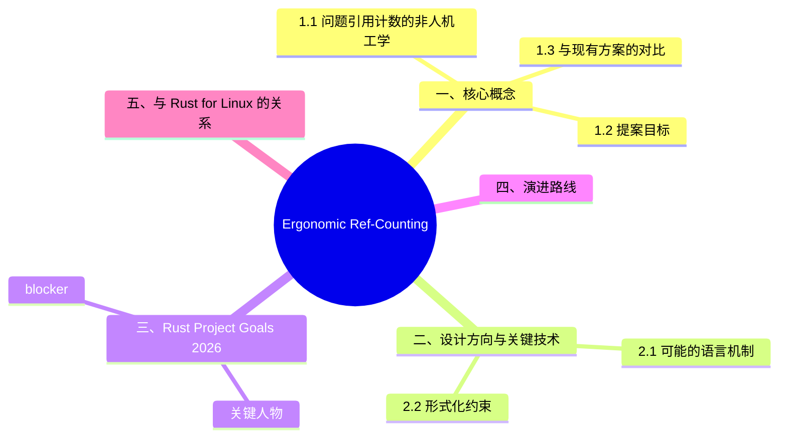

# Ergonomic Ref-Counting 预研：人机工学引用计数

> **代码状态**: ✅ 含可编译示例
>
> **EN**: Ergonomic Ref Counting Preview
> **Summary**: Ergonomic Ref Counting Preview: emerging Rust language feature or ecosystem trend.
> **Rust 版本**: 1.97.0+ (Edition 2024)
> **状态**: 🧪 RFC 决策与预览阶段
> **Rust 属性标记**: `#[experimental]` `#[nightly_only]`
> **跟踪版本**: nightly 1.98.0 (2026-06-02)
> **预计稳定**: 待定（RFC 决策阶段，2026 持续推进）
> **受众**: [专家]
> **Bloom 层级**: L4-L5
> **内容分级**: [实验级]
> **权威来源**: 本文件为 `concept/` 权威页。
> **Rust Project Goals 2026 状态**: **Continued**（持续中）
> **旗舰目标**: Flagship: Higher-level Rust
> **定理链**: N/A — 描述性/综述性/导航性文档，不涉及形式化定理链

---

> **来源**:
> · [核心 Crate](../../06_ecosystem/02_core_crates/01_core_crates.md) ·
> [Rust Reference](https://doc.rust-lang.org/reference/introduction.html) ·
> [TRPL](https://doc.rust-lang.org/book/title-page.html) ·
> [Brown University — Interactive Rust Book](https://rust-book.cs.brown.edu/) ·
> [Jung et al. — RustBelt: Securing the Foundations of Rust](https://plv.mpi-sws.org/rustbelt/popl18/) ·
> [Itanium C++ ABI](https://itanium-cxx-abi.github.io/cxx-abi/abi.html)
> [Rust Project Goals — Ergonomic RC](https://rust-lang.github.io/rust-project-goals/2026/ergonomic-rc.html) ·
> [rust-project-goals#107](https://github.com/rust-lang/rust-project-goals/issues/107) ·
> [Rust Internals Forum](https://internals.rust-lang.org/)
>
> **前置概念**: [核心 Crate](../../06_ecosystem/02_core_crates/01_core_crates.md)
> [Ownership](../../01_foundation/01_ownership_borrow_lifetime/01_ownership.md) ·
> [Smart Pointers](../../02_intermediate/02_memory_management/04_smart_pointers.md) ·
> [Unsafe](../../03_advanced/02_unsafe/01_unsafe.md)
> **后置概念**: [Rust for Linux](../04_research_and_experimental/04_rust_for_linux.md)

---

## 📑 目录

- [Ergonomic Ref-Counting 预研：人机工学引用计数](#ergonomic-ref-counting-预研人机工学引用计数)
  - [📑 目录](#-目录)
  - [一、核心概念](#一核心概念)
    - [1.1 问题：引用计数的非人机工学](#11-问题引用计数的非人机工学)
    - [1.2 提案目标](#12-提案目标)
    - [1.3 与现有方案的对比](#13-与现有方案的对比)
  - [二、设计方向与关键技术](#二设计方向与关键技术)
    - [2.1 可能的语言机制](#21-可能的语言机制)
      - [方向 A：`Clone` 自动提升（Auto-clone on move）](#方向-aclone-自动提升auto-clone-on-move)
      - [方向 B：`Rc`/`Arc` 原生语法糖](#方向-brcarc-原生语法糖)
      - [方向 C：`Copy` trait 的扩展语义](#方向-ccopy-trait-的扩展语义)
    - [2.2 形式化约束](#22-形式化约束)
  - [三、Rust Project Goals 2026 进展](#三rust-project-goals-2026-进展)
    - [关键人物](#关键人物)
    - [blocker](#blocker)
  - [四、演进路线](#四演进路线)
  - [五、与 Rust for Linux 的关系](#五与-rust-for-linux-的关系)
  - [⚠️ 反例与陷阱](#️-反例与陷阱)
  - [六、相关概念](#六相关概念)
  - [嵌入式测验（Embedded Quiz）](#嵌入式测验embedded-quiz)
    - [测验 1："人机工程学的引用计数"指什么？（理解层）](#测验-1人机工程学的引用计数指什么理解层)
    - [测验 2：`Arc::clone(&arc)` 与 `arc.clone()` 在语义上有什么区别？（理解层）](#测验-2arcclonearc-与-arcclone-在语义上有什么区别理解层)
    - [测验 3：为什么 Rust 不直接提供类似 Swift 的自动引用计数（ARC）？（理解层）](#测验-3为什么-rust-不直接提供类似-swift-的自动引用计数arc理解层)
    - [测验 4：`Weak` 指针在 Rust 中解决什么问题？（理解层）](#测验-4weak-指针在-rust-中解决什么问题理解层)
    - [测验 5：这个提案对 Rust 的 GC 讨论有什么影响？（理解层）](#测验-5这个提案对-rust-的-gc-讨论有什么影响理解层)
  - [国际权威参考 / International Authority References（P1 学术 · P2 生态）](#国际权威参考--international-authority-referencesp1-学术--p2-生态)
  - [🧭 思维导图（Mindmap）](#-思维导图mindmap)

## 一、核心概念

"人机工学引用计数"针对的不是 `Rc`/`Arc` 的正确性，而是其**使用摩擦**：在数据流图、GUI 状态共享、async 任务分发等场景中，`Arc::clone(&x)` 的显式调用密度高到遮蔽业务逻辑。该提案要在不引入 GC 的前提下回答一个问题：哪些 `clone` 是"携带语义信息"的（必须保留显式），哪些只是"所有权（Ownership）仪式的样板"（可由编译器代劳）。以下三节依次展开：① 现状摩擦的来源（1.1）；② 提案目标的四条约束（1.2）；③ 与 `Cow`、`&T` 借用（Borrowing）等现有方案的边界划分（1.3）。

### 1.1 问题：引用计数的非人机工学

当前 Rust 中，共享所有权（Ownership）的标准做法是 `Rc<T>` / `Arc<T>`，但它们的 API 相比 GC 语言显得繁琐：

```rust
use std::sync::Arc;

// 当前做法：显式 clone
let data = Arc::new(vec![1, 2, 3]);
let data2 = Arc::clone(&data); // 必须显式调用 clone
```

对比 Kotlin / Swift / 现代 C++ 的隐式引用（Reference）计数，Rust 要求**每次传递共享所有权（Ownership）时显式 `clone`**，这在高阶函数、闭包（Closures）捕获、异步（Async）任务分发等场景下成为**人机工学瓶颈**。

### 1.2 提案目标

Ergonomic ref-counting（人机工学引用（Reference）计数）旨在：

1. **减少显式 `clone` 样板**：在适当场景下，编译器自动插入引用计数操作
2. **保持零成本抽象（Zero-Cost Abstraction）**：无运行时（Runtime）开销增加
3. **不引入隐式 GC**：仍显式管理生命周期（Lifetimes），只是减少语法噪音
4. **与现有 `Rc`/`Arc` 模型兼容**：底层仍是引用计数，API 层优化

### 1.3 与现有方案的对比

| 方案 | 机制 | 人机工学 | 运行时（Runtime）成本 | 与 Rust 模型兼容性 |
|:---|:---|:---:|:---:|:---:|
| 当前 `Arc::clone` | 显式 | ❌ 繁琐 | ✅ 零成本 | ✅ 完全兼容 |
| `&T` 借用（Borrowing） | 编译期检查 | ✅ 优秀 | ✅ 零成本 | ✅ 但不拥有所有权（Ownership） |
| `Cow<T>` | 写时克隆 | ⚠️ 中等 | ✅ 零成本（读路径） | ✅ 特定场景 |
| **Ergonomic RC** (提案) | 编译器自动插入 `clone` | ✅ 优秀 | ✅ 零成本 | 🔄 设计中 |
| GC 语言 | 垃圾回收 | ✅ 优秀 | ❌ 运行时（Runtime）开销 | ❌ 与 Rust 所有权（Ownership）冲突 |

## 二、设计方向与关键技术

设计空间沿"自动化程度"一维展开：从全自动（编译器推断所有引用计数操作，趋近 Swift ARC）到半自动（仅属性/derive 标记的类型享受自动 clone）。本节两条主线的分工：① 可能的语言机制（2.1）——展示三个候选方向各自的语法形态与迁移成本；② 形式化约束（2.2）——任何方案都必须保持的引用计数不变式，是评审 RFC 时的否决条件。判断一个方案可行与否，先看它是否满足 2.2 的不变式表，再讨论人机工学收益。

### 2.1 可能的语言机制

当前设计讨论集中在几个方向：

#### 方向 A：`Clone` 自动提升（Auto-clone on move）

在特定类型上，当 move 语义不满足时，编译器**自动插入 `clone()`** 而非报错：

```rust,ignore
// 提案愿景（非实际语法）
#[derive(ErgonomicClone)]
struct SharedData(Arc<Vec<u8>>);

fn process(data: SharedData) { /* 消费 data */ }

let d = SharedData(Arc::new(vec![1, 2, 3]));
process(d);      // 编译器自动插入 clone，原 d 仍可用
process(d);      // 同上，无需显式 Arc::clone
```

#### 方向 B：`Rc`/`Arc` 原生语法糖

类似 Swift 的隐式引用计数，引入语言层面的引用计数类型：

```rust,ignore
// 假设性语法（非官方设计）
let data: rc Vec<u8> = rc vec![1, 2, 3];
let data2 = data;  // 自动增加引用计数，不转移所有权
```

#### 方向 C：`Copy` trait 的扩展语义

允许某些引用计数类型在特定条件下实现"逻辑上的 `Copy`"：

```rust,ignore
// 假设性：Arc<T> 在特定场景下的轻量复制
let a = arc_make_copyable(Arc::new(data));
let b = a; // 编译器知道这是引用计数提升，非 move
```

> **重要**: 以上均为**社区讨论方向**，并非已确定的官方设计。实际 RFC 可能采用完全不同的方案。

### 2.2 形式化约束

任何 ergonomic ref-counting 方案必须满足：

| 约束 | 说明 |
|:---|:---|
| **引用计数不变式** | `strong_count >= 1` 时对象存活；`strong_count == 0` 时析构 |
| **循环引用仍显式** | 不自动解决循环引用（仍需要 `Weak<T>` 显式打破） |
| **线程安全边界** | `Arc` vs `Rc` 的 Send/Sync 约束不可放松 |
| **drop 顺序可预测** | 不得引入非确定性析构时机 |

## 三、Rust Project Goals 2026 进展

| 时间 | 进展 |
|:---|:---|
| 2025H2 | 项目目标确立，归属 Flagship: Higher-level Rust |
| 2026-02 | 持续推进中，RFC 决策阶段 |
| 2026-05 | **状态: Continued**，Niko Matsakis + Santiago Pastorino 持续推动 |

### 关键人物

- **Niko Matsakis** (lang team champion) — 语言设计方向决策
- **Santiago Pastorino** (compiler team champion) — 编译器实现

### blocker

| blocker | 状态 |
|:---|:---:|
| RFC 具体方案选择 | 🔄 进行中 |
| 与现有所有权（Ownership）系统的交互 | 🔄 设计中 |
| 与 Pin / 异步（Async）的协同 | 📋 待评估 |

## 四、演进路线

| 里程碑 | 状态 | 预计时间 | 说明 |
|:---|:---:|:---|:---|
| 问题识别与动机 | ✅ | 2024-2025 | 社区共识：RC 人机工学是痛点 |
| Project Goal 设立 | ✅ | 2025 | 纳入 2025H2 / 2026 旗舰目标 |
| **RFC 决策** | 🔄 | 2026 | Niko Matsakis 主导方案选择 |
| RFC 撰写与社区反馈 | 📋 | 2026-2027 | 取决于方案复杂度 |
| 编译器原型 | 📋 | 2027+ | 依赖 RFC 冻结 |
| 稳定化 | 📋 | 2028+ | 远期目标 |

> **预测**: Ergonomic ref-counting 是 Rust "Higher-level Rust" 旗舰目标的核心组成部分。它不会替代 `Rc`/`Arc`，而是提供一层可选的语法优化。实际落地可能需要等到 2028+。

## 五、与 Rust for Linux 的关系

Rust for Linux 是此特性的**重要用例**之一。内核中大量使用引用计数结构（`struct kref`、`kobject`），当前 Rust 绑定需要大量显式 `Arc` 操作：

```rust,ignore
// 当前 Rust for Linux 中的典型模式
let device = Arc::clone(&self.device);
// 每次传递 device 引用都需要显式 clone
```

Ergonomic ref-counting 可显著降低内核绑定的样板代码量，提升可维护性。

## ⚠️ 反例与陷阱

**陷阱：`Rc` 双向引用成环导致永久泄漏**。引用计数无法回收环——这正是 ergonomic ref-counting 预研试图用类型级手段缓解的经典人机工程学缺陷：

```rust
use std::cell::RefCell;
use std::rc::{Rc, Weak};

struct Node { next: RefCell<Option<Rc<Node>>> }

fn leak_cycle() -> Weak<Node> {
    let a = Rc::new(Node { next: RefCell::new(None) });
    let b = Rc::new(Node { next: RefCell::new(None) });
    *a.next.borrow_mut() = Some(Rc::clone(&b));
    *b.next.borrow_mut() = Some(Rc::clone(&a)); // 环
    let weak = Rc::downgrade(&a);
    drop(a); drop(b);
    weak
}
```

rustc 1.97.0 实测：`leak_cycle().upgrade().is_some()` 为 `true`——外部句柄全部 drop 后节点仍存活，内存泄漏复现。

**修正**：环中至少一条边用 `Weak`（反向引用、父指针等），`upgrade()` 返回 `None` 即证明可回收：

```rust
use std::cell::RefCell;
use std::rc::Weak;
struct Node { next: RefCell<Option<Weak<Node>>> }
// 赋值改为 Rc::downgrade(&b) / Rc::downgrade(&a)
```

## 六、相关概念

- [Smart Pointers](../../02_intermediate/02_memory_management/04_smart_pointers.md) — `Rc`/`Arc`/`Weak` 详解
- [Ownership](../../01_foundation/01_ownership_borrow_lifetime/01_ownership.md) — 所有权模型基础
- [Rust for Linux](../04_research_and_experimental/04_rust_for_linux.md) — 内核开发跟踪
- [Version Tracking](../00_version_tracking/01_rust_version_tracking.md) — 版本特性演进

---

> **权威来源**: [Rust Project Goals 2026 — Ergonomic Ref-counting](https://rust-lang.github.io/rust-project-goals/2026/ergonomic-rc.html), [rust-project-goals#107](https://github.com/rust-lang/rust-project-goals/issues/107)
> **权威来源对齐变更日志**: 2026-06-06 创建，对齐 Rust Project Goals 2026 April Update

## 嵌入式测验（Embedded Quiz）

理解「嵌入式测验（Embedded Quiz）」需要把握测验 1："人机工程学的引用计数"指什么？（理解层）、测验 2：`Arc::clone(&arc)` 与 `arc.clon…、测验 3：为什么 Rust 不直接提供类似 Swift 的自动引用计数…、测验 4：`Weak` 指针在 Rust 中解决什么问题？（理解层）等5个方面，本节依次展开。

### 测验 1："人机工程学的引用计数"指什么？（理解层）

**题目**: "人机工程学的引用计数"指什么？

<details>
<summary>✅ 答案与解析</summary>

改进 `Rc<T>` 和 `Arc<T>` 的使用体验，减少显式 `clone()` 调用和 `Weak` 指针的模板代码，使引用计数更像其他语言的自动内存管理。
</details>

---

### 测验 2：`Arc::clone(&arc)` 与 `arc.clone()` 在语义上有什么区别？（理解层）

**题目**: `Arc::clone(&arc)` 与 `arc.clone()` 在语义上有什么区别？

<details>
<summary>✅ 答案与解析</summary>

语义相同，但社区推荐 `Arc::clone(&arc)` 以明确这是引用计数增加而非深拷贝。这是显式哲学的体现。
</details>

---

### 测验 3：为什么 Rust 不直接提供类似 Swift 的自动引用计数（ARC）？（理解层）

**题目**: 为什么 Rust 不直接提供类似 Swift 的自动引用计数（ARC）？

<details>
<summary>✅ 答案与解析</summary>

Swift ARC 由编译器自动插入 retain/release，但循环引用仍需手动处理（`weak`/`unowned`）。
Rust 的所有权（Ownership）系统更安全，但引用计数只是众多所有权策略之一。
</details>

---

### 测验 4：`Weak` 指针在 Rust 中解决什么问题？（理解层）

**题目**: `Weak` 指针在 Rust 中解决什么问题？

<details>
<summary>✅ 答案与解析</summary>

打破 `Rc`/`Arc` 的循环引用。
`Weak` 不增加强引用计数，当所有强引用消失时对象被释放，`Weak` 升级返回 `None`。
</details>

---

### 测验 5：这个提案对 Rust 的 GC 讨论有什么影响？（理解层）

**题目**: 这个提案对 Rust 的 GC 讨论有什么影响？

<details>
<summary>✅ 答案与解析</summary>

更 ergonomic 的引用计数可能减少社区对 GC 的需求。
但真正的 GC（如 cycle collection）仍可能在未来作为可选 crate 出现。
</details>

---

## 国际权威参考 / International Authority References（P1 学术 · P2 生态）

> 依据 `AGENTS.md` §2「对齐网络国际化权威内容」补充：仅追加已验证可达的权威链接，不改动正文事实。

- **P2 生态/社区**: [docs.rs/futures — 生态权威 API 文档](https://docs.rs/futures) · [docs.rs/hyper — 生态权威 API 文档](https://docs.rs/hyper)

## 🧭 思维导图（Mindmap）


