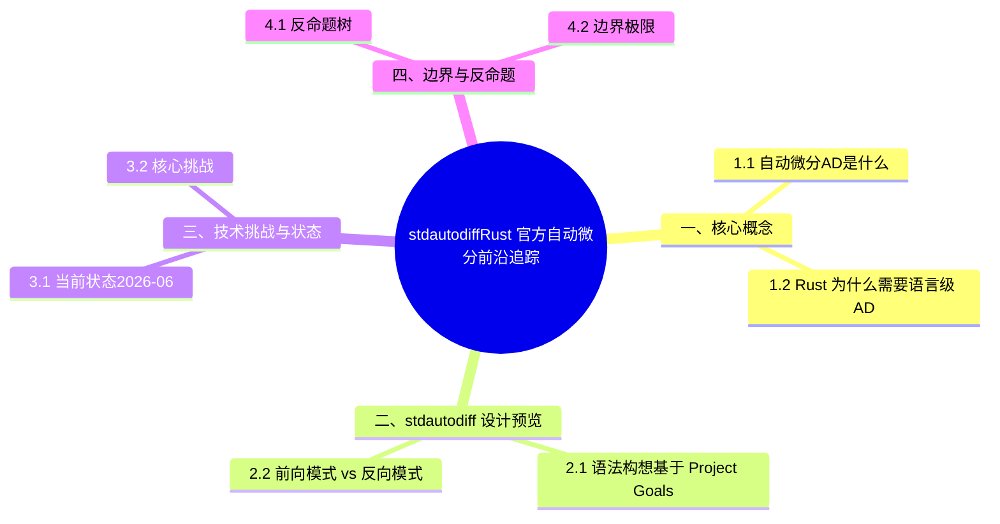

# `std::autodiff`：Rust 官方自动微分前沿追踪

> **代码状态**: [示例级 — 已补充代码]
>
> **EN**: Std Autodiff Preview
> **Summary**: Std Autodiff Preview: emerging Rust language feature or ecosystem trend.
> **Rust 版本**: nightly 1.98.0+ (experimental)
>
> **状态**: 🧪 Nightly 实验性
> **Rust 属性标记**: `#[experimental]` `#[nightly_only]`
> **跟踪版本**: nightly 1.98.0 (2026-05-31)
> **预计稳定**: 待定（需等待 RFC / MCP 完成）
>
> **受众**: [研究者]
> **内容分级**: [实验级]
> ⚠️ **声明**: 本文件使用形式化符号辅助直觉理解，所呈现的"定理/引理/推论"为**教学类比**，非经机器验证的严格数学证明。如需严格形式化验证，请参考 [Verus](https://github.com/verus-lang/verus)、[Kani](https://model-checking.github.io/kani/)、[Coq](https://coq.inria.fr/)。
>
> **Bloom 层级**: L5-L6
> **权威来源**: 本文件为 `concept/` 权威页。
> **定位**: 追踪 Rust 语言层面的自动微分（Automatic Differentiation, AD）实验进展，分析其对 AI/ML 生态的潜在影响。
> **前置概念**: [Generics](../../02_intermediate/01_generics/01_generics.md) · [Trait](../../02_intermediate/00_traits/01_traits.md) · [Machine Learning Ecosystem](../../06_ecosystem/11_domain_applications/13_machine_learning_ecosystem.md)
> **后置延伸**: [Rust in AI](../04_research_and_experimental/05_rust_in_ai.md) · [Evolution](../04_research_and_experimental/03_evolution.md)
> **定理链**: N/A — 描述性/综述性/导航性文档，不涉及形式化定理链
---

> **来源**: · [Rust Reference](https://doc.rust-lang.org/reference/introduction.html) · [TRPL](https://doc.rust-lang.org/book/title-page.html) · [Brown University — Interactive Rust Book](https://rust-book.cs.brown.edu/) · [Jung et al. — RustBelt: Securing the Foundations of Rust](https://plv.mpi-sws.org/rustbelt/popl18/) · [Itanium C++ ABI](https://itanium-cxx-abi.github.io/cxx-abi/abi.html)
>
> [Rust Project Goals 2026](https://rust-lang.github.io/rust-project-goals/2026/) ·
> [AutoDiff Tracking Issue](https://github.com/rust-lang/rust/issues/124509) ·
> [rustc_autodiff crate](https://github.com/rust-lang/rust/issues/124509) ·
> [Burn ADBackend](https://burn.dev/)
> **后置概念**: [Rust Specification](https://www.rust-lang.org/) · [官方路线图](https://github.com/rust-lang/rust/labels/F-roadmap)

## 一、核心概念

自动微分（Automatic Differentiation, AD）是机器学习的计算基石：给定计算图，自动产出任一输出对任一输入的精确导数（非数值近似），是反向传播的形式化基础。两个层面回答 Rust 的语言级诉求：

- **AD 是什么**: 两类模式——前向模式（forward mode）沿计算方向传播导数，适合输入少输出多；反向模式（reverse mode）先记录计算图再反向累积梯度，适合输出少输入多（神经网络的典型形态）。与数值微分（差分）相比无截断误差，与符号微分相比无表达式膨胀。
- **Rust 为什么需要语言级 AD**: 库级 AD（`dfdx`、`burn` 的 autodiff）受限于无法对任意 Rust 控制流（循环、条件、闭包）自动求导——只有编译器级的源代码变换（source-to-source transformation）才能覆盖完整语言；Enzyme（LLVM 级 AD）的成功证明 IR 层微分可行，Rust 需要等价能力才能进入科学计算主流。

判定依据：当前生产应使用库级方案并接受其表达限制；语言级 AD 属跟踪性投入。

### 1.1 自动微分（AD）是什么

自动微分是计算函数导数的**精确数值方法**，区别于：

| 方法 | 原理 | 精度 | 适用场景 |
| :--- | :--- | :--- | :--- |
| **符号微分** | 代数公式推导 | 精确 | 简单函数，公式化场景 |
| **数值微分** | `(f(x+h) - f(x)) / h` | 近似（截断/舍入误差）| 快速验证、黑盒函数 |
| **自动微分** | 链式法则 + 程序结构追踪 | **精确到机器精度** | 深度学习、科学计算 |

> **关键洞察**: AD 不是"符号微分的自动化"，也不是"更精确的数值微分"——它是一种**基于计算图的程序变换技术**，通过前向模式（Forward Mode）或反向模式（Reverse Mode）在运行时（Runtime）/编译期追踪每个操作的梯度。

### 1.2 Rust 为什么需要语言级 AD

当前 Rust ML 生态的梯度计算依赖框架层实现：

```text
Burn:   自定义 ADBackend trait + 宏生成 backward 图
Candle: 手动实现 backward 操作（每个 op 需写 grad fn）
tch-rs: 绑定 PyTorch Autograd（C++ 运行时）
```

**问题**:

1. **碎片化**: 每个框架有自己的 AD 抽象，模型无法跨框架
2. **性能**: 运行时（Runtime）构建计算图有开销
3. **正确性**: 手动实现 backward 容易出错（梯度消失/爆炸、形状不匹配）
4. **编译期优化**: 无法利用 Rust 的零成本抽象（Zero-Cost Abstraction）和 LLVM 优化

**`std::autodiff` 的愿景**:

- 语言级 `#[autodiff]` 属性宏（Macro）
- 编译器自动生成前向/反向模式代码
- 与现有 Rust 类型系统（Type System）无缝集成（无需 DSL）
- 零运行时（Runtime）开销（纯编译期变换）

---

## 二、`std::autodiff` 设计预览

`std::autodiff` 的设计预览基于 Project Goals 的公开讨论，三个维度勾勒其可能形态：

- **语法构想**: 倾向以过程宏/内建属性标注可微分函数（类似 `#[autodiff]` 修饰 `fn`），编译器在 MIR 层生成对偶函数；与 Enzyme 的 LLVM 集成方案（`std::autodiff` 的实验分支即基于 Enzyme）并行探索。
- **前向 vs 反向模式**: 前向模式实现简单、内存开销低，适合作为第一里程碑；反向模式需要“tape”（计算记录）或源码逆转，是深度学习所需但复杂度高一个量级的目标。
- **与现有生态对比**: `dfdx` 用类型系统编码张量形状（编译期维度检查）+ 库级 tape；`burn` 提供后端可切换的 autodiff；语言级方案的优势是任意控制流可微 + 零运行时抽象差距，劣势是仅支持编译器已变换的代码。

判定依据：关注 Project Goals 的季度更新即可，设计细节仍在变动，不宜写入架构依赖。

### 2.1 语法构想（基于 Project Goals 2026）

```rust,ignore
#![feature(autodiff)]

// 前向模式自动微分：标量函数求导
#[autodiff_forward(d_square, Dual, Dual)]
fn square(x: f64) -> f64 {
    x * x
}

fn main() {
    // d_square(x, seed) 同时返回原函数值和导数
    let (value, derivative) = d_square(3.0, 1.0);
    assert_eq!(value, 9.0);
    assert_eq!(derivative, 6.0);
}
```

> **说明**: `#[autodiff_forward(NAME, INPUT_ACTIVITIES..., OUTPUT_ACTIVITY)]` 是 nightly 真实语法（`feature(autodiff)`）。`Dual` 表示对该参数求导，`Const` 表示常数。运行时需要 `-Zautodiff=Enable` 且编译器启用 Enzyme 支持。

### 2.2 前向模式 vs 反向模式

| 模式 | 适用场景 | 内存复杂度 | 计算复杂度 |
|:---|:---|:---|:---|
| **前向模式** | 输入少、输出多（如参数敏感性分析）| O(1) | O(n) 次前向遍历 |
| **反向模式** | 输入多、输出少（如神经网络训练）| O(计算图节点数) | O(1) 次前向 + 1 次反向 |

```rust,ignore
#![feature(autodiff)]

// 反向模式自动微分（多输入、单输出常用）
#[autodiff_reverse(d_rosenbrock, Dual, Dual, Active)]
fn rosenbrock(x: f64, y: f64) -> f64 {
    (1.0 - x).powi(2) + 100.0 * (y - x.powi(2)).powi(2)
}

fn main() {
    // 反向模式：为每个 Dual 输入生成一个 shadow 参数传入 seed
    let (value, dx) = d_rosenbrock(1.0, 1.0, 3.0, 1.0);
    println!("value = {value}, ∂f/∂x = {dx}");
}
```

### 2.3 与现有生态的对比

```text
┌─────────────────────────────────────────────────────────────┐
│              PyTorch Autograd (Python/C++)                  │
│  · 运行时建图 · 动态图 · eager execution                     │
│  · 内存开销大 · 无法跨图优化                                  │
├─────────────────────────────────────────────────────────────┤
│              JAX (Python/XLA)                               │
│  · JIT 编译 · 函数变换 (grad/vmap/jit)                       │
│  · 需 Python 运行时 · 静态图限制                              │
├─────────────────────────────────────────────────────────────┤
│              Burn (Rust)                                    │
│  · 纯 Rust · 类型安全 · 多后端 (CUDA/Metal/WGPU)             │
│  · 需手动实现 ADBackend · 每个 op 需写 backward              │
├─────────────────────────────────────────────────────────────┤
│              std::autodiff (Rust 未来)                       │
│  · 编译期变换 · 零运行时开销 · 与 Rust 类型系统原生集成         │
│  · 目标: 任意纯函数自动可微 · 支持自定义类型和 control flow    │
└─────────────────────────────────────────────────────────────┘
```

---

## 三、技术挑战与状态

自动微分落地 Rust 的阻碍按性质分为工程与理论两类：

- **当前状态（2026-06）**: 上游实验以 Enzyme 集成为主线——`std::autodiff` 在 nightly 有实验性支持（需自编译带 Enzyme 的 LLVM），可对简单 `fn` 生成前向模式导数；距离默认工具链可用仍有多个里程碑。
- **核心挑战**: ① **LLVM 升级耦合**: Enzyme 版本与 rustc 的 LLVM 版本必须锁步，构建复杂度显著上升；② **unsafe 与内联汇编**: AD 变换需要理解内存效应，unsafe 代码的求导语义无法自动推导；③ **高阶导数与性能**: 反向模式的 tape 分配与 Rust 所有权模型的交互（tape 条目生命周期）尚无成熟设计。

判定依据：该特性按“跟踪研究”定位；科学计算项目的近期路径是 `dfdx`/`burn` + 手写关键梯度，或经 PyO3 调用 JAX/PyTorch 的 AD。

### 3.1 当前状态（2026-06）

| 组件 | 状态 | 说明 |
|:---|:---|:---|
| `rustc_autodiff` crate | 🧪 原型 | 社区实验性编译器插件 |
| RFC 草案 | 📋 准备中 | 预计 2026H2 提交 |
| MCP (Major Change Proposal) | ⏳ 未启动 | 需先完成原型验证 |
| 与 Miri 的交互 | ❓ 待研究 | AD 变换后的代码需通过 UB 检测 |
| `unsafe` 函数支持 | ❓ 待研究 | 梯度传播是否跨越 unsafe 边界 |

### 3.2 核心挑战

1. **Control Flow 的梯度传播**

   ```rust,ignore
   #[reverse]
   fn with_control(x: f64) -> f64 {
       if x > 0.0 { x.sin() } else { x.cos() }
   }
   // 编译器需生成: 记录分支选择，反向时沿相同分支传播
   ```

2. **自定义类型的可微性**

   ```rust,ignore
   struct Complex { re: f64, im: f64 }
   // 需 impl Differentiable for Complex，或编译器自动推导
   ```

3. **与泛型（Generics）和 Trait 的集成**

   ```rust,ignore
   fn dot<T: Mul<Output=T> + Add<Output=T>>(a: &[T], b: &[T]) -> T { ... }
   // #[reverse] dot 需 T 也支持梯度运算
   ```

4. **内存管理（反向模式）**
   - 反向模式需保存前向计算的中间值（activations）
   - 与 Rust 的所有权（Ownership）系统交互：谁拥有这些中间值？何时 drop？
   - 可能的方案：编译器自动生成 `Checkpoint` 结构体（Struct）

---

## 四、边界与反命题

`std::autodiff`（基于 Enzyme 的 `#[autodiff]` 实验属性）的反命题分析回答"什么时候**不该**用自动微分"：① 反命题树——列出主张"autodiff 优于手写导数/有限差分"的所有前提，逐一构造反例（控制流含不可微分支、外部 C 函数无符号信息）；② 边界极限——在吞吐极限（大 batch）、精度极限（`f16` 累加）与编译时间极限（Enzyme pass 放大）三处测量退化点。判定原则：只有目标函数**纯 Rust、控制流可微、且导数需求稳定**时 autodiff 才占优；否则回退到有限差分或手写伴随。

### 4.1 反命题树

```text
std::autodiff 适合所有 Rust 数值计算?
    │
    ├─> 函数是纯函数（无副作用）?
    │   ├─> 否 → ❌ 不适合 — 副作用（如 I/O、全局状态）不可微
    │   └─> 是
    │       ├─> 需要高精度梯度?
    │       │   ├─> 否 → ⚠️ 数值微分可能足够
    │       │   └─> 是 → ✅ 适合
    │       └─> 性能敏感?
    │           ├─> 是 → ✅ 编译期 AD 零开销优势
    │           └─> 否 → 🟡 框架层 AD 可能更易用
    │
    └─> 需要与 Python 生态互通?
        └─> 是 → ⚠️ 需绑定层（如 PyO3），语言级 AD 优势减弱
```

### 4.2 边界极限

- **不可微操作**: `println!`、`File::open`、随机数生成（非种子化）等副作用操作无法自动微分
- **离散操作**: `if x > 0` 的梯度在 `x=0` 处未定义（次梯度问题）
- **循环**: `for` 循环的梯度需展开或记录迭代次数，可能爆炸

---

## 五、来源与延伸阅读

| 来源 | 可信度 | 说明 |
|:---|:---:|:---|
| [Rust Project Goals 2026](https://rust-lang.github.io/rust-project-goals/2026/) | ✅ 一级 | 官方项目目标 |
| [rustc_autodiff GitHub](https://github.com/rust-lang/rust/issues/124509) | ⚠️ 社区 | 实验性编译器插件 |
| [Burn ADBackend](https://burn.dev/) | ✅ 一级 | 当前 Rust 最成熟的 AD 方案 |
| [JAX Autodiff](https://jax.readthedocs.io/en/latest/jax-101/01-jax-basics.html) | ✅ 一级 | 函数变换范式的参考实现 |
| [Automatic Differentiation in ML](https://arxiv.org/abs/1502.05767) | ✅ 学术 | 经典综述论文 |

---

**文档版本**: 1.0
**最后更新**: 2026-06-01
**状态**: 🧪 前沿追踪

> **权威来源**: [Rust Project Goals](https://rust-lang.github.io/rust-project-goals/), [Rust Compiler Team](https://rust-lang.github.io/compiler-team/)
>
> **权威来源对齐变更日志**: 2026-06-01 创建，对齐 Rust Project Goals 2026H2 [rust-lang.github.io](https://github.com/rust-lang)

## 嵌入式测验（Embedded Quiz）

本节围绕「嵌入式测验（Embedded Quiz）」展开，依次讨论测验 1：什么是自动微分（AutoDiff）？它在机器学习中有什么作用…、测验 2：Rust 目前为什么缺少标准的自动微分库？（理解层）、测验 3：`dfdx` 如何在 Rust 的类型系统中编码神经网络架构…、测验 4：如果 Rust 标准库引入自动微分支持，可能以什么形式出现？…等5个方面。

### 测验 1：什么是自动微分（AutoDiff）？它在机器学习中有什么作用？（理解层）

**题目**: 什么是自动微分（AutoDiff）？它在机器学习中有什么作用？

<details>
<summary>✅ 答案与解析</summary>

自动计算函数对输入的导数。机器学习训练需要梯度下降，自动微分消除了手动求导的工作，支持复杂计算图的高效梯度计算。
</details>

---

### 测验 2：Rust 目前为什么缺少标准的自动微分库？（理解层）

**题目**: Rust 目前为什么缺少标准的自动微分库？

<details>
<summary>✅ 答案与解析</summary>

Rust 的所有权（Ownership）系统使反向传播的状态管理复杂（需要记录前向传播的中间值）。社区已有 `autodiff`、`dfdx`、`burn` 等实验性库，但尚未形成标准。
</details>

---

### 测验 3：`dfdx` 如何在 Rust 的类型系统中编码神经网络架构？（理解层）

**题目**: `dfdx` 如何在 Rust 的类型系统（Type System）中编码神经网络架构？

<details>
<summary>✅ 答案与解析</summary>

使用 const generics 将张量形状编码到类型中（如 `Tensor<(B, C, H, W)>`），编译期检查矩阵乘法维度匹配，消除运行时（Runtime）形状错误。
</details>

---

### 测验 4：如果 Rust 标准库引入自动微分支持，可能以什么形式出现？（理解层）

**题目**: 如果 Rust 标准库引入自动微分支持，可能以什么形式出现？

<details>
<summary>✅ 答案与解析</summary>

可能作为标准库外的官方 crate（类似 `std::future` 最初在 `futures` crate 中孵化），或作为语言特性（如 Swift 的 differentiable programming）。
</details>

---

### 测验 5：Rust 的自动微分与 PyTorch 的动态图相比有什么潜在优势？（理解层）

**题目**: Rust 的自动微分与 PyTorch 的动态图相比有什么潜在优势？

<details>
<summary>✅ 答案与解析</summary>

编译期优化（算子融合、内存规划）、类型安全（形状检查）、无 GIL 并行、WASM 部署。劣势是灵活性和生态成熟度。
</details>

## 认知路径

> **认知路径**: 从 Rust 核心语言特性出发，经由 **`std::autodiff`：Rust 官方自动微分前沿追踪** 的生态/前沿实践，通向系统化工程能力与未来语言演进方向。

### 核心推理链

| 定理 | 前提 | 结论 | 置信度 |
|:---|:---|:---|:---|
| `std::autodiff`：Rust 官方自动微分前沿追踪 基础原理 ⟹ 正确选型 | 理解核心概念与适用边界 | 能在实际项目中做出合理决策 | 高 |
| `std::autodiff`：Rust 官方自动微分前沿追踪 选型实践 ⟹ 常见陷阱 | 忽视版本兼容性与生态成熟度 | 技术债务或迁移成本 | 中 |
| `std::autodiff`：Rust 官方自动微分前沿追踪 陷阱规避 ⟹ 深度掌握 | 持续跟踪社区演进与最佳实践 | 能进行架构设计与技术预研 | 高 |

---

## ⚠️ 反例与陷阱：stable 上不存在的 `#[autodiff]` 属性

**反例**（rustc 1.97 实测编译失败，无错误码：cannot find attribute））：

```rust,compile_fail
#[autodiff(df, Forward, Dual, Const, Dual)]
fn f(x: f32) -> f32 { x * x }
fn main() {}
```

`std::autodiff` 仍是 nightly 实验特性（需要定制 rustc + Enzyme 后端）；stable 工具链上该属性根本不存在，编译器报「cannot find attribute」。

**修正**：

```rust
// 现状：用 nightly + -Zautodiff=Enable 实验；
// 生产替代：num-dual / autodj 等社区自动微分 crate。
fn f(x: f32) -> f32 { x * x }
fn main() { println!("{}", f(2.0)); }
```

## 🧭 思维导图（Mindmap）


