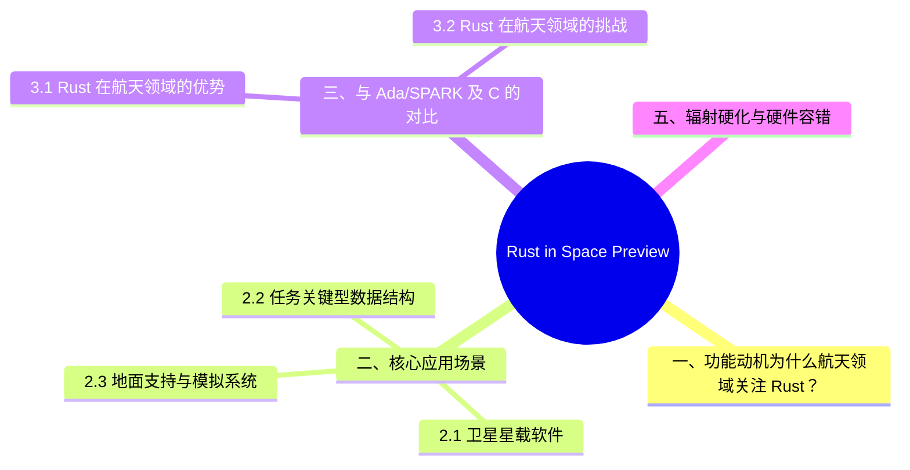

# Rust in Space Preview

> **代码状态**: [伪代码（示意）] — 示例为 no_std 嵌入式/航天场景（含 panic handler 等 target 相关代码），未在 rustc 1.97 host target 单文件场景独立编译验证
>
> **EN**: Rust in Space Preview
> **Summary**: Preview of Rust's adoption in aerospace and safety-critical systems, covering Ferrocene certification, no_std embedded deployment, and comparison with Ada/SPARK.
> **Rust 版本**: 1.97.0+ (Edition 2024)
> **状态**: 📡 生态趋势/预研阶段
> **Rust 属性标记**: N/A（语言特性层面稳定，领域应用仍在扩展）
> **跟踪版本**: stable Rust（核心语言）；Ferrocene（认证工具链）
> **预计稳定**: 随 Ferrocene 等认证路径推进
>
> **受众**: [专家]
> **内容分级**: [综述级]
> **Bloom 层级**: L4-L5
> **权威来源**: 本文件为 `concept/` 权威页。
> **A/S/P 标记**: **S+A+P** — Structure + Application + Procedure
> **双维定位**: P×Eva — 评价 Rust 在太空环境中的适用性
> **前置依赖**: [Embedded Systems](../../06_ecosystem/05_systems_and_embedded/03_embedded_systems.md) · [Unsafe Rust](../../03_advanced/02_unsafe/01_unsafe.md) · [Formal Methods](../../04_formal/04_model_checking/03_aerospace_certification_formal_methods.md)
> **后置延伸**: [Rust for Linux](../04_research_and_experimental/04_rust_for_linux.md) · [Ferrocene](12_ferrocene_preview.md)
> **来源**: [Ferrocene](https://ferrocene.dev/) · [Rust Embedded WG](https://github.com/rust-embedded/wg) · [Rust Reference](https://doc.rust-lang.org/reference/introduction.html) · [TRPL](https://doc.rust-lang.org/book/title-page.html) · [Brown University — Interactive Rust Book](https://rust-book.cs.brown.edu/) · [Jung et al. — RustBelt: Securing the Foundations of Rust](https://plv.mpi-sws.org/rustbelt/popl18/) · [Itanium C++ ABI](https://itanium-cxx-abi.github.io/cxx-abi/abi.html)
> **定理链**: N/A — 描述性/综述性/导航性文档，不涉及形式化定理链
> **来源**: [Rust RFCs](https://github.com/rust-lang/rfcs) · [Inside Rust Blog](https://blog.rust-lang.org/inside-rust/) · [Rust Edition Guide](https://doc.rust-lang.org/edition-guide/index.html)

## 一、功能动机：为什么航天领域关注 Rust？

航天软件对可靠性、确定性和可验证性的要求极高。传统上，这类系统使用 Ada/SPARK、C 或汇编编写，但这些语言各有短板：

- **C/C++**：内存安全（Memory Safety）漏洞是航天任务中常见的故障来源；
- **Ada/SPARK**：形式化验证能力强，但工具链较老、生态较小、与现代开发流程整合困难；
- **Java/Python**：运行时（Runtime）开销和 GC 不确定性不适合硬实时场景。

Rust 提供了：

1. **编译期内存安全（Memory Safety）**：消除 dangling pointer、use-after-free、data race；
2. **零成本抽象（Zero-Cost Abstraction）**：高性能同时保持高级抽象；
3. **现代工具链**：cargo、crates.io、测试、文档一体化；
4. **C 互操作**：便于与现有航天软件遗产集成。

欧洲航天局（ESA）等组织已经开始评估 Rust 作为未来任务的开发语言，Ferrocene 项目则提供 Rust 的安全认证路径。

---

## 二、核心应用场景

航天场景选择 Rust 的判据与选择 C/Ada 的判据一致：**确定性、无 GC 停顿、内存安全（Memory Safety）可审计**。三类场景的差异在约束强度：

| 场景 | 硬约束 | Rust 的卖点 |
|:---|:---|:---|
| 卫星星载软件 | 抗辐射硬件算力弱、在轨更新窗口少 | 编译期内存安全降低在轨缺陷率；`no_std` 适配 RTOS |
| 任务关键数据结构 | 星历/姿态数据的不可变性与校验 | 类型系统（Type System）编码不变式（新类型 + 单位类型） |
| 地面支持与仿真 | 高吞吐遥测处理、与既有 C++ 共存 | FFI 渐进替换 + 零成本并发 |

判定原则：星载代码优先论证"工具链资格"（编译器是否有进入认证流程的路径），语言特性优势排在资格之后。

### 2.1 卫星星载软件

卫星计算机资源受限：CPU 慢、内存小、无操作系统或 RTOS。Rust 的 `no_std` 模式允许在裸机或 RTOS 上运行：

```rust,editable
#![no_std]
#![no_main]

use core::panic::PanicInfo;

#[panic_handler]
fn panic(_info: &PanicInfo) -> ! {
    loop {}
}

#[no_mangle]
pub extern "C" fn satellite_init() {
    // 初始化传感器、通信模块
}
```

### 2.2 任务关键型数据结构

```rust,editable
#![no_std]

pub struct TelemetryFrame {
    pub timestamp: u32,
    pub sensor_id: u8,
    pub value: i32,
    pub checksum: u16,
}

impl TelemetryFrame {
    pub const fn new(timestamp: u32, sensor_id: u8, value: i32) -> Self {
        let mut frame = Self {
            timestamp,
            sensor_id,
            value,
            checksum: 0,
        };
        frame.checksum = frame.compute_checksum();
        frame
    }

    pub const fn compute_checksum(&self) -> u16 {
        (self.timestamp as u16)
            .wrapping_add(self.sensor_id as u16)
            .wrapping_add(self.value as u16)
    }
}
```

### 2.3 地面支持与模拟系统

Rust 也用于任务控制软件、遥测分析、轨道模拟等地面系统，利用其并发安全（Concurrency Safety）和性能优势。

---

## 三、与 Ada/SPARK 及 C 的对比

| 维度 | C | Ada/SPARK | Rust |
|:---|:---|:---|:---|
| 内存安全 | 无保证 | 强（尤其 SPARK） | 编译期保证（所有权（Ownership）系统） |
| 形式化验证 | 有限 | 非常强 | 逐步增强（Kani、Prusti） |
| 生态与现代工具 | 一般 | 较弱 | 强（cargo、crates.io） |
| 实时确定性 | 可做到 | 可做到 | `no_std` + `alloc` 可做到 |
| 认证路径 | 成熟 | 成熟 | Ferrocene 推进中 |
| 学习曲线 | 低 | 中高 | 中高 |

### 3.1 Rust 在航天领域的优势

1. **减少软件缺陷**：所有权（Ownership）系统显著降低内存相关 bug；
2. **现代开发生态**：与 DevOps、CI/CD、容器化流程无缝集成；
3. **活跃的社区**：大量开源库和硬件抽象层（HAL）；
4. **逐步替换能力**：可通过 FFI 与现有 C/Ada 代码共存。

### 3.2 Rust 在航天领域的挑战

1. **认证工具链不成熟**：Ferrocene 仍在推进 DO-178C 等认证；
2. **形式化验证生态不如 SPARK**：Kani、Prusti 仍在发展；
3. **辐射硬化硬件支持**：需要针对特定 MCU 的 target 和 HAL；
4. **团队培训成本高**：Rust 的所有权（Ownership）和生命周期（Lifetimes）概念需要时间掌握。

---

## 四、迁移与采用建议

1. **从地面工具和非关键子系统开始**：积累经验后再进入星载软件；
2. **使用 `no_std` + `alloc`**：避免标准库的不可控行为；
3. **最小化 `unsafe` 使用**：将 unsafe 隔离在硬件抽象层；
4. **引入形式化验证工具**：如 Kani 用于关键模块（Module）的属性验证；
5. **跟踪 Ferrocene 认证进展**：对于需要认证的任务，使用 Ferrocene 工具链。

> **版本说明**：Rust 核心语言本身已稳定多年。航天应用依赖的是 `no_std`、`const fn`、FFI 等稳定特性，以及 Ferrocene 等认证工具链。具体任务采用路径取决于认证要求和硬件平台。

---

## 五、辐射硬化与硬件容错

太空环境的高能粒子可能导致位翻转（bit flip）。Rust 的类型安全不能保证硬件级错误，但可以：

1. **减少软件漏洞面**：更少的未定义行为意味着更确定的故障模式；
2. **配合硬件 ECC 和 TMR**：使用三模冗余和错误检测代码；
3. **使用 `no_std` 避免运行时（Runtime）异常**：可预测的执行路径便于故障分析。

## 认知路径

> **认知路径**: 从 Rust 核心语言特性出发，经由 **Rust in Space Preview** 的生态/前沿实践，通向系统化工程能力与未来语言演进方向。

### 核心推理链

| 定理 | 前提 | 结论 | 置信度 |
| :--- | :--- | :--- | :--- |
| Rust in Space Preview 基础原理 ⟹ 正确选型 | 理解核心概念与适用边界 | 能在实际项目中做出合理决策 | 高 |
| Rust in Space Preview 选型实践 ⟹ 常见陷阱 | 忽视版本兼容性与生态成熟度 | 技术债务或迁移成本 | 中 |
| Rust in Space Preview 陷阱规避 ⟹ 深度掌握 | 持续跟踪社区演进与最佳实践 | 能进行架构设计与技术预研 | 高 |

## 嵌入式测验（Embedded Quiz）

理解「嵌入式测验（Embedded Quiz）」需要把握测验 1：为什么航天领域对 Rust 感兴趣？（理解层）、测验 2：Rust 在航天领域相比 Ada/SPARK 有什么优势？（…、测验 3：欧洲航天局（ESA）对 Rust 有什么态度？（理解层）、测验 4：`no_std` 在航天嵌入式系统中有什么用途？（理解层）等5个方面，本节依次展开。

### 测验 1：为什么航天领域对 Rust 感兴趣？（理解层）

**题目**: 为什么航天领域对 Rust 感兴趣？

<details>
<summary>✅ 答案与解析</summary>

航天软件需要极高的可靠性、确定性的资源使用和内存安全（Memory Safety）。Rust 的编译期保证减少了运行时（Runtime）的故障模式，适合卫星和探测器软件。
</details>

> **前置概念**: N/A
> **后置概念**: N/A
---

### 测验 2：Rust 在航天领域相比 Ada/SPARK 有什么优势？（理解层）

**题目**: Rust 在航天领域相比 Ada/SPARK 有什么优势？

<details>
<summary>✅ 答案与解析</summary>

Rust 有更现代的生态（crates.io、cargo）、更活跃的社区和更好的 C 互操作。Ada/SPARK 在形式化验证方面更成熟，但工具链较老。
</details>

---

### 测验 3：欧洲航天局（ESA）对 Rust 有什么态度？（理解层）

**题目**: 欧洲航天局（ESA）对 Rust 有什么态度？

<details>
<summary>✅ 答案与解析</summary>

ESA 正在评估 Rust 用于未来任务，关注其内存安全（Memory Safety）保证和 Ferrocene 认证路径。Rust 被视为 Ada 的潜在补充。
</details>

---

### 测验 4：`no_std` 在航天嵌入式系统中有什么用途？（理解层）

**题目**: `no_std` 在航天嵌入式系统中有什么用途？

<details>
<summary>✅ 答案与解析</summary>

航天设备通常使用裸机或 RTOS，无完整操作系统。`no_std` 使 Rust 可以在这些环境中运行，结合 `alloc` 提供有限的堆分配。
</details>

---

### 测验 5：辐射硬化（Radiation Hardening）对 Rust 程序有什么特殊要求？（理解层）

**题目**: 辐射硬化（Radiation Hardening）对 Rust 程序有什么特殊要求？

<details>
<summary>✅ 答案与解析</summary>

辐射可能导致位翻转（bit flip）。需要使用 ECC 内存、三模冗余（TMR）和错误检测代码。Rust 的类型安全不能防止硬件级错误，但减少了软件漏洞。
</details>

---

## ⚠️ 反例与陷阱：no_std/no_main 缺少 panic_handler

**反例**（rustc 1.97 实测编译失败，无错误码：`#[panic_handler]` function required））：

```rust,compile_fail
#![no_std]
#![no_main]

#[unsafe(no_mangle)]
pub extern "C" fn _start() -> ! { loop {} }
```

太空/嵌入式 bare-metal 场景没有操作系统提供 panic 运行时（Runtime）；`#![no_std]` crate 必须自行定义 `#[panic_handler]`，否则编译期即报错（需 `-C panic=abort`，unwind 在无 std 下不受支持）。

**修正**：

```rust
#![no_std]
#![no_main]
use core::panic::PanicInfo;

#[panic_handler]
fn panic(_info: &PanicInfo) -> ! { loop {} }

#[unsafe(no_mangle)]
pub extern "C" fn _start() -> ! { loop {} }
```

## 🧭 思维导图（Mindmap）


