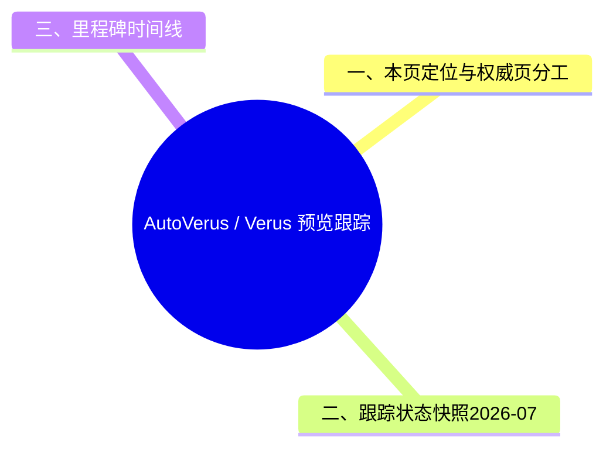

> **内容分级**: [专家级]
> **代码状态**: 📋 预览/研究 — AutoVerus 为 OOPSLA 2025 论文，Verus 活跃开发中
> **定理链**: N/A — 形式化验证工具/AI 辅助证明研究跟踪
>
# AutoVerus / Verus 预览跟踪
>
> **EN**: AutoVerus / Verus Preview Tracking
> **Summary**: L7 预览跟踪页：跟踪 Verus 与 AutoVerus 工具链的版本演进、生态集成与研究动向；概念机制与形式化解读以 L4 权威页为准。
> **Rust 版本**: 1.97.0+ (Edition 2024)
> **受众**: [进阶] 形式化方法、系统软件验证研究者
> **Bloom 层级**: L7（版本与生态跟踪）
> **权威来源**: 本文件为 L7 预览跟踪页（版本/生态动向），非概念权威页；Verus / AutoVerus 的概念机制、三段式程序结构、评估数据与反命题的权威解释见
> [concept/04_formal/04_model_checking/07_autoverus.md](../../04_formal/04_model_checking/07_autoverus.md)。
> **A/S/P 标记**: **S+A** — Structure + Application
> **双维定位**: C×Eva
> **前置依赖**: [形式化验证](../../04_formal/04_model_checking/01_verification_toolchain.md) · [形式化验证工具生态](../../06_ecosystem/08_formal_verification/02_formal_verification_tools.md)
> **后置延伸**: [Safety Tags](03_safety_tags_preview.md) · [BorrowSanitizer](24_borrow_sanitizer.md) · [Tree Borrows](../../04_formal/01_ownership_logic/05_tree_borrows_deep_dive.md)
>
> **来源**: [Verus GitHub](https://github.com/verus-lang/verus) · [Verus 文档](https://verus-lang.github.io/verus/guide/) · [AutoVerus 论文 (OOPSLA 2025)](https://doi.org/10.1145/3763174) · [arXiv 版本](https://arxiv.org/abs/2409.13082) · [Rust Reference — Unsafe Blocks](https://doc.rust-lang.org/reference/unsafe-blocks.html) · [TRPL](https://doc.rust-lang.org/book/title-page.html) · [Brown University — Interactive Rust Book](https://rust-book.cs.brown.edu/) · [Itanium C++ ABI](https://itanium-cxx-abi.github.io/cxx-abi/abi.html)
> **前置概念**: N/A
> **后置概念**: N/A
---

## 一、本页定位与权威页分工

| 页面 | 层级 | 职责 |
|:---|:---|:---|
| [AutoVerus / Verus 自动证明生态](../../04_formal/04_model_checking/07_autoverus.md) | L4-L5 概念权威页 | 权威定义、三段式程序结构、证明自动化原理、工具对比、反命题与边界、测验 |
| 本页 | L7 预览跟踪页 | 版本里程碑时间线、生态集成动向、采用风险观察、跟踪源索引 |

两页刻意分工：概念机制只在 L4 页维护，本页不复制其正文，仅保留随时间变化的跟踪信息。

---

## 二、跟踪状态快照（2026-07）

| 组件 | 状态 | 跟踪源 |
|:---|:---|:---|
| Verus 语言与 Z3 验证流水线 | 🟢 活跃开发，vstd 标准库规格持续扩充 | [verus-lang/verus](https://github.com/verus-lang/verus) |
| AutoVerus（LLM 自动证明） | 🟡 论文成果（OOPSLA 2025），尚未进入主流工具链 | [DOI 10.1145/3763174](https://doi.org/10.1145/3763174) |
| Verus-Bench 基准 | 🟢 已发布（150 个非平凡证明任务） | [arXiv 2409.13082](https://arxiv.org/abs/2409.13082) |
| 与 Rust 主线集成 | ⚪ 无 RFC / MCP，属外部工具链 | — |

---

## 三、里程碑时间线

| 时间 | 里程碑 |
|:---|:---|
| 2023 | Verus 论文发表于 OOPSLA |
| 2024 | Verus 在 SOSP 展示系统代码验证案例；vstd 标准库规格不断丰富 |
| 2025 | AutoVerus 论文发表于 OOPSLA；Verus-Bench 发布 |
| 2026 | Verus 持续活跃开发；社区探索与 Safety Tags、Kani、BorrowSanitizer 的集成 |

---

## 四、生态集成动向

- **Safety Tags**：安全标签若成为 unsafe 契约的机器可读格式，可为 Verus 规格提供自动生成来源，参见 [Safety Tags 预览](03_safety_tags_preview.md)。
- **Kani / BorrowSanitizer**：模型检查与动态别名验证覆盖 Verus 不擅长的有界状态与运行时别名场景，三者互补而非竞争，参见 [BorrowSanitizer](24_borrow_sanitizer.md) 与 [Miri](../../04_formal/04_model_checking/08_miri.md)。
- **Rust Project Goals**：截至 2026-07 未见将 SMT 验证纳入官方目标，跟踪 [rust-project-goals](https://rust-lang.github.io/rust-project-goals/) 后续周期。

---

## 五、采用风险观察

- **基准饱和风险**：Verus-Bench 成功率已 >90%，后续研究需更难基准才能区分方法优劣。
- **工具链漂移**：Verus 语言快速迭代，基于其上的自动化研究（含 AutoVerus 类系统）需持续适配，论文结果的可复现性随时间衰减。
- **规格瓶颈未解**：自动化目前只覆盖证明生成，规格撰写仍是人工瓶颈——这是采用成本的主要观察点。

---

## 相关概念

- [AutoVerus / Verus 自动证明生态（L4 权威页）](../../04_formal/04_model_checking/07_autoverus.md)
- [形式化验证](../../04_formal/04_model_checking/01_verification_toolchain.md)
- [形式化验证工具生态](../../06_ecosystem/08_formal_verification/02_formal_verification_tools.md)
- [Safety Tags 预览](03_safety_tags_preview.md)
- [BorrowSanitizer](24_borrow_sanitizer.md) · [深度形式化](../../04_formal/02_separation_logic/04_borrow_sanitizer_in_formal.md)
- [Tree Borrows 深度解析](../../04_formal/01_ownership_logic/05_tree_borrows_deep_dive.md) · [Miri](../../04_formal/04_model_checking/08_miri.md)

---

## ⚠️ 反例与陷阱：`verus!` 宏需要 Verus 工具链

**反例**（rustc 1.97 实测编译失败，无错误码：cannot find macro））：

```rust,compile_fail
verus! {
    fn add(a: u64, b: u64) -> u64 { a + b }
}
fn main() {}
```

`verus!` 宏与 `requires`/`ensures` 子语言由 Verus 编译器前端提供；普通 rustc 不认识该宏，验证条件注释在标准工具链下无法编译，必须使用 `verus` 命令。

**修正**：

```rust
// 安装 Verus 后： verus file.rs
// 普通 Rust 等价注释形式（仅文档作用）：
fn add(a: u64, b: u64) -> u64 { a + b }
fn main() {}
```

## 🧭 思维导图（Mindmap）


