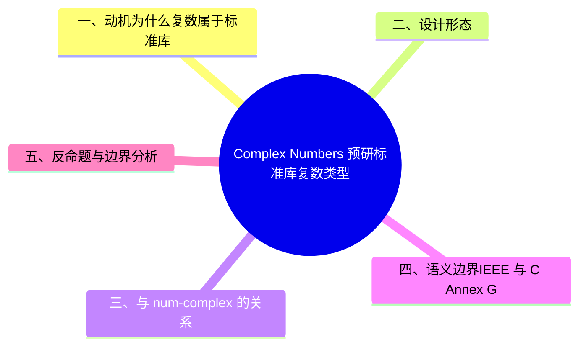

# Complex Numbers 预研：标准库复数类型

> **代码状态**: ℹ️ 设计跟踪页（RFC 已接受，实现尚未合入 nightly；示例为设计草案形态）
>
> **EN**: Complex Numbers Preview
> **Summary**: Preview of `core::num::Complex` (RFC 3892) — a standard-library complex number type providing basic arithmetic, polar/Cartesian conversions, and const-friendly construction, reducing the ecosystem's dependency on external crates for a vocabulary type.
> **Rust 版本**: 1.97.0+ (Edition 2024)
>
> **状态**: 📋 RFC 已接受（rust-lang/rfcs#3892 merged），实现待定
> **Rust 属性标记**: `#[experimental]` `#[rfc_accepted]`
> **跟踪版本**: 无 feature gate（实现未开始）
> **预计稳定**: 待定
>
> **受众**: [专家]
> **内容分级**: [实验级]
> **Bloom 层级**: L2-L3
> **权威来源**: 本文件为 `concept/` 权威页。
> **A/S/P 标记**: **S** — Structure
> **双维定位**: C×Ana — 分析复数类型设计
> **定位**: 跟踪 [RFC 3892](https://rust-lang.github.io/rfcs/3892-complex-numbers.html) 提议的标准库复数类型（Complex Number），说明其设计动机、API 形态与对数值生态（`num-complex` 等）的影响。
> **前置概念**: [数值类型与运算](../../01_foundation/02_type_system/03_numerics.md) · [Newtype 与包装器模式](../../02_intermediate/04_types_and_conversions/03_newtype_and_wrapper.md)
> **后置概念**: [f16 / f128 预研](35_f16_f128_preview.md) · [Version Tracking](../00_version_tracking/01_rust_version_tracking.md) · [Machine Learning 生态](../../06_ecosystem/11_domain_applications/13_machine_learning_ecosystem.md)
> **定理链**: N/A — 描述性/跟踪性文档，不涉及形式化定理链
---

> **来源**: [RFC 3892 — Complex Numbers](https://rust-lang.github.io/rfcs/3892-complex-numbers.html) ·
> [Rust Reference — Numeric Types](https://doc.rust-lang.org/reference/types/numeric.html) ·
> [num-complex crate](https://docs.rs/num-complex) ·
> [C11 Annex G — Complex arithmetic](https://en.cppreference.com/w/c/numeric/complex)
> **国际权威来源（2026-07-13 补录）**: **P1** [Goldberg — What Every Computer Scientist Should Know About Floating-Point Arithmetic（ACM Computing Surveys 23(1), 1991）](https://dl.acm.org/doi/10.1145/103162.103163)（复数运算的浮点误差语义基础；curl 实测 2026-07-13，ACM 反爬注记同前页）

## 📑 目录

- [Complex Numbers 预研：标准库复数类型](#complex-numbers-预研标准库复数类型)
  - [📑 目录](#-目录)
  - [一、动机：为什么复数属于标准库](#一动机为什么复数属于标准库)
  - [二、设计形态](#二设计形态)
  - [三、与 num-complex 的关系](#三与-num-complex-的关系)
  - [四、语义边界：IEEE 与 C Annex G](#四语义边界ieee-与-c-annex-g)
  - [五、反命题与边界分析](#五反命题与边界分析)
  - [权威来源索引](#权威来源索引)
  - [⚠️ 反例与陷阱：虚数字面量后缀不存在](#️-反例与陷阱虚数字面量后缀不存在)
  - [🧭 思维导图（Mindmap）](#-思维导图mindmap)

## 一、动机：为什么复数属于标准库

RFC 3892 §Motivation 的论证主线：

1. **词汇类型（Vocabulary Type）缺口**：复数是数学、信号处理（DSP）、量子计算、电磁仿真的基础词汇类型，但 `core`/`std` 缺位导致每个数值 crate 要么依赖 `num-complex`，要么自定义不兼容的 `Complex`，生态互操作成本高。
2. **`no_std` 可用性**：嵌入式 DSP（如 Cortex-M 的 FFT）需要 `core` 级复数；外部 crate 的 `std` 依赖链常成为障碍。
3. **与 `f16`/`f128` 的协同**：[RFC 3453](35_f16_f128_preview.md) 扩展浮点谱系后，`Complex<f16>` 等组合类型的需求随之出现，标准库是定义该组合的自然位置。

## 二、设计形态

RFC 3892 提议的最小 API（§Guide-level explanation，设计草案，最终实现可能调整）：

```rust,ignore
// 设计草案形态（RFC 3892，尚未实现）
pub struct Complex<T> {
    pub re: T,
    pub im: T,
}

impl<T> Complex<T> {
    pub const fn new(re: T, im: T) -> Self;
}

// 算术：Add/Sub/Mul/Div（含标量混合运算）
// 转换：from_polar / to_polar（f32/f64 实现）
// 常用常量：Complex::I（虚数单位）
```

设计约束：

- **泛型标量**：`Complex<T>` 对标量类型泛型，算术 impl 约束在 `T: Float` 能力集上（具体 trait 边界依赖 [RFC 3514 浮点语义](../../01_foundation/02_type_system/03_numerics.md) 的既有 trait）。
- **`const fn` 优先**：构造与访问器均为 `const fn`，服务编译期常量表（如 FFT 旋转因子表）。
- **布局透明**：`#[repr(C)]` 等价的双字段布局，与 C99 `double _Complex`、C++ `std::complex<double>` 的数组式 ABI 兼容（FFI 友好）。

## 三、与 num-complex 的关系

| 维度 | `num-complex`（生态） | `core::num::Complex`（RFC 3892） |
|:---|:---|:---|
| 功能广度 | 完整（含 transcendental 函数、serde、rand 集成） | 最小核心（构造、算术、极坐标） |
| 依赖 | `num-traits` 链 | 零依赖（`core` 内置） |
| 演进节奏 | crate 自主 semver | 跟随语言发布列车（Release Train） |
| 迁移路径 | 可作为超集继续存在，内部委托标准类型 | 成为互操作公共类型 |

RFC 明确**不取代** `num-complex` 的高级功能，目标是定义公共词汇类型，类似 `std::time::Duration` 与 `chrono` 的关系。

## 四、语义边界：IEEE 与 C Annex G

复数算术的难点不在实部/虚部公式，而在**特殊值传播**：

- C11 Annex G 规定 `_Complex` 运算中 NaN/±∞ 的精细传播规则（如 `1 * (inf + i nan)` 的结果）；
- Rust 的 [RFC 3514 浮点语义](../../01_foundation/02_type_system/03_numerics.md) 目前**不**承诺 Annex G 级精细度；
- RFC 3892 因此采取**保守立场**：基本算术遵循朴素公式（naive formula），不承诺 Annex G 的特殊值行为；需要稳健特殊值处理的场景（如高可靠性除法 Smith's algorithm）留给生态 crate。

这是该 RFC 最关键的语义边界：**标准库复数是词汇类型，不是数值稳健性保证**。

## 五、反命题与边界分析

- **反命题 1：「标准库复数会让 num-complex 过时」**——错误。见 §三，二者是词汇层与功能层的关系。
- **反命题 2：「Complex<T> 应当对所有 T: Add+Mul 实现算术」**——RFC 刻意收窄到浮点标量；对整数复数（高斯整数）开放泛型会引入除法语义争议（整除 vs 实数商）。
- **边界**：RFC 接受 ≠ 已实现。截至 2026-07-12，nightly 1.99.0 尚无对应 feature gate；跟踪实现以 RFC 文本与 rust-lang/rust 后续 PR 为准。

## 权威来源索引

> **权威来源**: [RFC 3892 — Complex Numbers](https://rust-lang.github.io/rfcs/3892-complex-numbers.html) ·
> [Rust Reference — Numeric Types](https://doc.rust-lang.org/reference/types/numeric.html) ·
> [num-complex crate](https://docs.rs/num-complex) ·
> [RFC 3514 — Float Semantics](https://rust-lang.github.io/rfcs/3514-float-semantics.html) ·
> [C11 Annex G — Complex arithmetic](https://en.cppreference.com/w/c/numeric/complex)
>
> 以上链接于 2026-07-12 经 curl 实测全部返回 HTTP 200。

---

## ⚠️ 反例与陷阱：虚数字面量后缀不存在

**反例**（rustc 1.97 实测编译失败，无错误码：invalid suffix））：

```rust,compile_fail
fn main() {
    let z = 1.0 + 2.0i;
    println!("{z}");
}
```

Rust 没有 Python 式虚数字面量，`2.0i` 被解析为非法后缀；标准库复数类型（`std::complex`）尚在预研，当前需用 `num_complex` crate 或自建类型。

**修正**：

```rust
struct Complex { re: f64, im: f64 }
fn main() {
    let z = Complex { re: 1.0, im: 2.0 };
    println!("{}+{}i", z.re, z.im);
}
```

## 🧭 思维导图（Mindmap）


