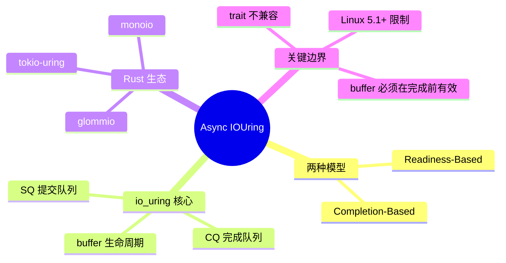

> **内容分级**: [专家级]

# Async IO: io_uring 与 completion-based 异步 IO 预研
>
> **EN**: Async IOUring and Completion-Based Async IO Preview
> **Summary**: A preview of completion-based asynchronous IO in Rust, centered on Linux io_uring, contrasting it with the current readiness-based `AsyncRead`/`AsyncWrite` ecosystem, and tracking stable/nightly tooling, ecosystem crates, and migration implications.
> **Rust 版本**: 1.97.0+ (Edition 2024)
> **受众**: [专家]
> **Bloom 层级**: L7-L3
> **权威来源**: 本文件为 `concept/` 权威页 / 预研跟踪页。
> **A/S/P 标记**: **S+P** — Structure + Procedure
> **双维定位**: C×Ana — 分析 readiness-based 与 completion-based IO 的语义差异
> **定位**: 响应 Async Book 新版对 "Async IO: readiness vs completion, and io_uring" 的跟踪需求，为 Rust 异步 IO 从 readiness 模型向 completion 模型演进建立概念锚点。
>
> **前置概念**: [Async/Await](../../03_advanced/01_async/01_async.md) · [Future and Executor Mechanisms](../../03_advanced/01_async/04_future_and_executor_mechanisms.md) · [Stream Algebra and Backpressure](../../03_advanced/01_async/09_stream_algebra_and_backpressure.md)
> **后置概念**: [Tokio Runtime Internals](../../06_ecosystem/04_web_and_networking/10_tokio_runtime_internals.md) · [Network Programming](../../03_advanced/06_low_level_patterns/04_network_programming.md)
>
> **来源**:
> [Async Book (WIP)](https://rust-lang.github.io/async-book/01_getting_started/01_chapter.html) ·
> [Linux io_uring](https://kernel.org/doc/html/latest/block/io_uring.html) ·
> [tokio-rs/tokio-uring](https://github.com/tokio-rs/tokio-uring) ·
> [glommio](https://github.com/DataDog/glommio) ·
> [RFC 3610 — Async Fn in Traits](https://rust-lang.github.io/rfcs//3610-project-exploit-rust.html)

---

> **对应 Crate**: 见 [`c06_async`](../../crates/c06_async)
> **对应练习**: 见 [`exercises/src/async_programming/`](../../exercises/src/async_programming)

## 🧠 知识结构图



## 📑 目录

- [Async IO: io\_uring 与 completion-based 异步 IO 预研](#async-io-io_uring-与-completion-based-异步-io-预研)
  - [🧠 知识结构图](#-知识结构图)
  - [📑 目录](#-目录)
  - [一、背景与问题](#一背景与问题)
  - [二、Readiness-Based vs Completion-Based 模型对比](#二readiness-based-vs-completion-based-模型对比)
  - [三、io\_uring 核心机制](#三io_uring-核心机制)
  - [四、Rust 生态现状](#四rust-生态现状)
  - [五、与当前 Async Trait 的兼容性问题](#五与当前-async-trait-的兼容性问题)
  - [六、迁移与选型决策树](#六迁移与选型决策树)
  - [七、反命题与边界](#七反命题与边界)
    - [反例：在 IO 完成前释放 buffer](#反例在-io-完成前释放-buffer)
  - [八、参考来源](#八参考来源)

---

## 一、背景与问题

当前 Rust 异步 IO 生态（Tokio、async-std、futures-rs）基于 **readiness-based** 模型：

- 任务向 Reactor 注册对某 fd 的兴趣（可读/可写）。
- Reactor 通过 epoll/kqueue/IOCP 等待 fd 就绪。
- 就绪后唤醒任务，任务再发起真正的 `read`/`write` 系统调用。

该模型的问题：

1. **两次系统调用**：一次 poll 就绪，一次实际 IO。
2. **数据拷贝**：用户态 ↔ 内核态之间多次拷贝。
3. **线程池阻塞**：真异步文件 IO 需要 `spawn_blocking` 模拟。
4. **扩展性瓶颈**：高并发下 epoll 的 O(n) 就绪事件处理与锁竞争。

**io_uring**（Linux 5.1+）提供 **completion-based** 模型，将 IO 请求通过共享环形队列提交给内核，内核完成后回写结果，用户态通过另一环形队列消费完成事件。该模型可显著降低 syscall 开销并支持真正的异步文件 IO。

---

## 二、Readiness-Based vs Completion-Based 模型对比

| 维度 | Readiness-Based (epoll + AsyncRead/AsyncWrite) | Completion-Based (io_uring) |
|:---|:---|:---|
| **触发时机** | fd 可读/可写时唤醒任务 | 请求完成时唤醒任务 |
| **syscall 次数** | 2+（poll + read/write） | 0–1（批量提交/收割） |
| **文件 IO** | 通常走 `spawn_blocking` | 原生支持真异步文件 IO |
| **内存模型** | 用户态 buffer 在 syscall 时传入 | buffer 在提交时即被内核访问 |
| **缓冲区生命周期** | 短（syscall 期间） | 长（提交到完成之间） |
| **编程模型** | poll → await read/write | submit → await completion |
| **生态成熟度** | 极高（Tokio 等） |  growing（tokio-uring、glommio、monoio） |
| **可移植性** | Linux/macOS/Windows | 主要 Linux 5.1+ |

**关键语义差异**：

- **Readiness**：调用者拥有 buffer，内核通知“可以开始 IO”。
- **Completion**：调用者提交 buffer 给内核，内核完成 IO 后通知调用者；buffer 在提交后必须保持有效且不可变（对 read）或稳定（对 write），直到完成事件返回。

---

## 三、io_uring 核心机制

```text
io_uring 结构:

  用户态                    内核态
    │                         │
    │  1. push SQE            │
    ▼                         ▼
 ┌─────────┐              ┌─────────┐
 │ SQ ring │ ───────────► │ 内核处理 │
 │ (提交队列)│              │ 请求    │
 └─────────┘              └─────────┘
                               │
                               │ 2. 完成
                               ▼
                            ┌─────────┐
                            │ CQ ring │
                            │ (完成队列)│
                            └─────────┘
                               │
                               │ 3. pop CQE
                               ▼
                            用户态消费
```

三个关键操作：

1. **io_uring_setup**：创建一对共享内存环形队列（Submission Queue / Completion Queue）。
2. **io_uring_enter**：通知内核有新提交（SQE）或等待完成（CQE）。
3. **buffer 管理**：
   - 固定 buffer（`IORING_REGISTER_BUFFERS`）减少 pinning 开销
   - 或显式管理 buffer 生命周期，防止在 IO 完成前释放/修改

---

## 四、Rust 生态现状

| Crate | 定位 | 状态 |
|:---|:---|:---|
| `tokio-uring` | Tokio 的 io_uring 后端 | 活跃，适合已有 Tokio 生态 |
| `glommio` | Thread-per-core + io_uring | 活跃，DataDog 主导 |
| `monoio` | 纯 io_uring runtime（字节跳动） | 活跃，强调极致性能 |
| `iou` / `io-uring` | 底层 io_uring 绑定 | 底层库 |
| `async-fs` | 跨平台异步文件 IO（基于 thread pool） | 与 io_uring 无关，对比项 |

**std 状态**：

- `std` 目前未直接暴露 io_uring API。
- 社区讨论中存在“std 异步 IO trait 是否应支持 completion-based”的长期争议。
- `AsyncRead` / `AsyncWrite` 的接口契约基于 readiness，无法直接表达 buffer 在提交到完成之间的长期借用约束。

---

## 五、与当前 Async Trait 的兼容性问题

当前 `AsyncRead` / `AsyncWrite` trait 的签名：

```rust,ignore
pub trait AsyncRead {
    fn poll_read(
        self: Pin<&mut Self>,
        cx: &mut Context<'_>,
        buf: &mut ReadBuf<'_>,
    ) -> Poll<io::Result<()>>;
}
```

问题：

1. `poll_read` 在返回 `Pending` 时，buffer 仍由调用者持有；但 io_uring 需要在提交时就锁定 buffer。
2. `ReadBuf` 的初始化状态语义与 completion-based 的“提交后内核写入”不完全一致。
3. 借用生命周期：io_uring 要求 buffer 在 `submit` 到 `complete` 之间有效，而 readiness trait 只在 `poll_read` 调用期间借用。

**可能演进方向**（预研性质，未稳定）：

- 新增 `AsyncBufRead` / `AsyncIoUringRead` 等 completion-aware trait
- 通过 GAT 或 RPITIT 表达长期 buffer 借用
- 或保持 trait 不变，由 runtime 内部做 buffer 池与 pinning 抽象

---

## 六、迁移与选型决策树

```text
是否需要异步文件 IO?
├── 否 → 继续使用 Tokio / async-std（readiness-based）
│
└── 是
    ├── 是否仅在 Linux 5.1+ 部署?
    │   ├── 否 → spawn_blocking / async-fs 跨平台方案
    │   └── 是
    │       ├── 是否已有 Tokio 生态?
    │       │   ├── 是 → tokio-uring
    │       │   └── 否 → glommio / monoio（thread-per-core）
    │       └──
    └── 是否追求极致延迟/吞吐?
        ├── 是 → glommio / monoio
        └── 否 → tokio-uring
```

---

## 七、反命题与边界

- **“io_uring 总是比 epoll 快”**：不成立。低并发、小消息场景下，io_uring 的 setup 和 buffer pinning  overhead 可能抵消收益；性能优势主要体现在高并发文件/网络 IO。
- **“io_uring 可以替代所有 AsyncRead/AsyncWrite”**：不成立。readiness trait 生态庞大，completion-based API 与之不直接兼容，短期内将是并存局面。
- **边界**：io_uring 的 buffer 安全模型要求调用者保证 buffer 在提交到完成期间有效，错误管理会导致内核级 UB 或数据损坏。

### 反例：在 IO 完成前释放 buffer

以下代码展示了一个典型的 completion-based IO 错误：buffer 在提交后被释放/重用，但内核仍在向其写入数据。

```rust,ignore
use tokio_uring::fs::File;

async fn unsound_read() -> std::io::Result<()> {
    let file = File::open("data.bin").await?;
    let mut buf = vec![0u8; 4096];
    // 错误：将指向栈/堆 buffer 的操作提交给内核后
    let op = file.read_at(buf, 0);
    drop(buf); // 在操作完成前释放/重用 buffer
    let (res, _buf) = op.await; // 内核可能已写入被释放的内存
    res
}
```

正确做法：使用 `tokio-uring` 的 ownership 语义（操作拿走 buffer，完成后归还），或确保 buffer 在 `await` 期间保持固定有效。

---

## 八、参考来源

- Linux Kernel io_uring docs: <https://kernel.org/doc/html/latest/block/io_uring.html>
- tokio-uring: <https://github.com/tokio-rs/tokio-uring>
- glommio: <https://github.com/DataDog/glommio>
- monoio: <https://github.com/bytedance/monoio>
- Async Book (WIP): <https://rust-lang.github.io/async-book/>
